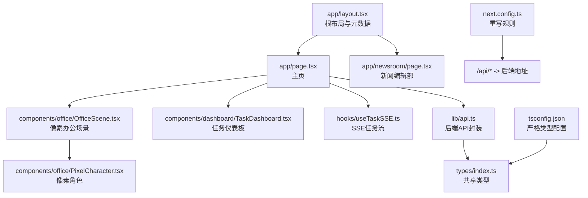
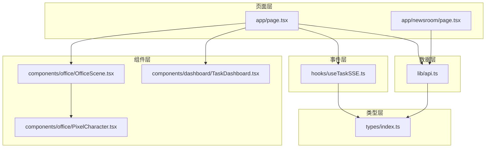
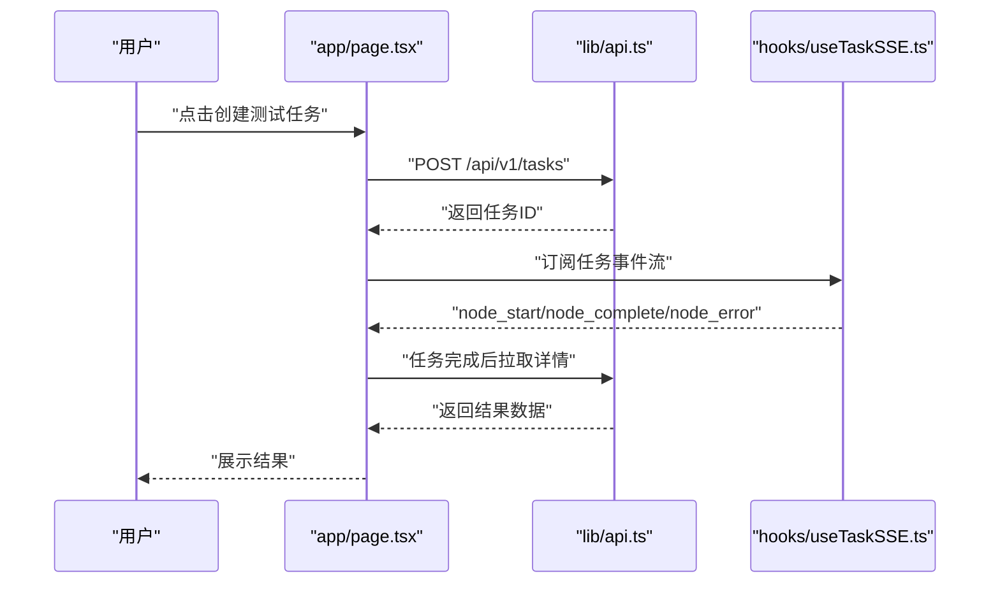
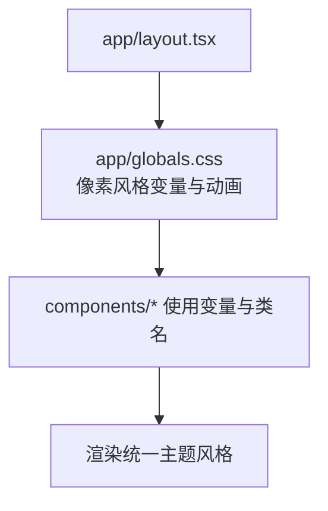
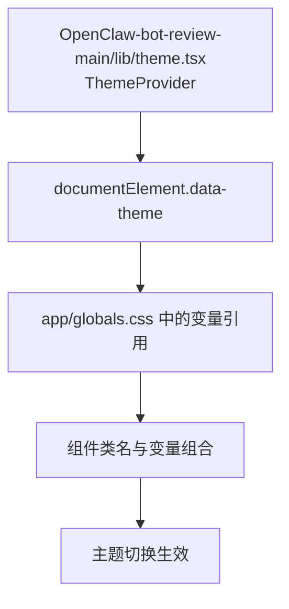
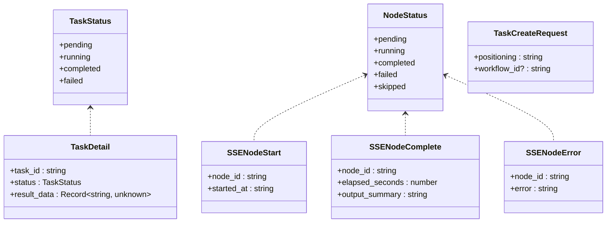
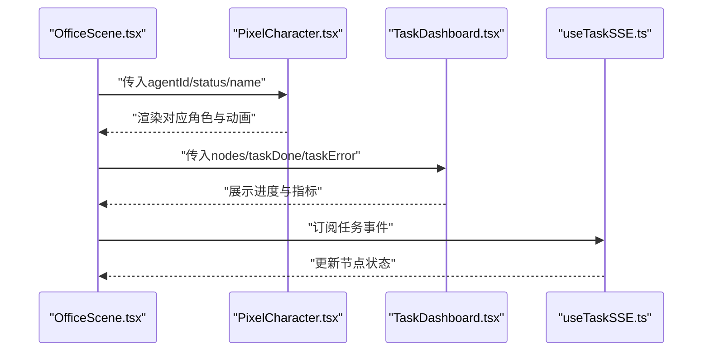
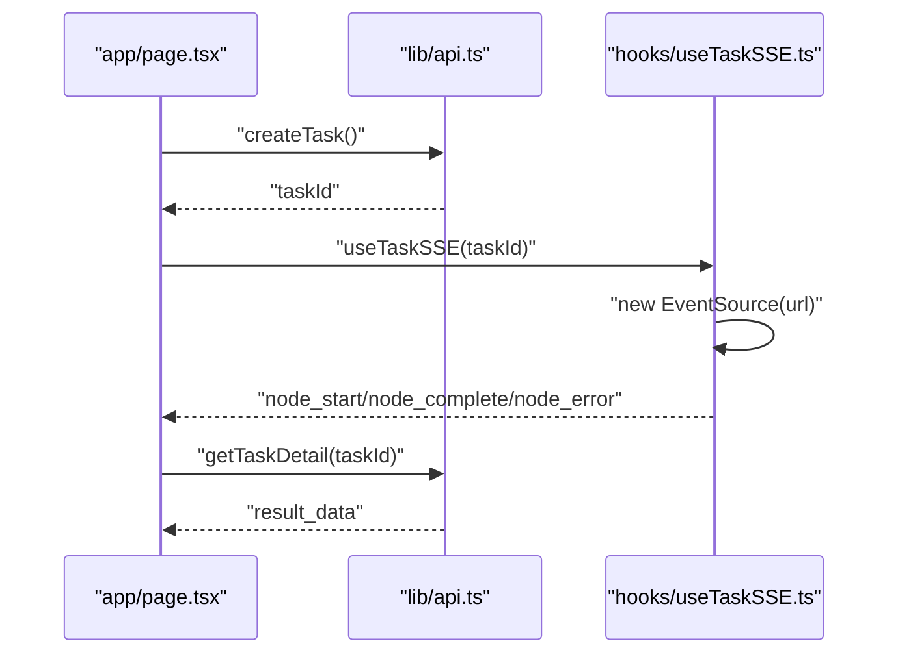
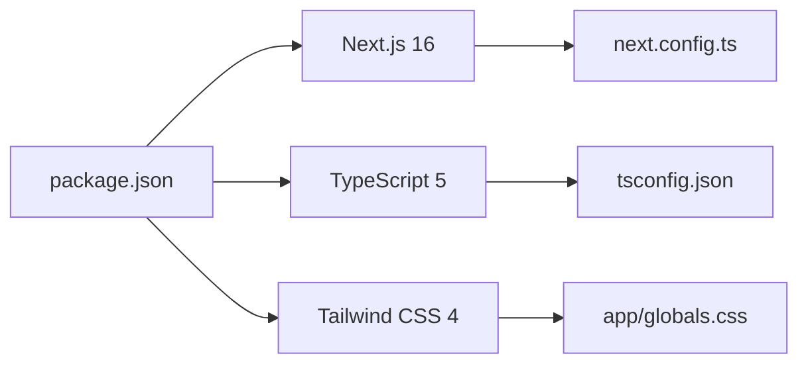

# 前端架构设计

<cite>
**本文引用的文件**
- [package.json](file://frontend/package.json)
- [next.config.ts](file://frontend/next.config.ts)
- [tsconfig.json](file://frontend/tsconfig.json)
- [app/layout.tsx](file://frontend/app/layout.tsx)
- [app/page.tsx](file://frontend/app/page.tsx)
- [app/newsroom/page.tsx](file://frontend/app/newsroom/page.tsx)
- [hooks/useTaskSSE.ts](file://frontend/hooks/useTaskSSE.ts)
- [lib/api.ts](file://frontend/lib/api.ts)
- [types/index.ts](file://frontend/types/index.ts)
- [components/dashboard/TaskDashboard.tsx](file://frontend/components/dashboard/TaskDashboard.tsx)
- [components/office/OfficeScene.tsx](file://frontend/components/office/OfficeScene.tsx)
- [components/office/PixelCharacter.tsx](file://frontend/components/office/PixelCharacter.tsx)
- [app/enhanced-page.tsx](file://frontend/app/enhanced-page.tsx)
- [OpenClaw-bot-review-main/lib/theme.tsx](file://OpenClaw-bot-review-main/lib/theme.tsx)
</cite>

## 目录
1. [引言](#引言)
2. [项目结构](#项目结构)
3. [核心组件](#核心组件)
4. [架构总览](#架构总览)
5. [详细组件分析](#详细组件分析)
6. [依赖关系分析](#依赖关系分析)
7. [性能考虑](#性能考虑)
8. [故障排查指南](#故障排查指南)
9. [结论](#结论)
10. [附录](#附录)

## 引言
本文件面向HotClaw前端团队与读者，系统性梳理基于Next.js的应用架构设计，重点覆盖：
- App Router路由与页面结构
- 布局系统与全局样式
- 主题与CSS-in-JS实践
- TypeScript类型体系与类型安全
- 目录结构与模块化组织
- 构建配置与开发体验
- 性能优化、代码分割与懒加载
- 架构决策的技术考量与最佳实践

目标是帮助初学者快速理解Next.js核心概念，同时为高级开发者提供扩展与优化建议。

## 项目结构
HotClaw前端采用Next.js App Router目录结构，结合功能域划分与共享层组织：
- 应用入口与根布局：app/layout.tsx定义全局元数据与根容器
- 页面与路由：app/page.tsx、app/newsroom/page.tsx等作为页面级组件
- 组件库：components/下按功能域拆分（如office、dashboard）
- 工具与类型：hooks/、lib/、types/提供可复用逻辑与类型定义
- 构建与配置：next.config.ts、tsconfig.json、package.json等

**图表来源**
- [app/layout.tsx:1-16](file://frontend/app/layout.tsx#L1-L16)
- [app/page.tsx:1-95](file://frontend/app/page.tsx#L1-L95)
- [app/newsroom/page.tsx:1-800](file://frontend/app/newsroom/page.tsx#L1-L800)
- [components/office/OfficeScene.tsx:1-428](file://frontend/components/office/OfficeScene.tsx#L1-L428)
- [components/dashboard/TaskDashboard.tsx:1-176](file://frontend/components/dashboard/TaskDashboard.tsx#L1-L176)
- [components/office/PixelCharacter.tsx:1-83](file://frontend/components/office/PixelCharacter.tsx#L1-L83)
- [hooks/useTaskSSE.ts:1-124](file://frontend/hooks/useTaskSSE.ts#L1-L124)
- [lib/api.ts:1-110](file://frontend/lib/api.ts#L1-L110)
- [types/index.ts:1-119](file://frontend/types/index.ts#L1-L119)
- [next.config.ts:1-15](file://frontend/next.config.ts#L1-L15)
- [tsconfig.json:1-42](file://frontend/tsconfig.json#L1-L42)

**章节来源**
- [package.json:1-23](file://frontend/package.json#L1-L23)
- [next.config.ts:1-15](file://frontend/next.config.ts#L1-L15)
- [tsconfig.json:1-42](file://frontend/tsconfig.json#L1-L42)
- [app/layout.tsx:1-16](file://frontend/app/layout.tsx#L1-L16)

## 核心组件
- 根布局与元数据：在根布局中注入全局样式与基础元信息，确保所有页面一致的主题与字体基线
- 主页与新闻编辑部：分别承载“任务驱动的像素场景”和“Canvas像素编辑部”的不同交互范式
- 任务SSE钩子：统一订阅任务节点状态变更，驱动UI实时更新
- API客户端：集中处理请求、错误与响应格式，屏蔽后端细节
- 类型系统：通过共享类型定义保证前后端契约一致与编译期安全

**章节来源**
- [app/page.tsx:1-95](file://frontend/app/page.tsx#L1-L95)
- [app/newsroom/page.tsx:1-800](file://frontend/app/newsroom/page.tsx#L1-L800)
- [hooks/useTaskSSE.ts:1-124](file://frontend/hooks/useTaskSSE.ts#L1-L124)
- [lib/api.ts:1-110](file://frontend/lib/api.ts#L1-L110)
- [types/index.ts:1-119](file://frontend/types/index.ts#L1-L119)

## 架构总览
HotClaw前端采用“页面即组件 + 事件驱动 + 类型安全”的架构模式：
- 页面层：App Router页面负责组合业务组件与交互逻辑
- 事件层：SSE订阅任务节点状态，驱动UI状态更新
- 数据层：API客户端封装HTTP请求与错误处理
- 类型层：共享类型定义贯穿前后端，保障一致性
- 样式层：Tailwind + 自定义CSS变量 + 动画，形成像素风格主题

**图表来源**
- [app/page.tsx:1-95](file://frontend/app/page.tsx#L1-L95)
- [app/newsroom/page.tsx:1-800](file://frontend/app/newsroom/page.tsx#L1-L800)
- [components/office/OfficeScene.tsx:1-428](file://frontend/components/office/OfficeScene.tsx#L1-L428)
- [components/dashboard/TaskDashboard.tsx:1-176](file://frontend/components/dashboard/TaskDashboard.tsx#L1-L176)
- [components/office/PixelCharacter.tsx:1-83](file://frontend/components/office/PixelCharacter.tsx#L1-L83)
- [hooks/useTaskSSE.ts:1-124](file://frontend/hooks/useTaskSSE.ts#L1-L124)
- [lib/api.ts:1-110](file://frontend/lib/api.ts#L1-L110)
- [types/index.ts:1-119](file://frontend/types/index.ts#L1-L119)

## 详细组件分析

### 页面与路由（App Router）
- 根布局：定义站点元信息与全局样式引入，统一语言与基础容器
- 主页：以“任务创建-事件流-结果拉取”为主线，串联SSE与API调用
- 新闻编辑部：基于Canvas的像素场景，包含角色绘制、交互与状态面板

**图表来源**
- [app/page.tsx:1-95](file://frontend/app/page.tsx#L1-L95)
- [lib/api.ts:1-110](file://frontend/lib/api.ts#L1-L110)
- [hooks/useTaskSSE.ts:1-124](file://frontend/hooks/useTaskSSE.ts#L1-L124)

**章节来源**
- [app/layout.tsx:1-16](file://frontend/app/layout.tsx#L1-L16)
- [app/page.tsx:1-95](file://frontend/app/page.tsx#L1-L95)
- [app/newsroom/page.tsx:1-800](file://frontend/app/newsroom/page.tsx#L1-L800)

### 布局系统与全局样式
- 根布局引入全局样式，设置基础字体与抗锯齿
- 自定义CSS变量定义像素风格配色与动画，形成统一主题
- Tailwind用于通用排版与交互态，像素动画通过原生CSS实现

**图表来源**
- [app/layout.tsx:1-16](file://frontend/app/layout.tsx#L1-L16)
- [app/globals.css:1-119](file://frontend/app/globals.css#L1-L119)

**章节来源**
- [app/layout.tsx:1-16](file://frontend/app/layout.tsx#L1-L16)
- [app/globals.css:1-119](file://frontend/app/globals.css#L1-L119)

### 主题与CSS-in-JS实践
- 主题上下文：提供主题切换与持久化，通过DOM属性与CSS变量联动
- 组件内样式：通过类名与CSS变量实现主题适配，避免内联样式的复杂性
- 像素风格：通过CSS变量与动画实现统一的像素美术风格

**图表来源**
- [OpenClaw-bot-review-main/lib/theme.tsx:1-63](file://OpenClaw-bot-review-main/lib/theme.tsx#L1-L63)
- [app/globals.css:1-119](file://frontend/app/globals.css#L1-L119)

**章节来源**
- [OpenClaw-bot-review-main/lib/theme.tsx:1-63](file://OpenClaw-bot-review-main/lib/theme.tsx#L1-L63)

### TypeScript类型系统与类型安全
- 共享类型：定义任务、节点、SSE事件等核心类型，确保前后端契约一致
- API封装：通过泛型与断言确保请求/响应的数据结构安全
- 组件接口：明确props与状态类型，降低运行时风险

**图表来源**
- [types/index.ts:1-119](file://frontend/types/index.ts#L1-L119)

**章节来源**
- [types/index.ts:1-119](file://frontend/types/index.ts#L1-L119)
- [lib/api.ts:1-110](file://frontend/lib/api.ts#L1-L110)

### 组件与交互（像素办公场景）
- OfficeScene：整合角色、状态面板、访客列表与结果面板，支持右键菜单与抽屉设置
- PixelCharacter：根据状态选择动画与图标，保持像素风格一致性
- TaskDashboard：汇总节点状态、计算成功率与平均耗时，提供可视化仪表盘

**图表来源**
- [components/office/OfficeScene.tsx:1-428](file://frontend/components/office/OfficeScene.tsx#L1-L428)
- [components/office/PixelCharacter.tsx:1-83](file://frontend/components/office/PixelCharacter.tsx#L1-L83)
- [components/dashboard/TaskDashboard.tsx:1-176](file://frontend/components/dashboard/TaskDashboard.tsx#L1-L176)
- [hooks/useTaskSSE.ts:1-124](file://frontend/hooks/useTaskSSE.ts#L1-L124)

**章节来源**
- [components/office/OfficeScene.tsx:1-428](file://frontend/components/office/OfficeScene.tsx#L1-L428)
- [components/office/PixelCharacter.tsx:1-83](file://frontend/components/office/PixelCharacter.tsx#L1-L83)
- [components/dashboard/TaskDashboard.tsx:1-176](file://frontend/components/dashboard/TaskDashboard.tsx#L1-L176)

### API与SSE集成
- API客户端：统一前缀、错误处理与响应解包，屏蔽网络细节
- SSE钩子：初始化EventSource、监听节点事件、聚合状态并暴露重置能力
- 页面集成：在任务ID变化时自动建立连接，任务完成后关闭并触发结果拉取

**图表来源**
- [lib/api.ts:1-110](file://frontend/lib/api.ts#L1-L110)
- [hooks/useTaskSSE.ts:1-124](file://frontend/hooks/useTaskSSE.ts#L1-L124)
- [app/page.tsx:1-95](file://frontend/app/page.tsx#L1-L95)

**章节来源**
- [lib/api.ts:1-110](file://frontend/lib/api.ts#L1-L110)
- [hooks/useTaskSSE.ts:1-124](file://frontend/hooks/useTaskSSE.ts#L1-L124)

## 依赖关系分析
- 构建与工具链：Next.js 16、TypeScript 5、Tailwind CSS 4
- 开发体验：TurboPack启用、严格类型检查、路径别名
- 运行时：App Router页面、客户端组件、服务端重写

**图表来源**
- [package.json:1-23](file://frontend/package.json#L1-L23)
- [next.config.ts:1-15](file://frontend/next.config.ts#L1-L15)
- [tsconfig.json:1-42](file://frontend/tsconfig.json#L1-L42)
- [app/globals.css:1-119](file://frontend/app/globals.css#L1-L119)

**章节来源**
- [package.json:1-23](file://frontend/package.json#L1-L23)
- [next.config.ts:1-15](file://frontend/next.config.ts#L1-L15)
- [tsconfig.json:1-42](file://frontend/tsconfig.json#L1-L42)

## 性能考虑
- 代码分割：App Router按页面自动分割，减少首屏体积
- 懒加载：Canvas与图片资源按需加载，避免阻塞主线程
- 事件流：SSE仅在需要时建立连接，任务完成后及时关闭
- 样式：Tailwind按需生成，CSS变量减少重复样式定义
- 类型：严格类型检查在编译期发现潜在问题，降低运行时开销

[本节为通用性能建议，无需特定文件引用]

## 故障排查指南
- API错误：统一在API客户端中抛出错误，页面捕获并提示
- SSE连接：检查重写规则是否正确转发/api/*至后端
- 任务状态：确认SSE事件名称与数据结构与后端一致
- 主题切换：确认localStorage保存与documentElement属性同步

**章节来源**
- [lib/api.ts:1-110](file://frontend/lib/api.ts#L1-L110)
- [next.config.ts:1-15](file://frontend/next.config.ts#L1-L15)
- [hooks/useTaskSSE.ts:1-124](file://frontend/hooks/useTaskSSE.ts#L1-L124)
- [OpenClaw-bot-review-main/lib/theme.tsx:1-63](file://OpenClaw-bot-review-main/lib/theme.tsx#L1-L63)

## 结论
HotClaw前端以Next.js App Router为核心，结合事件驱动与类型安全，构建了可维护、可扩展且具备像素风格的交互界面。通过清晰的目录结构、模块化组件与严格的类型约束，既满足初学者的学习曲线，也为高级开发者提供了良好的扩展空间。建议持续关注代码分割与懒加载策略，配合SSE与Canvas渲染优化，进一步提升用户体验与性能表现。

## 附录
- 目录结构设计原则
  - 功能域优先：components/下按功能域拆分，便于复用与测试
  - 页面即组件：app/下的页面直接组合业务组件，职责清晰
  - 共享层：lib/、types/、hooks/提供跨页面复用能力
- 构建配置要点
  - 严格类型：noEmit、strict、incremental确保类型安全
  - 路径别名：@/*简化导入路径
  - 重写规则：/api/*转发至后端，简化开发环境联调

**章节来源**
- [package.json:1-23](file://frontend/package.json#L1-L23)
- [tsconfig.json:1-42](file://frontend/tsconfig.json#L1-L42)
- [next.config.ts:1-15](file://frontend/next.config.ts#L1-L15)