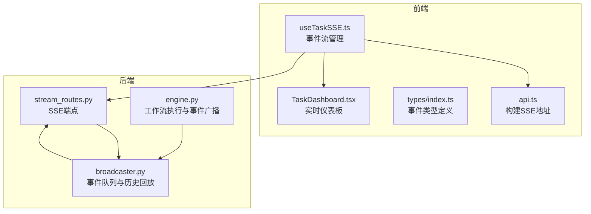
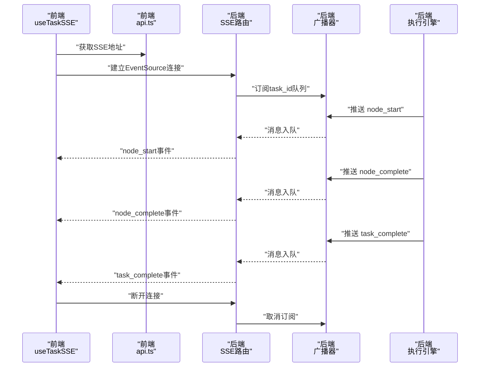
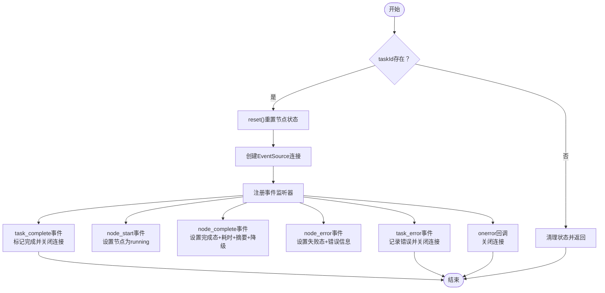
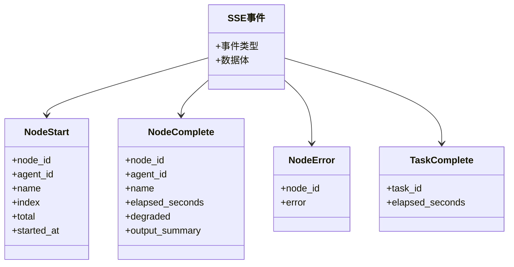
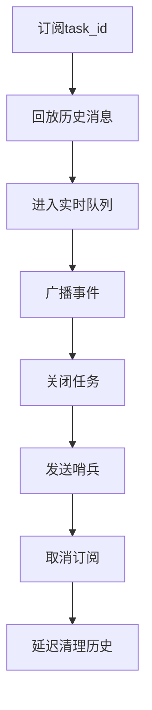
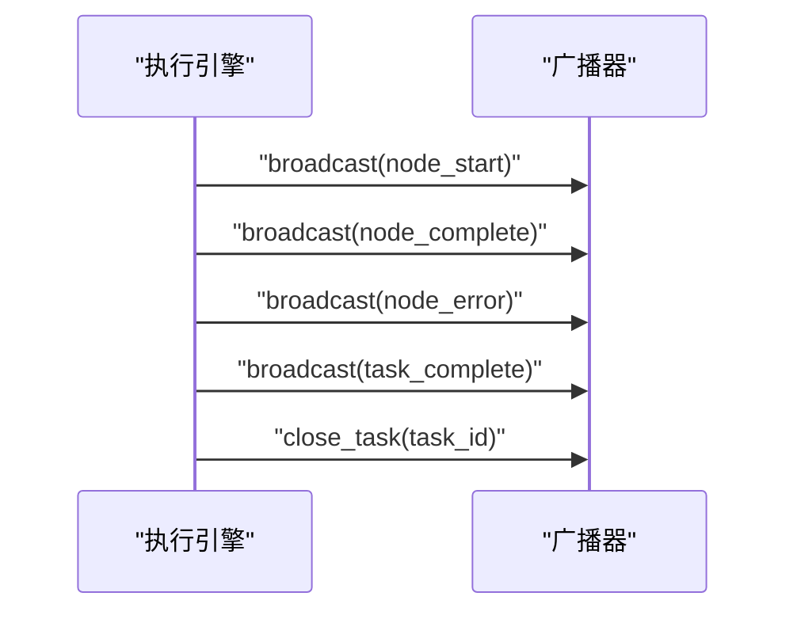
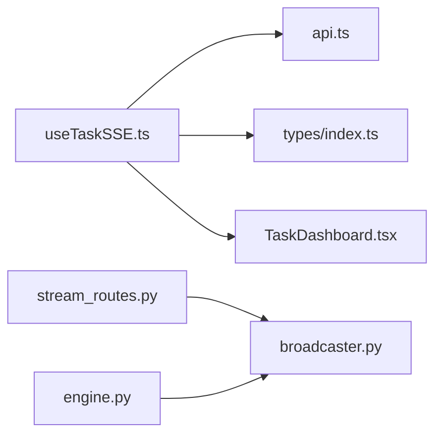

# 实时通信

<cite>
**本文引用的文件**
- [useTaskSSE.ts](file://frontend/hooks/useTaskSSE.ts)
- [api.ts](file://frontend/lib/api.ts)
- [index.ts](file://frontend/types/index.ts)
- [TaskDashboard.tsx](file://frontend/components/dashboard/TaskDashboard.tsx)
- [stream_routes.py](file://backend/app/api/stream_routes.py)
- [broadcaster.py](file://backend/app/orchestrator/broadcaster.py)
- [engine.py](file://backend/app/orchestrator/engine.py)
</cite>

## 目录
1. [引言](#引言)
2. [项目结构](#项目结构)
3. [核心组件](#核心组件)
4. [架构总览](#架构总览)
5. [详细组件分析](#详细组件分析)
6. [依赖分析](#依赖分析)
7. [性能考虑](#性能考虑)
8. [故障排除指南](#故障排除指南)
9. [结论](#结论)
10. [附录](#附录)

## 引言
本文件围绕 HotClaw 的实时通信系统进行系统化说明，重点覆盖以下方面：
- Server-Sent Events（SSE）在任务执行过程中的实现原理与使用方法，包括连接建立、事件监听与断线重连策略
- 自定义 Hook useTaskSSE 的设计思路，涵盖事件流管理、错误处理与资源清理
- 前后端通信协议，包括事件类型、消息格式与数据传输规范
- 实时状态更新的触发机制、UI 响应策略与用户体验优化
- 网络异常处理、连接状态监控与性能优化策略
- 调试方法、监控指标与故障排除指南

## 项目结构
HotClaw 的实时通信由前端 React Hook 与后端 FastAPI SSE 端点协同实现，核心文件如下：
- 前端
  - 自定义 Hook：useTaskSSE.ts
  - API 工具：api.ts
  - 类型定义：types/index.ts
  - UI 组件：TaskDashboard.tsx
- 后端
  - SSE 路由：app/api/stream_routes.py
  - 广播器：app/orchestrator/broadcaster.py
  - 执行引擎：app/orchestrator/engine.py

**图表来源**
- [useTaskSSE.ts:1-124](file://frontend/hooks/useTaskSSE.ts#L1-L124)
- [api.ts:48-50](file://frontend/lib/api.ts#L48-L50)
- [index.ts:66-95](file://frontend/types/index.ts#L66-L95)
- [TaskDashboard.tsx:1-176](file://frontend/components/dashboard/TaskDashboard.tsx#L1-L176)
- [stream_routes.py:14-43](file://backend/app/api/stream_routes.py#L14-L43)
- [engine.py:124-234](file://backend/app/orchestrator/engine.py#L124-L234)
- [broadcaster.py:30-84](file://backend/app/orchestrator/broadcaster.py#L30-L84)

**章节来源**
- [useTaskSSE.ts:1-124](file://frontend/hooks/useTaskSSE.ts#L1-L124)
- [api.ts:48-50](file://frontend/lib/api.ts#L48-L50)
- [index.ts:66-95](file://frontend/types/index.ts#L66-L95)
- [TaskDashboard.tsx:1-176](file://frontend/components/dashboard/TaskDashboard.tsx#L1-L176)
- [stream_routes.py:14-43](file://backend/app/api/stream_routes.py#L14-L43)
- [engine.py:124-234](file://backend/app/orchestrator/engine.py#L124-L234)
- [broadcaster.py:30-84](file://backend/app/orchestrator/broadcaster.py#L30-L84)

## 核心组件
- useTaskSSE：负责建立与维护 EventSource 连接，订阅节点级与任务级事件，管理节点状态、任务完成与错误状态，并在组件卸载或任务变更时清理资源
- SSE 路由：基于 sse-starlette 的 EventSourceResponse，从广播器队列拉取消息，支持超时保活与断开检测
- 广播器：按 task_id 维护订阅者队列与历史缓冲，支持晚到订阅者的事件回放与任务结束哨兵
- 执行引擎：在工作流执行过程中向广播器推送 node_start/node_complete/node_error/task_complete 等事件
- 类型系统：统一定义 SSE 事件接口，确保前后端契约一致

**章节来源**
- [useTaskSSE.ts:28-123](file://frontend/hooks/useTaskSSE.ts#L28-L123)
- [stream_routes.py:14-43](file://backend/app/api/stream_routes.py#L14-L43)
- [broadcaster.py:30-84](file://backend/app/orchestrator/broadcaster.py#L30-L84)
- [engine.py:124-234](file://backend/app/orchestrator/engine.py#L124-L234)
- [index.ts:66-95](file://frontend/types/index.ts#L66-L95)

## 架构总览
SSE 实时通信链路如下：
- 前端通过 api.ts 生成 /api/v1/tasks/{task_id}/stream 的 SSE 地址
- useTaskSSE 建立 EventSource 连接，注册 node_start/node_complete/node_error/task_complete/task_error 等事件监听
- 后端路由 stream_routes.py 从广播器 broadcaster 获取消息队列，循环产出事件
- 执行引擎 engine.py 在工作流各阶段调用广播器推送事件，任务结束后关闭流并清理历史

**图表来源**
- [useTaskSSE.ts:58-120](file://frontend/hooks/useTaskSSE.ts#L58-L120)
- [api.ts:48-50](file://frontend/lib/api.ts#L48-L50)
- [stream_routes.py:19-42](file://backend/app/api/stream_routes.py#L19-L42)
- [engine.py:124-234](file://backend/app/orchestrator/engine.py#L124-L234)
- [broadcaster.py:30-45](file://backend/app/orchestrator/broadcaster.py#L30-L45)

## 详细组件分析

### useTaskSSE 自定义 Hook 设计
- 事件流管理
  - 初始化节点状态数组，匹配后端工作流节点顺序
  - 建立 EventSource 连接，注册 node_start/node_complete/node_error/task_complete/task_error 事件处理器
  - 使用队列式状态更新，保证节点状态与输出摘要、耗时、降级标记等字段同步
- 错误处理
  - 任务级错误通过 task_error 字段暴露；节点级错误通过对应节点的 error 字段记录
  - onerror 回调中主动关闭连接，避免悬挂
- 清理机制
  - 组件卸载与 taskId 变更时，自动关闭 EventSource 并重置状态
  - reset 方法用于手动重置节点状态、完成态与错误态
- 断线重连建议
  - 当前实现未内置自动重连逻辑；可在 onerror 中增加指数退避与重试策略，或在上层组件根据 taskDone/taskError 决策是否重建连接

**图表来源**
- [useTaskSSE.ts:28-123](file://frontend/hooks/useTaskSSE.ts#L28-L123)

**章节来源**
- [useTaskSSE.ts:28-123](file://frontend/hooks/useTaskSSE.ts#L28-L123)

### SSE 事件类型与消息格式
- 事件类型
  - node_start：节点开始执行
  - node_complete：节点完成执行
  - node_error：节点执行出错
  - task_complete：任务整体完成
  - task_error：任务执行出错
- 消息格式
  - 事件名与数据体通过 EventSourceResponse 输出
  - 数据体为 JSON 字符串，包含事件名与 data 对象
- 类型定义
  - 前端 types/index.ts 定义了 SSENodeStart/SSENodeComplete/SSENodeError/SSETaskComplete 接口，确保前后端契约一致

**图表来源**
- [index.ts:66-95](file://frontend/types/index.ts#L66-L95)
- [stream_routes.py:35-38](file://backend/app/api/stream_routes.py#L35-L38)

**章节来源**
- [index.ts:66-95](file://frontend/types/index.ts#L66-L95)
- [stream_routes.py:35-38](file://backend/app/api/stream_routes.py#L35-L38)

### 后端广播器与事件回放
- 订阅与回放
  - 按 task_id 维护订阅者队列与历史消息列表
  - 新订阅者会收到历史消息回放，解决“先执行后连接”的竞态问题
- 结束信号
  - 任务完成后向所有订阅者发送哨兵值，触发前端断流
- 资源清理
  - 关闭任务后延迟清理历史消息，避免内存泄漏

**图表来源**
- [broadcaster.py:30-84](file://backend/app/orchestrator/broadcaster.py#L30-L84)

**章节来源**
- [broadcaster.py:30-84](file://backend/app/orchestrator/broadcaster.py#L30-L84)

### 执行引擎事件推送流程
- 工作流节点执行期间，按序推送 node_start、node_complete 或 node_error
- 任务完成后推送 task_complete 并关闭流
- 异常路径中根据 required 字段决定是否终止任务并广播错误

**图表来源**
- [engine.py:124-234](file://backend/app/orchestrator/engine.py#L124-L234)
- [broadcaster.py:57-84](file://backend/app/orchestrator/broadcaster.py#L57-L84)

**章节来源**
- [engine.py:124-234](file://backend/app/orchestrator/engine.py#L124-L234)
- [broadcaster.py:57-84](file://backend/app/orchestrator/broadcaster.py#L57-L84)

### 前端 UI 响应与用户体验优化
- 实时仪表板
  - TaskDashboard 根据节点状态与耗时动态计算完成率、成功率与平均响应时间
  - 任务状态指示器随节点运行状态闪烁，任务完成后固定为绿色
- 节点面板
  - 展示每个节点的名称、状态、耗时与降级标记，便于用户快速定位瓶颈
- 错误提示
  - 任务级错误以卡片形式展示，避免覆盖主要信息区域

**章节来源**
- [TaskDashboard.tsx:21-176](file://frontend/components/dashboard/TaskDashboard.tsx#L21-L176)

## 依赖分析
- 前端
  - useTaskSSE 依赖 api.ts 提供的 SSE 地址构造函数
  - useTaskSSE 依赖 types/index.ts 中的事件类型定义
  - UI 组件依赖 useTaskSSE 返回的状态与控制函数
- 后端
  - SSE 路由依赖广播器模块，负责消息队列与回放
  - 执行引擎在工作流各阶段调用广播器推送事件
- 耦合与内聚
  - 前后端通过标准 SSE 协议耦合，事件类型与数据结构通过类型定义强约束
  - 广播器作为中心枢纽，降低执行引擎与路由之间的直接耦合

**图表来源**
- [useTaskSSE.ts:4](file://frontend/hooks/useTaskSSE.ts#L4)
- [api.ts:48-50](file://frontend/lib/api.ts#L48-L50)
- [index.ts:66-95](file://frontend/types/index.ts#L66-L95)
- [TaskDashboard.tsx:10-11](file://frontend/components/dashboard/TaskDashboard.tsx#L10-L11)
- [stream_routes.py:9](file://backend/app/api/stream_routes.py#L9)
- [broadcaster.py:11](file://backend/app/orchestrator/broadcaster.py#L11)
- [engine.py:26](file://backend/app/orchestrator/engine.py#L26)

**章节来源**
- [useTaskSSE.ts:4](file://frontend/hooks/useTaskSSE.ts#L4)
- [api.ts:48-50](file://frontend/lib/api.ts#L48-L50)
- [index.ts:66-95](file://frontend/types/index.ts#L66-L95)
- [TaskDashboard.tsx:10-11](file://frontend/components/dashboard/TaskDashboard.tsx#L10-L11)
- [stream_routes.py:9](file://backend/app/api/stream_routes.py#L9)
- [broadcaster.py:11](file://backend/app/orchestrator/broadcaster.py#L11)
- [engine.py:26](file://backend/app/orchestrator/engine.py#L26)

## 性能考虑
- 保活与断开检测
  - 后端在超时情况下发送注释型保活消息，避免浏览器误判断开
  - 前端 onerror 中主动关闭连接，防止悬挂
- 历史回放与内存管理
  - 广播器对每个 task_id 缓存历史消息，任务结束后延迟清理，避免内存泄漏
- 事件粒度与 UI 更新
  - 将节点状态更新拆分为多个细粒度事件，UI 可增量渲染，减少重排
- 并发与队列
  - 广播器使用 asyncio.Queue 保证事件有序投递，避免竞争条件

**章节来源**
- [stream_routes.py:24-38](file://backend/app/api/stream_routes.py#L24-L38)
- [broadcaster.py:57-84](file://backend/app/orchestrator/broadcaster.py#L57-L84)

## 故障排除指南
- 常见问题
  - 连接立即断开：检查 SSE 地址是否正确、task_id 是否有效、后端是否已开始广播
  - 无事件回放：确认订阅发生在事件产生之后，或等待广播器历史回放完成
  - 任务未完成：查看 task_error 是否存在，或节点是否持续处于 running 状态
- 调试方法
  - 浏览器开发者工具 Network 面板观察 SSE 连接状态与事件流
  - 前端在 onerror 中记录断开原因，结合后端日志定位异常
  - 后端广播器日志可验证事件是否成功入队与投递
- 监控指标
  - 任务完成率、节点平均耗时、失败率、连接断开次数
  - 前端 UI 指标：节点状态变化速率、错误弹窗出现频率
- 优化建议
  - 在前端实现指数退避重连策略
  - 合理设置保活间隔与超时阈值
  - 对高频节点事件进行去抖或批量更新

**章节来源**
- [useTaskSSE.ts:113-119](file://frontend/hooks/useTaskSSE.ts#L113-L119)
- [stream_routes.py:20-38](file://backend/app/api/stream_routes.py#L20-L38)
- [broadcaster.py:43-44](file://backend/app/orchestrator/broadcaster.py#L43-L44)

## 结论
HotClaw 的实时通信体系以 SSE 为核心，通过前端 Hook、后端路由与广播器的协作，实现了任务执行过程的可观测与可视化。useTaskSSE 提供了简洁的事件订阅与状态管理能力，配合执行引擎的事件推送与广播器的历史回放机制，满足了复杂工作流的实时需求。为进一步提升稳定性与用户体验，建议在前端补充断线重连与节流策略，并完善监控与告警体系。

## 附录
- 初学者指南（SSE 基础）
  - 什么是 SSE：服务器向浏览器推送事件的单向通道，无需轮询
  - 适用场景：任务进度、聊天消息、监控数据等
  - 优势：低延迟、低开销、天然断线检测
  - 注意事项：浏览器兼容性、跨域配置、心跳与断线处理
- 高级实践
  - 事件幂等与去重：为每个事件附加唯一 ID，避免重复渲染
  - 分片与聚合：将高频事件合并为批次，降低 UI 抖动
  - 超时与保活：合理设置超时与保活消息，维持长连接稳定