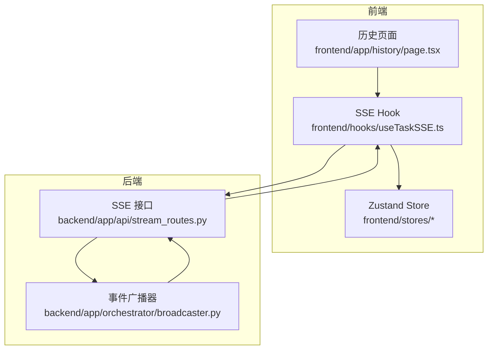
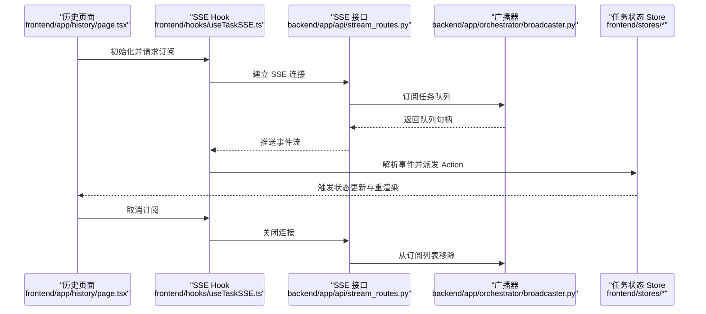
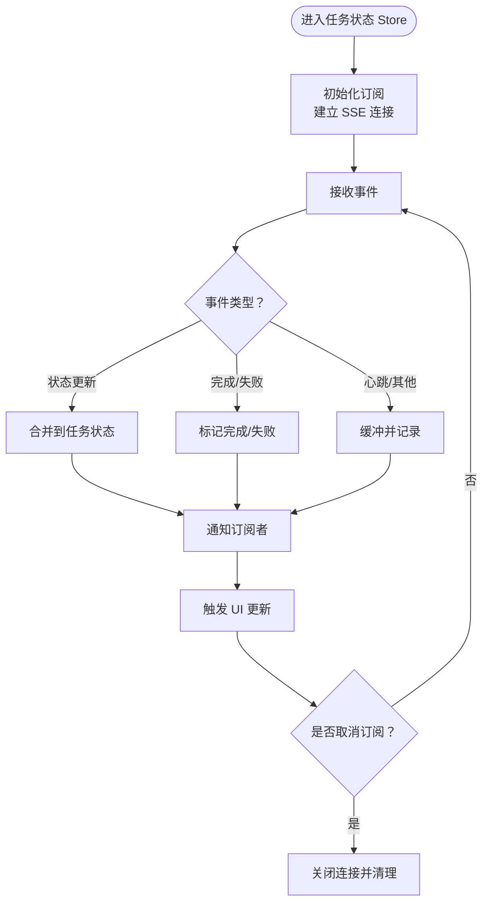
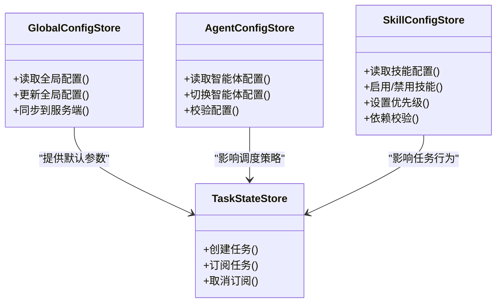
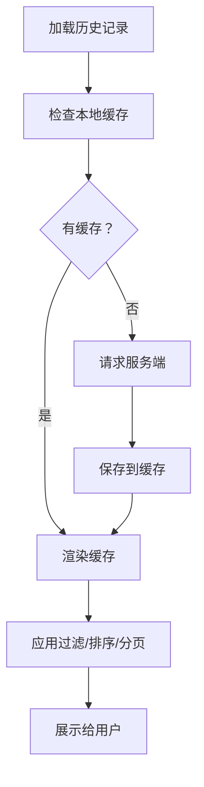
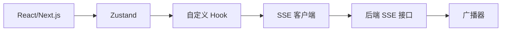

# Zustand Store 设计

<cite>
**本文档引用的文件**
- [ARCHITECTURE.md](file://ARCHITECTURE.md)
- [stream_routes.py](file://backend/app/api/stream_routes.py)
- [broadcaster.py](file://backend/app/orchestrator/broadcaster.py)
- [useTaskSSE.ts](file://frontend/hooks/useTaskSSE.ts)
- [page.tsx](file://frontend/app/history/page.tsx)
- [package.json](file://frontend/package.json)
</cite>

## 目录
1. [引言](#引言)
2. [项目结构](#项目结构)
3. [核心组件](#核心组件)
4. [架构总览](#架构总览)
5. [详细组件分析](#详细组件分析)
6. [依赖关系分析](#依赖关系分析)
7. [性能考虑](#性能考虑)
8. [故障排除指南](#故障排除指南)
9. [结论](#结论)
10. [附录](#附录)

## 引言
本设计文档聚焦于 HotClaw 项目中基于 Zustand 的状态管理方案，系统性阐述任务状态 Store、配置状态 Store、历史记录 Store 的设计与实现要点，覆盖状态结构、Action 函数、副作用处理、Store 间依赖与共享、数据流、扩展最佳实践、性能优化与内存管理策略。文档同时面向初学者解释 Zustand 基本概念与使用方法，为高级开发者提供复杂状态场景的设计模式。

## 项目结构
HotClaw 前端采用 Next.js 应用程序目录结构，状态管理以 Zustand Store 形式组织，结合后端 SSE 广播事件驱动前端状态更新。关键位置如下：
- 前端 Store：位于 frontend/stores（当前为空目录，后续可按模块拆分）
- 前端 Hook：frontend/hooks/useTaskSSE.ts 负责订阅任务状态变更
- 历史页面：frontend/app/history/page.tsx 展示历史任务列表
- 后端 SSE：backend/app/api/stream_routes.py 提供 SSE 接口；backend/app/orchestrator/broadcaster.py 实现事件广播与缓冲
- 架构说明：ARCHITECTURE.md 描述了任务订阅接口与 SSE 订阅流程

**图表来源**
- [ARCHITECTURE.md:302-303](file://ARCHITECTURE.md#L302-L303)
- [stream_routes.py:18-39](file://backend/app/api/stream_routes.py#L18-L39)
- [broadcaster.py:22-67](file://backend/app/orchestrator/broadcaster.py#L22-L67)
- [useTaskSSE.ts](file://frontend/hooks/useTaskSSE.ts)
- [page.tsx](file://frontend/app/history/page.tsx)

**章节来源**
- [ARCHITECTURE.md:302-303](file://ARCHITECTURE.md#L302-L303)
- [stream_routes.py:18-39](file://backend/app/api/stream_routes.py#L18-L39)
- [broadcaster.py:22-67](file://backend/app/orchestrator/broadcaster.py#L22-L67)
- [useTaskSSE.ts](file://frontend/hooks/useTaskSSE.ts)
- [page.tsx](file://frontend/app/history/page.tsx)

## 核心组件
本节概述三类 Store 的职责与交互边界：
- 任务状态 Store：负责单个或多个任务的实时状态、进度、结果与错误信息的集中管理，通过 SSE 推送事件驱动更新。
- 配置状态 Store：管理全局配置、智能体配置与技能配置，支持读取、修改与持久化（如需要）。
- 历史记录 Store：维护历史任务列表、查询条件与分页状态，支撑历史页面的数据展示与筛选。

为确保一致性，Store 之间应保持低耦合与清晰的单向数据流。任务状态 Store 作为事件源，配置与历史 Store 作为消费者或协调者。

**章节来源**
- [ARCHITECTURE.md:302-303](file://ARCHITECTURE.md#L302-L303)
- [stream_routes.py:18-39](file://backend/app/api/stream_routes.py#L18-L39)
- [broadcaster.py:22-67](file://backend/app/orchestrator/broadcaster.py#L22-L67)

## 架构总览
下图展示了从前端 Hook 订阅到后端广播再到 Store 更新的完整链路：

**图表来源**
- [stream_routes.py:18-39](file://backend/app/api/stream_routes.py#L18-L39)
- [broadcaster.py:29-67](file://backend/app/orchestrator/broadcaster.py#L29-L67)
- [useTaskSSE.ts](file://frontend/hooks/useTaskSSE.ts)
- [page.tsx](file://frontend/app/history/page.tsx)

## 详细组件分析

### 任务状态 Store 设计
- 状态结构设计
  - 单任务视图：包含任务 ID、状态（待执行/运行中/完成/失败）、进度百分比、开始时间、结束时间、输出摘要等。
  - 多任务聚合：维护任务列表、总数、过滤条件（状态、时间范围、关键词）、排序字段与分页参数。
  - 事件缓冲：在首次订阅时接收历史事件，避免遗漏早期状态变更。
- Action 函数实现
  - 初始化订阅：建立 SSE 连接，注册事件处理器。
  - 接收事件：解析事件类型（如任务状态更新、完成、失败），合并到 Store。
  - 取消订阅：关闭连接，清理队列与定时器。
  - 查询与过滤：根据过滤条件筛选任务列表，支持本地排序与分页。
- 副作用处理
  - 与后端广播器协作：订阅/取消订阅生命周期与队列管理。
  - 与 UI 组件解耦：通过 Action 封装副作用，避免组件直接操作网络层。
- 数据流向
  - 输入：SSE 事件流
  - 处理：事件解析与状态合并
  - 输出：触发 UI 重渲染

**图表来源**
- [stream_routes.py:18-39](file://backend/app/api/stream_routes.py#L18-L39)
- [broadcaster.py:29-67](file://backend/app/orchestrator/broadcaster.py#L29-L67)
- [useTaskSSE.ts](file://frontend/hooks/useTaskSSE.ts)

**章节来源**
- [stream_routes.py:18-39](file://backend/app/api/stream_routes.py#L18-L39)
- [broadcaster.py:29-67](file://backend/app/orchestrator/broadcaster.py#L29-L67)
- [useTaskSSE.ts](file://frontend/hooks/useTaskSSE.ts)

### 配置状态 Store 设计
- 全局配置管理
  - 字段：语言、主题、时区、日志级别、默认超时等。
  - 持久化：可选地写入本地存储或服务端配置端点。
  - 同步：启动时拉取服务端配置，本地变更时推送回服务端。
- 智能体配置
  - 字段：模型选择、并发数、资源限制、默认参数。
  - 动态切换：支持运行时切换不同智能体配置并立即生效。
- 技能配置
  - 字段：技能启用/禁用、优先级、依赖关系、输入输出约束。
  - 校验：保存前进行依赖与冲突校验。
- 与任务状态 Store 的协作
  - 任务创建时读取默认配置，避免重复传参。
  - 配置变更影响任务调度策略（如并发、资源分配）。

**图表来源**
- [useTaskSSE.ts](file://frontend/hooks/useTaskSSE.ts)

**章节来源**
- [useTaskSSE.ts](file://frontend/hooks/useTaskSSE.ts)

### 历史记录 Store 设计
- 历史任务列表管理
  - 字段：任务 ID、名称、状态、开始/结束时间、耗时、结果摘要。
  - 分页与排序：支持按时间、状态、名称排序，分页加载。
  - 过滤：按状态、时间范围、关键词过滤。
- 状态持久化与查询
  - 本地缓存：短期缓存最近 N 条记录，提升首屏性能。
  - 服务端查询：支持复杂查询条件与导出。
- 与任务状态 Store 的关系
  - 历史 Store 仅消费已完成的任务事件，不参与实时订阅。
  - 与任务 Store 解耦，避免双向依赖。

**图表来源**
- [page.tsx](file://frontend/app/history/page.tsx)

**章节来源**
- [page.tsx](file://frontend/app/history/page.tsx)

## 依赖关系分析
- 前端依赖
  - React 与 Next.js：提供组件与路由能力。
  - Zustand：提供轻量级状态管理。
  - 自定义 Hook：封装 SSE 订阅逻辑，隔离副作用。
- 后端依赖
  - 广播器：维护订阅队列，支持事件缓冲与重放。
  - SSE 接口：暴露事件流，处理订阅/取消订阅。
- 外部集成
  - 浏览器原生 EventSource 或自实现 SSE 客户端。
  - 可选：WebSocket/长轮询作为降级方案。

**图表来源**
- [package.json:11-21](file://frontend/package.json#L11-L21)
- [stream_routes.py:18-39](file://backend/app/api/stream_routes.py#L18-L39)
- [broadcaster.py:22-67](file://backend/app/orchestrator/broadcaster.py#L22-L67)

**章节来源**
- [package.json:11-21](file://frontend/package.json#L11-L21)
- [stream_routes.py:18-39](file://backend/app/api/stream_routes.py#L18-L39)
- [broadcaster.py:22-67](file://backend/app/orchestrator/broadcaster.py#L22-L67)

## 性能考虑
- Store 扩展最佳实践
  - 模块化拆分：按领域拆分 Store（任务、配置、历史），降低耦合。
  - 选择性订阅：仅订阅必要字段，避免全量重渲染。
  - 深度更新优化：使用不可变更新或浅比较，减少不必要的计算。
- 内存管理策略
  - 及时取消订阅：组件卸载时调用取消订阅，释放队列与定时器。
  - 清理历史缓存：定期清理过期历史记录，控制内存占用。
  - 事件去抖：对高频事件进行去抖处理，降低 Store 更新频率。
- 性能优化建议
  - 使用 selector 选择器：只订阅所需字段，避免全局监听。
  - 服务端分页与懒加载：历史记录分页加载，减少一次性渲染压力。
  - 本地缓存命中率：合理设置缓存 TTL，提升首屏速度。

[本节为通用指导，无需特定文件引用]

## 故障排除指南
- SSE 连接异常
  - 症状：无法接收任务状态更新。
  - 排查：确认后端 SSE 接口可用、网络连通性、跨域配置。
  - 处理：在 Hook 中增加重试与降级逻辑（如 WebSocket/轮询）。
- 事件丢失
  - 症状：订阅后缺失早期事件。
  - 排查：确认广播器的事件缓冲与重放机制。
  - 处理：在订阅时请求历史事件，确保完整性。
- Store 内存泄漏
  - 症状：长时间运行后内存持续增长。
  - 排查：检查是否正确取消订阅、是否保留过期任务引用。
  - 处理：在组件卸载时清理订阅与缓存，定期 GC。
- 配置不生效
  - 症状：切换智能体/技能配置后任务行为未改变。
  - 排查：确认配置 Store 已更新且任务创建时读取最新配置。
  - 处理：在配置变更后触发重新评估与重启任务。

**章节来源**
- [stream_routes.py:18-39](file://backend/app/api/stream_routes.py#L18-L39)
- [broadcaster.py:29-67](file://backend/app/orchestrator/broadcaster.py#L29-L67)
- [useTaskSSE.ts](file://frontend/hooks/useTaskSSE.ts)

## 结论
HotClaw 的 Zustand 状态管理以“事件驱动 + Store 分层”为核心理念：任务状态 Store 负责实时事件处理，配置 Store 提供统一参数来源，历史 Store 负责离线数据管理。通过清晰的依赖关系与数据流设计，系统实现了高内聚、低耦合的状态管理架构。建议在后续迭代中完善 Store 拆分、引入选择性订阅与缓存策略，并加强错误监控与降级机制，以进一步提升稳定性与性能。

[本节为总结性内容，无需特定文件引用]

## 附录
- 初学者入门建议
  - 从最小可行 Store 开始：先实现单一状态字段与对应 Action。
  - 使用 selector：避免不必要的重渲染。
  - 逐步引入中间件：如日志、持久化、调试工具。
- 高级开发者参考
  - 复杂状态场景：采用模块化 Store 与上下文共享，避免全局单例。
  - 并发与一致性：使用事务式更新与版本号，保证状态一致性。
  - 可测试性：为 Store 编写单元测试与集成测试，覆盖关键分支。

[本节为补充性内容，无需特定文件引用]