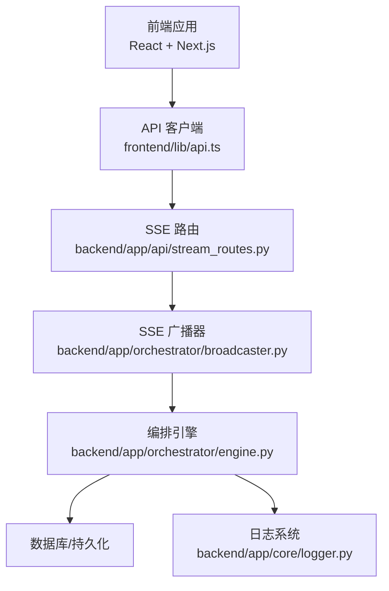
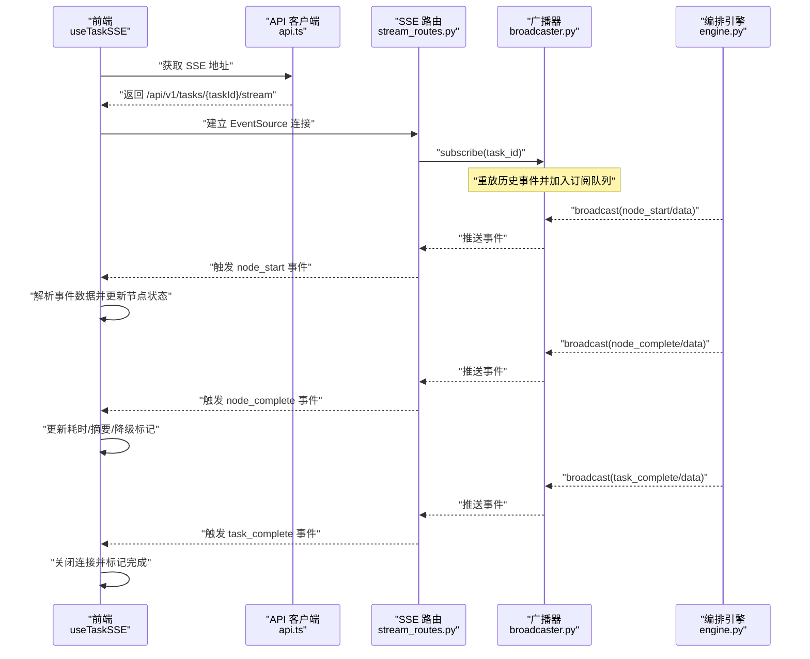
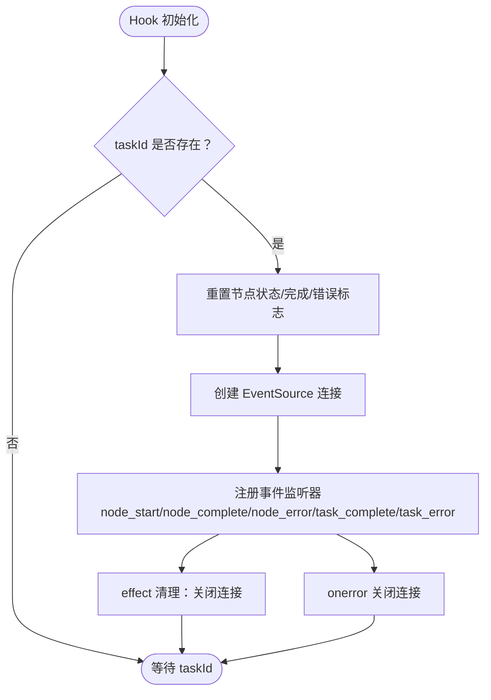
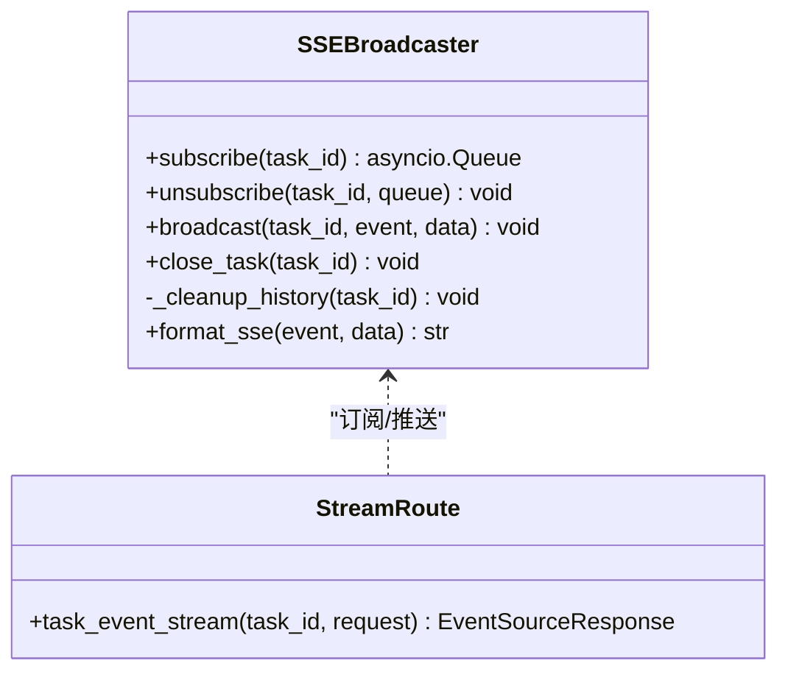
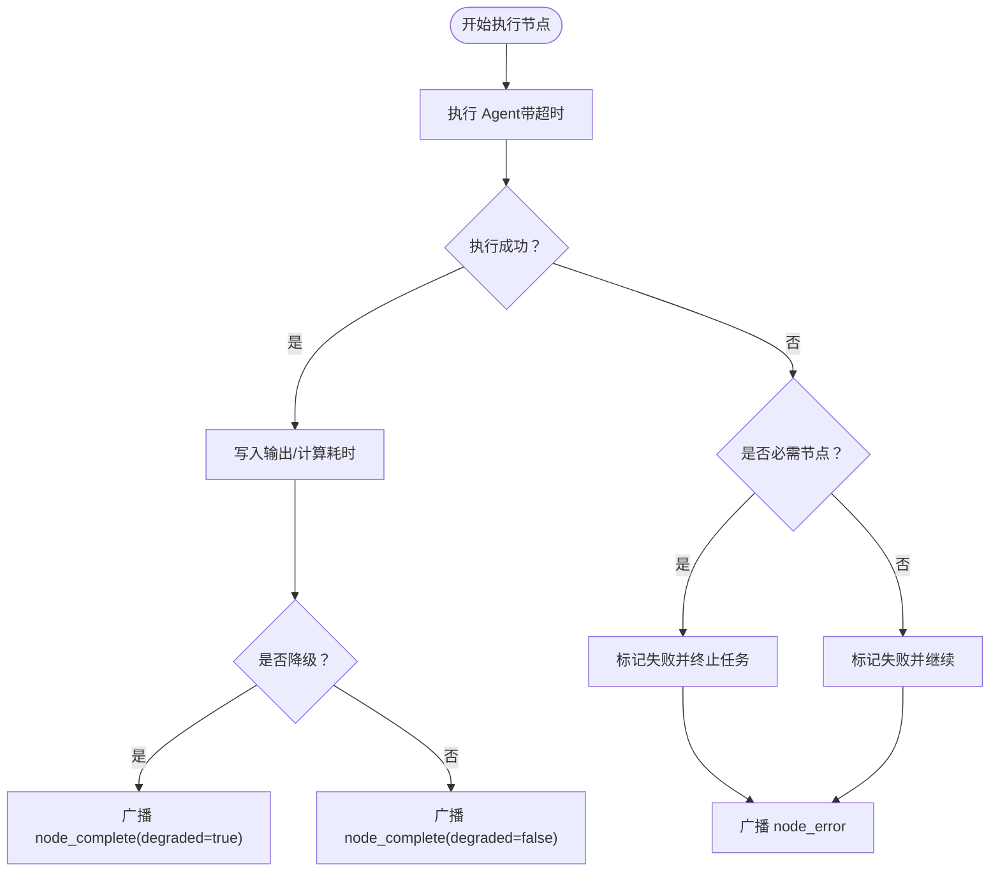
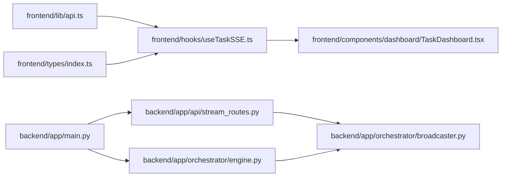

# 实时状态同步

<cite>
**本文引用的文件**
- [frontend/hooks/useTaskSSE.ts](file://frontend/hooks/useTaskSSE.ts)
- [frontend/lib/api.ts](file://frontend/lib/api.ts)
- [frontend/types/index.ts](file://frontend/types/index.ts)
- [frontend/components/dashboard/TaskDashboard.tsx](file://frontend/components/dashboard/TaskDashboard.tsx)
- [backend/app/api/stream_routes.py](file://backend/app/api/stream_routes.py)
- [backend/app/orchestrator/broadcaster.py](file://backend/app/orchestrator/broadcaster.py)
- [backend/app/orchestrator/engine.py](file://backend/app/orchestrator/engine.py)
- [backend/app/main.py](file://backend/app/main.py)
- [backend/app/core/logger.py](file://backend/app/core/logger.py)
- [ARCHITECTURE.md](file://ARCHITECTURE.md)
</cite>

## 目录
1. [引言](#引言)
2. [项目结构](#项目结构)
3. [核心组件](#核心组件)
4. [架构总览](#架构总览)
5. [详细组件分析](#详细组件分析)
6. [依赖分析](#依赖分析)
7. [性能考量](#性能考量)
8. [故障排查指南](#故障排查指南)
9. [结论](#结论)
10. [附录](#附录)

## 引言
本文件围绕 HotClaw 的实时状态同步机制，系统性阐述基于 Server-Sent Events (SSE) 的实现原理与工程实践。内容覆盖连接建立、事件监听与断线重连、事件数据格式与类型定义、消息解析逻辑、任务状态实时更新流程、错误处理与降级策略、性能优化与资源管理、以及调试与监控方法。文档同时兼顾初学者对实时通信基础概念的理解与高级开发者在复杂场景下的最佳实践。

## 项目结构
HotClaw 采用前后端分离架构，前端通过 SSE 订阅后端的任务状态事件流，后端在编排器执行过程中将节点状态与任务完成事件推送到事件队列并通过 SSE 端点实时下发给前端。关键文件分布如下：
- 前端
  - 实时订阅 Hook：frontend/hooks/useTaskSSE.ts
  - API 客户端：frontend/lib/api.ts
  - 类型定义：frontend/types/index.ts
  - 仪表盘组件：frontend/components/dashboard/TaskDashboard.tsx
- 后端
  - SSE 路由：backend/app/api/stream_routes.py
  - 广播器：backend/app/orchestrator/broadcaster.py
  - 编排引擎：backend/app/orchestrator/engine.py
  - 应用入口与中间件：backend/app/main.py
  - 日志：backend/app/core/logger.py
- 架构文档：ARCHITECTURE.md

**图表来源**
- [frontend/lib/api.ts:48-50](file://frontend/lib/api.ts#L48-L50)
- [backend/app/api/stream_routes.py:14-42](file://backend/app/api/stream_routes.py#L14-L42)
- [backend/app/orchestrator/broadcaster.py:30-84](file://backend/app/orchestrator/broadcaster.py#L30-L84)
- [backend/app/orchestrator/engine.py:92-234](file://backend/app/orchestrator/engine.py#L92-L234)
- [backend/app/core/logger.py:8-36](file://backend/app/core/logger.py#L8-L36)

**章节来源**
- [frontend/hooks/useTaskSSE.ts:1-124](file://frontend/hooks/useTaskSSE.ts#L1-L124)
- [frontend/lib/api.ts:1-110](file://frontend/lib/api.ts#L1-L110)
- [frontend/types/index.ts:1-119](file://frontend/types/index.ts#L1-L119)
- [frontend/components/dashboard/TaskDashboard.tsx:1-176](file://frontend/components/dashboard/TaskDashboard.tsx#L1-L176)
- [backend/app/api/stream_routes.py:1-43](file://backend/app/api/stream_routes.py#L1-L43)
- [backend/app/orchestrator/broadcaster.py:1-94](file://backend/app/orchestrator/broadcaster.py#L1-L94)
- [backend/app/orchestrator/engine.py:1-285](file://backend/app/orchestrator/engine.py#L1-L285)
- [backend/app/main.py:1-142](file://backend/app/main.py#L1-L142)
- [backend/app/core/logger.py:1-36](file://backend/app/core/logger.py#L1-L36)
- [ARCHITECTURE.md:325-360](file://ARCHITECTURE.md#L325-L360)

## 核心组件
- 前端 Hook：useTaskSSE
  - 负责创建 EventSource 连接、监听 node_start/node_complete/node_error/task_complete/task_error 等事件、维护节点状态与任务完成/错误标志、清理资源。
  - 初始化节点状态数组，确保与后端编排器的节点顺序一致。
- API 客户端：api.ts
  - 提供 getTaskStreamUrl(taskId) 生成 SSE 流地址，统一错误处理与响应格式。
- 类型定义：types/index.ts
  - 定义 NodeStatus、TaskStatus、SSE 事件数据结构（如 SSENodeStart/SSENodeComplete/SSENodeError/SSETaskComplete）。
- 广播器：broadcaster.py
  - 维护每个 task_id 的订阅者队列与历史事件缓冲，支持晚到订阅者的事件重放、结束信号与历史清理。
- SSE 路由：stream_routes.py
  - 通过 EventSourceResponse 返回事件流，处理连接断开、超时保活、消息格式化。
- 编排引擎：engine.py
  - 在节点开始/完成/失败时广播相应事件，最终在任务完成后关闭流并清理历史。
- 日志：logger.py
  - 结构化日志配置，便于事件广播与订阅过程的可观测性。

**章节来源**
- [frontend/hooks/useTaskSSE.ts:28-123](file://frontend/hooks/useTaskSSE.ts#L28-L123)
- [frontend/lib/api.ts:48-50](file://frontend/lib/api.ts#L48-L50)
- [frontend/types/index.ts:66-95](file://frontend/types/index.ts#L66-L95)
- [backend/app/orchestrator/broadcaster.py:30-84](file://backend/app/orchestrator/broadcaster.py#L30-L84)
- [backend/app/api/stream_routes.py:14-42](file://backend/app/api/stream_routes.py#L14-L42)
- [backend/app/orchestrator/engine.py:124-232](file://backend/app/orchestrator/engine.py#L124-L232)
- [backend/app/core/logger.py:8-36](file://backend/app/core/logger.py#L8-L36)

## 架构总览
SSE 实时状态同步的关键路径如下：
- 前端通过 API 客户端获取 SSE 地址并创建 EventSource。
- 后端 SSE 路由从广播器订阅队列拉取消息，按需发送 node_start/node_complete/node_error/task_complete 等事件。
- 编排引擎在节点执行生命周期内广播事件，任务完成后关闭流并清理历史。
- 前端 Hook 解析事件数据，更新节点状态与任务完成/错误标志，驱动 UI 响应式渲染。

**图表来源**
- [frontend/lib/api.ts:48-50](file://frontend/lib/api.ts#L48-L50)
- [frontend/hooks/useTaskSSE.ts:62-120](file://frontend/hooks/useTaskSSE.ts#L62-L120)
- [backend/app/api/stream_routes.py:18-41](file://backend/app/api/stream_routes.py#L18-L41)
- [backend/app/orchestrator/broadcaster.py:30-84](file://backend/app/orchestrator/broadcaster.py#L30-L84)
- [backend/app/orchestrator/engine.py:124-232](file://backend/app/orchestrator/engine.py#L124-L232)

## 详细组件分析

### 前端：useTaskSSE Hook
- 连接建立
  - 通过 getTaskStreamUrl(taskId) 生成 SSE 地址并创建 EventSource。
  - 在 taskId 变更时重置状态并重新订阅。
- 事件监听
  - node_start：将对应节点状态置为 running。
  - node_complete：将对应节点置为 completed，并填充耗时、输出摘要、降级标记。
  - node_error：将对应节点置为 failed，并记录错误信息。
  - task_complete：标记任务完成并关闭连接。
  - task_error：记录任务级错误并关闭连接。
- 断线与清理
  - onerror 回调中关闭连接，避免资源泄漏。
  - useEffect 清理函数在组件卸载或依赖变化时关闭连接。
- 状态管理
  - 维护 nodes 数组与 taskDone/taskError 标志，供上层组件使用。

**图表来源**
- [frontend/hooks/useTaskSSE.ts:58-120](file://frontend/hooks/useTaskSSE.ts#L58-L120)

**章节来源**
- [frontend/hooks/useTaskSSE.ts:28-123](file://frontend/hooks/useTaskSSE.ts#L28-L123)

### 后端：SSE 路由与广播器
- SSE 路由
  - 使用 EventSourceResponse 返回事件流，内部异步生成器持续从广播器队列获取消息。
  - 连接断开检测：request.is_disconnected()。
  - 超时保活：30 秒无消息时发送注释行 keepalive。
  - 结束信号：收到 None 表示结束，停止推送并取消订阅。
- 广播器
  - 订阅：为 task_id 创建队列，重放历史事件，加入订阅列表。
  - 广播：将事件写入历史缓冲与所有订阅队列。
  - 关闭：标记任务已关闭，向所有订阅发送结束信号，延迟清理历史。
  - 历史清理：60 秒后移除历史与关闭标记，防止内存泄漏。

**图表来源**
- [backend/app/orchestrator/broadcaster.py:30-84](file://backend/app/orchestrator/broadcaster.py#L30-L84)
- [backend/app/api/stream_routes.py:18-41](file://backend/app/api/stream_routes.py#L18-L41)

**章节来源**
- [backend/app/api/stream_routes.py:14-42](file://backend/app/api/stream_routes.py#L14-L42)
- [backend/app/orchestrator/broadcaster.py:11-94](file://backend/app/orchestrator/broadcaster.py#L11-L94)

### 编排引擎：事件广播与任务生命周期
- 节点开始
  - 更新节点运行记录状态为 running，记录开始时间。
  - 广播 node_start 事件，包含节点索引、总数、开始时间等。
- 节点执行
  - 调用 Agent 执行，支持超时与异常处理。
  - 成功：写入输出数据，计算耗时，广播 node_complete，包含耗时、降级标记与输出摘要。
  - 失败：根据是否必需决定终止或降级，广播 node_error。
- 任务完成
  - 计算任务耗时与总 token，设置状态为 completed。
  - 广播 task_complete，随后调用 close_task 关闭流并清理历史。

**图表来源**
- [backend/app/orchestrator/engine.py:124-232](file://backend/app/orchestrator/engine.py#L124-L232)

**章节来源**
- [backend/app/orchestrator/engine.py:92-234](file://backend/app/orchestrator/engine.py#L92-L234)

### 事件数据格式与类型定义
- 事件类型
  - node_start：节点开始执行，携带节点索引、总数、开始时间等。
  - node_complete：节点完成，携带耗时、降级标记、输出摘要等。
  - node_error：节点失败，携带错误信息。
  - task_complete：任务完成，携带总耗时。
  - task_error：任务级错误，携带错误信息。
- 前端类型
  - NodeStatus/TaskStatus：节点/任务状态枚举。
  - SSENodeStart/SSENodeComplete/SSENodeError/SSETaskComplete：事件数据结构。
- 后端模型
  - NodeRunData/TaskDetailResponse 等：后端响应模型，与前端事件数据字段一一对应。

**章节来源**
- [frontend/types/index.ts:5-95](file://frontend/types/index.ts#L5-L95)
- [backend/app/schemas/task.py:42-78](file://backend/app/schemas/task.py#L42-L78)
- [ARCHITECTURE.md:350-360](file://ARCHITECTURE.md#L350-L360)

### 任务状态的实时更新流程与 UI 响应
- 状态变更检测
  - 前端 Hook 监听事件并解析 JSON 数据，更新对应节点状态与耗时。
- UI 响应式更新
  - TaskDashboard 组件基于 nodes 计算完成数、成功率、平均响应时间等指标，并渲染节点卡片状态与颜色。
- 用户体验优化
  - 节点状态颜色与动画（如运行中的脉冲）提升反馈直观性。
  - 输出摘要与耗时展示帮助用户快速了解执行情况。

**章节来源**
- [frontend/hooks/useTaskSSE.ts:65-111](file://frontend/hooks/useTaskSSE.ts#L65-L111)
- [frontend/components/dashboard/TaskDashboard.tsx:21-176](file://frontend/components/dashboard/TaskDashboard.tsx#L21-L176)

### 错误处理机制与降级方案
- 网络异常处理
  - 前端 onerror 回调主动关闭连接，避免悬挂连接。
  - SSE 路由检测 request.is_disconnected() 并退出循环。
- 事件重试策略
  - 广播器支持晚到订阅者的事件重放，保证前端连接建立前的事件不会丢失。
  - 超时保活：30 秒无消息发送注释行 keepalive，维持连接活跃。
- 降级方案
  - 编排引擎在节点失败且非必需时进行降级（如返回默认值、标记降级），继续执行后续节点。
  - 任务完成后关闭流并清理历史，避免长时间占用资源。

**章节来源**
- [frontend/hooks/useTaskSSE.ts:113-115](file://frontend/hooks/useTaskSSE.ts#L113-L115)
- [backend/app/api/stream_routes.py:20-38](file://backend/app/api/stream_routes.py#L20-L38)
- [backend/app/orchestrator/broadcaster.py:30-44](file://backend/app/orchestrator/broadcaster.py#L30-L44)
- [backend/app/orchestrator/engine.py:154-175](file://backend/app/orchestrator/engine.py#L154-L175)

## 依赖分析
- 前端依赖
  - useTaskSSE 依赖 api.ts 提供的 SSE 地址与 types.ts 的类型定义。
  - TaskDashboard 依赖 useTaskSSE 的状态输出。
- 后端依赖
  - stream_routes.py 依赖 broadcaster 提供的订阅/广播能力。
  - engine.py 依赖 broadcaster 进行事件广播，并在任务完成后关闭流。
  - main.py 注册路由与中间件，确保日志与异常处理生效。

**图表来源**
- [frontend/lib/api.ts:48-50](file://frontend/lib/api.ts#L48-L50)
- [frontend/hooks/useTaskSSE.ts:3-6](file://frontend/hooks/useTaskSSE.ts#L3-L6)
- [frontend/components/dashboard/TaskDashboard.tsx:10-19](file://frontend/components/dashboard/TaskDashboard.tsx#L10-L19)
- [backend/app/api/stream_routes.py:9-11](file://backend/app/api/stream_routes.py#L9-L11)
- [backend/app/orchestrator/broadcaster.py:92-94](file://backend/app/orchestrator/broadcaster.py#L92-L94)
- [backend/app/orchestrator/engine.py:26](file://backend/app/orchestrator/engine.py#L26)
- [backend/app/main.py:14-18](file://backend/app/main.py#L14-L18)

**章节来源**
- [frontend/hooks/useTaskSSE.ts:1-124](file://frontend/hooks/useTaskSSE.ts#L1-L124)
- [frontend/lib/api.ts:1-110](file://frontend/lib/api.ts#L1-L110)
- [frontend/types/index.ts:1-119](file://frontend/types/index.ts#L1-L119)
- [frontend/components/dashboard/TaskDashboard.tsx:1-176](file://frontend/components/dashboard/TaskDashboard.tsx#L1-L176)
- [backend/app/api/stream_routes.py:1-43](file://backend/app/api/stream_routes.py#L1-L43)
- [backend/app/orchestrator/broadcaster.py:1-94](file://backend/app/orchestrator/broadcaster.py#L1-L94)
- [backend/app/orchestrator/engine.py:1-285](file://backend/app/orchestrator/engine.py#L1-L285)
- [backend/app/main.py:1-142](file://backend/app/main.py#L1-L142)

## 性能考量
- 连接保活与超时
  - SSE 路由设置 30 秒超时发送 keepalive，避免代理/防火墙误判空闲断开。
- 历史事件缓冲
  - 广播器为 late join 订阅者重放历史事件，减少重复计算与状态不一致。
- 资源清理
  - 任务完成后关闭流并延迟清理历史，防止内存泄漏。
- 前端状态更新
  - 仅更新受影响节点，避免全量重渲染；结合组件粒度拆分与 memo 化可进一步优化。
- 日志与可观测性
  - 使用结构化日志记录订阅/广播事件，便于问题定位与性能分析。

**章节来源**
- [backend/app/api/stream_routes.py:24-38](file://backend/app/api/stream_routes.py#L24-L38)
- [backend/app/orchestrator/broadcaster.py:30-44](file://backend/app/orchestrator/broadcaster.py#L30-L44)
- [backend/app/orchestrator/broadcaster.py:78-84](file://backend/app/orchestrator/broadcaster.py#L78-L84)
- [backend/app/core/logger.py:8-36](file://backend/app/core/logger.py#L8-L36)

## 故障排查指南
- 常见问题
  - 连接立即断开：检查 taskId 是否正确、SSE 路由是否可达、CORS 配置。
  - 无事件更新：确认编排引擎是否正常广播事件、前端是否正确解析 JSON。
  - 事件丢失：确认广播器历史缓冲是否启用、订阅是否在事件产生前建立。
- 调试方法
  - 前端：在事件回调中打印事件名与数据，观察状态变化。
  - 后端：开启结构化日志，关注 sse_subscribe/sse_broadcast 等关键日志。
- 监控指标建议
  - 订阅数、广播次数、事件延迟、连接断开率、任务完成耗时、平均节点耗时。

**章节来源**
- [frontend/hooks/useTaskSSE.ts:113-115](file://frontend/hooks/useTaskSSE.ts#L113-L115)
- [backend/app/core/logger.py:8-36](file://backend/app/core/logger.py#L8-L36)

## 结论
HotClaw 的实时状态同步以 SSE 为核心，结合广播器的历史重放与保活机制，实现了从前端到后端的高效、可靠的状态推送。通过清晰的事件类型与数据结构、完善的错误处理与降级策略、以及可观测的日志体系，系统在 MVP 阶段即具备良好的可维护性与扩展性。对于复杂实时场景，可在现有基础上引入连接池、多路复用、事件去重与幂等处理等高级特性。

## 附录
- 实时通信基础概念（面向初学者）
  - SSE 是服务器向浏览器推送事件的单向通道，天然适合“状态变更”场景。
  - 与 WebSocket 的对比：SSE 更简单、自动重连、基于 HTTP，适合“一对多”广播。
  - 关键要点：事件格式、重连策略、心跳保活、错误处理、资源清理。
- 架构参考
  - 参考 ARCHITECTURE.md 中关于实时状态更新与可视化设计的章节。

**章节来源**
- [ARCHITECTURE.md:325-360](file://ARCHITECTURE.md#L325-L360)