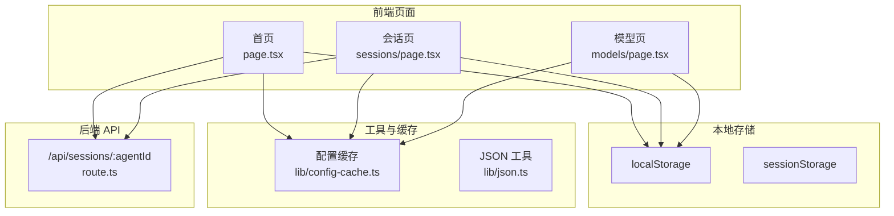
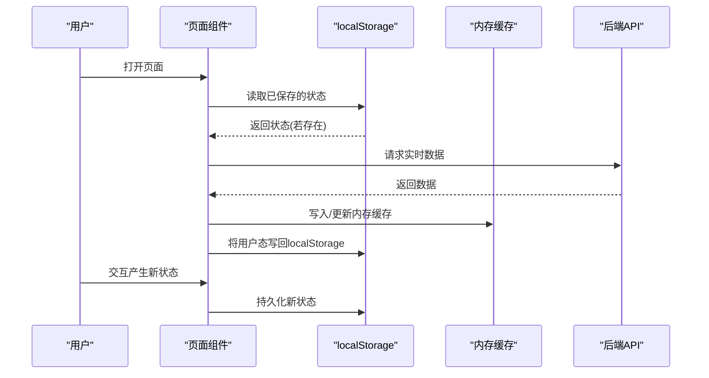
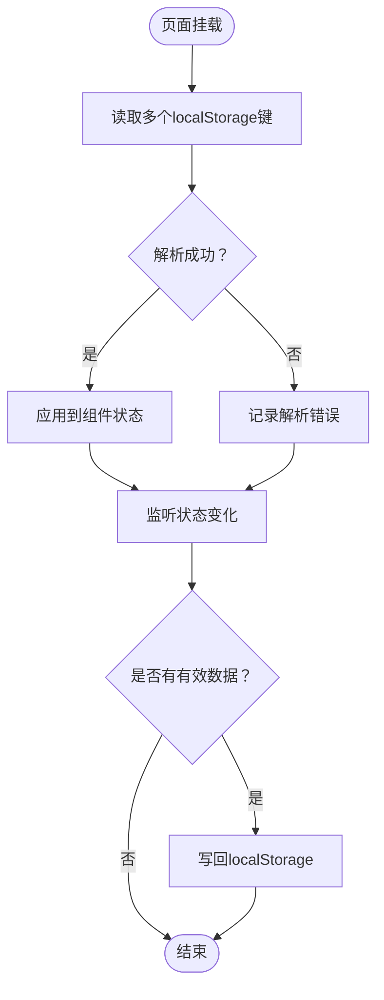
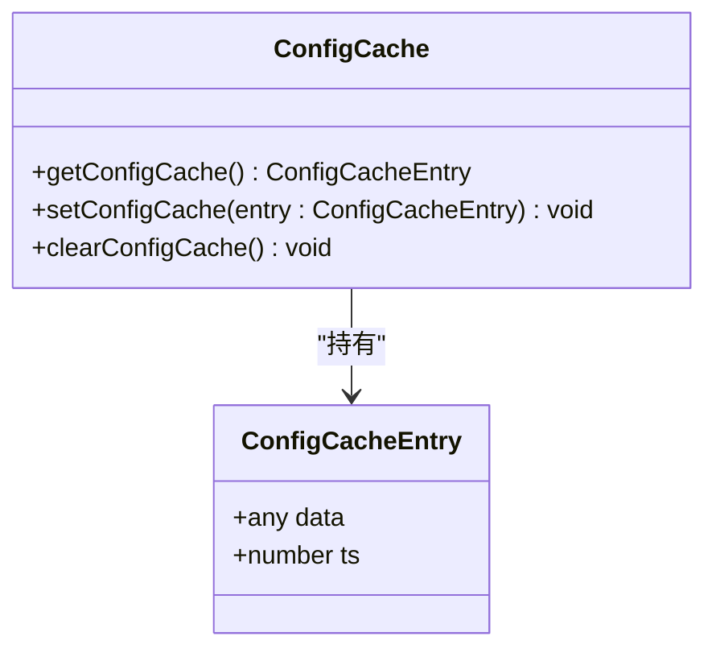
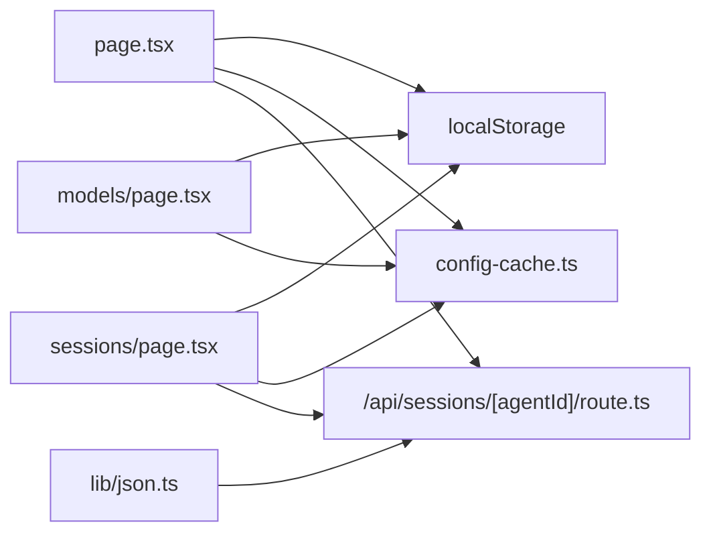

# 状态持久化

<cite>
**本文引用的文件**
- [OpenClaw-bot-review-main/app/page.tsx](file://OpenClaw-bot-review-main/app/page.tsx)
- [OpenClaw-bot-review-main/app/sessions/page.tsx](file://OpenClaw-bot-review-main/app/sessions/page.tsx)
- [OpenClaw-bot-review-main/app/models/page.tsx](file://OpenClaw-bot-review-main/app/models/page.tsx)
- [OpenClaw-bot-review-main/lib/config-cache.ts](file://OpenClaw-bot-review-main/lib/config-cache.ts)
- [OpenClaw-bot-review-main/lib/json.ts](file://OpenClaw-bot-review-main/lib/json.ts)
- [OpenClaw-bot-review-main/app/api/sessions/[agentId]/route.ts](file://OpenClaw-bot-review-main/app/api/sessions/[agentId]/route.ts)
- [ARCHITECTURE.md](file://ARCHITECTURE.md)
</cite>

## 目录
1. [引言](#引言)
2. [项目结构](#项目结构)
3. [核心组件](#核心组件)
4. [架构总览](#架构总览)
5. [组件详解](#组件详解)
6. [依赖关系分析](#依赖关系分析)
7. [性能考量](#性能考量)
8. [故障排查指南](#故障排查指南)
9. [结论](#结论)
10. [附录](#附录)

## 引言
本文件系统性梳理 HotClaw 的状态持久化机制，覆盖前端本地存储策略（localStorage/sessionStorage 使用场景与数据结构）、状态序列化与反序列化（数据转换、版本兼容与迁移）、状态恢复（应用重启后的重建、默认值与错误恢复）、缓存策略（失效与更新、存储空间管理）、备份与恢复（手动导出/导入与自动备份）、以及清理与回收（过期数据与空间优化）。文档同时兼顾初学者对状态持久化基本概念的理解与高级开发者的复杂场景与性能优化建议。

## 项目结构
HotClaw 前端采用 Next.js 应用，状态持久化主要分布在以下位置：
- 页面级状态持久化：首页与会话页、模型页等页面通过 localStorage 持久化测试结果与界面状态。
- 临时内存缓存：lib 下的配置缓存模块用于短期内存缓存，避免重复计算或频繁请求。
- 后端数据源：会话列表等数据来自后端 API，不直接参与前端本地持久化。

图表来源
- [OpenClaw-bot-review-main/app/page.tsx](file://OpenClaw-bot-review-main/app/page.tsx)
- [OpenClaw-bot-review-main/app/sessions/page.tsx](file://OpenClaw-bot-review-main/app/sessions/page.tsx)
- [OpenClaw-bot-review-main/app/models/page.tsx](file://OpenClaw-bot-review-main/app/models/page.tsx)
- [OpenClaw-bot-review-main/lib/config-cache.ts](file://OpenClaw-bot-review-main/lib/config-cache.ts)
- [OpenClaw-bot-review-main/lib/json.ts](file://OpenClaw-bot-review-main/lib/json.ts)
- [OpenClaw-bot-review-main/app/api/sessions/[agentId]/route.ts](file://OpenClaw-bot-review-main/app/api/sessions/[agentId]/route.ts)

章节来源
- [OpenClaw-bot-review-main/app/page.tsx](file://OpenClaw-bot-review-main/app/page.tsx)
- [OpenClaw-bot-review-main/app/sessions/page.tsx](file://OpenClaw-bot-review-main/app/sessions/page.tsx)
- [OpenClaw-bot-review-main/app/models/page.tsx](file://OpenClaw-bot-review-main/app/models/page.tsx)
- [OpenClaw-bot-review-main/lib/config-cache.ts](file://OpenClaw-bot-review-main/lib/config-cache.ts)
- [OpenClaw-bot-review-main/lib/json.ts](file://OpenClaw-bot-review-main/lib/json.ts)
- [OpenClaw-bot-review-main/app/api/sessions/[agentId]/route.ts](file://OpenClaw-bot-review-main/app/api/sessions/[agentId]/route.ts)

## 核心组件
- 页面级本地持久化
  - 首页：首次加载从 localStorage 恢复“测试结果”状态，并在状态变化时写回；同时维护“刷新间隔”等界面状态。
  - 会话页：从 localStorage 恢复“会话测试结果”，并在有结果时写回。
  - 模型页：从 localStorage 恢复“模型测试结果”，并在有结果时写回。
- 内存缓存
  - 配置缓存模块提供内存级缓存条目，包含数据与时间戳，便于短期内复用，避免重复请求与解析。
- JSON 工具
  - 提供去除 UTF-8 BOM、文本解析与文件读取的 JSON 工具函数，用于后端侧或工具链中的 JSON 处理。
- 后端 API
  - 会话列表 API 从磁盘读取 JSON 文件并返回，作为页面数据源之一。

章节来源
- [OpenClaw-bot-review-main/app/page.tsx](file://OpenClaw-bot-review-main/app/page.tsx)
- [OpenClaw-bot-review-main/app/sessions/page.tsx](file://OpenClaw-bot-review-main/app/sessions/page.tsx)
- [OpenClaw-bot-review-main/app/models/page.tsx](file://OpenClaw-bot-review-main/app/models/page.tsx)
- [OpenClaw-bot-review-main/lib/config-cache.ts](file://OpenClaw-bot-review-main/lib/config-cache.ts)
- [OpenClaw-bot-review-main/lib/json.ts](file://OpenClaw-bot-review-main/lib/json.ts)
- [OpenClaw-bot-review-main/app/api/sessions/[agentId]/route.ts](file://OpenClaw-bot-review-main/app/api/sessions/[agentId]/route.ts)

## 架构总览
HotClaw 的状态持久化以“页面级本地存储 + 内存缓存 + 后端数据源”为主，形成如下闭环：
- 页面初次渲染时，优先从 localStorage 恢复用户可见状态（如测试结果、界面偏好），随后异步拉取后端数据进行补充与覆盖。
- 用户交互产生的中间态与临时结果，持续写入 localStorage，确保刷新/重启后可恢复。
- 对于高频访问的数据，使用内存缓存减少重复解析与网络请求。
- 后端 API 作为权威数据源，负责提供结构化数据（如会话列表），前端仅做本地展示与持久化。

图表来源
- [OpenClaw-bot-review-main/app/page.tsx](file://OpenClaw-bot-review-main/app/page.tsx)
- [OpenClaw-bot-review-main/app/sessions/page.tsx](file://OpenClaw-bot-review-main/app/sessions/page.tsx)
- [OpenClaw-bot-review-main/app/models/page.tsx](file://OpenClaw-bot-review-main/app/models/page.tsx)
- [OpenClaw-bot-review-main/lib/config-cache.ts](file://OpenClaw-bot-review-main/lib/config-cache.ts)
- [OpenClaw-bot-review-main/app/api/sessions/[agentId]/route.ts](file://OpenClaw-bot-review-main/app/api/sessions/[agentId]/route.ts)

## 组件详解

### 页面级本地持久化（localStorage）
- 首页
  - 恢复逻辑：组件挂载时从 localStorage 读取多种测试结果键，逐个尝试解析并设置状态。
  - 写回逻辑：当任一测试结果状态更新时，立即写回对应键。
  - 典型键名：agentTestResults、platformTestResults、sessionTestResults、dmSessionResults。
- 会话页
  - 恢复逻辑：组件挂载时从 localStorage 读取 sessionTestResults 并解析。
  - 写回逻辑：当测试结果非空时写回。
- 模型页
  - 恢复逻辑：组件挂载时从 localStorage 读取 modelTestResults 并解析。
  - 写回逻辑：当测试结果非空时写回。

图表来源
- [OpenClaw-bot-review-main/app/page.tsx](file://OpenClaw-bot-review-main/app/page.tsx)
- [OpenClaw-bot-review-main/app/sessions/page.tsx](file://OpenClaw-bot-review-main/app/sessions/page.tsx)
- [OpenClaw-bot-review-main/app/models/page.tsx](file://OpenClaw-bot-review-main/app/models/page.tsx)

章节来源
- [OpenClaw-bot-review-main/app/page.tsx](file://OpenClaw-bot-review-main/app/page.tsx)
- [OpenClaw-bot-review-main/app/sessions/page.tsx](file://OpenClaw-bot-review-main/app/sessions/page.tsx)
- [OpenClaw-bot-review-main/app/models/page.tsx](file://OpenClaw-bot-review-main/app/models/page.tsx)

### 内存缓存（短期驻留）
- 设计要点
  - 缓存条目包含数据与时间戳，便于后续判断是否需要更新。
  - 提供获取、设置、清空三个基础操作，便于在组件生命周期内控制缓存。
- 使用场景
  - 首屏数据的短期缓存，避免重复请求与解析。
  - 在页面切换或组件卸载时，可选择保留或清理缓存，平衡性能与内存占用。

图表来源
- [OpenClaw-bot-review-main/lib/config-cache.ts](file://OpenClaw-bot-review-main/lib/config-cache.ts)

章节来源
- [OpenClaw-bot-review-main/lib/config-cache.ts](file://OpenClaw-bot-review-main/lib/config-cache.ts)

### JSON 工具（序列化与兼容）
- 功能概述
  - 去除 UTF-8 BOM，保证跨平台 JSON 文本一致性。
  - 提供文本解析与文件读取方法，便于后端或工具链处理 JSON。
- 适用场景
  - 后端读取磁盘 JSON 文件时的预处理。
  - 前端侧工具链中对 JSON 文本的安全解析。

章节来源
- [OpenClaw-bot-review-main/lib/json.ts](file://OpenClaw-bot-review-main/lib/json.ts)

### 后端 API（数据源与持久化边界）
- 会话列表 API
  - 从磁盘读取 JSON 文件并解析，返回结构化会话列表。
  - 该接口不涉及浏览器端的本地持久化，属于后端侧数据持久化与提供。
- 与前端的关系
  - 前端仅负责展示与本地状态持久化，不直接修改后端文件。
  - 前端可通过其他 API 触发后端写入，但当前分析范围内的持久化边界在前端本地存储。

章节来源
- [OpenClaw-bot-review-main/app/api/sessions/[agentId]/route.ts](file://OpenClaw-bot-review-main/app/api/sessions/[agentId]/route.ts)

## 依赖关系分析
- 组件与本地存储
  - 首页、会话页、模型页均依赖 localStorage 进行状态恢复与写回。
- 组件与内存缓存
  - 三者在运行时可能使用内存缓存提升性能，避免重复解析与请求。
- 组件与后端 API
  - 会话页与首页依赖后端 API 获取实时数据，作为权威数据源。
- 工具与数据处理
  - JSON 工具为后端侧读取与解析提供支持，间接影响前端侧数据一致性。

图表来源
- [OpenClaw-bot-review-main/app/page.tsx](file://OpenClaw-bot-review-main/app/page.tsx)
- [OpenClaw-bot-review-main/app/sessions/page.tsx](file://OpenClaw-bot-review-main/app/sessions/page.tsx)
- [OpenClaw-bot-review-main/app/models/page.tsx](file://OpenClaw-bot-review-main/app/models/page.tsx)
- [OpenClaw-bot-review-main/lib/config-cache.ts](file://OpenClaw-bot-review-main/lib/config-cache.ts)
- [OpenClaw-bot-review-main/lib/json.ts](file://OpenClaw-bot-review-main/lib/json.ts)
- [OpenClaw-bot-review-main/app/api/sessions/[agentId]/route.ts](file://OpenClaw-bot-review-main/app/api/sessions/[agentId]/route.ts)

章节来源
- [OpenClaw-bot-review-main/app/page.tsx](file://OpenClaw-bot-review-main/app/page.tsx)
- [OpenClaw-bot-review-main/app/sessions/page.tsx](file://OpenClaw-bot-review-main/app/sessions/page.tsx)
- [OpenClaw-bot-review-main/app/models/page.tsx](file://OpenClaw-bot-review-main/app/models/page.tsx)
- [OpenClaw-bot-review-main/lib/config-cache.ts](file://OpenClaw-bot-review-main/lib/config-cache.ts)
- [OpenClaw-bot-review-main/lib/json.ts](file://OpenClaw-bot-review-main/lib/json.ts)
- [OpenClaw-bot-review-main/app/api/sessions/[agentId]/route.ts](file://OpenClaw-bot-review-main/app/api/sessions/[agentId]/route.ts)

## 性能考量
- 本地存储写入频率
  - 测试结果状态在每次变化时写回 localStorage，建议合并写入或节流，避免频繁 IO。
- 解析与序列化成本
  - 大对象序列化/反序列化会带来 CPU 开销，建议按需解析与最小化存储体积。
- 内存缓存命中率
  - 合理设置缓存有效期与大小上限，避免内存膨胀；对不常变的数据启用缓存。
- 网络与渲染开销
  - 首屏优先从 localStorage 恢复，再异步拉取后端数据，缩短白屏时间。
- 存储空间管理
  - 定期清理过期或冗余键，避免 localStorage 满载导致写入失败。

## 故障排查指南
- 解析失败
  - 现象：控制台出现解析错误日志。
  - 排查：检查 localStorage 中对应键是否存在、格式是否为合法 JSON、是否被其他脚本篡改。
  - 处理：捕获异常并降级为空状态，允许用户重新触发测试。
- 写入失败
  - 现象：状态未持久化或容量超限。
  - 排查：检查浏览器隐私模式、存储配额限制、键名冲突。
  - 处理：提供手动导出/导入入口，或提示用户清理多余键。
- 数据不一致
  - 现象：本地状态与后端最新数据不一致。
  - 排查：确认后端 API 是否正常、前端是否正确覆盖本地状态。
  - 处理：提供“手动刷新”按钮，强制覆盖本地状态。
- 缓存污染
  - 现象：旧缓存导致页面显示异常。
  - 排查：检查缓存时间戳与版本字段。
  - 处理：提供“清除缓存”入口，或在升级时迁移缓存结构。

章节来源
- [OpenClaw-bot-review-main/app/page.tsx](file://OpenClaw-bot-review-main/app/page.tsx)
- [OpenClaw-bot-review-main/app/sessions/page.tsx](file://OpenClaw-bot-review-main/app/sessions/page.tsx)
- [OpenClaw-bot-review-main/app/models/page.tsx](file://OpenClaw-bot-review-main/app/models/page.tsx)
- [OpenClaw-bot-review-main/lib/config-cache.ts](file://OpenClaw-bot-review-main/lib/config-cache.ts)

## 结论
HotClaw 的状态持久化以“页面级本地存储 + 内存缓存 + 后端数据源”为核心路径，实现了用户态的快速恢复与轻量持久化。通过合理的序列化/反序列化、错误处理与缓存策略，系统在可用性与性能之间取得平衡。对于更复杂的持久化需求（版本兼容、自动备份、空间治理），可在现有基础上扩展键空间管理、版本标记与迁移脚本，以及提供手动/自动备份导出入口。

## 附录

### 数据结构与键名规范
- 首页测试结果键
  - agentTestResults：代理模型测试结果映射。
  - platformTestResults：代理-平台组合测试结果映射。
  - sessionTestResults：代理会话测试结果映射。
  - dmSessionResults：代理-私聊会话测试结果映射。
- 会话页测试结果键
  - sessionTestResults：会话测试结果映射。
- 模型页测试结果键
  - modelTestResults：模型测试结果映射。

章节来源
- [OpenClaw-bot-review-main/app/page.tsx](file://OpenClaw-bot-review-main/app/page.tsx)
- [OpenClaw-bot-review-main/app/sessions/page.tsx](file://OpenClaw-bot-review-main/app/sessions/page.tsx)
- [OpenClaw-bot-review-main/app/models/page.tsx](file://OpenClaw-bot-review-main/app/models/page.tsx)

### 版本兼容与迁移策略
- 建议
  - 为关键键增加版本号字段，读取时判断版本并执行迁移。
  - 迁移过程采用“就地修复 + 渐进替换”，避免一次性大改动。
  - 提供“一键迁移”入口，允许用户主动触发迁移。
- 依据
  - 现有代码对 JSON 文本解析与错误处理已有基础，可在此基础上扩展版本字段与迁移逻辑。

章节来源
- [OpenClaw-bot-review-main/lib/json.ts](file://OpenClaw-bot-review-main/lib/json.ts)
- [OpenClaw-bot-review-main/app/page.tsx](file://OpenClaw-bot-review-main/app/page.tsx)

### 备份与恢复
- 手动导出/导入
  - 建议在设置页提供“导出全部本地状态”与“从文件导入”的入口，便于用户跨设备或重装后恢复。
  - 导出内容应包含所有关键键及其版本信息，导入时进行校验与迁移。
- 自动备份
  - 可在用户空闲时段定期生成备份文件，存储于本地或云端（需用户授权）。
  - 提供“最近备份时间”与“恢复进度”提示，增强透明度。

[本节为通用实践建议，不直接分析具体文件，故无章节来源]

### 清理与垃圾回收
- 过期数据清理
  - 为测试结果键增加 TTL 字段，定期扫描并删除过期项。
- 存储空间优化
  - 提供“清理无用键”按钮，按页面维度批量清理。
  - 对大对象采用分片存储或压缩策略，降低体积。

[本节为通用实践建议，不直接分析具体文件，故无章节来源]