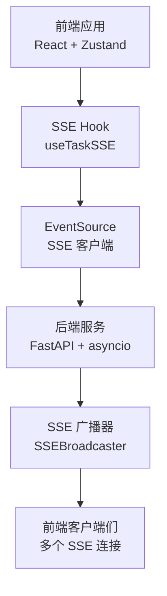
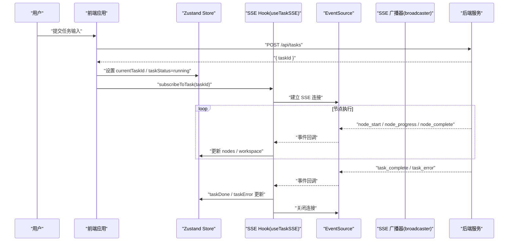
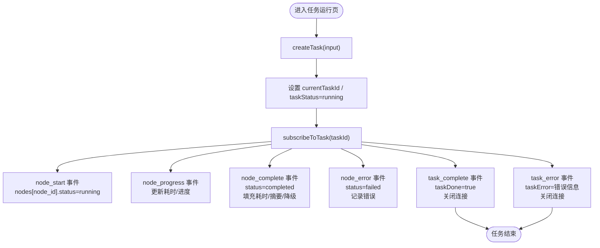
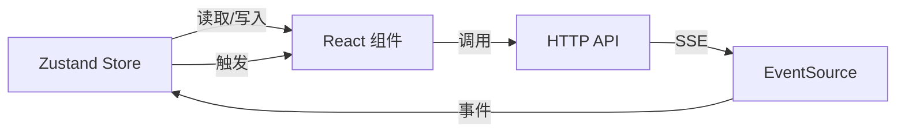

# 状态管理

<cite>
**本文引用的文件**
- [ARCHITECTURE.md](file://ARCHITECTURE.md)
- [useTaskSSE.ts](file://frontend/hooks/useTaskSSE.ts)
- [index.ts](file://frontend/types/index.ts)
- [broadcaster.py](file://backend/app/orchestrator/broadcaster.py)
</cite>

## 目录
1. [引言](#引言)
2. [项目结构](#项目结构)
3. [核心组件](#核心组件)
4. [架构总览](#架构总览)
5. [详细组件分析](#详细组件分析)
6. [依赖分析](#依赖分析)
7. [性能考量](#性能考量)
8. [故障排查指南](#故障排查指南)
9. [结论](#结论)
10. [附录](#附录)

## 引言
本文件系统化梳理 HotClaw 的状态管理方案，围绕前端 Zustand 状态库的使用，结合后端 SSE 广播机制，构建“任务状态管理、配置状态管理、历史记录状态管理”的完整闭环。文档同时覆盖实时状态同步、持久化与重置策略、调试与性能优化、以及内存泄漏防护等工程实践，既面向初学者解释基本概念，也为高级开发者提供复杂场景的落地参考。

## 项目结构
HotClaw 前后端分离，前端采用 React + Zustand + SSE，后端采用 FastAPI + asyncio，通过 SSE 将任务节点状态实时推送到前端。状态管理的关键位置如下：
- 前端状态层：Zustand Store（任务、配置、历史）
- 前端事件层：useTaskSSE Hook（SSE 订阅与事件分发）
- 后端广播层：SSEBroadcaster（事件队列、历史缓冲、订阅管理）

图表来源
- [useTaskSSE.ts:1-124](file://frontend/hooks/useTaskSSE.ts#L1-L124)
- [broadcaster.py:1-93](file://backend/app/orchestrator/broadcaster.py#L1-L93)

章节来源
- [ARCHITECTURE.md:291-323](file://ARCHITECTURE.md#L291-L323)
- [ARCHITECTURE.md:325-360](file://ARCHITECTURE.md#L325-L360)

## 核心组件
- 任务状态管理（TaskStore）
  - 负责当前任务 ID、整体任务状态、节点状态数组、工作空间快照，以及创建任务、订阅/取消订阅等动作。
- 配置状态管理（ConfigStore）
  - 负责 Agent 与 Skill 的配置列表、拉取与更新动作。
- 历史记录状态管理（HistoryStore）
  - 负责历史任务列表与总数、分页拉取与筛选。

章节来源
- [ARCHITECTURE.md:296-322](file://ARCHITECTURE.md#L296-L322)

## 架构总览
HotClaw 的状态管理采用“前端 ZUSTAND + 后端 SSE 广播”的组合：
- 前端通过 Zustand 维护任务、配置、历史三类状态，分别对应不同的 Store。
- 任务运行期间，前端通过 useTaskSSE Hook 建立 SSE 连接，后端通过 SSEBroadcaster 将节点状态事件推送给前端。
- 事件类型包括节点开始、节点完成、节点错误、任务完成、任务错误等，前端据此更新节点状态与整体任务状态。

图表来源
- [useTaskSSE.ts:28-120](file://frontend/hooks/useTaskSSE.ts#L28-L120)
- [broadcaster.py:30-78](file://backend/app/orchestrator/broadcaster.py#L30-L78)
- [ARCHITECTURE.md:325-360](file://ARCHITECTURE.md#L325-L360)

章节来源
- [ARCHITECTURE.md:325-360](file://ARCHITECTURE.md#L325-L360)

## 详细组件分析

### 任务状态管理（TaskStore）
- 状态定义
  - currentTaskId：当前任务 ID，为空表示未创建任务
  - taskStatus：任务整体状态（idle/running/completed/failed）
  - nodes：节点状态数组，包含节点 ID、代理 ID、名称、状态、耗时、错误、输出摘要、降级标记
  - workspace：工作空间快照，保存各节点输出与上下文
- 动作设计
  - createTask(input)：创建任务并返回 taskId
  - subscribeToTask(taskId)：建立 SSE 订阅，接收节点事件并更新 nodes
  - unsubscribe()：取消订阅，清理资源
- 实时同步
  - 通过 useTaskSSE Hook 管理 EventSource 生命周期，监听 node_start/node_complete/node_error/task_complete/task_error 事件，驱动 Zustand 状态更新
- UI 响应
  - 节点卡片根据状态切换样式（等待/运行/完成/失败），展示耗时与输出摘要

图表来源
- [useTaskSSE.ts:58-120](file://frontend/hooks/useTaskSSE.ts#L58-L120)
- [index.ts:68-94](file://frontend/types/index.ts#L68-L94)

章节来源
- [ARCHITECTURE.md:296-305](file://ARCHITECTURE.md#L296-L305)
- [useTaskSSE.ts:1-124](file://frontend/hooks/useTaskSSE.ts#L1-L124)
- [index.ts:1-119](file://frontend/types/index.ts#L1-L119)

### 配置状态管理（ConfigStore）
- 状态定义
  - agents：Agent 配置数组
  - skills：Skill 配置数组
- 动作设计
  - fetchAgents()/fetchSkills()：拉取配置列表
  - updateAgent(id, config)/updateSkill(id, config)：更新指定配置并持久化
- 与后端集成
  - 通过 API 路由获取/更新配置，前端 Store 作为本地缓存与编辑界面的数据源

章节来源
- [ARCHITECTURE.md:307-315](file://ARCHITECTURE.md#L307-L315)

### 历史记录状态管理（HistoryStore）
- 状态定义
  - tasks：历史任务列表
  - total：历史任务总数
- 动作设计
  - fetchTasks(page, filters?)：分页拉取历史任务并更新列表与总数
- 与后端集成
  - 通过 API 路由获取历史任务，前端 Store 作为列表页的数据源

章节来源
- [ARCHITECTURE.md:317-322](file://ARCHITECTURE.md#L317-L322)

### SSE 事件监听与状态更新（useTaskSSE Hook）
- 初始化节点状态
  - 使用固定顺序的节点清单初始化 nodes，确保前端渲染顺序与后端工作流一致
- 事件处理
  - node_start：将对应节点状态置为 running
  - node_complete：将对应节点置为 completed，并填充耗时、摘要、降级标记
  - node_error：将对应节点置为 failed，并记录错误
  - task_complete：标记任务完成，关闭连接
  - task_error：记录任务级错误，关闭连接
- 生命周期管理
  - 在 taskId 变化时重置状态并重新订阅
  - 组件卸载时关闭 EventSource，避免内存泄漏

章节来源
- [useTaskSSE.ts:1-124](file://frontend/hooks/useTaskSSE.ts#L1-L124)

### 后端 SSE 广播（SSEBroadcaster）
- 订阅管理
  - 为每个 task_id 维护订阅队列，新订阅加入队列并回放历史事件
- 历史缓冲
  - 为每个 task_id 维护事件历史，保证晚到订阅也能收到完整事件流
- 关闭与清理
  - 任务结束后发送结束信号并关闭连接，60 秒后清理历史与关闭标记，防止内存泄漏

章节来源
- [broadcaster.py:1-93](file://backend/app/orchestrator/broadcaster.py#L1-L93)

## 依赖分析
- 前端依赖
  - Zustand：状态容器，提供轻量、无样板的状态管理
  - React Hooks：useEffect/useCallback/useRef 管理 SSE 生命周期
  - EventSource：浏览器原生 SSE 客户端
- 后端依赖
  - asyncio：异步事件循环，支撑 SSE 广播
  - FastAPI：提供 SSE 端点与任务 API
- 类型与契约
  - 前后端通过统一的 SSE 事件类型与任务状态枚举对齐，确保事件语义一致

图表来源
- [useTaskSSE.ts:1-124](file://frontend/hooks/useTaskSSE.ts#L1-L124)
- [ARCHITECTURE.md:325-360](file://ARCHITECTURE.md#L325-L360)

章节来源
- [ARCHITECTURE.md:291-323](file://ARCHITECTURE.md#L291-L323)

## 性能考量
- SSE 连接复用
  - 同一任务仅维持一个 EventSource 连接，避免重复连接开销
- 事件去抖与批处理
  - 前端按事件粒度更新，避免不必要的重渲染；必要时可在 Store 层引入浅比较与选择器减少订阅者刷新
- 历史缓冲大小控制
  - 后端为每个任务维护事件历史，任务结束后定时清理，避免无限增长
- 渲染优化
  - 节点卡片组件按状态切换样式，避免在运行态频繁计算；使用 memo 化组件减少重渲染

[本节为通用性能建议，无需特定文件引用]

## 故障排查指南
- 无法建立 SSE 连接
  - 检查 taskId 是否存在且已创建成功
  - 检查后端 SSE 端点是否可达，网络与跨域配置
- 事件丢失或顺序错乱
  - 确认后端是否正确回放历史事件；前端是否在订阅时正确处理回放
- 任务完成后仍显示运行中
  - 检查 task_complete 事件是否到达；确认前端是否正确关闭连接
- 内存泄漏
  - 确保组件卸载时调用 unsubscribe/close；后端任务结束后清理历史与订阅

章节来源
- [useTaskSSE.ts:113-120](file://frontend/hooks/useTaskSSE.ts#L113-L120)
- [broadcaster.py:70-84](file://backend/app/orchestrator/broadcaster.py#L70-L84)

## 结论
HotClaw 的状态管理以 Zustand 为核心，结合 SSE 实现实时状态同步，形成“前端 Store + 后端广播”的高效闭环。通过明确的任务状态、节点状态与事件类型契约，系统在 MVP 阶段实现了稳定的可视化运行与回放能力。后续可在 Store 层引入持久化与时间旅行调试、优化事件批处理与渲染性能，并完善错误降级与可观测性。

[本节为总结性内容，无需特定文件引用]

## 附录

### 状态管理最佳实践
- 状态拆分
  - 将任务、配置、历史拆分为独立 Store，降低耦合与订阅范围
- 动作幂等
  - 更新动作应具备幂等性，避免重复事件导致状态不一致
- 事件版本化
  - 为 SSE 事件增加版本号，便于前后端兼容升级
- 超时与重连
  - 前端实现 SSE 自动重连与超时检测，提升鲁棒性

[本节为通用最佳实践，无需特定文件引用]

### 状态调试与时间旅行
- 调试工具
  - 使用 React DevTools 与 Zustand Devtools 监控状态变化与动作序列
- 时间旅行
  - 在开发环境启用动作录制与回放，支持“回到过去”观察状态演化
- 日志与追踪
  - 记录关键动作与事件，结合 trace_id 追踪任务全链路

[本节为通用调试建议，无需特定文件引用]