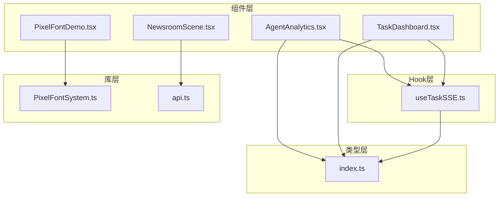
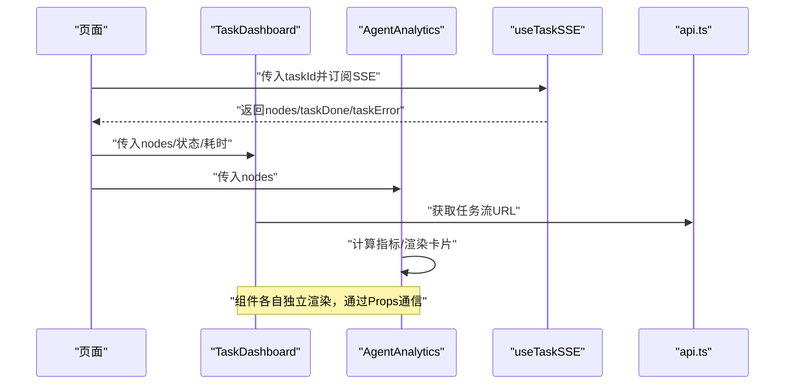
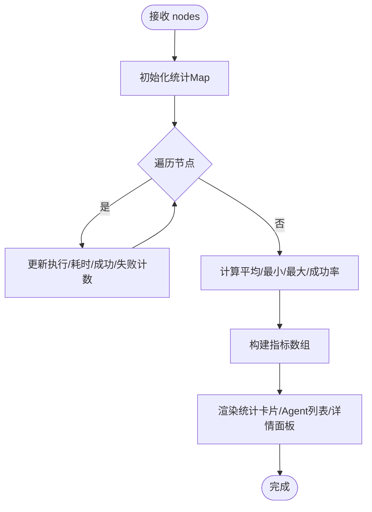
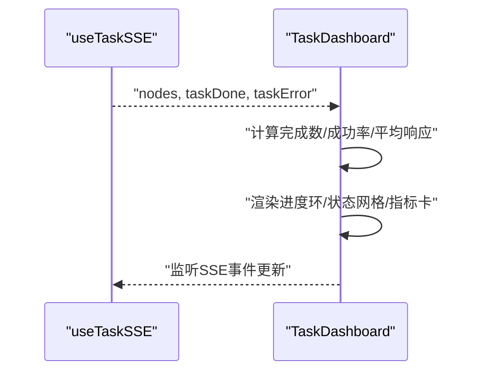
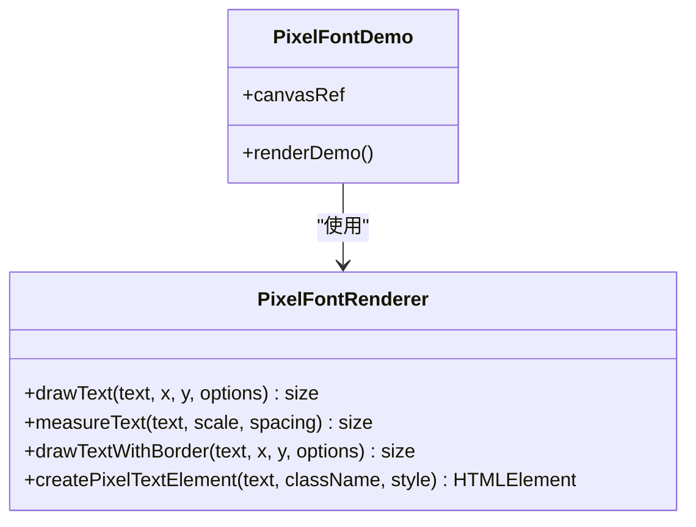
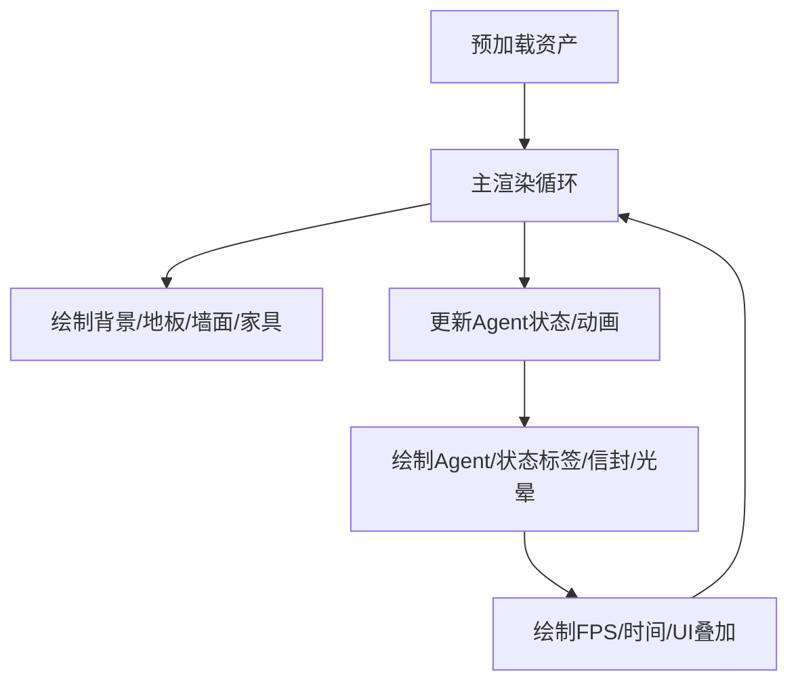
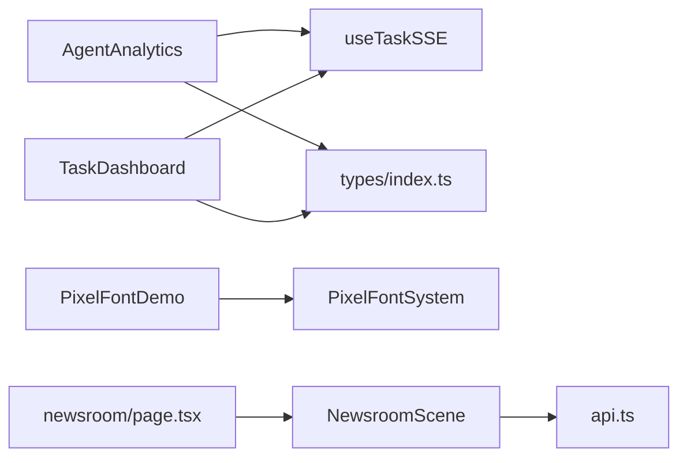

# UI组件库

<cite>
**本文引用的文件**
- [AgentAnalytics.tsx](file://frontend/components/analytics/AgentAnalytics.tsx)
- [TaskDashboard.tsx](file://frontend/components/dashboard/TaskDashboard.tsx)
- [PixelFontDemo.tsx](file://frontend/components/demo/PixelFontDemo.tsx)
- [PixelFontSystem.ts](file://frontend/lib/pixel-font/PixelFontSystem.ts)
- [useTaskSSE.ts](file://frontend/hooks/useTaskSSE.ts)
- [index.ts](file://frontend/types/index.ts)
- [NewsroomScene.tsx](file://frontend/components/NewsroomScene.tsx)
- [page.tsx](file://frontend/app/newsroom/page.tsx)
- [api.ts](file://frontend/lib/api.ts)
</cite>

## 目录
1. [引言](#引言)
2. [项目结构](#项目结构)
3. [核心组件](#核心组件)
4. [架构总览](#架构总览)
5. [详细组件分析](#详细组件分析)
6. [依赖关系分析](#依赖关系分析)
7. [性能考量](#性能考量)
8. [故障排查指南](#故障排查指南)
9. [结论](#结论)
10. [附录](#附录)

## 引言
本文件面向UI组件库的使用者与维护者，系统化梳理通用UI组件的设计原则、可复用性与组合模式；深入解析数据分析组件AgentAnalytics的图表渲染、数据可视化与交互设计；阐述任务仪表板组件TaskDashboard的布局设计、状态展示与操作控制；说明新闻室场景组件的功能实现、内容管理与用户界面；解释像素字体演示组件的字体渲染、样式控制与性能优化；并提供组件Props接口定义、TypeScript类型约束与类型安全保证，以及可访问性、响应式布局与跨浏览器兼容性的实现要点。

## 项目结构
前端组件库位于frontend目录，采用按功能域分层组织：
- components：通用UI组件与业务场景组件（如数据分析、仪表板、像素字体演示、新闻室场景等）
- hooks：自定义Hook（如任务SSE事件流）
- lib：底层能力封装（如像素字体系统、API客户端）
- types：共享TypeScript类型定义
- app：页面入口与路由页面（如新闻室页面）

**图表来源**
- [AgentAnalytics.tsx:1-276](file://frontend/components/analytics/AgentAnalytics.tsx#L1-L276)
- [TaskDashboard.tsx:1-176](file://frontend/components/dashboard/TaskDashboard.tsx#L1-L176)
- [PixelFontDemo.tsx:1-149](file://frontend/components/demo/PixelFontDemo.tsx#L1-L149)
- [NewsroomScene.tsx:1-482](file://frontend/components/NewsroomScene.tsx#L1-L482)
- [useTaskSSE.ts:1-124](file://frontend/hooks/useTaskSSE.ts#L1-L124)
- [PixelFontSystem.ts:1-579](file://frontend/lib/pixel-font/PixelFontSystem.ts#L1-L579)
- [api.ts:1-110](file://frontend/lib/api.ts#L1-L110)
- [index.ts:1-119](file://frontend/types/index.ts#L1-L119)

**章节来源**
- [AgentAnalytics.tsx:1-276](file://frontend/components/analytics/AgentAnalytics.tsx#L1-L276)
- [TaskDashboard.tsx:1-176](file://frontend/components/dashboard/TaskDashboard.tsx#L1-L176)
- [PixelFontDemo.tsx:1-149](file://frontend/components/demo/PixelFontDemo.tsx#L1-L149)
- [NewsroomScene.tsx:1-482](file://frontend/components/NewsroomScene.tsx#L1-L482)
- [useTaskSSE.ts:1-124](file://frontend/hooks/useTaskSSE.ts#L1-L124)
- [PixelFontSystem.ts:1-579](file://frontend/lib/pixel-font/PixelFontSystem.ts#L1-L579)
- [api.ts:1-110](file://frontend/lib/api.ts#L1-L110)
- [index.ts:1-119](file://frontend/types/index.ts#L1-L119)

## 核心组件
- 数据分析组件：AgentAnalytics，负责聚合节点状态、计算指标、提供统计卡片与详情面板，并预留雷达图可视化区域。
- 任务仪表板：TaskDashboard，展示任务进度环、运行时间、Agent状态网格、性能指标卡与错误信息。
- 像素字体演示：PixelFontDemo，基于Canvas绘制像素字体，演示不同样式与边框效果。
- 新闻室场景：NewsroomScene，基于Canvas的2D像素场景，包含角色动画、工位布局与UI叠加。
- 任务SSE Hook：useTaskSSE，订阅后端SSE事件，维护节点状态与任务完成/错误状态。
- 类型系统：index.ts，统一定义任务、节点、SSE事件、仪表盘统计数据等类型。

**章节来源**
- [AgentAnalytics.tsx:13-165](file://frontend/components/analytics/AgentAnalytics.tsx#L13-L165)
- [TaskDashboard.tsx:13-176](file://frontend/components/dashboard/TaskDashboard.tsx#L13-L176)
- [PixelFontDemo.tsx:9-149](file://frontend/components/demo/PixelFontDemo.tsx#L9-L149)
- [NewsroomScene.tsx:73-482](file://frontend/components/NewsroomScene.tsx#L73-L482)
- [useTaskSSE.ts:7-124](file://frontend/hooks/useTaskSSE.ts#L7-L124)
- [index.ts:5-118](file://frontend/types/index.ts#L5-L118)

## 架构总览
组件通过Hook与类型系统解耦后端数据流，以Props驱动渲染，遵循单一职责与组合优先的设计原则。

**图表来源**
- [TaskDashboard.tsx:21-176](file://frontend/components/dashboard/TaskDashboard.tsx#L21-L176)
- [AgentAnalytics.tsx:30-165](file://frontend/components/analytics/AgentAnalytics.tsx#L30-L165)
- [useTaskSSE.ts:28-124](file://frontend/hooks/useTaskSSE.ts#L28-L124)
- [api.ts:48-50](file://frontend/lib/api.ts#L48-L50)

## 详细组件分析

### AgentAnalytics 组件分析
- 设计原则
  - 单一职责：仅负责Agent性能分析与可视化，不关心任务生命周期。
  - 可复用性：通过Props接收节点数据，内部计算指标并渲染统计卡片与详情面板。
  - 组合模式：StatCard、AgentRow、AgentDetailPanel、DetailItem均为内嵌组件，便于拆分与重用。
- Props接口与类型约束
  - AgentAnalyticsProps：nodes（NodeState[]）、className（可选）。
  - AgentMetric：包含agentId、name、执行次数、成功/失败次数、平均/最小/最大响应时间、成功率等。
  - NodeState来自useTaskSSE，包含节点ID、Agent ID、名称、状态、耗时、错误等。
- 数据处理流程
  - 使用Map统计每个Agent的执行次数、总耗时、最小/最大耗时、成功/失败次数。
  - 计算平均响应时间、成功率，生成指标数组。
  - 颜色映射：根据Agent ID集合索引分配颜色，确保一致性。
- 交互与可视化
  - 列表项支持点击展开详情；详情面板展示执行次数、成功/失败、平均/范围响应与成功率。
  - 预留雷达图区域，当前为占位符，便于后续接入可视化库。
- 可访问性与响应式
  - 使用语义化标题与栅格布局，文本使用等宽字体增强可读性。
  - 通过className扩展样式，适配深色主题与窄屏设备。

**图表来源**
- [AgentAnalytics.tsx:35-85](file://frontend/components/analytics/AgentAnalytics.tsx#L35-L85)

**章节来源**
- [AgentAnalytics.tsx:13-165](file://frontend/components/analytics/AgentAnalytics.tsx#L13-L165)
- [index.ts:66-94](file://frontend/types/index.ts#L66-L94)
- [useTaskSSE.ts:7-16](file://frontend/hooks/useTaskSSE.ts#L7-L16)

### TaskDashboard 组件分析
- 设计原则
  - 实时性：基于SSE事件流动态更新节点状态与任务进度。
  - 可视化优先：进度环直观展示完成比例，状态网格快速识别异常。
  - 信息层级：将关键指标（运行时间、平均响应、成功率、完成节点数）分层展示。
- Props接口与类型约束
  - DashboardProps：nodes、taskDone、taskError、taskId、elapsedTime。
  - 节点状态来源于useTaskSSE，包含节点ID、Agent ID、名称、状态、耗时、错误摘要等。
- 数据处理流程
  - 计算完成节点数、总节点数、成功率、平均响应时间。
  - 进度百分比=完成节点/总节点*100。
- 交互与可视化
  - 进度环：SVG绘制，strokeDasharray表示完成比例。
  - Agent状态网格：根据状态切换边框颜色与背景高亮。
  - 性能指标卡：成功率与完成节点数双卡并列。
  - 错误信息：当存在错误时以红色区块展示。
- 可访问性与响应式
  - 使用等宽字体与紧凑布局，适合终端风格界面。
  - 响应式网格在小屏下仍保持清晰的信息密度。

**图表来源**
- [TaskDashboard.tsx:21-176](file://frontend/components/dashboard/TaskDashboard.tsx#L21-L176)
- [useTaskSSE.ts:28-124](file://frontend/hooks/useTaskSSE.ts#L28-L124)

**章节来源**
- [TaskDashboard.tsx:13-176](file://frontend/components/dashboard/TaskDashboard.tsx#L13-L176)
- [index.ts:66-94](file://frontend/types/index.ts#L66-L94)
- [useTaskSSE.ts:7-16](file://frontend/hooks/useTaskSSE.ts#L7-L16)

### 像素字体演示组件分析
- 设计原则
  - 自定义渲染：通过Canvas实现像素字体绘制，避免浏览器默认字体差异。
  - 样式控制：提供多种预设样式（标题、成功、警告、信息、弱化），支持缩放、间距与边框。
  - 性能优化：禁用图像平滑、合理缓存画布与素材、按需绘制。
- Props接口与类型约束
  - 组件本身无外部Props，通过内部Canvas上下文与渲染器实例进行绘制。
- 渲染流程
  - 初始化Canvas尺寸与像素化渲染。
  - 创建PixelFontRenderer实例，绘制标题、状态信息、Agent列表、带边框标题与数值。
  - 使用静态样式表与CSS类辅助非Canvas场景。
- 性能优化
  - imageSmoothingEnabled=false，确保像素风格。
  - 合理的帧率与绘制顺序，避免重复绘制未变化内容。

**图表来源**
- [PixelFontDemo.tsx:9-149](file://frontend/components/demo/PixelFontDemo.tsx#L9-L149)
- [PixelFontSystem.ts:394-538](file://frontend/lib/pixel-font/PixelFontSystem.ts#L394-L538)

**章节来源**
- [PixelFontDemo.tsx:9-149](file://frontend/components/demo/PixelFontDemo.tsx#L9-L149)
- [PixelFontSystem.ts:387-579](file://frontend/lib/pixel-font/PixelFontSystem.ts#L387-L579)

### 新闻室场景组件分析
- 设计原则
  - 2D像素场景：基于Canvas分层渲染（天空、地板、墙面、家具、角色、UI）。
  - 角色动画：精灵帧序列与方向控制，结合状态机实现工作、同步、空闲、离线行为。
  - 资源管理：预加载瓷砖、家具与角色素材，提升首帧体验。
- Props接口与类型约束
  - 组件本身无外部Props，内部维护资产、Agent状态与FPS计数。
- 渲染流程
  - 预加载：并行加载瓷砖、家具与角色图集。
  - 主循环：清屏、分层绘制背景/地板/墙面/家具；更新Agent状态与动画；绘制Agent与UI叠加。
  - 动画帧：每150ms切换一次帧索引，移动时插值过渡。
- 交互与可访问性
  - 作为纯展示组件，提供FPS与时钟UI叠加，便于调试与观察。
  - 通过页面容器提供标题与说明，增强上下文理解。

**图表来源**
- [NewsroomScene.tsx:177-459](file://frontend/components/NewsroomScene.tsx#L177-L459)

**章节来源**
- [NewsroomScene.tsx:73-482](file://frontend/components/NewsroomScene.tsx#L73-L482)
- [page.tsx:1-85](file://frontend/app/newsroom/page.tsx#L1-L85)

## 依赖关系分析
- 组件与Hook
  - AgentAnalytics与TaskDashboard均依赖useTaskSSE提供的节点状态与任务状态。
- 组件与类型
  - 三组件均依赖index.ts中的任务、节点、SSE事件类型，确保数据契约一致。
- 组件与库
  - PixelFontDemo依赖PixelFontSystem进行字体渲染。
  - NewsroomScene依赖api.ts中的任务流URL构造（间接通过页面或上层逻辑）。
- 组件与页面
  - 新闻室页面引入NewsroomScene作为主要场景容器。

**图表来源**
- [AgentAnalytics.tsx:10-11](file://frontend/components/analytics/AgentAnalytics.tsx#L10-L11)
- [TaskDashboard.tsx:10-11](file://frontend/components/dashboard/TaskDashboard.tsx#L10-L11)
- [useTaskSSE.ts:3-5](file://frontend/hooks/useTaskSSE.ts#L3-L5)
- [index.ts:1-119](file://frontend/types/index.ts#L1-L119)
- [PixelFontDemo.tsx](file://frontend/components/demo/PixelFontDemo.tsx#L7)
- [PixelFontSystem.ts:1-5](file://frontend/lib/pixel-font/PixelFontSystem.ts#L1-L5)
- [NewsroomScene.tsx:1-3](file://frontend/components/NewsroomScene.tsx#L1-L3)
- [api.ts:48-50](file://frontend/lib/api.ts#L48-L50)
- [page.tsx](file://frontend/app/newsroom/page.tsx#L3)

**章节来源**
- [AgentAnalytics.tsx:10-11](file://frontend/components/analytics/AgentAnalytics.tsx#L10-L11)
- [TaskDashboard.tsx:10-11](file://frontend/components/dashboard/TaskDashboard.tsx#L10-L11)
- [useTaskSSE.ts:3-5](file://frontend/hooks/useTaskSSE.ts#L3-L5)
- [index.ts:1-119](file://frontend/types/index.ts#L1-L119)
- [PixelFontDemo.tsx](file://frontend/components/demo/PixelFontDemo.tsx#L7)
- [PixelFontSystem.ts:1-5](file://frontend/lib/pixel-font/PixelFontSystem.ts#L1-L5)
- [NewsroomScene.tsx:1-3](file://frontend/components/NewsroomScene.tsx#L1-L3)
- [api.ts:48-50](file://frontend/lib/api.ts#L48-L50)
- [page.tsx](file://frontend/app/newsroom/page.tsx#L3)

## 性能考量
- 像素字体渲染
  - 禁用图像平滑，确保像素风格一致。
  - 合理的缩放与间距参数，避免过度绘制。
  - 对于大量文本，考虑批量绘制与缓存测量结果。
- 任务SSE与仪表板
  - 仅在节点状态变化时更新指标，避免不必要的重渲染。
  - 使用useMemo/useCallback缓存计算结果（可在上层页面中应用）。
- 新闻室场景
  - 并行预加载资产，减少首帧等待。
  - 控制动画帧率与绘制顺序，避免高频重绘。
  - 对于大范围平铺纹理，使用tile绘制而非逐像素绘制。
- 通用建议
  - 使用虚拟滚动处理长列表（如AgentAnalytics的Agent列表）。
  - 合理拆分组件，避免无关属性变化导致重渲染。
  - 在深色主题下注意对比度，确保可读性与可访问性。

[本节为通用指导，无需特定文件引用]

## 故障排查指南
- 任务SSE未更新
  - 检查taskId是否为空，确认EventSource连接与事件监听是否正确注册。
  - 关注SSE错误回调与关闭逻辑，避免重复连接。
- AgentAnalytics无数据
  - 确认传入的nodes是否包含有效状态与耗时字段。
  - 检查状态枚举与过滤条件，确保成功/失败计数逻辑正确。
- 像素字体显示模糊
  - 确认Canvas上下文imageSmoothingEnabled=false。
  - 检查缩放参数与像素边界，避免亚像素绘制。
- 新闻室场景资源加载失败
  - 检查静态资源路径与CDN可用性，确认预加载Promise链路。
  - 在开发环境验证资源是否存在且可访问。

**章节来源**
- [useTaskSSE.ts:58-120](file://frontend/hooks/useTaskSSE.ts#L58-L120)
- [AgentAnalytics.tsx:35-85](file://frontend/components/analytics/AgentAnalytics.tsx#L35-L85)
- [PixelFontSystem.ts](file://frontend/lib/pixel-font/PixelFontSystem.ts#L22)
- [NewsroomScene.tsx:177-217](file://frontend/components/NewsroomScene.tsx#L177-L217)

## 结论
该UI组件库以类型安全为核心，通过Hook与组件分离关注点，实现了数据分析、任务监控、像素字体与场景渲染等多样化能力。组件遵循单一职责与组合优先原则，具备良好的可复用性与扩展性。未来可在AgentAnalytics中集成实际雷达图可视化，在TaskDashboard中增加历史趋势图表，并完善测试与无障碍覆盖，进一步提升用户体验与工程质量。

[本节为总结性内容，无需特定文件引用]

## 附录

### 组件Props与类型定义速览
- AgentAnalyticsProps
  - nodes: NodeState[]
  - className?: string
- DashboardProps
  - nodes: NodeState[]
  - taskDone: boolean
  - taskError: string | null
  - taskId: string | null
  - elapsedTime: number
- PixelFontRenderer Options
  - scale?: number
  - color?: string
  - backgroundColor?: string
  - spacing?: number
- NodeState（来自useTaskSSE）
  - node_id: string
  - agent_id: string
  - name: string
  - status: NodeStatus
  - elapsed_seconds: number | null
  - error: string | null
  - output_summary: string
  - degraded: boolean

**章节来源**
- [AgentAnalytics.tsx:13-16](file://frontend/components/analytics/AgentAnalytics.tsx#L13-L16)
- [TaskDashboard.tsx:13-19](file://frontend/components/dashboard/TaskDashboard.tsx#L13-L19)
- [PixelFontSystem.ts:387-392](file://frontend/lib/pixel-font/PixelFontSystem.ts#L387-L392)
- [useTaskSSE.ts:7-16](file://frontend/hooks/useTaskSSE.ts#L7-L16)
- [index.ts:6-16](file://frontend/types/index.ts#L6-L16)

### 可访问性与响应式建议
- 可访问性
  - 为关键状态与指标提供语义化标题与标签。
  - 使用高对比度色彩与等宽字体，确保在深色主题下的可读性。
  - 为交互元素提供键盘可达性与焦点指示。
- 响应式布局
  - 使用CSS Grid/Flex在小屏下调整列数与间距。
  - 限制最大宽度与内边距，确保在窄屏下信息密度适中。
- 跨浏览器兼容
  - Canvas像素渲染在主流浏览器中表现一致，注意禁用图像平滑。
  - 对旧版浏览器提供降级方案或polyfill（如需要）。

[本节为通用指导，无需特定文件引用]