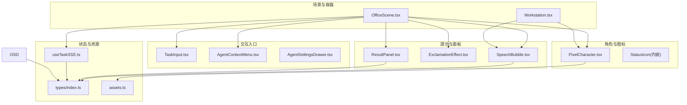
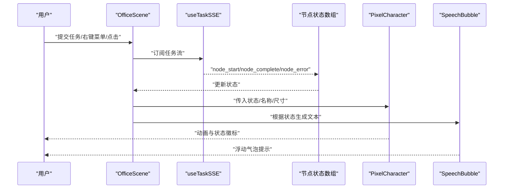
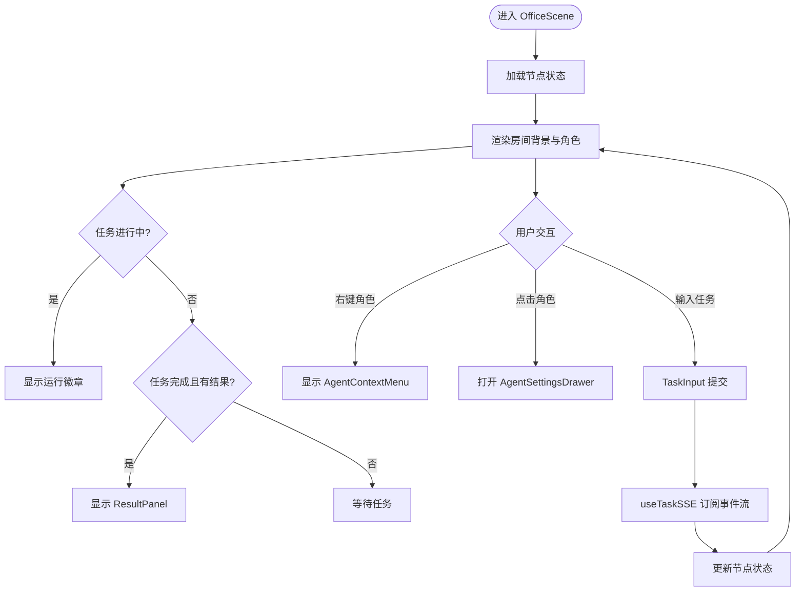
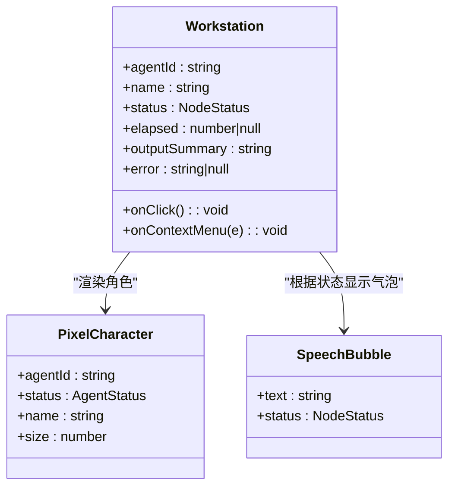
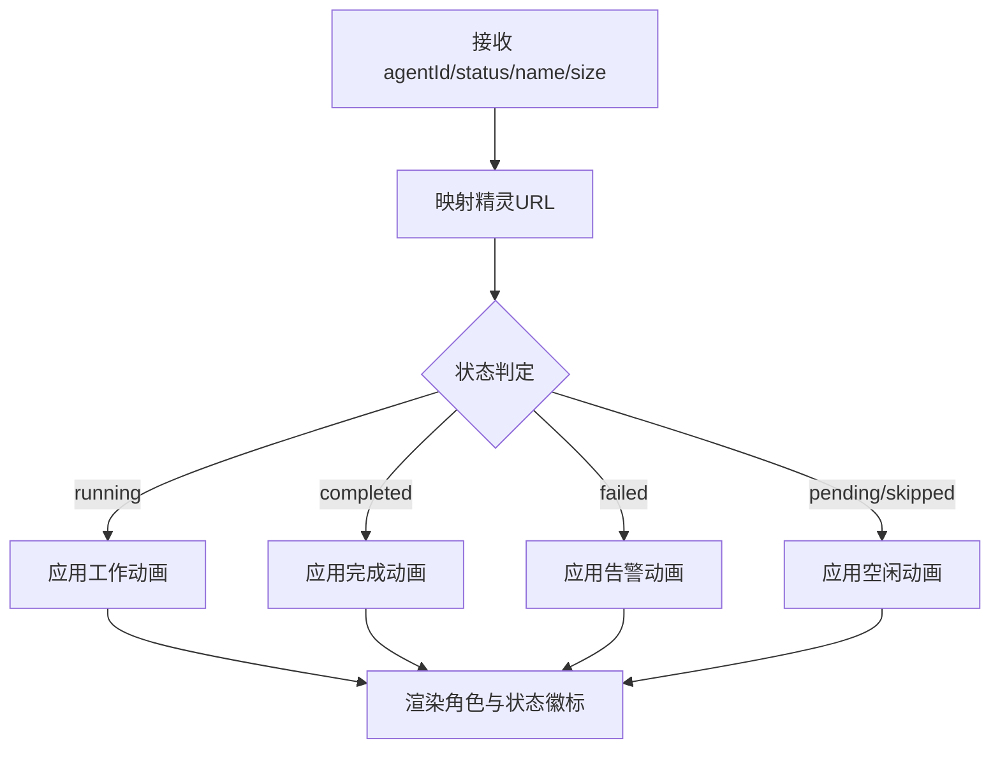
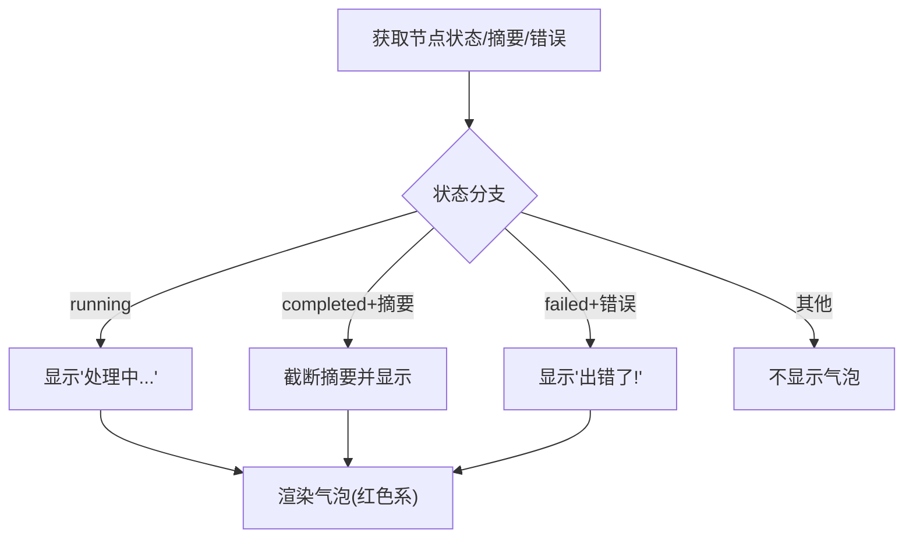
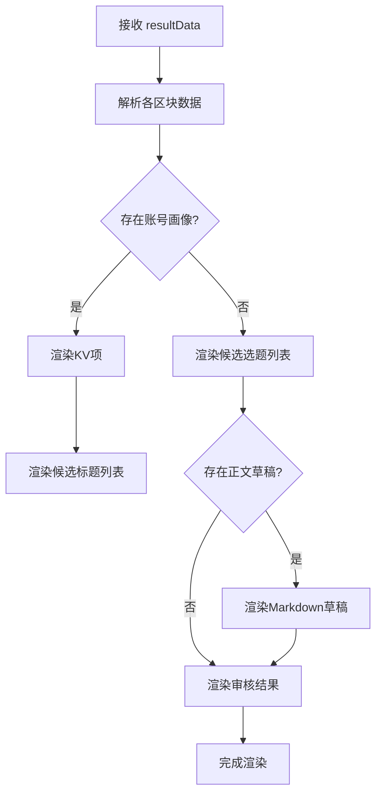
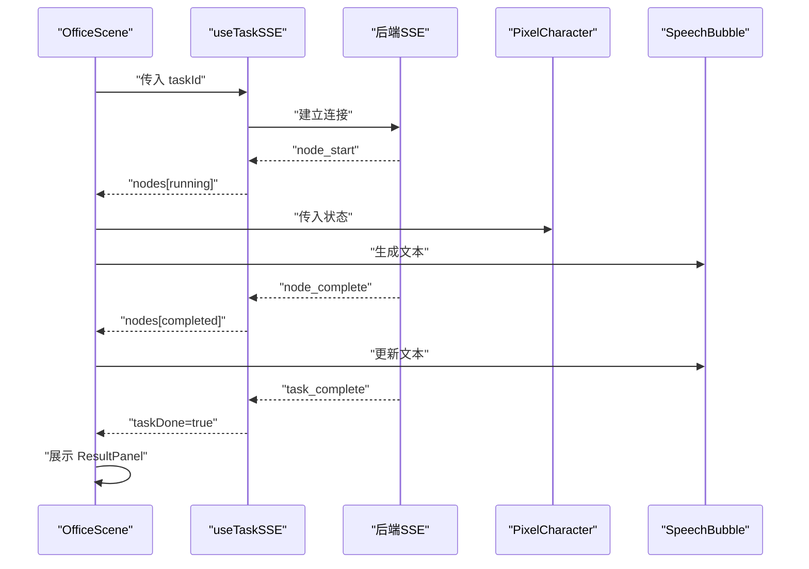
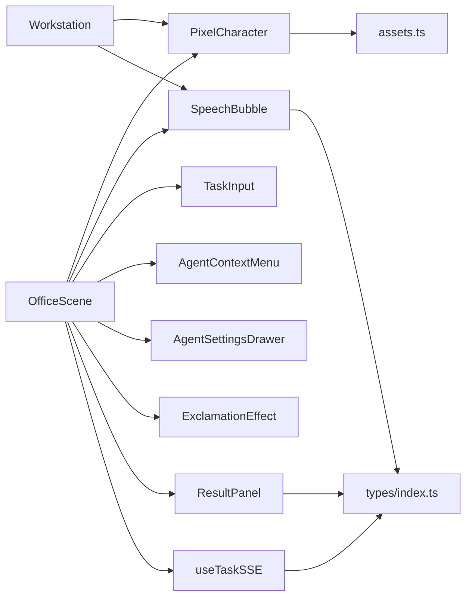

# 像素办公室组件

<cite>
**本文引用的文件**
- [OfficeScene.tsx](file://frontend/components/office/OfficeScene.tsx)
- [Workstation.tsx](file://frontend/components/office/Workstation.tsx)
- [PixelCharacter.tsx](file://frontend/components/office/PixelCharacter.tsx)
- [SpeechBubble.tsx](file://frontend/components/office/SpeechBubble.tsx)
- [ResultPanel.tsx](file://frontend/components/office/ResultPanel.tsx)
- [useTaskSSE.ts](file://frontend/hooks/useTaskSSE.ts)
- [index.ts](file://frontend/types/index.ts)
- [assets.ts](file://frontend/lib/assets.ts)
- [TaskInput.tsx](file://frontend/components/office/TaskInput.tsx)
- [AgentContextMenu.tsx](file://frontend/components/office/AgentContextMenu.tsx)
- [AgentSettingsDrawer.tsx](file://frontend/components/office/AgentSettingsDrawer.tsx)
- [ExclamationEffect.tsx](file://frontend/components/office/ExclamationEffect.tsx)
</cite>

## 目录
1. [简介](#简介)
2. [项目结构](#项目结构)
3. [核心组件](#核心组件)
4. [架构总览](#架构总览)
5. [详细组件分析](#详细组件分析)
6. [依赖关系分析](#依赖关系分析)
7. [性能考量](#性能考量)
8. [故障排查指南](#故障排查指南)
9. [结论](#结论)
10. [附录](#附录)

## 简介
本文件面向“像素办公室”前端组件体系，围绕 OfficeScene 场景、PixelCharacter 角色、Workstation 工作站、SpeechBubble 气泡、ResultPanel 结果面板等核心 UI 组件，系统梳理其设计架构、数据流与交互机制，并结合 useTaskSSE 实时事件钩子与类型定义，解释状态管理、事件传递与组件间通信方式。文档旨在帮助开发者快速理解组件职责、协作关系与扩展点。

## 项目结构
- 组件集中于 frontend/components/office 下，采用按功能分层组织：
  - 场景与容器：OfficeScene、Workstation
  - 角色与图标：PixelCharacter（含 StatusIcon）
  - 动画与提示：SpeechBubble、ExclamationEffect
  - 数据面板：ResultPanel
  - 交互入口与上下文菜单：TaskInput、AgentContextMenu、AgentSettingsDrawer
- 状态与事件：useTaskSSE 提供实时节点状态流；types/index.ts 定义任务与节点状态类型；lib/assets.ts 提供资源路径与精灵映射。

图表来源
- [OfficeScene.tsx:1-428](file://frontend/components/office/OfficeScene.tsx#L1-L428)
- [Workstation.tsx:1-120](file://frontend/components/office/Workstation.tsx#L1-L120)
- [PixelCharacter.tsx:1-83](file://frontend/components/office/PixelCharacter.tsx#L1-L83)
- [SpeechBubble.tsx:1-50](file://frontend/components/office/SpeechBubble.tsx#L1-L50)
- [ResultPanel.tsx:1-146](file://frontend/components/office/ResultPanel.tsx#L1-L146)
- [useTaskSSE.ts:1-124](file://frontend/hooks/useTaskSSE.ts#L1-L124)
- [index.ts:1-119](file://frontend/types/index.ts#L1-L119)
- [assets.ts:1-125](file://frontend/lib/assets.ts#L1-L125)

章节来源
- [OfficeScene.tsx:1-428](file://frontend/components/office/OfficeScene.tsx#L1-L428)
- [useTaskSSE.ts:1-124](file://frontend/hooks/useTaskSSE.ts#L1-L124)
- [index.ts:1-119](file://frontend/types/index.ts#L1-L119)
- [assets.ts:1-125](file://frontend/lib/assets.ts#L1-L125)

## 核心组件
- OfficeScene：主场景容器，负责房间背景、角色布局、任务日志面板、状态面板、访客面板、结果面板弹出、右键菜单与设置抽屉、以及气泡与感叹号特效的统一调度。
- Workstation：单个工作站单元，包含角色、显示器、状态指示与名称标签，支持点击与右键交互。
- PixelCharacter：角色精灵渲染器，根据状态应用不同动画类与状态徽标。
- SpeechBubble：角色上方气泡，依据状态动态切换边框与文字颜色。
- ResultPanel：右侧滑入式结果面板，按模块化区块展示账号画像、选题、标题、正文草稿与审核结果。
- useTaskSSE：实时事件源钩子，订阅后端任务流，维护节点状态数组与任务完成/错误状态。
- 类型与资源：types/index.ts 定义任务/节点状态与事件接口；assets.ts 提供场景与精灵资源映射。

章节来源
- [OfficeScene.tsx:1-428](file://frontend/components/office/OfficeScene.tsx#L1-L428)
- [Workstation.tsx:1-120](file://frontend/components/office/Workstation.tsx#L1-L120)
- [PixelCharacter.tsx:1-83](file://frontend/components/office/PixelCharacter.tsx#L1-L83)
- [SpeechBubble.tsx:1-50](file://frontend/components/office/SpeechBubble.tsx#L1-L50)
- [ResultPanel.tsx:1-146](file://frontend/components/office/ResultPanel.tsx#L1-L146)
- [useTaskSSE.ts:1-124](file://frontend/hooks/useTaskSSE.ts#L1-L124)
- [index.ts:1-119](file://frontend/types/index.ts#L1-L119)
- [assets.ts:1-125](file://frontend/lib/assets.ts#L1-L125)

## 架构总览
像素办公室采用“场景容器 + 多组件协作”的架构模式：
- 场景容器（OfficeScene）聚合所有子组件，统一管理交互状态（右键菜单、设置抽屉、气泡特效）与全局任务状态（日志、状态、访客面板）。
- 角色与工作站组件负责局部交互与视觉反馈，通过 props 接收状态并触发回调。
- 实时事件通过 useTaskSSE 钩子驱动，向场景容器推送节点状态变更，进而影响角色、气泡与面板展示。
- 资源与类型通过 assets.ts 与 types/index.ts 提供稳定契约，确保组件解耦与可维护性。

图表来源
- [OfficeScene.tsx:62-427](file://frontend/components/office/OfficeScene.tsx#L62-L427)
- [useTaskSSE.ts:28-123](file://frontend/hooks/useTaskSSE.ts#L28-L123)
- [PixelCharacter.tsx:35-63](file://frontend/components/office/PixelCharacter.tsx#L35-L63)
- [SpeechBubble.tsx:12-49](file://frontend/components/office/SpeechBubble.tsx#L12-L49)

## 详细组件分析

### OfficeScene 场景组件
- 场景构建
  - 房间背景使用大型场景图，底部三栏面板（日志、状态、访客）。
  - 角色布局基于预设坐标，每个角色挂载气泡与角色精灵，并支持右键菜单。
- 角色布局与动画
  - 通过 AGENT_CONFIG 固定六个角色的位置与名称，渲染时根据节点状态动态生成气泡文本与角色状态徽标。
  - 支持右键弹出 AgentContextMenu，点击打开 AgentSettingsDrawer。
- 动画系统
  - 气泡采用浮动动画；角色根据状态应用不同 CSS 动画类；感叹号特效在右键时短暂出现并自动移除。
- 任务状态与结果面板
  - 顶部浮动徽章显示任务运行/完成/错误状态；任务完成后展示 ResultPanel 并可折叠。
- 交互与事件
  - TaskInput 提交新任务；日志/状态/访客面板展示实时节点状态；右键菜单触发设置或查看 Prompt。

图表来源
- [OfficeScene.tsx:62-427](file://frontend/components/office/OfficeScene.tsx#L62-L427)
- [TaskInput.tsx:13-54](file://frontend/components/office/TaskInput.tsx#L13-L54)
- [AgentContextMenu.tsx:19-83](file://frontend/components/office/AgentContextMenu.tsx#L19-L83)
- [AgentSettingsDrawer.tsx:16-174](file://frontend/components/office/AgentSettingsDrawer.tsx#L16-L174)
- [ResultPanel.tsx:11-146](file://frontend/components/office/ResultPanel.tsx#L11-L146)

章节来源
- [OfficeScene.tsx:1-428](file://frontend/components/office/OfficeScene.tsx#L1-L428)
- [TaskInput.tsx:1-55](file://frontend/components/office/TaskInput.tsx#L1-L55)
- [AgentContextMenu.tsx:1-84](file://frontend/components/office/AgentContextMenu.tsx#L1-L84)
- [AgentSettingsDrawer.tsx:1-175](file://frontend/components/office/AgentSettingsDrawer.tsx#L1-L175)
- [ResultPanel.tsx:1-146](file://frontend/components/office/ResultPanel.tsx#L1-L146)

### Workstation 工作站组件
- 交互设计
  - 支持点击与右键回调，便于与场景容器联动。
- 角色绑定与状态同步
  - 接收 agentId、name、status、elapsed、outputSummary、error 等 props，内部根据状态生成气泡文本与显示器外观。
- 显示器与角色
  - 根据状态切换显示器背景与发光效果；角色以较大尺寸渲染，增强视觉焦点。

图表来源
- [Workstation.tsx:9-29](file://frontend/components/office/Workstation.tsx#L9-L29)
- [PixelCharacter.tsx:13-37](file://frontend/components/office/PixelCharacter.tsx#L13-L37)
- [SpeechBubble.tsx:7-10](file://frontend/components/office/SpeechBubble.tsx#L7-L10)

章节来源
- [Workstation.tsx:1-120](file://frontend/components/office/Workstation.tsx#L1-L120)
- [PixelCharacter.tsx:1-83](file://frontend/components/office/PixelCharacter.tsx#L1-L83)
- [SpeechBubble.tsx:1-50](file://frontend/components/office/SpeechBubble.tsx#L1-L50)

### PixelCharacter 像素角色组件
- 绘制逻辑
  - 通过 AGENT_SPRITE_URL 将 agentId 映射到对应透明 PNG 精灵；根据 size 控制渲染尺寸。
- 动画帧管理
  - 根据状态返回不同的 CSS 动画类，idle/work/done/alert 状态分别应用不同动画序列。
- 交互响应
  - 运行中显示“工作中”脉冲提示，完成/失败分别显示对勾/叉标记。

图表来源
- [PixelCharacter.tsx:35-63](file://frontend/components/office/PixelCharacter.tsx#L35-L63)
- [assets.ts:68-75](file://frontend/lib/assets.ts#L68-L75)

章节来源
- [PixelCharacter.tsx:1-83](file://frontend/components/office/PixelCharacter.tsx#L1-L83)
- [assets.ts:1-125](file://frontend/lib/assets.ts#L1-L125)

### SpeechBubble 任务气泡组件
- 消息显示
  - 根据节点状态选择文本（运行中/摘要/错误），并截断过长摘要。
- 位置计算
  - OfficeScene 中通过绝对定位将气泡置于角色正上方；Workstation 中同样相对角色元素定位。
- 样式控制
  - 边框与文字颜色随状态变化；带三角形指针，配合浮动动画提升可读性。

图表来源
- [OfficeScene.tsx:95-108](file://frontend/components/office/OfficeScene.tsx#L95-L108)
- [Workstation.tsx:39-43](file://frontend/components/office/Workstation.tsx#L39-L43)
- [SpeechBubble.tsx:12-49](file://frontend/components/office/SpeechBubble.tsx#L12-L49)

章节来源
- [OfficeScene.tsx:1-428](file://frontend/components/office/OfficeScene.tsx#L1-L428)
- [Workstation.tsx:1-120](file://frontend/components/office/Workstation.tsx#L1-L120)
- [SpeechBubble.tsx:1-50](file://frontend/components/office/SpeechBubble.tsx#L1-L50)

### ResultPanel 结果面板
- 数据展示
  - 支持账号画像、候选选题、候选标题、正文草稿与审核结果五大区块；每个区块独立渲染。
- 格式化
  - 使用等宽字体与层级化标题；数值字段进行单位与精度处理；正文草稿以等宽块展示。
- 用户交互
  - 右侧固定按钮可展开/折叠面板；顶部关闭按钮用于收起。

图表来源
- [ResultPanel.tsx:11-146](file://frontend/components/office/ResultPanel.tsx#L11-L146)

章节来源
- [ResultPanel.tsx:1-146](file://frontend/components/office/ResultPanel.tsx#L1-L146)

### 组件间通信与事件传递
- 事件来源：useTaskSSE 订阅后端任务流，推送 node_start/node_complete/node_error/task_complete/task_error 事件。
- 状态同步：OfficeScene 接收 nodes、taskDone、taskError 等状态，驱动角色气泡、徽章与面板展示。
- 交互联动：右键菜单触发设置抽屉；点击角色或面板项触发相应行为；TaskInput 提交任务后重新订阅事件流。

图表来源
- [useTaskSSE.ts:28-123](file://frontend/hooks/useTaskSSE.ts#L28-L123)
- [OfficeScene.tsx:62-427](file://frontend/components/office/OfficeScene.tsx#L62-L427)
- [PixelCharacter.tsx:35-63](file://frontend/components/office/PixelCharacter.tsx#L35-L63)
- [SpeechBubble.tsx:12-49](file://frontend/components/office/SpeechBubble.tsx#L12-L49)

章节来源
- [useTaskSSE.ts:1-124](file://frontend/hooks/useTaskSSE.ts#L1-L124)
- [OfficeScene.tsx:1-428](file://frontend/components/office/OfficeScene.tsx#L1-L428)

## 依赖关系分析
- 组件耦合
  - OfficeScene 对 PixelCharacter、SpeechBubble、TaskInput、AgentContextMenu、AgentSettingsDrawer、ExclamationEffect、ResultPanel 具备直接依赖，形成高内聚的场景容器。
  - Workstation 作为复用单元，对 PixelCharacter 与 SpeechBubble 存在直接依赖。
- 外部依赖
  - useTaskSSE 依赖后端 SSE 事件流；assets.ts 提供资源映射；types/index.ts 提供类型约束。
- 循环依赖
  - 当前结构无循环依赖，组件间为单向依赖（容器→子组件）。

图表来源
- [OfficeScene.tsx:16-27](file://frontend/components/office/OfficeScene.tsx#L16-L27)
- [Workstation.tsx:5-7](file://frontend/components/office/Workstation.tsx#L5-L7)
- [PixelCharacter.tsx:9](file://frontend/components/office/PixelCharacter.tsx#L9)
- [SpeechBubble.tsx:5](file://frontend/components/office/SpeechBubble.tsx#L5)
- [ResultPanel.tsx:5](file://frontend/components/office/ResultPanel.tsx#L5)
- [useTaskSSE.ts:3-5](file://frontend/hooks/useTaskSSE.ts#L3-L5)
- [index.ts:1-119](file://frontend/types/index.ts#L1-L119)
- [assets.ts:1-125](file://frontend/lib/assets.ts#L1-L125)

章节来源
- [OfficeScene.tsx:1-428](file://frontend/components/office/OfficeScene.tsx#L1-L428)
- [Workstation.tsx:1-120](file://frontend/components/office/Workstation.tsx#L1-L120)
- [PixelCharacter.tsx:1-83](file://frontend/components/office/PixelCharacter.tsx#L1-L83)
- [SpeechBubble.tsx:1-50](file://frontend/components/office/SpeechBubble.tsx#L1-L50)
- [ResultPanel.tsx:1-146](file://frontend/components/office/ResultPanel.tsx#L1-L146)
- [useTaskSSE.ts:1-124](file://frontend/hooks/useTaskSSE.ts#L1-L124)
- [index.ts:1-119](file://frontend/types/index.ts#L1-L119)
- [assets.ts:1-125](file://frontend/lib/assets.ts#L1-L125)

## 性能考量
- 渲染优化
  - 角色与气泡均使用 CSS 动画，避免频繁重排；ResultPanel 采用等宽字体与预设高度，减少布局抖动。
- 事件流
  - useTaskSSE 仅在 taskId 变化时重建 EventSource，避免重复订阅；节点状态更新采用不可变更新策略，降低不必要的重渲染。
- 资源加载
  - 精灵与场景图通过静态资源路径引入，建议启用浏览器缓存与合适的图片格式以提升首屏性能。

## 故障排查指南
- 任务状态异常
  - 若节点长时间处于 pending，检查 useTaskSSE 是否正确订阅；确认后端 SSE 事件是否正常推送。
- 气泡不显示
  - 检查 OfficeScene 中 getBubbleText 的状态分支与节点 output_summary/error 字段是否为空。
- 角色动画异常
  - 确认 AGENT_SPRITE_URL 是否包含对应 agentId；CSS 动画类名是否正确。
- 右键菜单无效
  - 检查 AgentContextMenu 的点击外部关闭逻辑与事件冒泡；确认 onSettings/onViewPrompt 回调是否正确传递。
- 结果面板不展开
  - 确认 taskDone 与 resultData 是否同时满足；检查 ResultPanel 的 open 状态切换逻辑。

章节来源
- [useTaskSSE.ts:58-120](file://frontend/hooks/useTaskSSE.ts#L58-L120)
- [OfficeScene.tsx:95-108](file://frontend/components/office/OfficeScene.tsx#L95-L108)
- [PixelCharacter.tsx:35-63](file://frontend/components/office/PixelCharacter.tsx#L35-L63)
- [AgentContextMenu.tsx:30-38](file://frontend/components/office/AgentContextMenu.tsx#L30-L38)
- [ResultPanel.tsx:11-27](file://frontend/components/office/ResultPanel.tsx#L11-L27)

## 结论
像素办公室组件通过 OfficeScene 场景容器实现统一的状态与交互管理，结合 useTaskSSE 的实时事件流，形成从任务提交到结果展示的完整闭环。各子组件职责清晰、依赖明确，具备良好的可扩展性与可维护性。建议后续在资源加载、动画性能与错误边界方面持续优化，以进一步提升用户体验。

## 附录
- 类型定义参考：NodeStatus、TaskStatus、SSE 事件接口等。
- 资源映射参考：场景背景、精灵表、角色映射与状态精灵路径。

章节来源
- [index.ts:1-119](file://frontend/types/index.ts#L1-L119)
- [assets.ts:1-125](file://frontend/lib/assets.ts#L1-L125)