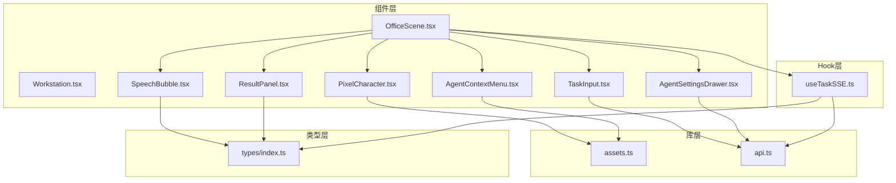
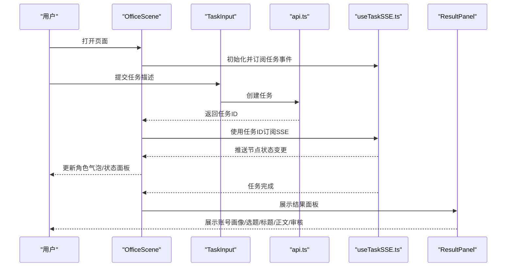
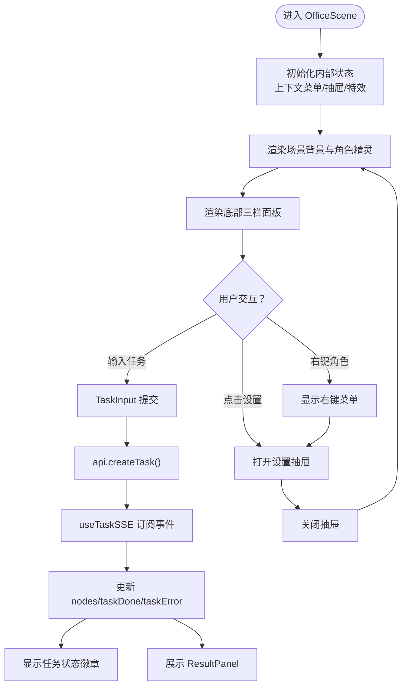
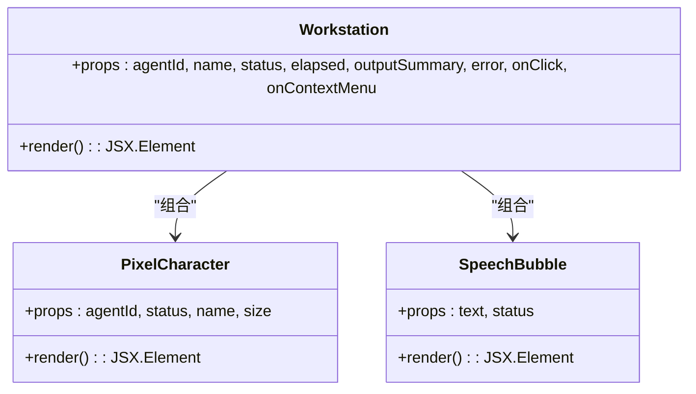
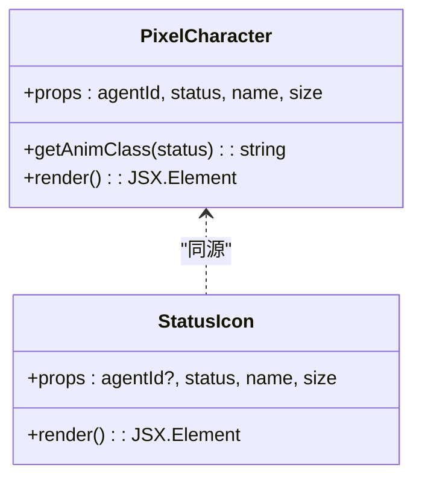
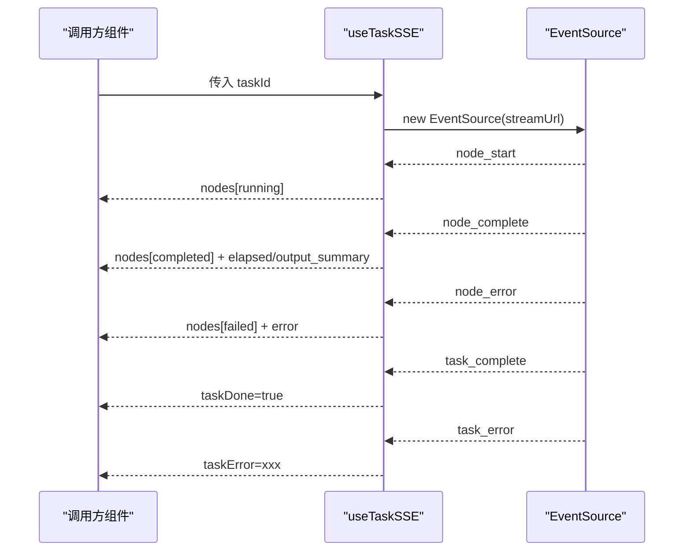
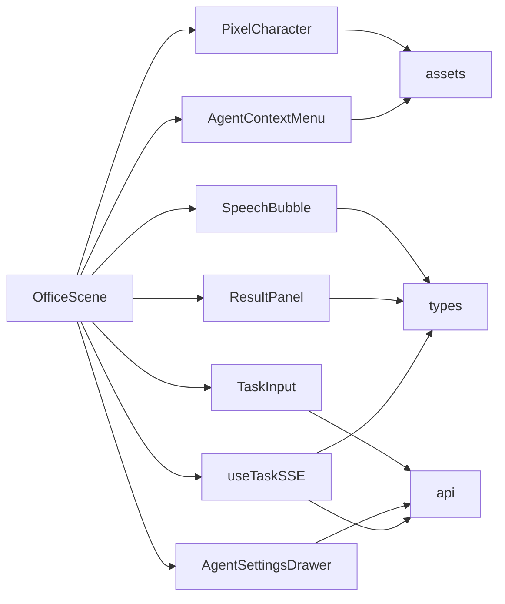

# 组件系统

<cite>
**本文引用的文件**
- [OfficeScene.tsx](file://frontend/components/office/OfficeScene.tsx)
- [Workstation.tsx](file://frontend/components/office/Workstation.tsx)
- [PixelCharacter.tsx](file://frontend/components/office/PixelCharacter.tsx)
- [SpeechBubble.tsx](file://frontend/components/office/SpeechBubble.tsx)
- [TaskInput.tsx](file://frontend/components/office/TaskInput.tsx)
- [ResultPanel.tsx](file://frontend/components/office/ResultPanel.tsx)
- [AgentContextMenu.tsx](file://frontend/components/office/AgentContextMenu.tsx)
- [AgentSettingsDrawer.tsx](file://frontend/components/office/AgentSettingsDrawer.tsx)
- [useTaskSSE.ts](file://frontend/hooks/useTaskSSE.ts)
- [assets.ts](file://frontend/lib/assets.ts)
- [api.ts](file://frontend/lib/api.ts)
- [index.ts](file://frontend/types/index.ts)
</cite>

## 目录
1. [简介](#简介)
2. [项目结构](#项目结构)
3. [核心组件](#核心组件)
4. [架构总览](#架构总览)
5. [详细组件分析](#详细组件分析)
6. [依赖关系分析](#依赖关系分析)
7. [性能考量](#性能考量)
8. [故障排查指南](#故障排查指南)
9. [结论](#结论)
10. [附录](#附录)

## 简介
本文件面向HotClaw“像素办公室”组件系统，系统化梳理React组件设计模式、Props接口定义、状态管理策略与数据流；深入解析PixelOffice主组件（OfficeScene）、OfficeScene场景组件、Workstation工作站组件以及像素角色组件（PixelCharacter、SpeechBubble）等；阐述组件间通信机制、事件传递与状态同步；总结UI组件库的设计原则、可复用性与组合模式；解释TypeScript接口定义、类型约束与类型推导的应用；并提供组件测试策略、可访问性设计与响应式布局实现建议，以及最佳实践与性能优化技巧。

## 项目结构
前端采用按功能域分层的组织方式：
- components/office：像素办公室相关UI组件集合
- hooks：自定义Hook（如任务SSE事件流）
- lib：资源与API封装（assets、api）
- types：共享TypeScript类型定义
- app：Next.js页面路由与布局入口（非本文重点）

图表来源
- [OfficeScene.tsx:1-428](file://frontend/components/office/OfficeScene.tsx#L1-L428)
- [Workstation.tsx:1-120](file://frontend/components/office/Workstation.tsx#L1-L120)
- [PixelCharacter.tsx:1-83](file://frontend/components/office/PixelCharacter.tsx#L1-L83)
- [SpeechBubble.tsx:1-50](file://frontend/components/office/SpeechBubble.tsx#L1-L50)
- [TaskInput.tsx:1-55](file://frontend/components/office/TaskInput.tsx#L1-L55)
- [ResultPanel.tsx:1-146](file://frontend/components/office/ResultPanel.tsx#L1-L146)
- [AgentContextMenu.tsx:1-84](file://frontend/components/office/AgentContextMenu.tsx#L1-L84)
- [AgentSettingsDrawer.tsx:1-175](file://frontend/components/office/AgentSettingsDrawer.tsx#L1-L175)
- [useTaskSSE.ts:1-124](file://frontend/hooks/useTaskSSE.ts#L1-L124)
- [assets.ts:1-125](file://frontend/lib/assets.ts#L1-L125)
- [api.ts:1-110](file://frontend/lib/api.ts#L1-L110)
- [index.ts:1-119](file://frontend/types/index.ts#L1-L119)

章节来源
- [OfficeScene.tsx:1-428](file://frontend/components/office/OfficeScene.tsx#L1-L428)
- [useTaskSSE.ts:1-124](file://frontend/hooks/useTaskSSE.ts#L1-L124)
- [assets.ts:1-125](file://frontend/lib/assets.ts#L1-L125)
- [api.ts:1-110](file://frontend/lib/api.ts#L1-L110)
- [index.ts:1-119](file://frontend/types/index.ts#L1-L119)

## 核心组件
- OfficeScene：像素办公室主容器，承载场景背景、角色精灵、底部面板、上下文菜单、抽屉与结果面板；负责聚合节点状态、任务状态与交互行为。
- Workstation：单个工位组件，展示角色、状态指示、时间与气泡提示，支持点击与右键交互。
- PixelCharacter：角色精灵渲染器，根据状态选择动画与图标，支持不同尺寸。
- SpeechBubble：角色上方气泡提示，根据状态显示不同颜色与文本。
- TaskInput：底部日志区的任务输入面板，触发任务创建。
- ResultPanel：任务完成后从右侧滑入的结果面板，展示账号画像、选题、标题、正文草稿与审核结果。
- AgentContextMenu：右键菜单，支持设置与查看Prompt。
- AgentSettingsDrawer：右侧抽屉，用于编辑Agent Prompt与配置。
- useTaskSSE：SSE Hook，订阅任务节点事件，维护节点状态树与任务完成/错误状态。
- assets与api：资源路径与API客户端，统一管理精灵图、场景图与后端接口。
- types：共享类型定义，约束任务、节点、SSE事件与API响应格式。

章节来源
- [OfficeScene.tsx:39-70](file://frontend/components/office/OfficeScene.tsx#L39-L70)
- [Workstation.tsx:9-29](file://frontend/components/office/Workstation.tsx#L9-L29)
- [PixelCharacter.tsx:13-35](file://frontend/components/office/PixelCharacter.tsx#L13-L35)
- [SpeechBubble.tsx:7-10](file://frontend/components/office/SpeechBubble.tsx#L7-L10)
- [TaskInput.tsx:7-11](file://frontend/components/office/TaskInput.tsx#L7-L11)
- [ResultPanel.tsx:7-9](file://frontend/components/office/ResultPanel.tsx#L7-L9)
- [AgentContextMenu.tsx:9-17](file://frontend/components/office/AgentContextMenu.tsx#L9-L17)
- [AgentSettingsDrawer.tsx:10-14](file://frontend/components/office/AgentSettingsDrawer.tsx#L10-L14)
- [useTaskSSE.ts:7-16](file://frontend/hooks/useTaskSSE.ts#L7-L16)
- [assets.ts:18-84](file://frontend/lib/assets.ts#L18-L84)
- [api.ts:12-50](file://frontend/lib/api.ts#L12-L50)
- [index.ts:5-15](file://frontend/types/index.ts#L5-L15)

## 架构总览
整体采用“页面容器 + 多子组件 + 自定义Hook + 类型约束”的分层架构。OfficeScene作为页面级容器，聚合SSE状态与用户交互，向下分发到角色、工位、面板与抽屉组件；资源与API通过lib层统一封装，确保类型安全与可维护性。

图表来源
- [OfficeScene.tsx:62-70](file://frontend/components/office/OfficeScene.tsx#L62-L70)
- [TaskInput.tsx:13-21](file://frontend/components/office/TaskInput.tsx#L13-L21)
- [api.ts:26-31](file://frontend/lib/api.ts#L26-L31)
- [useTaskSSE.ts:28-120](file://frontend/hooks/useTaskSSE.ts#L28-L120)
- [ResultPanel.tsx:11-27](file://frontend/components/office/ResultPanel.tsx#L11-L27)

## 详细组件分析

### OfficeScene：像素办公室主容器
职责与特性
- 布局：上半屏为场景背景，下半屏为三栏面板（日志、状态、访客）。
- 角色管理：基于固定配置渲染6个角色精灵，绑定气泡提示与右键菜单。
- 交互：支持右键弹出菜单、打开设置抽屉、显示感叹号特效；底部面板提交任务。
- 状态：聚合SSE节点状态，控制任务完成/错误徽章与结果面板展示。

Props与状态
- Props：nodes、taskDone、taskError、taskId、onCreateTask、loading、resultData。
- 内部状态：上下文菜单、设置抽屉、感叹号特效队列。

组件关系与数据流
- 通过SSE Hook获取节点状态，映射到角色气泡与状态面板。
- 通过TaskInput回调创建任务，更新任务ID并开启SSE订阅。
- 通过上下文菜单与抽屉实现角色配置与Prompt查看。

图表来源
- [OfficeScene.tsx:62-427](file://frontend/components/office/OfficeScene.tsx#L62-L427)
- [TaskInput.tsx:13-21](file://frontend/components/office/TaskInput.tsx#L13-L21)
- [useTaskSSE.ts:28-120](file://frontend/hooks/useTaskSSE.ts#L28-L120)
- [ResultPanel.tsx:11-27](file://frontend/components/office/ResultPanel.tsx#L11-L27)

章节来源
- [OfficeScene.tsx:39-70](file://frontend/components/office/OfficeScene.tsx#L39-L70)
- [OfficeScene.tsx:144-182](file://frontend/components/office/OfficeScene.tsx#L144-L182)
- [OfficeScene.tsx:224-389](file://frontend/components/office/OfficeScene.tsx#L224-L389)
- [OfficeScene.tsx:391-427](file://frontend/components/office/OfficeScene.tsx#L391-L427)

### Workstation：工位组件
职责与特性
- 渲染单个角色与其桌面显示器，根据状态切换背景与光效。
- 支持点击与右键回调，便于与OfficeScene交互。
- 显示名称标签与耗时信息。

Props与状态
- Props：agentId、name、status、elapsed、outputSummary、error、onClick、onContextMenu。
- 内部无本地状态，纯展示组件。

图表来源
- [Workstation.tsx:9-29](file://frontend/components/office/Workstation.tsx#L9-L29)
- [PixelCharacter.tsx:35-62](file://frontend/components/office/PixelCharacter.tsx#L35-L62)
- [SpeechBubble.tsx:12-10](file://frontend/components/office/SpeechBubble.tsx#L12-L10)

章节来源
- [Workstation.tsx:9-29](file://frontend/components/office/Workstation.tsx#L9-L29)
- [Workstation.tsx:44-118](file://frontend/components/office/Workstation.tsx#L44-L118)

### PixelCharacter：角色精灵
职责与特性
- 根据agentId选择对应透明PNG精灵图。
- 根据状态选择动画类名与叠加文字（工作中/✓/✗）。
- 提供StatusIcon用于面板中的小图标。

图表来源
- [PixelCharacter.tsx:13-35](file://frontend/components/office/PixelCharacter.tsx#L13-L35)
- [PixelCharacter.tsx:66-82](file://frontend/components/office/PixelCharacter.tsx#L66-L82)

章节来源
- [PixelCharacter.tsx:13-35](file://frontend/components/office/PixelCharacter.tsx#L13-L35)
- [PixelCharacter.tsx:66-82](file://frontend/components/office/PixelCharacter.tsx#L66-L82)

### SpeechBubble：气泡提示
职责与特性
- 根据节点状态动态设置边框与文字颜色。
- 带三角形指针，随角色浮动。

章节来源
- [SpeechBubble.tsx:7-10](file://frontend/components/office/SpeechBubble.tsx#L7-L10)
- [SpeechBubble.tsx:31-48](file://frontend/components/office/SpeechBubble.tsx#L31-L48)

### TaskInput：任务输入
职责与特性
- 表单输入任务描述，校验长度后回调父组件创建任务。
- 根据loading/disabled状态禁用按钮。

章节来源
- [TaskInput.tsx:7-11](file://frontend/components/office/TaskInput.tsx#L7-L11)
- [TaskInput.tsx:13-21](file://frontend/components/office/TaskInput.tsx#L13-L21)

### ResultPanel：结果面板
职责与特性
- 任务完成后从右侧滑入，支持展开/收起。
- 展示账号画像、候选选题、候选标题、正文草稿与审核结果。
- 使用Section/KV辅助组件进行结构化展示。

章节来源
- [ResultPanel.tsx:7-9](file://frontend/components/office/ResultPanel.tsx#L7-L9)
- [ResultPanel.tsx:11-27](file://frontend/components/office/ResultPanel.tsx#L11-L27)
- [ResultPanel.tsx:127-145](file://frontend/components/office/ResultPanel.tsx#L127-L145)

### AgentContextMenu：右键菜单
职责与特性
- 在鼠标位置弹出菜单，支持设置与查看Prompt。
- 点击外部区域自动关闭。

章节来源
- [AgentContextMenu.tsx:9-17](file://frontend/components/office/AgentContextMenu.tsx#L9-L17)
- [AgentContextMenu.tsx:19-38](file://frontend/components/office/AgentContextMenu.tsx#L19-L38)

### AgentSettingsDrawer：设置抽屉
职责与特性
- 加载Agent配置，支持恢复默认与保存。
- 通过API更新Prompt模板，实时反馈保存状态。

章节来源
- [AgentSettingsDrawer.tsx:10-14](file://frontend/components/office/AgentSettingsDrawer.tsx#L10-L14)
- [AgentSettingsDrawer.tsx:16-46](file://frontend/components/office/AgentSettingsDrawer.tsx#L16-L46)
- [AgentSettingsDrawer.tsx:48-60](file://frontend/components/office/AgentSettingsDrawer.tsx#L48-L60)

### useTaskSSE：SSE状态管理
职责与特性
- 初始化节点状态数组，匹配后端流水线顺序。
- 订阅SSE事件，更新节点状态、任务完成/错误标志。
- 提供reset方法重置状态。

图表来源
- [useTaskSSE.ts:28-120](file://frontend/hooks/useTaskSSE.ts#L28-L120)

章节来源
- [useTaskSSE.ts:7-16](file://frontend/hooks/useTaskSSE.ts#L7-L16)
- [useTaskSSE.ts:18-26](file://frontend/hooks/useTaskSSE.ts#L18-L26)
- [useTaskSSE.ts:58-120](file://frontend/hooks/useTaskSSE.ts#L58-L120)

### 资源与API：assets与api
职责与特性
- assets：集中管理场景图、精灵图、角色映射与状态精灵路径。
- api：封装后端接口，统一返回体结构与错误处理。

章节来源
- [assets.ts:18-84](file://frontend/lib/assets.ts#L18-L84)
- [assets.ts:67-75](file://frontend/lib/assets.ts#L67-L75)
- [api.ts:12-50](file://frontend/lib/api.ts#L12-L50)
- [api.ts:72-84](file://frontend/lib/api.ts#L72-L84)

### 类型系统：types/index.ts
职责与特性
- 定义任务与节点状态枚举、API响应结构、SSE事件类型、Agent角色信息与仪表盘统计等。
- 为组件与Hook提供强类型约束，避免运行期错误。

章节来源
- [index.ts:5-6](file://frontend/types/index.ts#L5-L6)
- [index.ts:10-15](file://frontend/types/index.ts#L10-L15)
- [index.ts:45-56](file://frontend/types/index.ts#L45-L56)
- [index.ts:68-94](file://frontend/types/index.ts#L68-L94)
- [index.ts:98-107](file://frontend/types/index.ts#L98-L107)

## 依赖关系分析
- OfficeScene依赖：PixelCharacter、SpeechBubble、TaskInput、ResultPanel、AgentContextMenu、AgentSettingsDrawer、useTaskSSE、assets、api、types。
- 子组件之间以Props向下传递，少量通过回调向上通信。
- useTaskSSE独立于UI，仅暴露状态与reset方法，降低耦合。
- assets与api作为基础设施，被多处组件共享，保证一致性。

图表来源
- [OfficeScene.tsx:16-25](file://frontend/components/office/OfficeScene.tsx#L16-L25)
- [useTaskSSE.ts:3-5](file://frontend/hooks/useTaskSSE.ts#L3-L5)
- [assets.ts:1-125](file://frontend/lib/assets.ts#L1-L125)
- [api.ts:1-110](file://frontend/lib/api.ts#L1-L110)
- [index.ts:1-119](file://frontend/types/index.ts#L1-L119)

章节来源
- [OfficeScene.tsx:16-25](file://frontend/components/office/OfficeScene.tsx#L16-L25)
- [useTaskSSE.ts:3-5](file://frontend/hooks/useTaskSSE.ts#L3-L5)

## 性能考量
- 事件流优化：SSE事件按节点推送，OfficeScene仅对匹配节点更新状态，避免全量重渲染。
- 组件拆分：角色、气泡、工位均为纯展示组件，减少不必要的副作用与重计算。
- 动画与渲染：PixelCharacter根据状态切换动画类名，避免频繁DOM变更；SpeechBubble使用CSS动画。
- 资源管理：精灵图与场景图集中管理，减少重复请求与布局抖动。
- 状态最小化：OfficeScene聚合状态，子组件仅接收必要Props，降低props风暴风险。

## 故障排查指南
- 无法收到SSE事件
  - 检查taskId是否为空，确认useTaskSSE已初始化。
  - 查看EventSource连接是否异常，确认后端stream接口可用。
- 任务创建失败
  - 校验TaskInput输入长度与禁用状态。
  - 检查api.createTask返回码与消息。
- 角色状态不更新
  - 确认节点状态字段（status、elapsed_seconds、output_summary、error）正确映射。
  - 检查SSE事件类型与数据结构是否一致。
- 抽屉/菜单无法关闭
  - 确认右键菜单的点击外部关闭逻辑生效。
  - 检查抽屉的open状态与onClose回调。

章节来源
- [useTaskSSE.ts:58-120](file://frontend/hooks/useTaskSSE.ts#L58-L120)
- [TaskInput.tsx:13-21](file://frontend/components/office/TaskInput.tsx#L13-L21)
- [api.ts:14-24](file://frontend/lib/api.ts#L14-L24)
- [AgentContextMenu.tsx:30-38](file://frontend/components/office/AgentContextMenu.tsx#L30-L38)
- [AgentSettingsDrawer.tsx:16-46](file://frontend/components/office/AgentSettingsDrawer.tsx#L16-L46)

## 结论
HotClaw像素办公室组件系统通过清晰的分层与严格的类型约束，实现了高内聚、低耦合的UI架构。OfficeScene作为页面容器，结合useTaskSSE与多子组件，构建了完整的任务可视化流程；资源与API库层提供了统一的抽象，保障了可维护性与可扩展性。遵循本文的设计模式、类型定义与最佳实践，可在保持一致性的同时快速迭代新功能。

## 附录
- 组件测试策略建议
  - 单元测试：针对纯展示组件（如Workstation、SpeechBubble）进行快照与行为断言。
  - 集成测试：使用Mock EventSource与Mock API，验证OfficeScene与useTaskSSE的协作。
  - 可访问性：为角色与菜单添加aria-label/title，键盘导航支持右键菜单关闭。
  - 响应式布局：基于Tailwind工具类适配移动端，确保底部面板在窄屏下可滚动。
- 开发最佳实践
  - Props最小化：仅传递必要字段，避免过度渲染。
  - 状态下沉：将可复用状态抽取至Hook或Context，减少重复逻辑。
  - 类型优先：优先定义接口与枚举，再实现组件，提升可读性与安全性。
  - 动画与交互：统一动画命名与节流，避免卡顿。