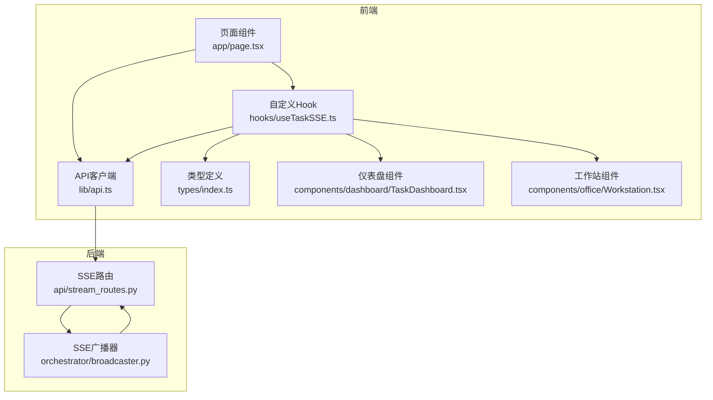
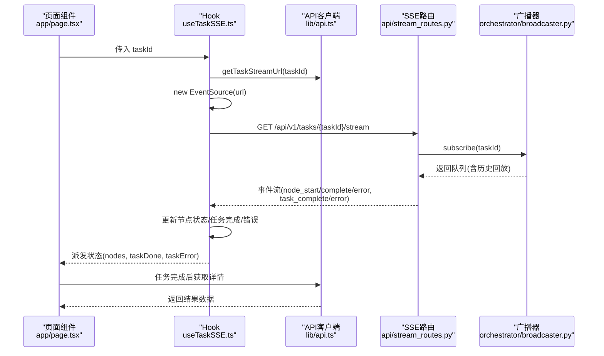
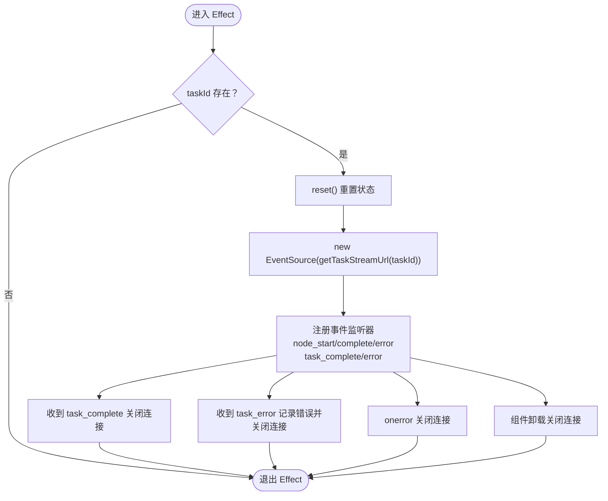
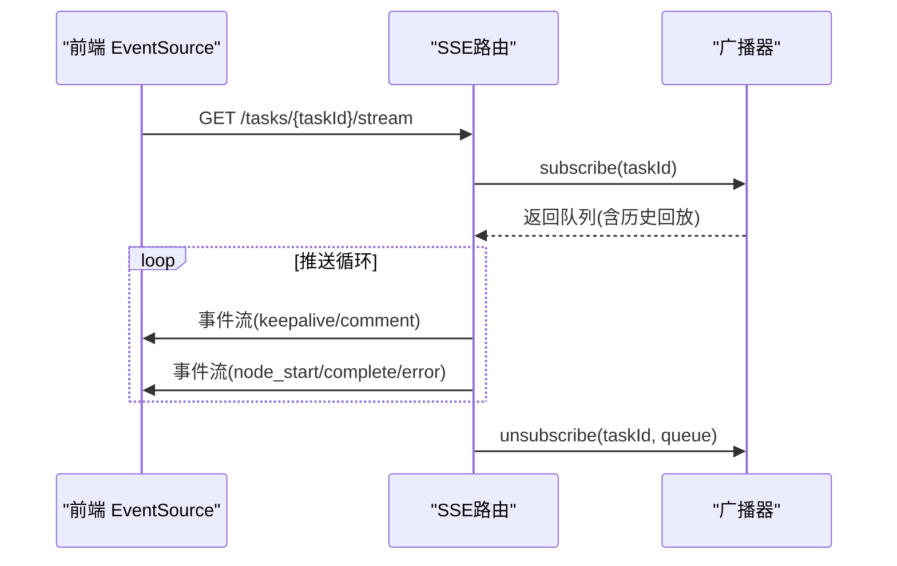
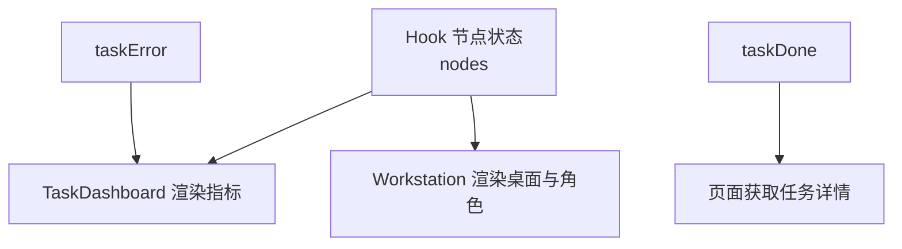
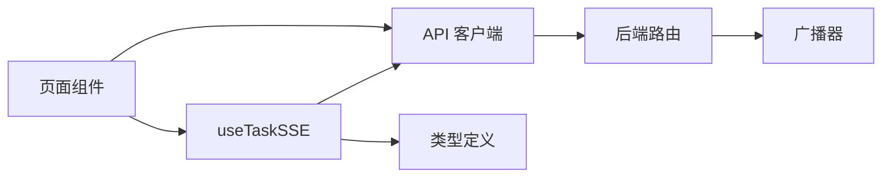

# 组件通信机制

<cite>
**本文引用的文件**
- [useTaskSSE.ts](file://frontend/hooks/useTaskSSE.ts)
- [api.ts](file://frontend/lib/api.ts)
- [index.ts](file://frontend/types/index.ts)
- [TaskDashboard.tsx](file://frontend/components/dashboard/TaskDashboard.tsx)
- [Workstation.tsx](file://frontend/components/office/Workstation.tsx)
- [page.tsx](file://frontend/app/page.tsx)
- [stream_routes.py](file://backend/app/api/stream_routes.py)
- [broadcaster.py](file://backend/app/orchestrator/broadcaster.py)
- [ARCHITECTURE.md](file://ARCHITECTURE.md)
</cite>

## 目录
1. [引言](#引言)
2. [项目结构](#项目结构)
3. [核心组件](#核心组件)
4. [架构总览](#架构总览)
5. [详细组件分析](#详细组件分析)
6. [依赖分析](#依赖分析)
7. [性能考虑](#性能考虑)
8. [故障排除指南](#故障排除指南)
9. [结论](#结论)
10. [附录](#附录)

## 引言
本文件系统性梳理了 HotClaw 前后端之间的组件通信机制，重点覆盖以下方面：
- SSE（Server-Sent Events）实时通信的实现原理、事件监听与状态同步机制
- 自定义 Hook useTaskSSE 的设计架构、事件处理与错误恢复策略
- API 客户端库的设计模式、请求封装与响应处理
- 状态管理系统（Zustand）的架构设计、状态同步与副作用处理
- TypeScript 类型定义在组件通信中的作用（接口设计、类型推导与类型安全）
- 组件间通信最佳实践、性能优化与错误处理策略
- 调试技巧、监控方法与故障排除指南

## 项目结构
前端采用按功能分层组织，核心通信链路由 Hook、API 客户端与类型定义构成；后端通过 SSE 广播器与路由实现事件流推送。



**图示来源**
- [page.tsx:14-36](file://frontend/app/page.tsx#L14-L36)
- [useTaskSSE.ts:28-122](file://frontend/hooks/useTaskSSE.ts#L28-L122)
- [api.ts:14-50](file://frontend/lib/api.ts#L14-L50)
- [index.ts:1-119](file://frontend/types/index.ts#L1-L119)
- [TaskDashboard.tsx:21-47](file://frontend/components/dashboard/TaskDashboard.tsx#L21-L47)
- [Workstation.tsx:20-29](file://frontend/components/office/Workstation.tsx#L20-L29)
- [stream_routes.py:14-42](file://backend/app/api/stream_routes.py#L14-L42)
- [broadcaster.py:30-84](file://backend/app/orchestrator/broadcaster.py#L30-L84)

**章节来源**
- [page.tsx:14-36](file://frontend/app/page.tsx#L14-L36)
- [useTaskSSE.ts:28-122](file://frontend/hooks/useTaskSSE.ts#L28-L122)
- [api.ts:14-50](file://frontend/lib/api.ts#L14-L50)
- [index.ts:1-119](file://frontend/types/index.ts#L1-L119)
- [TaskDashboard.tsx:21-47](file://frontend/components/dashboard/TaskDashboard.tsx#L21-L47)
- [Workstation.tsx:20-29](file://frontend/components/office/Workstation.tsx#L20-L29)
- [stream_routes.py:14-42](file://backend/app/api/stream_routes.py#L14-L42)
- [broadcaster.py:30-84](file://backend/app/orchestrator/broadcaster.py#L30-L84)

## 核心组件
- 自定义 Hook useTaskSSE：负责建立与维护 SSE 连接，监听节点级与任务级事件，驱动本地状态更新，并提供重置能力。
- API 客户端：统一的请求封装与响应校验，提供任务创建、详情查询、节点列表、SSE 流地址等方法。
- 类型系统：定义任务/节点状态、API 响应结构、SSE 事件载荷等，确保前后端契约一致。
- 后端 SSE 路由与广播器：将任务执行事件推送到订阅队列，支持历史回放与保活心跳。
- 可视化组件：根据节点状态渲染工作台与仪表盘，展示进度、耗时与错误信息。

**章节来源**
- [useTaskSSE.ts:28-122](file://frontend/hooks/useTaskSSE.ts#L28-L122)
- [api.ts:14-50](file://frontend/lib/api.ts#L14-L50)
- [index.ts:5-95](file://frontend/types/index.ts#L5-L95)
- [stream_routes.py:14-42](file://backend/app/api/stream_routes.py#L14-L42)
- [broadcaster.py:30-84](file://backend/app/orchestrator/broadcaster.py#L30-L84)

## 架构总览
下图展示了从前端 Hook 到后端广播器的完整调用链与事件流。



**图示来源**
- [page.tsx:19-36](file://frontend/app/page.tsx#L19-L36)
- [useTaskSSE.ts:62-120](file://frontend/hooks/useTaskSSE.ts#L62-L120)
- [api.ts:48-50](file://frontend/lib/api.ts#L48-L50)
- [stream_routes.py:14-42](file://backend/app/api/stream_routes.py#L14-L42)
- [broadcaster.py:30-45](file://backend/app/orchestrator/broadcaster.py#L30-L45)

## 详细组件分析

### useTaskSSE 自定义 Hook 设计与实现
- 初始化与状态
  - 使用初始节点清单与默认状态初始化节点数组，包含节点 ID、代理 ID、名称、状态、耗时、错误、摘要与降级标记。
  - 维护任务完成标志与错误信息，以及 EventSource 引用以支持清理。
- 生命周期与连接管理
  - 在 taskId 变更时重置状态并创建新的 EventSource 连接。
  - 注册多种事件监听器：节点开始、节点完成、节点错误、任务完成、任务错误。
  - onerror 回退关闭连接，组件卸载时主动关闭，避免内存泄漏。
- 事件处理与状态同步
  - 节点事件：根据 node_id 匹配并更新对应节点的状态与耗时、摘要、降级标记。
  - 任务事件：设置任务完成标志并关闭连接；任务错误则记录错误消息并关闭连接。
- 错误恢复策略
  - 连接断开时关闭并等待重新建立；外部可调用 reset 重置状态后触发新连接。
  - 任务完成后可再次触发 reset 或切换 taskId 以建立新的订阅。



**图示来源**
- [useTaskSSE.ts:58-120](file://frontend/hooks/useTaskSSE.ts#L58-L120)

**章节来源**
- [useTaskSSE.ts:28-122](file://frontend/hooks/useTaskSSE.ts#L28-L122)

### API 客户端库设计与响应处理
- 统一请求封装
  - request 泛型函数封装 fetch，自动拼接基础路径与 JSON 头部，解析响应为通用 API 结构。
  - 校验响应码，非零即抛出错误，便于上层统一处理。
- 任务相关接口
  - 创建任务、获取任务详情、获取节点列表、分页列出任务。
  - 提供 getTaskStreamUrl 用于构建 SSE 流地址。
- 类型约束
  - 所有接口返回值均通过 TypeScript 泛型与类型别名进行约束，确保调用方获得正确的数据结构。

```mermaid
classDiagram
class APIClient {
+createTask(positioning) : Promise~TaskCreateData~
+getTaskDetail(taskId) : Promise~TaskDetail~
+getTaskNodes(taskId) : Promise~{nodes}~
+listTasks(page,pageSize) : Promise~{tasks,pagination}~
+getTaskStreamUrl(taskId) : string
}
class RequestHelper {
+request(path, options) : Promise~T~
}
APIClient --> RequestHelper : "复用请求封装"
```

**图示来源**
- [api.ts:14-50](file://frontend/lib/api.ts#L14-L50)
- [api.ts:26-46](file://frontend/lib/api.ts#L26-L46)

**章节来源**
- [api.ts:14-50](file://frontend/lib/api.ts#L14-L50)
- [api.ts:48-50](file://frontend/lib/api.ts#L48-L50)

### 后端 SSE 路由与广播器
- SSE 路由
  - 提供 /api/v1/tasks/{task_id}/stream，使用异步生成器与队列消费，支持断线检测与保活注释。
  - 订阅成功后从广播器队列拉取消息并输出为 SSE。
- 广播器
  - 维护每个 task_id 的订阅者队列与历史事件缓冲，支持历史回放与结束哨兵。
  - 广播时写入历史缓冲并投递到所有订阅者，任务结束后清理并延迟回收历史。



**图示来源**
- [stream_routes.py:14-42](file://backend/app/api/stream_routes.py#L14-L42)
- [broadcaster.py:30-84](file://backend/app/orchestrator/broadcaster.py#L30-L84)

**章节来源**
- [stream_routes.py:14-42](file://backend/app/api/stream_routes.py#L14-L42)
- [broadcaster.py:30-84](file://backend/app/orchestrator/broadcaster.py#L30-L84)

### 可视化组件与状态映射
- 仪表盘组件
  - 接收 nodes、taskDone、taskError、taskId、elapsedTime，计算完成节点数、成功率、平均响应时间等指标。
  - 根据节点状态渲染颜色与图标，展示任务进度与错误面板。
- 工作站组件
  - 接收节点状态、耗时、输出摘要与错误，渲染像素风格的桌面与角色，根据状态显示不同高亮与气泡提示。



**图示来源**
- [TaskDashboard.tsx:21-47](file://frontend/components/dashboard/TaskDashboard.tsx#L21-L47)
- [Workstation.tsx:20-29](file://frontend/components/office/Workstation.tsx#L20-L29)
- [page.tsx:21-36](file://frontend/app/page.tsx#L21-L36)

**章节来源**
- [TaskDashboard.tsx:21-47](file://frontend/components/dashboard/TaskDashboard.tsx#L21-L47)
- [Workstation.tsx:20-29](file://frontend/components/office/Workstation.tsx#L20-L29)
- [page.tsx:21-36](file://frontend/app/page.tsx#L21-L36)

### TypeScript 类型定义与类型安全
- 状态类型
  - TaskStatus、NodeStatus 定义任务与节点的生命周期状态集合，约束 Hook 与组件的状态字段。
- API 响应
  - ApiResponse 作为统一响应载体，createTask、getTaskDetail、listTasks 等接口返回值均通过泛型绑定具体数据类型。
- SSE 事件
  - SSENodeStart、SSENodeComplete、SSENodeError、SSETaskComplete 等接口明确事件载荷字段，确保前后端事件契约一致。
- 类型推导与安全
  - Hook 返回值 nodes、taskDone、taskError 的类型由类型定义与接口约束，避免运行期类型不匹配。

**章节来源**
- [index.ts:5-15](file://frontend/types/index.ts#L5-L15)
- [index.ts:19-64](file://frontend/types/index.ts#L19-L64)
- [index.ts:66-95](file://frontend/types/index.ts#L66-L95)

### Zustand 状态管理与副作用处理（架构参考）
- 架构说明
  - 任务状态 Store：管理当前任务 ID、任务状态、节点状态、工作区快照，提供创建任务与订阅/取消订阅方法。
  - 配置 Store：管理代理与技能配置，提供拉取与更新方法。
  - 历史 Store：管理任务历史与分页。
- 副作用与集成
  - 通过 Store 将 SSE Hook 的状态与 API 请求结果集中管理，减少组件间重复订阅与状态分散。
  - Store 内部可结合 useTaskSSE 与 API 客户端，形成统一的任务生命周期管理。

**章节来源**
- [ARCHITECTURE.md:291-323](file://ARCHITECTURE.md#L291-L323)

## 依赖分析
- 前端依赖
  - 页面组件依赖 Hook 与 API 客户端；Hook 依赖类型定义与 API 客户端；可视化组件依赖 Hook 输出的状态。
- 后端依赖
  - SSE 路由依赖广播器；广播器独立于路由，仅通过队列与订阅者交互。
- 耦合与内聚
  - 前端关注点清晰：UI 仅消费状态，逻辑集中在 Hook 与 Store；后端关注点清晰：路由负责接入，广播器负责事件分发。
  - 事件契约通过类型定义与接口约束，降低前后端耦合风险。



**图示来源**
- [page.tsx:19-36](file://frontend/app/page.tsx#L19-L36)
- [useTaskSSE.ts:4-5](file://frontend/hooks/useTaskSSE.ts#L4-L5)
- [api.ts:14-50](file://frontend/lib/api.ts#L14-L50)
- [stream_routes.py:14-42](file://backend/app/api/stream_routes.py#L14-L42)
- [broadcaster.py:30-84](file://backend/app/orchestrator/broadcaster.py#L30-L84)

**章节来源**
- [page.tsx:19-36](file://frontend/app/page.tsx#L19-L36)
- [useTaskSSE.ts:4-5](file://frontend/hooks/useTaskSSE.ts#L4-L5)
- [api.ts:14-50](file://frontend/lib/api.ts#L14-L50)
- [stream_routes.py:14-42](file://backend/app/api/stream_routes.py#L14-L42)
- [broadcaster.py:30-84](file://backend/app/orchestrator/broadcaster.py#L30-L84)

## 性能考虑
- SSE 连接管理
  - 在 taskId 变更时重置并重建连接，避免旧连接残留；组件卸载时及时关闭，防止内存泄漏。
- 事件风暴与抖动
  - Hook 内对节点状态更新使用不可变更新策略，减少不必要的重渲染；可视化组件按需计算指标，避免高频重算。
- 后端广播与回放
  - 广播器对历史事件进行缓冲，解决前端晚到问题；保活注释维持长连接稳定；任务结束后清理历史，避免内存膨胀。
- 网络与超时
  - 后端设置超时发送保活注释，前端 onerror 回退关闭连接，保障健壮性。

[本节为通用性能建议，无需特定文件引用]

## 故障排除指南
- 前端常见问题
  - 无法接收事件：检查 taskId 是否为空、EventSource 是否正确创建、路由是否可达。
  - 事件未更新：确认事件监听器是否注册、节点 ID 是否匹配、JSON 解析是否异常。
  - 连接频繁断开：检查后端 keepalive 与断线检测逻辑，必要时增加重连策略。
- 后端常见问题
  - 无事件推送：确认广播器是否正确广播事件、订阅队列是否存在、任务是否已关闭。
  - 历史回放缺失：检查历史缓冲是否被提前清理、任务关闭标记是否正确。
- 调试技巧
  - 前端：在事件监听器中打印事件类型与数据，观察状态变化；利用浏览器网络面板查看 SSE 连接与事件流。
  - 后端：开启日志，观察订阅/广播/取消订阅次数与历史回放数量；检查队列长度与超时行为。
- 监控方法
  - 指标：事件推送速率、连接存活率、任务完成率、平均耗时、错误率。
  - 告警：连接断开、事件超时、任务长时间未完成、错误事件频发。

**章节来源**
- [useTaskSSE.ts:113-120](file://frontend/hooks/useTaskSSE.ts#L113-L120)
- [stream_routes.py:20-42](file://backend/app/api/stream_routes.py#L20-L42)
- [broadcaster.py:57-84](file://backend/app/orchestrator/broadcaster.py#L57-L84)

## 结论
本项目通过清晰的前端 Hook + API 客户端 + 后端 SSE 广播器的组合，实现了高效、可靠的组件间通信与状态同步。类型系统贯穿全链路，确保契约一致与类型安全；Zustand Store 提供了进一步的状态集中化与副作用管理能力。遵循本文的实践与优化建议，可在复杂场景下保持系统的稳定性与可观测性。

[本节为总结性内容，无需特定文件引用]

## 附录
- 最佳实践
  - 前端：在组件卸载时关闭 SSE；对高频状态更新进行去抖或批量更新；将 UI 与业务逻辑解耦。
  - 后端：合理设置保活与超时；对历史缓冲进行容量与时效控制；记录关键事件日志。
- 错误处理策略
  - 前端：统一捕获请求与事件解析错误，提供用户可读的错误提示与重试入口。
  - 后端：对异常事件进行降级处理，避免阻塞主事件流；对订阅异常进行清理与告警。

[本节为通用指导，无需特定文件引用]