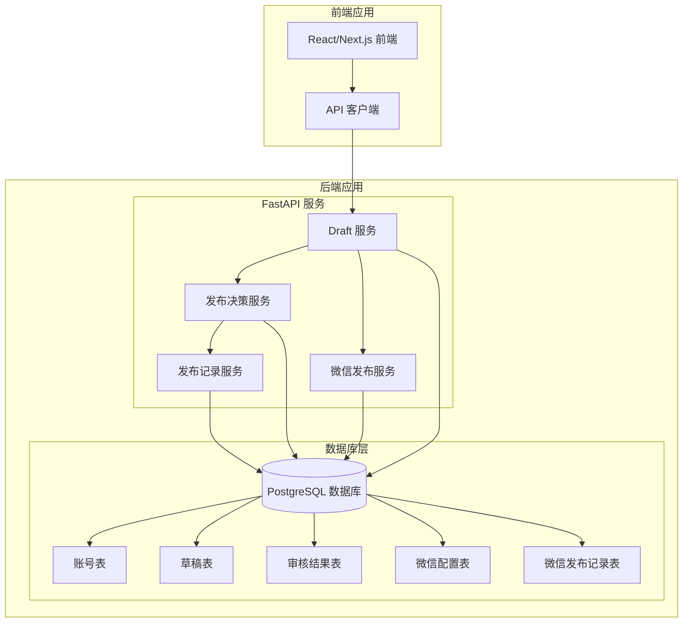
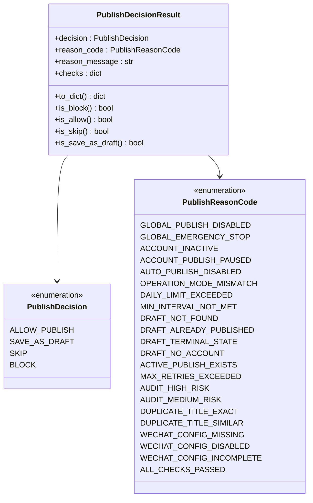
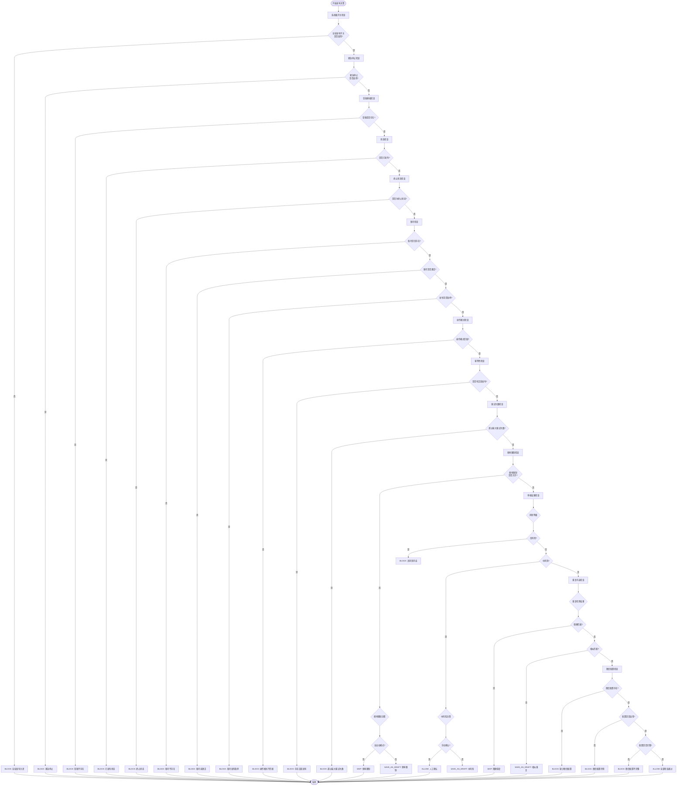
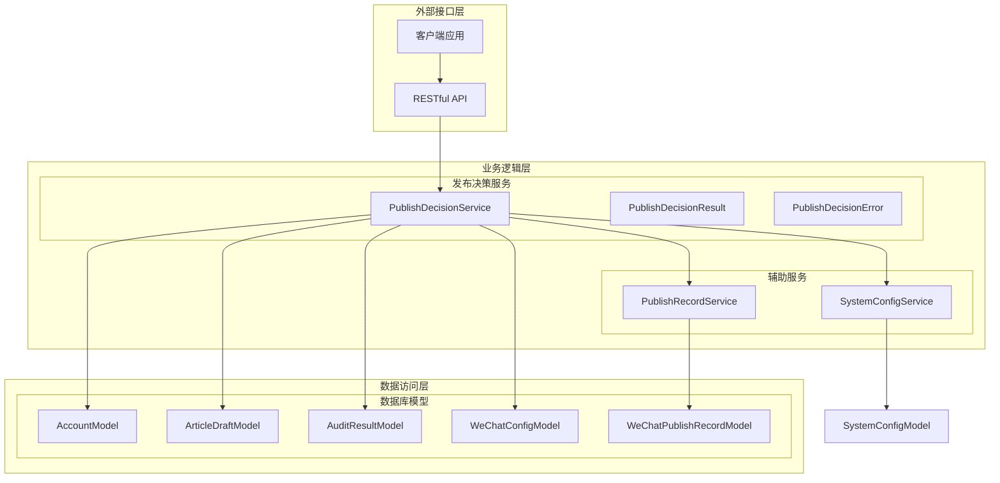
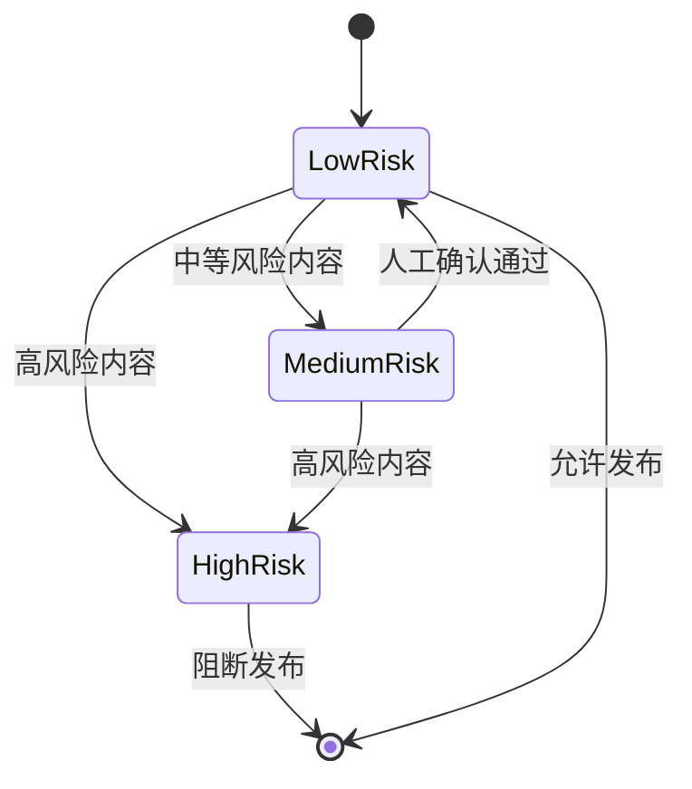
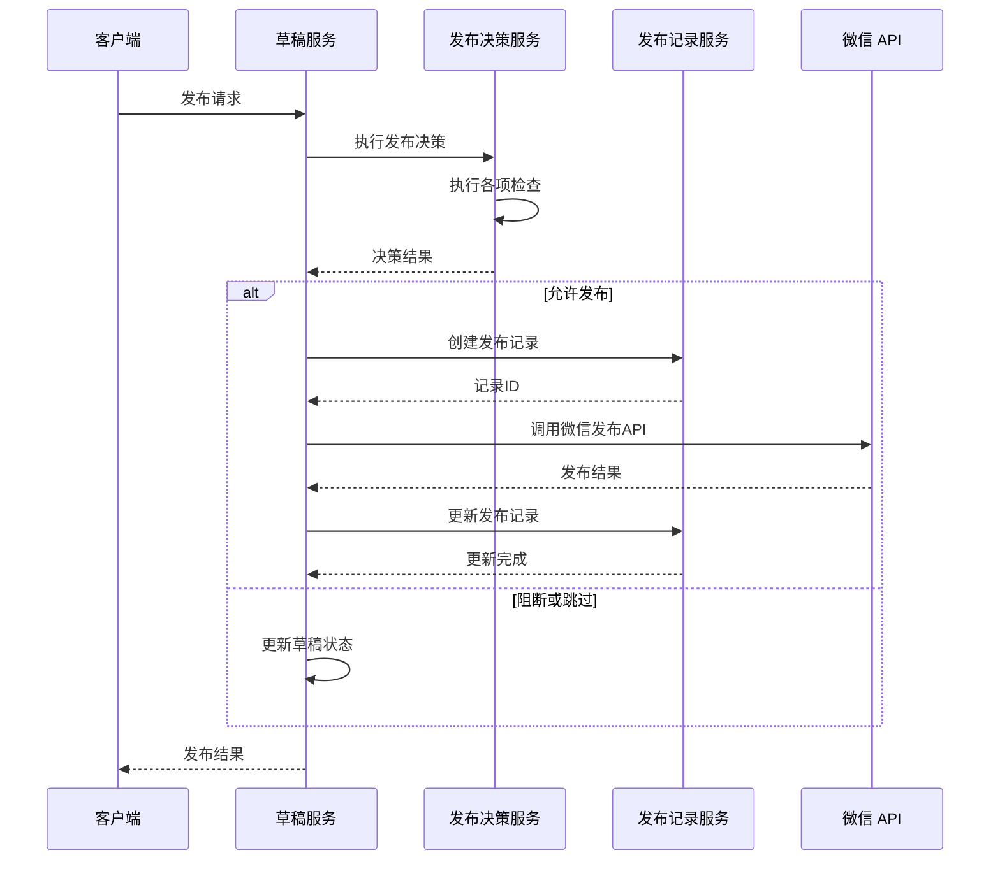
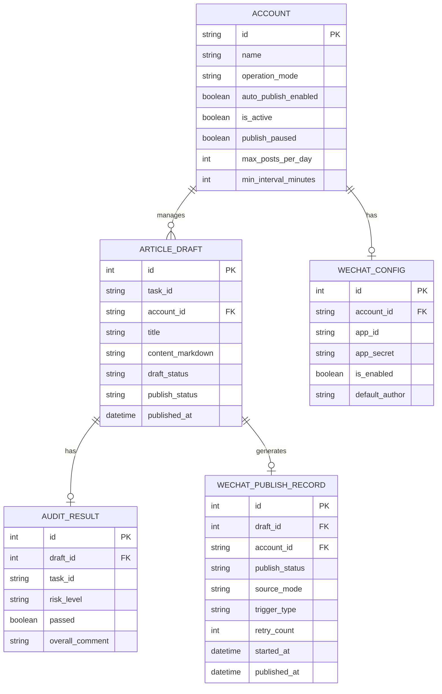
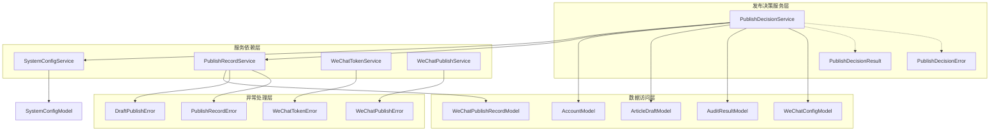

# 发布决策服务

<cite>
**本文档引用的文件**
- [publish_decision_service.py](file://backend/app/services/publish_decision_service.py)
- [tables.py](file://backend/app/models/tables.py)
- [draft_routes.py](file://backend/app/api/draft_routes.py)
- [draft_service.py](file://backend/app/services/draft_service.py)
- [publish_record_service.py](file://backend/app/services/publish_record_service.py)
- [wechat_config.py](file://backend/app/models/wechat_config.py)
- [system_config_service.py](file://backend/app/services/system_config_service.py)
- [test_publish_decision.py](file://backend/tests/test_publish_decision.py)
- [api.ts](file://frontend/lib/api.ts)
</cite>

## 目录
1. [简介](#简介)
2. [项目结构](#项目结构)
3. [核心组件](#核心组件)
4. [架构概览](#架构概览)
5. [详细组件分析](#详细组件分析)
6. [依赖关系分析](#依赖关系分析)
7. [性能考虑](#性能考虑)
8. [故障排除指南](#故障排除指南)
9. [结论](#结论)

## 简介

发布决策服务是 HotClaw 内容发布系统中的核心保护层，负责在真正调用微信官方账号发布之前进行全方位的安全检查和合规验证。该服务确保只有符合所有条件的内容才能进入实际的发布流程，从而保障平台运营的安全性和稳定性。

发布决策服务提供四种决策结果：
- **ALLOW_PUBLISH**：允许进入真实的微信发布链路
- **SAVE_AS_DRAFT**：降级为待确认草稿，需要人工审核
- **SKIP**：跳过本次发布，不进行任何操作
- **BLOCK**：直接阻断，记录明确的错误原因

## 项目结构

HotClaw 采用前后端分离的架构设计，发布决策服务位于后端 Python FastAPI 应用中，与前端 React/Next.js 应用通过 RESTful API 进行通信。

**图表来源**
- [publish_decision_service.py:128-470](file://backend/app/services/publish_decision_service.py#L128-L470)
- [draft_service.py:288-552](file://backend/app/services/draft_service.py#L288-L552)
- [tables.py:28-232](file://backend/app/models/tables.py#L28-L232)

**章节来源**
- [publish_decision_service.py:1-752](file://backend/app/services/publish_decision_service.py#L1-L752)
- [draft_service.py:1-864](file://backend/app/services/draft_service.py#L1-L864)

## 核心组件

发布决策服务由多个核心组件构成，每个组件都有明确的职责和边界：

### 发布决策枚举系统

服务定义了完整的决策枚举体系，包括决策类型、原因代码和结果封装类：

**图表来源**
- [publish_decision_service.py:35-126](file://backend/app/services/publish_decision_service.py#L35-L126)

### 决策检查流程

发布决策服务按照严格的顺序执行多项检查，确保发布过程的安全性：

**图表来源**
- [publish_decision_service.py:159-470](file://backend/app/services/publish_decision_service.py#L159-L470)

**章节来源**
- [publish_decision_service.py:35-470](file://backend/app/services/publish_decision_service.py#L35-L470)

## 架构概览

发布决策服务在整个系统架构中扮演着关键的保护层角色，它与多个服务和组件紧密协作：

**图表来源**
- [publish_decision_service.py:128-147](file://backend/app/services/publish_decision_service.py#L128-L147)
- [system_config_service.py:140-184](file://backend/app/services/system_config_service.py#L140-L184)
- [publish_record_service.py:30-48](file://backend/app/services/publish_record_service.py#L30-L48)

**章节来源**
- [draft_routes.py:239-289](file://backend/app/api/draft_routes.py#L239-L289)
- [draft_service.py:288-331](file://backend/app/services/draft_service.py#L288-L331)

## 详细组件分析

### 发布决策服务核心实现

发布决策服务是整个系统的安全网，它实现了严格的状态机和检查机制：

#### 决策算法实现

服务的核心决策算法基于以下检查顺序：
1. **系统级开关** - 全局发布开关和紧急停止
2. **草稿状态检查** - 草稿存在性、发布状态、终止状态
3. **账号级检查** - 账号激活状态、发布暂停状态、操作模式匹配
4. **幂等性检查** - 避免重复发布和过度重试
5. **频率限制检查** - 日发布上限和最小间隔时间
6. **审核结果门控** - 内容风险评估
7. **重复内容检查** - 标题重复检测
8. **微信配置检查** - 发布必需的配置验证

#### 风险评估机制

服务实现了多层次的风险评估机制：

**图表来源**
- [publish_decision_service.py:151-154](file://backend/app/services/publish_decision_service.py#L151-L154)

#### 频率限制实现

频率限制功能提供了灵活的发布控制机制：

| 限制类型 | 配置参数 | 默认值 | 描述 |
|---------|---------|--------|------|
| 日发布上限 | max_posts_per_day | None | 每日最大发布数量 |
| 最小间隔时间 | min_interval_minutes | None | 最小发布间隔（分钟） |
| 操作模式 | operation_mode | manual | 账号操作模式 |

**章节来源**
- [publish_decision_service.py:505-594](file://backend/app/services/publish_decision_service.py#L505-L594)

### 发布记录服务集成

发布决策服务与发布记录服务深度集成，确保所有发布活动都有完整的审计跟踪：

#### 发布记录生命周期

**图表来源**
- [draft_service.py:288-552](file://backend/app/services/draft_service.py#L288-L552)
- [publish_record_service.py:56-108](file://backend/app/services/publish_record_service.py#L56-L108)

**章节来源**
- [publish_record_service.py:30-473](file://backend/app/services/publish_record_service.py#L30-L473)

### 数据模型设计

发布决策服务依赖于精心设计的数据模型来支撑其功能：

#### 核心数据模型

**图表来源**
- [tables.py:28-232](file://backend/app/models/tables.py#L28-L232)
- [wechat_config.py:10-100](file://backend/app/models/wechat_config.py#L10-L100)

**章节来源**
- [tables.py:1-393](file://backend/app/models/tables.py#L1-L393)
- [wechat_config.py:1-100](file://backend/app/models/wechat_config.py#L1-L100)

## 依赖关系分析

发布决策服务的依赖关系体现了清晰的分层架构设计：

**图表来源**
- [publish_decision_service.py:128-147](file://backend/app/services/publish_decision_service.py#L128-L147)
- [draft_service.py:322-331](file://backend/app/services/draft_service.py#L322-L331)

**章节来源**
- [publish_decision_service.py:471-504](file://backend/app/services/publish_decision_service.py#L471-L504)

## 性能考虑

发布决策服务在设计时充分考虑了性能优化：

### 查询优化策略

1. **批量查询**：使用 SQLAlchemy 的批量查询减少数据库往返
2. **索引优化**：关键字段建立适当的数据库索引
3. **缓存机制**：对频繁访问的配置信息进行缓存
4. **异步处理**：所有数据库操作都是异步的，避免阻塞

### 内存使用优化

1. **流式处理**：大量数据查询使用流式处理避免内存峰值
2. **对象复用**：服务实例在整个应用生命周期内复用
3. **及时释放**：确保数据库连接和临时对象及时释放

### 并发处理

1. **线程安全**：服务设计为线程安全，支持并发调用
2. **连接池**：数据库连接使用连接池管理
3. **超时控制**：所有外部 API 调用都有合理的超时设置

## 故障排除指南

### 常见问题诊断

#### 发布被阻断的常见原因

| 错误代码 | 可能原因 | 解决方案 |
|---------|---------|---------|
| GLOBAL_PUBLISH_DISABLED | 全局发布开关关闭 | 检查系统配置，启用全局发布 |
| GLOBAL_EMERGENCY_STOP | 紧急停止开关启用 | 检查紧急停止状态，等待解除 |
| ACCOUNT_INACTIVE | 账号未激活 | 激活目标账号 |
| ACCOUNT_PUBLISH_PAUSED | 账号发布暂停 | 恢复账号发布权限 |
| AUTO_PUBLISH_DISABLED | 自动发布功能关闭 | 启用自动发布功能 |
| OPERATION_MODE_MISMATCH | 操作模式不匹配 | 调整发布源与账号模式一致 |
| DAILY_LIMIT_EXCEEDED | 达到日发布上限 | 等待到下一天或调整限额 |
| MIN_INTERVAL_NOT_MET | 未达到最小发布间隔 | 等待足够的时间间隔 |
| DRAFT_NOT_FOUND | 草稿不存在 | 检查草稿ID有效性 |
| DRAFT_ALREADY_PUBLISHED | 草稿已发布 | 查看发布记录 |
| DRAFT_TERMINAL_STATE | 草稿处于终止状态 | 重新创建草稿 |
| ACTIVE_PUBLISH_EXISTS | 存在活跃发布记录 | 等待当前发布完成 |
| MAX_RETRIES_EXCEEDED | 超过最大重试次数 | 创建新的草稿 |
| AUDIT_HIGH_RISK | 高风险内容 | 修改内容或联系管理员 |
| AUDIT_MEDIUM_RISK | 中风险内容 | 人工确认或修改内容 |
| DUPLICATE_TITLE_EXACT | 精确重复标题 | 修改标题内容 |
| DUPLICATE_TITLE_SIMILAR | 相似重复标题 | 修改标题或内容 |
| WECHAT_CONFIG_MISSING | 缺少微信配置 | 添加微信账号配置 |
| WECHAT_CONFIG_DISABLED | 微信配置禁用 | 启用微信配置 |
| WECHAT_CONFIG_INCOMPLETE | 微信配置不完整 | 补充必要的配置信息 |

#### 调试技巧

1. **查看详细检查结果**：`PublishDecisionResult.checks` 包含所有检查的详细信息
2. **检查日志输出**：服务会在关键节点输出详细的日志信息
3. **验证数据库状态**：检查相关表的状态是否正确
4. **测试外部依赖**：验证微信 API 和其他外部服务的可用性

**章节来源**
- [test_publish_decision.py:1-604](file://backend/tests/test_publish_decision.py#L1-L604)

## 结论

发布决策服务作为 HotClaw 内容发布系统的核心保护层，通过多层次的安全检查和智能决策机制，确保了发布流程的安全性和可靠性。该服务的设计体现了以下特点：

1. **全面的安全防护**：从系统级到内容级的全方位检查
2. **灵活的决策机制**：根据不同场景提供合适的处理策略
3. **完善的审计跟踪**：所有决策和操作都有详细的记录
4. **良好的扩展性**：模块化设计便于功能扩展和维护
5. **优秀的性能表现**：优化的查询和处理逻辑保证高效运行

通过发布决策服务，HotClaw 能够在保证内容质量的同时，提供灵活的发布策略，满足不同用户和场景的需求。该服务的成功实施为整个内容发布系统奠定了坚实的基础，是平台稳定运行的重要保障。