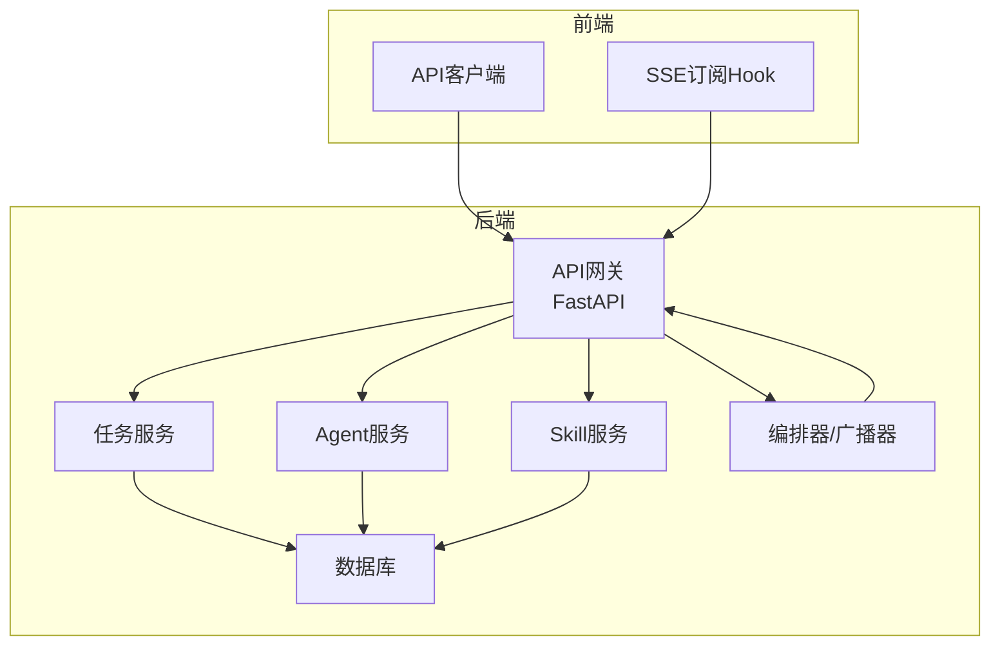
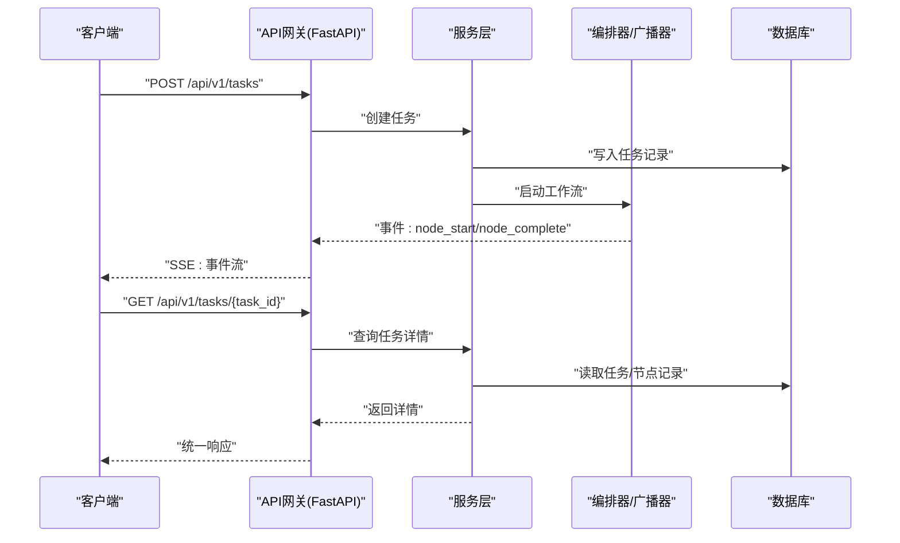
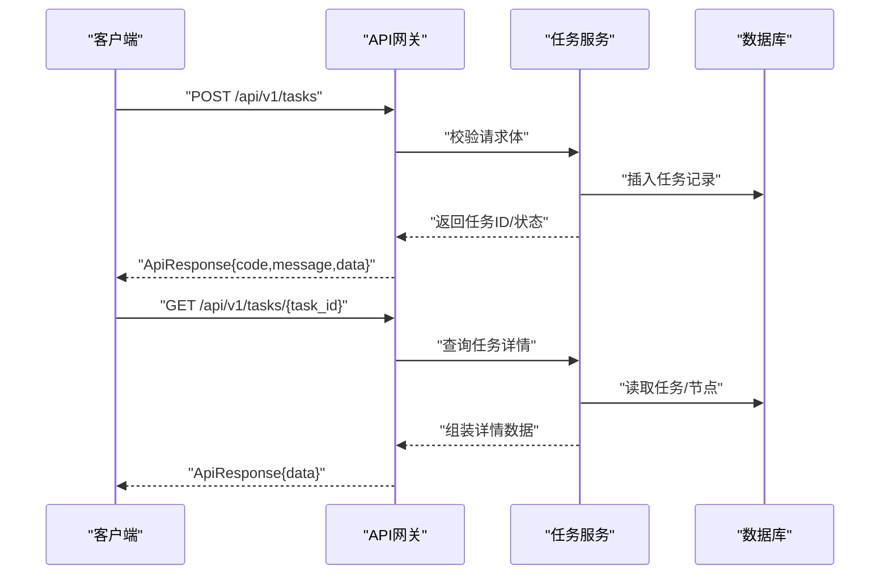
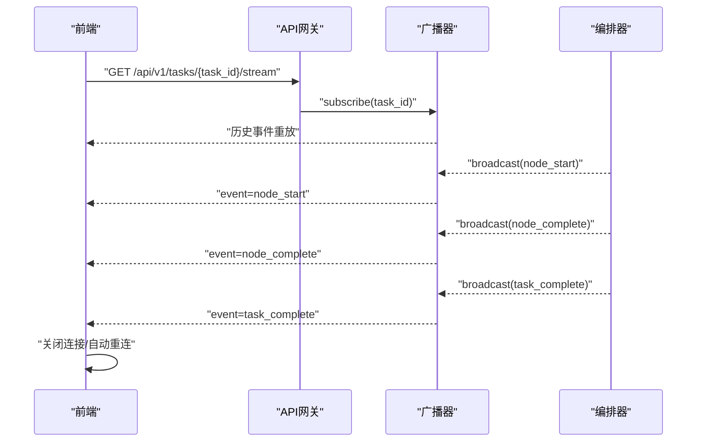
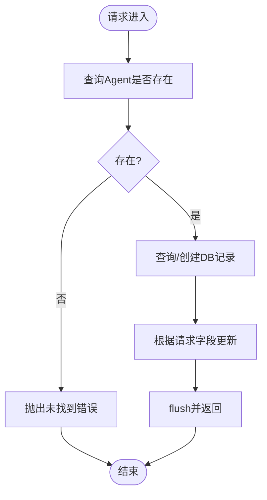
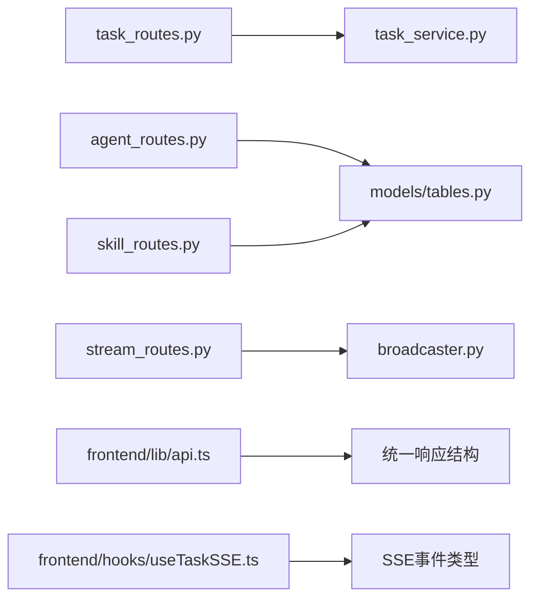

# API接口设计

<cite>
**本文引用的文件**
- [backend/app/main.py](file://backend/app/main.py)
- [backend/app/api/task_routes.py](file://backend/app/api/task_routes.py)
- [backend/app/api/stream_routes.py](file://backend/app/api/stream_routes.py)
- [backend/app/api/agent_routes.py](file://backend/app/api/agent_routes.py)
- [backend/app/api/skill_routes.py](file://backend/app/api/skill_routes.py)
- [backend/app/schemas/common.py](file://backend/app/schemas/common.py)
- [backend/app/schemas/task.py](file://backend/app/schemas/task.py)
- [backend/app/schemas/agent.py](file://backend/app/schemas/agent.py)
- [backend/app/schemas/skill.py](file://backend/app/schemas/skill.py)
- [backend/app/orchestrator/broadcaster.py](file://backend/app/orchestrator/broadcaster.py)
- [frontend/lib/api.ts](file://frontend/lib/api.ts)
- [frontend/hooks/useTaskSSE.ts](file://frontend/hooks/useTaskSSE.ts)
- [frontend/types/index.ts](file://frontend/types/index.ts)
- [ARCHITECTURE.md](file://ARCHITECTURE.md)
- [Notice.md](file://Notice.md)
</cite>

## 目录
1. [引言](#引言)
2. [项目结构](#项目结构)
3. [核心组件](#核心组件)
4. [架构总览](#架构总览)
5. [详细组件分析](#详细组件分析)
6. [依赖分析](#依赖分析)
7. [性能考量](#性能考量)
8. [故障排查指南](#故障排查指南)
9. [结论](#结论)
10. [附录](#附录)

## 引言
本规范文档面向HotClaw多智能体内容生产平台的API接口设计，系统性阐述RESTful设计原则、HTTP方法选择、URL路径规范与状态码使用；并围绕四大路由模块（任务管理API、实时事件流API、Agent配置API、技能管理API）给出接口规范、请求响应格式、JSON Schema定义、参数验证与错误响应结构；同时提供SSE事件流实现细节（连接建立、事件推送与客户端处理）、API版本管理、安全认证与性能优化最佳实践。

## 项目结构
后端采用FastAPI作为API网关，按职责分层组织：
- 路由层：定义REST端点与SSE流
- 服务层：业务流程与编排逻辑
- 模型层：SQLAlchemy ORM模型
- 模式层：Pydantic输入输出Schema
- 核心层：配置、异常、日志、追踪
- Orchestration层：工作流引擎与事件广播

前端采用Next.js/React，提供API客户端封装与SSE订阅Hook。

**图表来源**
- [backend/app/main.py:141-148](file://backend/app/main.py#L141-L148)
- [backend/app/api/task_routes.py:16-67](file://backend/app/api/task_routes.py#L16-L67)
- [backend/app/api/stream_routes.py:14-42](file://backend/app/api/stream_routes.py#L14-L42)
- [backend/app/api/agent_routes.py:17-114](file://backend/app/api/agent_routes.py#L17-L114)
- [backend/app/api/skill_routes.py:17-60](file://backend/app/api/skill_routes.py#L17-L60)
- [backend/app/orchestrator/broadcaster.py:11-98](file://backend/app/orchestrator/broadcaster.py#L11-L98)

**章节来源**
- [backend/app/main.py:141-148](file://backend/app/main.py#L141-L148)
- [ARCHITECTURE.md:414-448](file://ARCHITECTURE.md#L414-L448)

## 核心组件
- 统一响应包装：所有接口返回统一结构，包含code、message、data与可选details。
- 统一错误响应：错误时返回code、message、data=null与details。
- 分页元数据：提供page、page_size、total。
- 请求体与响应体：使用Pydantic模型定义，确保参数验证与序列化一致性。
- SSE事件广播：基于队列的历史缓冲与延迟订阅，解决前端连接时差问题。

**章节来源**
- [backend/app/schemas/common.py:7-27](file://backend/app/schemas/common.py#L7-L27)
- [backend/app/schemas/task.py:10-83](file://backend/app/schemas/task.py#L10-L83)
- [backend/app/schemas/agent.py:6-29](file://backend/app/schemas/agent.py#L6-L29)
- [backend/app/schemas/skill.py:6-22](file://backend/app/schemas/skill.py#L6-L22)
- [backend/app/orchestrator/broadcaster.py:11-98](file://backend/app/orchestrator/broadcaster.py#L11-L98)

## 架构总览
系统采用前后端分离，API网关统一入口，参数校验与错误格式化，内部服务通过服务层解耦。SSE用于实时事件推送，前端独立消费事件流。

**图表来源**
- [backend/app/api/task_routes.py:39-123](file://backend/app/api/task_routes.py#L39-L123)
- [backend/app/api/stream_routes.py:14-42](file://backend/app/api/stream_routes.py#L14-L42)
- [backend/app/orchestrator/broadcaster.py:57-78](file://backend/app/orchestrator/broadcaster.py#L57-L78)
- [backend/app/main.py:141-148](file://backend/app/main.py#L141-L148)

## 详细组件分析

### RESTful设计原则与规范
- HTTP方法选择
  - POST：创建资源（如任务）
  - GET：查询资源（列表、详情、状态）
  - PUT：更新资源（Agent/Skill配置）
- URL路径规范
  - 使用小写与斜杠分隔，资源名词复数化
  - 版本前缀：/api/v1
  - 资源路径：/tasks、/agents、/skills、/tasks/{task_id}/stream
- 状态码使用
  - 成功：200 OK
  - 创建：201 Created（如适用）
  - 参数错误：400 Bad Request
  - 资源不存在：404 Not Found
  - 冲突/状态不合法：409 Conflict
  - 网关/上游错误：502 Bad Gateway
  - 超时：504 Gateway Timeout
  - 服务器错误：500 Internal Server Error
- 统一响应结构
  - 成功：code=0，message="ok"，data为业务数据
  - 失败：code非0，message为错误描述，data=null，details可选
- 错误映射
  - 业务异常按类别映射到HTTP状态码，特殊错误有特例处理

**章节来源**
- [backend/app/schemas/common.py:7-27](file://backend/app/schemas/common.py#L7-L27)
- [backend/app/main.py:96-138](file://backend/app/main.py#L96-L138)
- [Notice.md:190-242](file://Notice.md#L190-L242)

### 任务管理API
- 基本信息
  - 版本：/api/v1
  - 资源：/tasks
- 端点与行为
  - POST /tasks：创建任务，返回任务ID与初始状态
  - GET /tasks：分页查询任务列表
  - GET /tasks/{task_id}：查询任务详情（含输入、结果、耗时等）
  - GET /tasks/{task_id}/status：查询任务状态与进度
  - GET /tasks/{task_id}/nodes：查询节点执行记录
- 请求参数
  - POST /tasks：positioning（必填，长度5-500）、workflow_id（可选，默认模板）
  - GET /tasks：page（≥1）、page_size（1-100）、status（可选）
- 响应数据
  - 统一响应包装，data为具体业务对象
  - 任务详情包含输入、结果、时间戳、耗时、Token统计等
  - 节点记录包含agent_id、状态、输入输出、耗时、模型、降级标记等
- 参数验证
  - 使用Pydantic模型进行字段校验与默认值处理
- 错误响应
  - 遵循统一错误结构，details可携带校验细节

**图表来源**
- [backend/app/api/task_routes.py:39-123](file://backend/app/api/task_routes.py#L39-L123)
- [backend/app/schemas/task.py:10-83](file://backend/app/schemas/task.py#L10-L83)

**章节来源**
- [backend/app/api/task_routes.py:39-179](file://backend/app/api/task_routes.py#L39-L179)
- [backend/app/schemas/task.py:10-83](file://backend/app/schemas/task.py#L10-L83)

### 实时事件流API（SSE）
- 端点
  - GET /api/v1/tasks/{task_id}/stream
- 行为
  - 建立长连接，向订阅者推送节点开始、完成、错误与任务完成/错误事件
  - 支持断线重连，浏览器自动重试
  - 保活机制：超时发送注释消息
  - 历史重放：晚到订阅者接收过去事件
  - 结束信号：任务结束发送哨兵值
- 事件类型
  - node_start：节点开始
  - node_complete：节点完成（含耗时、降级标记、输出摘要）
  - node_error：节点错误（含错误信息）
  - task_complete：任务完成
  - task_error：任务级错误
- 客户端处理
  - 前端使用EventSource连接，监听特定事件并更新UI
  - 断线不主动关闭，交由浏览器自动重连
  - 连接打开/关闭状态与错误提示

**图表来源**
- [backend/app/api/stream_routes.py:14-42](file://backend/app/api/stream_routes.py#L14-L42)
- [backend/app/orchestrator/broadcaster.py:30-78](file://backend/app/orchestrator/broadcaster.py#L30-L78)
- [frontend/hooks/useTaskSSE.ts:60-140](file://frontend/hooks/useTaskSSE.ts#L60-L140)

**章节来源**
- [backend/app/api/stream_routes.py:14-42](file://backend/app/api/stream_routes.py#L14-L42)
- [backend/app/orchestrator/broadcaster.py:11-98](file://backend/app/orchestrator/broadcaster.py#L11-L98)
- [frontend/hooks/useTaskSSE.ts:1-144](file://frontend/hooks/useTaskSSE.ts#L1-L144)

### Agent配置API
- 资源：/api/v1/agents
- 端点
  - GET /agents：列出所有Agent，合并DB持久化prompt与默认prompt
  - GET /agents/{agent_id}：获取Agent详情，区分自定义与默认prompt
  - PUT /agents/{agent_id}/config：更新Agent配置（模型参数、prompt、重试策略）
- 请求体
  - AgentConfigUpdateRequest：可选字段model_config_data、prompt_template、retry_config
  - 空字符串表示重置为默认prompt
- 响应
  - 成功返回updated_fields或skill_id/agent_id标识

**图表来源**
- [backend/app/api/agent_routes.py:74-114](file://backend/app/api/agent_routes.py#L74-L114)

**章节来源**
- [backend/app/api/agent_routes.py:17-114](file://backend/app/api/agent_routes.py#L17-L114)
- [backend/app/schemas/agent.py:24-29](file://backend/app/schemas/agent.py#L24-L29)

### 技能管理API
- 资源：/api/v1/skills
- 端点
  - GET /skills：列出所有Skill
  - PUT /skills/{skill_id}/config：更新Skill配置（config_data）
- 请求体
  - SkillConfigUpdateRequest：config_data可选
- 响应
  - 成功返回skill_id与updated标志

**章节来源**
- [backend/app/api/skill_routes.py:17-60](file://backend/app/api/skill_routes.py#L17-L60)
- [backend/app/schemas/skill.py:19-22](file://backend/app/schemas/skill.py#L19-L22)

### 请求响应格式与JSON Schema
- 统一响应
  - ApiResponse：code、message、data
  - ApiErrorResponse：code、message、data=null、details
  - PaginationMeta：page、page_size、total
- 任务相关
  - TaskCreateRequest：positioning、workflow_id
  - TaskStatusResponse：进度、当前节点、耗时
  - TaskDetailResponse：输入、结果、时间戳、Token统计
  - NodeRunData：节点执行记录
- Agent相关
  - AgentInfo：agent_id、name、description、version、status、prompt信息
  - AgentConfigUpdateRequest：可选字段
- Skill相关
  - SkillInfo：skill_id、name、description、version、config_data、status
  - SkillConfigUpdateRequest：config_data可选

**章节来源**
- [backend/app/schemas/common.py:7-27](file://backend/app/schemas/common.py#L7-L27)
- [backend/app/schemas/task.py:10-83](file://backend/app/schemas/task.py#L10-L83)
- [backend/app/schemas/agent.py:6-29](file://backend/app/schemas/agent.py#L6-L29)
- [backend/app/schemas/skill.py:6-22](file://backend/app/schemas/skill.py#L6-L22)

### 前端API客户端与SSE Hook
- API客户端
  - 基础路径：/api/v1
  - 统一错误处理：当code!=0时抛出错误
  - SSE直连：浏览器环境下直接连接后端SSE端点，避免代理缓冲
- SSE Hook
  - 初始化节点状态与任务状态
  - 监听node_start/node_complete/node_error/task_complete/task_error事件
  - 断线自动重连，连接状态与错误提示

**章节来源**
- [frontend/lib/api.ts:12-55](file://frontend/lib/api.ts#L12-L55)
- [frontend/hooks/useTaskSSE.ts:28-144](file://frontend/hooks/useTaskSSE.ts#L28-L144)
- [frontend/types/index.ts:10-119](file://frontend/types/index.ts#L10-L119)

## 依赖分析
- 路由层依赖服务层与数据库会话
- 服务层依赖模型层与核心工具（日志、追踪）
- SSE广播器独立于路由，通过事件队列与历史缓冲解耦
- 前端API客户端与SSE Hook依赖后端统一响应结构与事件类型

**图表来源**
- [backend/app/api/task_routes.py:10-14](file://backend/app/api/task_routes.py#L10-L14)
- [backend/app/api/agent_routes.py:7-12](file://backend/app/api/agent_routes.py#L7-L12)
- [backend/app/api/skill_routes.py:7-12](file://backend/app/api/skill_routes.py#L7-L12)
- [backend/app/api/stream_routes.py](file://backend/app/api/stream_routes.py#L9)
- [backend/app/orchestrator/broadcaster.py:11-98](file://backend/app/orchestrator/broadcaster.py#L11-L98)
- [frontend/lib/api.ts:14-24](file://frontend/lib/api.ts#L14-L24)
- [frontend/hooks/useTaskSSE.ts:4-5](file://frontend/hooks/useTaskSSE.ts#L4-L5)

**章节来源**
- [backend/app/api/task_routes.py:10-14](file://backend/app/api/task_routes.py#L10-L14)
- [backend/app/api/agent_routes.py:7-12](file://backend/app/api/agent_routes.py#L7-L12)
- [backend/app/api/skill_routes.py:7-12](file://backend/app/api/skill_routes.py#L7-L12)
- [backend/app/api/stream_routes.py](file://backend/app/api/stream_routes.py#L9)
- [frontend/lib/api.ts:14-24](file://frontend/lib/api.ts#L14-L24)
- [frontend/hooks/useTaskSSE.ts:4-5](file://frontend/hooks/useTaskSSE.ts#L4-L5)

## 性能考量
- SSE连接
  - 保活注释消息降低连接中断概率
  - 历史缓冲减少晚到订阅者的等待
  - 60秒历史清理避免内存泄漏
- 任务状态查询
  - 分页查询与条件过滤，避免一次性拉取大量数据
  - 后台任务异步执行，主线程快速返回
- 参数校验
  - Pydantic在路由层进行严格校验，减少无效请求进入服务层
- CORS与中间件
  - 统一CORS配置，Trace ID中间件便于跨服务追踪

**章节来源**
- [backend/app/orchestrator/broadcaster.py:78-89](file://backend/app/orchestrator/broadcaster.py#L78-L89)
- [backend/app/api/task_routes.py:18-37](file://backend/app/api/task_routes.py#L18-L37)
- [backend/app/main.py:76-93](file://backend/app/main.py#L76-L93)

## 故障排查指南
- 统一错误处理
  - HotClawError按类别映射HTTP状态码，特殊错误有特例
  - 未捕获异常统一返回500与details（调试模式）
- 常见问题
  - 参数校验失败：检查请求体是否符合Pydantic模型
  - 资源不存在：确认ID有效且存在
  - SSE断连：检查后端日志与网络连通性，浏览器自动重连
  - 任务状态异常：检查任务服务与编排器事件广播
- 日志与追踪
  - X-Trace-Id响应头可用于端到端追踪
  - 结构化日志记录任务与节点关键信息

**章节来源**
- [backend/app/main.py:96-138](file://backend/app/main.py#L96-L138)
- [Notice.md:342-371](file://Notice.md#L342-L371)

## 结论
本规范文档基于现有代码实现了统一的RESTful接口设计与SSE事件流方案，明确了四大模块的职责边界与交互方式。通过Pydantic Schema确保输入输出结构化，借助SSE实现高效实时状态推送，结合统一错误处理与性能优化策略，满足MVP阶段的可运行、可追踪与可维护性要求。

## 附录

### API版本管理
- 版本前缀：/api/v1
- 未来演进：新增版本时保持旧版本兼容，逐步迁移

**章节来源**
- [backend/app/main.py:141-148](file://backend/app/main.py#L141-L148)

### 安全认证与CORS
- CORS：允许跨域请求（生产环境收紧）
- 认证：当前为单用户模式，未启用鉴权
- 建议：生产环境增加鉴权中间件与速率限制

**章节来源**
- [backend/app/main.py:76-83](file://backend/app/main.py#L76-L83)

### 最佳实践清单
- 接口设计
  - 使用幂等GET与语义化HTTP方法
  - 统一响应与错误结构
  - 明确分页与排序参数
- 数据校验
  - 路由层使用Pydantic模型
  - 服务层补充业务规则校验
- 实时通信
  - SSE事件类型明确，数据结构稳定
  - 客户端处理断线重连与保活
- 性能优化
  - 合理分页与索引
  - 异步任务与事件广播
  - 缓存与历史缓冲

**章节来源**
- [Notice.md:190-242](file://Notice.md#L190-L242)
- [ARCHITECTURE.md:325-360](file://ARCHITECTURE.md#L325-L360)