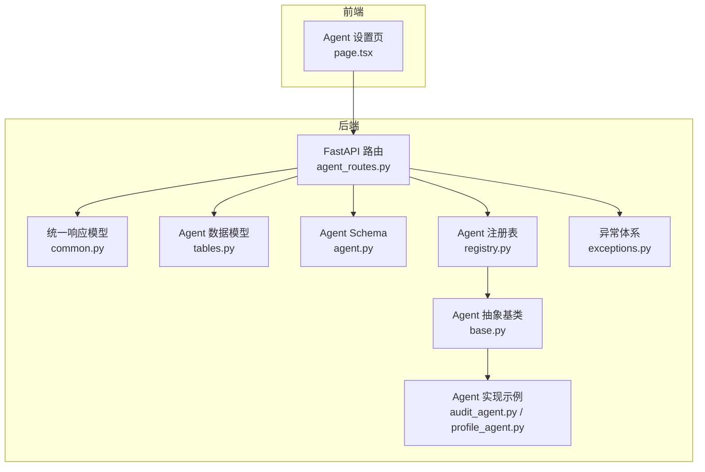
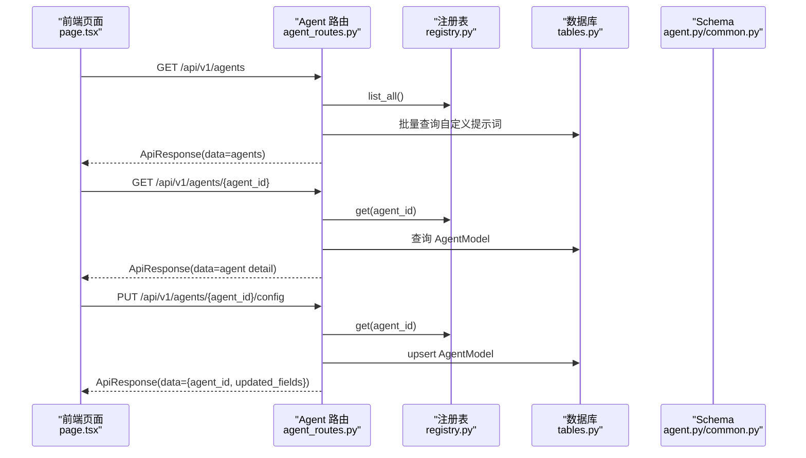
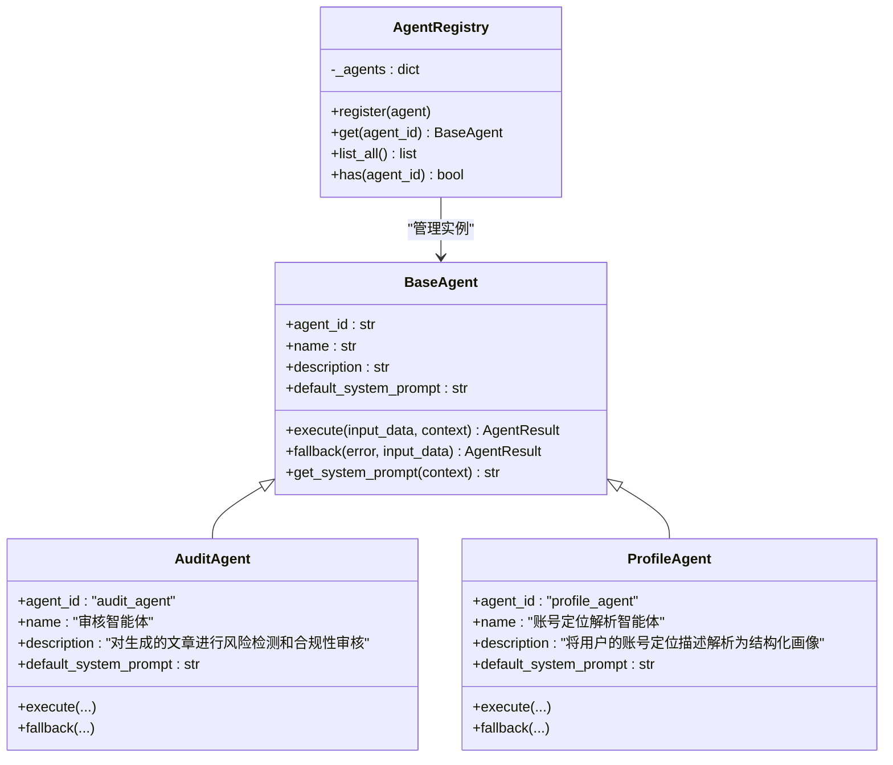
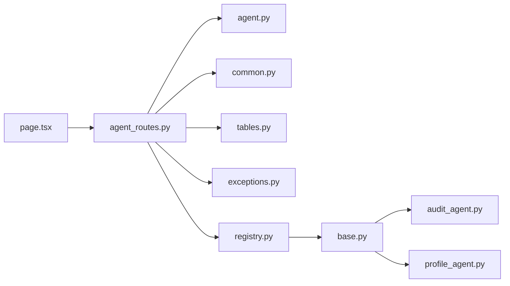

# Agent配置API

<cite>
**本文引用的文件**
- [agent_routes.py](file://backend/app/api/agent_routes.py)
- [agent.py](file://backend/app/schemas/agent.py)
- [common.py](file://backend/app/schemas/common.py)
- [base.py](file://backend/app/agents/base.py)
- [registry.py](file://backend/app/agents/registry.py)
- [tables.py](file://backend/app/models/tables.py)
- [audit_agent.py](file://backend/app/agents/audit_agent.py)
- [profile_agent.py](file://backend/app/agents/profile_agent.py)
- [exceptions.py](file://backend/app/core/exceptions.py)
- [page.tsx](file://frontend/app/settings/agents/page.tsx)
</cite>

## 目录
1. [简介](#简介)
2. [项目结构](#项目结构)
3. [核心组件](#核心组件)
4. [架构总览](#架构总览)
5. [详细组件分析](#详细组件分析)
6. [依赖分析](#依赖分析)
7. [性能考虑](#性能考虑)
8. [故障排查指南](#故障排查指南)
9. [结论](#结论)
10. [附录](#附录)

## 简介
本文件面向后端与前端开发者，系统化梳理 Agent 配置管理 API 的设计与实现，覆盖 Agent 注册、查询、更新与删除的 CRUD 接口；详解 Agent 配置的数据结构与字段约束；阐明运行时 Agent 动态注册机制与配置加载流程；给出参数校验规则与配置模板示例；说明状态管理与健康检查策略，并提供扩展开发指南，帮助开发者快速创建自定义 Agent 并接入配置管理接口。

## 项目结构
后端采用 FastAPI + SQLAlchemy 架构，Agent 配置管理 API 位于后端路由层，数据模型定义于 ORM 层，Agent 抽象类与注册表位于 agents 子模块，前端提供可视化配置页面。

图表来源
- [agent_routes.py:1-115](file://backend/app/api/agent_routes.py#L1-L115)
- [common.py:1-27](file://backend/app/schemas/common.py#L1-L27)
- [tables.py:160-181](file://backend/app/models/tables.py#L160-L181)
- [agent.py:6-29](file://backend/app/schemas/agent.py#L6-L29)
- [base.py:49-99](file://backend/app/agents/base.py#L49-L99)
- [registry.py:10-40](file://backend/app/agents/registry.py#L10-L40)
- [audit_agent.py:12-141](file://backend/app/agents/audit_agent.py#L12-L141)
- [profile_agent.py:12-102](file://backend/app/agents/profile_agent.py#L12-L102)
- [exceptions.py:31-36](file://backend/app/core/exceptions.py#L31-L36)
- [page.tsx:1-188](file://frontend/app/settings/agents/page.tsx#L1-L188)

章节来源
- [agent_routes.py:1-115](file://backend/app/api/agent_routes.py#L1-L115)
- [tables.py:160-181](file://backend/app/models/tables.py#L160-L181)
- [base.py:49-99](file://backend/app/agents/base.py#L49-L99)
- [registry.py:10-40](file://backend/app/agents/registry.py#L10-L40)
- [page.tsx:1-188](file://frontend/app/settings/agents/page.tsx#L1-L188)

## 核心组件
- API 路由层：提供 /api/v1/agents 的查询与配置更新接口，返回统一响应包装。
- 数据模型层：持久化 Agent 配置，包含模型参数、提示词模板、重试配置等。
- Agent 抽象层：定义标准执行接口与结果封装，支持降级回退。
- 注册表：集中管理已注册的 Agent 实例，按 agent_id 提供访问。
- Schema 层：定义请求与响应的数据结构，确保前后端契约一致。
- 异常体系：统一错误码与消息，便于前端展示与日志追踪。

章节来源
- [agent_routes.py:17-115](file://backend/app/api/agent_routes.py#L17-L115)
- [tables.py:160-181](file://backend/app/models/tables.py#L160-L181)
- [base.py:18-99](file://backend/app/agents/base.py#L18-L99)
- [registry.py:10-40](file://backend/app/agents/registry.py#L10-L40)
- [agent.py:6-29](file://backend/app/schemas/agent.py#L6-L29)
- [common.py:7-27](file://backend/app/schemas/common.py#L7-L27)
- [exceptions.py:31-36](file://backend/app/core/exceptions.py#L31-L36)

## 架构总览
Agent 配置管理 API 的核心交互流程如下：

图表来源
- [agent_routes.py:17-115](file://backend/app/api/agent_routes.py#L17-L115)
- [registry.py:23-32](file://backend/app/agents/registry.py#L23-L32)
- [tables.py:160-181](file://backend/app/models/tables.py#L160-L181)
- [agent.py:6-29](file://backend/app/schemas/agent.py#L6-L29)
- [common.py:7-27](file://backend/app/schemas/common.py#L7-L27)
- [page.tsx:17-56](file://frontend/app/settings/agents/page.tsx#L17-L56)

## 详细组件分析

### API 接口定义与行为
- 列出所有已注册 Agent
  - 方法与路径：GET /api/v1/agents
  - 行为：从注册表获取全部实例，批量查询数据库中的自定义提示词，组装基础信息返回
  - 返回：统一响应包装，data.agents 为数组
- 获取单个 Agent 详情
  - 方法与路径：GET /api/v1/agents/{agent_id}
  - 行为：从注册表获取实例，查询数据库中的持久化配置，计算有效提示词来源，返回完整详情
  - 返回：统一响应包装，data 包含 agent_id、name、description、version、model_config_data、prompt_template、prompt_source、default_system_prompt、retry_config、status
- 更新 Agent 配置
  - 方法与路径：PUT /api/v1/agents/{agent_id}/config
  - 请求体：AgentConfigUpdateRequest（可选字段：model_config_data、prompt_template、retry_config）
  - 行为：校验注册表存在性，按需创建/更新 AgentModel 记录，空字符串表示“重置为默认”
  - 返回：统一响应包装，data.updated_fields 标识实际更新的字段

章节来源
- [agent_routes.py:17-115](file://backend/app/api/agent_routes.py#L17-L115)
- [agent.py:24-29](file://backend/app/schemas/agent.py#L24-L29)
- [common.py:7-27](file://backend/app/schemas/common.py#L7-L27)

### Agent 配置数据结构
- AgentInfo（列表与详情通用字段）
  - agent_id：字符串，唯一标识
  - name：字符串，显示名称
  - description：字符串，可选
  - version：字符串，默认版本
  - model_config_data：对象，可选，模型参数配置
  - required_skills：字符串数组，可选，所需技能清单
  - status：字符串，当前状态（active/inactive）
  - prompt_template：字符串，可选，自定义提示词模板
  - prompt_source：字符串，来源标记（custom/default）
  - default_system_prompt：字符串，可选，默认系统提示
  - has_custom_prompt：布尔，是否存在自定义提示词
- AgentConfigUpdateRequest（更新请求）
  - model_config_data：对象，可选
  - prompt_template：字符串，可选；空字符串表示重置为默认
  - retry_config：对象，可选

章节来源
- [agent.py:6-29](file://backend/app/schemas/agent.py#L6-L29)

### Agent 抽象与注册机制
- 抽象基类 BaseAgent
  - 标准化执行接口 execute(input_data, context) -> AgentResult
  - 标准化结果封装 AgentResult，包含 status、agent_name、data、error、trace_id
  - 支持 fallback(error, input_data) 提供降级策略
  - 提供 get_system_prompt(context) 从上下文或默认系统提示中获取有效提示
- Agent 注册表 AgentRegistry
  - register(agent)：按 agent_id 注册实例
  - get(agent_id)：获取实例，不存在抛出 AgentNotFoundError
  - list_all()：返回全部实例
  - has(agent_id)：判断是否存在
- 运行时动态注册
  - 后端启动时，各 Agent 类会以类属性（如 agent_id、name、description、default_system_prompt）声明自身元信息
  - 注册表通过集中管理实例，API 在查询时直接从内存中获取，无需重复实例化
  - 配置持久化于数据库，API 在详情接口中合并默认提示与数据库中的自定义提示

图表来源
- [base.py:49-99](file://backend/app/agents/base.py#L49-L99)
- [audit_agent.py:12-141](file://backend/app/agents/audit_agent.py#L12-L141)
- [profile_agent.py:12-102](file://backend/app/agents/profile_agent.py#L12-L102)
- [registry.py:10-40](file://backend/app/agents/registry.py#L10-L40)

章节来源
- [base.py:18-99](file://backend/app/agents/base.py#L18-L99)
- [registry.py:10-40](file://backend/app/agents/registry.py#L10-L40)
- [audit_agent.py:12-141](file://backend/app/agents/audit_agent.py#L12-L141)
- [profile_agent.py:12-102](file://backend/app/agents/profile_agent.py#L12-L102)

### 参数验证与取值范围
- 请求体验证
  - 使用 Pydantic 模型 AgentConfigUpdateRequest，自动进行字段存在性与类型检查
  - prompt_template 支持空字符串，表示“重置为默认”，API 将其转换为 None 存储
- 响应体验证
  - 使用 ApiResponse 统一包装，保证 code、message、data 结构一致性
- 错误处理
  - 当 agent_id 不存在时，注册表抛出 AgentNotFoundError，API 层可映射为统一错误响应

章节来源
- [agent.py:24-29](file://backend/app/schemas/agent.py#L24-L29)
- [common.py:7-27](file://backend/app/schemas/common.py#L7-L27)
- [exceptions.py:31-36](file://backend/app/core/exceptions.py#L31-L36)

### 配置模板示例与最佳实践
- 模板字段说明
  - model_config_data：用于覆盖默认模型参数（如温度、最大令牌数等），建议仅包含必要键，避免冗余
  - prompt_template：自定义提示词模板，建议保持结构化与可维护性
  - retry_config：重试策略配置（如次数、退避策略），建议结合业务稳定性需求设置
- 最佳实践
  - 自定义提示词优先级高于默认系统提示，但应保持与默认提示一致的输出格式
  - 重试配置应与 LLM 调用超时与网络稳定性相匹配
  - 仅在确有需要时修改 model_config_data，避免过度定制导致维护成本上升

章节来源
- [agent_routes.py:74-115](file://backend/app/api/agent_routes.py#L74-L115)
- [agent.py:24-29](file://backend/app/schemas/agent.py#L24-L29)

### 状态管理与健康检查
- 状态字段
  - AgentInfo.status：active/inactive，用于前端展示与控制台管理
  - AgentModel.status：持久化状态字段，可用于系统级启停控制
- 健康检查与故障恢复
  - Agent 执行失败时可通过 fallback 回退到安全状态，前端可据此提示人工复核
  - 建议在系统层面增加周期性健康探测与告警，结合 AgentModel.status 与执行日志进行联动

章节来源
- [agent.py:6-18](file://backend/app/schemas/agent.py#L6-L18)
- [tables.py:160-181](file://backend/app/models/tables.py#L160-L181)
- [audit_agent.py:134-141](file://backend/app/agents/audit_agent.py#L134-L141)
- [profile_agent.py:92-102](file://backend/app/agents/profile_agent.py#L92-L102)

### 扩展开发指南：创建自定义 Agent
- 步骤
  - 新建类继承 BaseAgent，设置类属性 agent_id、name、description、default_system_prompt
  - 实现异步 execute(input_data, context) 与可选 fallback(error, input_data)
  - 将类注册到系统（通常通过导入或工厂机制），确保注册表可获取实例
  - 如需持久化配置，可在前端页面中通过 /api/v1/agents/{agent_id}/config 更新 model_config_data、prompt_template、retry_config
- 注意事项
  - 保持 execute 的输入/输出结构稳定，便于工作流编排
  - fallback 应提供可恢复的安全输出，避免阻塞工作流
  - 建议在类内提供清晰的默认系统提示，便于用户自定义覆盖

章节来源
- [base.py:49-99](file://backend/app/agents/base.py#L49-L99)
- [audit_agent.py:12-141](file://backend/app/agents/audit_agent.py#L12-L141)
- [profile_agent.py:12-102](file://backend/app/agents/profile_agent.py#L12-L102)
- [agent_routes.py:74-115](file://backend/app/api/agent_routes.py#L74-L115)

## 依赖分析
- 路由依赖
  - agent_routes.py 依赖：AgentConfigUpdateRequest、ApiResponse、AgentRegistry、AgentModel、AgentNotFoundError
- 数据模型依赖
  - AgentModel 字段涵盖：agent_id、name、description、version、module_path、model_config_data、prompt_template、input_schema、output_schema、required_skills、retry_config、fallback_config、status
- 运行时依赖
  - 注册表集中管理 BaseAgent 实例，API 通过内存访问提升查询效率
  - 前端页面通过统一 API 路由与响应模型进行交互

图表来源
- [agent_routes.py:1-115](file://backend/app/api/agent_routes.py#L1-L115)
- [agent.py:6-29](file://backend/app/schemas/agent.py#L6-L29)
- [common.py:7-27](file://backend/app/schemas/common.py#L7-L27)
- [tables.py:160-181](file://backend/app/models/tables.py#L160-L181)
- [registry.py:10-40](file://backend/app/agents/registry.py#L10-L40)
- [base.py:49-99](file://backend/app/agents/base.py#L49-L99)
- [audit_agent.py:12-141](file://backend/app/agents/audit_agent.py#L12-L141)
- [profile_agent.py:12-102](file://backend/app/agents/profile_agent.py#L12-L102)
- [exceptions.py:31-36](file://backend/app/core/exceptions.py#L31-L36)
- [page.tsx:1-188](file://frontend/app/settings/agents/page.tsx#L1-L188)

章节来源
- [agent_routes.py:1-115](file://backend/app/api/agent_routes.py#L1-L115)
- [tables.py:160-181](file://backend/app/models/tables.py#L160-L181)
- [registry.py:10-40](file://backend/app/agents/registry.py#L10-L40)
- [base.py:49-99](file://backend/app/agents/base.py#L49-L99)
- [agent.py:6-29](file://backend/app/schemas/agent.py#L6-L29)
- [common.py:7-27](file://backend/app/schemas/common.py#L7-L27)
- [exceptions.py:31-36](file://backend/app/core/exceptions.py#L31-L36)
- [page.tsx:1-188](file://frontend/app/settings/agents/page.tsx#L1-L188)

## 性能考虑
- 查询优化
  - 列表接口批量查询数据库中的自定义提示词，减少多次往返
  - 注册表为内存查找，复杂度 O(1)，适合高频查询场景
- 写入优化
  - 更新接口仅更新传入的非空字段，减少写入开销
  - 使用 flush 提交变更，避免不必要的事务延迟
- 建议
  - 对频繁访问的 Agent 列表进行缓存（如 Redis），降低数据库压力
  - 控制提示词模板长度，避免过长文本影响序列化与传输

章节来源
- [agent_routes.py:17-115](file://backend/app/api/agent_routes.py#L17-L115)

## 故障排查指南
- Agent 不存在
  - 现象：GET /api/v1/agents/{agent_id} 抛出 AgentNotFoundError
  - 处理：确认 Agent 是否已正确注册到 AgentRegistry，或检查 agent_id 是否拼写正确
- 提示词重置无效
  - 现象：提交空字符串未生效
  - 处理：API 会将空字符串转换为 None 存储，确认前端是否正确传递空字符串
- 统一响应结构
  - ApiResponse.code/message/data 为固定结构，前端可据此统一处理成功与失败
- 健康检查
  - 若 Agent 执行失败，fallback 将返回安全输出；建议结合系统日志与状态字段进行诊断

章节来源
- [exceptions.py:31-36](file://backend/app/core/exceptions.py#L31-L36)
- [agent_routes.py:74-115](file://backend/app/api/agent_routes.py#L74-L115)
- [common.py:7-27](file://backend/app/schemas/common.py#L7-L27)
- [audit_agent.py:134-141](file://backend/app/agents/audit_agent.py#L134-L141)
- [profile_agent.py:92-102](file://backend/app/agents/profile_agent.py#L92-L102)

## 结论
Agent 配置管理 API 通过统一的 Schema、响应模型与注册表机制，实现了运行时动态 Agent 发现与配置持久化管理。前端页面提供直观的配置编辑体验，后端则以高性能的内存注册表与数据库持久化保障了查询与更新的稳定性。遵循本文档的参数验证规则、配置模板与扩展开发指南，可快速构建并维护高质量的 Agent 生态。

## 附录

### API 定义一览
- GET /api/v1/agents
  - 功能：列出所有已注册 Agent 的基本信息
  - 返回：ApiResponse(data={"agents": [...]})
- GET /api/v1/agents/{agent_id}
  - 功能：获取指定 Agent 的详细配置
  - 返回：ApiResponse(data=...)
- PUT /api/v1/agents/{agent_id}/config
  - 功能：更新 Agent 的配置（模型参数、提示词模板、重试配置）
  - 请求体：AgentConfigUpdateRequest（可选字段）
  - 返回：ApiResponse(data={"agent_id": "...", "updated_fields": [...]})

章节来源
- [agent_routes.py:17-115](file://backend/app/api/agent_routes.py#L17-L115)
- [agent.py:24-29](file://backend/app/schemas/agent.py#L24-L29)
- [common.py:7-27](file://backend/app/schemas/common.py#L7-L27)