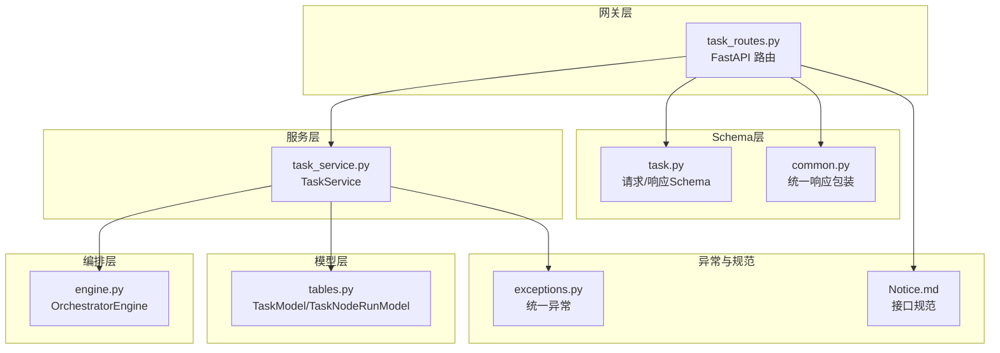
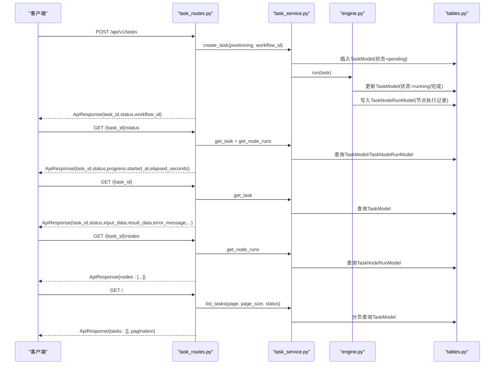
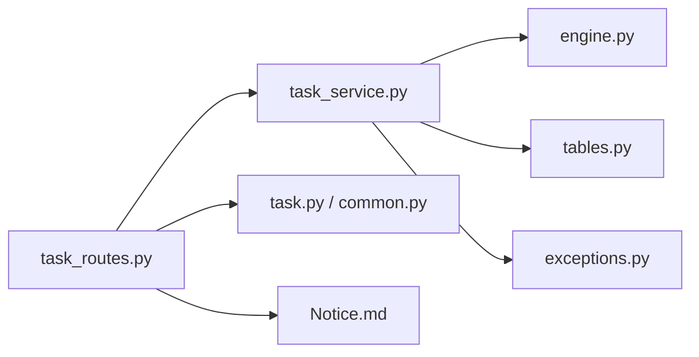

# 任务管理API

<cite>
**本文引用的文件**
- [task_routes.py](file://backend/app/api/task_routes.py)
- [task.py](file://backend/app/schemas/task.py)
- [task_service.py](file://backend/app/services/task_service.py)
- [tables.py](file://backend/app/models/tables.py)
- [engine.py](file://backend/app/orchestrator/engine.py)
- [common.py](file://backend/app/schemas/common.py)
- [exceptions.py](file://backend/app/core/exceptions.py)
- [Notice.md](file://Notice.md)
- [ARCHITECTURE.md](file://ARCHITECTURE.md)
- [test_task_api.py](file://backend/tests/test_task_api.py)
- [api.ts](file://frontend/lib/api.ts)
</cite>

## 目录
1. [简介](#简介)
2. [项目结构](#项目结构)
3. [核心组件](#核心组件)
4. [架构概览](#架构概览)
5. [详细组件分析](#详细组件分析)
6. [依赖分析](#依赖分析)
7. [性能考量](#性能考量)
8. [故障排查指南](#故障排查指南)
9. [结论](#结论)
10. [附录](#附录)

## 简介
本文件系统性梳理任务管理API，覆盖任务创建、状态查询、详情查询、节点执行记录查询以及分页查询的完整流程。重点说明：
- POST /api/v1/tasks 创建任务的请求参数与格式要求（positioning账号定位、workflow_id工作流ID）
- GET /{task_id}/status 实时状态返回结构（进度、节点状态、耗时统计）
- GET /{task_id} 详情查询的数据结构（输入输出、错误信息、计费统计）
- GET /{task_id}/nodes 节点执行记录的详细信息（Agent执行详情、Token消耗统计）
- GET / 分页查询的参数过滤机制（分页大小限制、状态筛选）

## 项目结构
后端采用分层架构，任务API位于网关层，业务逻辑由服务层承载，编排引擎驱动工作流执行，数据模型持久化至数据库。

图表来源
- [task_routes.py:1-179](file://backend/app/api/task_routes.py#L1-L179)
- [task_service.py:1-126](file://backend/app/services/task_service.py#L1-L126)
- [engine.py:1-285](file://backend/app/orchestrator/engine.py#L1-L285)
- [tables.py:23-74](file://backend/app/models/tables.py#L23-L74)
- [task.py:1-83](file://backend/app/schemas/task.py#L1-L83)
- [common.py:1-27](file://backend/app/schemas/common.py#L1-L27)
- [exceptions.py:1-125](file://backend/app/core/exceptions.py#L1-L125)
- [Notice.md:190-213](file://Notice.md#L190-L213)

章节来源
- [task_routes.py:1-179](file://backend/app/api/task_routes.py#L1-L179)
- [task_service.py:1-126](file://backend/app/services/task_service.py#L1-L126)
- [engine.py:1-285](file://backend/app/orchestrator/engine.py#L1-L285)
- [tables.py:23-74](file://backend/app/models/tables.py#L23-L74)
- [task.py:1-83](file://backend/app/schemas/task.py#L1-L83)
- [common.py:1-27](file://backend/app/schemas/common.py#L1-L27)
- [Notice.md:190-213](file://Notice.md#L190-L213)

## 核心组件
- 路由层：定义任务API的HTTP端点，负责参数校验与响应封装
- 服务层：实现任务生命周期管理、工作流编排、节点执行记录查询
- 编排引擎：按固定线性工作流顺序调度Agent，记录节点执行日志与统计
- 数据模型：持久化任务、节点运行记录、账号画像、文章草稿等
- Schema层：统一请求/响应结构与字段约束
- 异常层：统一错误码与错误消息

章节来源
- [task_routes.py:1-179](file://backend/app/api/task_routes.py#L1-L179)
- [task_service.py:1-126](file://backend/app/services/task_service.py#L1-L126)
- [engine.py:89-285](file://backend/app/orchestrator/engine.py#L89-L285)
- [tables.py:23-138](file://backend/app/models/tables.py#L23-L138)
- [task.py:1-83](file://backend/app/schemas/task.py#L1-L83)
- [exceptions.py:1-125](file://backend/app/core/exceptions.py#L1-L125)

## 架构概览
任务管理API遵循“网关只处理请求响应、业务逻辑在服务层”的约束，编排引擎负责工作流执行与状态广播，前端通过SSE订阅任务状态。

图表来源
- [task_routes.py:39-179](file://backend/app/api/task_routes.py#L39-L179)
- [task_service.py:20-126](file://backend/app/services/task_service.py#L20-L126)
- [engine.py:92-234](file://backend/app/orchestrator/engine.py#L92-L234)
- [tables.py:23-74](file://backend/app/models/tables.py#L23-L74)
- [Notice.md:190-213](file://Notice.md#L190-L213)

## 详细组件分析

### POST /api/v1/tasks 创建任务
- 请求参数
  - positioning: 字符串，最小长度5，最大长度500，描述用户账号定位
  - workflow_id: 字符串，默认"default_pipeline"，工作流模板ID
- 行为
  - 创建任务记录，状态初始为pending
  - 启动后台协程执行工作流
  - 返回ApiResponse，包含task_id、status、created_at、workflow_id
- 校验与约束
  - 基于Pydantic Schema进行参数校验
  - 默认工作流ID为固定值
- 响应结构
  - data字段包含task_id、status、created_at、workflow_id

章节来源
- [task_routes.py:39-67](file://backend/app/api/task_routes.py#L39-L67)
- [task.py:10-21](file://backend/app/schemas/task.py#L10-L21)
- [task_service.py:22-37](file://backend/app/services/task_service.py#L22-L37)
- [Notice.md:190-213](file://Notice.md#L190-L213)

### GET /{task_id}/status 实时状态查询
- 返回结构
  - task_id: 任务ID
  - status: 任务状态
  - current_node: 当前运行节点ID（可能为空）
  - progress: 进度信息
    - total_nodes: 总节点数（固定值6）
    - completed_nodes: 已完成节点数
    - current_node_index: 当前节点索引（从1开始）
  - started_at: 任务开始时间
  - elapsed_seconds: 已耗时（秒），若任务未开始则计算当前时间差
- 计算逻辑
  - 从节点运行记录统计已完成数量
  - 遍历节点找到第一个"running"节点确定当前节点与索引
  - 若任务未开始且存在started_at，则计算当前耗时

章节来源
- [task_routes.py:70-103](file://backend/app/api/task_routes.py#L70-L103)
- [task_service.py:104-114](file://backend/app/services/task_service.py#L104-L114)
- [engine.py:32-86](file://backend/app/orchestrator/engine.py#L32-L86)

### GET /{task_id} 详情查询
- 返回结构
  - task_id: 任务ID
  - status: 任务状态
  - input_data: 输入数据（包含positioning）
  - workflow_id: 工作流ID
  - result_data: 结果数据（最终工作区快照）
  - error_message: 错误信息（失败时）
  - created_at/started_at/completed_at: 时间戳
  - elapsed_seconds: 总耗时
  - total_tokens: 总Token消耗
- 数据来源
  - 从TaskModel读取任务元数据与统计
  - 由编排引擎在任务完成后填充result_data与total_tokens

章节来源
- [task_routes.py:106-123](file://backend/app/api/task_routes.py#L106-L123)
- [task_service.py:65-78](file://backend/app/services/task_service.py#L65-L78)
- [engine.py:217-234](file://backend/app/orchestrator/engine.py#L217-L234)
- [tables.py:23-45](file://backend/app/models/tables.py#L23-L45)

### GET /{task_id}/nodes 节点执行记录查询
- 返回结构
  - nodes: 节点数组，每项包含
    - node_id: 节点ID
    - agent_id: 执行Agent ID
    - status: 节点状态
    - input_data/output_data: 输入输出数据
    - started_at/completed_at: 节点开始/结束时间
    - elapsed_seconds: 节点耗时
    - prompt_tokens/completion_tokens: Token消耗
    - model_used: 使用模型
    - degraded: 是否降级
    - error_message: 错误信息
- 数据来源
  - 从TaskNodeRunModel读取节点执行记录
  - 由编排引擎在节点执行完成后写入统计与错误信息

章节来源
- [task_routes.py:126-149](file://backend/app/api/task_routes.py#L126-L149)
- [task_service.py:104-114](file://backend/app/services/task_service.py#L104-L114)
- [engine.py:113-216](file://backend/app/orchestrator/engine.py#L113-L216)
- [tables.py:48-73](file://backend/app/models/tables.py#L48-L73)

### GET / 分页查询
- 查询参数
  - page: 页码，>=1
  - page_size: 每页数量，>=1 且<=100
  - status: 可选，按状态过滤
- 返回结构
  - tasks: 任务摘要数组
    - task_id/status/created_at/elapsed_seconds
    - positioning_summary: input_data.positioning的摘要（最多50字符）
  - pagination: {page, page_size, total}
- 行为
  - 支持按status过滤
  - 计算总数并分页返回

章节来源
- [task_routes.py:152-179](file://backend/app/api/task_routes.py#L152-L179)
- [task_service.py:80-102](file://backend/app/services/task_service.py#L80-L102)
- [tables.py:23-45](file://backend/app/models/tables.py#L23-L45)

## 依赖分析
- 路由依赖服务层：所有端点均通过TaskService访问数据库与编排引擎
- 服务层依赖模型层：TaskModel/TaskNodeRunModel提供数据持久化
- 编排引擎依赖Agent注册中心与工作区：按固定节点顺序执行
- Schema层统一输入输出：确保接口一致性
- 异常层提供统一错误码：便于前端处理

图表来源
- [task_routes.py:1-179](file://backend/app/api/task_routes.py#L1-L179)
- [task_service.py:1-126](file://backend/app/services/task_service.py#L1-L126)
- [engine.py:1-285](file://backend/app/orchestrator/engine.py#L1-L285)
- [tables.py:1-319](file://backend/app/models/tables.py#L1-L319)
- [task.py:1-83](file://backend/app/schemas/task.py#L1-L83)
- [common.py:1-27](file://backend/app/schemas/common.py#L1-L27)
- [exceptions.py:1-125](file://backend/app/core/exceptions.py#L1-L125)
- [Notice.md:190-213](file://Notice.md#L190-L213)

## 性能考量
- 分页限制：page_size上限为100，防止过大请求影响数据库性能
- 节点统计：进度计算遍历节点运行记录，建议在节点数量较少时保持高效
- Token统计：编排引擎在节点完成后累加prompt_tokens与completion_tokens，避免重复计算
- 异步执行：任务创建后立即异步运行工作流，避免阻塞HTTP请求

## 故障排查指南
- 参数校验失败
  - 现象：POST /api/v1/tasks 返回422
  - 原因：positioning长度不足或格式不符
  - 处理：确保positioning长度>=5且<=500
- 任务不存在
  - 现象：GET /{task_id} 返回404
  - 原因：TaskNotFoundError
  - 处理：确认task_id正确或重新创建任务
- 任务已运行
  - 现象：后台运行任务时抛出TaskAlreadyRunningError
  - 原因：重复触发相同任务
  - 处理：等待任务完成或检查任务状态
- 节点执行失败
  - 现象：节点状态为failed，包含error_message
  - 原因：Agent执行异常或超时
  - 处理：查看节点错误详情，必要时启用降级策略

章节来源
- [test_task_api.py:8-36](file://backend/tests/test_task_api.py#L8-L36)
- [exceptions.py:24-52](file://backend/app/core/exceptions.py#L24-L52)
- [task_routes.py:39-67](file://backend/app/api/task_routes.py#L39-L67)
- [engine.py:176-196](file://backend/app/orchestrator/engine.py#L176-L196)

## 结论
任务管理API提供了从创建到执行、从状态查询到历史回放的完整能力。通过固定线性工作流与严格的Schema约束，确保了系统的可维护性与可观测性。前端可通过SSE订阅任务状态，实现流畅的可视化运行体验。

## 附录

### API定义与约束
- 统一响应结构
  - 成功：code=0，message="ok"，data为实际数据
  - 失败：code为错误码，message为错误信息，details可选
- 接口规范
  - 网关层仅处理请求响应，业务逻辑在服务层
  - 接口返回必须结构化，禁止自由文本

章节来源
- [common.py:7-20](file://backend/app/schemas/common.py#L7-L20)
- [Notice.md:190-213](file://Notice.md#L190-L213)

### 前端调用参考
- 创建任务：POST /api/v1/tasks，请求体包含positioning
- 查询详情：GET /api/v1/tasks/{task_id}
- 查询状态：GET /api/v1/tasks/{task_id}/status
- 查询节点：GET /api/v1/tasks/{task_id}/nodes
- 分页查询：GET /api/v1/tasks?page=&page_size=&status=

章节来源
- [api.ts:26-46](file://frontend/lib/api.ts#L26-L46)
- [task_routes.py:39-179](file://backend/app/api/task_routes.py#L39-L179)