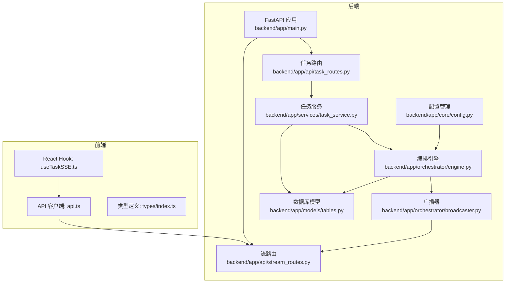
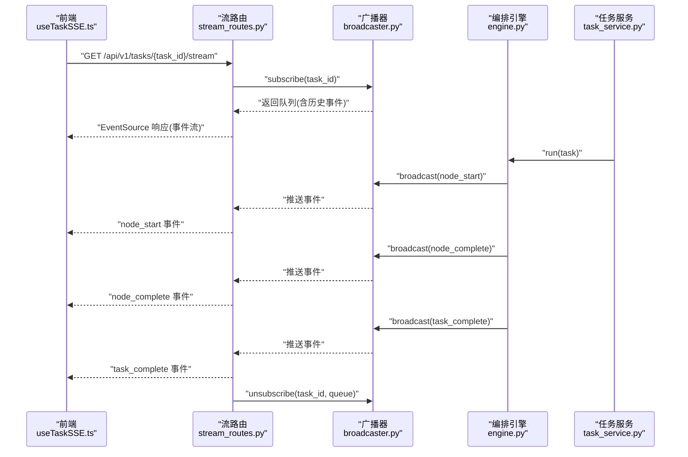
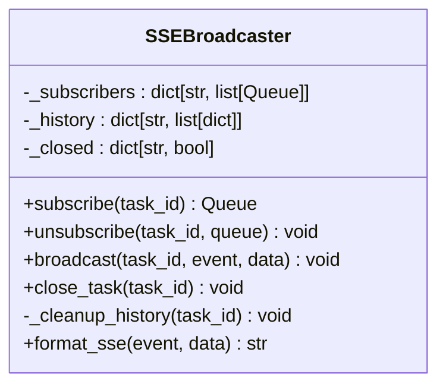
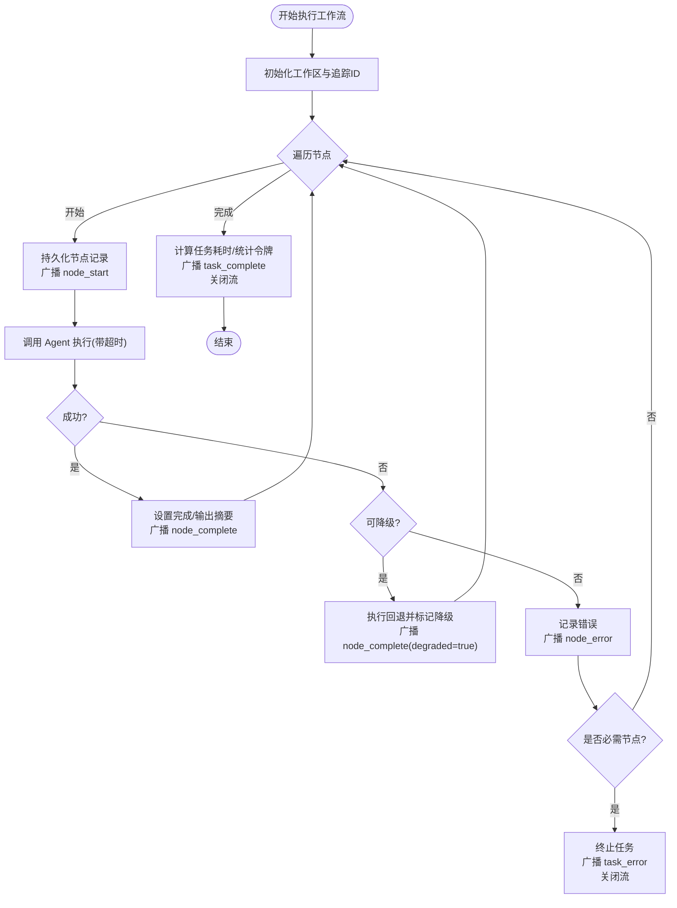
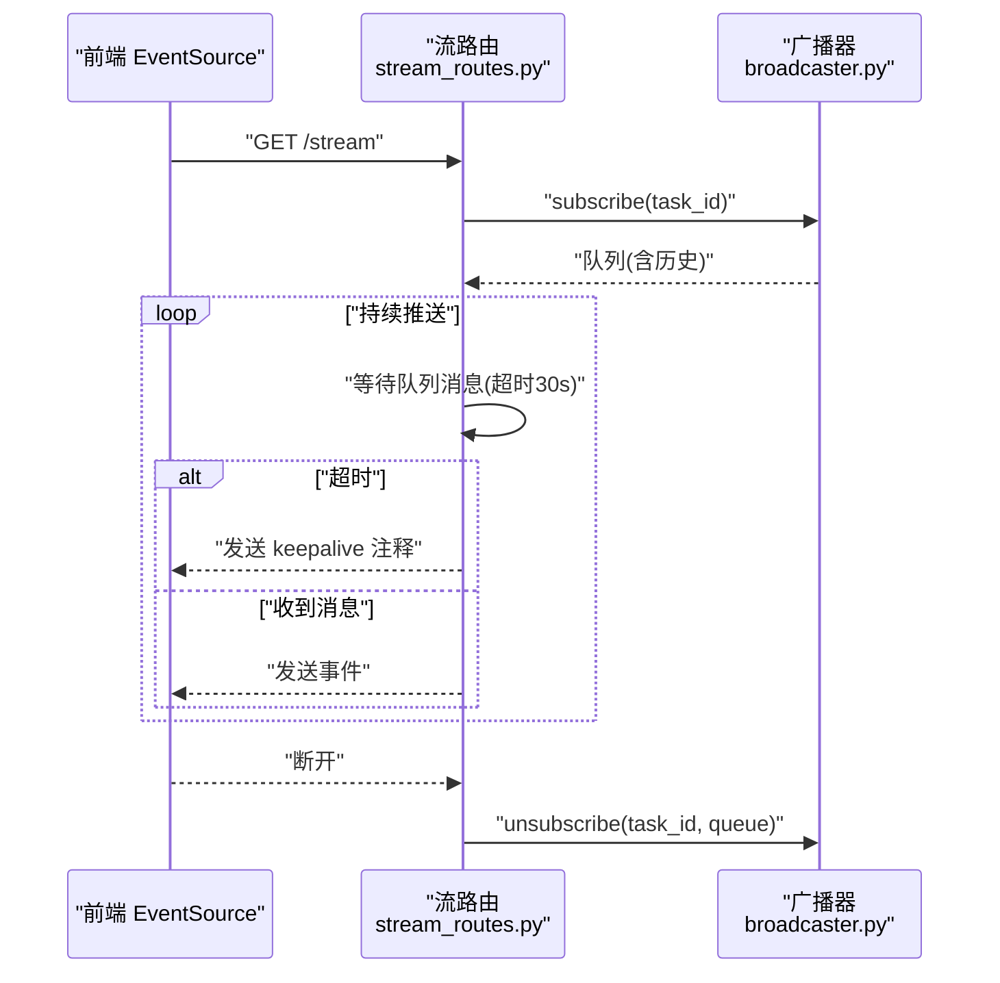
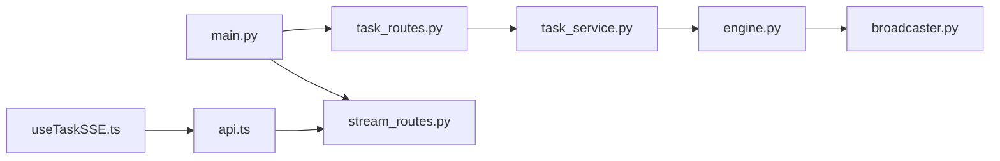

# 实时事件流API

<cite>
**本文引用的文件**
- [backend/app/main.py](file://backend/app/main.py)
- [backend/app/api/stream_routes.py](file://backend/app/api/stream_routes.py)
- [backend/app/orchestrator/broadcaster.py](file://backend/app/orchestrator/broadcaster.py)
- [backend/app/orchestrator/engine.py](file://backend/app/orchestrator/engine.py)
- [backend/app/services/task_service.py](file://backend/app/services/task_service.py)
- [backend/app/api/task_routes.py](file://backend/app/api/task_routes.py)
- [backend/app/schemas/task.py](file://backend/app/schemas/task.py)
- [backend/app/models/tables.py](file://backend/app/models/tables.py)
- [frontend/hooks/useTaskSSE.ts](file://frontend/hooks/useTaskSSE.ts)
- [frontend/lib/api.ts](file://frontend/lib/api.ts)
- [frontend/types/index.ts](file://frontend/types/index.ts)
- [backend/app/core/config.py](file://backend/app/core/config.py)
</cite>

## 更新摘要
**变更内容**
- 更新SSE广播器实现细节，包括历史缓冲和清理机制
- 新增keepalive保活机制的详细说明
- 完善事件驱动架构的实现原理
- 增强事件类型定义和消息格式规范
- 优化前端JavaScript实现示例

## 目录
1. [简介](#简介)
2. [项目结构](#项目结构)
3. [核心组件](#核心组件)
4. [架构总览](#架构总览)
5. [详细组件分析](#详细组件分析)
6. [依赖关系分析](#依赖关系分析)
7. [性能考虑](#性能考虑)
8. [故障排查指南](#故障排查指南)
9. [结论](#结论)
10. [附录](#附录)

## 简介
本文件面向实时事件流API的技术文档，聚焦于SSE（Server-Sent Events）协议在本项目中的实现与应用。内容涵盖：
- 连接建立、事件推送与客户端断线重连机制
- GET /api/v1/tasks/{task_id}/stream 接口的实现细节
- 事件广播系统架构（SSEBroadcaster 组件）、事件队列管理与多客户端并发处理
- 事件数据结构（节点状态变更、Agent 执行进度、最终结果）
- 客户端 JavaScript 示例（EventSource 连接、事件监听与错误处理）
- 性能优化建议（连接池、背压控制、内存泄漏防护）

## 项目结构
后端采用 FastAPI 提供 REST 与 SSE 能力；前端通过 React Hook 使用 EventSource 订阅任务事件流。事件从工作流引擎产生，经由广播器分发到每个订阅者。

**图表来源**
- [backend/app/main.py:102-200](file://backend/app/main.py#L102-L200)
- [backend/app/api/stream_routes.py:37-96](file://backend/app/api/stream_routes.py#L37-L96)
- [backend/app/orchestrator/broadcaster.py:30-215](file://backend/app/orchestrator/broadcaster.py#L30-L215)
- [backend/app/orchestrator/engine.py:131-415](file://backend/app/orchestrator/engine.py#L131-L415)
- [frontend/hooks/useTaskSSE.ts:82-233](file://frontend/hooks/useTaskSSE.ts#L82-L233)
- [frontend/lib/api.ts:97-103](file://frontend/lib/api.ts#L97-L103)
- [frontend/types/index.ts:66-95](file://frontend/types/index.ts#L66-L95)

**章节来源**
- [backend/app/main.py:102-200](file://backend/app/main.py#L102-L200)
- [frontend/lib/api.ts:97-103](file://frontend/lib/api.ts#L97-L103)

## 核心组件
- **SSE 广播器（SSEBroadcaster）**：按 task_id 维度维护订阅者队列与历史事件缓冲，负责事件入队、广播与清理。
- **编排引擎（OrchestratorEngine）**：驱动工作流顺序执行，向广播器推送节点开始、完成、失败以及任务完成/错误事件。
- **流路由（stream_routes）**：基于 sse-starlette 的 EventSourceResponse，为每个订阅者提供异步事件生成器。
- **任务服务（TaskService）**：封装任务生命周期业务逻辑，触发后台运行并处理异常。
- **前端 Hook（useTaskSSE）**：封装 EventSource 连接、事件监听与状态更新。

**章节来源**
- [backend/app/orchestrator/broadcaster.py:30-215](file://backend/app/orchestrator/broadcaster.py#L30-L215)
- [backend/app/orchestrator/engine.py:131-415](file://backend/app/orchestrator/engine.py#L131-L415)
- [backend/app/api/stream_routes.py:37-96](file://backend/app/api/stream_routes.py#L37-L96)
- [backend/app/services/task_service.py:20-126](file://backend/app/services/task_service.py#L20-L126)
- [frontend/hooks/useTaskSSE.ts:82-233](file://frontend/hooks/useTaskSSE.ts#L82-L233)

## 架构总览
SSE 事件流从编排引擎产生，经广播器分发至每个订阅者。前端通过 EventSource 订阅，自动处理断线重连与心跳保活。

**图表来源**
- [backend/app/api/stream_routes.py:53-96](file://backend/app/api/stream_routes.py#L53-L96)
- [backend/app/orchestrator/broadcaster.py:57-92](file://backend/app/orchestrator/broadcaster.py#L57-L92)
- [backend/app/orchestrator/engine.py:197-333](file://backend/app/orchestrator/engine.py#L197-L333)
- [backend/app/services/task_service.py:39-63](file://backend/app/services/task_service.py#L39-L63)

## 详细组件分析

### SSE 广播器（SSEBroadcaster）
- **设计要点**
  - 每个 task_id 对应一组订阅者队列（asyncio.Queue），用于事件分发
  - 历史事件缓冲（_history）解决"先执行后订阅"的竞态问题
  - 关闭标记（_closed）与哨兵值（None）用于优雅结束流
  - 历史清理（60 秒后清理）避免内存泄漏
- **并发模型**
  - 多客户端并发读取各自队列，互不阻塞
  - 广播时对所有订阅者队列进行异步写入
- **错误处理**
  - 订阅/取消订阅过程忽略不存在的队列，保证健壮性
- **数据结构复杂度**
  - 订阅/取消：O(n)（n 为该 task_id 的订阅者数量）
  - 广播：O(n)
  - 历史缓冲：按事件数增长，清理后释放

**图表来源**
- [backend/app/orchestrator/broadcaster.py:30-215](file://backend/app/orchestrator/broadcaster.py#L30-L215)

**章节来源**
- [backend/app/orchestrator/broadcaster.py:30-215](file://backend/app/orchestrator/broadcaster.py#L30-L215)

### 编排引擎（OrchestratorEngine）
- **工作流执行**
  - 顺序执行固定节点链路，每个节点对应一个 Agent
  - 节点开始前持久化记录并广播 node_start
  - 节点完成后广播 node_complete，并汇总输出摘要
  - 节点失败时广播 node_error，必要时终止任务
  - 任务结束后广播 task_complete，并关闭流
- **事件内容**
  - node_start：包含节点索引、总数、开始时间等
  - node_complete：包含耗时、降级标志、输出摘要
  - node_error：包含错误信息
  - task_complete：包含任务耗时
- **异常处理**
  - 超时、执行异常均转化为 node_error 或 task_error 事件
  - 任务失败后仍会广播 task_error 与关闭流

**图表来源**
- [backend/app/orchestrator/engine.py:197-333](file://backend/app/orchestrator/engine.py#L197-L333)

**章节来源**
- [backend/app/orchestrator/engine.py:131-415](file://backend/app/orchestrator/engine.py#L131-L415)

### 流路由（/api/v1/tasks/{task_id}/stream）
- **功能**
  - 为指定 task_id 建立 SSE 事件流
  - 订阅广播器队列，处理断开检测、超时保活与结束信号
- **连接与保活**
  - 使用 asyncio.wait_for(queue.get()) 设置超时
  - 超时则发送注释型 keepalive，维持连接活跃
- **结束语义**
  - 收到 None 哨兵表示任务结束，停止推送并取消订阅
- **断线重连**
  - 客户端 EventSource 自动重连，且会重放历史事件（由广播器缓冲）

**图表来源**
- [backend/app/api/stream_routes.py:53-96](file://backend/app/api/stream_routes.py#L53-L96)
- [backend/app/orchestrator/broadcaster.py:57-92](file://backend/app/orchestrator/broadcaster.py#L57-L92)

**章节来源**
- [backend/app/api/stream_routes.py:37-96](file://backend/app/api/stream_routes.py#L37-L96)

### 事件类型与消息格式
- **事件类型**
  - node_start：节点开始执行
  - node_complete：节点完成执行
  - node_error：节点执行失败
  - task_complete：任务完成
  - task_error：任务执行失败
- **消息格式**
  - data 字段为 JSON 对象，包含事件相关字段
  - 服务端通过 EventSourceResponse 以 SSE 格式推送
- **前端事件监听**
  - 使用 addEventListener 监听各事件类型
  - 在 task_complete 时关闭连接并标记完成

**章节来源**
- [frontend/hooks/useTaskSSE.ts:149-213](file://frontend/hooks/useTaskSSE.ts#L149-L213)
- [backend/app/orchestrator/engine.py:197-333](file://backend/app/orchestrator/engine.py#L197-L333)

### 前端 JavaScript 实现示例（EventSource）
- **连接建立**
  - 通过 getTaskStreamUrl(taskId) 获取直连地址（绕过 Next.js 代理，避免响应缓冲）
  - 创建 EventSource 并监听 onopen/onerror
- **事件监听**
  - node_start：将对应节点状态置为 running
  - node_complete：将对应节点状态置为 completed，并填充耗时、摘要、降级标志
  - node_error：将对应节点状态置为 failed，并记录错误
  - task_complete：标记任务完成，关闭连接
  - task_error：记录任务错误并关闭连接
- **错误处理**
  - onerror 不主动关闭，交由浏览器自动重连（指数退避）

**章节来源**
- [frontend/lib/api.ts:97-103](file://frontend/lib/api.ts#L97-L103)
- [frontend/hooks/useTaskSSE.ts:128-233](file://frontend/hooks/useTaskSSE.ts#L128-L233)

## 依赖关系分析
- **后端模块耦合**
  - main.py 注册路由与中间件，统一暴露 REST 与 SSE
  - task_routes 仅负责任务生命周期与后台调度，不包含业务逻辑
  - task_service 将业务逻辑与编排引擎解耦
  - engine 与 broadcaster 单向依赖（engine -> broadcaster），便于测试与替换
- **前后端交互**
  - 前端通过 api.ts 的 getTaskStreamUrl 直连后端 SSE 端点
  - useTaskSSE 仅依赖 EventSource 与后端事件约定

**图表来源**
- [backend/app/main.py:192-200](file://backend/app/main.py#L192-L200)
- [backend/app/api/stream_routes.py:34-36](file://backend/app/api/stream_routes.py#L34-L36)
- [backend/app/orchestrator/broadcaster.py:32-32](file://backend/app/orchestrator/broadcaster.py#L32-L32)
- [frontend/hooks/useTaskSSE.ts:33-33](file://frontend/hooks/useTaskSSE.ts#L33-L33)
- [frontend/lib/api.ts:33-33](file://frontend/lib/api.ts#L33-L33)

**章节来源**
- [backend/app/main.py:102-200](file://backend/app/main.py#L102-L200)
- [frontend/lib/api.ts:97-103](file://frontend/lib/api.ts#L97-L103)

## 性能考虑
- **连接池与并发**
  - 广播器按 task_id 维度管理队列，单任务多客户端并发读取互不影响
  - 建议限制同一 task_id 的最大订阅数，防止过多客户端导致队列积压
- **背压控制**
  - 使用 asyncio.Queue 的默认容量；若需限流，可在广播器中引入有界队列并在满载时丢弃旧事件或阻塞写入
  - 前端 EventSource 自动重连与指数退避，避免风暴式重试
- **内存泄漏防护**
  - 广播器在 close_task 后延迟 60 秒清理历史缓冲，避免频繁创建/销毁带来的抖动
  - 可根据场景调整清理周期或在高并发场景下增加清理频率
- **I/O 与序列化**
  - 事件数据通过 JSON 序列化，建议保持数据精简，避免传输冗余字段
- **超时与保活**
  - 服务端超时 30 秒发送 keepalive 注释，确保长连接稳定
  - 前端 onerror 不关闭连接，交由浏览器处理重连策略

## 故障排查指南
- **常见问题**
  - 事件未到达：检查广播器是否正确广播、队列是否被取消订阅、客户端是否在断线重连
  - 任务未结束：确认编排引擎是否正常推送 task_complete/close_task
  - 前端无法连接：确认 getTaskStreamUrl 返回的直连地址与后端端口一致
- **日志与追踪**
  - 后端使用 trace_id 中间件，结合日志查看事件广播与订阅生命周期
- **快速定位**
  - 在流路由中打印队列获取与断开事件，确认连接状态
  - 在编排引擎中检查事件推送调用与异常分支

**章节来源**
- [backend/app/api/stream_routes.py:63-96](file://backend/app/api/stream_routes.py#L63-L96)
- [backend/app/orchestrator/engine.py:197-333](file://backend/app/orchestrator/engine.py#L197-L333)
- [frontend/lib/api.ts:97-103](file://frontend/lib/api.ts#L97-L103)

## 结论
本项目的实时事件流以 SSE 为核心，通过编排引擎产生事件、广播器进行分发与缓冲、前端 EventSource 自动重连与保活，实现了低耦合、高扩展的任务执行可视化。广播器的历史缓冲与关闭清理机制有效解决了"先执行后订阅"的竞态与内存泄漏风险；前端 Hook 则提供了清晰的事件监听与状态管理模式。后续可在队列容量、清理策略与前端退避参数上进一步优化以适配更高并发场景。

## 附录

### 事件数据结构参考
- **节点运行记录（NodeRunData）**
  - 字段：node_id、agent_id、name、status、input_data、output_data、started_at、completed_at、elapsed_seconds、prompt_tokens、completion_tokens、model_used、degraded、error_message
- **任务详情（TaskDetailResponse）**
  - 字段：task_id、status、input_data、workflow_id、result_data、created_at、started_at、completed_at、elapsed_seconds、total_tokens

**章节来源**
- [backend/app/schemas/task.py:42-70](file://backend/app/schemas/task.py#L42-L70)

### 数据模型概览（与事件流相关）
- **任务表（TaskModel）**：保存任务生命周期与统计信息
- **节点运行表（TaskNodeRunModel）**：保存每个节点的执行记录与指标

**章节来源**
- [backend/app/models/tables.py:23-74](file://backend/app/models/tables.py#L23-L74)

### SSE 事件类型定义
- **node_start**：节点开始执行
  - 包含字段：node_id、agent_id、name、index、total、started_at
- **node_complete**：节点完成执行
  - 包含字段：node_id、agent_id、name、elapsed_seconds、degraded、output_summary
- **node_error**：节点执行失败
  - 包含字段：node_id、error
- **task_complete**：任务完成
  - 包含字段：task_id、elapsed_seconds

**章节来源**
- [frontend/types/index.ts:66-95](file://frontend/types/index.ts#L66-L95)
- [backend/app/orchestrator/engine.py:197-333](file://backend/app/orchestrator/engine.py#L197-L333)