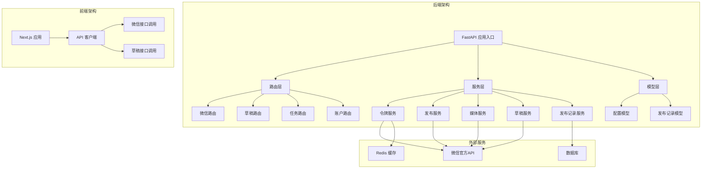
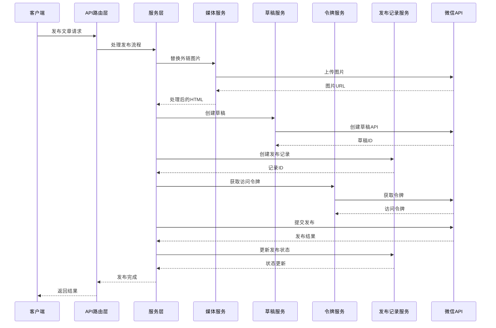
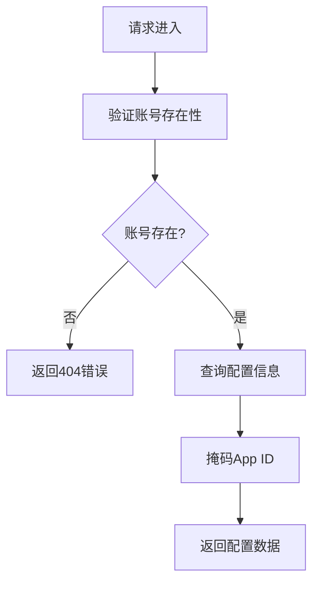
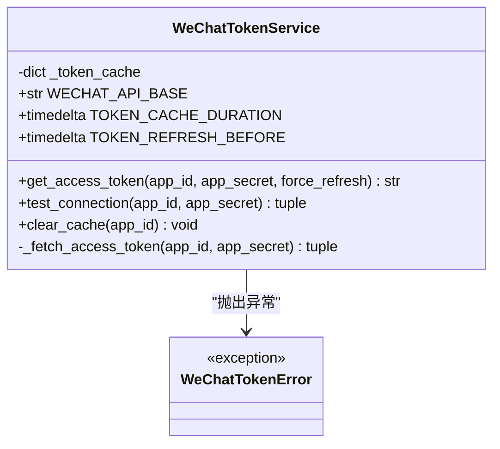
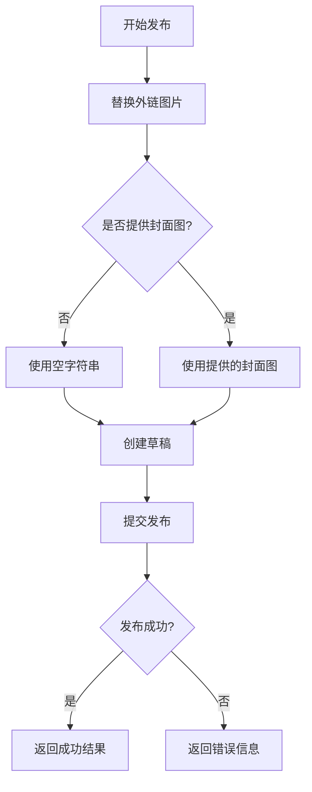
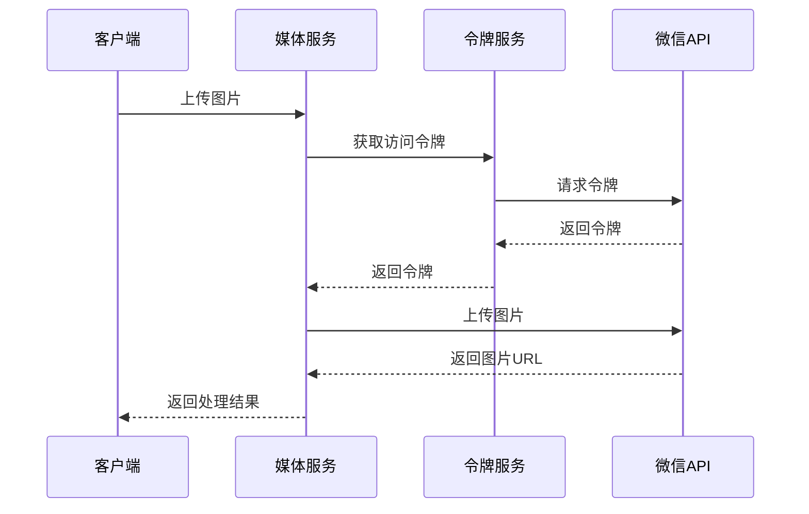
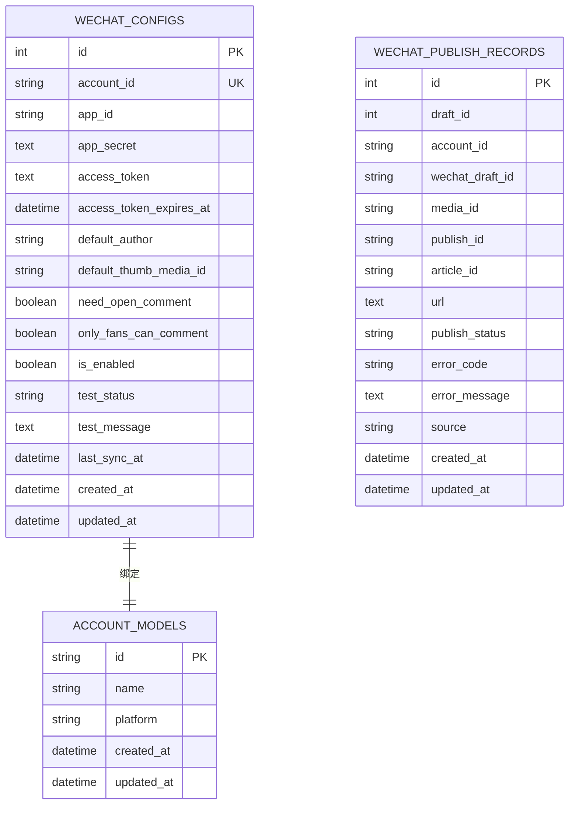
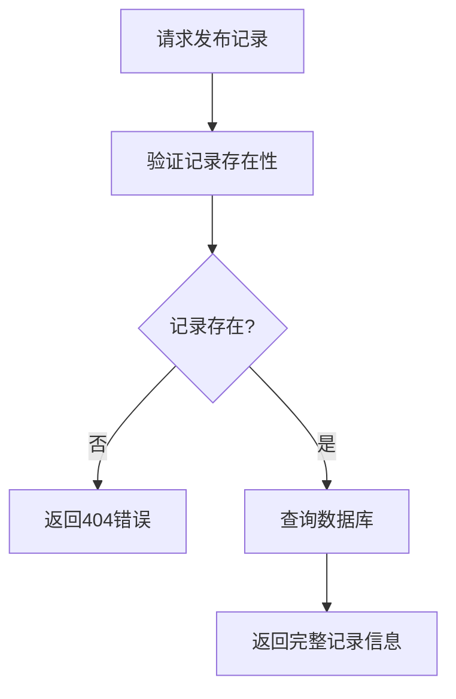
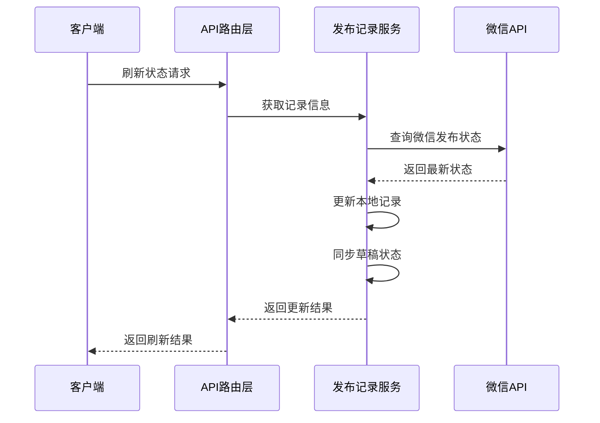
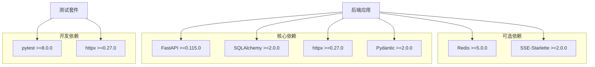

# 微信API接口

<cite>
**本文档引用的文件**
- [backend/app/api/wechat_routes.py](file://backend/app/api/wechat_routes.py)
- [backend/app/api/draft_routes.py](file://backend/app/api/draft_routes.py)
- [backend/app/models/wechat_config.py](file://backend/app/models/wechat_config.py)
- [backend/app/services/wechat_token_service.py](file://backend/app/services/wechat_token_service.py)
- [backend/app/services/wechat_publish_service.py](file://backend/app/services/wechat_publish_service.py)
- [backend/app/services/wechat_media_service.py](file://backend/app/services/wechat_media_service.py)
- [backend/app/services/wechat_draft_service.py](file://backend/app/services/wechat_draft_service.py)
- [backend/app/services/publish_record_service.py](file://backend/app/services/publish_record_service.py)
- [backend/app/schemas/wechat.py](file://backend/app/schemas/wechat.py)
- [backend/app/main.py](file://backend/app/main.py)
- [frontend/lib/api.ts](file://frontend/lib/api.ts)
- [backend/pyproject.toml](file://backend/pyproject.toml)
- [frontend/package.json](file://frontend/package.json)
</cite>

## 更新摘要
**变更内容**
- 新增发布记录管理API端点，支持完整的发布生命周期管理
- 添加获取单个发布记录功能
- 新增手动状态同步和刷新功能
- 扩展草稿发布记录查询能力
- 增强重试发布机制

## 目录
1. [简介](#简介)
2. [项目结构](#项目结构)
3. [核心组件](#核心组件)
4. [架构概览](#架构概览)
5. [详细组件分析](#详细组件分析)
6. [发布记录管理API](#发布记录管理api)
7. [依赖关系分析](#依赖关系分析)
8. [性能考虑](#性能考虑)
9. [故障排除指南](#故障排除指南)
10. [结论](#结论)

## 简介

这是一个基于FastAPI构建的多智能体内容生产平台，专门用于微信公众号的内容发布。该系统提供了完整的微信API接口集成，包括配置管理、内容发布、媒体处理、发布记录管理等功能。

系统采用前后端分离架构，后端使用Python 3.11+和FastAPI框架，前端使用Next.js和TypeScript。核心功能包括：

- 微信公众号配置管理
- 文章草稿发布到微信
- 媒体资源上传和处理
- 访问令牌管理和缓存
- 发布状态查询和跟踪
- **新增：发布记录生命周期管理**
- **新增：手动状态同步和刷新**
- **新增：重试发布机制**

## 项目结构

**图表来源**
- [backend/app/main.py:1-222](file://backend/app/main.py#L1-L222)
- [backend/app/api/wechat_routes.py:1-349](file://backend/app/api/wechat_routes.py#L1-L349)

**章节来源**
- [backend/app/main.py:1-222](file://backend/app/main.py#L1-L222)
- [backend/pyproject.toml:1-41](file://backend/pyproject.toml#L1-L41)
- [frontend/package.json:1-25](file://frontend/package.json#L1-L25)

## 核心组件

### 微信配置管理模块

该模块负责管理每个微信公众号的配置信息，包括App ID、App Secret、默认作者等参数。

**章节来源**
- [backend/app/api/wechat_routes.py:32-126](file://backend/app/api/wechat_routes.py#L32-L126)
- [backend/app/models/wechat_config.py:10-31](file://backend/app/models/wechat_config.py#L10-L31)
- [backend/app/schemas/wechat.py:12-67](file://backend/app/schemas/wechat.py#L12-L67)

### 访问令牌管理系统

提供微信API访问令牌的获取、缓存和刷新功能，确保系统的稳定性和性能。

**章节来源**
- [backend/app/services/wechat_token_service.py:26-163](file://backend/app/services/wechat_token_service.py#L26-L163)

### 发布服务模块

实现完整的文章发布流程，从内容处理到最终发布，包括草稿创建、媒体上传、正式发布等步骤。

**章节来源**
- [backend/app/services/wechat_publish_service.py:23-345](file://backend/app/services/wechat_publish_service.py#L23-L345)

### 媒体处理服务

负责处理文章中的图片资源，支持外链图片下载和微信CDN上传替换。

**章节来源**
- [backend/app/services/wechat_media_service.py:25-257](file://backend/app/services/wechat_media_service.py#L25-L257)

### 草稿管理服务

提供微信草稿的创建、更新、删除和查询功能。

**章节来源**
- [backend/app/services/wechat_draft_service.py:23-335](file://backend/app/services/wechat_draft_service.py#L23-L335)

### 发布记录服务

**新增** 统一管理所有发布记录的生命周期，包括创建、状态更新、错误记录、状态回查同步等功能。

**章节来源**
- [backend/app/services/publish_record_service.py:30-433](file://backend/app/services/publish_record_service.py#L30-L433)

## 架构概览

**图表来源**
- [backend/app/api/wechat_routes.py:179-199](file://backend/app/api/wechat_routes.py#L179-L199)
- [backend/app/services/wechat_publish_service.py:36-143](file://backend/app/services/wechat_publish_service.py#L36-L143)

## 详细组件分析

### 微信配置API

#### GET /api/v1/wechat/config/{account_id}

获取指定账号的微信配置信息，返回的数据中App ID会被安全地掩码处理。

**图表来源**
- [backend/app/api/wechat_routes.py:32-69](file://backend/app/api/wechat_routes.py#L32-L69)

#### POST /api/v1/wechat/config

创建新的微信配置，需要验证账号存在且配置不存在。

**章节来源**
- [backend/app/api/wechat_routes.py:72-126](file://backend/app/api/wechat_routes.py#L72-L126)

#### PUT /api/v1/wechat/config/{account_id}

更新现有配置，支持部分字段更新。

**章节来源**
- [backend/app/api/wechat_routes.py:129-176](file://backend/app/api/wechat_routes.py#L129-L176)

### 访问令牌服务

**图表来源**
- [backend/app/services/wechat_token_service.py:26-163](file://backend/app/services/wechat_token_service.py#L26-L163)

#### 令牌缓存机制

服务实现了简单的内存缓存机制，包含以下特性：

- 缓存有效期：2小时
- 自动刷新：提前5分钟刷新
- 线程安全的字典存储
- 支持强制刷新模式

**章节来源**
- [backend/app/services/wechat_token_service.py:40-85](file://backend/app/services/wechat_token_service.py#L40-L85)

### 发布服务流程

**图表来源**
- [backend/app/services/wechat_publish_service.py:36-143](file://backend/app/services/wechat_publish_service.py#L36-L143)

#### 发布状态查询

支持查询发布状态，包括待处理、成功、失败等状态。

**章节来源**
- [backend/app/services/wechat_publish_service.py:263-341](file://backend/app/services/wechat_publish_service.py#L263-L341)

### 媒体处理服务

**图表来源**
- [backend/app/services/wechat_media_service.py:39-106](file://backend/app/services/wechat_media_service.py#L39-L106)

#### 图片替换逻辑

服务能够自动识别HTML中的外链图片并进行替换：

- 支持多种图片格式（JPG、PNG、GIF等）
- 自动下载外链图片
- 上传到微信CDN并替换URL
- 保留原始图片质量

**章节来源**
- [backend/app/services/wechat_media_service.py:173-248](file://backend/app/services/wechat_media_service.py#L173-L248)

### 数据模型设计

**图表来源**
- [backend/app/models/wechat_config.py:10-54](file://backend/app/models/wechat_config.py#L10-L54)

**章节来源**
- [backend/app/models/wechat_config.py:10-54](file://backend/app/models/wechat_config.py#L10-L54)

## 发布记录管理API

**新增** 系统现在提供完整的发布记录管理功能，支持发布生命周期的完整跟踪和管理。

### 发布记录查询API

#### GET /api/v1/wechat/publish-records/{record_id}

获取单个发布记录的详细信息，包括发布状态、错误信息、时间戳等完整数据。

**图表来源**
- [backend/app/api/wechat_routes.py:204-243](file://backend/app/api/wechat_routes.py#L204-L243)

#### GET /api/v1/drafts/{draft_id}/publish-records

获取草稿的所有发布记录，包括重试历史，支持完整的发布轨迹追踪。

**章节来源**
- [backend/app/api/draft_routes.py:342-381](file://backend/app/api/draft_routes.py#L342-L381)

### 发布状态管理API

#### POST /api/v1/wechat/publish-records/{record_id}/refresh-status

手动刷新发布状态，从微信API同步最新状态到本地记录，并同步草稿状态。

**图表来源**
- [backend/app/api/wechat_routes.py:246-348](file://backend/app/api/wechat_routes.py#L246-L348)

#### POST /api/v1/drafts/{draft_id}/retry-publish

重试失败的发布，支持最多3次重试，自动创建新的发布记录并继承原记录信息。

**章节来源**
- [backend/app/api/draft_routes.py:384-441](file://backend/app/api/draft_routes.py#L384-L441)

### 发布记录服务功能

发布记录服务提供了完整的生命周期管理功能：

- **状态管理**：pending、publishing、published、failed、unknown
- **触发类型**：manual_confirm、semi_auto_confirm、full_auto、auto_retry、manual_retry
- **重试机制**：自动和手动重试，最多3次
- **状态同步**：与草稿状态双向同步
- **查询功能**：按草稿、账号、时间范围查询

**章节来源**
- [backend/app/services/publish_record_service.py:30-433](file://backend/app/services/publish_record_service.py#L30-L433)

## 依赖关系分析

**图表来源**
- [backend/pyproject.toml:6-22](file://backend/pyproject.toml#L6-L22)

### 前端依赖

前端使用Next.js框架，主要依赖包括React、TypeScript和TailwindCSS。

**章节来源**
- [frontend/package.json:12-23](file://frontend/package.json#L12-L23)

## 性能考虑

### 缓存策略

系统实现了多层次的缓存机制：

1. **令牌缓存**：访问令牌缓存2小时，提前5分钟刷新
2. **内存缓存**：简单字典存储，适合单实例部署
3. **数据库缓存**：配置信息持久化存储

### 异步处理

- 使用async/await模式处理HTTP请求
- 异步HTTP客户端处理外部API调用
- 支持并发请求处理

### 错误处理

- 统一的错误码体系（1000-9999）
- 分类映射到标准HTTP状态码
- 详细的日志记录和追踪ID

## 故障排除指南

### 常见问题及解决方案

#### 访问令牌获取失败

**症状**：发布文章时报错"Failed to get access_token"

**可能原因**：
- App ID或App Secret错误
- 网络连接问题
- 微信API限流

**解决步骤**：
1. 验证App ID和App Secret
2. 检查网络连接
3. 查看令牌缓存状态
4. 重新测试连接

#### 图片上传失败

**症状**：外链图片无法替换为微信CDN链接

**可能原因**：
- 外链图片无法访问
- 微信API上传限制
- 文件格式不支持

**解决步骤**：
1. 检查外链图片可用性
2. 验证文件格式支持
3. 查看上传限制
4. 重试上传操作

#### 发布状态查询超时

**症状**：查询发布状态长时间无响应

**可能原因**：
- 微信API响应慢
- 网络延迟
- 发布队列繁忙

**解决步骤**：
1. 检查网络状况
2. 适当增加超时时间
3. 重试查询操作
4. 监控发布队列状态

#### 发布记录管理问题

**症状**：发布记录状态不同步或重试失败

**可能原因**：
- 数据库连接问题
- 发布记录状态冲突
- 重试次数限制

**解决步骤**：
1. 检查数据库连接状态
2. 验证发布记录状态一致性
3. 确认重试条件满足
4. 手动刷新状态同步

**章节来源**
- [backend/app/services/wechat_token_service.py:127-135](file://backend/app/services/wechat_token_service.py#L127-L135)
- [backend/app/services/wechat_media_service.py:96-105](file://backend/app/services/wechat_media_service.py#L96-L105)
- [backend/app/services/wechat_publish_service.py:190-199](file://backend/app/services/wechat_publish_service.py#L190-L199)

## 结论

该微信API接口系统提供了完整的微信公众号内容发布解决方案，具有以下特点：

**技术优势**：
- 清晰的分层架构设计
- 完善的错误处理机制
- 高效的缓存策略
- 异步异步处理能力
- **新增：完整的发布记录生命周期管理**

**功能完整性**：
- 支持完整的发布流程
- 提供状态查询功能
- 包含媒体处理能力
- 实现配置管理功能
- **新增：发布记录查询和管理**
- **新增：手动状态同步和刷新**
- **新增：重试发布机制**

**扩展性**：
- 模块化设计便于扩展
- 支持多账号管理
- 可扩展的服务架构
- **新增：灵活的发布记录管理**

系统适用于需要自动化微信公众号内容发布的场景，为内容创作者和营销团队提供了高效的技术工具。新增的发布记录管理功能进一步增强了系统的可观测性和可维护性，支持完整的发布生命周期跟踪和管理。