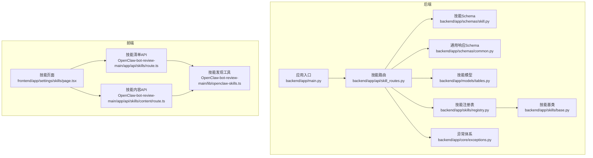
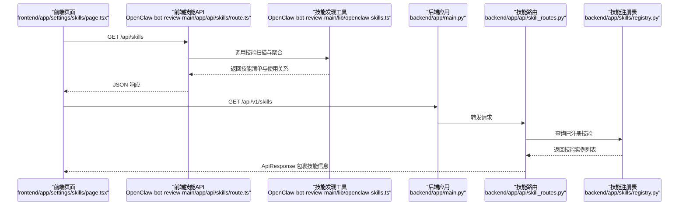
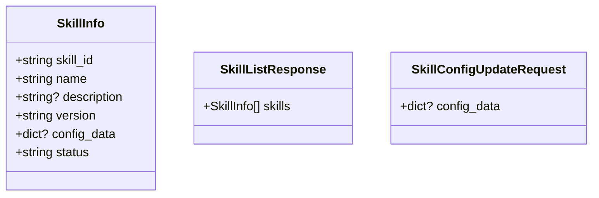
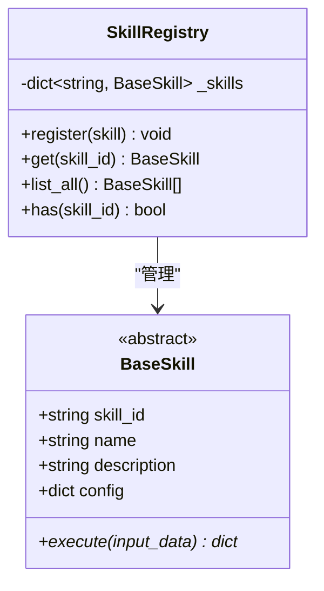
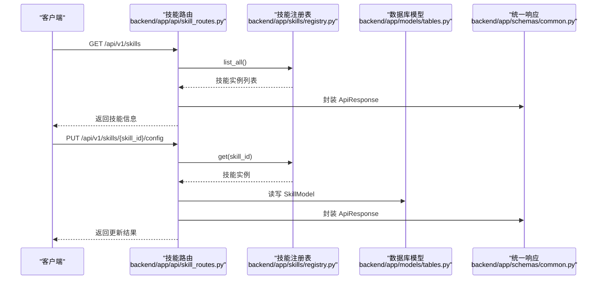
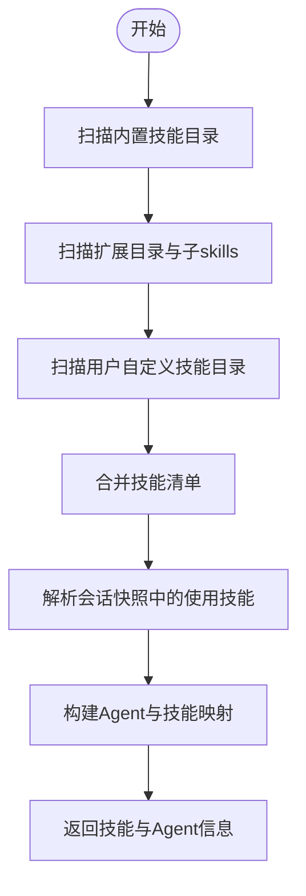
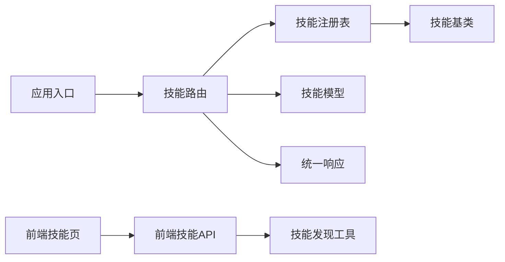

# 技能管理API

<cite>
**本文引用的文件**
- [backend/app/main.py](file://backend/app/main.py)
- [backend/app/api/skill_routes.py](file://backend/app/api/skill_routes.py)
- [backend/app/schemas/skill.py](file://backend/app/schemas/skill.py)
- [backend/app/schemas/common.py](file://backend/app/schemas/common.py)
- [backend/app/models/tables.py](file://backend/app/models/tables.py)
- [backend/app/skills/base.py](file://backend/app/skills/base.py)
- [backend/app/skills/registry.py](file://backend/app/skills/registry.py)
- [backend/app/core/exceptions.py](file://backend/app/core/exceptions.py)
- [OpenClaw-bot-review-main/lib/openclaw-skills.ts](file://OpenClaw-bot-review-main/lib/openclaw-skills.ts)
- [OpenClaw-bot-review-main/app/api/skills/route.ts](file://OpenClaw-bot-review-main/app/api/skills/route.ts)
- [OpenClaw-bot-review-main/app/api/skills/content/route.ts](file://OpenClaw-bot-review-main/app/api/skills/content/route.ts)
- [frontend/app/settings/skills/page.tsx](file://frontend/app/settings/skills/page.tsx)
</cite>

## 目录
1. [简介](#简介)
2. [项目结构](#项目结构)
3. [核心组件](#核心组件)
4. [架构总览](#架构总览)
5. [详细组件分析](#详细组件分析)
6. [依赖分析](#依赖分析)
7. [性能考虑](#性能考虑)
8. [故障排查指南](#故障排查指南)
9. [结论](#结论)
10. [附录](#附录)

## 简介
本文件面向“技能管理API”的完整技术文档，覆盖技能注册、配置、绑定与管理的端到端流程。重点阐述：
- 技能与Agent的绑定关系（一对一、一对多、多对多）的配置模式与数据结构
- 技能配置的数据模型（技能ID、名称、描述、参数定义、调用协议）
- 技能动态注册机制（运行时技能发现、配置解析、实例创建）
- 参数验证与类型检查机制（保障调用安全与稳定）
- 技能开发模板与调用示例（内置技能与自定义技能）
- 版本管理与兼容性策略（向后兼容与升级）
- 性能监控与调用统计的API接口说明

## 项目结构
本仓库采用前后端分离与多模块协作的架构：
- 后端（Python/FastAPI）：提供技能配置API、技能注册中心、数据库模型与异常体系
- 前端（Next.js）：展示技能清单、内容与绑定关系，并通过统一API访问后端
- 技能发现工具（TypeScript）：在前端侧扫描内置、扩展与自定义技能目录，构建技能清单与使用关系

图表来源
- [backend/app/main.py:69-147](file://backend/app/main.py#L69-L147)
- [backend/app/api/skill_routes.py:14-60](file://backend/app/api/skill_routes.py#L14-L60)
- [backend/app/schemas/skill.py:6-21](file://backend/app/schemas/skill.py#L6-L21)
- [backend/app/schemas/common.py:7-27](file://backend/app/schemas/common.py#L7-L27)
- [backend/app/models/tables.py:183-199](file://backend/app/models/tables.py#L183-L199)
- [backend/app/skills/base.py:16-37](file://backend/app/skills/base.py#L16-L37)
- [backend/app/skills/registry.py:10-36](file://backend/app/skills/registry.py#L10-L36)
- [OpenClaw-bot-review-main/lib/openclaw-skills.ts:111-151](file://OpenClaw-bot-review-main/lib/openclaw-skills.ts#L111-L151)
- [OpenClaw-bot-review-main/app/api/skills/route.ts:4-10](file://OpenClaw-bot-review-main/app/api/skills/route.ts#L4-L10)
- [OpenClaw-bot-review-main/app/api/skills/content/route.ts:4-28](file://OpenClaw-bot-review-main/app/api/skills/content/route.ts#L4-L28)
- [frontend/app/settings/skills/page.tsx:8-80](file://frontend/app/settings/skills/page.tsx#L8-L80)

章节来源
- [backend/app/main.py:69-147](file://backend/app/main.py#L69-L147)
- [OpenClaw-bot-review-main/lib/openclaw-skills.ts:111-151](file://OpenClaw-bot-review-main/lib/openclaw-skills.ts#L111-L151)

## 核心组件
- 技能基类与注册中心：定义技能抽象与集中注册、查询能力
- 技能模型与Schema：定义技能持久化字段与请求/响应结构
- 技能API路由：提供技能清单与配置更新接口
- 异常体系：统一错误码与HTTP映射
- 前端技能发现与展示：扫描内置/扩展/自定义技能，构建使用关系

章节来源
- [backend/app/skills/base.py:16-37](file://backend/app/skills/base.py#L16-L37)
- [backend/app/skills/registry.py:10-36](file://backend/app/skills/registry.py#L10-L36)
- [backend/app/models/tables.py:183-199](file://backend/app/models/tables.py#L183-L199)
- [backend/app/schemas/skill.py:6-21](file://backend/app/schemas/skill.py#L6-L21)
- [backend/app/api/skill_routes.py:17-60](file://backend/app/api/skill_routes.py#L17-L60)
- [backend/app/core/exceptions.py:38-43](file://backend/app/core/exceptions.py#L38-L43)

## 架构总览
技能管理API围绕“注册中心 + 持久化模型 + 统一Schema + 路由接口”展开，同时前端提供技能发现与展示能力。

图表来源
- [frontend/app/settings/skills/page.tsx:12-24](file://frontend/app/settings/skills/page.tsx#L12-L24)
- [OpenClaw-bot-review-main/app/api/skills/route.ts:4-10](file://OpenClaw-bot-review-main/app/api/skills/route.ts#L4-L10)
- [OpenClaw-bot-review-main/lib/openclaw-skills.ts:111-151](file://OpenClaw-bot-review-main/lib/openclaw-skills.ts#L111-L151)
- [backend/app/main.py:141-147](file://backend/app/main.py#L141-L147)
- [backend/app/api/skill_routes.py:17-31](file://backend/app/api/skill_routes.py#L17-L31)
- [backend/app/skills/registry.py:28-29](file://backend/app/skills/registry.py#L28-L29)

## 详细组件分析

### 技能数据模型与Schema
- 技能信息结构：包含技能ID、名称、描述、版本、配置数据、状态等
- 列表响应结构：封装技能数组
- 配置更新请求：支持传入可选的配置对象

图表来源
- [backend/app/schemas/skill.py:6-21](file://backend/app/schemas/skill.py#L6-L21)

章节来源
- [backend/app/schemas/skill.py:6-21](file://backend/app/schemas/skill.py#L6-L21)

### 技能注册中心与基类
- 技能基类：定义统一的异步执行接口与基础属性
- 注册中心：维护技能ID到实例的映射，提供注册、查询、枚举与存在性判断

图表来源
- [backend/app/skills/base.py:16-37](file://backend/app/skills/base.py#L16-L37)
- [backend/app/skills/registry.py:10-36](file://backend/app/skills/registry.py#L10-L36)

章节来源
- [backend/app/skills/base.py:16-37](file://backend/app/skills/base.py#L16-L37)
- [backend/app/skills/registry.py:10-36](file://backend/app/skills/registry.py#L10-L36)

### 技能API路由与异常处理
- 列出技能：从注册中心读取已注册技能，组装统一响应
- 更新技能配置：根据技能ID定位技能，持久化配置到数据库模型
- 异常处理：将业务异常映射为合适的HTTP状态码

图表来源
- [backend/app/api/skill_routes.py:17-60](file://backend/app/api/skill_routes.py#L17-L60)
- [backend/app/skills/registry.py:22-29](file://backend/app/skills/registry.py#L22-L29)
- [backend/app/models/tables.py:183-199](file://backend/app/models/tables.py#L183-L199)
- [backend/app/schemas/common.py:7-12](file://backend/app/schemas/common.py#L7-L12)

章节来源
- [backend/app/api/skill_routes.py:17-60](file://backend/app/api/skill_routes.py#L17-L60)
- [backend/app/skills/registry.py:22-29](file://backend/app/skills/registry.py#L22-L29)
- [backend/app/models/tables.py:183-199](file://backend/app/models/tables.py#L183-L199)
- [backend/app/schemas/common.py:7-12](file://backend/app/schemas/common.py#L7-L12)

### 技能动态注册与运行时发现
- 后端：通过注册中心集中管理技能实例；列出接口返回已注册技能
- 前端：扫描内置、扩展与自定义技能目录，解析技能元信息与使用关系

图表来源
- [OpenClaw-bot-review-main/lib/openclaw-skills.ts:111-151](file://OpenClaw-bot-review-main/lib/openclaw-skills.ts#L111-L151)

章节来源
- [OpenClaw-bot-review-main/lib/openclaw-skills.ts:111-151](file://OpenClaw-bot-review-main/lib/openclaw-skills.ts#L111-L151)

### 技能与Agent的绑定关系
- 数据模型：Agent模型包含所需技能列表字段，用于声明绑定关系
- 绑定模式：
  - 一对一：单个Agent绑定一个技能
  - 一对多：单个Agent绑定多个技能
  - 多对多：多个Agent共享多个技能
- 使用关系：前端通过会话快照提取技能名称，标注“被哪些Agent使用”

章节来源
- [backend/app/models/tables.py:160-181](file://backend/app/models/tables.py#L160-L181)
- [OpenClaw-bot-review-main/lib/openclaw-skills.ts:74-109](file://OpenClaw-bot-review-main/lib/openclaw-skills.ts#L74-L109)

### 技能配置的数据结构
- 技能模型字段：技能ID、名称、描述、版本、模块路径、输入输出Schema、配置数据、状态
- 请求/响应：统一包装ApiResponse，便于前端消费

章节来源
- [backend/app/models/tables.py:183-199](file://backend/app/models/tables.py#L183-L199)
- [backend/app/schemas/common.py:7-12](file://backend/app/schemas/common.py#L7-L12)

### 技能动态注册机制
- 后端注册：应用启动时导入Agent实现并注册到注册中心；技能注册通过注册中心完成
- 前端发现：扫描本地目录，解析技能元数据，生成技能清单与使用关系

章节来源
- [backend/app/main.py:34-42](file://backend/app/main.py#L34-L42)
- [backend/app/skills/registry.py:16-20](file://backend/app/skills/registry.py#L16-L20)
- [OpenClaw-bot-review-main/lib/openclaw-skills.ts:64-72](file://OpenClaw-bot-review-main/lib/openclaw-skills.ts#L64-L72)

### 技能参数验证与类型检查
- 请求体校验：使用Pydantic模型进行参数校验
- 异常映射：业务异常映射到标准HTTP状态码，便于前端统一处理

章节来源
- [backend/app/schemas/skill.py:19-21](file://backend/app/schemas/skill.py#L19-L21)
- [backend/app/core/exceptions.py:38-43](file://backend/app/core/exceptions.py#L38-L43)
- [backend/app/main.py:96-124](file://backend/app/main.py#L96-L124)

### 技能开发模板与调用示例
- 开发模板：继承技能基类，实现异步执行方法，设置技能ID、名称与描述
- 调用示例：后端通过注册中心按ID获取技能实例并执行；前端通过API获取技能清单与内容

章节来源
- [backend/app/skills/base.py:23-36](file://backend/app/skills/base.py#L23-L36)
- [backend/app/skills/registry.py:22-26](file://backend/app/skills/registry.py#L22-L26)
- [OpenClaw-bot-review-main/app/api/skills/route.ts:4-10](file://OpenClaw-bot-review-main/app/api/skills/route.ts#L4-L10)
- [OpenClaw-bot-review-main/app/api/skills/content/route.ts:4-28](file://OpenClaw-bot-review-main/app/api/skills/content/route.ts#L4-L28)

### 技能版本管理与兼容性
- 版本字段：技能模型与信息结构均包含版本字段，便于追踪与兼容
- 升级策略：建议以语义化版本管理，保持向后兼容；变更Schema时提供迁移脚本

章节来源
- [backend/app/models/tables.py:187-190](file://backend/app/models/tables.py#L187-L190)
- [backend/app/schemas/skill.py:7-12](file://backend/app/schemas/skill.py#L7-L12)

### 性能监控与调用统计
- 当前实现：后端提供统一健康检查接口；未见专门的技能调用统计API
- 建议：在技能执行处埋点计数与耗时指标，结合任务节点运行记录完善统计维度

章节来源
- [backend/app/main.py:150-153](file://backend/app/main.py#L150-L153)
- [backend/app/models/tables.py:48-74](file://backend/app/models/tables.py#L48-L74)

## 依赖分析
- 组件耦合：路由依赖注册中心与模型；注册中心依赖基类；异常体系为全局统一处理
- 外部集成：前端通过Next.js API路由与TypeScript工具链对接

图表来源
- [backend/app/api/skill_routes.py:10-12](file://backend/app/api/skill_routes.py#L10-L12)
- [backend/app/skills/registry.py:3-5](file://backend/app/skills/registry.py#L3-L5)
- [backend/app/skills/base.py:10-11](file://backend/app/skills/base.py#L10-L11)
- [backend/app/main.py:14-20](file://backend/app/main.py#L14-L20)
- [OpenClaw-bot-review-main/app/api/skills/route.ts:1-10](file://OpenClaw-bot-review-main/app/api/skills/route.ts#L1-L10)
- [OpenClaw-bot-review-main/lib/openclaw-skills.ts:1-28](file://OpenClaw-bot-review-main/lib/openclaw-skills.ts#L1-L28)

章节来源
- [backend/app/api/skill_routes.py:10-12](file://backend/app/api/skill_routes.py#L10-L12)
- [backend/app/skills/registry.py:3-5](file://backend/app/skills/registry.py#L3-L5)
- [backend/app/skills/base.py:10-11](file://backend/app/skills/base.py#L10-L11)
- [backend/app/main.py:14-20](file://backend/app/main.py#L14-L20)
- [OpenClaw-bot-review-main/app/api/skills/route.ts:1-10](file://OpenClaw-bot-review-main/app/api/skills/route.ts#L1-L10)
- [OpenClaw-bot-review-main/lib/openclaw-skills.ts:1-28](file://OpenClaw-bot-review-main/lib/openclaw-skills.ts#L1-L28)

## 性能考虑
- 注册中心查询：O(1)字典查找，适合高频调用
- 数据库写入：更新配置时flush，建议批量操作减少IO
- 前端渲染：分页与缓存技能内容，避免重复拉取
- 日志与追踪：统一Trace ID便于定位性能瓶颈

## 故障排查指南
- 技能不存在：后端抛出技能未找到异常，映射为404
- 参数校验失败：请求体不合法时返回400
- 未捕获异常：统一映射为500

章节来源
- [backend/app/core/exceptions.py:38-43](file://backend/app/core/exceptions.py#L38-L43)
- [backend/app/main.py:96-124](file://backend/app/main.py#L96-L124)

## 结论
技能管理API以“注册中心 + 统一Schema + 路由接口”为核心，配合前端技能发现工具，形成完整的技能生命周期管理闭环。当前实现覆盖了技能注册、配置更新与展示，建议后续补充技能调用统计与版本兼容策略，以满足生产环境的可观测性与演进需求。

## 附录
- 前端技能页面：展示已注册技能与配置，支持加载状态与空态提示
- 技能内容API：按source与id返回技能内容，供详情页渲染

章节来源
- [frontend/app/settings/skills/page.tsx:8-80](file://frontend/app/settings/skills/page.tsx#L8-L80)
- [OpenClaw-bot-review-main/app/api/skills/content/route.ts:4-28](file://OpenClaw-bot-review-main/app/api/skills/content/route.ts#L4-L28)