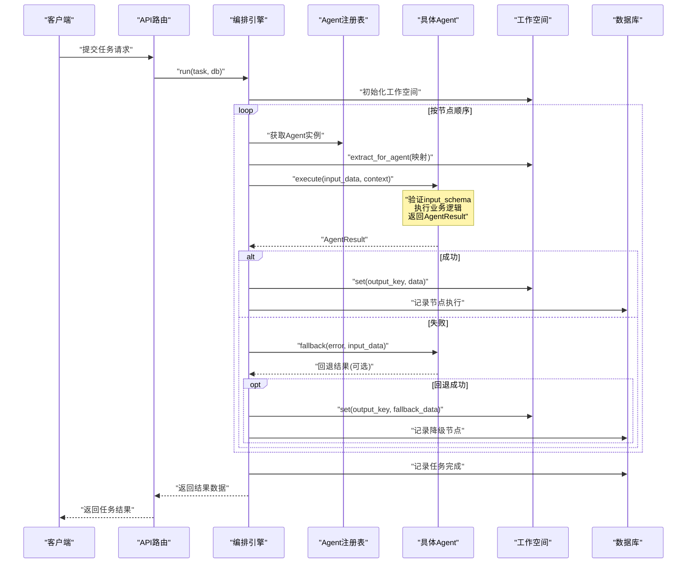
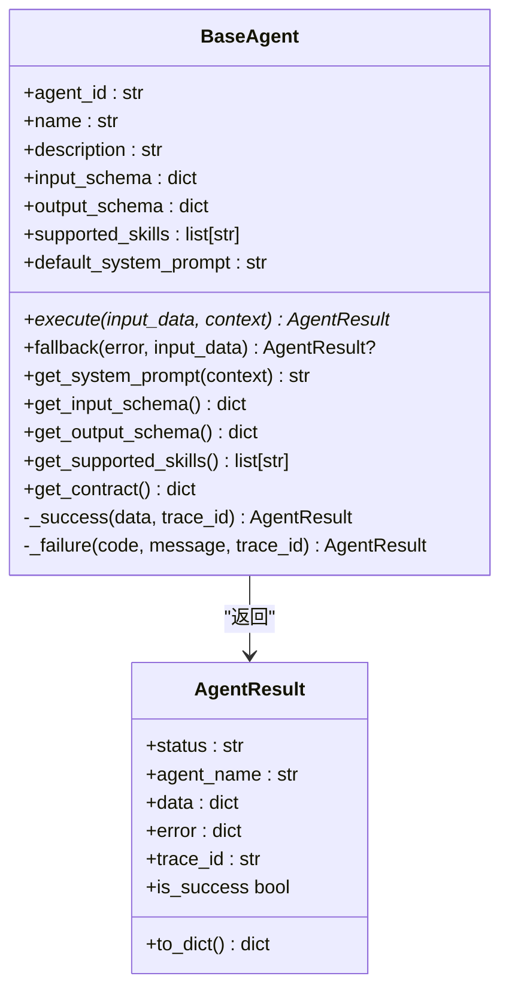
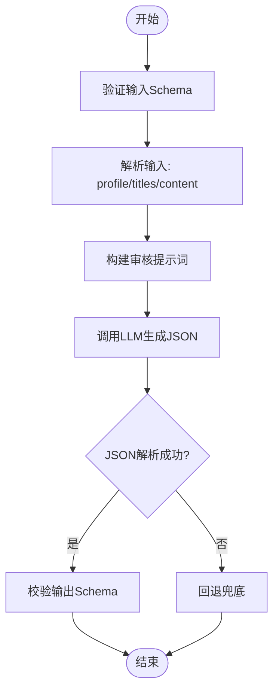
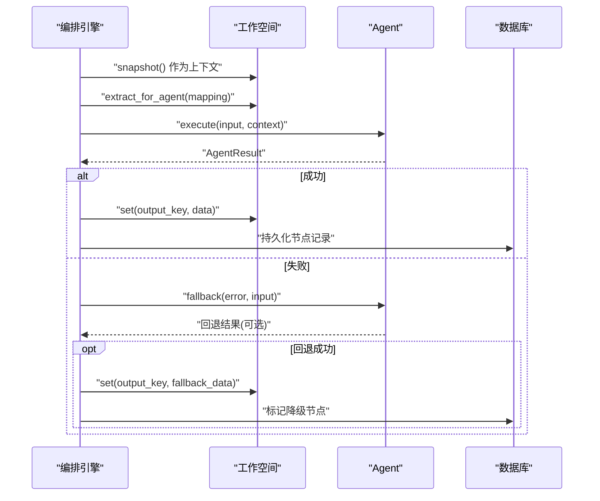
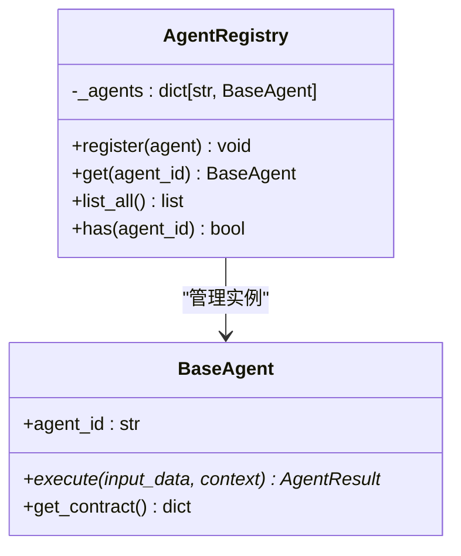
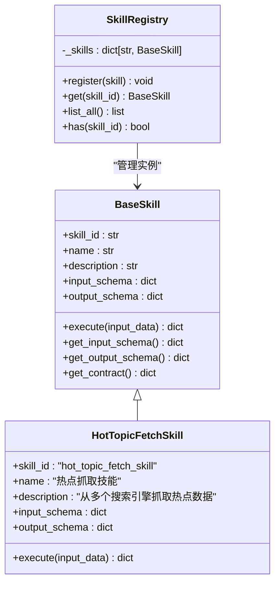
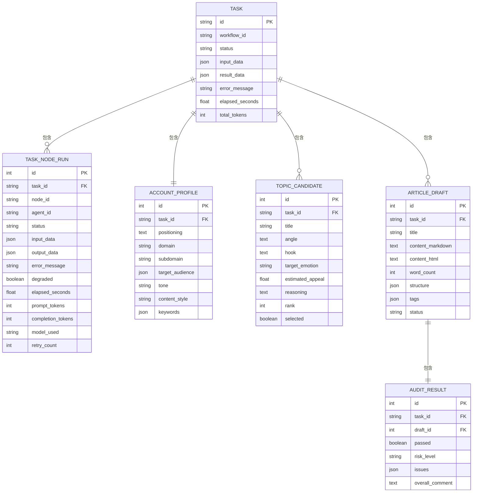
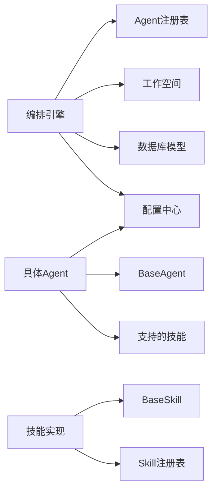

# Agent智能体系统

<cite>
**本文档引用的文件**
- [backend/app/agents/base.py](file://backend/app/agents/base.py)
- [backend/app/agents/profile_agent.py](file://backend/app/agents/profile_agent.py)
- [backend/app/agents/audit_agent.py](file://backend/app/agents/audit_agent.py)
- [backend/app/agents/registry.py](file://backend/app/agents/registry.py)
- [backend/app/orchestrator/engine.py](file://backend/app/orchestrator/engine.py)
- [backend/app/orchestrator/workspace.py](file://backend/app/orchestrator/workspace.py)
- [backend/app/skills/base.py](file://backend/app/skills/base.py)
- [backend/app/skills/registry.py](file://backend/app/skills/registry.py)
- [backend/app/skills/hot_topic_fetch_skill.py](file://backend/app/skills/hot_topic_fetch_skill.py)
- [backend/app/models/tables.py](file://backend/app/models/tables.py)
- [backend/app/core/config.py](file://backend/app/core/config.py)
- [backend/app/api/agent_routes.py](file://backend/app/api/agent_routes.py)
- [backend/app/main.py](file://backend/app/main.py)
- [backend/tests/test_agent_contract.py](file://backend/tests/test_agent_contract.py)
</cite>

## 目录
1. [简介](#简介)
2. [项目结构](#项目结构)
3. [核心组件](#核心组件)
4. [架构总览](#架构总览)
5. [详细组件分析](#详细组件分析)
6. [依赖关系分析](#依赖关系分析)
7. [性能考虑](#性能考虑)
8. [故障排查指南](#故障排查指南)
9. [结论](#结论)
10. [附录](#附录)

## 简介
本文件面向Agent智能体系统，系统采用"多智能体编排"架构，围绕BaseAgent基类设计统一的抽象接口与生命周期管理。**最新版本实现了完整的Agent Contract系统**，通过input_schema、output_schema和supported_skills三个核心合约属性，建立了标准化的接口规范和自动化验证能力。系统通过工作空间（Workspace）实现节点间数据共享，由编排引擎（OrchestratorEngine）按固定流程顺序调度六大核心Agent完成从账号定位到内容审核的完整内容生产链路。系统同时提供技能（Skill）能力模块、注册表（Registry）、配置中心与数据库持久化，支持运行时配置更新与可观测性追踪。

## 项目结构
后端采用FastAPI应用入口，核心模块分布如下：
- agents：智能体基类与具体实现（账号解析、热点分析、选题策划、标题生成、内容写作、审核评估）
- orchestrator：编排引擎与工作空间
- skills：技能基类与注册表
- models：SQLAlchemy ORM模型（任务、节点执行记录、账号画像、话题候选、文章草稿、审核结果、系统配置等）
- core：配置、日志、追踪工具
- api：REST API路由（任务、流式事件、智能体配置、技能、LLM提供商、系统配置）
- main：应用入口、中间件、异常处理、启动/关闭生命周期

```mermaid
graph TB
subgraph "应用入口"
MAIN["main.py<br/>应用启动/中间件/异常处理"]
end
subgraph "编排层"
ORCH["orchestrator/engine.py<br/>编排引擎"]
WS["orchestrator/workspace.py<br/>工作空间"]
end
subgraph "智能体层"
BASE["agents/base.py<br/>BaseAgent/AgentResult<br/>Agent Contract"]
REG["agents/registry.py<br/>AgentRegistry"]
PRA["agents/profile_agent.py<br/>账号解析<br/>Contract: input/output/skills"]
AUD["agents/audit_agent.py<br/>审核评估<br/>Contract: input/output/skills"]
HTA["agents/hot_topic_agent.py<br/>热点分析<br/>Contract: input/output/skills"]
TPA["agents/topic_planner_agent.py<br/>选题策划<br/>Contract: input/output/skills"]
TGA["agents/title_generator_agent.py<br/>标题生成<br/>Contract: input/output/skills"]
CWA["agents/content_writer_agent.py<br/>内容写作<br/>Contract: input/output/skills"]
END
subgraph "技能层"
SKBASE["skills/base.py<br/>BaseSkill/SkillResult<br/>Skill Contract"]
SKREG["skills/registry.py<br/>SkillRegistry"]
HTFS["skills/hot_topic_fetch_skill.py<br/>热点抓取技能<br/>Contract: input/output"]
END
subgraph "数据与配置"
MODELS["models/tables.py<br/>ORM模型"]
CFG["core/config.py<br/>配置中心"]
end
subgraph "API层"
AGENTAPI["api/agent_routes.py<br/>智能体配置API"]
end
MAIN --> ORCH
ORCH --> WS
ORCH --> REG
REG --> PRA
REG --> AUD
REG --> HTA
REG --> TPA
REG --> TGA
REG --> CWA
ORCH --> SKREG
SKREG --> HTFS
ORCH --> MODELS
ORCH --> CFG
MAIN --> AGENTAPI
MAIN --> MODELS
```

**图表来源**
- [backend/app/main.py:1-153](file://backend/app/main.py#L1-L153)
- [backend/app/orchestrator/engine.py:1-285](file://backend/app/orchestrator/engine.py#L1-L285)
- [backend/app/orchestrator/workspace.py:1-53](file://backend/app/orchestrator/workspace.py#L1-L53)
- [backend/app/agents/base.py:1-215](file://backend/app/agents/base.py#L1-L215)
- [backend/app/agents/registry.py:1-40](file://backend/app/agents/registry.py#L1-L40)
- [backend/app/agents/profile_agent.py:1-152](file://backend/app/agents/profile_agent.py#L1-L152)
- [backend/app/agents/audit_agent.py:1-189](file://backend/app/agents/audit_agent.py#L1-L189)
- [backend/app/skills/base.py:1-142](file://backend/app/skills/base.py#L1-L142)
- [backend/app/skills/registry.py:1-37](file://backend/app/skills/registry.py#L1-L37)
- [backend/app/skills/hot_topic_fetch_skill.py:1-338](file://backend/app/skills/hot_topic_fetch_skill.py#L1-L338)
- [backend/app/models/tables.py:1-319](file://backend/app/models/tables.py#L1-L319)
- [backend/app/core/config.py:1-99](file://backend/app/core/config.py#L1-L99)
- [backend/app/api/agent_routes.py:1-115](file://backend/app/api/agent_routes.py#L1-L115)

**章节来源**
- [backend/app/main.py:1-153](file://backend/app/main.py#L1-L153)
- [backend/app/orchestrator/engine.py:1-285](file://backend/app/orchestrator/engine.py#L1-L285)
- [backend/app/models/tables.py:1-319](file://backend/app/models/tables.py#L1-L319)

## 核心组件
- **BaseAgent与AgentResult**：定义统一的异步执行接口、标准化返回结构、成功/失败封装与回退策略钩子，**新增Agent Contract系统**，强制所有Agent定义input_schema、output_schema和supported_skills属性，确保接口标准化和自动化验证。
- **AgentRegistry**：集中注册与检索Agent实例，支持查询、遍历与存在性检查。
- **OrchestratorEngine**：线性编排六大Agent节点，管理任务生命周期、节点执行记录、超时控制、错误传播与降级回退。
- **Workspace**：任务级上下文容器，提供键值存取、快照与按映射提取输入的能力。
- **Skills**：工具型能力封装，与Agent解耦，通过注册表统一管理，**实现完整的Skill Contract系统**。
- **数据模型**：以ORM形式承载任务、节点执行、账号画像、话题候选、文章草稿、审核结果与系统配置等。
- **配置中心**：从环境变量与运行时配置加载LLM参数、超时与应用参数。
- **API路由**：提供智能体配置查询与更新接口，支持运行时调整系统提示词与重试策略。

**章节来源**
- [backend/app/agents/base.py:14-215](file://backend/app/agents/base.py#L14-L215)
- [backend/app/agents/registry.py:10-40](file://backend/app/agents/registry.py#L10-L40)
- [backend/app/orchestrator/engine.py:89-285](file://backend/app/orchestrator/engine.py#L89-L285)
- [backend/app/orchestrator/workspace.py:12-53](file://backend/app/orchestrator/workspace.py#L12-L53)
- [backend/app/skills/base.py:9-142](file://backend/app/skills/base.py#L9-L142)
- [backend/app/skills/registry.py:10-37](file://backend/app/skills/registry.py#L10-L37)
- [backend/app/models/tables.py:23-319](file://backend/app/models/tables.py#L23-L319)
- [backend/app/core/config.py:52-99](file://backend/app/core/config.py#L52-L99)
- [backend/app/api/agent_routes.py:17-115](file://backend/app/api/agent_routes.py#L17-L115)

## 架构总览
系统采用"编排驱动"的流水线式架构：应用启动时注册所有Agent；编排引擎按预设节点顺序依次调度；每个节点从工作空间提取输入，调用Agent执行，将输出写回工作空间；节点执行记录持久化，支持SSE事件广播；最终任务结果作为工作空间快照返回。**新增的Agent Contract系统确保了接口的标准化和自动化验证**。



**图表来源**
- [backend/app/orchestrator/engine.py:92-234](file://backend/app/orchestrator/engine.py#L92-L234)
- [backend/app/orchestrator/workspace.py:36-53](file://backend/app/orchestrator/workspace.py#L36-L53)
- [backend/app/agents/registry.py:23-28](file://backend/app/agents/registry.py#L23-L28)
- [backend/app/models/tables.py:23-74](file://backend/app/models/tables.py#L23-L74)

## 详细组件分析

### BaseAgent基类与生命周期
- **Agent Contract要求**：
  - agent_id：唯一标识（如 "profile_agent"）
  - name：中文显示名称
  - description：职能描述
  - **input_schema**：输入 JSON Schema 描述（dict）
  - **output_schema**：输出 JSON Schema 描述（dict）
  - **supported_skills**：该 Agent 支持调用的 Skill ID 列表
  - execute()：核心执行逻辑
  - 可选：fallback()：降级策略（默认返回 None，即不降级）

- **生命周期管理**：
  - 执行前：编排引擎注入系统提示词（优先DB自定义，否则使用Agent默认），合并工作空间快照作为上下文。
  - 执行中：带超时控制，超时或异常被捕获并转换为节点失败。
  - 执行后：成功写入工作空间；失败触发回退；必要时抛出错误中断流程。
- **通用功能**：
  - 标准化返回：AgentResult封装状态、代理标识、数据、错误与追踪ID。
  - 成功/失败便捷构造器：_success/_failure统一错误码与消息格式。
  - 回退钩子：fallback(error, input_data)可选实现，用于降级恢复。
  - **合约访问方法**：get_input_schema()、get_output_schema()、get_supported_skills()、get_contract()



**图表来源**
- [backend/app/agents/base.py:72-215](file://backend/app/agents/base.py#L72-L215)

**章节来源**
- [backend/app/agents/base.py:72-215](file://backend/app/agents/base.py#L72-L215)

### 六大核心Agent职责与实现要点
- **账号解析（ProfileAgent）**
  - 职责：将用户输入的账号定位描述解析为结构化画像（领域、子域、受众、调性、风格、关键词等）。
  - **Agent Contract**：input_schema定义positioning和account_context字段，output_schema定义结构化画像字段，supported_skills为空数组。
  - 实现：构造系统提示词与用户提示词，调用LLM生成JSON，解析并校验，失败时回退到默认结构。
  - 关键点：针对特定供应商（如dashscope）拼接模型前缀，处理LLM返回的markdown代码块包裹的JSON。

- **热点分析（HotTopicAgent）**
  - 职责：从多个搜索引擎并发抓取热点，结合账号画像进行相关性分析，输出结构化的热点话题列表。
  - **Agent Contract**：input_schema定义profile、account_context和history_summary字段，output_schema定义hot_topics数组，supported_skills包含"hot_topic_fetch_skill"。
  - 实现：调用hot_topic_fetch_skill获取原始候选，使用LLM分析筛选并生成结构化数据。
  - 关键点：支持技能调用，具备复杂的降级策略。

- **选题策划（TopicPlannerAgent）**
  - 职责：从候选热点形成选题方案。
  - **Agent Contract**：input_schema定义profile、hot_topics和可选上下文字段，output_schema定义topics数组，supported_skills为空数组。
  - 实现：综合账号画像和热点列表，策划有传播潜力的选题方案。
  - 关键点：具备降级策略，直接使用热点标题作为备选。

- **标题生成（TitleGeneratorAgent）**
  - 职责：为选题生成多个候选标题并评分。
  - **Agent Contract**：input_schema定义profile和topics字段，output_schema定义selected_topic和titles数组，supported_skills为空数组。
  - 实现：根据选题和账号调性生成风格各异的候选标题。
  - 关键点：具备降级策略，直接使用选题标题。

- **内容写作（ContentWriterAgent）**
  - 职责：根据选题、标题和热点素材生成完整公众号文章。
  - **Agent Contract**：input_schema定义profile、topics、titles和hot_topics字段，output_schema定义content_markdown、word_count、structure和tags，supported_skills为空数组。
  - 实现：综合所有输入生成完整的文章内容。
  - 关键点：具备降级策略，返回默认文章框架。

- **审核评估（AuditAgent）**
  - 职责：对标题与正文进行合规性审核与质量评估，输出通过与否、风险等级与问题清单。
  - **Agent Contract**：input_schema定义titles、content和profile字段，output_schema定义passed、risk_level、issues和overall_comment，supported_skills为空数组。
  - 实现：组合账号画像与内容摘要构建用户提示词，限制内容长度避免token溢出，解析JSON并回退兜底。
  - 关键点：严格遵循输出schema约束，高风险问题直接导致不通过。



**图表来源**
- [backend/app/agents/audit_agent.py:101-189](file://backend/app/agents/audit_agent.py#L101-L189)

**章节来源**
- [backend/app/agents/profile_agent.py:16-152](file://backend/app/agents/profile_agent.py#L16-L152)
- [backend/app/agents/hot_topic_agent.py:24-290](file://backend/app/agents/hot_topic_agent.py#L24-L290)
- [backend/app/agents/topic_planner_agent.py:16-202](file://backend/app/agents/topic_planner_agent.py#L16-L202)
- [backend/app/agents/title_generator_agent.py:16-181](file://backend/app/agents/title_generator_agent.py#L16-L181)
- [backend/app/agents/content_writer_agent.py:16-200](file://backend/app/agents/content_writer_agent.py#L16-L200)
- [backend/app/agents/audit_agent.py:16-189](file://backend/app/agents/audit_agent.py#L16-L189)

### 编排引擎与工作空间
- **编排策略**：
  - 固定线性节点序列：账号解析 → 热点分析 → 选题策划 → 标题生成 → 正文生成 → 审核评估。
  - 输入映射：每个节点定义input_mapping，将工作空间键映射到Agent输入字段。
  - 输出写回：节点成功后将data写入工作空间指定key。
  - 超时与错误：统一超时控制，失败时尝试回退；必填节点失败直接中断并记录错误。
- **工作空间**：
  - 提供get/set/snapshot/extract_for_agent等方法，支持从原始输入与历史输出中抽取Agent所需数据。
  - 支持简单顶层键映射，便于MVP阶段快速迭代。



**图表来源**
- [backend/app/orchestrator/engine.py:107-234](file://backend/app/orchestrator/engine.py#L107-L234)
- [backend/app/orchestrator/workspace.py:19-53](file://backend/app/orchestrator/workspace.py#L19-L53)

**章节来源**
- [backend/app/orchestrator/engine.py:31-86](file://backend/app/orchestrator/engine.py#L31-L86)
- [backend/app/orchestrator/engine.py:92-234](file://backend/app/orchestrator/engine.py#L92-L234)
- [backend/app/orchestrator/workspace.py:12-53](file://backend/app/orchestrator/workspace.py#L12-L53)

### 注册机制与动态加载
- **Agent注册**：
  - 应用启动时导入各Agent实现并在main中集中注册到AgentRegistry。
  - Registry提供register/get/list_all/has等操作，支持重复注册告警与缺失异常。
- **动态加载**：
  - 当前通过显式导入实现静态注册；后续可扩展为从配置或插件目录动态发现与实例化。
- **依赖注入与配置**：
  - 编排引擎通过Registry按agent_id获取实例；系统提示词优先从数据库自定义模板加载，否则使用Agent默认模板。



**图表来源**
- [backend/app/agents/registry.py:10-40](file://backend/app/agents/registry.py#L10-L40)
- [backend/app/agents/base.py:72-142](file://backend/app/agents/base.py#L72-L142)

**章节来源**
- [backend/app/agents/registry.py:10-40](file://backend/app/agents/registry.py#L10-L40)
- [backend/app/main.py:34-42](file://backend/app/main.py#L34-L42)

### 技能系统与合约化设计
- **技能基类（BaseSkill）**：
  - 定义技能的抽象基类，包含input_schema和output_schema两个核心合约属性。
  - 提供标准化的SkillResult结构，确保技能执行结果的一致性。
  - 支持get_input_schema()、get_output_schema()、get_contract()等访问方法。
- **技能注册表（SkillRegistry）**：
  - 提供技能的集中注册与检索功能。
  - 支持has()、get()、list_all()等操作，实现技能的动态发现与调用。
- **热点抓取技能（HotTopicFetchSkill）**：
  - 实现从多个搜索引擎并发抓取热点数据的工具能力。
  - 完整的Agent Contract：定义keywords、engines、max_results_per_engine输入字段，返回results、total_count、engines_used输出结构。
  - 支持并发抓取、HTML解析、去重等复杂逻辑。



**图表来源**
- [backend/app/skills/base.py:78-142](file://backend/app/skills/base.py#L78-L142)
- [backend/app/skills/hot_topic_fetch_skill.py:51-338](file://backend/app/skills/hot_topic_fetch_skill.py#L51-L338)
- [backend/app/skills/registry.py:10-37](file://backend/app/skills/registry.py#L10-L37)

**章节来源**
- [backend/app/skills/base.py:78-142](file://backend/app/skills/base.py#L78-L142)
- [backend/app/skills/registry.py:10-37](file://backend/app/skills/registry.py#L10-L37)
- [backend/app/skills/hot_topic_fetch_skill.py:51-338](file://backend/app/skills/hot_topic_fetch_skill.py#L51-L338)

### 数据模型与持久化
- **任务与节点执行**：
  - TaskModel：任务生命周期、输入输出、耗时与总token统计。
  - TaskNodeRunModel：节点级执行记录，含输入/输出、错误、耗时、token、模型与重试次数。
- **结果实体**：
  - AccountProfileModel：账号画像持久化。
  - TopicCandidateModel：候选话题持久化。
  - ArticleDraftModel：文章草稿持久化。
  - AuditResultModel：审核结果持久化。
- **系统配置**：
  - AgentModel/SkillModel：智能体/技能元数据与运行时配置。
  - SystemConfigModel：系统配置键值表。
  - LLMProviderModel：LLM提供商配置（密钥、URL、模型、超时等）。



**图表来源**
- [backend/app/models/tables.py:23-158](file://backend/app/models/tables.py#L23-L158)

**章节来源**
- [backend/app/models/tables.py:23-319](file://backend/app/models/tables.py#L23-L319)

### API与配置管理
- **智能体配置API**：
  - 列出已注册Agent并查询其DB自定义提示词是否存在。
  - 获取单个Agent详情，返回有效提示词（优先DB自定义）。
  - 更新Agent配置（模型参数、提示词模板、重试策略），空字符串表示重置为默认。
- **配置中心**：
  - 从环境变量加载LLM提供商配置，自动填充API Key、Base URL与默认模型。
  - 统一超时参数（Agent、Skill、LLM）。

**章节来源**
- [backend/app/api/agent_routes.py:17-115](file://backend/app/api/agent_routes.py#L17-L115)
- [backend/app/core/config.py:21-99](file://backend/app/core/config.py#L21-L99)

## 依赖关系分析
- **组件耦合**：
  - 编排引擎强依赖AgentRegistry与Workspace；弱依赖数据库模型用于持久化与提示词解析。
  - Agent实现仅依赖BaseAgent与配置中心，保持与编排层解耦。
  - **技能层与智能体层相互独立，通过supported_skills声明进行松耦合集成**。
- **外部依赖**：
  - LLM调用通过统一SDK封装，当前示例对接特定供应商。
  - 数据库使用SQLAlchemy ORM，支持异步会话。
- **循环依赖**：
  - 未见循环导入；注册在应用启动阶段集中完成。



**图表来源**
- [backend/app/orchestrator/engine.py:18-26](file://backend/app/orchestrator/engine.py#L18-L26)
- [backend/app/agents/base.py:72-104](file://backend/app/agents/base.py#L72-L104)
- [backend/app/skills/base.py:78-108](file://backend/app/skills/base.py#L78-L108)

**章节来源**
- [backend/app/orchestrator/engine.py:18-26](file://backend/app/orchestrator/engine.py#L18-L26)
- [backend/app/agents/base.py:72-104](file://backend/app/agents/base.py#L72-L104)
- [backend/app/skills/base.py:78-108](file://backend/app/skills/base.py#L78-L108)

## 性能考虑
- **超时控制**：编排引擎对Agent执行设置统一超时，避免阻塞；LLM调用同样设置超时，防止长尾请求。
- **Token统计**：节点执行记录累计prompt与completion token，便于成本与性能分析。
- **内容截断**：审核Agent对正文内容进行长度限制，避免超出token上限。
- **并发与资源**：当前为线性编排；若扩展为并行，需引入队列与资源配额控制。
- **日志与追踪**：全局Trace ID中间件贯穿请求生命周期，结合数据库日志模型实现端到端追踪。
- **合约验证开销**：**新增的Agent Contract验证增加了启动时的Schema验证开销，但提高了运行时的可靠性**。

## 故障排查指南
- **常见错误类型**：
  - Agent执行错误：编排引擎捕获异常并记录节点失败；必填节点失败会中断任务。
  - **Schema验证失败**：新版本中如果输入或输出不符合Agent Contract定义，会直接导致执行失败。
  - LLM解析失败：JSON解析异常会被捕获并转为失败结果；建议检查提示词与输出格式。
  - 超时：Agent执行超时会记录错误并中断；可适当提高超时阈值或优化Agent内部逻辑。
  - 回退策略：部分Agent提供回退实现，可在服务异常时返回兜底结构，降低整体失败率。
- **排查步骤**：
  - 查看任务与节点执行记录，确认失败节点与错误信息。
  - 检查系统提示词来源（默认模板 vs DB自定义）。
  - **验证Agent Contract：检查input_schema和output_schema是否正确配置**。
  - **验证技能依赖：确认Agent声明的supported_skills是否正确注册**。
  - 核对LLM提供商配置与API Key有效性。
  - 启用调试模式查看详细堆栈信息。

**章节来源**
- [backend/app/orchestrator/engine.py:176-196](file://backend/app/orchestrator/engine.py#L176-L196)
- [backend/app/agents/profile_agent.py:94-152](file://backend/app/agents/profile_agent.py#L94-L152)
- [backend/app/agents/audit_agent.py:101-189](file://backend/app/agents/audit_agent.py#L101-L189)
- [backend/tests/test_agent_contract.py:29-75](file://backend/tests/test_agent_contract.py#L29-L75)

## 结论
本系统以BaseAgent为核心，通过编排引擎实现稳定的线性工作流，配合工作空间实现节点间数据共享与上下文传递。**最新版本引入的Agent Contract系统显著提升了系统的标准化程度和自动化验证能力**，通过input_schema、output_schema和supported_skills三个核心属性，建立了完整的接口规范。注册表与配置中心提供了良好的扩展性与运行时可调性。建议后续增强：
- 引入动态加载与插件化机制；
- 支持并行编排与任务图；
- 完善技能体系与跨Agent协作协议；
- 加强可观测性与告警机制；
- **完善合约验证与错误报告机制**。

## 附录
- **Agent间通信协议**：
  - 输入/输出均为结构化JSON，**严格遵循各Agent定义的JSON Schema**。
  - 上下文通过工作空间快照传递，包含历史节点输出。
  - **新增的Agent Contract确保了接口的标准化和可预测性**。
- **错误处理策略**：
  - 统一的AgentResult封装错误码与消息；
  - 必填节点失败直接中断，非必填节点尝试回退；
  - 超时与异常均记录节点执行记录并广播事件。
  - **新增的Schema验证失败会直接导致执行失败，便于早期发现问题**。
- **扩展开发指南**：
  - 新增Agent：继承BaseAgent，实现execute与可选fallback，**必须定义完整的Agent Contract（input_schema、output_schema、supported_skills）**。
  - 新增技能：继承BaseSkill，实现execute，**必须定义完整的Skill Contract（input_schema、output_schema）**。
  - 配置管理：通过Agent配置API更新提示词与重试策略，或在DB中维护AgentModel条目。
  - **合约验证**：新增Agent或技能后，通过test_agent_contract.py中的测试确保合约的正确性。

**章节来源**
- [backend/tests/test_agent_contract.py:1-337](file://backend/tests/test_agent_contract.py#L1-L337)
- [backend/app/agents/base.py:14-215](file://backend/app/agents/base.py#L14-L215)
- [backend/app/skills/base.py:9-142](file://backend/app/skills/base.py#L9-L142)