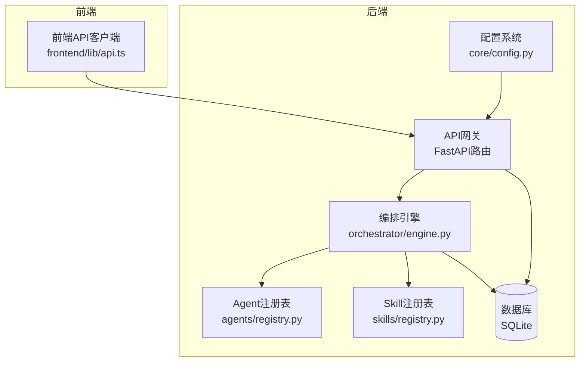
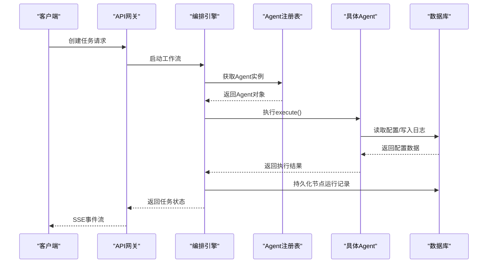
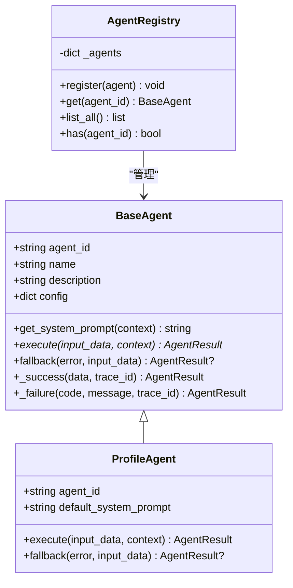
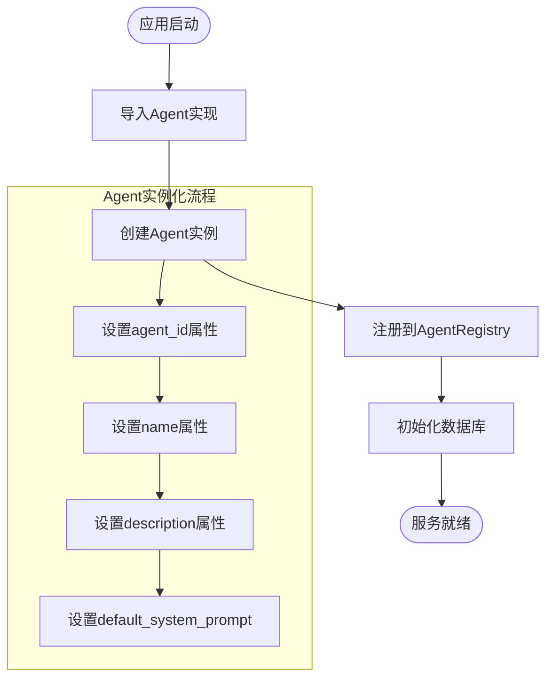
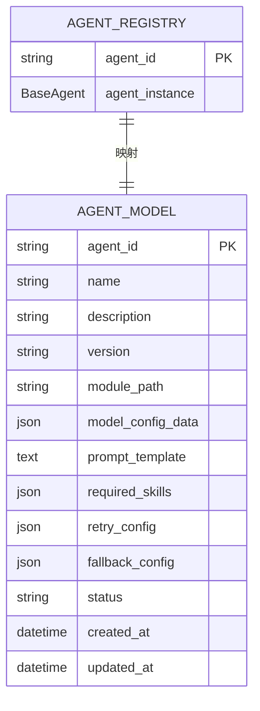
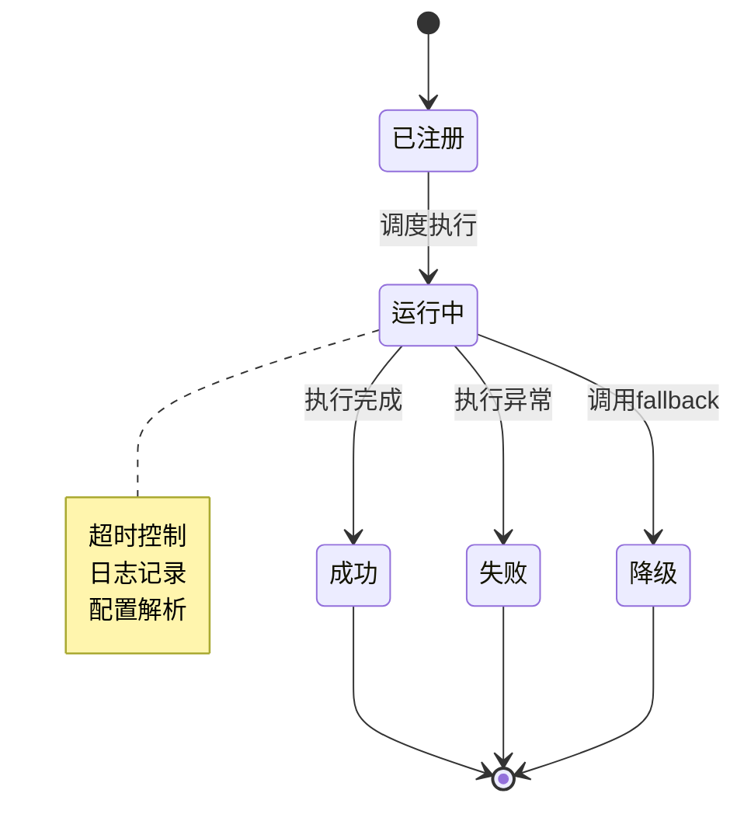
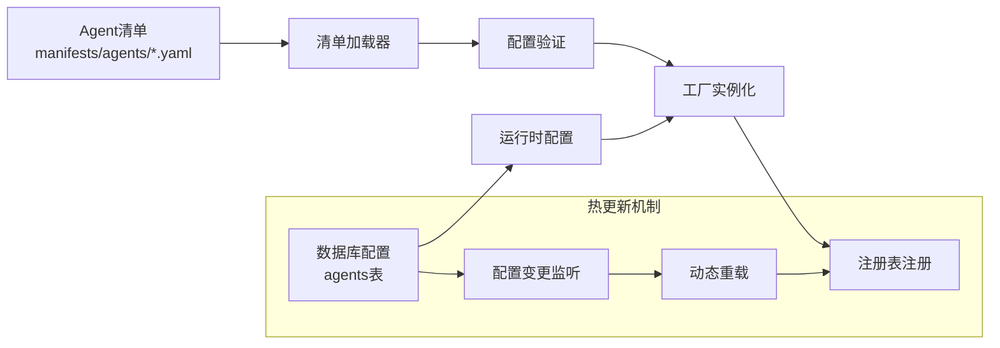
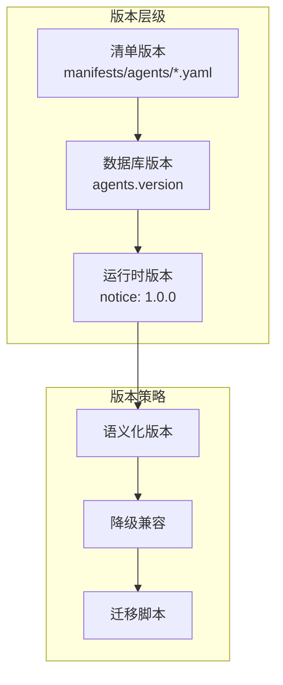
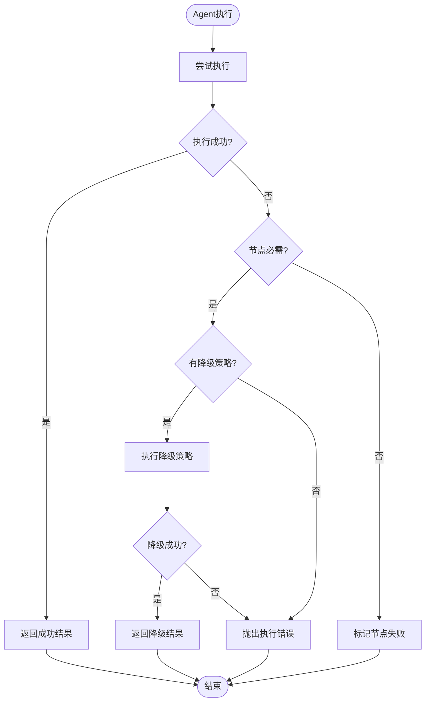
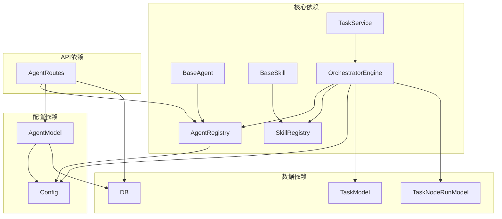

# Agent注册与管理系统

<cite>
**本文档引用的文件**
- [backend/app/agents/registry.py](file://backend/app/agents/registry.py)
- [backend/app/agents/base.py](file://backend/app/agents/base.py)
- [backend/app/agents/profile_agent.py](file://backend/app/agents/profile_agent.py)
- [backend/app/skills/registry.py](file://backend/app/skills/registry.py)
- [backend/app/skills/base.py](file://backend/app/skills/base.py)
- [backend/app/api/agent_routes.py](file://backend/app/api/agent_routes.py)
- [backend/app/models/tables.py](file://backend/app/models/tables.py)
- [backend/app/schemas/agent.py](file://backend/app/schemas/agent.py)
- [backend/app/core/exceptions.py](file://backend/app/core/exceptions.py)
- [backend/app/orchestrator/engine.py](file://backend/app/orchestrator/engine.py)
- [backend/app/main.py](file://backend/app/main.py)
- [backend/app/core/config.py](file://backend/app/core/config.py)
- [backend/app/services/task_service.py](file://backend/app/services/task_service.py)
- [frontend/lib/api.ts](file://frontend/lib/api.ts)
- [ARCHITECTURE.md](file://ARCHITECTURE.md)
</cite>

## 目录
1. [简介](#简介)
2. [项目结构](#项目结构)
3. [核心组件](#核心组件)
4. [架构总览](#架构总览)
5. [详细组件分析](#详细组件分析)
6. [依赖关系分析](#依赖关系分析)
7. [性能考虑](#性能考虑)
8. [故障排除指南](#故障排除指南)
9. [结论](#结论)
10. [附录](#附录)

## 简介
本系统是一个基于多智能体协作的内容生产平台，围绕Agent注册与管理构建了完整的基础设施。系统采用声明式注册、工厂模式与依赖注入相结合的方式，实现了Agent的动态加载与生命周期管理。核心特性包括：
- 工厂模式实现的Agent注册机制
- 基于注册表的集中管理与查找
- 配置驱动的声明式注册与热更新支持
- 版本管理与降级策略
- 完整的错误处理与监控机制

## 项目结构
后端采用模块化分层架构，主要目录与职责如下：
- app/agents：Agent基类与具体实现，以及注册中心
- app/skills：Skill基类与注册中心
- app/orchestrator：工作流编排引擎
- app/api：FastAPI路由层
- app/models：SQLAlchemy数据模型
- app/services：业务服务层
- app/core：核心工具（日志、异常、追踪）
- frontend：React前端应用

**图表来源**
- [backend/app/main.py:69-153](file://backend/app/main.py#L69-L153)
- [backend/app/orchestrator/engine.py:89-285](file://backend/app/orchestrator/engine.py#L89-L285)
- [backend/app/agents/registry.py:10-40](file://backend/app/agents/registry.py#L10-L40)
- [backend/app/skills/registry.py:10-37](file://backend/app/skills/registry.py#L10-L37)

**章节来源**
- [backend/app/main.py:1-153](file://backend/app/main.py#L1-L153)
- [ARCHITECTURE.md:414-448](file://ARCHITECTURE.md#L414-L448)

## 核心组件
系统的核心组件围绕Agent注册与管理工作流展开，主要包括：

### Agent注册表
- 单例模式实现，集中管理所有已注册的Agent实例
- 提供注册、查找、列表、存在性检查等基础操作
- 采用字典结构存储，键为agent_id，值为BaseAgent实例

### Agent基类
- 定义Agent的标准接口与生命周期方法
- 提供统一的结果封装AgentResult
- 支持降级策略fallback()方法
- 标准化的execute()异步执行接口

### 工作流编排引擎
- 负责加载工作流、调度Agent、管理上下文
- 实现节点级别的超时控制与错误处理
- 支持降级执行与任务级追踪

**章节来源**
- [backend/app/agents/registry.py:10-40](file://backend/app/agents/registry.py#L10-L40)
- [backend/app/agents/base.py:49-99](file://backend/app/agents/base.py#L49-L99)
- [backend/app/orchestrator/engine.py:89-285](file://backend/app/orchestrator/engine.py#L89-L285)

## 架构总览
系统采用"控制平面/执行平面分离"的设计理念，通过编排引擎统一调度各个Agent。

**图表来源**
- [backend/app/orchestrator/engine.py:137-197](file://backend/app/orchestrator/engine.py#L137-L197)
- [backend/app/api/agent_routes.py:17-44](file://backend/app/api/agent_routes.py#L17-L44)

**章节来源**
- [backend/app/orchestrator/engine.py:92-235](file://backend/app/orchestrator/engine.py#L92-L235)
- [backend/app/api/agent_routes.py:17-115](file://backend/app/api/agent_routes.py#L17-L115)

## 详细组件分析

### Agent注册机制与工厂模式
系统采用工厂模式实现Agent的动态注册与实例化：

**图表来源**
- [backend/app/agents/base.py:49-99](file://backend/app/agents/base.py#L49-L99)
- [backend/app/agents/registry.py:10-40](file://backend/app/agents/registry.py#L10-L40)
- [backend/app/agents/profile_agent.py:12-102](file://backend/app/agents/profile_agent.py#L12-L102)

系统通过在应用启动时调用工厂方法进行批量注册：
- ProfileAgent、HotTopicAgent、TopicPlannerAgent等Agent实例通过工厂方法注册到注册表
- 注册过程确保每个Agent实例只注册一次，避免重复注册

**章节来源**
- [backend/app/agents/registry.py:16-21](file://backend/app/agents/registry.py#L16-L21)
- [backend/app/agents/base.py:57-75](file://backend/app/agents/base.py#L57-L75)
- [backend/app/agents/profile_agent.py:12-42](file://backend/app/agents/profile_agent.py#L12-L42)
- [backend/app/main.py:34-42](file://backend/app/main.py#L34-L42)

### 动态加载策略与依赖注入
系统采用静态导入与注册的组合方式实现动态加载：

**图表来源**
- [backend/app/main.py:22-42](file://backend/app/main.py#L22-L42)
- [backend/app/agents/profile_agent.py:13-15](file://backend/app/agents/profile_agent.py#L13-L15)

依赖注入体现在：
- Agent实例通过构造函数接收配置参数
- 编排引擎通过注册表获取Agent实例，实现松耦合
- 配置系统通过环境变量与数据库配置提供依赖

**章节来源**
- [backend/app/main.py:34-42](file://backend/app/main.py#L34-L42)
- [backend/app/core/config.py:52-99](file://backend/app/core/config.py#L52-L99)

### 注册表数据结构设计
Agent注册表采用字典结构实现高效查找：

**图表来源**
- [backend/app/agents/registry.py:13-14](file://backend/app/agents/registry.py#L13-L14)
- [backend/app/models/tables.py:160-181](file://backend/app/models/tables.py#L160-L181)

注册表支持的操作：
- register()：注册Agent实例，检查重复注册并记录日志
- get()：获取指定Agent，不存在时抛出AgentNotFoundError
- list_all()：返回所有已注册Agent的列表
- has()：检查Agent是否存在

**章节来源**
- [backend/app/agents/registry.py:16-36](file://backend/app/agents/registry.py#L16-L36)
- [backend/app/core/exceptions.py:31-36](file://backend/app/core/exceptions.py#L31-L36)

### Agent实例化流程与生命周期管理
Agent的生命周期管理贯穿整个执行过程：

生命周期关键节点：
- 实例化：通过工厂方法创建Agent实例
- 注册：将实例注册到AgentRegistry
- 调度：编排引擎根据工作流定义调度执行
- 执行：调用Agent.execute()方法
- 结果处理：成功返回或触发降级策略
- 清理：释放资源，记录执行日志

**章节来源**
- [backend/app/orchestrator/engine.py:137-197](file://backend/app/orchestrator/engine.py#L137-L197)
- [backend/app/agents/base.py:77-82](file://backend/app/agents/base.py#L77-L82)

### 配置驱动的声明式注册与热更新
系统支持配置驱动的Agent管理：

**图表来源**
- [backend/app/api/agent_routes.py:74-115](file://backend/app/api/agent_routes.py#L74-L115)
- [backend/app/models/tables.py:160-181](file://backend/app/models/tables.py#L160-L181)

配置更新流程：
- 通过API更新Agent配置（模型参数、提示词模板、重试配置）
- 系统持久化到数据库，支持热更新
- 下次执行时生效新的配置

**章节来源**
- [backend/app/api/agent_routes.py:74-115](file://backend/app/api/agent_routes.py#L74-L115)
- [backend/app/models/tables.py:160-181](file://backend/app/models/tables.py#L160-L181)

### 版本管理机制
系统实现多层级的版本管理：

版本管理特点：
- 清单文件版本控制Agent定义
- 数据库存储Agent配置版本
- 运行时固定版本标识（1.0.0）
- 支持降级兼容与迁移策略

**章节来源**
- [backend/app/models/tables.py:167-167](file://backend/app/models/tables.py#L167-L167)
- [backend/app/api/agent_routes.py:38-38](file://backend/app/api/agent_routes.py#L38-L38)

### 错误处理与降级策略
系统实现多层次的错误处理与降级机制：

**图表来源**
- [backend/app/orchestrator/engine.py:154-171](file://backend/app/orchestrator/engine.py#L154-L171)
- [backend/app/agents/base.py:77-82](file://backend/app/agents/base.py#L77-L82)

错误处理层次：
- Agent级别：Agent.execute()异常捕获
- 节点级别：编排引擎超时与异常处理
- 任务级别：TaskService事务管理与错误回滚
- 系统级别：统一异常转换与HTTP状态码映射

**章节来源**
- [backend/app/orchestrator/engine.py:176-196](file://backend/app/orchestrator/engine.py#L176-L196)
- [backend/app/core/exceptions.py:31-91](file://backend/app/core/exceptions.py#L31-L91)

## 依赖关系分析

**图表来源**
- [backend/app/orchestrator/engine.py:18-26](file://backend/app/orchestrator/engine.py#L18-L26)
- [backend/app/api/agent_routes.py:10-12](file://backend/app/api/agent_routes.py#L10-L12)

依赖关系特点：
- 低耦合：通过注册表实现松耦合依赖
- 可扩展：新增Agent无需修改核心代码
- 可测试：依赖注入便于单元测试
- 可维护：清晰的模块边界与职责划分

**章节来源**
- [backend/app/orchestrator/engine.py:18-26](file://backend/app/orchestrator/engine.py#L18-L26)
- [backend/app/api/agent_routes.py:10-12](file://backend/app/api/agent_routes.py#L10-L12)

## 性能考虑
系统在性能方面采取了多项优化措施：

### 超时控制与并发管理
- Agent执行超时控制：默认120秒，可配置
- LLM调用超时控制：默认60秒，支持不同Provider
- 并发执行：基于asyncio实现异步并发

### 缓存与持久化
- 数据库连接池：SQLAlchemy异步连接
- 配置缓存：运行时配置缓存减少数据库查询
- 日志异步：结构化日志异步写入

### 监控与追踪
- Trace ID：全局请求追踪
- 任务级监控：节点执行时间、Token消耗统计
- SSE事件：实时状态推送

## 故障排除指南

### 常见问题诊断
1. **Agent未找到错误**
   - 检查Agent是否正确注册到AgentRegistry
   - 验证agent_id是否与清单文件一致
   - 确认应用启动时的注册流程

2. **配置更新无效**
   - 检查数据库中的AgentModel记录
   - 验证配置字段是否正确更新
   - 确认下次执行才会生效

3. **执行超时**
   - 检查LLM Provider响应时间
   - 调整agent_timeout配置
   - 优化Agent执行逻辑

### 调试建议
- 启用调试模式查看详细日志
- 使用SSE事件流监控执行状态
- 检查数据库连接状态
- 验证环境变量配置

**章节来源**
- [backend/app/core/exceptions.py:31-91](file://backend/app/core/exceptions.py#L31-L91)
- [backend/app/core/config.py:80-82](file://backend/app/core/config.py#L80-L82)

## 结论
Agent注册与管理系统通过工厂模式、注册表机制与配置驱动实现了高度可扩展的智能体管理架构。系统具备以下优势：
- 灵活的注册机制支持动态扩展
- 完善的生命周期管理确保稳定性
- 多层次的错误处理与降级策略提升可靠性
- 配置驱动的声明式注册便于维护
- 清晰的模块边界支持团队协作开发

该架构为后续的功能扩展与性能优化奠定了坚实基础。

## 附录

### 开发者最佳实践
1. **Agent开发规范**
   - 继承BaseAgent基类，实现execute方法
   - 设置唯一的agent_id与清晰的描述
   - 提供合理的降级策略
   - 使用统一的结果封装AgentResult

2. **配置管理规范**
   - 通过清单文件声明Agent定义
   - 使用数据库存储运行时配置
   - 支持热更新与版本管理
   - 提供完善的Schema验证

3. **测试策略**
   - 单元测试：覆盖Agent核心逻辑
   - 集成测试：验证注册与执行流程
   - 性能测试：评估并发与延迟
   - 回归测试：确保版本升级兼容性

### API参考
系统提供完整的REST API用于Agent管理：
- 获取Agent列表：GET /api/v1/agents
- 获取Agent详情：GET /api/v1/agents/{agent_id}
- 更新Agent配置：PUT /api/v1/agents/{agent_id}/config

**章节来源**
- [frontend/lib/api.ts:73-89](file://frontend/lib/api.ts#L73-L89)
- [backend/app/api/agent_routes.py:17-115](file://backend/app/api/agent_routes.py#L17-L115)