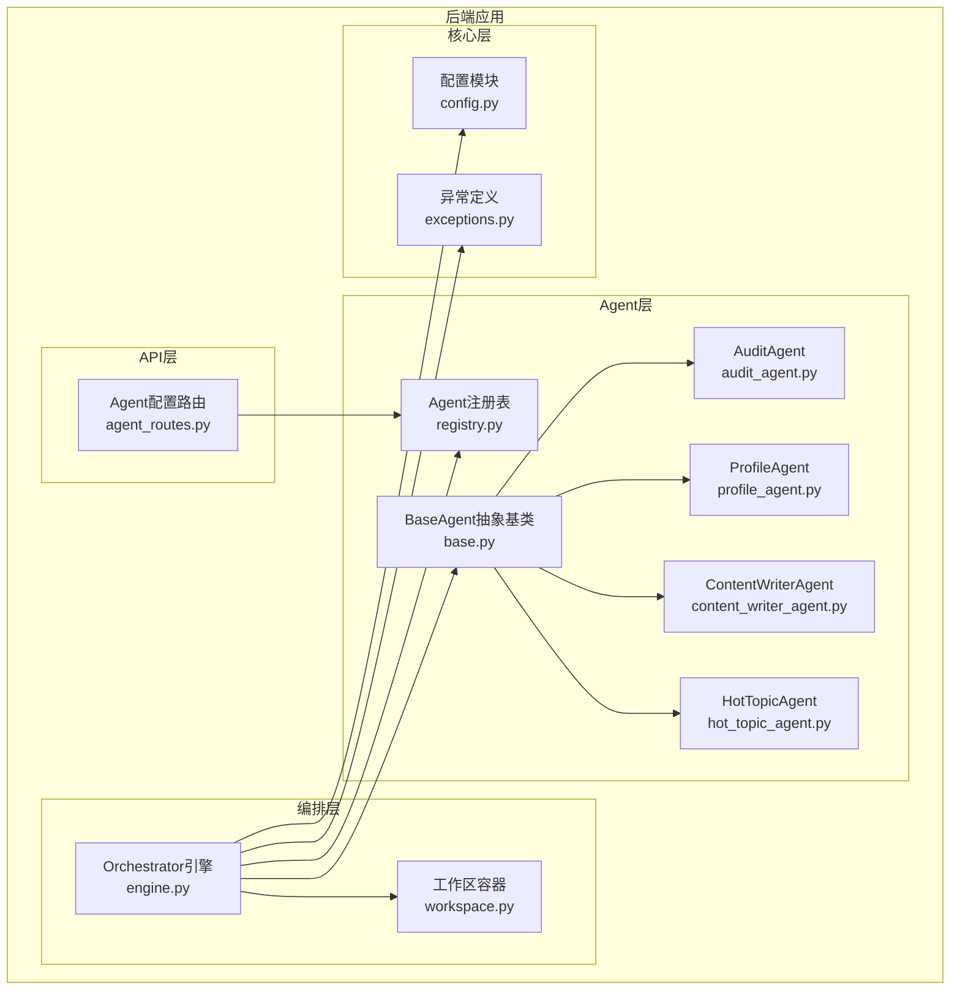
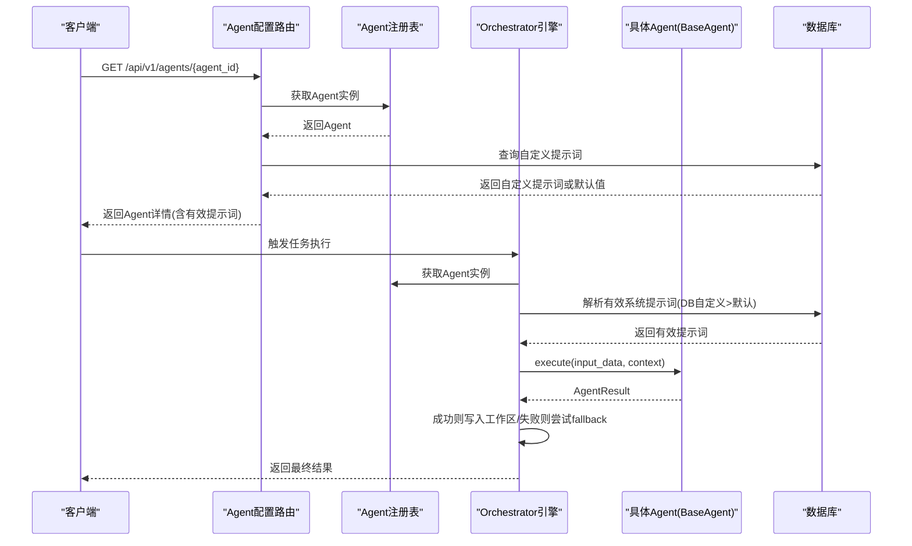
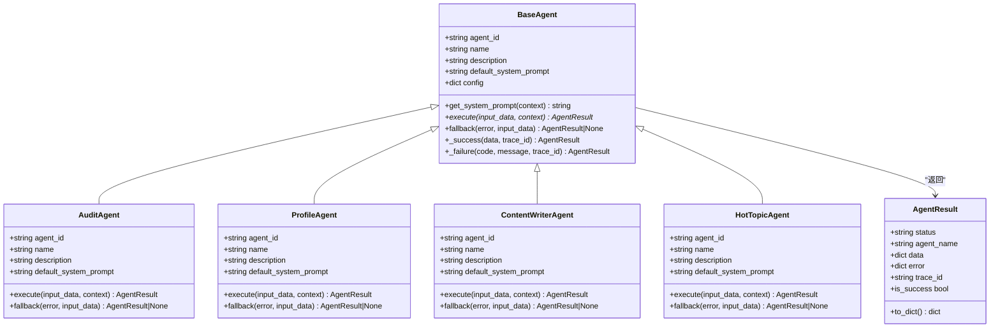
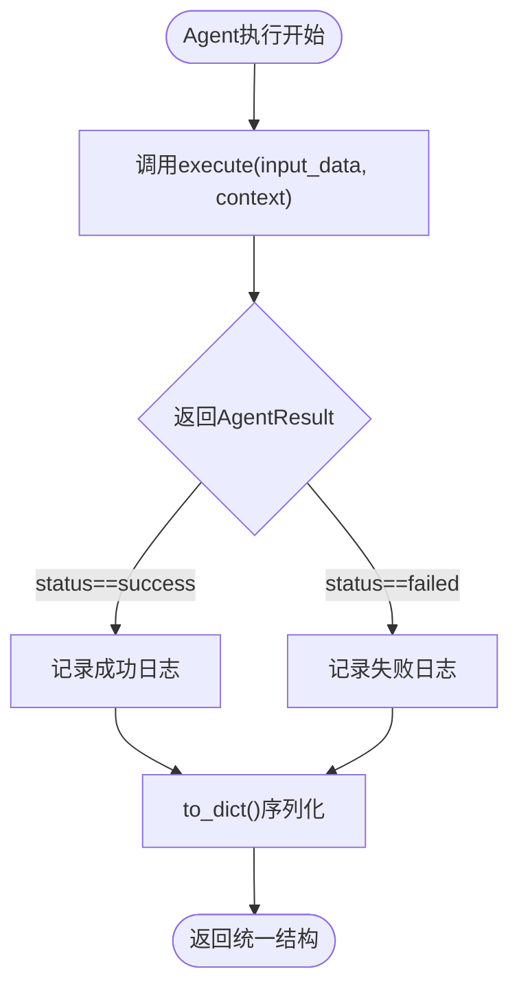
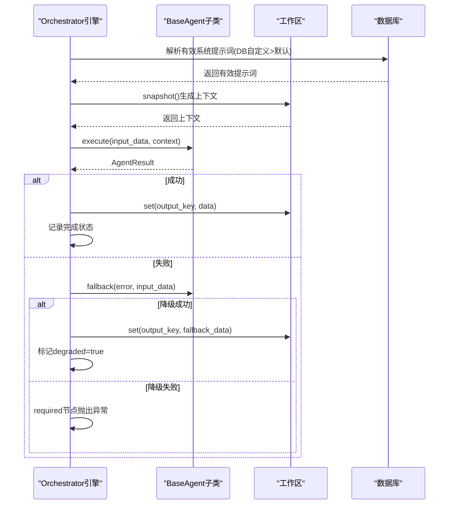
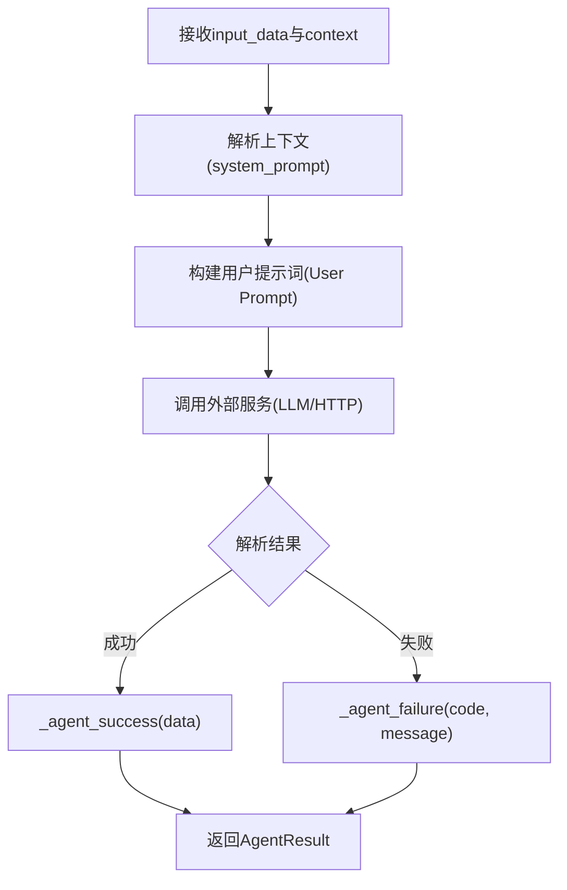
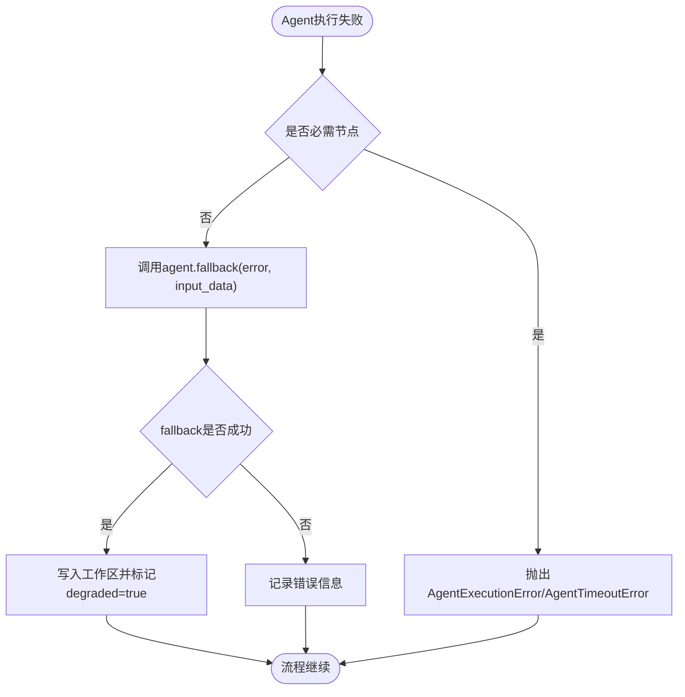
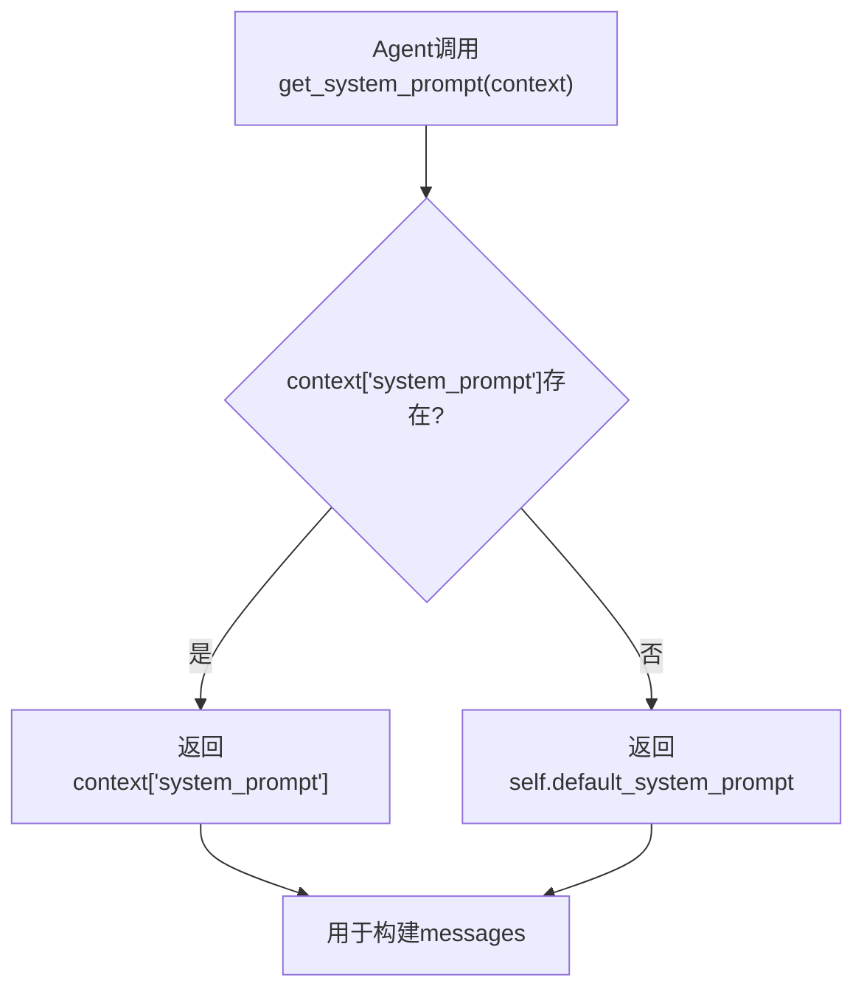
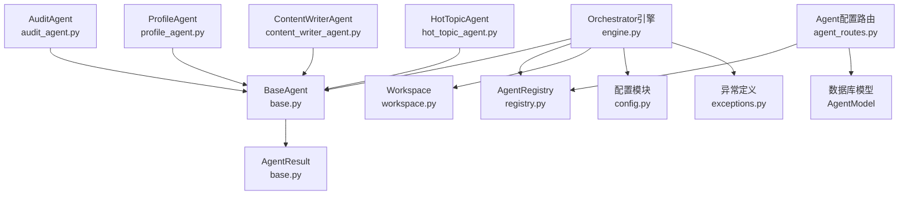

# BaseAgent基类设计

<cite>
**本文档引用的文件**
- [backend/app/agents/base.py](file://backend/app/agents/base.py)
- [backend/app/agents/audit_agent.py](file://backend/app/agents/audit_agent.py)
- [backend/app/agents/profile_agent.py](file://backend/app/agents/profile_agent.py)
- [backend/app/agents/content_writer_agent.py](file://backend/app/agents/content_writer_agent.py)
- [backend/app/agents/hot_topic_agent.py](file://backend/app/agents/hot_topic_agent.py)
- [backend/app/agents/registry.py](file://backend/app/agents/registry.py)
- [backend/app/orchestrator/engine.py](file://backend/app/orchestrator/engine.py)
- [backend/app/orchestrator/workspace.py](file://backend/app/orchestrator/workspace.py)
- [backend/app/api/agent_routes.py](file://backend/app/api/agent_routes.py)
- [backend/app/core/config.py](file://backend/app/core/config.py)
- [backend/app/core/exceptions.py](file://backend/app/core/exceptions.py)
- [Notice.md](file://Notice.md)
</cite>

## 目录
1. [简介](#简介)
2. [项目结构](#项目结构)
3. [核心组件](#核心组件)
4. [架构概览](#架构概览)
5. [详细组件分析](#详细组件分析)
6. [依赖分析](#依赖分析)
7. [性能考虑](#性能考虑)
8. [故障排除指南](#故障排除指南)
9. [结论](#结论)
10. [附录](#附录)

## 简介
本设计文档围绕BaseAgent抽象基类展开，系统阐述其设计理念、架构原则、生命周期管理机制以及通用功能实现。BaseAgent作为工作流中的节点角色，遵循统一的输入输出协议，确保结构化JSON输出，并支持降级策略与错误处理。本文还将详细说明抽象方法execute的签名设计、参数传递机制与返回值规范，解释fallback降级策略的实现原理，梳理_agent_success与_agent_failure辅助方法的使用场景与最佳实践，并说明系统提示词获取机制get_system_prompt的上下文继承策略。最后提供扩展新Agent的完整指南与参考示例。

## 项目结构
后端采用分层架构，Agent层位于app/agents目录，负责封装与执行逻辑；Orchestrator引擎位于app/orchestrator目录，负责工作流编排与上下文管理；API层位于app/api目录，提供Agent配置与状态查询接口；核心配置与异常定义位于app/core目录。

**图表来源**
- [backend/app/agents/base.py:1-99](file://backend/app/agents/base.py#L1-L99)
- [backend/app/agents/audit_agent.py:1-141](file://backend/app/agents/audit_agent.py#L1-L141)
- [backend/app/agents/profile_agent.py:1-102](file://backend/app/agents/profile_agent.py#L1-L102)
- [backend/app/agents/content_writer_agent.py:1-154](file://backend/app/agents/content_writer_agent.py#L1-L154)
- [backend/app/agents/hot_topic_agent.py:1-362](file://backend/app/agents/hot_topic_agent.py#L1-L362)
- [backend/app/agents/registry.py:1-40](file://backend/app/agents/registry.py#L1-L40)
- [backend/app/orchestrator/engine.py:1-285](file://backend/app/orchestrator/engine.py#L1-L285)
- [backend/app/orchestrator/workspace.py:1-53](file://backend/app/orchestrator/workspace.py#L1-L53)
- [backend/app/api/agent_routes.py:1-115](file://backend/app/api/agent_routes.py#L1-L115)
- [backend/app/core/config.py:1-99](file://backend/app/core/config.py#L1-L99)
- [backend/app/core/exceptions.py:1-125](file://backend/app/core/exceptions.py#L1-L125)

**章节来源**
- [backend/app/agents/base.py:1-99](file://backend/app/agents/base.py#L1-L99)
- [backend/app/orchestrator/engine.py:1-285](file://backend/app/orchestrator/engine.py#L1-L285)
- [backend/app/orchestrator/workspace.py:1-53](file://backend/app/orchestrator/workspace.py#L1-L53)
- [backend/app/api/agent_routes.py:1-115](file://backend/app/api/agent_routes.py#L1-L115)
- [backend/app/core/config.py:1-99](file://backend/app/core/config.py#L1-L99)
- [backend/app/core/exceptions.py:1-125](file://backend/app/core/exceptions.py#L1-L125)

## 核心组件
- BaseAgent抽象基类：定义Agent的统一接口、标准化输出结构AgentResult、系统提示词获取机制、生命周期钩子（execute、fallback）以及辅助方法（_success、_failure）。
- AgentResult标准化输出：统一的结构化JSON输出，包含状态、Agent标识、数据、错误信息与追踪ID。
- Orchestrator引擎：负责工作流编排、上下文管理、超时控制、错误处理与降级策略触发。
- Agent注册表：集中管理Agent实例，提供按agent_id检索与列表查询。
- 工作区Workspace：任务级上下文容器，支持数据读写与映射抽取。

**章节来源**
- [backend/app/agents/base.py:18-99](file://backend/app/agents/base.py#L18-L99)
- [backend/app/orchestrator/engine.py:89-285](file://backend/app/orchestrator/engine.py#L89-L285)
- [backend/app/orchestrator/workspace.py:12-53](file://backend/app/orchestrator/workspace.py#L12-L53)
- [backend/app/agents/registry.py:10-40](file://backend/app/agents/registry.py#L10-L40)

## 架构概览
BaseAgent遵循"节点角色"原则，每个Agent负责单一业务任务，具备明确输入输出，尽量返回结构化JSON。工作流由Orchestrator控制，Agent不得跳过或新增步骤。单节点失败时必须有明确错误输出，且支持降级策略与任务级追踪。

**图表来源**
- [backend/app/api/agent_routes.py:46-71](file://backend/app/api/agent_routes.py#L46-L71)
- [backend/app/agents/registry.py:23-28](file://backend/app/agents/registry.py#L23-L28)
- [backend/app/orchestrator/engine.py:137-176](file://backend/app/orchestrator/engine.py#L137-L176)
- [backend/app/orchestrator/engine.py:245-263](file://backend/app/orchestrator/engine.py#L245-L263)

**章节来源**
- [Notice.md:124-187](file://Notice.md#L124-L187)
- [backend/app/api/agent_routes.py:46-71](file://backend/app/api/agent_routes.py#L46-L71)
- [backend/app/orchestrator/engine.py:89-285](file://backend/app/orchestrator/engine.py#L89-L285)

## 详细组件分析

### BaseAgent抽象基类设计
BaseAgent作为所有Agent的抽象基类，提供统一的接口与基础设施：
- 标准化输出结构AgentResult：包含status、agent_name、data、error、trace_id五个字段，提供to_dict与is_success属性，满足统一的结构化输出协议。
- 生命周期管理：通过抽象方法execute定义执行入口，支持超时控制与错误处理；通过fallback提供降级策略，默认返回None表示不降级。
- 通用功能实现：提供get_system_prompt用于从上下文继承系统提示词，支持DB自定义提示词优先于默认提示词；提供_agent_success与_agent_failure辅助方法，统一构造成功与失败的AgentResult。
- 配置与初始化：支持传入config字典，便于Agent个性化配置。

**图表来源**
- [backend/app/agents/base.py:18-99](file://backend/app/agents/base.py#L18-L99)
- [backend/app/agents/audit_agent.py:12-141](file://backend/app/agents/audit_agent.py#L12-L141)
- [backend/app/agents/profile_agent.py:12-102](file://backend/app/agents/profile_agent.py#L12-L102)
- [backend/app/agents/content_writer_agent.py:12-154](file://backend/app/agents/content_writer_agent.py#L12-L154)
- [backend/app/agents/hot_topic_agent.py:40-362](file://backend/app/agents/hot_topic_agent.py#L40-L362)

**章节来源**
- [backend/app/agents/base.py:18-99](file://backend/app/agents/base.py#L18-L99)

### AgentResult标准化输出结构
AgentResult遵循统一的结构化输出协议，确保前后端与监控系统的一致性：
- 字段定义：status（success/failed）、agent_name（Agent标识）、data（结构化数据）、error（错误对象，包含code与message）、trace_id（任务级追踪ID）。
- 序列化：to_dict方法提供标准字典序列化，便于API返回与日志记录。
- 状态判断：is_success属性用于快速判断执行结果是否成功。

**图表来源**
- [backend/app/agents/base.py:18-47](file://backend/app/agents/base.py#L18-L47)

**章节来源**
- [backend/app/agents/base.py:18-47](file://backend/app/agents/base.py#L18-L47)
- [Notice.md:214-242](file://Notice.md#L214-L242)

### 生命周期管理机制
BaseAgent的生命周期由Orchestrator引擎统一管理：
- 初始化：AgentRegistry注册Agent实例，提供按agent_id检索。
- 上下文准备：Orchestrator从数据库解析有效系统提示词（DB自定义优先），并将context注入到Agent执行中。
- 执行与超时：_execute_agent_with_timeout为Agent执行设置超时，防止阻塞。
- 结果处理：根据AgentResult状态决定写入工作区或触发fallback；对于必需节点，失败时抛出AgentExecutionError或AgentTimeoutError。
- 降级策略：Agent可重写fallback方法，在执行失败时返回降级结果，标记degraded=true。

**图表来源**
- [backend/app/orchestrator/engine.py:137-176](file://backend/app/orchestrator/engine.py#L137-L176)
- [backend/app/orchestrator/engine.py:236-243](file://backend/app/orchestrator/engine.py#L236-L243)
- [backend/app/orchestrator/engine.py:245-263](file://backend/app/orchestrator/engine.py#L245-L263)

**章节来源**
- [backend/app/orchestrator/engine.py:89-285](file://backend/app/orchestrator/engine.py#L89-L285)
- [backend/app/agents/registry.py:10-40](file://backend/app/agents/registry.py#L10-L40)

### 抽象方法execute的签名设计与实现规范
- 签名设计：async def execute(self, input_data: dict, context: dict) -> AgentResult。参数input_data承载Agent所需的数据输入，context为只读的上游Agent输出快照，包含system_prompt等上下文信息。
- 参数传递机制：Orchestrator通过Workspace.extract_for_agent根据节点定义的input_mapping将上游输出映射到Agent输入字段。
- 返回值规范：必须返回AgentResult实例，遵循统一的结构化输出协议；成功时data包含结构化数据，失败时error包含code与message。
- 实现示例：ProfileAgent、AuditAgent、ContentWriterAgent、HotTopicAgent均实现了execute方法，展示了如何从input_data与context中提取所需数据，调用LLM或其他工具，解析结构化输出，并通过_agent_success/_agent_failure构造AgentResult。

**图表来源**
- [backend/app/agents/profile_agent.py:43-77](file://backend/app/agents/profile_agent.py#L43-L77)
- [backend/app/agents/audit_agent.py:53-85](file://backend/app/agents/audit_agent.py#L53-L85)
- [backend/app/agents/content_writer_agent.py:51-84](file://backend/app/agents/content_writer_agent.py#L51-L84)
- [backend/app/agents/hot_topic_agent.py:70-96](file://backend/app/agents/hot_topic_agent.py#L70-L96)

**章节来源**
- [backend/app/agents/base.py:64-75](file://backend/app/agents/base.py#L64-L75)
- [backend/app/orchestrator/workspace.py:36-52](file://backend/app/orchestrator/workspace.py#L36-L52)

### fallback降级策略与错误处理机制
- fallback设计：BaseAgent提供默认的fallback实现，返回None表示不进行降级。具体Agent可根据业务需要重写fallback，返回降级后的AgentResult。
- 触发时机：当Agent执行失败且result.is_success为False时，Orchestrator尝试调用agent.fallback(error, input_data)。
- 降级结果处理：若fallback返回成功（is_success为True），则写入工作区并标记degraded=true；若fallback仍失败或非必需节点，则记录错误但不中断流程；对于必需节点，抛出AgentExecutionError或AgentTimeoutError。
- 示例Agent：AuditAgent、ProfileAgent、ContentWriterAgent、HotTopicAgent均提供了fallback实现，返回结构化的降级数据，确保工作流在部分Agent异常时仍能继续执行。

**图表来源**
- [backend/app/orchestrator/engine.py:154-176](file://backend/app/orchestrator/engine.py#L154-L176)
- [backend/app/agents/audit_agent.py:134-140](file://backend/app/agents/audit_agent.py#L134-L140)
- [backend/app/agents/profile_agent.py:92-101](file://backend/app/agents/profile_agent.py#L92-L101)
- [backend/app/agents/content_writer_agent.py:147-153](file://backend/app/agents/content_writer_agent.py#L147-L153)
- [backend/app/agents/hot_topic_agent.py:360-361](file://backend/app/agents/hot_topic_agent.py#L360-L361)

**章节来源**
- [backend/app/orchestrator/engine.py:154-176](file://backend/app/orchestrator/engine.py#L154-L176)
- [backend/app/agents/audit_agent.py:134-140](file://backend/app/agents/audit_agent.py#L134-L140)
- [backend/app/agents/profile_agent.py:92-101](file://backend/app/agents/profile_agent.py#L92-L101)
- [backend/app/agents/content_writer_agent.py:147-153](file://backend/app/agents/content_writer_agent.py#L147-L153)
- [backend/app/agents/hot_topic_agent.py:360-361](file://backend/app/agents/hot_topic_agent.py#L360-L361)

### _agent_success与_agent_failure辅助方法
- _agent_success：用于构造成功的AgentResult，自动填充status="success"、agent_name=self.agent_id、trace_id等字段，data为结构化输出。
- _agent_failure：用于构造失败的AgentResult，自动填充status="failed"、agent_name=self.agent_id、error包含code与message、trace_id等字段。
- 使用场景：所有Agent在execute中遇到成功或失败时，应通过这两个辅助方法统一构造AgentResult，确保输出格式一致。
- 最佳实践：在fallback中同样使用_agent_success返回降级数据，确保降级结果符合统一格式。

**章节来源**
- [backend/app/agents/base.py:84-98](file://backend/app/agents/base.py#L84-L98)
- [backend/app/agents/profile_agent.py:69-77](file://backend/app/agents/profile_agent.py#L69-L77)
- [backend/app/agents/audit_agent.py:82-85](file://backend/app/agents/audit_agent.py#L82-L85)
- [backend/app/agents/content_writer_agent.py:78-84](file://backend/app/agents/content_writer_agent.py#L78-L84)
- [backend/app/agents/hot_topic_agent.py:94-96](file://backend/app/agents/hot_topic_agent.py#L94-L96)

### 系统提示词获取机制get_system_prompt的上下文继承策略
- get_system_prompt设计：从context中获取system_prompt，若不存在则回退到Agent的default_system_prompt。
- 上下文继承策略：Orchestrator在执行前解析有效系统提示词（DB自定义提示词优先于Agent默认提示词），并将system_prompt注入到context中，供Agent通过get_system_prompt获取。
- 配置来源：Agent配置API支持查询Agent详情，返回effective_prompt（DB自定义优先）与default_system_prompt，便于前端与运维管理。

**图表来源**
- [backend/app/agents/base.py:60-62](file://backend/app/agents/base.py#L60-L62)
- [backend/app/orchestrator/engine.py:140-145](file://backend/app/orchestrator/engine.py#L140-L145)
- [backend/app/orchestrator/engine.py:245-263](file://backend/app/orchestrator/engine.py#L245-L263)
- [backend/app/api/agent_routes.py:56-68](file://backend/app/api/agent_routes.py#L56-L68)

**章节来源**
- [backend/app/agents/base.py:60-62](file://backend/app/agents/base.py#L60-L62)
- [backend/app/orchestrator/engine.py:140-145](file://backend/app/orchestrator/engine.py#L140-L145)
- [backend/app/orchestrator/engine.py:245-263](file://backend/app/orchestrator/engine.py#L245-L263)
- [backend/app/api/agent_routes.py:56-68](file://backend/app/api/agent_routes.py#L56-L68)

### 扩展新Agent的完整指南
- 继承BaseAgent：新建Agent类继承BaseAgent，设置agent_id、name、description与default_system_prompt。
- 实现execute：按照统一签名实现execute方法，从input_data与context中提取所需数据，调用外部服务，解析结构化输出，使用_agent_success/_agent_failure构造AgentResult。
- 可选实现fallback：在execute可能失败的场景下，提供降级策略，返回_agent_success的降级数据。
- 注册Agent：将新Agent实例注册到AgentRegistry，确保Orchestrator可按agent_id检索。
- 配置与提示词：通过Agent配置API查询与更新Agent的prompt_template、model_config_data、retry_config等。
- 参考示例：ProfileAgent、AuditAgent、ContentWriterAgent、HotTopicAgent提供了完整的实现范例，可作为新Agent开发的模板。

**章节来源**
- [backend/app/agents/base.py:49-99](file://backend/app/agents/base.py#L49-L99)
- [backend/app/agents/registry.py:16-21](file://backend/app/agents/registry.py#L16-L21)
- [backend/app/api/agent_routes.py:74-114](file://backend/app/api/agent_routes.py#L74-L114)

## 依赖分析
BaseAgent与其子类之间的依赖关系清晰，遵循单一职责与依赖倒置原则：
- BaseAgent依赖AgentResult进行标准化输出。
- 子类依赖外部服务（LLM、HTTP）与配置模块（settings）。
- Orchestrator依赖AgentRegistry与Workspace进行编排与上下文管理。
- API层依赖AgentRegistry与数据库模型进行Agent配置查询与更新。

**图表来源**
- [backend/app/agents/base.py:11-15](file://backend/app/agents/base.py#L11-L15)
- [backend/app/agents/audit_agent.py:8-9](file://backend/app/agents/audit_agent.py#L8-L9)
- [backend/app/agents/profile_agent.py:8-9](file://backend/app/agents/profile_agent.py#L8-L9)
- [backend/app/agents/content_writer_agent.py:8-9](file://backend/app/agents/content_writer_agent.py#L8-L9)
- [backend/app/agents/hot_topic_agent.py:8-9](file://backend/app/agents/hot_topic_agent.py#L8-L9)
- [backend/app/orchestrator/engine.py:18-26](file://backend/app/orchestrator/engine.py#L18-L26)
- [backend/app/agents/registry.py:3-7](file://backend/app/agents/registry.py#L3-L7)
- [backend/app/api/agent_routes.py:10-12](file://backend/app/api/agent_routes.py#L10-L12)

**章节来源**
- [backend/app/agents/base.py:11-15](file://backend/app/agents/base.py#L11-L15)
- [backend/app/orchestrator/engine.py:18-26](file://backend/app/orchestrator/engine.py#L18-L26)
- [backend/app/agents/registry.py:3-7](file://backend/app/agents/registry.py#L3-L7)
- [backend/app/api/agent_routes.py:10-12](file://backend/app/api/agent_routes.py#L10-L12)

## 性能考虑
- 超时控制：Orchestrator为Agent执行设置超时（settings.agent_timeout），防止长时间阻塞；同时为LLM调用设置独立超时（settings.llm_timeout）。
- 并发与异步：Agent内部使用异步I/O（如httpx、litellm），提升并发性能；Orchestrator使用asyncio.wait_for控制超时。
- 日志与追踪：统一的日志记录与trace_id追踪，便于性能分析与问题定位。
- 降级策略：通过fallback在外部服务异常时返回降级数据，减少整体执行时间与失败率。

**章节来源**
- [backend/app/core/config.py:79-82](file://backend/app/core/config.py#L79-L82)
- [backend/app/orchestrator/engine.py:236-243](file://backend/app/orchestrator/engine.py#L236-L243)
- [backend/app/agents/hot_topic_agent.py:121-134](file://backend/app/agents/hot_topic_agent.py#L121-L134)

## 故障排除指南
- AgentNotFound：当Agent未注册或不存在时，AgentRegistry.get会抛出AgentNotFoundError；API层捕获并返回相应错误。
- AgentExecutionError：当Agent执行失败且为必需节点时，Orchestrator抛出AgentExecutionError，包含agent_id与错误信息。
- AgentTimeoutError：当Agent执行超时，Orchestrator抛出AgentTimeoutError，包含agent_id。
- LLM调用异常：Agent内部捕获JSON解析错误与外部服务异常，统一通过_agent_failure返回结构化错误。
- 日志记录：所有异常均记录日志，包含task_id、node_id、error等关键信息，便于排查。

**章节来源**
- [backend/app/agents/registry.py:23-28](file://backend/app/agents/registry.py#L23-L28)
- [backend/app/core/exceptions.py:31-36](file://backend/app/core/exceptions.py#L31-L36)
- [backend/app/core/exceptions.py:86-91](file://backend/app/core/exceptions.py#L86-L91)
- [backend/app/core/exceptions.py:79-84](file://backend/app/core/exceptions.py#L79-L84)
- [backend/app/orchestrator/engine.py:176-196](file://backend/app/orchestrator/engine.py#L176-L196)

## 结论
BaseAgent抽象基类通过标准化输出结构、统一的生命周期管理与上下文继承策略，为多Agent工作流提供了稳定可靠的基础设施。其设计遵循项目NOTICE中的核心原则：结构化优先、可维护性优先、严格输入输出协议与任务级追踪。通过fallback降级策略与完善的错误处理机制，系统能够在部分Agent异常时保持整体流程的稳定性。开发者可基于BaseAgent快速扩展新的Agent，遵循统一的实现规范与最佳实践，确保系统的可扩展性与可维护性。

## 附录
- 设计原则参考：NOTICE.md中的Agent定义边界、工作流与执行原则、输入输出协议要求等。
- 配置参考：settings模块提供LLM配置、超时参数等，影响Agent执行行为。
- API参考：Agent配置路由提供Agent列表、详情查询与配置更新接口。

**章节来源**
- [Notice.md:124-242](file://Notice.md#L124-L242)
- [backend/app/core/config.py:52-99](file://backend/app/core/config.py#L52-L99)
- [backend/app/api/agent_routes.py:17-114](file://backend/app/api/agent_routes.py#L17-L114)