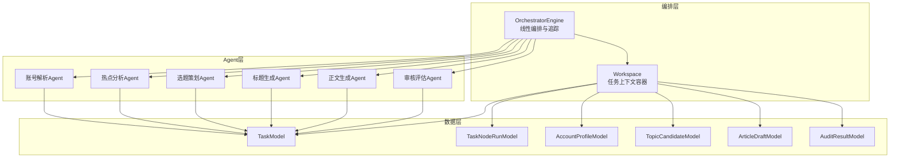
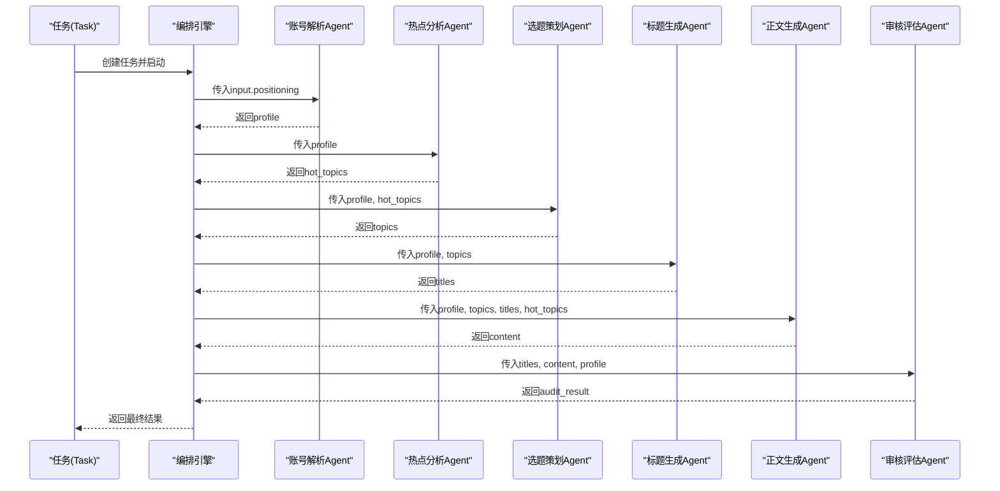
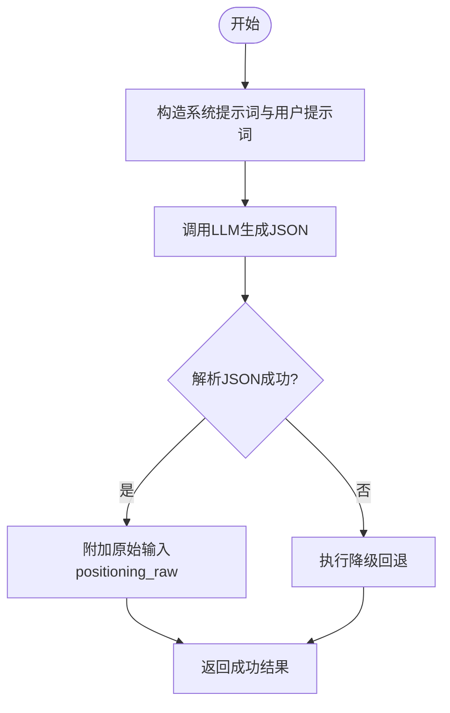
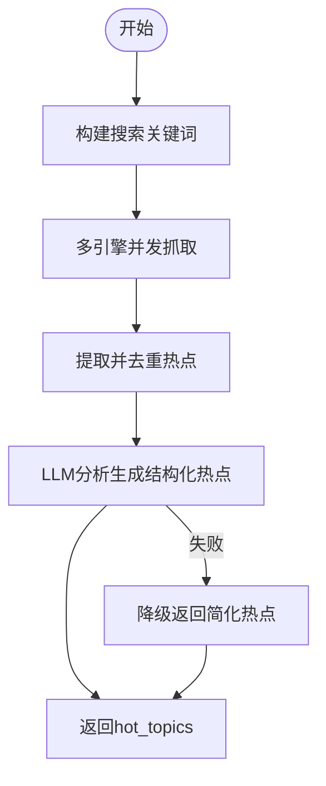
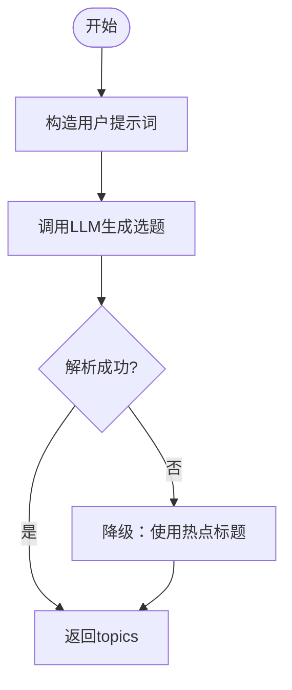
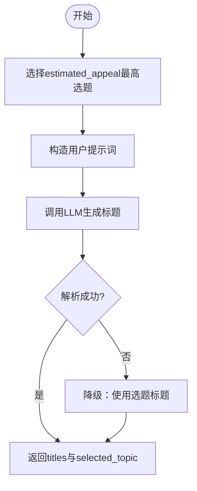
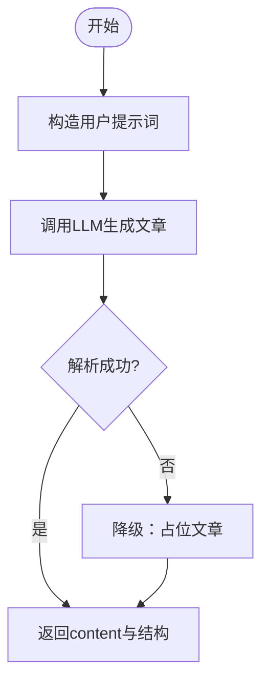
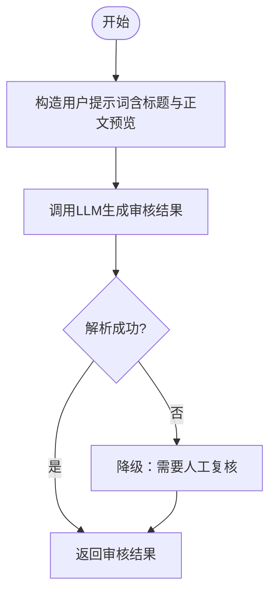
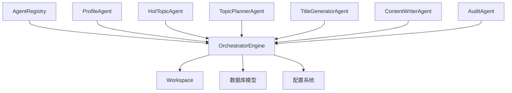

# 核心Agent实现

<cite>
**本文档引用的文件**
- [backend/app/agents/base.py](file://backend/app/agents/base.py)
- [backend/app/agents/profile_agent.py](file://backend/app/agents/profile_agent.py)
- [backend/app/agents/hot_topic_agent.py](file://backend/app/agents/hot_topic_agent.py)
- [backend/app/agents/topic_planner_agent.py](file://backend/app/agents/topic_planner_agent.py)
- [backend/app/agents/title_generator_agent.py](file://backend/app/agents/title_generator_agent.py)
- [backend/app/agents/content_writer_agent.py](file://backend/app/agents/content_writer_agent.py)
- [backend/app/agents/audit_agent.py](file://backend/app/agents/audit_agent.py)
- [backend/app/agents/registry.py](file://backend/app/agents/registry.py)
- [backend/app/orchestrator/engine.py](file://backend/app/orchestrator/engine.py)
- [backend/app/orchestrator/workspace.py](file://backend/app/orchestrator/workspace.py)
- [backend/app/core/config.py](file://backend/app/core/config.py)
- [backend/app/models/tables.py](file://backend/app/models/tables.py)
- [backend/app/schemas/agent.py](file://backend/app/schemas/agent.py)
</cite>

## 目录
1. [简介](#简介)
2. [项目结构](#项目结构)
3. [核心组件](#核心组件)
4. [架构总览](#架构总览)
5. [详细组件分析](#详细组件分析)
6. [依赖分析](#依赖分析)
7. [性能考虑](#性能考虑)
8. [故障排查指南](#故障排查指南)
9. [结论](#结论)
10. [附录](#附录)

## 简介
本文件面向六大核心Agent的实现与协作，围绕账号解析、热点分析、选题策划、标题生成、内容写作、审核评估六个环节，系统阐述各Agent的功能职责、输入输出规范、业务逻辑实现、配置参数、性能指标与调优建议，并给出Agent间协作模式与数据流转机制。

## 项目结构
后端采用“Agent + 工作流编排”的架构设计：
- Agent层：每个Agent负责单一业务任务，具备标准化输入输出与结构化JSON返回能力。
- Orchestration层：线性编排六大Agent，管理任务生命周期、节点执行日志、追踪ID与降级回退。
- 数据模型层：持久化任务、节点运行记录、账号画像、选题候选、文章草稿与审核结果。
- 配置层：统一加载LLM提供商、超时、令牌计数等运行时参数。

图表来源
- [backend/app/orchestrator/engine.py:31-86](file://backend/app/orchestrator/engine.py#L31-L86)
- [backend/app/orchestrator/workspace.py:12-53](file://backend/app/orchestrator/workspace.py#L12-L53)
- [backend/app/models/tables.py:23-158](file://backend/app/models/tables.py#L23-L158)

章节来源
- [backend/app/orchestrator/engine.py:31-86](file://backend/app/orchestrator/engine.py#L31-L86)
- [backend/app/orchestrator/workspace.py:12-53](file://backend/app/orchestrator/workspace.py#L12-L53)
- [backend/app/models/tables.py:23-158](file://backend/app/models/tables.py#L23-L158)

## 核心组件
- Agent基类与结果封装：定义统一的AgentResult结构、系统提示词解析、成功/失败封装与降级回退接口。
- 六大Agent：账号解析、热点分析、选题策划、标题生成、正文生成、审核评估，均继承自基类并实现execute方法。
- 注册中心：集中注册与检索Agent实例。
- 编排引擎：线性顺序执行Agent，注入系统提示词，记录节点运行日志与追踪ID，支持超时与降级。
- 工作空间：任务级上下文容器，支持字段映射抽取与快照持久化。
- 配置系统：统一加载LLM提供商、超时、模型名称等参数。
- 数据模型：任务、节点运行、账号画像、选题候选、文章草稿、审核结果的ORM模型。

章节来源
- [backend/app/agents/base.py:18-99](file://backend/app/agents/base.py#L18-L99)
- [backend/app/agents/registry.py:10-40](file://backend/app/agents/registry.py#L10-L40)
- [backend/app/orchestrator/engine.py:89-285](file://backend/app/orchestrator/engine.py#L89-L285)
- [backend/app/orchestrator/workspace.py:12-53](file://backend/app/orchestrator/workspace.py#L12-L53)
- [backend/app/core/config.py:52-99](file://backend/app/core/config.py#L52-L99)
- [backend/app/models/tables.py:23-158](file://backend/app/models/tables.py#L23-L158)

## 架构总览
六大Agent在编排引擎中以线性链路顺序执行，每个Agent仅能访问其输入映射所指定的工作空间字段，输出写入工作空间供后续Agent消费。系统支持：
- 任务级追踪ID与节点事件广播
- 节点运行时长、令牌用量统计
- 节点失败时的降级回退策略
- 自定义系统提示词优先于Agent默认提示词

图表来源
- [backend/app/orchestrator/engine.py:31-86](file://backend/app/orchestrator/engine.py#L31-L86)
- [backend/app/orchestrator/engine.py:92-234](file://backend/app/orchestrator/engine.py#L92-L234)

章节来源
- [backend/app/orchestrator/engine.py:31-86](file://backend/app/orchestrator/engine.py#L31-L86)
- [backend/app/orchestrator/engine.py:92-234](file://backend/app/orchestrator/engine.py#L92-L234)

## 详细组件分析

### 账号解析Agent
- 功能职责：将用户输入的账号定位描述解析为结构化画像，包含领域、细分领域、目标受众、内容调性、内容风格、关键词等。
- 输入规范：positioning（字符串）
- 输出规范：domain、subdomain、target_audience（age_range、occupation、interests）、tone、content_style、keywords；并保留原始输入positioning_raw
- 业务逻辑：
  - 构造系统提示词与用户提示词
  - 调用LLM完成结构化JSON解析，兼容markdown代码块
  - 失败时执行降级回退，返回通用画像
- 错误处理：JSON解析失败、LLM异常分别返回对应错误码
- 性能与稳定性：统一超时设置，阿里云DashScope兼容前缀处理

图表来源
- [backend/app/agents/profile_agent.py:43-102](file://backend/app/agents/profile_agent.py#L43-L102)

章节来源
- [backend/app/agents/profile_agent.py:12-102](file://backend/app/agents/profile_agent.py#L12-L102)
- [backend/app/core/config.py:21-49](file://backend/app/core/config.py#L21-L49)

### 热点分析Agent
- 功能职责：从微信搜索、搜狗、360搜索等多引擎抓取热点，清洗去重，再由LLM分析生成与账号领域相关的结构化热点列表。
- 输入规范：profile（包含domain、keywords等）
- 输出规范：hot_topics数组，每项包含title、source、heat_score、summary、relevance_score
- 业务逻辑：
  - 根据账号画像构建搜索关键词（优先使用关键词，否则使用领域）
  - 并发多引擎抓取，正则解析HTML标题
  - 去重过滤后交由LLM分析，生成结构化热点
  - LLM失败时降级返回简化热点
- 性能与稳定性：异步并发抓取，超时与重定向控制，日志记录抓取阶段耗时

图表来源
- [backend/app/agents/hot_topic_agent.py:70-97](file://backend/app/agents/hot_topic_agent.py#L70-L97)
- [backend/app/agents/hot_topic_agent.py:114-141](file://backend/app/agents/hot_topic_agent.py#L114-L141)
- [backend/app/agents/hot_topic_agent.py:238-263](file://backend/app/agents/hot_topic_agent.py#L238-L263)
- [backend/app/agents/hot_topic_agent.py:264-303](file://backend/app/agents/hot_topic_agent.py#L264-L303)

章节来源
- [backend/app/agents/hot_topic_agent.py:40-362](file://backend/app/agents/hot_topic_agent.py#L40-L362)

### 选题策划Agent
- 功能职责：结合账号画像与热点，策划3-5个具备传播潜力的选题，包含标题、切入角度、钩子类型、目标情绪、预估吸引力与理由。
- 输入规范：profile、hot_topics
- 输出规范：topics数组，每项包含title、angle、hook、target_emotion、estimated_appeal、reasoning
- 业务逻辑：
  - 构造用户提示词，包含账号信息与热点概览
  - LLM生成结构化选题列表
  - 失败时降级：直接使用热点标题作为选题
- 性能与稳定性：统一超时，降级保证输出可用性

图表来源
- [backend/app/agents/topic_planner_agent.py:44-76](file://backend/app/agents/topic_planner_agent.py#L44-L76)
- [backend/app/agents/topic_planner_agent.py:127-143](file://backend/app/agents/topic_planner_agent.py#L127-L143)

章节来源
- [backend/app/agents/topic_planner_agent.py:12-143](file://backend/app/agents/topic_planner_agent.py#L12-L143)

### 标题生成Agent
- 功能职责：为吸引力最高的选题生成4-6个风格各异的候选标题，附带风格、评分与理由。
- 输入规范：profile、topics（取estimated_appeal最高者）
- 输出规范：selected_topic与titles数组，每项包含text、style、score、reasoning
- 业务逻辑：
  - 选择最高吸引力选题
  - LLM生成多样化标题并评分
  - 失败时降级：直接使用选题标题
- 性能与稳定性：统一超时，降级保证输出可用性

图表来源
- [backend/app/agents/title_generator_agent.py:44-77](file://backend/app/agents/title_generator_agent.py#L44-L77)
- [backend/app/agents/title_generator_agent.py:119-127](file://backend/app/agents/title_generator_agent.py#L119-L127)

章节来源
- [backend/app/agents/title_generator_agent.py:12-127](file://backend/app/agents/title_generator_agent.py#L12-L127)

### 正文生成Agent
- 功能职责：根据选题、标题与热点素材生成完整公众号文章，返回Markdown正文、字数、结构与标签。
- 输入规范：profile、topics、titles（取最高分标题）、hot_topics
- 输出规范：content_markdown、word_count、structure（sections）、tags
- 业务逻辑：
  - 构造用户提示词，包含账号信息、选题、标题与热点
  - LLM生成结构化文章
  - 失败时降级：返回占位文章
- 性能与稳定性：统一超时，降级保证输出可用性

图表来源
- [backend/app/agents/content_writer_agent.py:51-85](file://backend/app/agents/content_writer_agent.py#L51-L85)
- [backend/app/agents/content_writer_agent.py:147-154](file://backend/app/agents/content_writer_agent.py#L147-L154)

章节来源
- [backend/app/agents/content_writer_agent.py:12-154](file://backend/app/agents/content_writer_agent.py#L12-L154)

### 审核评估Agent
- 功能职责：对生成的文章标题与正文进行合规性审核与质量评估，输出通过与否、风险等级、问题列表与综合评价。
- 输入规范：profile、titles、content
- 输出规范：passed（布尔）、risk_level（low/medium/high）、issues（数组）、overall_comment
- 业务逻辑：
  - 构造用户提示词，包含账号信息、候选标题与正文预览
  - LLM生成结构化审核结果
  - 失败时降级：返回需要人工复核的降级结果
- 性能与稳定性：统一超时，降级保证输出可用性

图表来源
- [backend/app/agents/audit_agent.py:53-86](file://backend/app/agents/audit_agent.py#L53-L86)
- [backend/app/agents/audit_agent.py:134-141](file://backend/app/agents/audit_agent.py#L134-L141)

章节来源
- [backend/app/agents/audit_agent.py:12-141](file://backend/app/agents/audit_agent.py#L12-L141)

## 依赖分析
- Agent注册中心：集中注册与获取Agent实例，避免硬编码耦合。
- 编排引擎：依赖注册中心获取Agent，注入系统提示词，管理节点执行与降级。
- 工作空间：提供字段映射抽取与快照，确保Agent间数据解耦。
- 配置系统：统一LLM提供商、超时、模型名称，支持运行时覆盖。
- 数据模型：任务与节点运行记录持久化，支持审计与追踪。

图表来源
- [backend/app/agents/registry.py:10-40](file://backend/app/agents/registry.py#L10-L40)
- [backend/app/orchestrator/engine.py:138-171](file://backend/app/orchestrator/engine.py#L138-L171)
- [backend/app/orchestrator/workspace.py:36-53](file://backend/app/orchestrator/workspace.py#L36-L53)
- [backend/app/core/config.py:52-99](file://backend/app/core/config.py#L52-L99)
- [backend/app/models/tables.py:23-158](file://backend/app/models/tables.py#L23-L158)

章节来源
- [backend/app/agents/registry.py:10-40](file://backend/app/agents/registry.py#L10-L40)
- [backend/app/orchestrator/engine.py:138-171](file://backend/app/orchestrator/engine.py#L138-L171)
- [backend/app/orchestrator/workspace.py:36-53](file://backend/app/orchestrator/workspace.py#L36-L53)
- [backend/app/core/config.py:52-99](file://backend/app/core/config.py#L52-L99)
- [backend/app/models/tables.py:23-158](file://backend/app/models/tables.py#L23-L158)

## 性能考虑
- 超时控制：Agent执行超时、技能超时、LLM请求超时均可配置，默认Agent超时为120秒，LLM超时为60秒。
- 令牌统计：编排引擎累计prompt与completion令牌，便于成本与性能监控。
- 并发抓取：热点分析Agent对多搜索引擎并发抓取，提升响应速度。
- 降级策略：所有Agent均提供降级回退，保障任务可继续执行。
- 日志与追踪：节点开始/完成事件广播，支持任务级追踪ID与节点耗时统计。

章节来源
- [backend/app/core/config.py:79-87](file://backend/app/core/config.py#L79-L87)
- [backend/app/orchestrator/engine.py:211-216](file://backend/app/orchestrator/engine.py#L211-L216)
- [backend/app/orchestrator/engine.py:124-210](file://backend/app/orchestrator/engine.py#L124-L210)
- [backend/app/agents/hot_topic_agent.py:121-140](file://backend/app/agents/hot_topic_agent.py#L121-L140)

## 故障排查指南
- Agent执行失败：
  - 检查AgentResult中的错误码与消息，定位JSON解析失败或LLM异常
  - 观察编排引擎节点运行记录，确认是否触发降级
- 超时问题：
  - 调整settings.agent_timeout与settings.llm_timeout
  - 检查网络连通性与LLM提供商可用性
- 审核降级：
  - 审核Agent在异常时返回“需要人工复核”，检查日志与提示词
- 数据持久化：
  - 查看TaskModel与TaskNodeRunModel的状态、耗时与错误信息
  - 核对AccountProfileModel、TopicCandidateModel、ArticleDraftModel、AuditResultModel的字段一致性

章节来源
- [backend/app/orchestrator/engine.py:176-197](file://backend/app/orchestrator/engine.py#L176-L197)
- [backend/app/agents/profile_agent.py:74-78](file://backend/app/agents/profile_agent.py#L74-L78)
- [backend/app/agents/audit_agent.py:82-85](file://backend/app/agents/audit_agent.py#L82-L85)
- [backend/app/models/tables.py:23-158](file://backend/app/models/tables.py#L23-L158)

## 结论
六大核心Agent以统一的基类与编排引擎为核心，形成可扩展、可观测、可降级的自动化内容生产流水线。通过结构化提示词、LLM强约束输出与工作空间解耦，实现从账号定位到文章发布的全链路自动化。建议在生产环境中持续优化提示词模板、监控令牌用量与节点耗时，并完善人工复核与质量门禁。

## 附录

### Agent配置参数与Schema
- Agent配置更新请求体包含：model_config_data、prompt_template、retry_config
- Agent信息Schema包含：agent_id、name、description、version、model_config_data、required_skills、status、prompt_template、prompt_source、default_system_prompt、has_custom_prompt

章节来源
- [backend/app/schemas/agent.py:6-29](file://backend/app/schemas/agent.py#L6-L29)

### 数据模型概览
- 任务与节点运行：TaskModel、TaskNodeRunModel
- 账号画像：AccountProfileModel
- 选题候选：TopicCandidateModel
- 文章草稿：ArticleDraftModel
- 审核结果：AuditResultModel

章节来源
- [backend/app/models/tables.py:23-158](file://backend/app/models/tables.py#L23-L158)