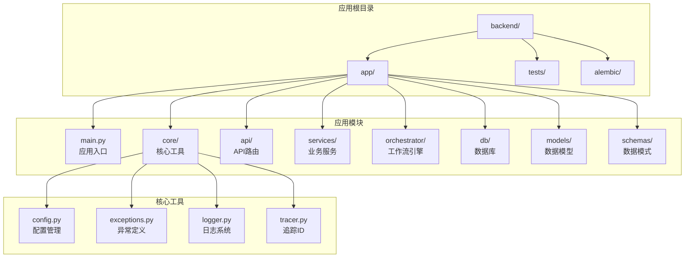
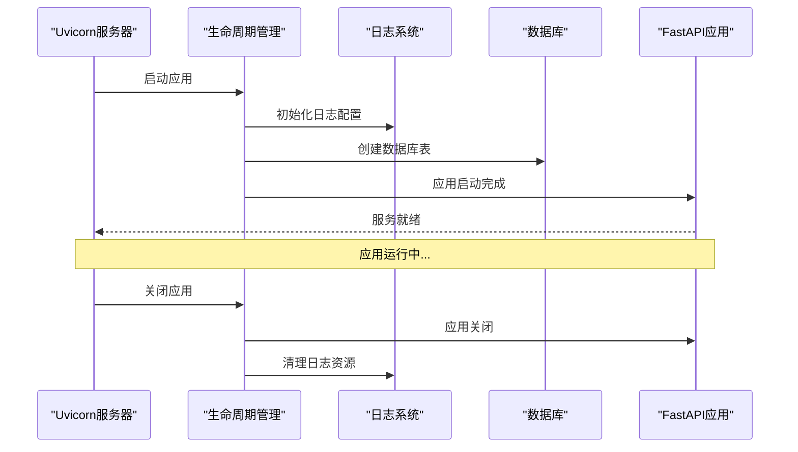
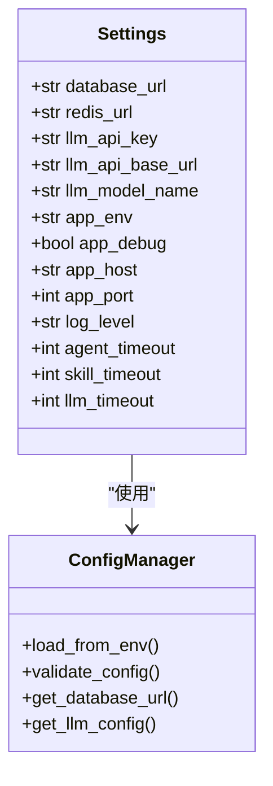
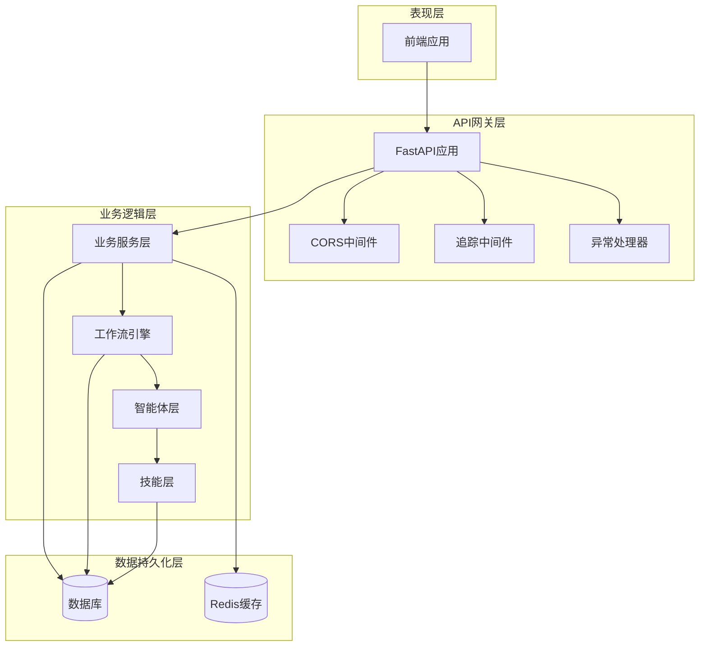
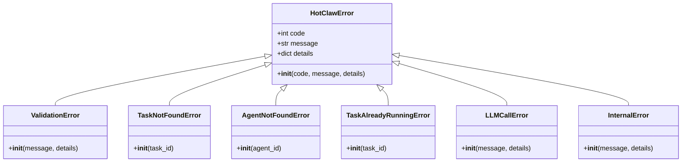
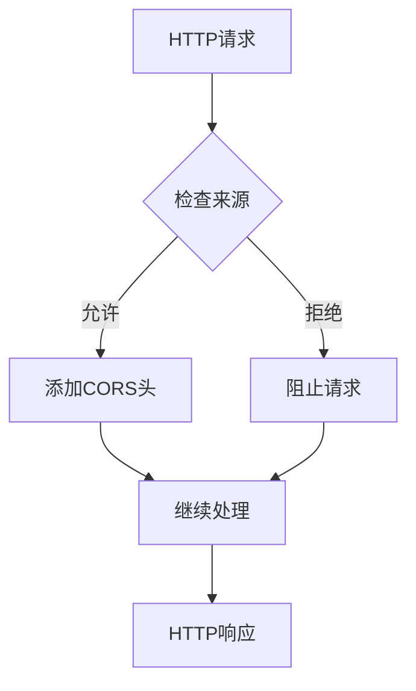
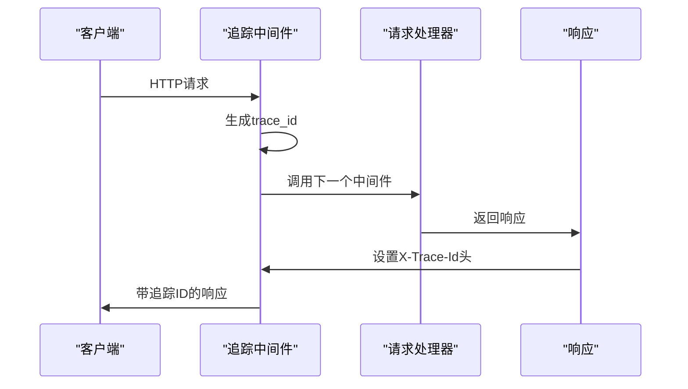
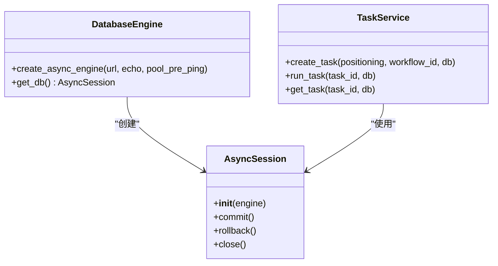
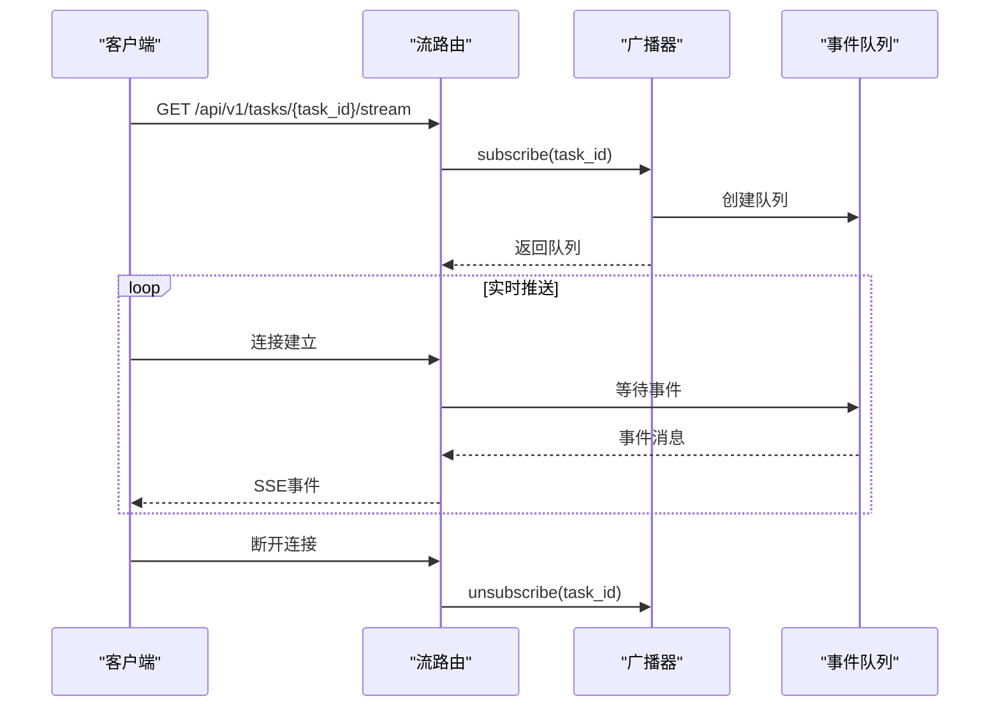
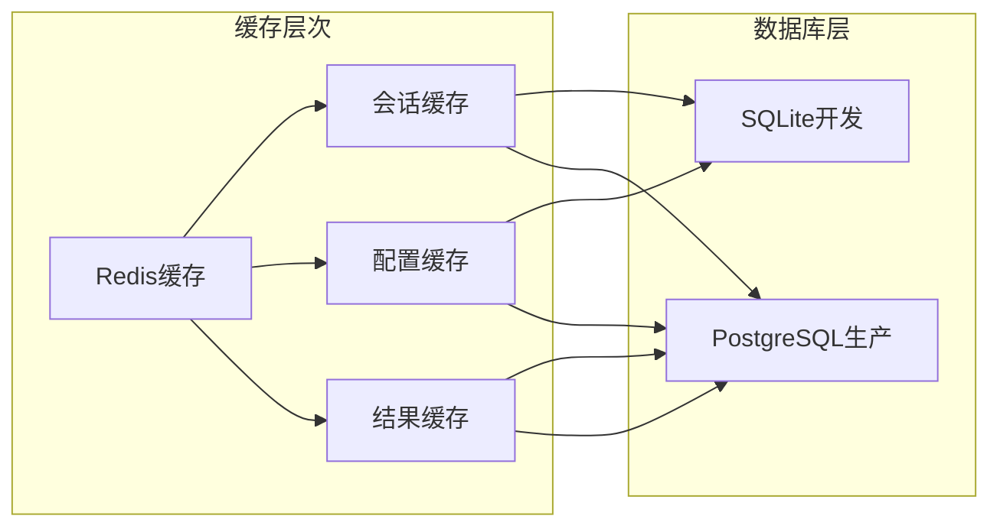

# FastAPI应用架构

<cite>
**本文档引用的文件**
- [main.py](file://backend/app/main.py)
- [config.py](file://backend/app/core/config.py)
- [exceptions.py](file://backend/app/core/exceptions.py)
- [logger.py](file://backend/app/core/logger.py)
- [tracer.py](file://backend/app/core/tracer.py)
- [common.py](file://backend/app/schemas/common.py)
- [pyproject.toml](file://backend/pyproject.toml)
- [session.py](file://backend/app/db/session.py)
- [tables.py](file://backend/app/models/tables.py)
- [task_routes.py](file://backend/app/api/task_routes.py)
- [stream_routes.py](file://backend/app/api/stream_routes.py)
- [task_service.py](file://backend/app/services/task_service.py)
- [broadcaster.py](file://backend/app/orchestrator/broadcaster.py)
- [ARCHITECTURE.md](file://backend/ARCHITECTURE.md)
</cite>

## 目录
1. [简介](#简介)
2. [项目结构](#项目结构)
3. [核心组件](#核心组件)
4. [架构概览](#架构概览)
5. [详细组件分析](#详细组件分析)
6. [依赖分析](#依赖分析)
7. [性能考虑](#性能考虑)
8. [故障排除指南](#故障排除指南)
9. [结论](#结论)

## 简介

HotClaw是一个基于多智能体协作的微信公众号内容生产平台。该FastAPI应用作为系统的统一入口，提供了完整的生命周期管理、中间件配置和异常处理机制。

该应用采用现代化的异步架构设计，支持实时任务状态推送、结构化日志记录和统一的错误处理机制。系统通过工作流引擎协调多个智能体的协作，实现了从热点抓取到内容生成的完整自动化流程。

## 项目结构

后端项目采用分层架构设计，主要目录结构如下：



**图表来源**
- [main.py:1-142](file://backend/app/main.py#L1-L142)
- [config.py:1-51](file://backend/app/core/config.py#L1-L51)
- [pyproject.toml:1-41](file://backend/pyproject.toml#L1-L41)

**章节来源**
- [main.py:1-142](file://backend/app/main.py#L1-L142)
- [pyproject.toml:1-41](file://backend/pyproject.toml#L1-L41)

## 核心组件

### 应用入口点设计

应用入口点位于`backend/app/main.py`，采用了现代FastAPI的生命周期管理模式：



**图表来源**
- [main.py:42-58](file://backend/app/main.py#L42-L58)

应用的核心特性包括：
- **生命周期管理**：通过`lifespan`上下文管理器实现优雅启动和关闭
- **自动数据库迁移**：开发环境下自动创建数据库表结构
- **模块注册**：动态注册所有智能体实现

**章节来源**
- [main.py:42-58](file://backend/app/main.py#L42-L58)

### 配置管理系统

配置系统基于Pydantic Settings，提供了完整的环境变量管理和类型安全：



**图表来源**
- [config.py:7-51](file://backend/app/core/config.py#L7-L51)

配置系统支持的关键功能：
- **环境变量绑定**：通过`.env`文件加载配置
- **类型安全**：所有配置项都有明确的数据类型
- **默认值设置**：开发环境的合理默认配置
- **运行时验证**：启动时自动验证配置有效性

**章节来源**
- [config.py:1-51](file://backend/app/core/config.py#L1-L51)

## 架构概览

系统采用分层架构，各层职责清晰分离：



**图表来源**
- [main.py:60-142](file://backend/app/main.py#L60-L142)
- [ARCHITECTURE.md:414-448](file://backend/ARCHITECTURE.md#L414-L448)

## 详细组件分析

### 异常处理架构

系统实现了完整的异常处理机制，采用分类化的错误码体系：



**图表来源**
- [exceptions.py:4-125](file://backend/app/core/exceptions.py#L4-L125)

异常处理规则：
- **错误码分类**：按照1xxx-5xxx的范围划分错误类型
- **HTTP状态映射**：根据错误类别映射到相应的HTTP状态码
- **特殊处理**：针对特定错误码进行特殊的HTTP状态处理
- **统一响应格式**：所有错误都返回统一的JSON格式

**章节来源**
- [exceptions.py:1-125](file://backend/app/core/exceptions.py#L1-L125)

### 中间件实现细节

应用实现了三个关键中间件来增强功能：

#### CORS中间件配置



**图表来源**
- [main.py:67-74](file://backend/app/main.py#L67-L74)

#### 请求追踪中间件



**图表来源**
- [main.py:77-84](file://backend/app/main.py#L77-L84)
- [tracer.py:10-26](file://backend/app/core/tracer.py#L10-L26)

#### 性能监控中间件

虽然未在代码中直接实现，但可以通过以下方式扩展：
- **请求计时器**：记录请求处理时间
- **内存监控**：跟踪内存使用情况
- **并发限制**：控制同时处理的请求数量

**章节来源**
- [main.py:67-84](file://backend/app/main.py#L67-L84)
- [tracer.py:1-34](file://backend/app/core/tracer.py#L1-L34)

### 数据库连接管理

系统使用SQLAlchemy 2.0的异步ORM进行数据库操作：



**图表来源**
- [session.py:8-33](file://backend/app/db/session.py#L8-L33)
- [task_service.py:22-37](file://backend/app/services/task_service.py#L22-L37)

**章节来源**
- [session.py:1-33](file://backend/app/db/session.py#L1-L33)
- [task_service.py:1-126](file://backend/app/services/task_service.py#L1-L126)

### 实时状态推送系统

系统实现了基于SSE（Server-Sent Events）的实时状态推送：



**图表来源**
- [stream_routes.py:14-42](file://backend/app/api/stream_routes.py#L14-L42)
- [broadcaster.py:30-84](file://backend/app/orchestrator/broadcaster.py#L30-L84)

**章节来源**
- [stream_routes.py:1-43](file://backend/app/api/stream_routes.py#L1-L43)
- [broadcaster.py:1-94](file://backend/app/orchestrator/broadcaster.py#L1-L94)

## 依赖分析

应用的依赖关系清晰且模块化：

```mermaid
graph TB
subgraph "核心依赖"
FastAPI[fastapi>=0.115.0]
Uvicorn[uvicorn[standard]>=0.30.0]
SQLA[sqlalchemy[asyncio]>=2.0.0]
Alembic[alembic>=1.14.0]
end
subgraph "AI/LLM依赖"
LiteLLM[litellm>=1.40.0]
OpenAI[openai>=1.0.0]
end
subgraph "工具依赖"
StructLog[structlog>=24.0.0]
Pydantic[pydantic>=2.0.0]
Redis[redis>=5.0.0]
SSE[sse-starlette>=2.0.0]
end
subgraph "开发依赖"
PyTest[pytest>=8.0.0]
Httpx[httpx>=0.27.0]
end
FastAPI --> SQLA
FastAPI --> LiteLLM
FastAPI --> StructLog
SQLA --> Alembic
```

**图表来源**
- [pyproject.toml:6-22](file://backend/pyproject.toml#L6-L22)

**章节来源**
- [pyproject.toml:1-41](file://backend/pyproject.toml#L1-L41)

## 性能考虑

### 异步处理优化

系统充分利用了Python的异步特性来提升性能：

1. **异步数据库操作**：使用SQLAlchemy 2.0的异步功能
2. **非阻塞I/O**：避免同步阻塞操作影响整体性能
3. **连接池管理**：合理配置数据库连接池参数

### 缓存策略



### 监控和日志

系统实现了全面的日志记录机制：

- **结构化日志**：使用structlog进行JSON格式的日志输出
- **追踪ID**：每个请求都有唯一的追踪ID便于问题排查
- **性能指标**：记录关键操作的执行时间和资源使用情况

## 故障排除指南

### 常见问题诊断

#### 数据库连接问题

**症状**：应用启动时报数据库连接错误
**解决方案**：
1. 检查`DATABASE_URL`环境变量配置
2. 验证数据库服务是否正常运行
3. 确认连接凭据和网络配置正确

#### LLM API调用失败

**症状**：智能体执行时出现LLM调用错误
**解决方案**：
1. 验证`LLM_API_KEY`和`LLM_API_BASE_URL`配置
2. 检查网络连接和防火墙设置
3. 确认API配额和使用限制

#### SSE连接中断

**症状**：前端无法接收实时状态更新
**解决方案**：
1. 检查浏览器的SSE支持
2. 验证网络连接稳定性
3. 确认服务器端口和防火墙配置

**章节来源**
- [logger.py:1-36](file://backend/app/core/logger.py#L1-L36)
- [exceptions.py:1-125](file://backend/app/core/exceptions.py#L1-L125)

## 结论

HotClaw的FastAPI应用架构展现了现代Python Web应用的最佳实践。通过合理的分层设计、完善的异常处理机制和实时状态推送系统，该应用为多智能体内容生产平台提供了稳定可靠的技术基础。

关键优势包括：
- **模块化设计**：清晰的职责分离便于维护和扩展
- **异步架构**：充分利用异步特性提升系统性能
- **统一错误处理**：一致的错误响应格式提升用户体验
- **实时通信**：SSE技术实现实时状态推送
- **结构化日志**：完整的日志记录便于问题诊断

该架构为后续的功能扩展和性能优化奠定了良好的基础，能够支持更复杂的多智能体协作场景和更高的并发需求。