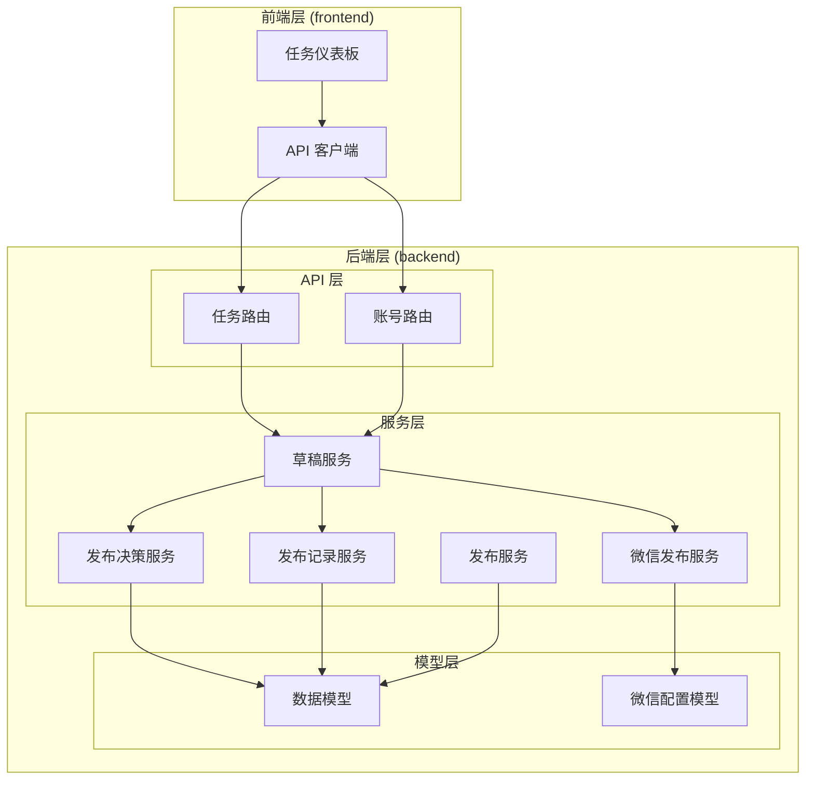
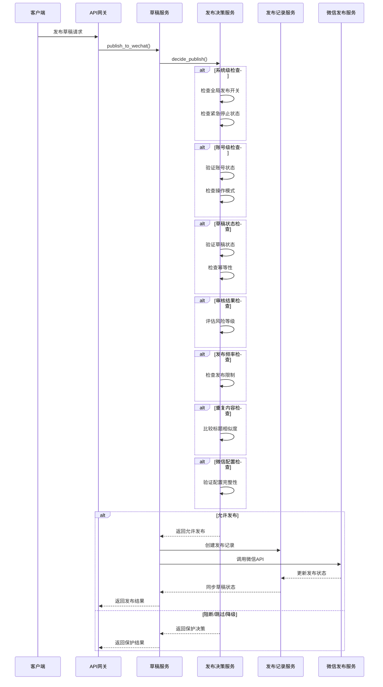
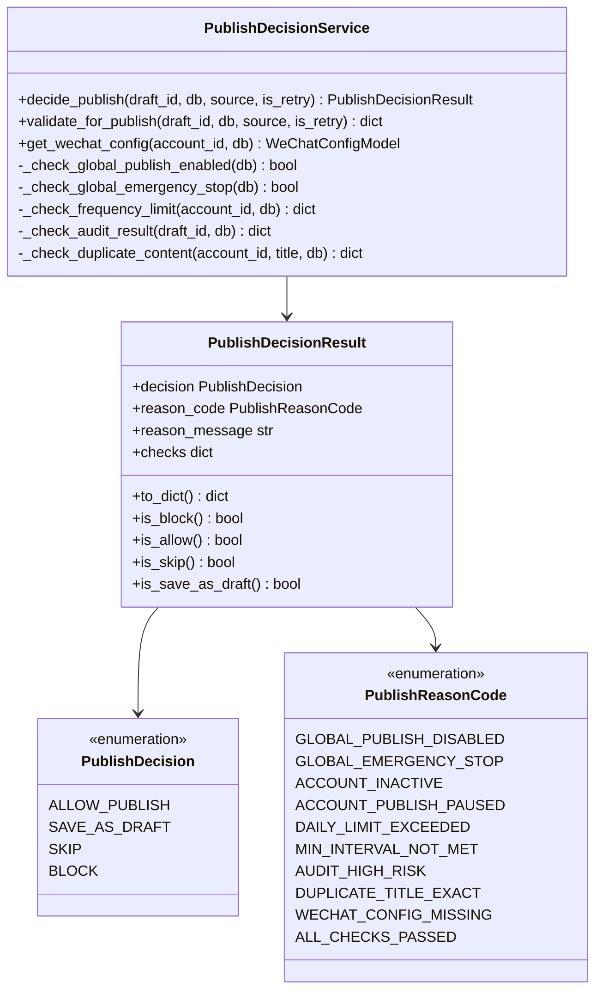
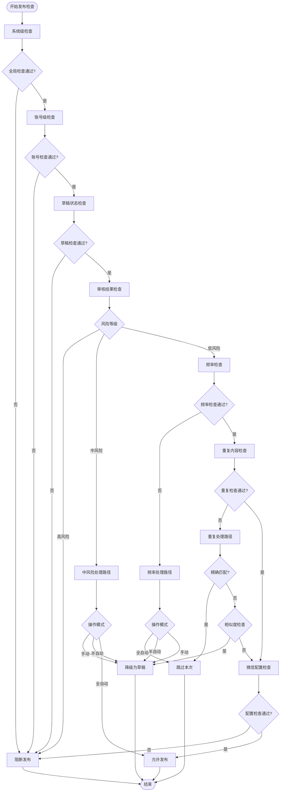
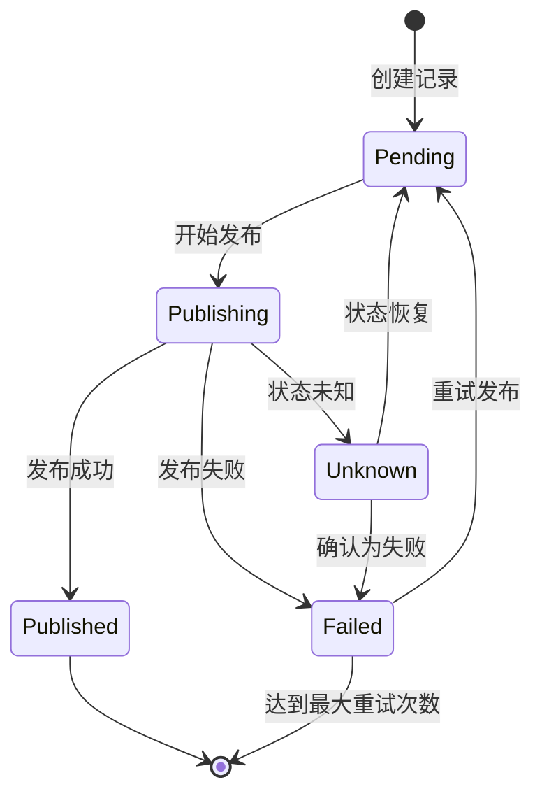
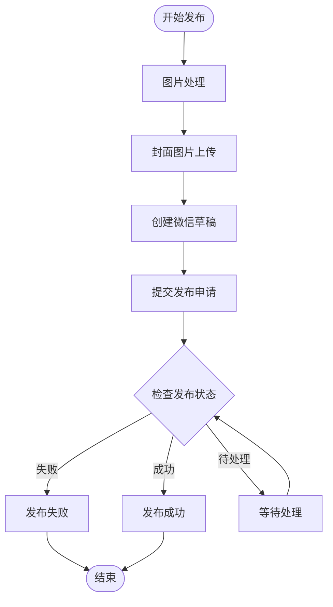
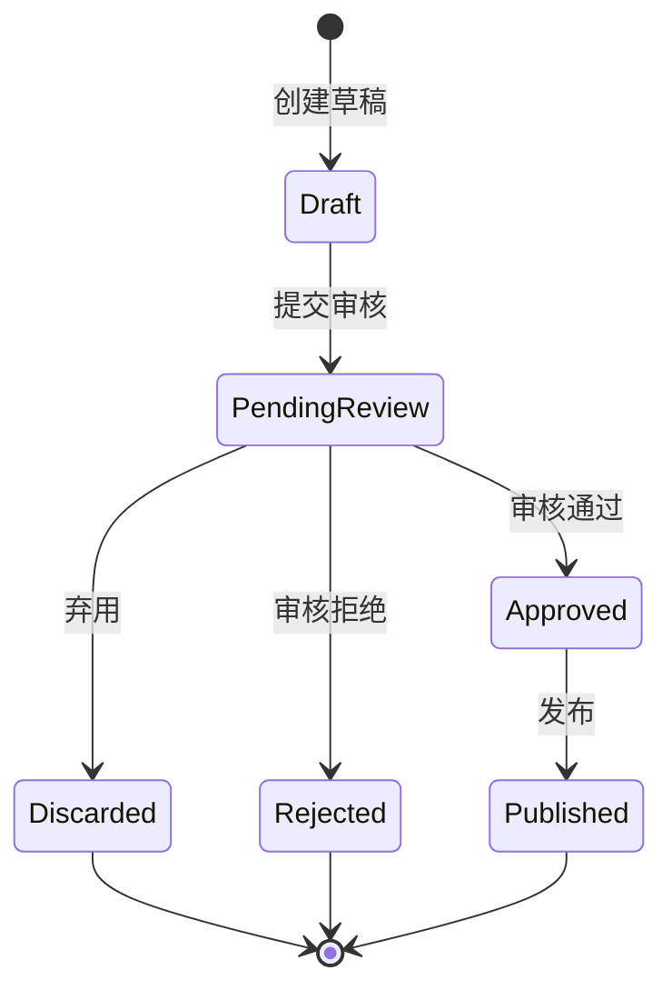
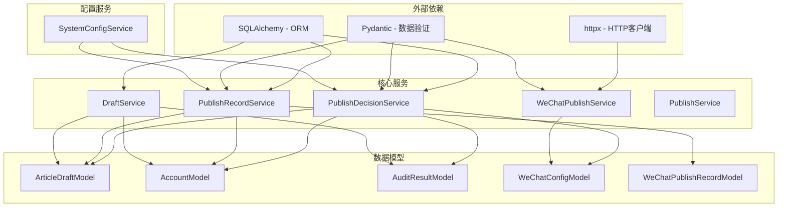

# 发布保护层系统

<cite>
**本文档引用的文件**
- [publish_service.py](file://backend/app/services/publish_service.py)
- [publish_decision_service.py](file://backend/app/services/publish_decision_service.py)
- [publish_record_service.py](file://backend/app/services/publish_record_service.py)
- [wechat_publish_service.py](file://backend/app/services/wechat_publish_service.py)
- [draft_service.py](file://backend/app/services/draft_service.py)
- [tables.py](file://backend/app/models/tables.py)
- [wechat_config.py](file://backend/app/models/wechat_config.py)
- [system_config_service.py](file://backend/app/services/system_config_service.py)
- [task_routes.py](file://backend/app/api/task_routes.py)
- [account_routes.py](file://backend/app/api/account_routes.py)
- [api.ts](file://frontend/lib/api.ts)
- [TaskDashboard.tsx](file://frontend/components/dashboard/TaskDashboard.tsx)
- [ARCHITECTURE.md](file://ARCHITECTURE.md)
</cite>

## 目录
1. [简介](#简介)
2. [项目结构](#项目结构)
3. [核心组件](#核心组件)
4. [架构概览](#架构概览)
5. [详细组件分析](#详细组件分析)
6. [依赖关系分析](#依赖关系分析)
7. [性能考虑](#性能考虑)
8. [故障排除指南](#故障排除指南)
9. [结论](#结论)

## 简介

发布保护层系统是 HotClaw 多智能体公众号内容生产平台的核心组件，负责在正式发布到微信公众号之前进行全面的安全检查和风险控制。该系统通过多层次的验证机制，确保只有符合所有安全标准的内容才能进入发布流程，从而保护平台和用户免受潜在风险的影响。

系统采用"发布决策服务"作为核心控制器，结合"发布记录服务"和"微信发布服务"，构建了一个完整的发布保护生态系统。该系统支持手动、半自动和全自动三种发布模式，每种模式都有相应的安全策略和控制机制。

## 项目结构

HotClaw 项目采用前后端分离的架构设计，发布保护层系统主要位于后端的 `backend/app/services/` 目录中：

**图表来源**
- [ARCHITECTURE.md](file://ARCHITECTURE.md)
- [api.ts](file://frontend/lib/api.ts)

**章节来源**
- [ARCHITECTURE.md](file://ARCHITECTURE.md)
- [api.ts](file://frontend/lib/api.ts)

## 核心组件

发布保护层系统由四个核心组件构成，每个组件都有特定的功能和职责：

### 发布决策服务 (PublishDecisionService)
作为系统的核心控制器，负责执行所有发布前的安全检查。该服务按照严格的顺序执行多项检查，包括系统级开关、账号级检查、草稿状态验证、审核结果门控、发布频率限制、重复内容检查和微信配置验证。

### 发布记录服务 (PublishRecordService)
负责跟踪和管理所有发布操作的生命周期。该服务创建发布记录、更新发布状态、记录错误信息、处理状态回查以及查询草稿和账号的发布历史。

### 微信发布服务 (WeChatPublishService)
封装了与微信官方 API 的交互，包括图片处理、草稿创建、文章发布等功能。该服务提供了完整的发布流程，从内容处理到最终发布。

### 草稿服务 (DraftService)
管理草稿的完整生命周期，包括草稿创建、状态转换、发布确认和发布重试等功能。该服务还集成了发布保护层的所有检查机制。

**章节来源**
- [publish_decision_service.py](file://backend/app/services/publish_decision_service.py)
- [publish_record_service.py](file://backend/app/services/publish_record_service.py)
- [wechat_publish_service.py](file://backend/app/services/wechat_publish_service.py)
- [draft_service.py](file://backend/app/services/draft_service.py)

## 架构概览

发布保护层系统采用分层架构设计，通过明确的职责分离实现了高度的模块化和可维护性：

**图表来源**
- [draft_service.py](file://backend/app/services/draft_service.py)
- [publish_decision_service.py](file://backend/app/services/publish_decision_service.py)
- [publish_record_service.py](file://backend/app/services/publish_record_service.py)
- [wechat_publish_service.py](file://backend/app/services/wechat_publish_service.py)

发布保护层系统的工作流程体现了"先保护，后发布"的设计理念，确保每个发布请求都要经过全面的安全审查。

**章节来源**
- [draft_service.py](file://backend/app/services/draft_service.py)
- [publish_decision_service.py](file://backend/app/services/publish_decision_service.py)

## 详细组件分析

### 发布决策服务详细分析

发布决策服务是整个发布保护层系统的核心，它实现了复杂的多层检查机制：

#### 决策类型和状态管理

**图表来源**
- [publish_decision_service.py](file://backend/app/services/publish_decision_service.py)

#### 检查流程详解

发布决策服务按照严格的顺序执行检查，每个检查都有特定的目的和影响：

1. **系统级开关检查**：验证全局发布开关和紧急停止状态
2. **账号级检查**：验证账号状态、操作模式和发布权限
3. **草稿状态检查**：验证草稿的完整性、状态和幂等性
4. **审核结果门控**：根据审核风险等级决定发布策略
5. **发布频率限制**：检查每日发布限制和最小间隔时间
6. **重复内容检查**：防止重复或相似内容的发布
7. **微信配置检查**：验证微信公众号配置的完整性和有效性

#### 风险评估算法

系统使用多层次的风险评估机制：

**图表来源**
- [publish_decision_service.py](file://backend/app/services/publish_decision_service.py)

**章节来源**
- [publish_decision_service.py](file://backend/app/services/publish_decision_service.py)

### 发布记录服务详细分析

发布记录服务负责维护发布操作的完整历史和状态跟踪：

#### 发布状态管理

**图表来源**
- [publish_record_service.py](file://backend/app/services/publish_record_service.py)

#### 发布记录生命周期

发布记录服务管理着发布操作的完整生命周期，从创建到完成或失败的全过程：

1. **创建发布记录**：初始化发布状态为 `pending`
2. **开始发布**：状态切换到 `publishing`
3. **发布成功**：更新为 `published` 状态并记录相关信息
4. **发布失败**：更新为 `failed` 状态并记录错误信息
5. **状态回查**：定期检查微信官方 API 的发布状态
6. **重试机制**：支持最多3次的自动重试

#### 状态同步机制

发布记录服务实现了双向状态同步：

- **从发布记录到草稿**：根据最新的发布记录更新草稿的发布状态
- **从草稿到账号**：同步草稿状态到关联的账号信息

**章节来源**
- [publish_record_service.py](file://backend/app/services/publish_record_service.py)

### 微信发布服务详细分析

微信发布服务封装了与微信官方 API 的所有交互：

#### 发布流程组件

**图表来源**
- [wechat_publish_service.py](file://backend/app/services/wechat_publish_service.py)

#### 微信 API 集成

微信发布服务集成了多个微信官方 API：

1. **图片处理 API**：将外链图片转换为微信 CDN URL
2. **媒体上传 API**：上传封面图片到微信服务器
3. **草稿创建 API**：在微信服务器创建文章草稿
4. **发布提交 API**：提交草稿进行正式发布
5. **状态查询 API**：查询发布的实时状态

#### 错误处理和重试机制

微信发布服务实现了完善的错误处理机制：

- **令牌错误**：自动刷新访问令牌并重试
- **网络错误**：支持有限次数的自动重试
- **业务错误**：根据错误类型决定是否重试
- **超时处理**：设置合理的超时时间避免长时间阻塞

**章节来源**
- [wechat_publish_service.py](file://backend/app/services/wechat_publish_service.py)

### 草稿服务详细分析

草稿服务管理着内容创作的完整生命周期：

#### 草稿状态转换

**图表来源**
- [draft_service.py](file://backend/app/services/draft_service.py)

#### 发布保护集成

草稿服务深度集成了发布保护层的所有功能：

1. **发布决策集成**：在发布前调用发布决策服务
2. **发布记录管理**：自动创建和管理发布记录
3. **状态同步**：与发布记录和服务状态保持同步
4. **重试处理**：支持发布失败后的自动重试

#### 多模式支持

系统支持三种不同的发布模式：

- **手动模式**：需要人工确认才能发布
- **半自动模式**：需要人工确认，但可以自动跳过某些检查
- **全自动模式**：自动完成所有检查并直接发布

**章节来源**
- [draft_service.py](file://backend/app/services/draft_service.py)

## 依赖关系分析

发布保护层系统的依赖关系体现了清晰的分层架构：

**图表来源**
- [publish_decision_service.py](file://backend/app/services/publish_decision_service.py)
- [publish_record_service.py](file://backend/app/services/publish_record_service.py)
- [wechat_publish_service.py](file://backend/app/services/wechat_publish_service.py)
- [draft_service.py](file://backend/app/services/draft_service.py)
- [system_config_service.py](file://backend/app/services/system_config_service.py)

### 核心依赖关系

1. **服务间依赖**：草稿服务依赖发布决策服务和发布记录服务
2. **数据模型依赖**：所有服务都依赖于数据模型进行数据持久化
3. **配置依赖**：发布决策服务依赖系统配置服务进行全局设置检查
4. **外部服务依赖**：微信发布服务依赖微信官方 API

### 循环依赖避免

系统通过精心设计的依赖关系避免了循环依赖：

- 服务层不直接依赖外部 API
- 数据模型保持纯粹的数据结构
- 配置服务提供单一事实来源

**章节来源**
- [publish_decision_service.py](file://backend/app/services/publish_decision_service.py)
- [publish_record_service.py](file://backend/app/services/publish_record_service.py)
- [wechat_publish_service.py](file://backend/app/services/wechat_publish_service.py)
- [draft_service.py](file://backend/app/services/draft_service.py)

## 性能考虑

发布保护层系统在设计时充分考虑了性能优化：

### 异步处理

系统大量使用异步编程模式：

- **数据库操作**：使用 SQLAlchemy AsyncSession 进行异步数据库访问
- **HTTP 请求**：使用 httpx.AsyncClient 进行异步网络请求
- **并发处理**：支持多个发布请求的同时处理

### 缓存策略

- **访问令牌缓存**：微信访问令牌的缓存和自动刷新
- **配置缓存**：系统配置的内存缓存减少数据库查询
- **状态缓存**：发布状态的本地缓存提高查询性能

### 连接池管理

- **数据库连接池**：合理配置连接池大小避免资源浪费
- **HTTP 连接池**：httpx 自动管理连接池提高网络请求效率

### 内存优化

- **分页查询**：大数据量查询使用分页避免内存溢出
- **延迟加载**：使用 SQLAlchemy 的延迟加载优化查询性能
- **对象复用**：合理复用对象避免频繁的内存分配

## 故障排除指南

### 常见问题诊断

#### 发布被阻断

当发布被阻断时，首先检查发布决策服务的返回结果：

1. **检查系统配置**：确认全局发布开关和紧急停止状态
2. **验证账号状态**：确认账号处于激活状态且发布权限正常
3. **检查审核结果**：查看审核风险等级和具体问题
4. **验证微信配置**：确认微信公众号配置完整有效

#### 发布记录异常

发布记录异常通常表现为状态不一致：

1. **检查数据库连接**：确认数据库连接正常
2. **验证事务处理**：确保数据库事务正确提交
3. **检查时间同步**：确认系统时间与微信 API 时间同步

#### 微信 API 错误

微信 API 错误是最常见的发布失败原因：

1. **令牌错误**：检查微信应用 ID 和密钥配置
2. **网络超时**：检查网络连接和防火墙设置
3. **业务错误**：根据微信返回的具体错误代码处理

### 调试工具和方法

#### 日志分析

系统提供了丰富的日志信息：

- **结构化日志**：使用结构化日志便于分析和查询
- **错误日志**：详细的错误信息和堆栈跟踪
- **性能日志**：关键操作的执行时间和性能指标

#### 状态监控

- **发布状态监控**：实时监控发布队列和状态变化
- **系统健康检查**：定期检查各个组件的健康状态
- **告警机制**：异常情况下的自动告警通知

**章节来源**
- [publish_decision_service.py](file://backend/app/services/publish_decision_service.py)
- [publish_record_service.py](file://backend/app/services/publish_record_service.py)
- [wechat_publish_service.py](file://backend/app/services/wechat_publish_service.py)

## 结论

发布保护层系统通过多层次的安全检查和严格的流程控制，为 HotClaw 平台提供了可靠的内容发布安全保障。系统的设计体现了以下核心特点：

### 架构优势

1. **模块化设计**：清晰的职责分离使得系统易于维护和扩展
2. **可配置性**：通过系统配置实现灵活的安全策略调整
3. **可观测性**：完整的日志记录和状态跟踪便于问题诊断
4. **可靠性**：多重错误处理和重试机制确保系统稳定性

### 安全保障

系统通过以下机制确保发布安全：

- **多层检查**：从系统级到内容级的全方位安全检查
- **风险评估**：智能化的风险评估和分级处理
- **状态同步**：实时的状态同步确保数据一致性
- **审计追踪**：完整的操作记录便于追溯和审计

### 扩展性考虑

系统为未来的功能扩展预留了充足的空间：

- **插件化架构**：支持新的检查机制和处理策略
- **配置驱动**：通过配置实现功能的动态调整
- **API 设计**：清晰的 API 接口便于第三方集成
- **监控扩展**：完善的监控体系支持大规模部署

发布保护层系统不仅满足了当前的功能需求，更为平台的长期发展奠定了坚实的基础。通过持续的优化和完善，该系统将继续为 HotClaw 平台提供可靠的内容发布安全保障。