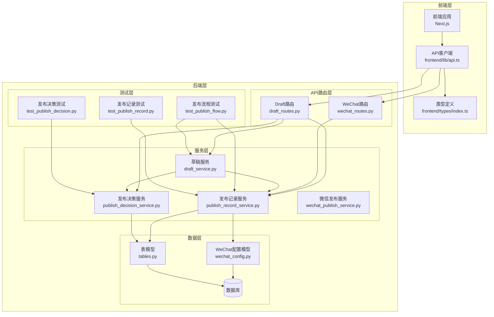
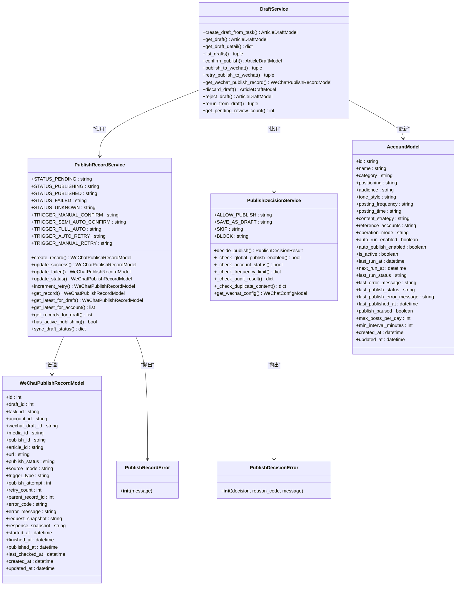
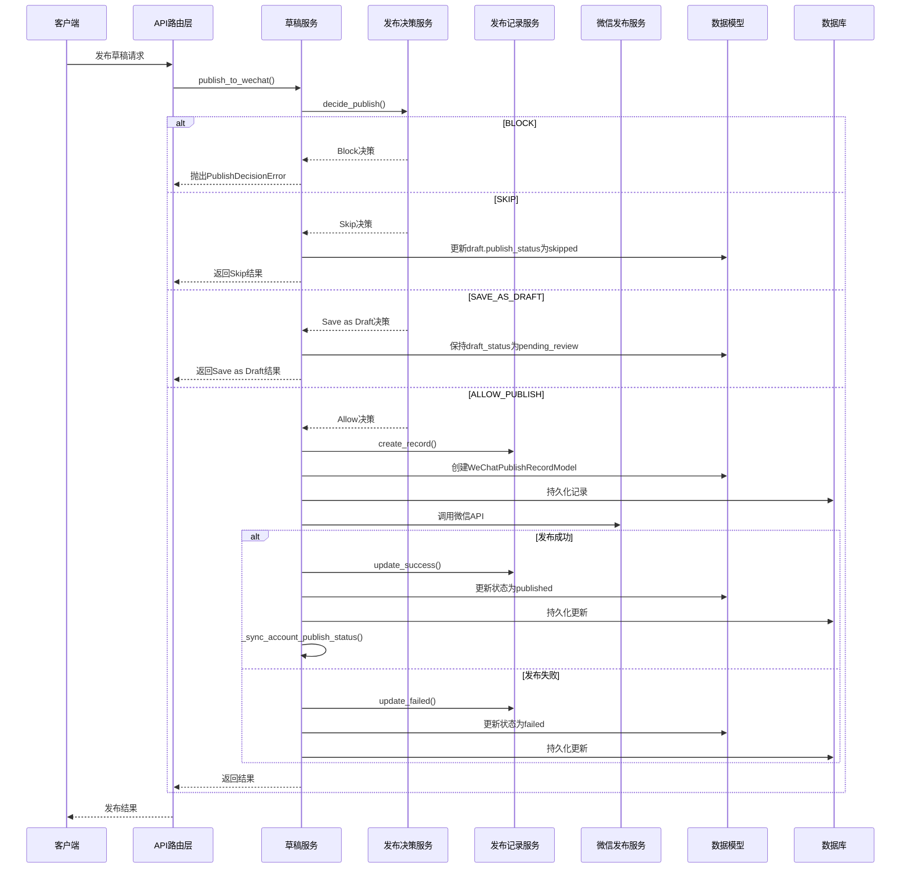
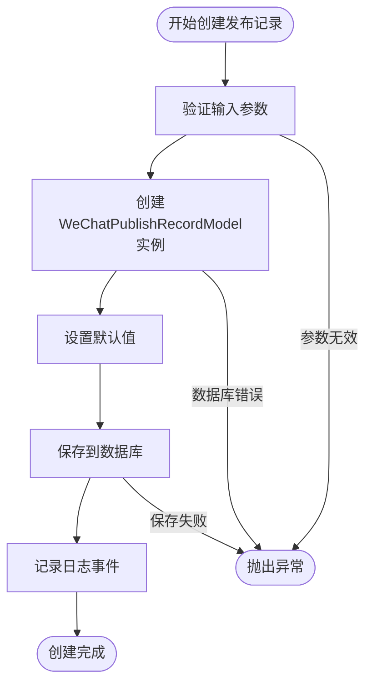
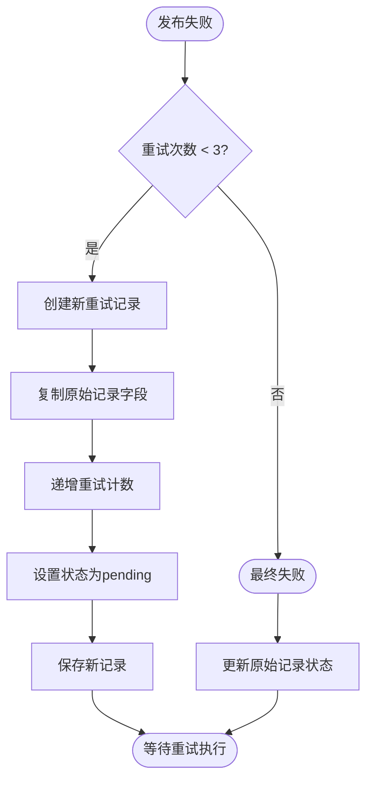
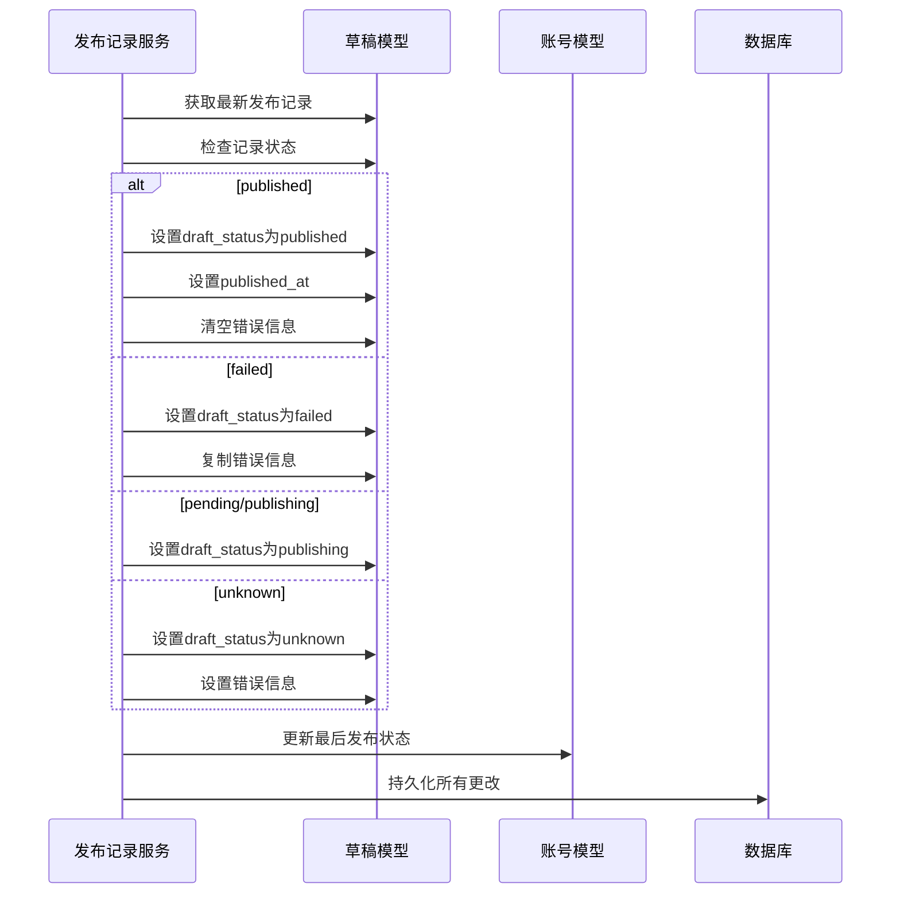
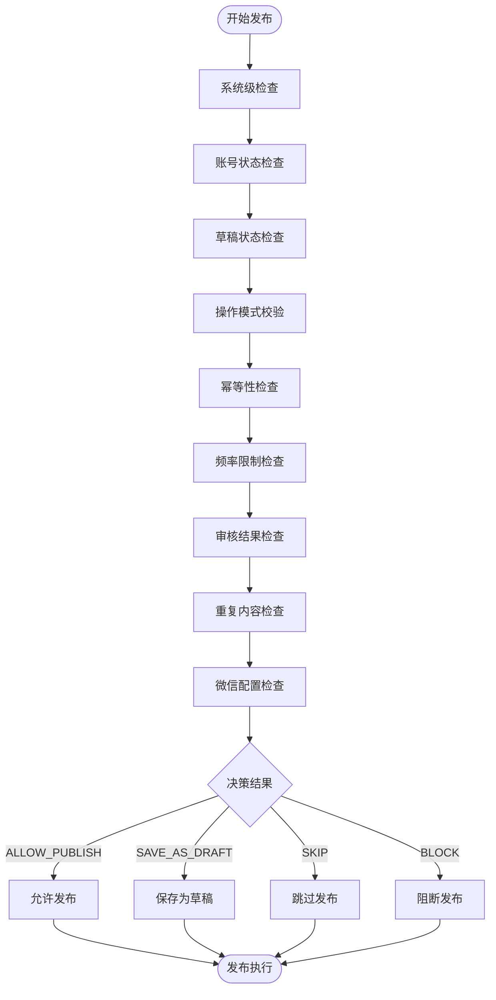
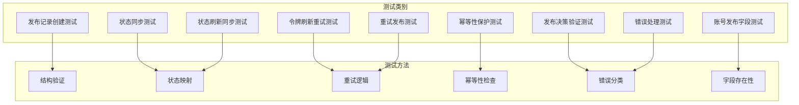
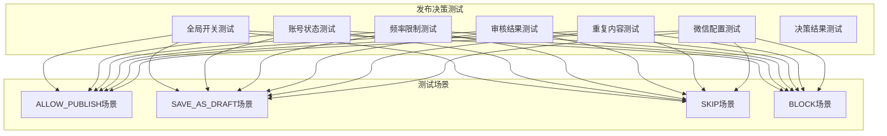
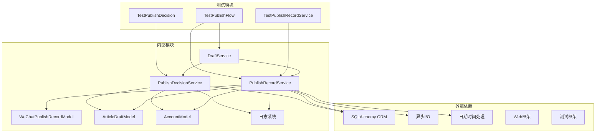

# 发布记录服务

<cite>
**本文档引用的文件**
- [publish_record_service.py](file://backend/app/services/publish_record_service.py)
- [publish_decision_service.py](file://backend/app/services/publish_decision_service.py)
- [draft_service.py](file://backend/app/services/draft_service.py)
- [wechat_config.py](file://backend/app/models/wechat_config.py)
- [tables.py](file://backend/app/models/tables.py)
- [draft_routes.py](file://backend/app/api/draft_routes.py)
- [wechat_routes.py](file://backend/app/api/wechat_routes.py)
- [test_publish_flow.py](file://backend/tests/test_publish_flow.py)
- [test_publish_record.py](file://backend/tests/test_publish_record.py)
- [test_publish_decision.py](file://backend/tests/test_publish_decision.py)
- [draft.py](file://backend/app/schemas/draft.py)
- [index.ts](file://frontend/types/index.ts)
- [api.ts](file://frontend/lib/api.ts)
</cite>

## 更新摘要
**变更内容**
- 新增发布保护层系统，集成发布决策服务进行前置校验
- 增强发布状态管理和失败补偿机制，包括重试逻辑、令牌刷新重试、状态同步等功能
- 改进幂等性保护和重试机制，支持最多3次重试
- 数据库schema更新，AccountModel新增发布跟踪字段
- 前端类型定义扩展，增加发布记录相关类型
- 改进状态同步机制，支持更精确的状态映射

## 目录
1. [简介](#简介)
2. [项目结构](#项目结构)
3. [核心组件](#核心组件)
4. [架构概览](#架构概览)
5. [详细组件分析](#详细组件分析)
6. [测试增强](#测试增强)
7. [依赖关系分析](#依赖关系分析)
8. [性能考虑](#性能考虑)
9. [故障排除指南](#故障排除指南)
10. [结论](#结论)

## 简介

发布记录服务是HotClaw内容发布平台的核心组件，负责统一管理所有微信公众号文章发布的生命周期。该服务提供了完整的发布状态跟踪、错误处理、重试机制和状态同步功能，确保发布过程的可靠性和可追溯性。

发布记录服务主要解决以下关键问题：
- 统一管理发布状态的完整生命周期
- 提供幂等性保护，防止重复发布
- 实现智能重试机制，提高发布成功率
- 支持状态回查和同步，保持数据一致性
- 提供详细的发布历史记录，便于审计和监控

**更新** 新增了完整的测试套件，覆盖发布流程的各个方面，包括幂等性保护、重试机制、状态同步等功能。同时集成了发布决策服务，建立了完整的发布保护层系统。

## 项目结构

发布记录服务在整体架构中的位置如下：



**图表来源**
- [publish_record_service.py:1-473](file://backend/app/services/publish_record_service.py#L1-L473)
- [publish_decision_service.py:1-752](file://backend/app/services/publish_decision_service.py#L1-L752)
- [draft_service.py:1-864](file://backend/app/services/draft_service.py#L1-L864)
- [wechat_config.py:1-100](file://backend/app/models/wechat_config.py#L1-L100)
- [tables.py:1-393](file://backend/app/models/tables.py#L1-L393)
- [test_publish_flow.py:1-306](file://backend/tests/test_publish_flow.py#L1-L306)
- [test_publish_record.py:1-169](file://backend/tests/test_publish_record.py#L1-L169)
- [test_publish_decision.py:1-500](file://backend/tests/test_publish_decision.py#L1-L500)

**章节来源**
- [publish_record_service.py:1-473](file://backend/app/services/publish_record_service.py#L1-L473)
- [publish_decision_service.py:1-752](file://backend/app/services/publish_decision_service.py#L1-L752)
- [draft_service.py:1-864](file://backend/app/services/draft_service.py#L1-L864)
- [wechat_config.py:1-100](file://backend/app/models/wechat_config.py#L1-L100)
- [tables.py:1-393](file://backend/app/models/tables.py#L1-L393)

## 核心组件

发布记录服务包含以下核心组件：

### 主要类结构



**图表来源**
- [publish_record_service.py:30-473](file://backend/app/services/publish_record_service.py#L30-L473)
- [publish_decision_service.py:128-752](file://backend/app/services/publish_decision_service.py#L128-L752)
- [draft_service.py:34-864](file://backend/app/services/draft_service.py#L34-L864)
- [wechat_config.py:34-100](file://backend/app/models/wechat_config.py#L34-L100)
- [tables.py:28-62](file://backend/app/models/tables.py#L28-L62)

### 发布状态管理

发布记录服务定义了完整的发布状态体系：

| 状态类型 | 描述 | 用途 |
|---------|------|------|
| pending | 待发布 | 初始状态，等待发布执行 |
| publishing | 发布中 | 正在进行微信API调用 |
| published | 已发布 | 发布成功，文章已上线 |
| failed | 发布失败 | 发布过程中出现错误 |
| unknown | 状态未知 | 无法确定当前状态 |

### 触发类型分类

服务支持多种发布触发方式：

| 触发类型 | 描述 | 使用场景 |
|---------|------|----------|
| manual_confirm | 手动确认 | 用户手动点击发布按钮 |
| semi_auto_confirm | 半自动确认 | 配置为半自动模式的确认发布 |
| full_auto | 全自动 | 完全自动化的发布流程 |
| auto_retry | 自动重试 | 系统自动触发的重试发布 |
| manual_retry | 手动重试 | 用户手动触发的重试发布 |

**更新** 新增了更精确的状态映射，特别是pending状态在刷新状态时会被映射为publishing状态。

**章节来源**
- [publish_record_service.py:42-55](file://backend/app/services/publish_record_service.py#L42-L55)
- [publish_decision_service.py:35-41](file://backend/app/services/publish_decision_service.py#L35-L41)
- [draft_service.py:24-31](file://backend/app/services/draft_service.py#L24-L31)

## 架构概览

发布记录服务采用分层架构设计，确保职责分离和代码可维护性：



**图表来源**
- [draft_routes.py:239-289](file://backend/app/api/draft_routes.py#L239-L289)
- [draft_service.py:288-510](file://backend/app/services/draft_service.py#L288-L510)
- [publish_record_service.py:56-170](file://backend/app/services/publish_record_service.py#L56-L170)
- [publish_decision_service.py:159-470](file://backend/app/services/publish_decision_service.py#L159-L470)

### 数据流分析

发布记录服务的数据流遵循严格的顺序控制：

1. **决策阶段**：发布决策服务进行前置校验，确保发布条件满足
2. **创建阶段**：验证发布条件，创建初始发布记录
3. **执行阶段**：调用微信API进行实际发布
4. **更新阶段**：根据API响应更新发布状态
5. **同步阶段**：同步草稿和账号状态信息

**更新** 新增了发布保护层系统，发布决策服务在真实发布前进行多重校验，包括系统开关、账号状态、频率限制、审核结果、重复内容等检查。

**章节来源**
- [draft_routes.py:239-289](file://backend/app/api/draft_routes.py#L239-L289)
- [draft_service.py:288-510](file://backend/app/services/draft_service.py#L288-L510)
- [publish_decision_service.py:159-470](file://backend/app/services/publish_decision_service.py#L159-L470)

## 详细组件分析

### 发布记录创建机制

发布记录创建是整个发布流程的起点，确保每个发布操作都有完整的跟踪记录：



**图表来源**
- [publish_record_service.py:56-107](file://backend/app/services/publish_record_service.py#L56-L107)

#### 关键特性

1. **完整性检查**：确保所有必需字段都已设置
2. **时间戳管理**：自动记录创建和开始时间
3. **状态初始化**：默认设置为pending状态
4. **事务保证**：使用数据库事务确保数据一致性

### 状态更新机制

发布记录的状态更新提供了灵活的状态转换能力：

```mermaid
stateDiagram-v2
[*] --> Pending : 创建记录
Pending --> Publishing : 开始发布
Publishing --> Published : 发布成功
Publishing --> Failed : 发布失败
Publishing --> Unknown : 状态不确定
Published --> [*]
Failed --> [*]
Unknown --> [*]
state Publishing {
[*] --> AutoRetry : 自动重试
[*] --> ManualRetry : 手动重试
AutoRetry --> Publishing : 重试成功
ManualRetry --> Publishing : 重试成功
}
```

**图表来源**
- [publish_record_service.py:109-263](file://backend/app/services/publish_record_service.py#L109-L263)

#### 状态转换规则

1. **正常流程**：pending → publishing → published
2. **失败处理**：pending → publishing → failed
3. **重试机制**：failed → pending（重试）
4. **未知状态**：用于处理API响应异常的情况

### 重试机制实现

发布记录服务实现了智能的重试机制，支持最多3次重试：



**图表来源**
- [publish_record_service.py:265-317](file://backend/app/services/publish_record_service.py#L265-L317)

#### 重试策略

1. **限制次数**：最多允许3次重试
2. **状态检查**：只有failed状态才能重试
3. **记录关联**：新记录通过parent_record_id关联原始记录
4. **计数管理**：自动递增publish_attempt和retry_count

**更新** 新增了token错误的特殊重试处理，支持最多一次token刷新重试。

### 状态同步机制

发布记录服务提供了双向状态同步功能：



**图表来源**
- [publish_record_service.py:370-454](file://backend/app/services/publish_record_service.py#L370-L454)

#### 同步范围

1. **草稿状态同步**：更新ArticleDraftModel的相关字段
2. **账号状态同步**：更新AccountModel的最后发布信息
3. **时间戳同步**：更新相应的发布时间戳

**更新** 新增了更精确的状态映射，pending状态在刷新时被映射为publishing状态。

**章节来源**
- [publish_record_service.py:370-454](file://backend/app/services/publish_record_service.py#L370-L454)

### 发布决策服务集成

**更新** 新增了发布决策服务，建立了完整的发布保护层系统：



**图表来源**
- [publish_decision_service.py:159-470](file://backend/app/services/publish_decision_service.py#L159-L470)

#### 决策类型

1. **ALLOW_PUBLISH**：所有检查通过，允许发布
2. **SAVE_AS_DRAFT**：降级为草稿（中等风险等）
3. **SKIP**：跳过本次（频率限制等）
4. **BLOCK**：直接阻断（配置缺失、高风险等）

**章节来源**
- [publish_decision_service.py:159-470](file://backend/app/services/publish_decision_service.py#L159-L470)

## 测试增强

**更新** 新增了完整的测试套件，覆盖发布流程的各个方面：

### 测试套件概述

新增的 `test_publish_flow.py` 包含30个测试用例，全面验证发布流程的正确性：



**图表来源**
- [test_publish_flow.py:18-306](file://backend/tests/test_publish_flow.py#L18-L306)

### 核心测试功能

1. **发布记录创建验证**：确保每次真实发布都会创建发布记录
2. **状态同步验证**：验证发布成功/失败时三者的状态同步
3. **令牌刷新重试**：测试token过期时的自动刷新和重试
4. **重试发布机制**：验证失败状态下的重试逻辑
5. **幂等性保护**：确保已发布和活跃发布状态阻止重复发布
6. **状态刷新同步**：验证从微信状态到本地状态的同步
7. **发布决策验证**：测试各种发布条件的验证逻辑
8. **错误处理机制**：区分可重试和不可重试的错误类型
9. **账号发布字段**：验证AccountModel的发布跟踪字段

**章节来源**
- [test_publish_flow.py:1-306](file://backend/tests/test_publish_flow.py#L1-L306)

### 发布决策测试

**更新** 新增了发布决策服务的专门测试：



**图表来源**
- [test_publish_decision.py:1-500](file://backend/tests/test_publish_decision.py#L1-L500)

**章节来源**
- [test_publish_decision.py:1-500](file://backend/tests/test_publish_decision.py#L1-L500)

## 依赖关系分析

发布记录服务的依赖关系体现了清晰的分层架构：



**图表来源**
- [publish_record_service.py:12-22](file://backend/app/services/publish_record_service.py#L12-L22)
- [publish_decision_service.py:20-32](file://backend/app/services/publish_decision_service.py#L20-L32)
- [draft_service.py:1-22](file://backend/app/services/draft_service.py#L1-L22)
- [test_publish_record.py:9-13](file://backend/tests/test_publish_record.py#L9-L13)
- [test_publish_flow.py:3-16](file://backend/tests/test_publish_flow.py#L3-L16)
- [test_publish_decision.py:1-500](file://backend/tests/test_publish_decision.py#L1-L500)

### 内部依赖关系

1. **模型依赖**：服务依赖于WeChatPublishRecordModel、ArticleDraftModel和AccountModel
2. **工具依赖**：使用SQLAlchemy进行数据库操作，使用datetime处理时间戳
3. **日志依赖**：通过get_logger获取日志记录器
4. **服务依赖**：DraftService依赖于PublishRecordService进行发布记录管理
5. **决策集成**：DraftService集成PublishDecisionService进行前置校验

### 外部依赖关系

1. **数据库依赖**：依赖AsyncSession进行异步数据库操作
2. **配置依赖**：依赖系统配置进行运行时参数调整
3. **异常处理**：依赖自定义异常类型进行错误传播
4. **测试依赖**：依赖PyTest框架进行单元测试

**章节来源**
- [publish_record_service.py:12-22](file://backend/app/services/publish_record_service.py#L12-L22)
- [publish_decision_service.py:20-32](file://backend/app/services/publish_decision_service.py#L20-L32)
- [draft_service.py:1-22](file://backend/app/services/draft_service.py#L1-L22)
- [test_publish_record.py:9-13](file://backend/tests/test_publish_record.py#L9-L13)

## 性能考虑

发布记录服务在设计时充分考虑了性能优化：

### 数据库性能优化

1. **索引策略**：对常用查询字段建立索引
   - draft_id: 主要查询条件
   - account_id: 账号维度查询
   - created_at: 时间排序查询

2. **批量操作**：支持批量查询和更新操作
3. **连接池管理**：合理配置数据库连接池大小

### 缓存策略

1. **内存缓存**：对频繁访问的发布记录进行缓存
2. **查询优化**：使用select加载策略减少N+1查询
3. **懒加载**：避免不必要的关联查询

### 异步处理

1. **异步I/O**：使用async/await模式提高并发性能
2. **数据库事务**：合理使用事务减少锁竞争
3. **资源管理**：正确管理数据库连接和会话

**更新** 新增了测试驱动的性能优化，通过测试验证各种性能场景。

## 故障排除指南

### 常见问题及解决方案

#### 发布记录创建失败

**症状**：创建发布记录时报错
**可能原因**：
1. 数据库连接异常
2. 必填字段缺失
3. 数据类型不匹配

**解决方案**：
1. 检查数据库连接状态
2. 验证所有必填字段
3. 确认数据类型正确性

#### 状态更新异常

**症状**：发布状态无法更新
**可能原因**：
1. 记录不存在
2. 状态转换非法
3. 数据库事务冲突

**解决方案**：
1. 确认记录ID正确性
2. 检查状态转换规则
3. 重试数据库操作

#### 重试机制失效

**症状**：重试功能不工作
**可能原因**：
1. 重试次数达到上限
2. 原始记录状态不正确
3. 数据库约束冲突

**解决方案**：
1. 检查重试次数限制
2. 验证原始记录状态
3. 查看数据库约束错误

#### 幂等性保护失效

**症状**：重复发布请求未被阻止
**可能原因**：
1. has_active_publishing检查逻辑错误
2. 状态检查不完整
3. 数据库状态不同步

**解决方案**：
1. 验证active publishing状态检查
2. 确认所有阻塞状态都被检查
3. 同步数据库状态

#### 发布决策阻断

**症状**：发布被意外阻断
**可能原因**：
1. 系统紧急停止开启
2. 账号状态异常
3. 频率限制触发
4. 审核结果高风险

**解决方案**：
1. 检查系统配置状态
2. 验证账号配置和状态
3. 检查发布频率设置
4. 处理审核结果问题

### 调试技巧

1. **日志分析**：查看服务日志中的详细错误信息
2. **数据库检查**：直接查询数据库验证数据状态
3. **单元测试**：运行测试用例验证功能正确性
4. **状态追踪**：使用测试套件验证状态转换逻辑

**章节来源**
- [test_publish_record.py:16-169](file://backend/tests/test_publish_record.py#L16-L169)
- [test_publish_flow.py:150-306](file://backend/tests/test_publish_flow.py#L150-L306)

## 结论

发布记录服务作为HotClaw平台的核心组件，提供了完整、可靠的发布状态管理功能。通过精心设计的架构和完善的错误处理机制，该服务确保了发布流程的稳定性和可追溯性。

### 主要优势

1. **完整的生命周期管理**：从创建到完成的全流程跟踪
2. **智能重试机制**：提高发布成功率，支持token刷新重试
3. **状态同步功能**：保持多实体间的数据一致性
4. **幂等性保护**：防止重复发布和状态冲突
5. **详细的审计记录**：提供完整的发布历史
6. **全面的测试覆盖**：30个测试用例确保功能正确性
7. **发布保护层系统**：集成发布决策服务进行前置校验

### 技术特点

1. **异步架构**：支持高并发发布操作
2. **事务保证**：确保数据一致性和完整性
3. **灵活扩展**：易于添加新的状态和功能
4. **性能优化**：通过索引和缓存提升查询效率
5. **测试驱动开发**：通过测试验证功能正确性
6. **发布保护层**：多重校验确保发布质量

**更新** 新增的测试套件显著提升了服务的可靠性，确保了发布流程的各个方面的正确性。同时集成的发布决策服务建立了完整的发布保护层系统，进一步提高了系统的安全性和稳定性。

发布记录服务为HotClaw平台的内容发布功能奠定了坚实的技术基础，为用户提供可靠的内容发布体验。