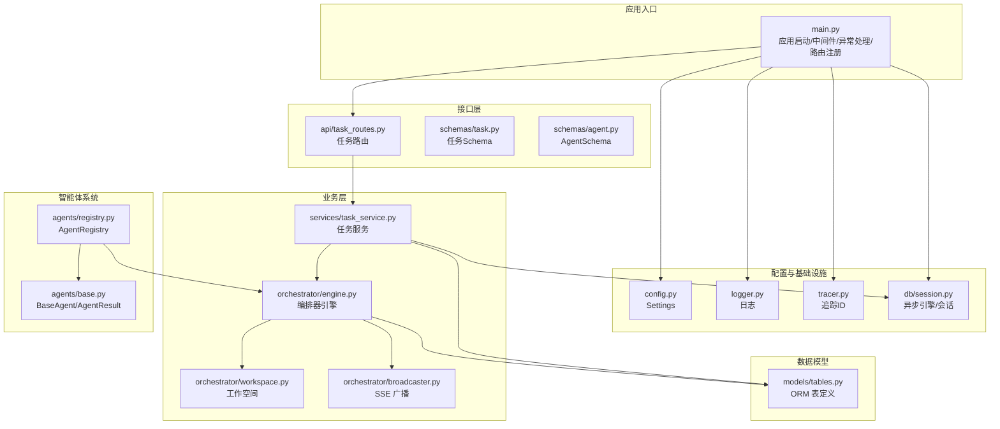
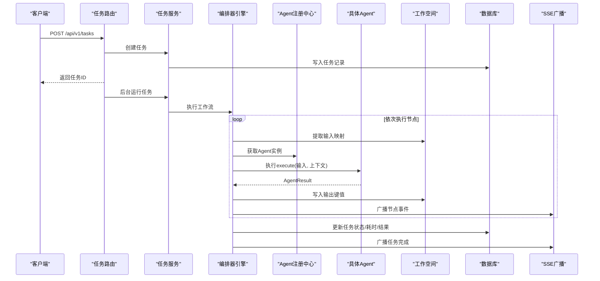
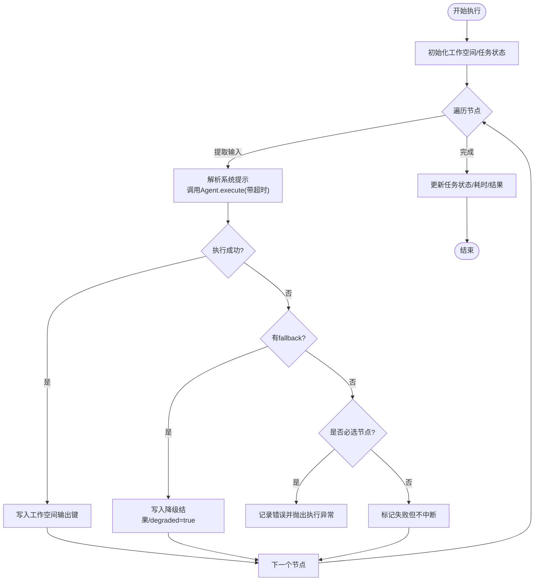
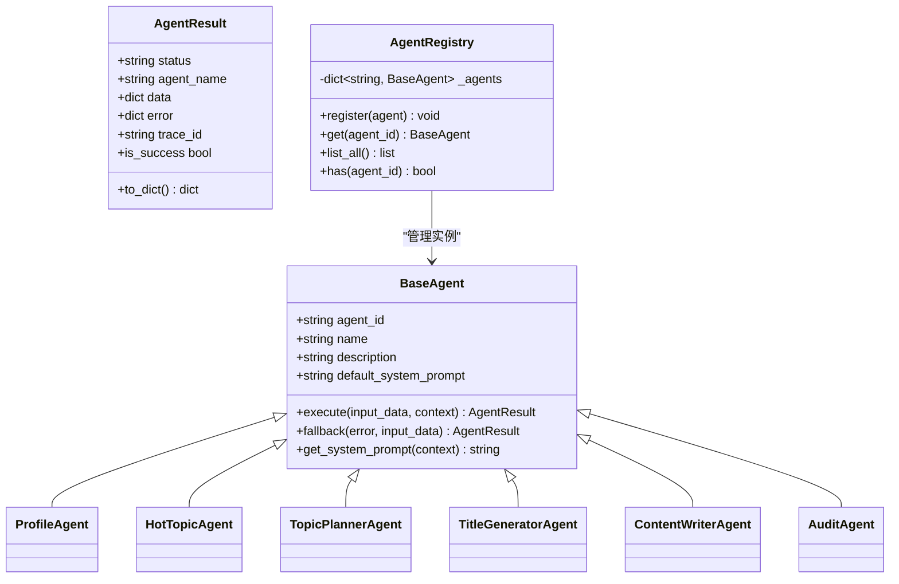
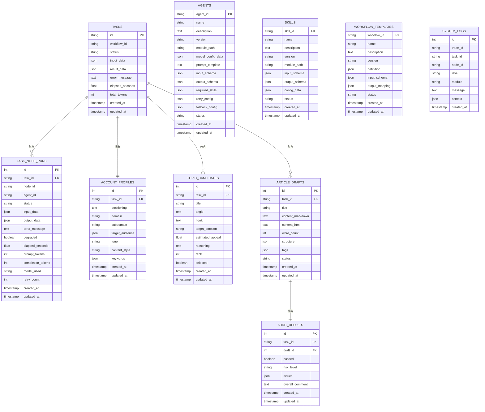
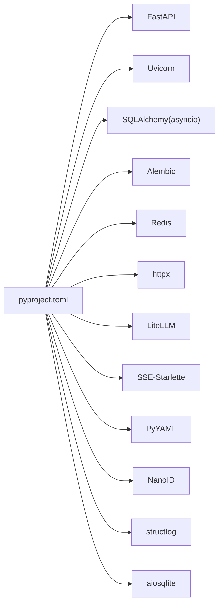

# 后端开发

<cite>
**本文引用的文件**
- [backend/app/main.py](file://backend/app/main.py)
- [backend/pyproject.toml](file://backend/pyproject.toml)
- [backend/app/core/config.py](file://backend/app/core/config.py)
- [backend/app/db/session.py](file://backend/app/db/session.py)
- [backend/app/orchestrator/engine.py](file://backend/app/orchestrator/engine.py)
- [backend/app/orchestrator/workspace.py](file://backend/app/orchestrator/workspace.py)
- [backend/app/orchestrator/broadcaster.py](file://backend/app/orchestrator/broadcaster.py)
- [backend/app/agents/base.py](file://backend/app/agents/base.py)
- [backend/app/agents/registry.py](file://backend/app/agents/registry.py)
- [backend/app/models/tables.py](file://backend/app/models/tables.py)
- [backend/app/schemas/task.py](file://backend/app/schemas/task.py)
- [backend/app/schemas/agent.py](file://backend/app/schemas/agent.py)
- [backend/app/api/task_routes.py](file://backend/app/api/task_routes.py)
- [backend/app/services/task_service.py](file://backend/app/services/task_service.py)
</cite>

## 目录
1. [简介](#简介)
2. [项目结构](#项目结构)
3. [核心组件](#核心组件)
4. [架构总览](#架构总览)
5. [组件详解](#组件详解)
6. [依赖关系分析](#依赖关系分析)
7. [性能考量](#性能考量)
8. [故障排查指南](#故障排查指南)
9. [结论](#结论)
10. [附录](#附录)

## 简介
本指南面向后端开发者，系统性讲解 HotClaw 多智能体内容生产平台的后端架构与实现，涵盖 FastAPI 应用结构、路由系统、中间件配置、编排器引擎（工作流执行、Agent 调度、Workspace 上下文）、Agent 智能体系统（基类、六大核心 Agent 实现与动态注册）、数据模型与数据库表结构、API 设计规范、异常处理与性能优化策略，并提供测试与部署建议。

## 项目结构
后端采用分层与功能域结合的组织方式：
- 应用入口与中间件：FastAPI 应用、CORS、追踪中间件、全局异常处理器
- 配置与日志：环境变量驱动的 Settings、日志初始化
- 数据访问：SQLAlchemy 异步引擎与会话工厂、数据库依赖注入
- 核心业务：任务服务、编排器引擎、工作空间、事件广播
- 智能体系统：抽象基类、注册中心、六大核心 Agent
- 数据模型：ORM 表定义与关系映射
- 接口层：API 路由、请求/响应 Schema
- 测试：pytest 配置与示例用例

图表来源
- [backend/app/main.py:1-142](file://backend/app/main.py#L1-L142)
- [backend/app/core/config.py:1-51](file://backend/app/core/config.py#L1-L51)
- [backend/app/db/session.py:1-33](file://backend/app/db/session.py#L1-L33)
- [backend/app/services/task_service.py:1-126](file://backend/app/services/task_service.py#L1-L126)
- [backend/app/orchestrator/engine.py:1-285](file://backend/app/orchestrator/engine.py#L1-L285)
- [backend/app/orchestrator/workspace.py:1-53](file://backend/app/orchestrator/workspace.py#L1-L53)
- [backend/app/orchestrator/broadcaster.py:1-94](file://backend/app/orchestrator/broadcaster.py#L1-L94)
- [backend/app/agents/base.py:1-99](file://backend/app/agents/base.py#L1-L99)
- [backend/app/agents/registry.py:1-40](file://backend/app/agents/registry.py#L1-L40)
- [backend/app/models/tables.py:1-233](file://backend/app/models/tables.py#L1-L233)
- [backend/app/api/task_routes.py:1-163](file://backend/app/api/task_routes.py#L1-L163)
- [backend/app/schemas/task.py:1-83](file://backend/app/schemas/task.py#L1-L83)
- [backend/app/schemas/agent.py:1-29](file://backend/app/schemas/agent.py#L1-L29)

章节来源
- [backend/app/main.py:1-142](file://backend/app/main.py#L1-L142)
- [backend/pyproject.toml:1-41](file://backend/pyproject.toml#L1-L41)

## 核心组件
- 应用入口与生命周期：通过 lifespan 在启动时完成日志初始化、Agent 注册、数据库表自动创建；在关闭时记录日志。
- 中间件体系：CORS 允许跨域；HTTP 中间件为每个请求生成并注入 X-Trace-Id 响应头。
- 全局异常处理：对自定义 HotClawError 进行分类映射到 HTTP 状态码；对未捕获异常统一返回 500。
- 路由系统：按功能域划分路由模块，集中注册到主应用。
- 数据库与会话：基于 SQLAlchemy 异步引擎，提供依赖注入 get_db，自动提交/回滚/关闭。
- 配置中心：Settings 统一读取 .env，支持数据库、Redis、LLM、超时等参数。
- 日志与追踪：结构化日志与 trace_id，贯穿请求、任务、节点执行链路。

章节来源
- [backend/app/main.py:42-142](file://backend/app/main.py#L42-L142)
- [backend/app/core/config.py:1-51](file://backend/app/core/config.py#L1-L51)
- [backend/app/db/session.py:1-33](file://backend/app/db/session.py#L1-L33)

## 架构总览
HotClaw 后端以“接口层-服务层-编排层-智能体层-数据层”分层设计，遵循职责分离与可扩展原则。接口层负责请求/响应与 SSE 流；服务层封装业务逻辑；编排器引擎负责线性工作流的顺序执行、Agent 调度、失败降级与事件广播；智能体系统提供统一抽象与注册机制；数据层通过 ORM 完成持久化。

图表来源
- [backend/app/api/task_routes.py:19-52](file://backend/app/api/task_routes.py#L19-L52)
- [backend/app/services/task_service.py:39-64](file://backend/app/services/task_service.py#L39-L64)
- [backend/app/orchestrator/engine.py:92-234](file://backend/app/orchestrator/engine.py#L92-L234)
- [backend/app/orchestrator/broadcaster.py:57-80](file://backend/app/orchestrator/broadcaster.py#L57-L80)
- [backend/app/agents/registry.py:23-28](file://backend/app/agents/registry.py#L23-L28)

## 组件详解

### FastAPI 应用与中间件
- 生命周期管理：启动阶段初始化日志、注册 Agent、自动建表；关闭阶段记录日志。
- CORS：允许任意源/方法/头，生产环境需收紧。
- 追踪中间件：生成 trace_id 并注入响应头，便于全链路追踪。
- 异常处理：HotClawError 按错误类别映射到 4xx/5xx；未捕获异常统一 500。

章节来源
- [backend/app/main.py:42-142](file://backend/app/main.py#L42-L142)

### 配置与数据库
- 配置项：数据库连接、Redis、LLM API、应用环境与调试开关、日志级别、各类超时。
- 数据库：异步引擎与会话工厂，SQLite 开发默认，PostgreSQL 生产可配；非 SQLite 使用 pool_pre_ping；依赖注入 get_db 自动事务控制。

章节来源
- [backend/app/core/config.py:1-51](file://backend/app/core/config.py#L1-L51)
- [backend/app/db/session.py:1-33](file://backend/app/db/session.py#L1-L33)

### 编排器引擎（OrchestratorEngine）
- 工作流定义：默认线性链式节点，包含账号定位解析、热点分析、选题策划、标题生成、正文生成、审核评估。
- 执行流程：逐节点提取输入、解析有效系统提示、带超时执行 Agent、写入节点运行记录、广播事件、失败降级或终止、汇总统计。
- 超时与降级：基于 settings.agent_timeout 的超时控制；Agent 可提供 fallback；必选节点失败直接抛错，非必选节点降级记录 degraded。
- 事件广播：节点开始/完成、任务完成/错误，前端通过 SSE 订阅。

图表来源
- [backend/app/orchestrator/engine.py:92-234](file://backend/app/orchestrator/engine.py#L92-L234)

章节来源
- [backend/app/orchestrator/engine.py:1-285](file://backend/app/orchestrator/engine.py#L1-L285)

### Workspace 工作空间
- 作用域：每个任务一个工作空间，保存原始输入与各 Agent 输出，作为共享上下文。
- 能力：get/set 快捷存取、快照持久化、按映射提取 Agent 输入（支持 input.* 引用）。

章节来源
- [backend/app/orchestrator/workspace.py:1-53](file://backend/app/orchestrator/workspace.py#L1-L53)

### SSE 广播器（SSEBroadcaster）
- 功能：维护每任务订阅队列、历史事件缓冲、延迟订阅重放、任务结束后清理。
- 事件类型：node_start/node_complete/task_complete/task_error。
- 与前端：SSE endpoint 从队列拉取事件，避免前端连接过早导致丢失事件。

章节来源
- [backend/app/orchestrator/broadcaster.py:1-94](file://backend/app/orchestrator/broadcaster.py#L1-L94)

### Agent 智能体系统
- 抽象基类 BaseAgent：统一的 execute 接口、系统提示解析、成功/失败结果构造、可选 fallback。
- AgentResult：标准化返回结构，包含状态、数据、错误信息与 trace_id。
- 注册中心 AgentRegistry：按 agent_id 注册与获取实例，提供列表与存在性检查。
- 六大核心 Agent：在应用入口中导入并注册，形成默认工作流节点。

图表来源
- [backend/app/agents/base.py:18-99](file://backend/app/agents/base.py#L18-L99)
- [backend/app/agents/registry.py:10-40](file://backend/app/agents/registry.py#L10-L40)
- [backend/app/main.py:20-40](file://backend/app/main.py#L20-L40)

章节来源
- [backend/app/agents/base.py:1-99](file://backend/app/agents/base.py#L1-L99)
- [backend/app/agents/registry.py:1-40](file://backend/app/agents/registry.py#L1-L40)
- [backend/app/main.py:20-40](file://backend/app/main.py#L20-L40)

### 数据模型与数据库表结构
- 任务表：tasks，记录任务生命周期、输入/结果、耗时与总 token。
- 节点运行表：task_node_runs，记录每个节点的输入/输出、错误、耗时、token、模型与降级标记。
- 账号画像表：account_profiles，解析用户定位后的结构化信息。
- 话题候选表：topic_candidates，存储选题策划产出。
- 文章草稿表：article_drafts，存储生成的草稿及状态。
- 审核结果表：audit_results，关联草稿的审核意见与风险等级。
- Agent/技能/工作流模板/系统日志：agents、skills、workflow_templates、system_logs。

图表来源
- [backend/app/models/tables.py:23-233](file://backend/app/models/tables.py#L23-L233)

章节来源
- [backend/app/models/tables.py:1-233](file://backend/app/models/tables.py#L1-L233)

### API 接口设计与路由
- 任务相关：创建任务（立即返回任务ID并后台执行）、查询状态、查询详情、查询节点明细、分页列出任务。
- 路由前缀：/api/v1/tasks；标签：tasks。
- 请求/响应：使用 Pydantic Schema 校验与序列化；SSE 通过独立流路由提供实时事件。

章节来源
- [backend/app/api/task_routes.py:1-163](file://backend/app/api/task_routes.py#L1-L163)
- [backend/app/schemas/task.py:1-83](file://backend/app/schemas/task.py#L1-L83)

### 服务层（TaskService）
- 职责：创建任务、后台运行工作流、查询任务与节点、分页查询、错误处理与事件广播。
- 事务：使用依赖注入的会话，确保一致性；失败时记录错误与耗时。

章节来源
- [backend/app/services/task_service.py:1-126](file://backend/app/services/task_service.py#L1-L126)

## 依赖关系分析
- 语言与框架：Python 3.11+、FastAPI、SQLAlchemy 异步、Alembic、Redis、SSE-Starlette、LiteLLM 等。
- 运行时依赖：uvicorn、structlog、pydantic-settings、httpx、aiosqlite/asyncpg 等。
- 开发依赖：pytest、pytest-asyncio、httpx。

图表来源
- [backend/pyproject.toml:1-41](file://backend/pyproject.toml#L1-L41)

章节来源
- [backend/pyproject.toml:1-41](file://backend/pyproject.toml#L1-L41)

## 性能考量
- 异步数据库：使用 SQLAlchemy 异步引擎与依赖注入，减少阻塞。
- 会话管理：get_db 自动提交/回滚/关闭，避免资源泄漏。
- 超时控制：编排器对单节点执行设置超时，防止长尾阻塞。
- 事件广播：SSE 广播使用队列与历史缓冲，降低前端连接竞争带来的丢事件风险。
- 日志与追踪：结构化日志与 trace_id，便于定位慢节点与异常路径。
- 缓存与外部调用：Redis 可用于缓存热点数据或限流；对外 API 调用建议配置合理的超时与重试。

## 故障排查指南
- 未捕获异常：全局未处理异常处理器统一返回 500，并在调试模式下返回错误详情。
- HotClawError：根据错误码前缀映射到不同 HTTP 状态码；特殊码有特例处理。
- 任务失败：服务层捕获异常，更新任务状态与耗时，并广播任务错误事件。
- 节点失败：编排器记录节点错误消息；必选节点失败直接抛出，非必选节点降级并继续。
- 日志定位：结合 trace_id 与 task_id 查询 system_logs 表，定位具体模块与上下文。

章节来源
- [backend/app/main.py:87-129](file://backend/app/main.py#L87-L129)
- [backend/app/services/task_service.py:49-64](file://backend/app/services/task_service.py#L49-L64)
- [backend/app/orchestrator/engine.py:164-196](file://backend/app/orchestrator/engine.py#L164-L196)
- [backend/app/models/tables.py:220-233](file://backend/app/models/tables.py#L220-L233)

## 结论
HotClaw 后端以清晰的分层与职责边界构建，配合统一的 Agent 抽象与注册机制、线性编排器、工作空间共享上下文以及事件驱动的 SSE 广播，形成了可扩展、可观测、易维护的多智能体内容生产平台后端。通过完善的异常处理与性能策略，可在保证稳定性的同时快速迭代与扩展。

## 附录
- 测试策略：使用 pytest 与 httpx，覆盖 API、服务层与核心流程；建议为编排器与 Agent 单元测试提供 Mock 与隔离。
- 调试技巧：启用调试模式查看内部错误详情；利用 SSE 订阅观察节点进度；通过 system_logs 与 trace_id 追踪问题。
- 部署最佳实践：生产环境收紧 CORS、开启 pool_pre_ping、配置 PostgreSQL、合理设置超时与并发；容器化部署时注意数据库迁移与静态资源处理。