# 微信官方账号集成

<cite>
**本文档引用的文件**
- [backend/app/api/wechat_routes.py](file://backend/app/api/wechat_routes.py)
- [backend/app/models/wechat_config.py](file://backend/app/models/wechat_config.py)
- [backend/app/models/tables.py](file://backend/app/models/tables.py)
- [backend/app/services/wechat_token_service.py](file://backend/app/services/wechat_token_service.py)
- [backend/app/services/wechat_publish_service.py](file://backend/app/services/wechat_publish_service.py)
- [backend/app/services/wechat_media_service.py](file://backend/app/services/wechat_media_service.py)
- [backend/app/services/wechat_draft_service.py](file://backend/app/services/wechat_draft_service.py)
- [backend/app/services/draft_service.py](file://backend/app/services/draft_service.py)
- [backend/app/services/publish_record_service.py](file://backend/app/services/publish_record_service.py)
- [backend/app/schemas/wechat.py](file://backend/app/schemas/wechat.py)
- [backend/app/main.py](file://backend/app/main.py)
- [frontend/types/index.ts](file://frontend/types/index.ts)
- [frontend/app/accounts/[id]/page.tsx](file://frontend/app/accounts/[id]/page.tsx)
- [frontend/app/accounts/page.tsx](file://frontend/app/accounts/page.tsx)
- [frontend/app/drafts/[id]/page.tsx](file://frontend/app/drafts/[id]/page.tsx)
- [README.md](file://README.md)
</cite>

## 更新摘要
**所做更改**
- 新增发布跟踪字段到 AccountModel 数据模型
- 更新前端类型定义以支持新的发布状态字段
- 改进发布状态同步机制，实现实时状态更新
- 增强前端界面以显示发布历史和状态信息

## 目录
1. [简介](#简介)
2. [项目结构](#项目结构)
3. [核心组件](#核心组件)
4. [架构概览](#架构概览)
5. [详细组件分析](#详细组件分析)
6. [发布跟踪增强功能](#发布跟踪增强功能)
7. [依赖关系分析](#依赖关系分析)
8. [性能考虑](#性能考虑)
9. [故障排除指南](#故障排除指南)
10. [结论](#结论)

## 简介

HotClaw 是一个基于多智能体架构的微信公众号内容创作平台。本文档专注于微信官方账号集成部分，详细介绍了后端服务如何与微信 API 进行交互，实现完整的文章发布流程。

该系统提供了从配置管理到内容发布的完整解决方案，包括：

- **配置管理**：管理微信公众号的认证信息和发布设置
- **令牌管理**：自动获取和缓存微信 Access Token
- **媒体处理**：上传和替换文章中的图片资源
- **草稿管理**：创建和管理微信草稿
- **发布流程**：完整的文章发布和状态查询
- **发布跟踪**：实时跟踪和同步发布状态

**更新** 新增了发布跟踪功能，包括 last_publish_status、last_publish_error_message 和 last_published_at 字段，以及相应的前端显示和状态同步机制。

## 项目结构

微信官方账号集成功能主要分布在以下目录结构中：

```mermaid
graph TB
subgraph "后端应用结构"
A[app/] --> B[api/]
A --> C[models/]
A --> D[services/]
A --> E[schemas/]
B --> F[wechat_routes.py]
C --> G[wechat_config.py]
C --> H[tables.py]
D --> I[wechat_token_service.py]
D --> J[wechat_publish_service.py]
D --> K[wechat_media_service.py]
D --> L[wechat_draft_service.py]
D --> M[draft_service.py]
D --> N[publish_record_service.py]
E --> O[wechat.py]
end
subgraph "前端集成"
P[frontend/] --> Q[types/index.ts]
P --> R[accounts/[id]/page.tsx]
P --> S[accounts/page.tsx]
P --> T[drafts/[id]/page.tsx]
end
F --> I
F --> G
F --> H
J --> I
J --> K
J --> L
J --> M
J --> N
K --> I
L --> I
M --> I
N --> I
M --> H
N --> H
```

**图表来源**
- [backend/app/api/wechat_routes.py:1-199](file://backend/app/api/wechat_routes.py#L1-L199)
- [backend/app/models/wechat_config.py:1-78](file://backend/app/models/wechat_config.py#L1-L78)
- [backend/app/models/tables.py:28-58](file://backend/app/models/tables.py#L28-L58)
- [backend/app/services/draft_service.py:550-581](file://backend/app/services/draft_service.py#L550-L581)
- [backend/app/services/publish_record_service.py:420-444](file://backend/app/services/publish_record_service.py#L420-L444)

**章节来源**
- [backend/app/main.py:30-39](file://backend/app/main.py#L30-L39)
- [README.md:135-160](file://README.md#L135-L160)

## 核心组件

微信官方账号集成系统包含以下核心组件：

### 1. 配置路由层
- **wechat_routes.py**：提供微信配置的 CRUD 操作
- 支持获取、创建、更新微信公众号配置
- 提供连接性测试功能

### 2. 数据模型层
- **wechat_config.py**：定义微信配置和发布记录的数据模型
- **tables.py**：包含 AccountModel 的发布跟踪字段
- 包含配置表和发布记录表的 ORM 映射

### 3. 服务层
- **wechat_token_service.py**：令牌管理服务
- **wechat_publish_service.py**：发布服务
- **wechat_media_service.py**：媒体上传服务
- **wechat_draft_service.py**：草稿管理服务
- **draft_service.py**：草稿服务，包含发布状态同步
- **publish_record_service.py**：发布记录服务，包含状态同步

### 4. 数据验证层
- **wechat.py**：Pydantic 数据模型定义

### 5. 前端类型定义
- **types/index.ts**：包含发布跟踪字段的 TypeScript 类型定义

**章节来源**
- [backend/app/api/wechat_routes.py:21-199](file://backend/app/api/wechat_routes.py#L21-L199)
- [backend/app/models/wechat_config.py:10-78](file://backend/app/models/wechat_config.py#L10-L78)
- [backend/app/models/tables.py:28-58](file://backend/app/models/tables.py#L28-L58)
- [backend/app/schemas/wechat.py:1-134](file://backend/app/schemas/wechat.py#L1-L134)
- [frontend/types/index.ts:240-270](file://frontend/types/index.ts#L240-L270)

## 架构概览

微信官方账号集成采用分层架构设计，确保各组件职责清晰、耦合度低：

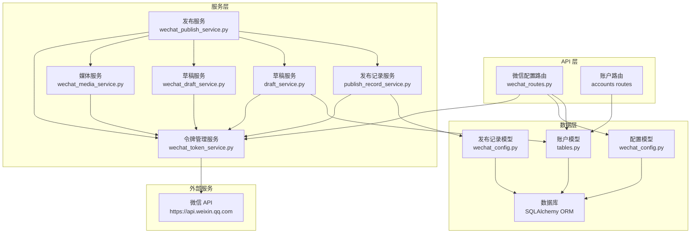

**图表来源**
- [backend/app/api/wechat_routes.py:32-199](file://backend/app/api/wechat_routes.py#L32-L199)
- [backend/app/services/wechat_token_service.py:26-163](file://backend/app/services/wechat_token_service.py#L26-L163)
- [backend/app/services/wechat_publish_service.py:23-345](file://backend/app/services/wechat_publish_service.py#L23-L345)
- [backend/app/services/draft_service.py:550-581](file://backend/app/services/draft_service.py#L550-L581)
- [backend/app/services/publish_record_service.py:420-444](file://backend/app/services/publish_record_service.py#L420-L444)

## 详细组件分析

### 配置路由组件

配置路由组件提供完整的微信公众号配置管理功能：

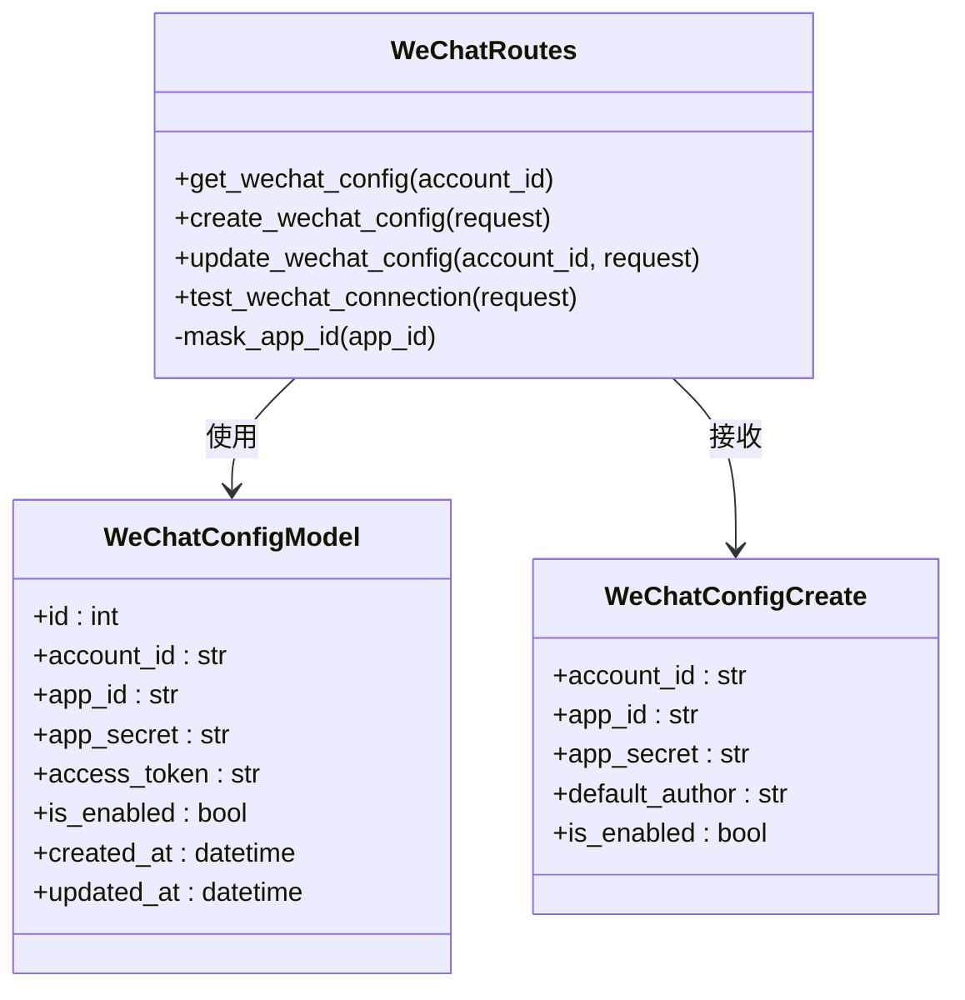

**图表来源**
- [backend/app/api/wechat_routes.py:32-176](file://backend/app/api/wechat_routes.py#L32-L176)
- [backend/app/models/wechat_config.py:10-31](file://backend/app/models/wechat_config.py#L10-L31)
- [backend/app/schemas/wechat.py:23-36](file://backend/app/schemas/wechat.py#L23-L36)

#### 配置管理流程

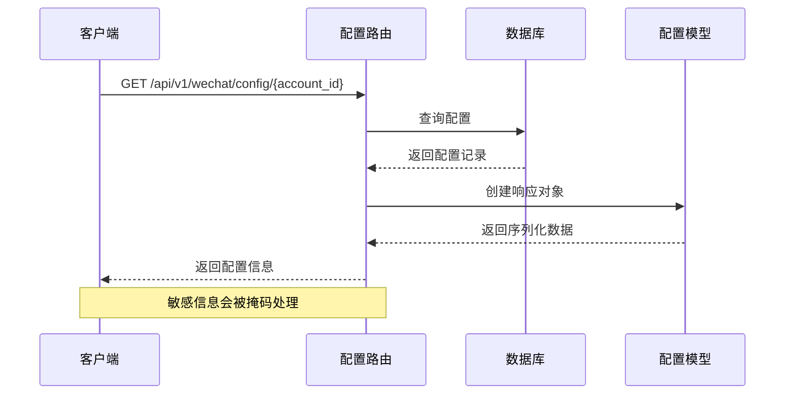

**图表来源**
- [backend/app/api/wechat_routes.py:32-69](file://backend/app/api/wechat_routes.py#L32-L69)

**章节来源**
- [backend/app/api/wechat_routes.py:32-176](file://backend/app/api/wechat_routes.py#L32-L176)

### 令牌管理服务

令牌管理服务是整个微信集成的核心组件，负责处理微信 API 的认证：

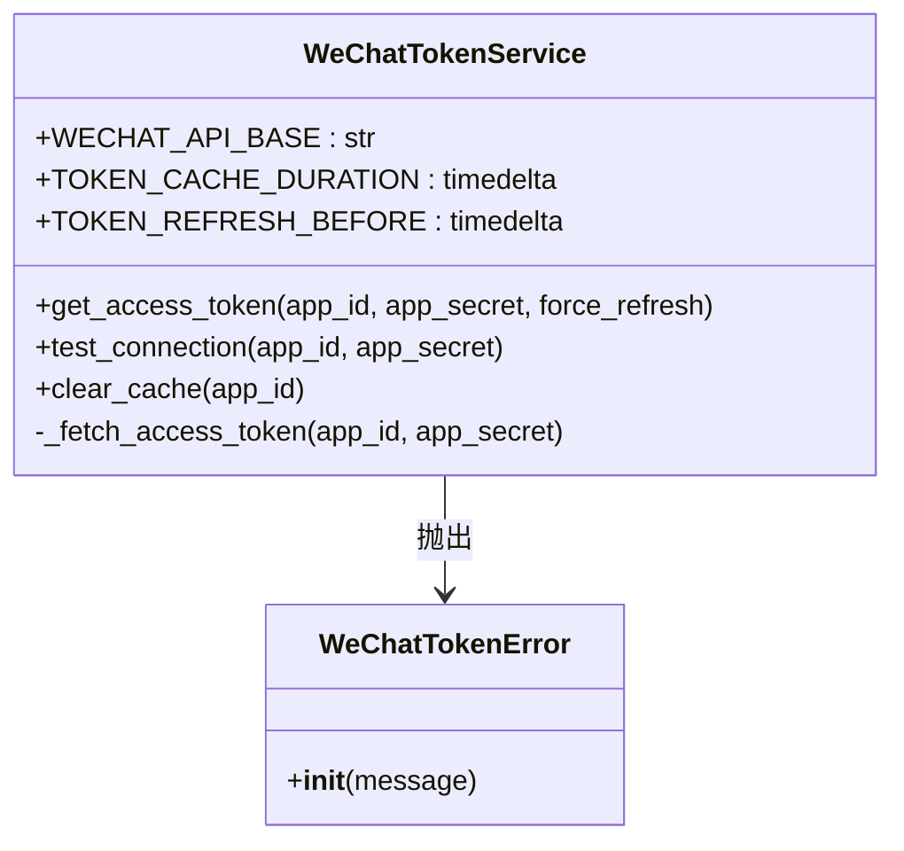

**图表来源**
- [backend/app/services/wechat_token_service.py:26-163](file://backend/app/services/wechat_token_service.py#L26-L163)

#### 令牌获取流程

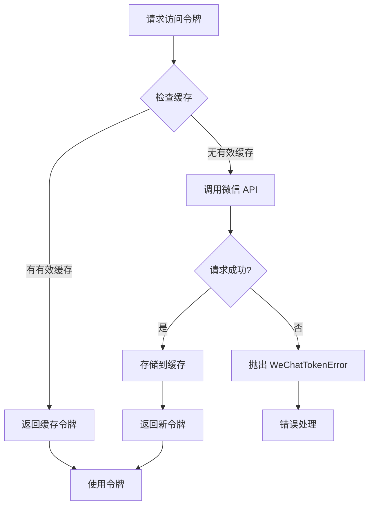

**图表来源**
- [backend/app/services/wechat_token_service.py:40-85](file://backend/app/services/wechat_token_service.py#L40-L85)

**章节来源**
- [backend/app/services/wechat_token_service.py:26-163](file://backend/app/services/wechat_token_service.py#L26-L163)

### 发布服务组件

发布服务组件实现了完整的文章发布流程：

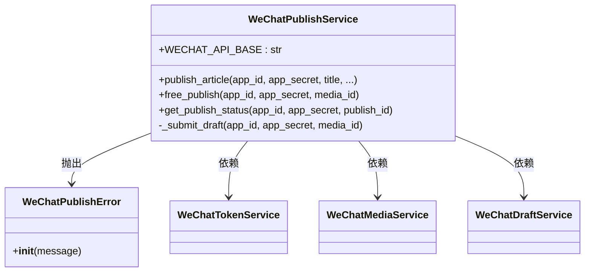

**图表来源**
- [backend/app/services/wechat_publish_service.py:23-345](file://backend/app/services/wechat_publish_service.py#L23-L345)

#### 完整发布流程

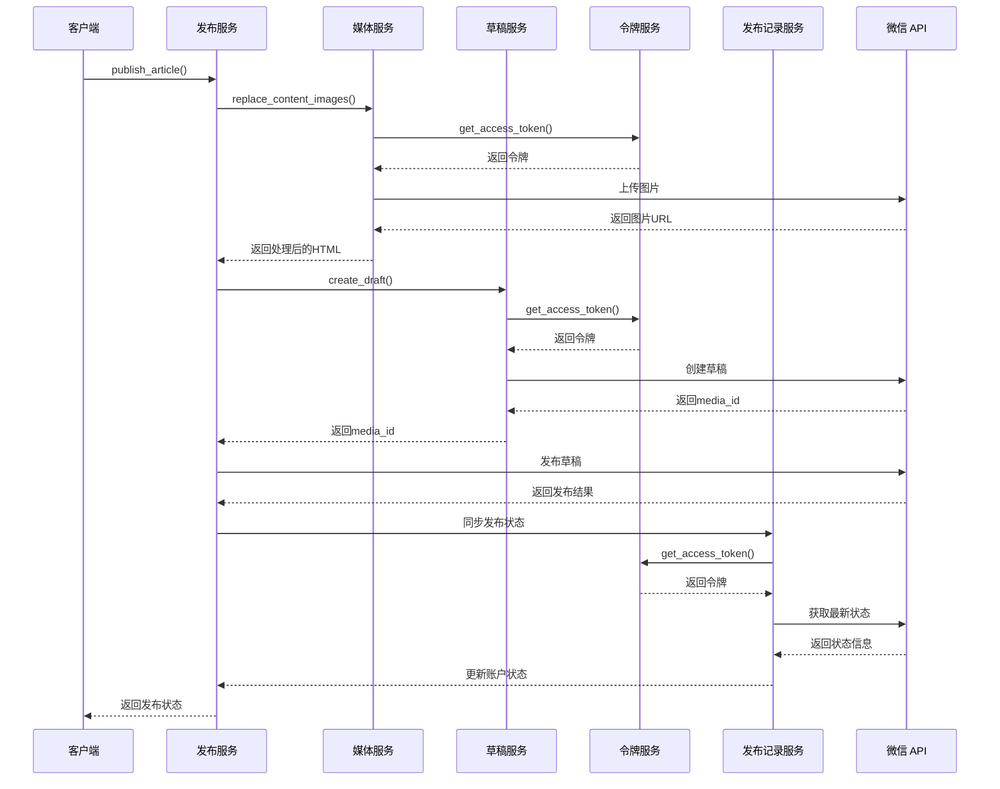

**图表来源**
- [backend/app/services/wechat_publish_service.py:36-142](file://backend/app/services/wechat_publish_service.py#L36-L142)
- [backend/app/services/publish_record_service.py:420-444](file://backend/app/services/publish_record_service.py#L420-L444)

**章节来源**
- [backend/app/services/wechat_publish_service.py:23-345](file://backend/app/services/wechat_publish_service.py#L23-L345)

### 媒体处理服务

媒体处理服务负责处理文章中的图片资源：

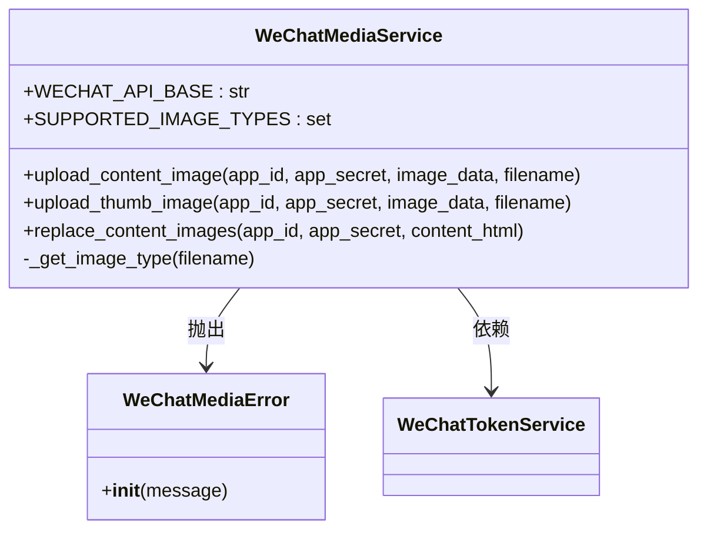

**图表来源**
- [backend/app/services/wechat_media_service.py:25-257](file://backend/app/services/wechat_media_service.py#L25-L257)

#### 图片替换流程

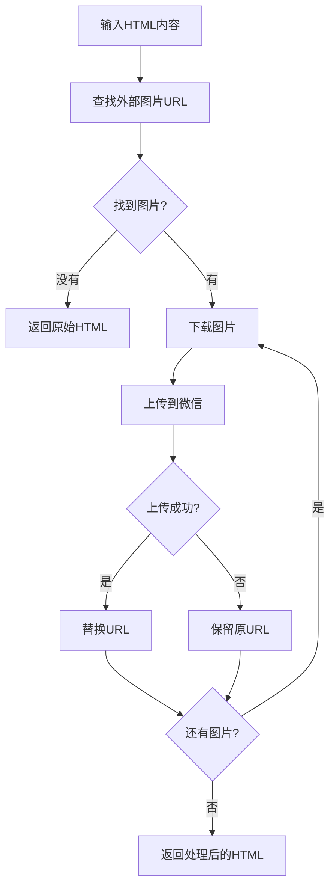

**图表来源**
- [backend/app/services/wechat_media_service.py:173-248](file://backend/app/services/wechat_media_service.py#L173-L248)

**章节来源**
- [backend/app/services/wechat_media_service.py:25-257](file://backend/app/services/wechat_media_service.py#L25-L257)

### 草稿管理服务

草稿管理服务处理微信草稿的完整生命周期：

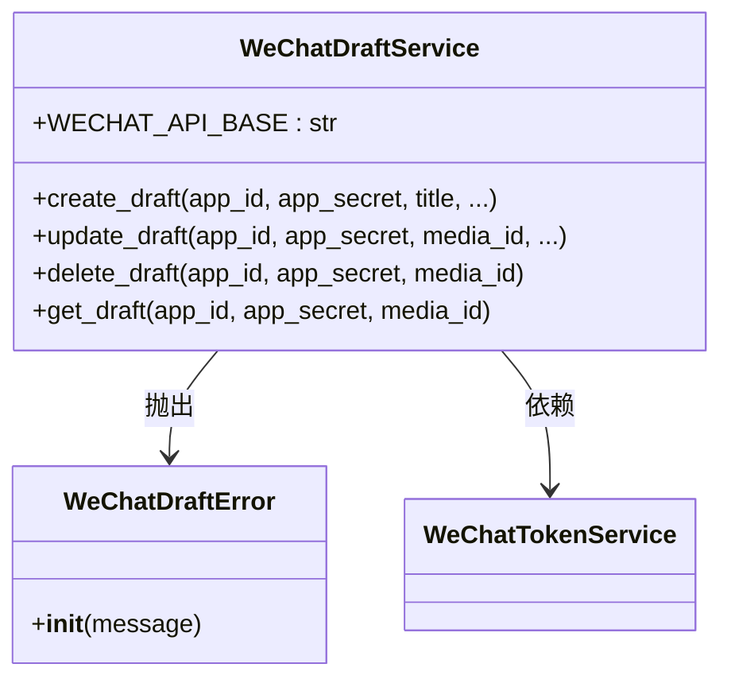

**图表来源**
- [backend/app/services/wechat_draft_service.py:23-335](file://backend/app/services/wechat_draft_service.py#L23-L335)

**章节来源**
- [backend/app/services/wechat_draft_service.py:23-335](file://backend/app/services/wechat_draft_service.py#L23-L335)

## 发布跟踪增强功能

### 账户模型发布跟踪字段

AccountModel 新增了三个重要的发布跟踪字段：

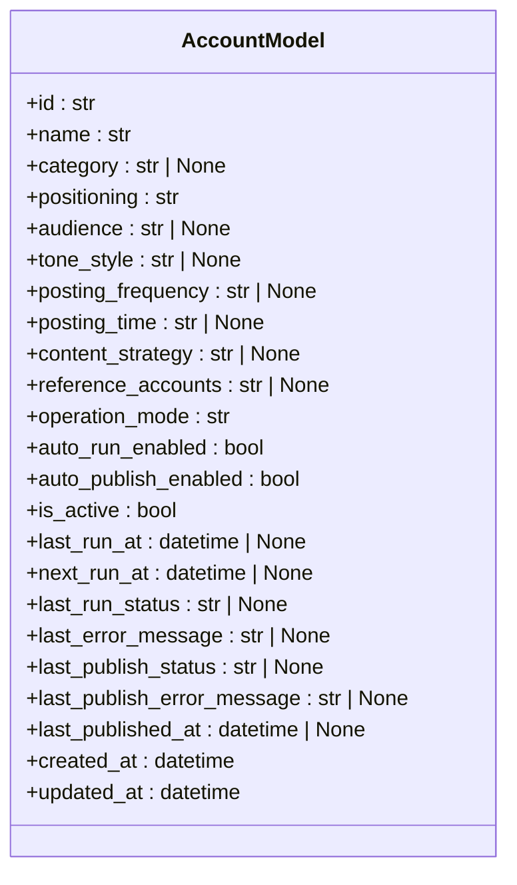

**图表来源**
- [backend/app/models/tables.py:28-58](file://backend/app/models/tables.py#L28-L58)

#### 发布状态同步机制

发布状态同步通过两个核心服务实现：

1. **草稿服务同步** (`draft_service.py`)
2. **发布记录服务同步** (`publish_record_service.py`)

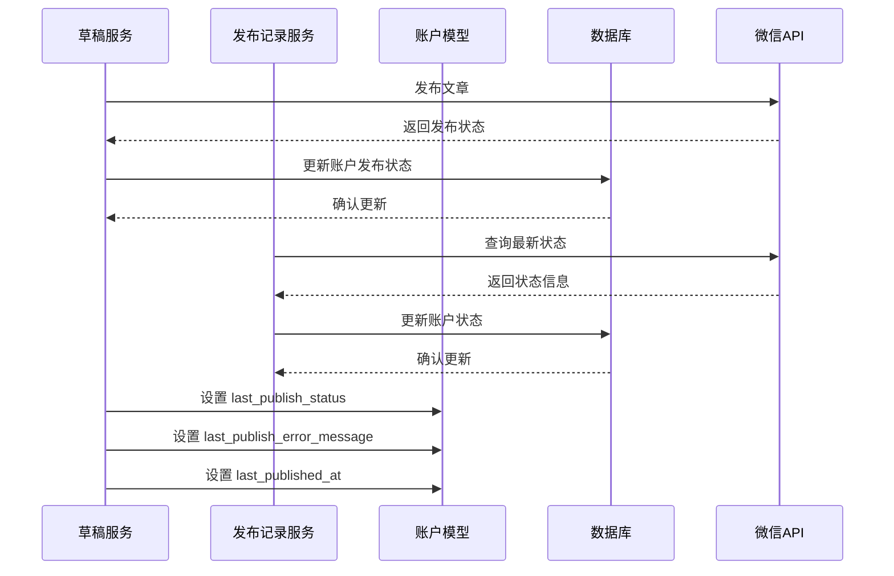

**图表来源**
- [backend/app/services/draft_service.py:550-581](file://backend/app/services/draft_service.py#L550-L581)
- [backend/app/services/publish_record_service.py:420-444](file://backend/app/services/publish_record_service.py#L420-L444)

### 前端发布跟踪显示

前端类型定义和界面组件都增加了对发布跟踪字段的支持：

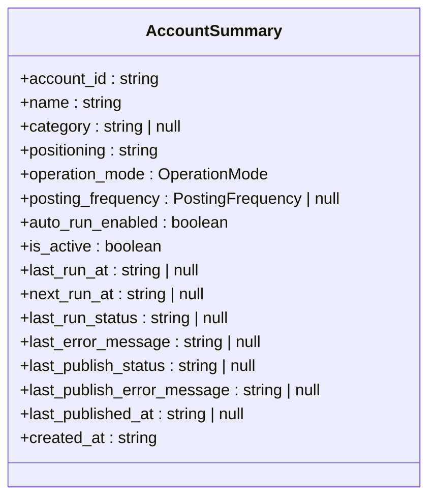

**图表来源**
- [frontend/types/index.ts:240-270](file://frontend/types/index.ts#L240-L270)

#### 前端界面展示

前端界面通过多个组件展示发布跟踪信息：

1. **账户详情页面** (`accounts/[id]/page.tsx`)
2. **账户列表页面** (`accounts/page.tsx`)
3. **草稿详情页面** (`drafts/[id]/page.tsx`)

**章节来源**
- [backend/app/models/tables.py:50-53](file://backend/app/models/tables.py#L50-L53)
- [backend/app/services/draft_service.py:550-581](file://backend/app/services/draft_service.py#L550-L581)
- [backend/app/services/publish_record_service.py:420-444](file://backend/app/services/publish_record_service.py#L420-L444)
- [frontend/types/index.ts:240-270](file://frontend/types/index.ts#L240-L270)
- [frontend/app/accounts/[id]/page.tsx:276-320](file://frontend/app/accounts/[id]/page.tsx#L276-L320)
- [frontend/app/accounts/page.tsx:186-203](file://frontend/app/accounts/page.tsx#L186-L203)
- [frontend/app/drafts/[id]/page.tsx:348-400](file://frontend/app/drafts/[id]/page.tsx#L348-L400)

## 依赖关系分析

微信官方账号集成系统的依赖关系如下：

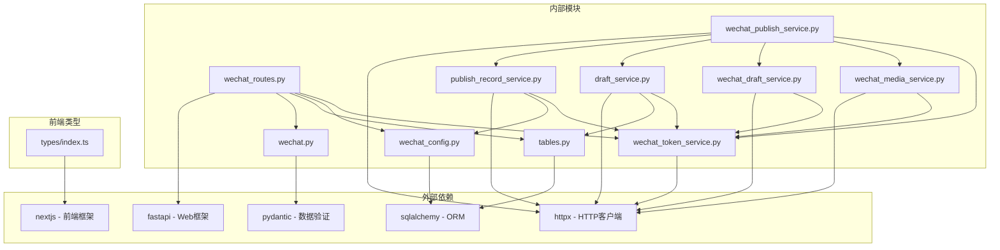

**图表来源**
- [backend/app/api/wechat_routes.py:3-19](file://backend/app/api/wechat_routes.py#L3-L19)
- [backend/app/services/wechat_token_service.py:9-15](file://backend/app/services/wechat_token_service.py#L9-L15)
- [frontend/types/index.ts:1-50](file://frontend/types/index.ts#L1-L50)

**章节来源**
- [backend/app/api/wechat_routes.py:1-22](file://backend/app/api/wechat_routes.py#L1-L22)
- [backend/app/services/wechat_token_service.py:1-15](file://backend/app/services/wechat_token_service.py#L1-L15)
- [frontend/types/index.ts:1-50](file://frontend/types/index.ts#L1-L50)

## 性能考虑

### 缓存策略
- **令牌缓存**：Access Token 缓存 2 小时，提前 5 分钟刷新
- **线程安全**：使用模块级字典存储缓存，适合单实例部署

### 超时配置
- **HTTP 超时**：不同操作设置不同的超时时间
  - 令牌获取：30 秒
  - 媒体上传：60 秒
  - 草稿操作：60 秒
  - 发布查询：30 秒

### 错误处理
- **重试机制**：网络错误和超时会记录日志但不自动重试
- **降级策略**：图片替换失败时保留原始 URL
- **监控告警**：所有错误都会记录详细的日志信息

### 发布跟踪性能优化
- **异步状态同步**：发布状态更新采用异步方式，避免阻塞主流程
- **批量更新**：多个发布状态同时更新到账户模型
- **状态缓存**：前端组件缓存最新的发布状态，减少重复查询

## 故障排除指南

### 常见问题及解决方案

#### 1. 令牌获取失败
**症状**：`WeChatTokenError` 异常
**可能原因**：
- App ID 或 App Secret 错误
- 网络连接问题
- 微信 API 限流

**解决方法**：
```python
# 检查配置
config = await get_wechat_config(account_id)
print(f"App ID: {config.app_id_masked}")

# 手动测试连接
success, message = await wechat_token_service.test_connection(app_id, app_secret)
print(f"连接测试: {success} - {message}")
```

#### 2. 图片上传失败
**症状**：`WeChatMediaError` 异常
**可能原因**：
- 图片格式不支持
- 网络超时
- 微信 API 限制

**解决方法**：
```python
# 检查支持的图片格式
supported_formats = wechat_media_service.SUPPORTED_IMAGE_TYPES
print(f"支持的格式: {supported_formats}")

# 验证图片URL
if not img_url.startswith(('http://', 'https://')):
    print("无效的图片URL")
```

#### 3. 草稿创建失败
**症状**：`WeChatDraftError` 异常
**可能原因**：
- HTML 内容格式错误
- 字段长度超出限制
- 权限不足

**解决方法**：
```python
# 检查字段长度
print(f"标题长度: {len(title)}")
print(f"摘要长度: {len(digest) if digest else 0}")
print(f"内容长度: {len(content)}")

# 验证HTML格式
if '<img' in content:
    print("检测到图片标签，需要先处理媒体")
```

#### 4. 发布状态同步失败
**症状**：发布状态未正确更新到账户模型
**可能原因**：
- 数据库连接问题
- 异步任务执行失败
- 权限不足

**解决方法**：
```python
# 检查发布记录
latest_record = await publish_record_service.get_latest_for_draft(draft_id, db)
print(f"最新发布记录: {latest_record.publish_status}")

# 手动触发状态同步
await draft_service.sync_publish_status_to_account(account_id, db, status, error_message)
```

**章节来源**
- [backend/app/services/wechat_token_service.py:113-135](file://backend/app/services/wechat_token_service.py#L113-L135)
- [backend/app/services/wechat_media_service.py:76-84](file://backend/app/services/wechat_media_service.py#L76-L84)
- [backend/app/services/wechat_draft_service.py:90-98](file://backend/app/services/wechat_draft_service.py#L90-L98)
- [backend/app/services/draft_service.py:550-581](file://backend/app/services/draft_service.py#L550-L581)

## 结论

微信官方账号集成功能提供了完整的微信公众号内容发布解决方案。系统采用模块化设计，各组件职责明确，具有良好的可维护性和扩展性。

### 主要优势
1. **完整的发布流程**：从配置管理到内容发布的全链路支持
2. **健壮的错误处理**：完善的异常处理和降级策略
3. **高效的缓存机制**：智能的令牌缓存减少 API 调用
4. **灵活的配置管理**：支持动态配置和连接性测试
5. **实时发布跟踪**：新增的发布状态跟踪功能，提供完整的发布历史和状态信息
6. **前后端一体化**：前端界面完整支持发布跟踪字段的显示和交互

### 扩展建议
1. **集群部署支持**：当前缓存方案仅适用于单实例，可考虑分布式缓存
2. **重试机制**：为关键操作添加自动重试逻辑
3. **监控集成**：集成更完善的监控和告警系统
4. **测试覆盖**：增加更多的单元测试和集成测试
5. **发布跟踪优化**：可以考虑添加发布统计和趋势分析功能

### 发布跟踪功能亮点
- **实时状态同步**：发布状态变化时自动更新到账户模型
- **完整错误追踪**：记录最后一次发布失败的详细错误信息
- **发布时间戳**：精确记录最后一次成功的发布时间
- **前端可视化**：通过多种界面组件展示发布状态和历史
- **历史记录**：支持查看完整的发布历史和重试记录

该系统为微信公众号的内容创作提供了坚实的技术基础，能够满足不同规模企业的需求。新增的发布跟踪功能进一步增强了系统的可观测性和用户体验。