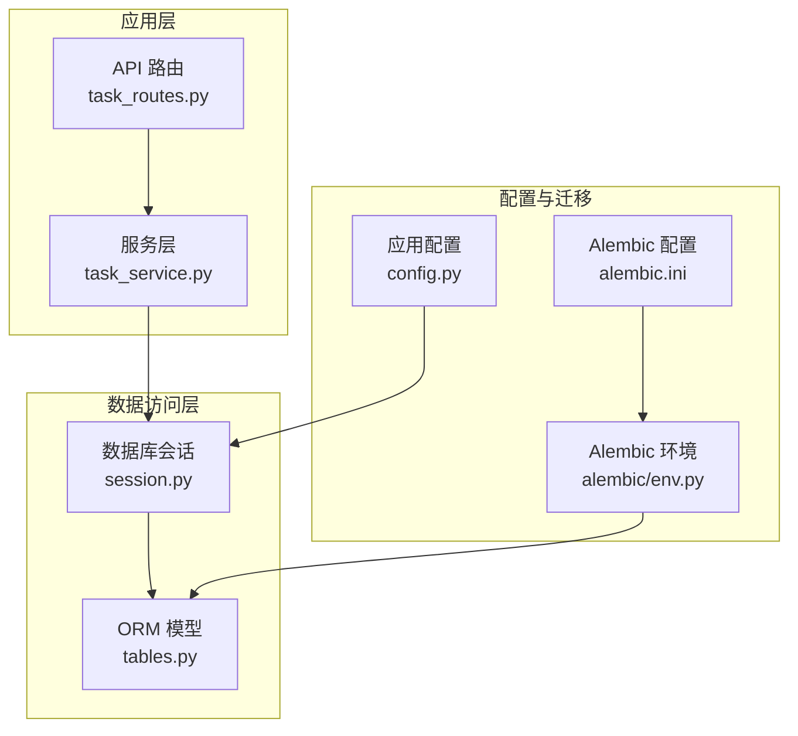
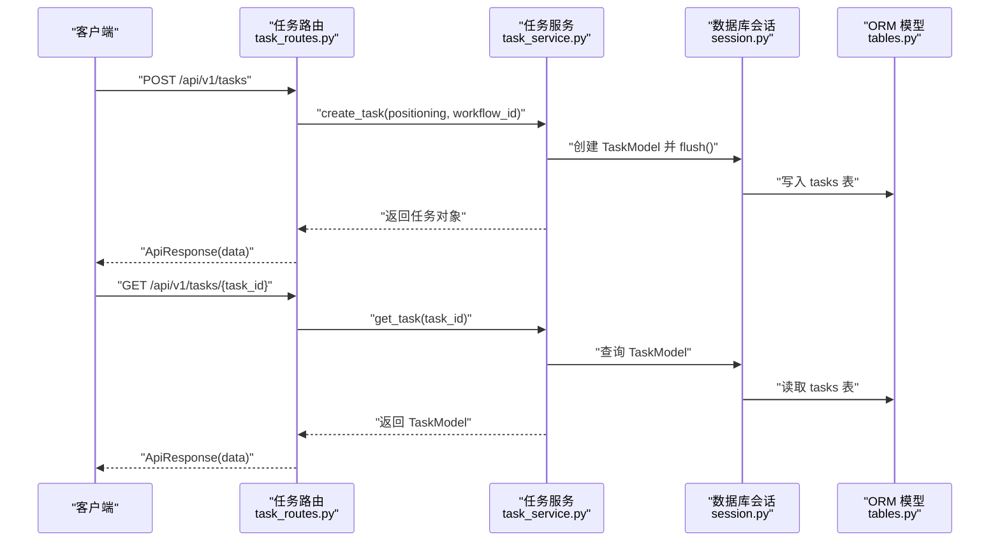
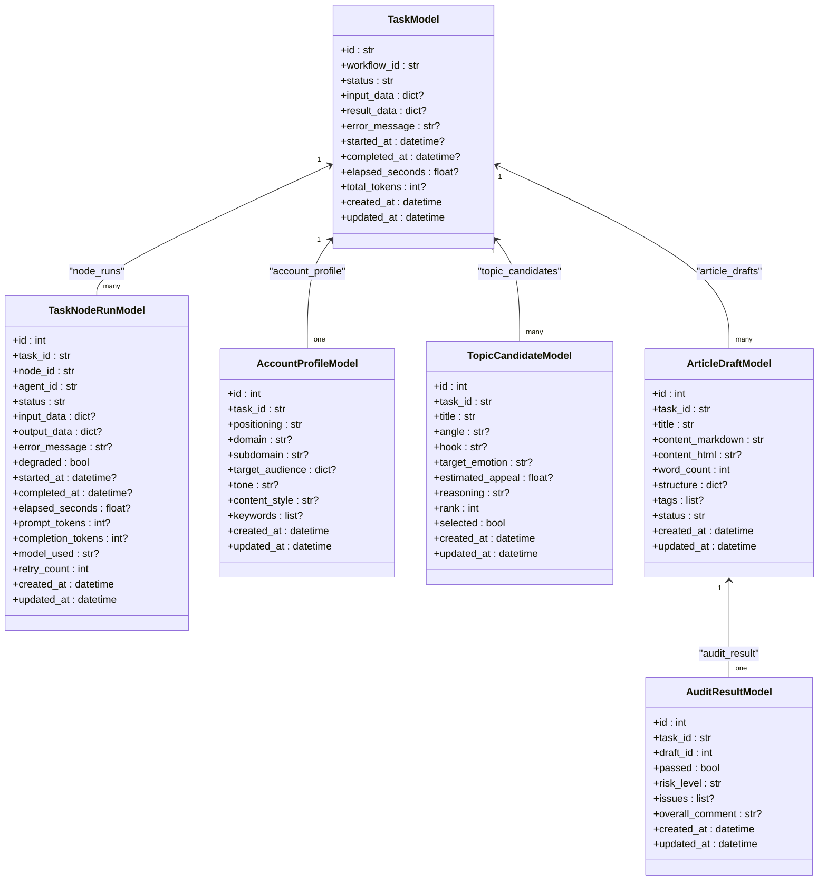
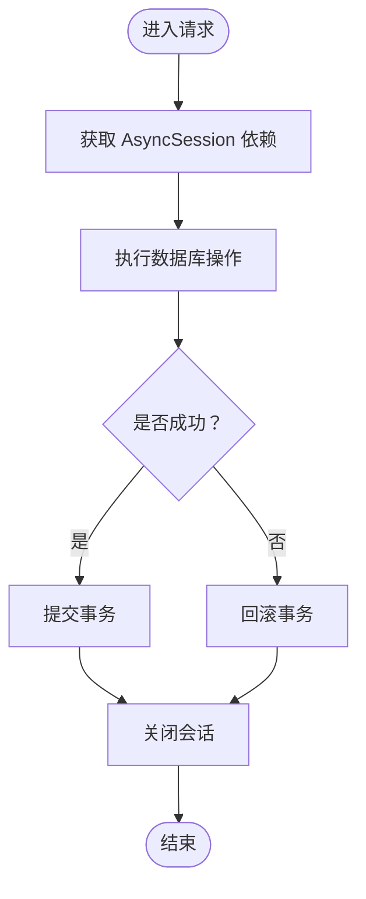
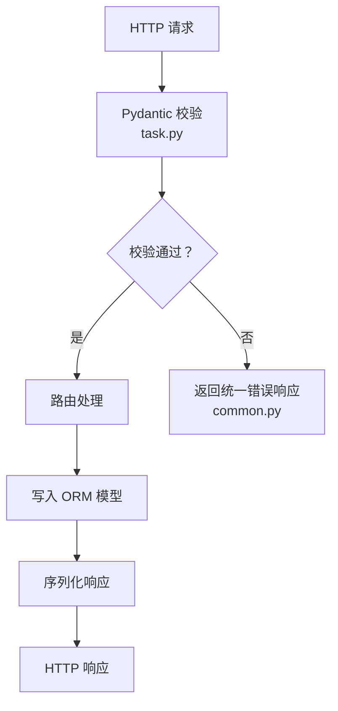
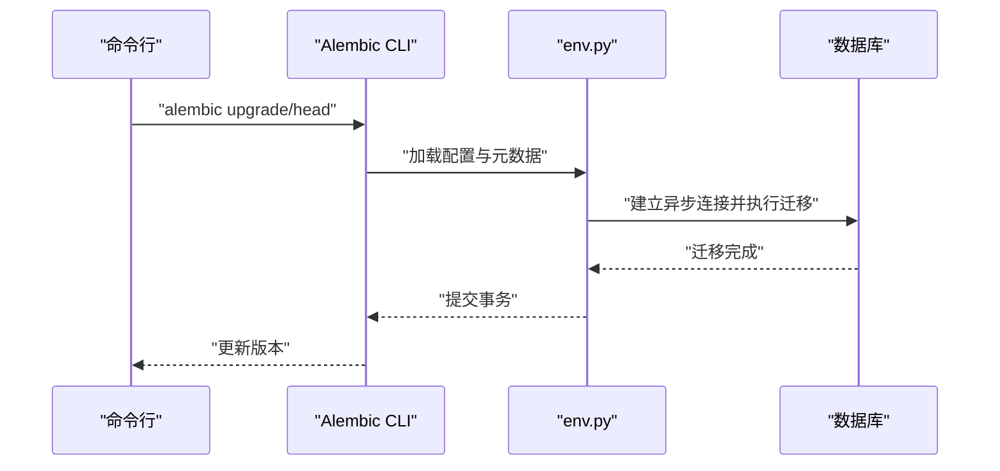
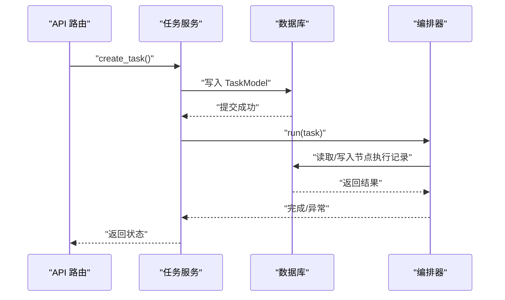
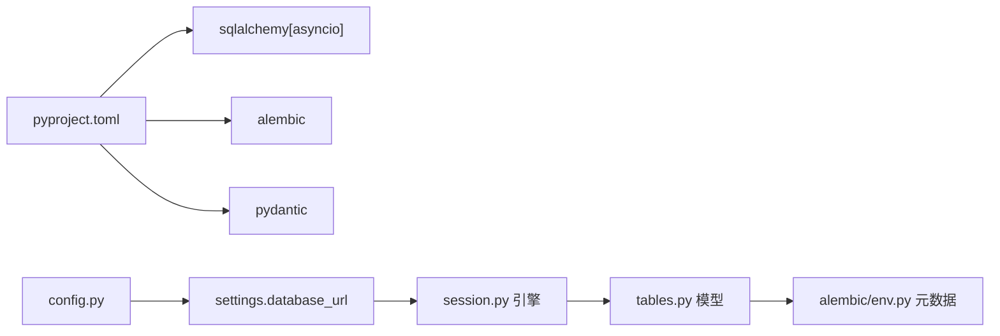

# 数据模型设计

<cite>
**本文引用的文件**
- [tables.py](file://backend/app/models/tables.py)
- [session.py](file://backend/app/db/session.py)
- [env.py](file://backend/alembic/env.py)
- [alembic.ini](file://backend/alembic.ini)
- [config.py](file://backend/app/core/config.py)
- [task.py](file://backend/app/schemas/task.py)
- [common.py](file://backend/app/schemas/common.py)
- [task_routes.py](file://backend/app/api/task_routes.py)
- [task_service.py](file://backend/app/services/task_service.py)
- [init_db.py](file://scripts/init_db.py)
- [pyproject.toml](file://backend/pyproject.toml)
</cite>

## 目录
1. [简介](#简介)
2. [项目结构](#项目结构)
3. [核心组件](#核心组件)
4. [架构总览](#架构总览)
5. [详细组件分析](#详细组件分析)
6. [依赖关系分析](#依赖关系分析)
7. [性能考虑](#性能考虑)
8. [故障排查指南](#故障排查指南)
9. [结论](#结论)
10. [附录](#附录)

## 简介
本文件聚焦于数据模型设计的技术文档，涵盖以下方面：
- ORM 模型定义：基于 SQLAlchemy 的异步 ORM 映射、表结构设计与关系映射
- 核心实体：TaskModel、TaskNodeRunModel、AccountProfileModel 等的设计理念与字段语义
- 数据验证机制：Pydantic 模型在请求/响应层的验证、字段约束与业务规则
- 数据迁移策略：Alembic 配置、版本管理与升级脚本
- 性能优化：索引、查询路径与一致性保障的最佳实践

## 项目结构
后端采用分层组织：API 路由负责请求/响应封装，服务层承载业务逻辑，ORM 层负责数据持久化，配置与会话管理贯穿各层。

图表来源
- [task_routes.py:1-179](file://backend/app/api/task_routes.py#L1-L179)
- [task_service.py:1-126](file://backend/app/services/task_service.py#L1-L126)
- [session.py:1-50](file://backend/app/db/session.py#L1-L50)
- [tables.py:1-319](file://backend/app/models/tables.py#L1-L319)
- [config.py:1-99](file://backend/app/core/config.py#L1-L99)
- [env.py:1-53](file://backend/alembic/env.py#L1-L53)
- [alembic.ini:1-39](file://backend/alembic.ini#L1-L39)

章节来源
- [task_routes.py:1-179](file://backend/app/api/task_routes.py#L1-L179)
- [task_service.py:1-126](file://backend/app/services/task_service.py#L1-L126)
- [session.py:1-50](file://backend/app/db/session.py#L1-L50)
- [tables.py:1-319](file://backend/app/models/tables.py#L1-L319)
- [config.py:1-99](file://backend/app/core/config.py#L1-L99)
- [env.py:1-53](file://backend/alembic/env.py#L1-L53)
- [alembic.ini:1-39](file://backend/alembic.ini#L1-L39)

## 核心组件
- 异步数据库引擎与会话管理：通过 SQLAlchemy AsyncEngine 与 AsyncSession 提供连接池、回滚与关闭生命周期管理
- ORM 基类与模型集合：统一的 DeclarativeBase 子类，定义任务、节点执行、账号画像、文章草稿、审计结果、代理、技能、工作流模板、系统日志与配置等核心表
- Pydantic 请求/响应模型：对 API 输入输出进行字段约束与结构校验
- Alembic 迁移：异步迁移环境与配置，支持离线/在线迁移

章节来源
- [session.py:1-50](file://backend/app/db/session.py#L1-L50)
- [tables.py:18-319](file://backend/app/models/tables.py#L18-L319)
- [task.py:1-83](file://backend/app/schemas/task.py#L1-L83)
- [env.py:1-53](file://backend/alembic/env.py#L1-L53)
- [alembic.ini:1-39](file://backend/alembic.ini#L1-L39)

## 架构总览
下图展示从 API 到数据库的端到端流程，以及模型间的关系映射。

图表来源
- [task_routes.py:39-67](file://backend/app/api/task_routes.py#L39-L67)
- [task_service.py:22-37](file://backend/app/services/task_service.py#L22-L37)
- [session.py:23-36](file://backend/app/db/session.py#L23-L36)
- [tables.py:23-46](file://backend/app/models/tables.py#L23-L46)

## 详细组件分析

### ORM 模型与关系映射
- 统一基类：所有模型继承自 DeclarativeBase，便于元数据收集与迁移
- 主要实体与关系
  - TaskModel：主任务表，包含输入/输出、状态、计费与时间戳；一对多关联 TaskNodeRunModel、AccountProfileModel、TopicCandidateModel、ArticleDraftModel
  - TaskNodeRunModel：节点执行记录，外键指向 TaskModel，记录节点执行状态、耗时、Token 使用与重试次数
  - AccountProfileModel：用户定位解析出的账号画像，一对一绑定 TaskModel
  - TopicCandidateModel：主题候选，一对多绑定 TaskModel
  - ArticleDraftModel：文章草稿，一对多绑定 TaskModel，并一对一关联 AuditResultModel
  - AuditResultModel：草稿审计结果，一对一绑定 ArticleDraftModel
  - AgentModel、SkillModel、WorkflowTemplateModel：代理、技能与工作流模板配置
  - SystemLogModel、SystemConfigModel、LLMProviderModel：系统日志、配置与大模型提供商配置

图表来源
- [tables.py:23-319](file://backend/app/models/tables.py#L23-L319)

章节来源
- [tables.py:18-319](file://backend/app/models/tables.py#L18-L319)

### 数据库会话与连接管理
- 异步引擎：根据配置动态选择驱动（SQLite/PostgreSQL），SQLite 不启用 pool_pre_ping
- 会话工厂：AsyncSession，关闭提交/回滚生命周期管理
- FastAPI 依赖注入：get_db 提供路由内依赖；上下文管理器 get_db_context 用于非路由场景

图表来源
- [session.py:23-50](file://backend/app/db/session.py#L23-L50)

章节来源
- [session.py:1-50](file://backend/app/db/session.py#L1-L50)

### 数据验证机制（Pydantic）
- 请求体验证：TaskCreateRequest 对 positioning 与 workflow_id 进行长度与默认值约束
- 响应体验证：TaskDetailResponse、TaskStatusResponse、NodeRunData 等确保对外输出结构一致
- 统一响应包装：ApiResponse、ApiErrorResponse、PaginationMeta 提升接口一致性与可维护性

图表来源
- [task.py:10-22](file://backend/app/schemas/task.py#L10-L22)
- [common.py:7-27](file://backend/app/schemas/common.py#L7-L27)

章节来源
- [task.py:1-83](file://backend/app/schemas/task.py#L1-L83)
- [common.py:1-27](file://backend/app/schemas/common.py#L1-L27)

### 数据迁移策略（Alembic）
- 异步迁移环境：env.py 中配置异步引擎、目标元数据与迁移入口
- 配置来源：alembic.ini 指定脚本位置与默认连接字符串，实际运行时由 env.py 从 settings 覆盖
- 初始化脚本：init_db.py 可直接创建所有表，适用于开发或快速初始化

图表来源
- [env.py:34-52](file://backend/alembic/env.py#L34-L52)
- [alembic.ini:1-39](file://backend/alembic.ini#L1-L39)
- [init_db.py:8-11](file://scripts/init_db.py#L8-L11)

章节来源
- [env.py:1-53](file://backend/alembic/env.py#L1-L53)
- [alembic.ini:1-39](file://backend/alembic.ini#L1-L39)
- [init_db.py:1-16](file://scripts/init_db.py#L1-L16)

### 查询与业务流程
- 任务创建：生成任务 ID，写入 TaskModel，flush 后立即可用
- 任务运行：后台协程启动编排器执行，异常时设置失败状态与错误信息
- 任务查询：按 ID 获取详情，按分页查询列表，支持按状态过滤
- 节点执行：查询某任务的所有节点执行记录，计算进度与耗时

图表来源
- [task_routes.py:39-67](file://backend/app/api/task_routes.py#L39-L67)
- [task_service.py:22-58](file://backend/app/services/task_service.py#L22-L58)

章节来源
- [task_routes.py:1-179](file://backend/app/api/task_routes.py#L1-L179)
- [task_service.py:1-126](file://backend/app/services/task_service.py#L1-L126)

## 依赖关系分析
- 应用配置依赖：settings.database_url 决定连接字符串与驱动选择
- ORM 元数据：Alembic env.py 以 Base.metadata 为目标，确保迁移覆盖所有模型
- 依赖声明：pyproject.toml 明确 SQLAlchemy 异步、Alembic、Pydantic 等核心依赖

图表来源
- [pyproject.toml:6-22](file://backend/pyproject.toml#L6-L22)
- [config.py:52-95](file://backend/app/core/config.py#L52-L95)
- [session.py:9-20](file://backend/app/db/session.py#L9-L20)
- [tables.py:18](file://backend/app/models/tables.py#L18)
- [env.py:18](file://backend/alembic/env.py#L18)

章节来源
- [pyproject.toml:1-41](file://backend/pyproject.toml#L1-L41)
- [config.py:1-99](file://backend/app/core/config.py#L1-L99)
- [session.py:1-50](file://backend/app/db/session.py#L1-L50)
- [tables.py:1-319](file://backend/app/models/tables.py#L1-L319)
- [env.py:1-53](file://backend/alembic/env.py#L1-L53)

## 性能考虑
- 索引策略
  - SystemLogModel 的 trace_id、task_id 字段已建立索引，适合高频查询与关联
  - 建议在 TaskModel 的 status、created_at 上建立复合索引，加速分页与筛选
- 查询优化
  - 使用 selectinload 预加载 TaskModel.node_runs，避免 N+1 查询
  - 分页查询使用 count 子查询统计总数，避免全表扫描
- 一致性与并发
  - 会话层统一回滚/提交，异常时自动回滚，避免脏数据
  - 异步引擎连接池与 SQLite 的差异处理，确保不同后端稳定性
- 缓存与外部集成
  - Redis 作为可选缓存介质，可用于热点数据与中间态缓存（需在服务层实现）

[本节为通用性能建议，不直接分析具体文件]

## 故障排查指南
- 连接问题
  - 检查 settings.database_url 是否正确，驱动是否匹配（SQLite vs PostgreSQL）
  - SQLite 不支持 pool_pre_ping，若使用其他驱动请确认连接参数
- 迁移失败
  - 确认 alembic.ini 的默认 URL 与 env.py 覆盖逻辑一致
  - 使用 offline 模式检查迁移脚本是否与当前元数据匹配
- 会话异常
  - 确保在路由中使用 get_db，在非路由场景使用 get_db_context
  - 发生异常时会自动回滚，检查日志定位错误点
- 数据不一致
  - 服务层在异常时设置任务失败状态与完成时间，核对错误信息与广播事件

章节来源
- [config.py:52-95](file://backend/app/core/config.py#L52-L95)
- [session.py:23-50](file://backend/app/db/session.py#L23-L50)
- [env.py:13-18](file://backend/alembic/env.py#L13-L18)
- [task_service.py:49-63](file://backend/app/services/task_service.py#L49-L63)

## 结论
本数据模型以 SQLAlchemy 异步 ORM 为核心，围绕任务生命周期构建了清晰的实体关系与一致的验证体系。配合 Alembic 异步迁移与统一的会话管理，既满足开发期快速迭代，也为生产环境提供了可演进的数据库治理能力。建议在后续版本中完善索引策略、引入缓存与监控埋点，持续提升查询性能与可观测性。

[本节为总结性内容，不直接分析具体文件]

## 附录
- 关键字段与约束要点
  - TaskModel：status 默认值、JSON 字段存储输入/输出、时间戳自动维护
  - TaskNodeRunModel：节点状态、Token 计数、重试次数、降级标记
  - AccountProfileModel：唯一性约束（task_id）、JSON 字段存储结构化配置
  - ArticleDraftModel/AuditResultModel：草稿与审计结果的一对一关系
- API 与模型映射
  - 路由层仅做请求/响应封装，业务逻辑集中在服务层，模型定义在 tables.py
- 初始化与迁移
  - 开发阶段可使用 init_db.py 快速建表
  - 生产环境推荐使用 Alembic 进行受控迁移

章节来源
- [tables.py:23-158](file://backend/app/models/tables.py#L23-L158)
- [task_routes.py:39-179](file://backend/app/api/task_routes.py#L39-L179)
- [task_service.py:22-122](file://backend/app/services/task_service.py#L22-L122)
- [init_db.py:8-11](file://scripts/init_db.py#L8-L11)