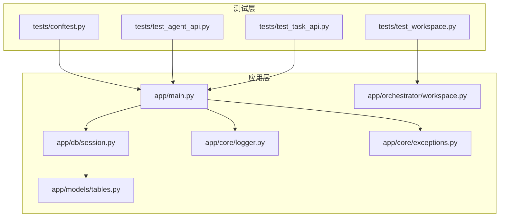
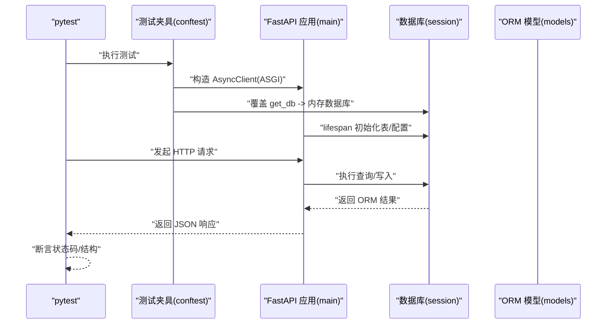
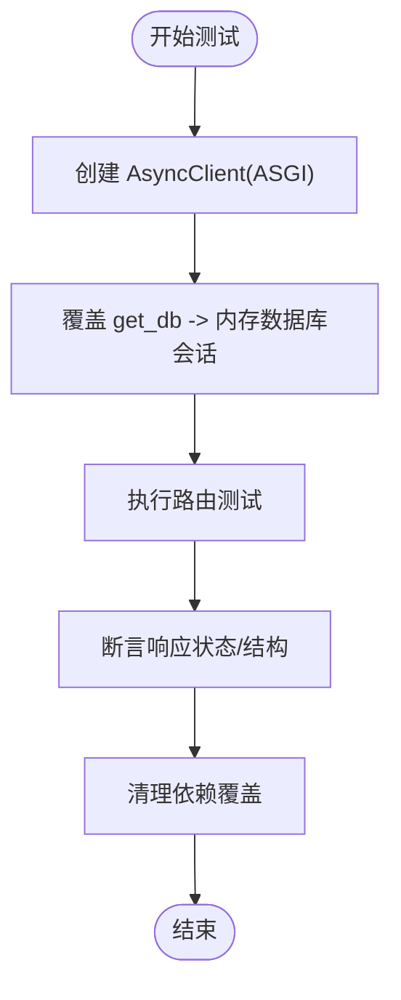
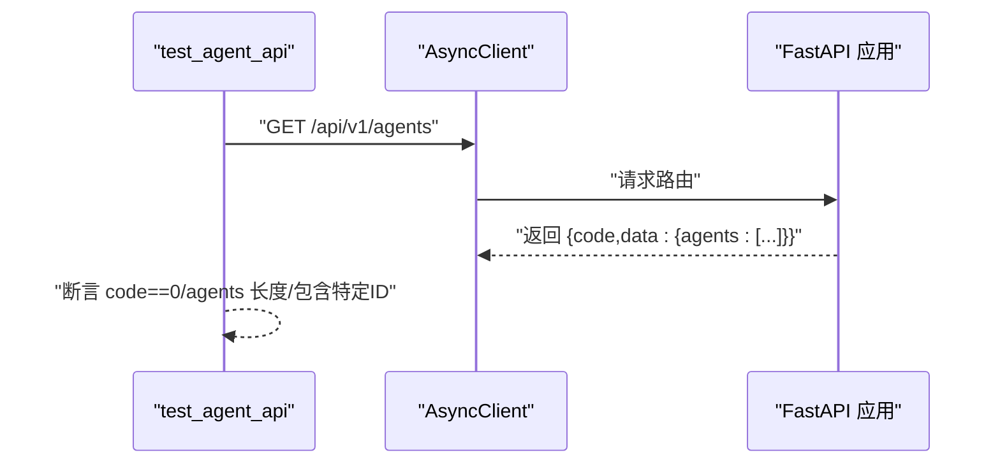
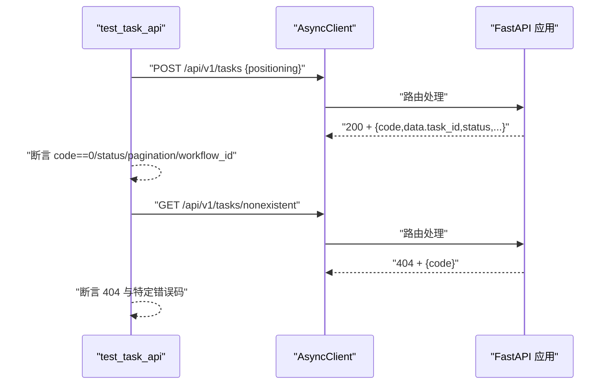
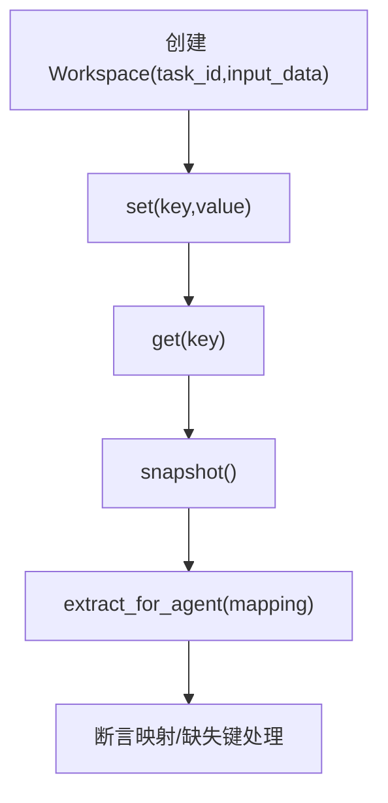
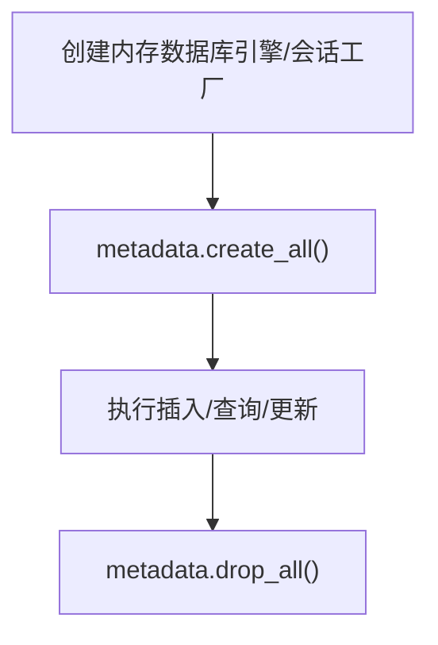
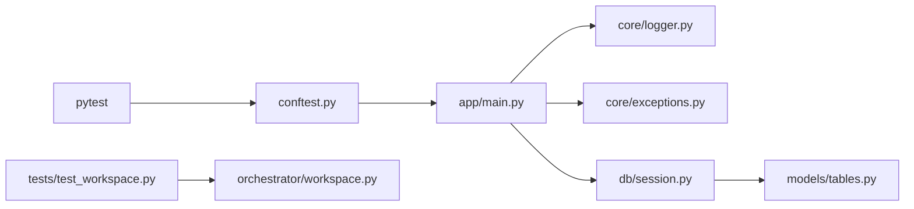

# 测试与调试

<cite>
**本文引用的文件**
- [backend/tests/conftest.py](file://backend/tests/conftest.py)
- [backend/pyproject.toml](file://backend/pyproject.toml)
- [backend/tests/test_agent_api.py](file://backend/tests/test_agent_api.py)
- [backend/tests/test_task_api.py](file://backend/tests/test_task_api.py)
- [backend/tests/test_workspace.py](file://backend/tests/test_workspace.py)
- [backend/app/main.py](file://backend/app/main.py)
- [backend/app/db/session.py](file://backend/app/db/session.py)
- [backend/app/models/tables.py](file://backend/app/models/tables.py)
- [backend/app/core/logger.py](file://backend/app/core/logger.py)
- [backend/app/core/exceptions.py](file://backend/app/core/exceptions.py)
- [backend/app/orchestrator/workspace.py](file://backend/app/orchestrator/workspace.py)
</cite>

## 目录
1. [引言](#引言)
2. [项目结构](#项目结构)
3. [核心组件](#核心组件)
4. [架构总览](#架构总览)
5. [详细组件分析](#详细组件分析)
6. [依赖分析](#依赖分析)
7. [性能考量](#性能考量)
8. [故障排查指南](#故障排查指南)
9. [结论](#结论)
10. [附录](#附录)

## 引言
本指南面向后端测试与调试，聚焦于pytest测试框架配置、测试夹具与模拟对象使用、单元测试策略（Agent测试、API路由测试、工作流测试）、集成测试设计（端到端、数据库、外部服务模拟）、调试技巧与工具（日志分析、性能分析、错误排查），以及测试覆盖率、持续集成配置与质量保证流程的最佳实践。文档结合仓库中的实际代码进行说明，帮助开发者快速建立可靠的测试体系。

## 项目结构
后端位于 backend 目录，测试位于 backend/tests，核心应用入口为 FastAPI 应用，数据库使用 SQLAlchemy 2.0 异步 ORM，日志采用 structlog，异常体系统一。

**图表来源**
- [backend/tests/conftest.py:1-48](file://backend/tests/conftest.py#L1-L48)
- [backend/tests/test_agent_api.py:1-28](file://backend/tests/test_agent_api.py#L1-L28)
- [backend/tests/test_task_api.py:1-57](file://backend/tests/test_task_api.py#L1-L57)
- [backend/tests/test_workspace.py:1-41](file://backend/tests/test_workspace.py#L1-L41)
- [backend/app/main.py:1-153](file://backend/app/main.py#L1-L153)
- [backend/app/db/session.py:1-50](file://backend/app/db/session.py#L1-L50)
- [backend/app/models/tables.py:1-319](file://backend/app/models/tables.py#L1-L319)
- [backend/app/core/logger.py:1-36](file://backend/app/core/logger.py#L1-L36)
- [backend/app/core/exceptions.py:1-125](file://backend/app/core/exceptions.py#L1-L125)
- [backend/app/orchestrator/workspace.py:1-53](file://backend/app/orchestrator/workspace.py#L1-L53)

**章节来源**
- [backend/tests/conftest.py:1-48](file://backend/tests/conftest.py#L1-L48)
- [backend/pyproject.toml:1-41](file://backend/pyproject.toml#L1-L41)

## 核心组件
- 测试夹具与客户端
  - 使用 pytest-asyncio 与 httpx.AsyncClient，通过 ASGI 传输构建测试客户端。
  - 通过依赖注入覆盖 get_db，将数据库会话指向内存数据库（SQLite in-memory），确保测试隔离与可重复性。
- 应用入口与路由
  - FastAPI 应用在 lifespan 中注册代理、初始化数据库表与系统配置，并提供健康检查端点。
- 数据库与模型
  - 异步引擎与会话工厂，支持 SQLite 与 pool_pre_ping（非 SQLite）。
  - ORM 模型涵盖任务、节点运行、账号画像、候选主题、文章草稿、审核结果、代理/技能/工作流模板、系统日志与配置、LLM Provider 等。
- 日志与异常
  - structlog 结构化日志配置；统一异常体系 HotClawError，映射到不同 HTTP 状态码。
- 工作空间
  - Workspace 提供任务级上下文容器，支持提取输入映射、快照与读写。

**章节来源**
- [backend/tests/conftest.py:13-48](file://backend/tests/conftest.py#L13-L48)
- [backend/app/main.py:34-66](file://backend/app/main.py#L34-L66)
- [backend/app/db/session.py:9-36](file://backend/app/db/session.py#L9-L36)
- [backend/app/models/tables.py:23-319](file://backend/app/models/tables.py#L23-L319)
- [backend/app/core/logger.py:8-36](file://backend/app/core/logger.py#L8-L36)
- [backend/app/core/exceptions.py:4-125](file://backend/app/core/exceptions.py#L4-L125)
- [backend/app/orchestrator/workspace.py:12-53](file://backend/app/orchestrator/workspace.py#L12-L53)

## 架构总览
测试与被测系统的交互关系如下：

**图表来源**
- [backend/tests/conftest.py:33-48](file://backend/tests/conftest.py#L33-L48)
- [backend/app/main.py:44-66](file://backend/app/main.py#L44-L66)
- [backend/app/db/session.py:23-36](file://backend/app/db/session.py#L23-L36)
- [backend/app/models/tables.py:23-46](file://backend/app/models/tables.py#L23-L46)

## 详细组件分析

### 测试框架配置与夹具
- pytest 配置
  - asyncio_mode = auto，testpaths = tests，便于异步测试与集中发现测试文件。
- 测试夹具
  - db_session：创建内存数据库表并在测试后清理。
  - client：注册代理、覆盖 get_db、构造 AsyncClient，确保每次测试使用独立数据库与干净依赖注入环境。
- 依赖注入覆盖
  - 通过 app.dependency_overrides 清晰地将 get_db 替换为测试会话，避免污染真实数据库。

**图表来源**
- [backend/tests/conftest.py:33-48](file://backend/tests/conftest.py#L33-L48)

**章节来源**
- [backend/pyproject.toml:38-41](file://backend/pyproject.toml#L38-L41)
- [backend/tests/conftest.py:13-48](file://backend/tests/conftest.py#L13-L48)

### 单元测试策略

#### Agent 测试
- 目标：验证代理注册与列表接口行为。
- 方法：通过 client 发起 GET /api/v1/agents，断言返回码、数据结构与代理数量/存在性。
- 断言要点：code=0、agents 数组长度、特定代理 ID 存在。

**图表来源**
- [backend/tests/test_agent_api.py:7-19](file://backend/tests/test_agent_api.py#L7-L19)

**章节来源**
- [backend/tests/test_agent_api.py:1-28](file://backend/tests/test_agent_api.py#L1-L28)

#### API 路由测试
- 任务创建与校验
  - 正常：POST /api/v1/tasks，断言 200、code=0、返回 task_id/status/workflow_id。
  - 校验错误：positioning 过短，断言 422。
- 任务查询与健康检查
  - 不存在任务：GET /api/v1/tasks/{id}，断言 404 与特定错误码。
  - 列表为空：GET /api/v1/tasks?page=1&page_size=10，断言 200、data.pagination.total==0。
  - 健康检查：GET /api/v1/health，断言 status=="ok"。

**图表来源**
- [backend/tests/test_task_api.py:7-37](file://backend/tests/test_task_api.py#L7-L37)

**章节来源**
- [backend/tests/test_task_api.py:1-57](file://backend/tests/test_task_api.py#L1-L57)

#### 工作流测试（Workspace）
- 目标：验证工作空间基本操作与输入映射提取。
- 方法：构造 Workspace，设置/获取数据、快照、按映射提取输入。
- 断言要点：get_input/get/set/snapshot 行为；extract_for_agent 的键映射与缺失键处理。

**图表来源**
- [backend/tests/test_workspace.py:7-41](file://backend/tests/test_workspace.py#L7-L41)

**章节来源**
- [backend/tests/test_workspace.py:1-41](file://backend/tests/test_workspace.py#L1-L41)
- [backend/app/orchestrator/workspace.py:12-53](file://backend/app/orchestrator/workspace.py#L12-L53)

### 集成测试设计

#### 端到端测试
- 覆盖范围：从创建任务到健康检查的完整链路。
- 建议步骤：
  - 使用 client 创建任务，断言返回 task_id 与初始状态。
  - 轮询或订阅 SSE（如存在）观察节点状态推进。
  - 最终断言任务完成、草稿生成、审核结果等。
- 注意：当前测试集中于路由与工作空间，可在后续补充完整 E2E 测试。

**章节来源**
- [backend/tests/test_task_api.py:7-57](file://backend/tests/test_task_api.py#L7-L57)

#### 数据库测试
- 使用内存数据库（SQLite in-memory）与异步会话工厂，确保测试隔离。
- 测试要点：
  - 插入/查询任务与节点运行记录，断言字段完整性。
  - 事务回滚与关闭语义，避免跨用例污染。
- 建议：
  - 为关键模型增加 CRUD 测试，覆盖必填字段与默认值。
  - 在 conftest 中按需创建/清理表，保持最小依赖。

**图表来源**
- [backend/tests/conftest.py:20-31](file://backend/tests/conftest.py#L20-L31)
- [backend/app/db/session.py:9-20](file://backend/app/db/session.py#L9-L20)

**章节来源**
- [backend/tests/conftest.py:13-31](file://backend/tests/conftest.py#L13-L31)
- [backend/app/db/session.py:9-36](file://backend/app/db/session.py#L9-L36)
- [backend/app/models/tables.py:23-46](file://backend/app/models/tables.py#L23-L46)

#### 外部服务模拟
- LLM/外部 API：在测试中通过依赖注入或 Mock 替换 LLM 调用，避免真实网络请求。
- 建议：
  - 为 Agent/Skill 定义抽象接口，使用 pytest-mock 或 unittest.mock 替换具体实现。
  - 为异常场景（超时、网络错误）编写降级与重试测试。

[本节为通用指导，无需特定文件引用]

### 调试技巧与工具

#### 日志分析
- 结构化日志：使用 structlog，输出 JSON 格式日志，便于检索与聚合。
- 关键点：在 Workspace 设置值、应用生命周期事件、异常处理处添加日志。
- 建议：在测试中捕获日志输出，断言关键事件出现。

**章节来源**
- [backend/app/core/logger.py:8-36](file://backend/app/core/logger.py#L8-L36)
- [backend/app/orchestrator/workspace.py:26-26](file://backend/app/orchestrator/workspace.py#L26-L26)

#### 性能分析
- 异步性能：利用 pytest-asyncio 与 httpx AsyncClient，减少同步阻塞开销。
- 数据库性能：SQLite in-memory 速度快，适合测试；生产使用 PostgreSQL 时开启 pool_pre_ping。
- 建议：对关键路由添加基准测试，观察响应时间与数据库连接池使用情况。

**章节来源**
- [backend/app/db/session.py:9-14](file://backend/app/db/session.py#L9-L14)

#### 错误排查
- 统一异常映射：HotClawError 按类别映射到 HTTP 状态码，便于定位问题类型。
- 全局异常处理器：未捕获异常返回 500，开发模式下包含错误详情。
- 建议：在测试中抛出特定异常，验证错误响应结构与状态码。

**章节来源**
- [backend/app/core/exceptions.py:4-125](file://backend/app/core/exceptions.py#L4-L125)
- [backend/app/main.py:96-138](file://backend/app/main.py#L96-L138)

## 依赖分析

**图表来源**
- [backend/tests/conftest.py:1-48](file://backend/tests/conftest.py#L1-L48)
- [backend/app/main.py:1-153](file://backend/app/main.py#L1-L153)
- [backend/app/core/logger.py:1-36](file://backend/app/core/logger.py#L1-L36)
- [backend/app/core/exceptions.py:1-125](file://backend/app/core/exceptions.py#L1-L125)
- [backend/app/db/session.py:1-50](file://backend/app/db/session.py#L1-L50)
- [backend/app/models/tables.py:1-319](file://backend/app/models/tables.py#L1-L319)
- [backend/tests/test_workspace.py:1-41](file://backend/tests/test_workspace.py#L1-L41)
- [backend/app/orchestrator/workspace.py:1-53](file://backend/app/orchestrator/workspace.py#L1-L53)

**章节来源**
- [backend/tests/conftest.py:1-48](file://backend/tests/conftest.py#L1-L48)
- [backend/app/main.py:1-153](file://backend/app/main.py#L1-L153)

## 性能考量
- 测试并发：pytest-asyncio 支持并发测试，合理拆分测试用例，避免共享状态导致竞争。
- 数据库连接：内存数据库避免网络延迟；生产环境注意连接池配置与超时设置。
- 日志开销：生产关闭 echo 或限制日志级别，避免影响性能。
- 路由与序列化：FastAPI 自动序列化开销较小，重点优化业务逻辑与外部调用。

[本节为通用指导，无需特定文件引用]

## 故障排查指南
- 常见问题
  - 404：检查资源是否存在（任务/代理/技能），确认 ID 与路由参数一致。
  - 422：检查请求体字段长度/格式，参考 Pydantic 校验规则。
  - 500：查看全局异常处理器返回的错误详情（开发模式）。
- 排查步骤
  - 启用结构化日志，定位关键事件发生点。
  - 使用最小化测试用例复现问题，逐步缩小范围。
  - 对外部依赖（LLM/第三方 API）添加 Mock，排除网络因素。

**章节来源**
- [backend/app/main.py:96-138](file://backend/app/main.py#L96-L138)
- [backend/app/core/exceptions.py:4-125](file://backend/app/core/exceptions.py#L4-L125)
- [backend/app/core/logger.py:8-36](file://backend/app/core/logger.py#L8-L36)

## 结论
本指南基于现有测试与代码，总结了后端测试与调试的关键实践：以 pytest-asyncio 为核心，通过依赖注入与内存数据库实现隔离测试；围绕 API 路由与工作空间进行单元测试；在日志、异常与数据库层面建立可观测性与稳定性保障。建议在现有基础上补充 E2E 与外部服务模拟测试，完善覆盖率与 CI 流程。

[本节为总结性内容，无需特定文件引用]

## 附录

### 测试覆盖率与持续集成
- 覆盖率要求建议
  - 路由与服务层：≥80%
  - 核心业务逻辑（Agent/Skill/Workspace）：≥90%
  - 数据访问层：≥85%
- CI 配置建议
  - 使用 pytest 与 asyncio_mode，自动发现 tests 目录。
  - 在 CI 中运行测试并生成覆盖率报告（如 coverage 或 pytest-cov）。
  - 添加静态检查（如 ruff/flake8）与格式化检查（如 black/isort）。

**章节来源**
- [backend/pyproject.toml:24-41](file://backend/pyproject.toml#L24-L41)