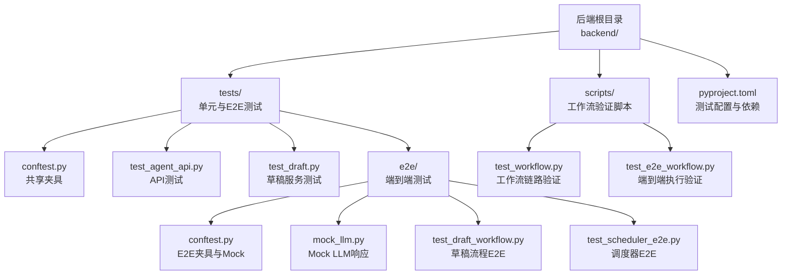
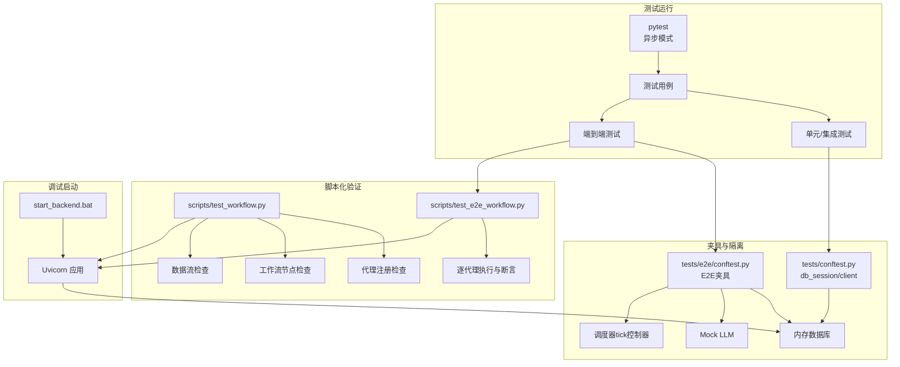
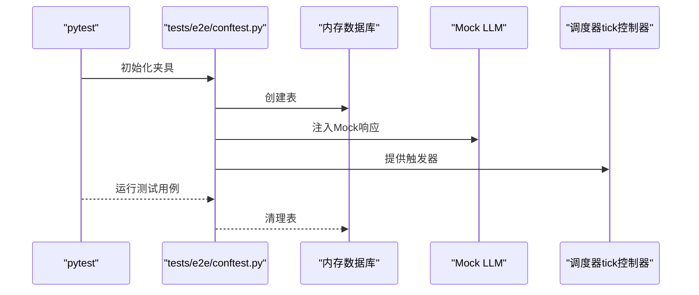
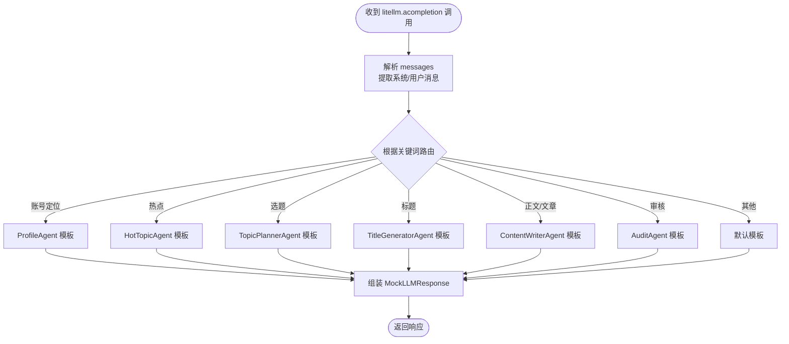
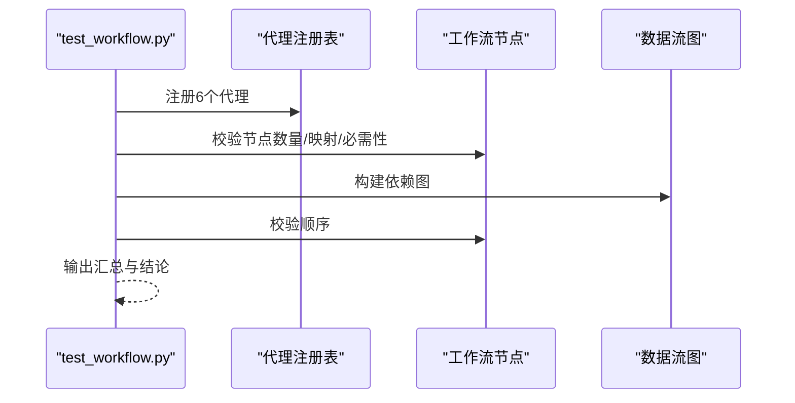
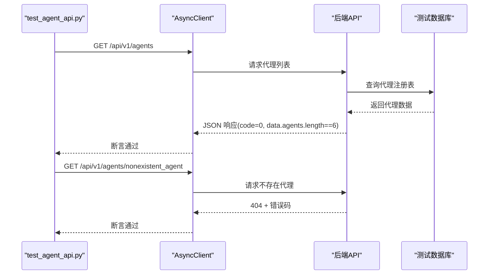
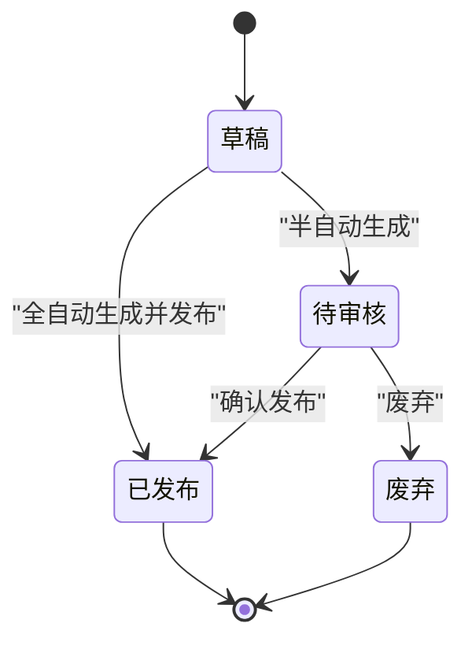
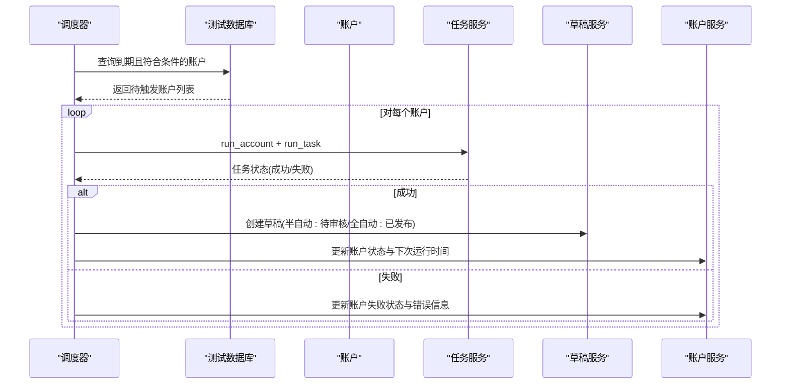
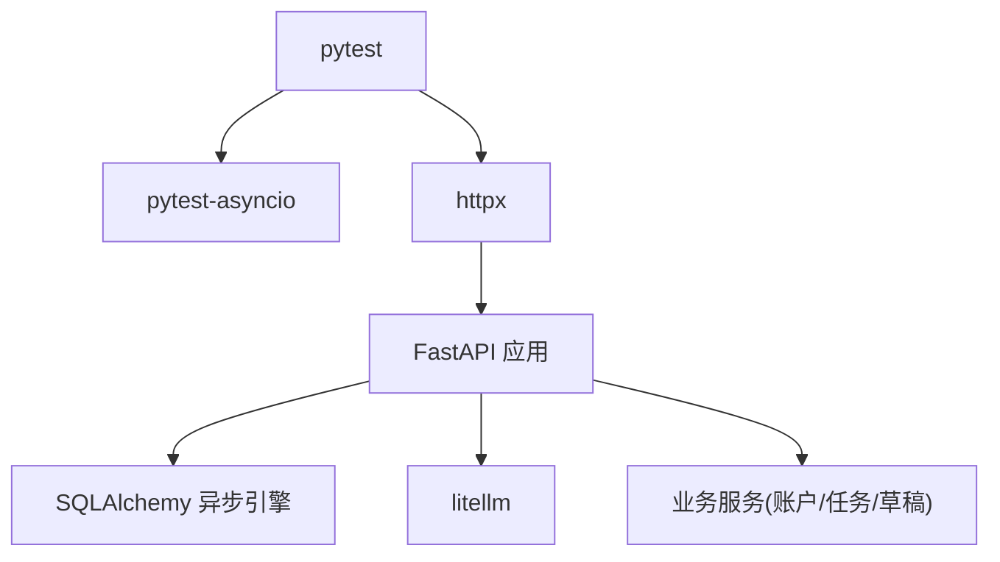

# 测试与调试

<cite>
**本文引用的文件**
- [README.md](file://README.md)
- [pyproject.toml](file://backend/pyproject.toml)
- [conftest.py](file://backend/tests/conftest.py)
- [test_workflow.py](file://backend/scripts/test_workflow.py)
- [test_e2e_workflow.py](file://backend/scripts/test_e2e_workflow.py)
- [conftest.py](file://backend/tests/e2e/conftest.py)
- [mock_llm.py](file://backend/tests/e2e/mock_llm.py)
- [test_agent_api.py](file://backend/tests/test_agent_api.py)
- [test_draft.py](file://backend/tests/test_draft.py)
- [test_draft_workflow.py](file://backend/tests/e2e/test_draft_workflow.py)
- [test_scheduler_e2e.py](file://backend/tests/e2e/test_scheduler_e2e.py)
- [start_backend.bat](file://backend/start_backend.bat)
</cite>

## 目录
1. [简介](#简介)
2. [项目结构](#项目结构)
3. [核心组件](#核心组件)
4. [架构总览](#架构总览)
5. [详细组件分析](#详细组件分析)
6. [依赖分析](#依赖分析)
7. [性能考量](#性能考量)
8. [故障排查指南](#故障排查指南)
9. [结论](#结论)

## 简介
本章节概述项目的测试与调试能力，包括单元测试、端到端测试、脚本化工作流验证、Mock LLM 提供商、测试夹具与数据库隔离、以及本地调试启动方式。目标是帮助开发者快速定位问题、验证修复，并在不同环境下稳定运行测试。

## 项目结构
后端测试主要位于 backend/tests 目录，包含：
- 单元测试与集成测试：tests/*.py
- 端到端测试：tests/e2e/*.py
- 测试夹具与共享配置：tests/conftest.py、tests/e2e/conftest.py
- 脚本化工作流验证：scripts/test_workflow.py、scripts/test_e2e_workflow.py
- Mock LLM 响应：tests/e2e/mock_llm.py
- 项目测试配置：backend/pyproject.toml

图表来源
- [README.md:135-177](file://README.md#L135-L177)
- [pyproject.toml:1-41](file://backend/pyproject.toml#L1-L41)
- [conftest.py:1-48](file://backend/tests/conftest.py#L1-L48)
- [conftest.py:1-354](file://backend/tests/e2e/conftest.py#L1-L354)
- [mock_llm.py:1-258](file://backend/tests/e2e/mock_llm.py#L1-L258)
- [test_workflow.py:1-188](file://backend/scripts/test_workflow.py#L1-L188)
- [test_e2e_workflow.py:1-236](file://backend/scripts/test_e2e_workflow.py#L1-L236)

章节来源
- [README.md:135-177](file://README.md#L135-L177)
- [pyproject.toml:1-41](file://backend/pyproject.toml#L1-L41)

## 核心组件
- 测试运行与配置
  - 使用 pytest 作为测试框架，异步模式开启，测试路径指向 tests 目录。
  - 开发依赖包含 pytest、pytest-asyncio、httpx，便于异步 HTTP 客户端测试。
- 测试夹具
  - 共享数据库引擎与会话工厂，使用内存数据库（SQLite）避免 CI 依赖。
  - 通过依赖注入覆盖应用数据库依赖，确保测试隔离。
  - E2E 夹具提供 Mock LLM、调度器 tick 控制器、账户与草稿工厂等。
- Mock LLM
  - 提供确定性响应，按代理类型路由到对应 Mock 数据结构，便于断言。
- 工作流验证脚本
  - test_workflow.py：验证代理注册、工作流节点、数据流与顺序。
  - test_e2e_workflow.py：模拟完整工作流执行，逐代理断言输出键集合。
- API 与业务测试
  - API 测试：验证代理列表与不存在代理的错误返回。
  - 草稿服务测试：验证半自动/全自动/手动模式下草稿状态机与操作约束。
  - 调度器 E2E：验证自动触发、状态同步、失败回退、并发扫描等场景。

章节来源
- [pyproject.toml:38-41](file://backend/pyproject.toml#L38-L41)
- [conftest.py:20-48](file://backend/tests/conftest.py#L20-L48)
- [conftest.py:41-72](file://backend/tests/e2e/conftest.py#L41-L72)
- [mock_llm.py:180-233](file://backend/tests/e2e/mock_llm.py#L180-L233)
- [test_workflow.py:53-187](file://backend/scripts/test_workflow.py#L53-L187)
- [test_e2e_workflow.py:86-235](file://backend/scripts/test_e2e_workflow.py#L86-L235)
- [test_agent_api.py:7-28](file://backend/tests/test_agent_api.py#L7-L28)
- [test_draft.py:19-193](file://backend/tests/test_draft.py#L19-L193)
- [test_draft_workflow.py:20-504](file://backend/tests/e2e/test_draft_workflow.py#L20-L504)
- [test_scheduler_e2e.py:37-221](file://backend/tests/e2e/test_scheduler_e2e.py#L37-L221)

## 架构总览
测试与调试的整体架构围绕“夹具隔离 + Mock 依赖 + 脚本化验证 + API/E2E 场景”展开，确保在不依赖真实外部服务的情况下稳定复现问题并验证修复。

图表来源
- [pyproject.toml:38-41](file://backend/pyproject.toml#L38-L41)
- [conftest.py:20-48](file://backend/tests/conftest.py#L20-L48)
- [conftest.py:41-72](file://backend/tests/e2e/conftest.py#L41-L72)
- [test_workflow.py:53-187](file://backend/scripts/test_workflow.py#L53-L187)
- [test_e2e_workflow.py:86-235](file://backend/scripts/test_e2e_workflow.py#L86-L235)
- [start_backend.bat:1-5](file://backend/start_backend.bat#L1-L5)

## 详细组件分析

### 测试夹具与数据库隔离
- 单元/集成测试夹具
  - 使用内存数据库（SQLite）创建/销毁表，确保每次测试前后环境干净。
  - 通过依赖注入覆盖应用数据库依赖，使测试客户端直接访问测试数据库。
- E2E 夹具增强
  - 提供 Mock LLM，统一响应格式，便于断言。
  - 提供调度器 tick 控制器，允许同步触发调度周期，验证自动触发与状态同步。
  - 提供账户与草稿工厂，快速构造测试数据。

图表来源
- [conftest.py:41-72](file://backend/tests/e2e/conftest.py#L41-L72)
- [conftest.py:20-48](file://backend/tests/conftest.py#L20-L48)

章节来源
- [conftest.py:20-48](file://backend/tests/conftest.py#L20-L48)
- [conftest.py:41-72](file://backend/tests/e2e/conftest.py#L41-L72)

### Mock LLM 响应与路由
- Mock 结构
  - 为每个代理提供固定响应模板，包含领域、受众、风格、关键词、大纲、标题候选、内容等字段。
  - 返回兼容 litellm 的响应对象，包含 choices、usage 等字段。
- 路由逻辑
  - 根据系统提示或用户消息中的关键词判断调用代理，返回相应 Mock 数据。
  - 支持自定义响应控制器，便于在测试中注入特定数据。

图表来源
- [mock_llm.py:180-233](file://backend/tests/e2e/mock_llm.py#L180-L233)
- [mock_llm.py:235-258](file://backend/tests/e2e/mock_llm.py#L235-L258)

章节来源
- [mock_llm.py:15-174](file://backend/tests/e2e/mock_llm.py#L15-L174)
- [mock_llm.py:180-233](file://backend/tests/e2e/mock_llm.py#L180-L233)

### 工作流链路验证（脚本）
- test_workflow.py
  - 注册代理，校验代理注册表完整性。
  - 校验工作流节点数量、输入/输出映射与必需性。
  - 构建数据依赖图，验证外部输入、内部数据流与最终输出。
  - 校验节点顺序是否符合预期。
- test_e2e_workflow.py
  - 在 Workspace 中逐步执行各代理，断言输出键集合。
  - 对热点代理进行简化输入处理，避免外部搜索依赖。

图表来源
- [test_workflow.py:53-187](file://backend/scripts/test_workflow.py#L53-L187)

章节来源
- [test_workflow.py:53-187](file://backend/scripts/test_workflow.py#L53-L187)
- [test_e2e_workflow.py:86-235](file://backend/scripts/test_e2e_workflow.py#L86-L235)

### API 测试
- 列出代理：验证返回码与代理数量、代理标识存在性。
- 获取不存在代理：验证 404 与错误码。

图表来源
- [test_agent_api.py:7-28](file://backend/tests/test_agent_api.py#L7-L28)

章节来源
- [test_agent_api.py:7-28](file://backend/tests/test_agent_api.py#L7-L28)

### 草稿工作流测试
- 半自动模式：任务完成后生成待审核草稿。
- 全自动模式：自动批准并发布。
- 手动模式：生成草稿，不进入待审核。
- 状态机保护：已发布/废弃草稿不可再次确认或重跑。
- API 行为：确认发布接口返回正确状态。
- 列表与计数：按状态过滤与计数。

图表来源
- [test_draft.py:104-193](file://backend/tests/test_draft.py#L104-L193)
- [test_draft_workflow.py:20-504](file://backend/tests/e2e/test_draft_workflow.py#L20-L504)

章节来源
- [test_draft.py:19-193](file://backend/tests/test_draft.py#L19-L193)
- [test_draft_workflow.py:20-504](file://backend/tests/e2e/test_draft_workflow.py#L20-L504)

### 调度器 E2E 测试
- 自动触发场景
  - 半自动：到期账户触发，生成待审核草稿，更新账户状态与下次运行时间。
  - 全自动：到期账户触发，自动批准并发布，系统标记确认。
- 隔离与限制
  - 手动模式不触发；禁用或 auto_run_enabled=false 的账户不触发；未来到期不触发。
  - 存在 pending/running 任务时阻止重复调度。
- 失败与回退
  - LLM 失败时触发回退，任务仍可完成；真正 Orchestrator 失败时同步更新账户状态与错误信息。
- 并发与多账户
  - 支持多账户扫描，互不影响。

图表来源
- [test_scheduler_e2e.py:37-221](file://backend/tests/e2e/test_scheduler_e2e.py#L37-L221)

章节来源
- [test_scheduler_e2e.py:255-800](file://backend/tests/e2e/test_scheduler_e2e.py#L255-L800)

## 依赖分析
- 测试框架与异步支持
  - pytest、pytest-asyncio、httpx 提供异步测试与 HTTP 客户端能力。
- 数据库与会话
  - SQLAlchemy 异步引擎与工厂，内存数据库确保测试隔离。
- LLM 抽象层
  - litellm 提供统一调用接口，配合 Mock 实现稳定测试。
- 调度器与服务
  - 账户调度、任务执行、草稿发布等服务在 E2E 中被直接调用或通过 API 验证。

图表来源
- [pyproject.toml:24-29](file://backend/pyproject.toml#L24-L29)
- [conftest.py:6-11](file://backend/tests/conftest.py#L6-L11)

章节来源
- [pyproject.toml:1-41](file://backend/pyproject.toml#L1-L41)
- [conftest.py:6-11](file://backend/tests/conftest.py#L6-L11)

## 性能考量
- 内存数据库
  - 使用 SQLite 内存数据库减少 IO 开销，提高测试速度。
- Mock LLM
  - 避免真实 LLM 调用延迟与不稳定，提升测试吞吐量。
- 选择性执行
  - 单元测试与 E2E 测试分离，按需运行，缩短反馈周期。
- 并发扫描
  - 调度器 E2E 测试覆盖多账户并发扫描，验证性能与一致性。

## 故障排查指南
- 本地调试启动
  - 使用批处理脚本启动后端服务，指定端口，便于前端联调与手动测试。
- 常见问题定位
  - 代理未注册：使用工作流脚本检查代理注册表与节点定义。
  - 数据流缺失：使用工作流脚本构建依赖图，核对输入/输出映射。
  - 草稿状态异常：查看状态机断言与 API 行为，确认是否处于终端状态。
  - 调度未触发：检查账户状态、到期时间、是否存在 pending/running 任务。
  - LLM 失败：确认是否触发回退；若回退失败，检查 Orchestrator 执行路径。
- 日志与错误码
  - API 测试覆盖错误码与状态码断言，便于快速定位接口问题。

章节来源
- [start_backend.bat:1-5](file://backend/start_backend.bat#L1-L5)
- [test_workflow.py:53-187](file://backend/scripts/test_workflow.py#L53-L187)
- [test_draft_workflow.py:20-504](file://backend/tests/e2e/test_draft_workflow.py#L20-L504)
- [test_scheduler_e2e.py:255-800](file://backend/tests/e2e/test_scheduler_e2e.py#L255-L800)

## 结论
该测试与调试体系通过“夹具隔离 + Mock 依赖 + 脚本化验证 + API/E2E 场景”的组合，实现了对代理链路、草稿状态机与调度器行为的全面覆盖。借助内存数据库与确定性 Mock，测试具备高稳定性与可重复性；结合脚本化工作流验证，能够快速发现配置与数据流问题；E2E 场景则确保端到端行为与错误处理符合预期。建议在开发过程中优先使用单元/集成测试快速反馈，必要时使用 E2E 与脚本化验证进行回归与端到端确认。