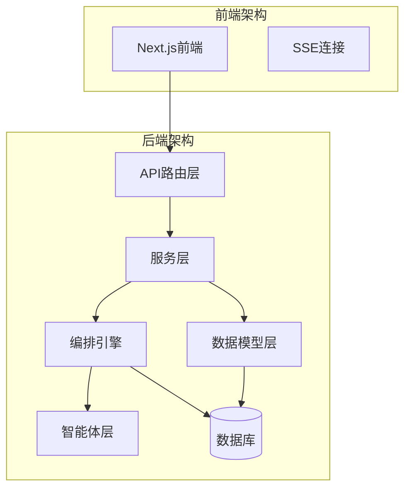
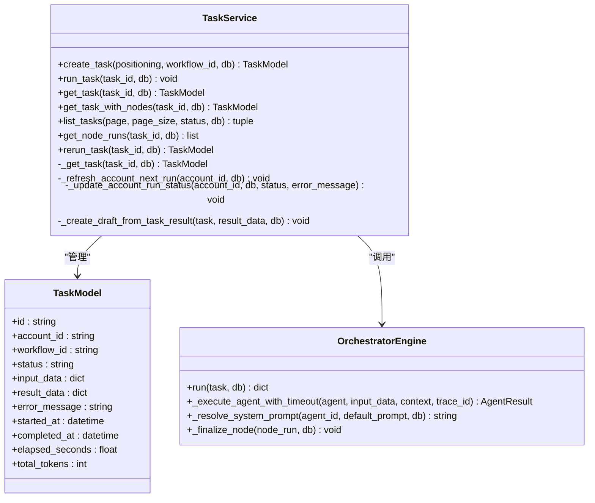
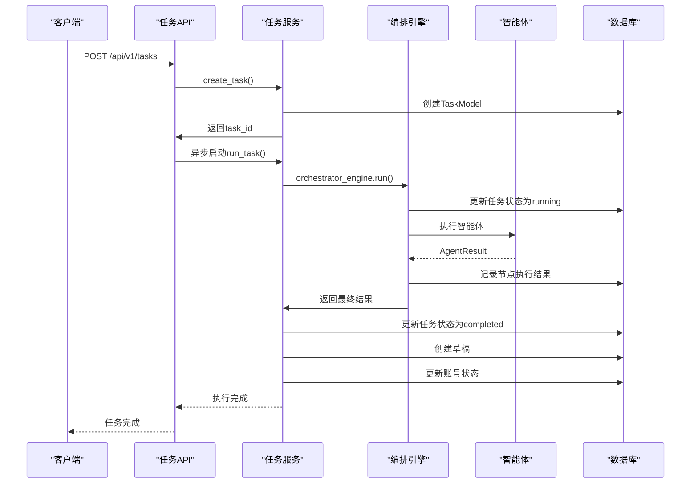
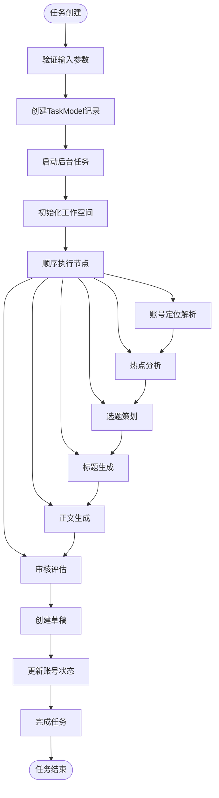
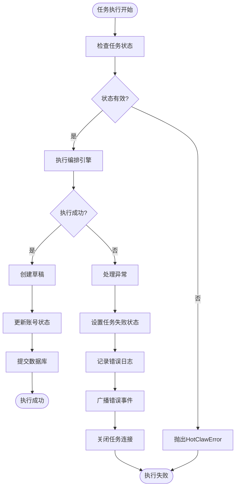
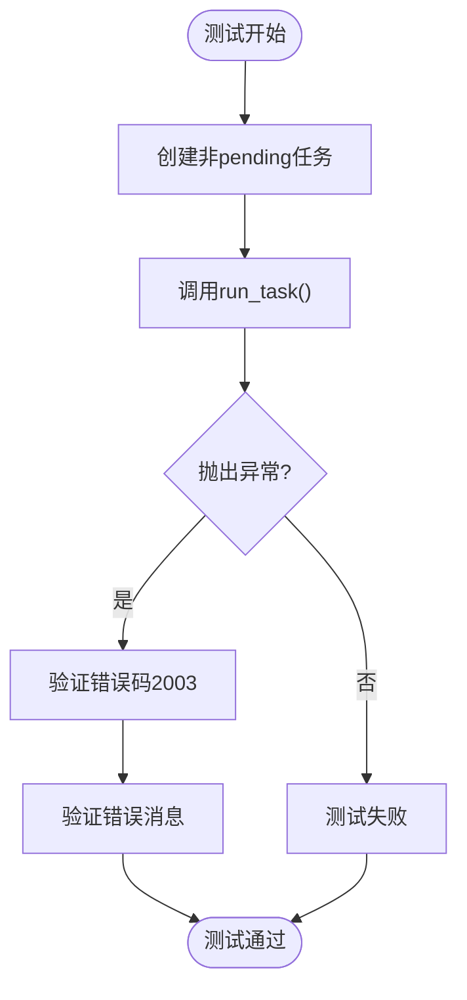
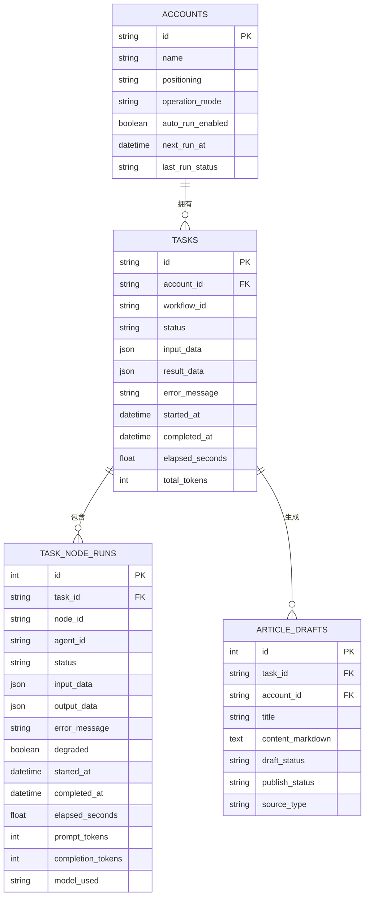
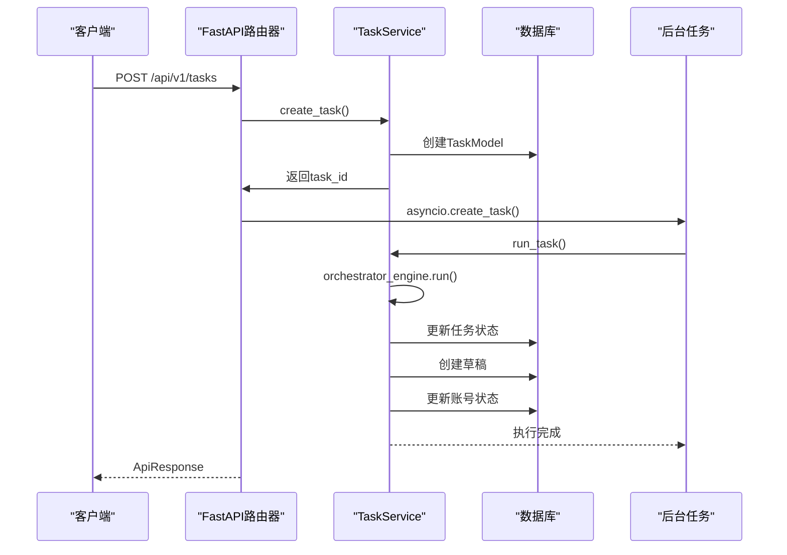
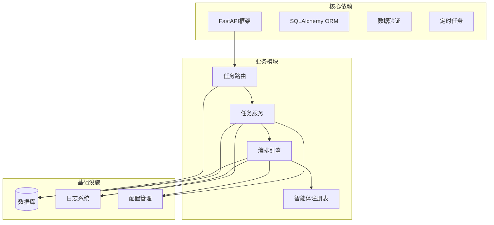

# 任务服务执行测试

<cite>
**本文档引用的文件**
- [test_task_service_run_task.py](file://backend/tests/test_task_service_run_task.py)
- [task_service.py](file://backend/app/services/task_service.py)
- [engine.py](file://backend/app/orchestrator/engine.py)
- [task_routes.py](file://backend/app/api/task_routes.py)
- [tables.py](file://backend/app/models/tables.py)
- [exceptions.py](file://backend/app/core/exceptions.py)
- [conftest.py](file://backend/tests/conftest.py)
- [task.py](file://backend/app/schemas/task.py)
- [base.py](file://backend/app/agents/base.py)
- [config.py](file://backend/app/core/config.py)
</cite>

## 目录
1. [简介](#简介)
2. [项目结构](#项目结构)
3. [核心组件](#核心组件)
4. [架构概览](#架构概览)
5. [详细组件分析](#详细组件分析)
6. [依赖关系分析](#依赖关系分析)
7. [性能考虑](#性能考虑)
8. [故障排除指南](#故障排除指南)
9. [结论](#结论)

## 简介

本文档深入分析HotClaw项目的任务服务执行测试，这是一个基于多智能体架构的微信公众号内容创作平台。系统通过编排引擎协调多个专业智能体，实现从热点分析、选题策划到内容创作的完整工作流。本文档重点关注任务服务的执行测试，包括任务生命周期管理、异常处理、状态同步和数据一致性保证。

## 项目结构

HotClaw项目采用前后端分离的架构设计，后端使用FastAPI框架，数据库采用SQLAlchemy ORM，前端使用Next.js。项目的核心业务逻辑集中在后端的orchestrator、services和models模块中。

**图表来源**
- [task_routes.py:1-298](file://backend/app/api/task_routes.py#L1-L298)
- [task_service.py:1-240](file://backend/app/services/task_service.py#L1-L240)
- [engine.py:1-424](file://backend/app/orchestrator/engine.py#L1-L424)

**章节来源**
- [README.md:135-160](file://README.md#L135-L160)
- [task_routes.py:1-298](file://backend/app/api/task_routes.py#L1-L298)

## 核心组件

### 任务服务（TaskService）

任务服务是系统的核心业务逻辑层，负责任务的完整生命周期管理。它提供了创建任务、执行任务、查询任务状态、重跑任务等功能。

**图表来源**
- [task_service.py:20-240](file://backend/app/services/task_service.py#L20-L240)
- [tables.py:71-100](file://backend/app/models/tables.py#L71-L100)
- [engine.py:132-424](file://backend/app/orchestrator/engine.py#L132-L424)

### 编排引擎（OrchestratorEngine）

编排引擎是系统的大脑，负责定义工作流节点顺序、管理智能体执行、处理超时和降级策略。它实现了线性流水线模式，支持6个专业智能体的顺序执行。

**图表来源**
- [task_routes.py:36-113](file://backend/app/api/task_routes.py#L36-L113)
- [task_service.py:39-92](file://backend/app/services/task_service.py#L39-L92)
- [engine.py:145-344](file://backend/app/orchestrator/engine.py#L145-L344)

**章节来源**
- [task_service.py:1-240](file://backend/app/services/task_service.py#L1-L240)
- [engine.py:1-424](file://backend/app/orchestrator/engine.py#L1-L424)

## 架构概览

系统采用分层架构设计，每层都有明确的职责分工：

### 数据流架构

**图表来源**
- [engine.py:60-129](file://backend/app/orchestrator/engine.py#L60-L129)
- [task_service.py:39-92](file://backend/app/services/task_service.py#L39-L92)

### 异常处理架构

**图表来源**
- [task_service.py:42-92](file://backend/app/services/task_service.py#L42-L92)
- [exceptions.py:19-37](file://backend/app/core/exceptions.py#L19-L37)

**章节来源**
- [task_routes.py:1-298](file://backend/app/api/task_routes.py#L1-L298)
- [task_service.py:1-240](file://backend/app/services/task_service.py#L1-L240)

## 详细组件分析

### 任务状态管理测试

测试用例重点验证了任务状态管理的关键逻辑，包括状态验证、成功路径和失败路径的处理。

#### 状态验证测试

**图表来源**
- [test_task_service_run_task.py:13-29](file://backend/tests/test_task_service_run_task.py#L13-L29)

#### 成功路径测试

成功路径测试验证了任务执行成功时的状态更新和数据持久化：

1. **账号状态更新**：任务完成后更新`last_run_status`为"success"
2. **下次运行时间刷新**：根据账号配置刷新`next_run_at`
3. **草稿创建**：根据任务结果创建相应状态的草稿
4. **数据库事务**：确保所有操作在一个事务中完成

#### 失败路径测试

失败路径测试验证了异常处理机制：

1. **任务状态设置**：失败时设置任务状态为"failed"
2. **错误信息记录**：保存详细的错误信息
3. **账号状态更新**：更新账号的`last_run_status`为"failed"
4. **错误消息持久化**：保存`last_error_message`
5. **事件广播**：通过SSE广播错误事件

**章节来源**
- [test_task_service_run_task.py:1-114](file://backend/tests/test_task_service_run_task.py#L1-L114)

### 数据模型分析

系统使用SQLAlchemy ORM定义了完整的数据模型，包括任务、账号、草稿等相关实体。

**图表来源**
- [tables.py:28-214](file://backend/app/models/tables.py#L28-L214)

**章节来源**
- [tables.py:1-393](file://backend/app/models/tables.py#L1-L393)

### API路由分析

任务API路由提供了完整的REST接口，支持任务的创建、查询、列表和重跑功能。

**图表来源**
- [task_routes.py:67-113](file://backend/app/api/task_routes.py#L67-L113)

**章节来源**
- [task_routes.py:1-298](file://backend/app/api/task_routes.py#L1-L298)

## 依赖关系分析

系统采用了清晰的依赖注入和模块化设计，各组件之间的耦合度较低。

**图表来源**
- [task_routes.py:18-28](file://backend/app/api/task_routes.py#L18-L28)
- [task_service.py:1-17](file://backend/app/services/task_service.py#L1-L17)
- [engine.py:25-42](file://backend/app/orchestrator/engine.py#L25-L42)

**章节来源**
- [task_routes.py:1-298](file://backend/app/api/task_routes.py#L1-L298)
- [task_service.py:1-240](file://backend/app/services/task_service.py#L1-L240)

## 性能考虑

系统在设计时充分考虑了性能优化和可扩展性：

### 异步处理优化

1. **异步数据库操作**：使用SQLAlchemy异步会话，避免阻塞
2. **后台任务执行**：任务执行在独立的异步任务中进行
3. **SSE实时更新**：使用Server-Sent Events提供实时状态更新

### 超时和降级机制

1. **智能体超时控制**：默认120秒超时，防止长时间阻塞
2. **降级策略**：部分节点失败时的降级处理
3. **错误恢复**：异常情况下的状态恢复机制

### 数据一致性保证

1. **事务管理**：关键操作在单个事务中完成
2. **原子性操作**：任务状态更新和草稿创建的原子性
3. **状态验证**：防止重复执行和状态冲突

## 故障排除指南

### 常见问题诊断

#### 任务状态异常

当遇到任务状态异常时，可以通过以下步骤进行诊断：

1. **检查任务状态**：确认任务是否处于正确的状态
2. **查看错误日志**：检查具体的错误信息和堆栈跟踪
3. **验证数据库连接**：确保数据库连接正常
4. **检查超时配置**：确认agent_timeout设置合理

#### 编排引擎问题

编排引擎常见问题及解决方案：

1. **智能体执行失败**：检查智能体的输入输出schema
2. **工作空间数据丢失**：验证Workspace的数据传递
3. **节点执行超时**：增加超时时间或优化智能体逻辑

#### 数据库问题

1. **连接池耗尽**：检查数据库连接配置
2. **事务冲突**：避免并发修改相同记录
3. **索引优化**：为常用查询字段建立索引

**章节来源**
- [exceptions.py:1-366](file://backend/app/core/exceptions.py#L1-L366)
- [config.py:133-140](file://backend/app/core/config.py#L133-L140)

## 结论

HotClaw的任务服务执行测试展现了现代异步Web应用的最佳实践。通过精心设计的分层架构、完善的异常处理机制和严格的测试覆盖，系统能够可靠地执行复杂的多智能体工作流。

### 主要优势

1. **清晰的架构设计**：分层架构使得代码易于维护和扩展
2. **完善的测试覆盖**：关键业务逻辑都有相应的测试用例
3. **健壮的异常处理**：统一的异常体系和错误码设计
4. **高性能的异步处理**：充分利用异步I/O提升系统性能

### 改进建议

1. **监控和告警**：增加更详细的性能监控和告警机制
2. **日志聚合**：实现集中化的日志收集和分析
3. **缓存策略**：为频繁查询的数据增加缓存层
4. **负载均衡**：支持多实例部署和水平扩展

通过持续的测试驱动开发和性能优化，HotClaw项目为多智能体内容创作平台提供了坚实的技术基础。