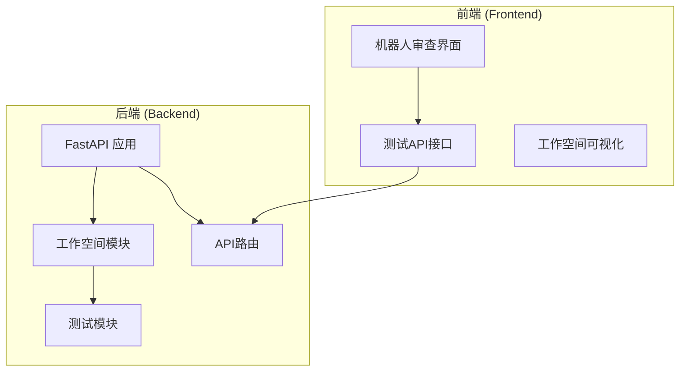
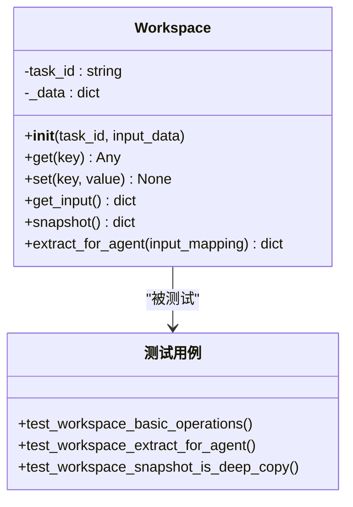
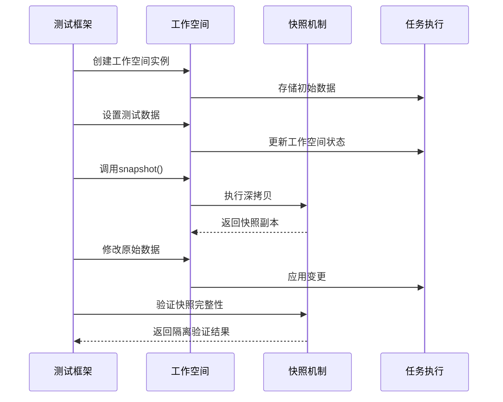
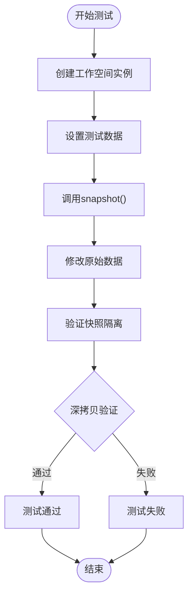
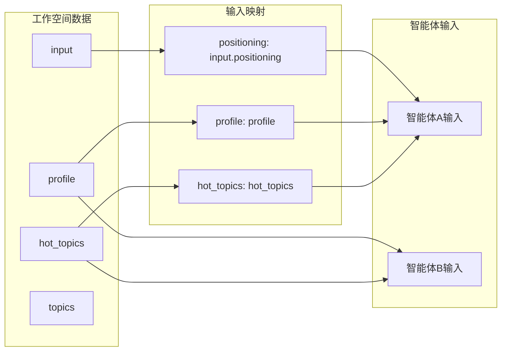
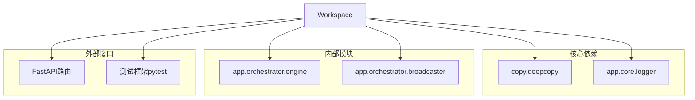

# 工作空间快照隔离测试

<cite>
**本文档引用的文件**
- [workspace.py](file://backend/app/orchestrator/workspace.py)
- [test_workspace.py](file://backend/tests/test_workspace.py)
- [route.ts](file://OpenClaw-bot-review-main/app/api/test-bound-models/route.ts)
- [route.ts](file://OpenClaw-bot-review-main/app/api/test-platforms/route.ts)
- [route.ts](file://OpenClaw-bot-review-main/app/api/test-sessions/route.ts)
- [route.ts](file://OpenClaw-bot-review-main/app/api/test-dm-sessions/route.ts)
- [main.py](file://backend/app/main.py)
</cite>

## 目录
1. [简介](#简介)
2. [项目结构](#项目结构)
3. [核心组件](#核心组件)
4. [架构概览](#架构概览)
5. [详细组件分析](#详细组件分析)
6. [依赖关系分析](#依赖关系分析)
7. [性能考虑](#性能考虑)
8. [故障排除指南](#故障排除指南)
9. [结论](#结论)

## 简介

本文档深入分析了HotClaw项目中的"工作空间快照隔离测试"机制。该测试确保工作空间（Workspace）在任务执行过程中能够正确实现数据隔离和快照功能，防止不同任务之间的数据污染。

工作空间是HotClaw多智能体内容生产平台的核心组件，负责在智能体之间共享数据，并通过深拷贝机制确保任务间的完全隔离。本文档将详细解析工作空间的设计原理、实现细节以及相关的测试策略。

## 项目结构

HotClaw项目采用前后端分离架构，主要包含以下关键模块：

**图表来源**
- [main.py:112-222](file://backend/app/main.py#L112-L222)
- [workspace.py:26-144](file://backend/app/orchestrator/workspace.py#L26-L144)

**章节来源**
- [main.py:1-222](file://backend/app/main.py#L1-L222)
- [workspace.py:1-144](file://backend/app/orchestrator/workspace.py#L1-L144)

## 核心组件

### 工作空间类 (Workspace)

工作空间是任务执行过程中的核心数据容器，提供以下关键功能：

- **任务级隔离**：每个任务创建独立的工作空间实例
- **数据共享**：支持智能体间的数据传递和共享
- **深拷贝快照**：提供完整的数据备份机制
- **智能体输入提取**：根据映射规则提取所需数据

**图表来源**
- [workspace.py:26-144](file://backend/app/orchestrator/workspace.py#L26-L144)
- [test_workspace.py:7-54](file://backend/tests/test_workspace.py#L7-L54)

**章节来源**
- [workspace.py:26-144](file://backend/app/orchestrator/workspace.py#L26-L144)
- [test_workspace.py:1-54](file://backend/tests/test_workspace.py#L1-L54)

## 架构概览

工作空间快照隔离测试在整个系统架构中的位置如下：

**图表来源**
- [test_workspace.py:43-54](file://backend/tests/test_workspace.py#L43-L54)
- [workspace.py:95-105](file://backend/app/orchestrator/workspace.py#L95-L105)

## 详细组件分析

### 工作空间数据结构

工作空间采用统一的数据结构来组织任务执行过程中的所有中间数据：

| 数据类型 | 描述 | 示例键名 |
|---------|------|----------|
| input | 用户原始输入数据 | positioning |
| profile | 账号画像信息 | domain, tone |
| hot_topics | 热点分析结果 | trend_analysis |
| topics | 选题列表 | topic_list |
| titles | 候选标题 | title_candidates |
| content | 文章正文内容 | article_body |
| audit_result | 审核结果 | compliance_status |

### 快照隔离机制

快照隔离是工作空间的核心特性，通过深拷贝确保数据的完全隔离：

**图表来源**
- [test_workspace.py:43-54](file://backend/tests/test_workspace.py#L43-L54)
- [workspace.py:95-105](file://backend/app/orchestrator/workspace.py#L95-L105)

### 智能体输入提取

工作空间支持灵活的智能体输入提取机制，通过映射规则实现数据的按需提取：

**图表来源**
- [workspace.py:107-143](file://backend/app/orchestrator/workspace.py#L107-L143)

**章节来源**
- [workspace.py:107-143](file://backend/app/orchestrator/workspace.py#L107-L143)
- [test_workspace.py:22-41](file://backend/tests/test_workspace.py#L22-L41)

## 依赖关系分析

工作空间模块在整个系统中的依赖关系如下：

**图表来源**
- [workspace.py:19-23](file://backend/app/orchestrator/workspace.py#L19-L23)

**章节来源**
- [workspace.py:19-23](file://backend/app/orchestrator/workspace.py#L19-L23)

## 性能考虑

### 深拷贝性能优化

工作空间的深拷贝操作在大数据量场景下的性能表现：

- **内存开销**：深拷贝会创建完整的数据副本，内存使用量约为原始数据的2倍
- **时间复杂度**：O(n)算法，其中n为数据结构的节点数量
- **优化策略**：
  - 对于大型数据结构，考虑延迟加载机制
  - 实施数据压缩策略减少内存占用
  - 使用弱引用避免不必要的对象保持

### 并发安全性

工作空间在多任务并发场景下的安全保障：

- **线程安全**：深拷贝操作天然具备线程安全特性
- **原子性**：快照操作在单个方法调用内完成
- **一致性**：确保快照时刻的数据一致性

## 故障排除指南

### 常见问题及解决方案

| 问题类型 | 症状 | 可能原因 | 解决方案 |
|---------|------|----------|----------|
| 快照污染 | 快照随原始数据变化 | 浅拷贝导致 | 检查深拷贝实现 |
| 内存溢出 | 系统内存不足 | 大数据集快照 | 实施数据分块策略 |
| 性能下降 | 快照操作缓慢 | 数据结构复杂 | 优化数据结构设计 |
| 数据丢失 | 快照数据不完整 | 异常中断 | 添加异常处理机制 |

### 调试技巧

1. **日志监控**：启用详细日志记录工作空间操作
2. **内存分析**：定期检查内存使用情况
3. **性能基准**：建立快照操作的性能基线
4. **单元测试**：编写针对性的隔离测试用例

**章节来源**
- [test_workspace.py:43-54](file://backend/tests/test_workspace.py#L43-L54)

## 结论

工作空间快照隔离测试是HotClaw多智能体平台可靠性的关键保障。通过深拷贝机制实现的任务级隔离，确保了不同智能体间的数据独立性和系统的稳定性。

该测试体系的有效性体现在：

- **完整性验证**：覆盖基本操作、数据提取和隔离机制
- **边界条件**：测试嵌套数据结构的深拷贝行为
- **性能考量**：平衡数据隔离与系统性能
- **可维护性**：清晰的测试结构便于持续改进

未来可以考虑的改进方向包括：实施更精细的内存管理策略、优化大数据集的处理性能，以及增强测试用例的覆盖率。