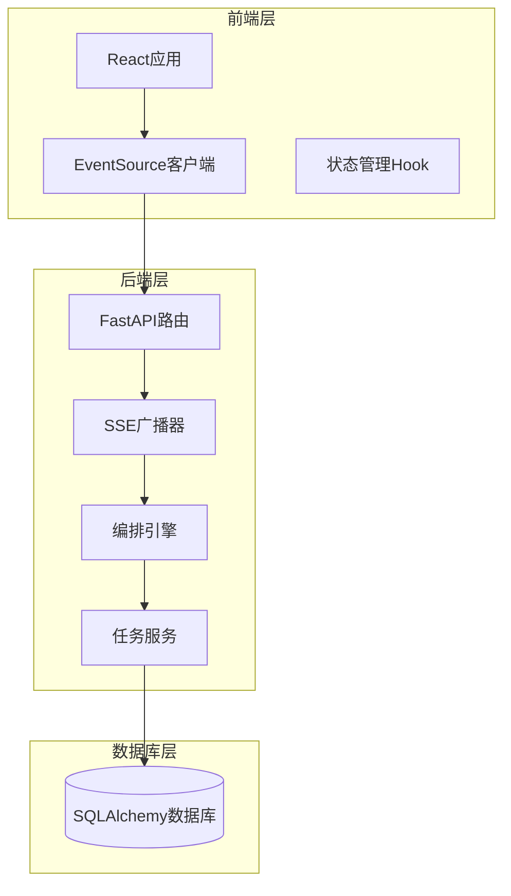
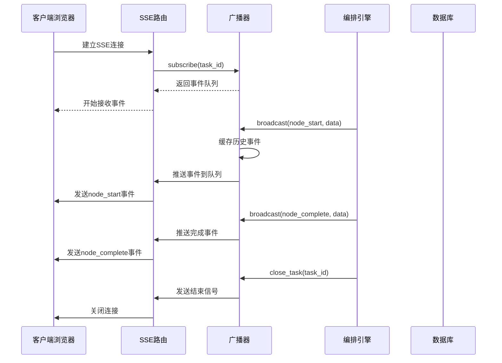
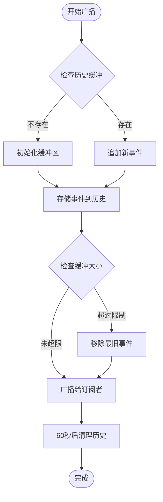
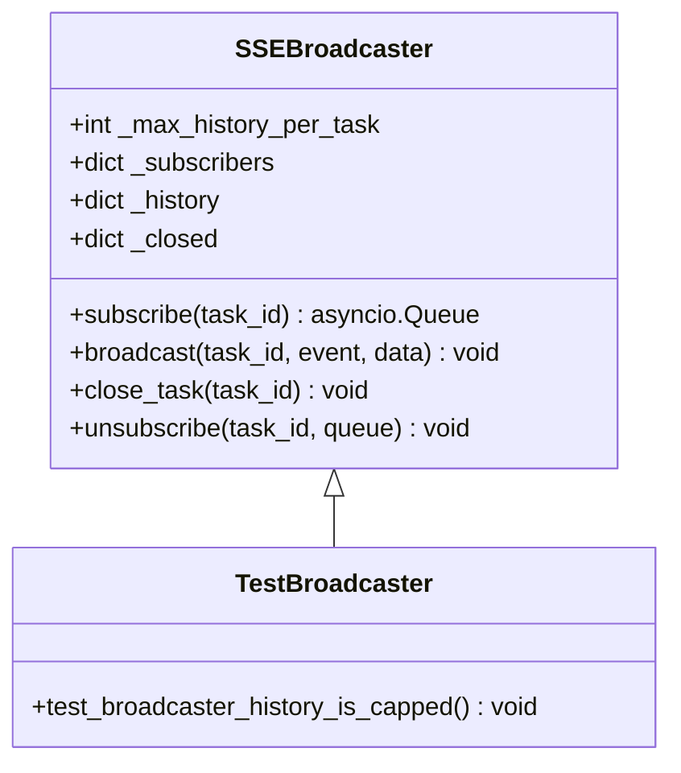
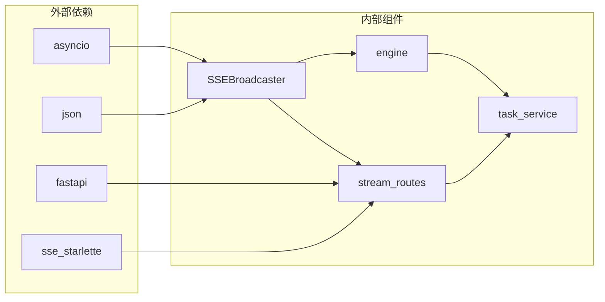

# 广播器历史容量测试

<cite>
**本文档引用的文件**
- [broadcaster.py](file://backend/app/orchestrator/broadcaster.py)
- [test_broadcaster.py](file://backend/tests/test_broadcaster.py)
- [stream_routes.py](file://backend/app/api/stream_routes.py)
- [engine.py](file://backend/app/orchestrator/engine.py)
- [task_service.py](file://backend/app/services/task_service.py)
- [useTaskSSE.ts](file://frontend/hooks/useTaskSSE.ts)
</cite>

## 目录
1. [简介](#简介)
2. [项目结构](#项目结构)
3. [核心组件](#核心组件)
4. [架构概览](#架构概览)
5. [详细组件分析](#详细组件分析)
6. [依赖关系分析](#依赖关系分析)
7. [性能考虑](#性能考虑)
8. [故障排除指南](#故障排除指南)
9. [结论](#结论)

## 简介

本文档深入分析了HotClaw项目中SSE广播器的历史容量测试机制。该系统实现了基于Server-Sent Events (SSE)的任务状态实时推送功能，特别关注于历史事件缓冲和内存管理策略。

系统采用发布-订阅模式，通过SSE广播器管理每个任务的事件流，确保新订阅者能够接收到完整的事件历史，同时通过固定大小的缓冲区防止内存无限增长。

## 项目结构

该项目采用前后端分离的架构设计，主要包含以下关键组件：

**图表来源**
- [broadcaster.py:1-220](file://backend/app/orchestrator/broadcaster.py#L1-L220)
- [stream_routes.py:1-96](file://backend/app/api/stream_routes.py#L1-L96)

**章节来源**
- [broadcaster.py:1-220](file://backend/app/orchestrator/broadcaster.py#L1-L220)
- [stream_routes.py:1-96](file://backend/app/api/stream_routes.py#L1-L96)

## 核心组件

### SSE广播器 (SSEBroadcaster)

SSE广播器是整个系统的核心组件，负责管理任务事件的发布和订阅。其主要特性包括：

- **历史缓冲管理**：维护每个任务的事件历史，支持新订阅者的事件重放
- **内存限制**：通过固定大小的缓冲区防止内存无限增长
- **异步队列管理**：使用asyncio.Queue处理并发订阅
- **优雅关闭**：提供任务结束时的资源清理机制

### SSE流式路由

提供REST API端点`/api/v1/tasks/{task_id}/stream`，实现标准的SSE协议：

- **Keep-alive机制**：定期发送心跳消息防止连接超时
- **连接管理**：自动处理客户端断开连接的情况
- **事件格式化**：遵循SSE协议标准的消息格式

### 编排引擎

负责协调智能体执行流程，并通过广播器推送实时状态：

- **节点执行监控**：在每个节点开始和结束时发送事件
- **错误处理**：捕获异常并向客户端报告错误状态
- **降级策略**：在智能体失败时执行预设的降级操作

**章节来源**
- [broadcaster.py:30-220](file://backend/app/orchestrator/broadcaster.py#L30-L220)
- [stream_routes.py:37-96](file://backend/app/api/stream_routes.py#L37-L96)
- [engine.py:1-424](file://backend/app/orchestrator/engine.py#L1-L424)

## 架构概览

系统采用分层架构设计，各组件职责清晰分离：

**图表来源**
- [stream_routes.py:53-95](file://backend/app/api/stream_routes.py#L53-L95)
- [broadcaster.py:111-146](file://backend/app/orchestrator/broadcaster.py#L111-L146)
- [engine.py:500-537](file://backend/app/orchestrator/engine.py#L500-L537)

## 详细组件分析

### 历史容量管理机制

系统实现了智能的历史事件缓冲机制，确保在内存限制下提供完整的事件历史：

**图表来源**
- [broadcaster.py:129-136](file://backend/app/orchestrator/broadcaster.py#L129-L136)
- [broadcaster.py:171-189](file://backend/app/orchestrator/broadcaster.py#L171-L189)

### 内存管理策略

系统采用多层内存保护机制：

1. **固定历史大小**：每个任务最多保留200个事件
2. **延迟清理机制**：任务结束后60秒清理历史数据
3. **订阅者管理**：自动移除断开连接的订阅者
4. **队列容量控制**：asyncio.Queue的内置容量限制

### 测试验证机制

通过单元测试验证历史容量限制的有效性：

**图表来源**
- [broadcaster.py:30-220](file://backend/app/orchestrator/broadcaster.py#L30-L220)
- [test_broadcaster.py:8-20](file://backend/tests/test_broadcaster.py#L8-L20)

**章节来源**
- [broadcaster.py:49-56](file://backend/app/orchestrator/broadcaster.py#L49-L56)
- [test_broadcaster.py:8-20](file://backend/tests/test_broadcaster.py#L8-L20)

## 依赖关系分析

系统组件间的依赖关系清晰明确：

**图表来源**
- [broadcaster.py:22-25](file://backend/app/orchestrator/broadcaster.py#L22-L25)
- [stream_routes.py:26-30](file://backend/app/api/stream_routes.py#L26-L30)

**章节来源**
- [broadcaster.py:22-25](file://backend/app/orchestrator/broadcaster.py#L22-L25)
- [stream_routes.py:26-30](file://backend/app/api/stream_routes.py#L26-L30)

## 性能考虑

### 内存优化策略

1. **历史缓冲限制**：通过`_max_history_per_task = 200`限制每个任务的内存占用
2. **增量删除**：使用列表切片和索引删除实现高效的内存回收
3. **延迟清理**：60秒延迟清理防止刚建立的订阅者错过事件

### 并发处理优化

1. **异步队列**：使用asyncio.Queue处理高并发订阅请求
2. **非阻塞操作**：put_nowait用于快速重放历史事件
3. **超时控制**：30秒超时防止长时间阻塞

### 网络传输优化

1. **Keep-alive机制**：定期发送注释消息防止连接超时
2. **事件压缩**：使用输出摘要减少数据传输量
3. **连接复用**：单个任务可支持多个并发订阅者

## 故障排除指南

### 常见问题及解决方案

1. **内存泄漏问题**
   - 检查订阅者是否正确取消订阅
   - 验证close_task是否被调用
   - 确认延迟清理机制正常工作

2. **事件丢失问题**
   - 确认历史缓冲机制正常工作
   - 检查新订阅者的事件重放逻辑
   - 验证缓冲区大小设置是否合理

3. **连接超时问题**
   - 检查Keep-alive机制配置
   - 验证网络代理设置
   - 确认客户端EventSource配置

**章节来源**
- [broadcaster.py:171-189](file://backend/app/orchestrator/broadcaster.py#L171-L189)
- [stream_routes.py:72-78](file://backend/app/api/stream_routes.py#L72-L78)

## 结论

HotClaw项目的SSE广播器历史容量测试展现了优秀的系统设计和工程实践：

1. **设计合理性**：通过固定大小的历史缓冲平衡了内存使用和功能完整性
2. **可靠性保障**：多层保护机制确保系统在各种情况下都能稳定运行
3. **性能优化**：异步处理和内存管理策略提供了良好的性能表现
4. **测试覆盖**：完善的单元测试验证了核心功能的正确性

该系统为类似的任务状态实时推送场景提供了优秀的参考实现，特别是在内存管理和并发处理方面具有重要的借鉴价值。