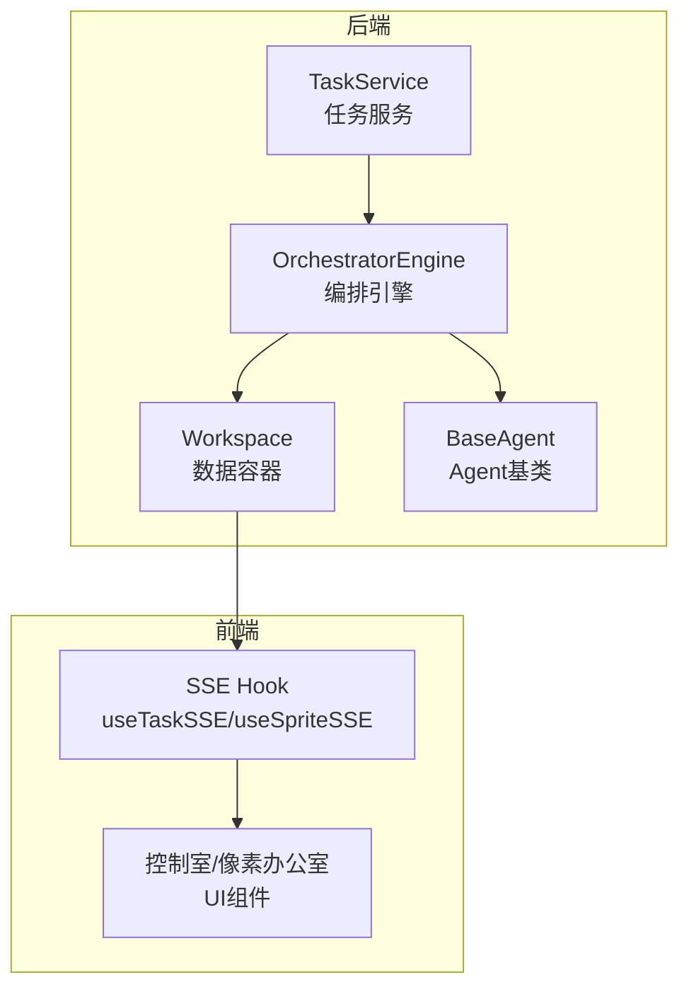
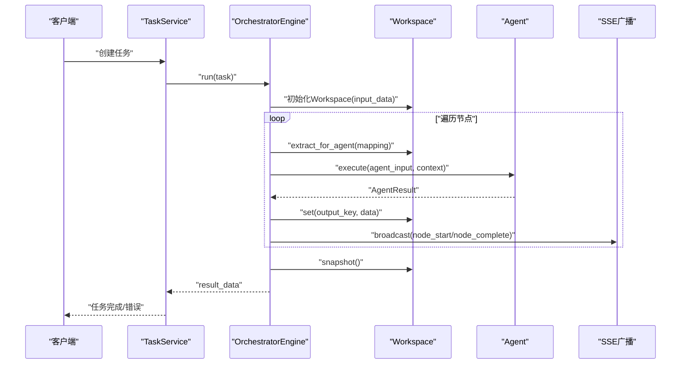
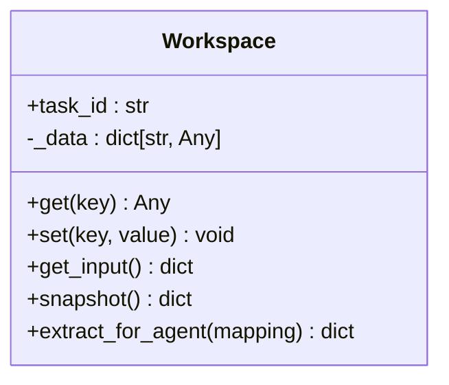
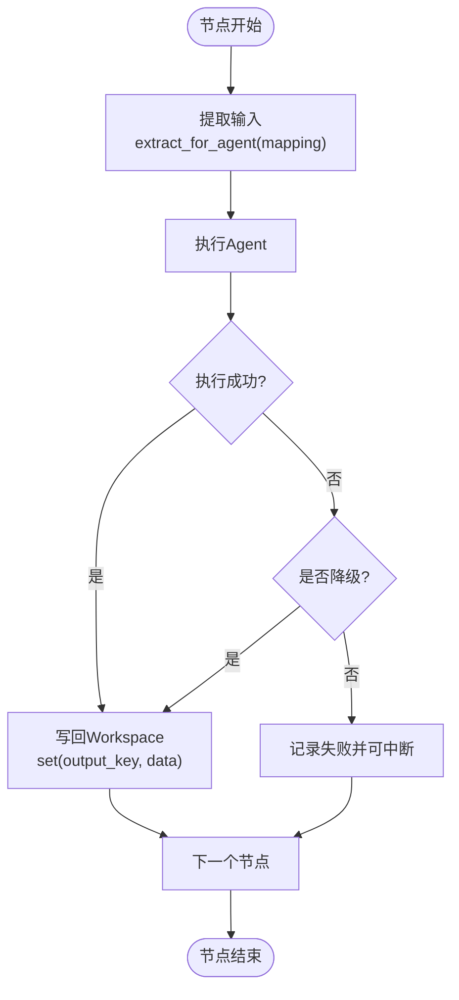
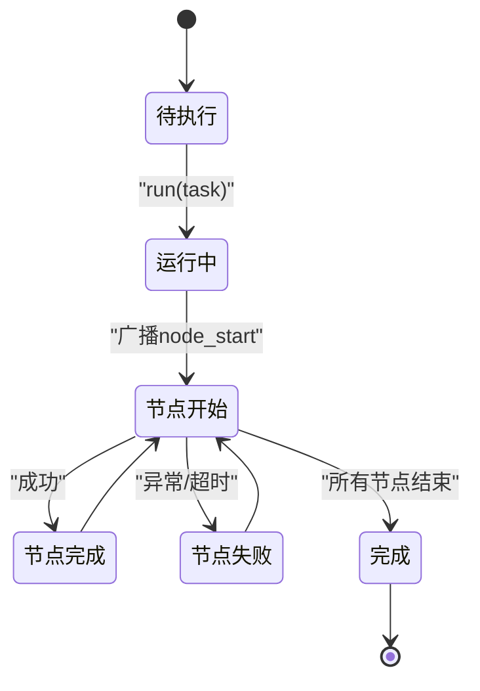
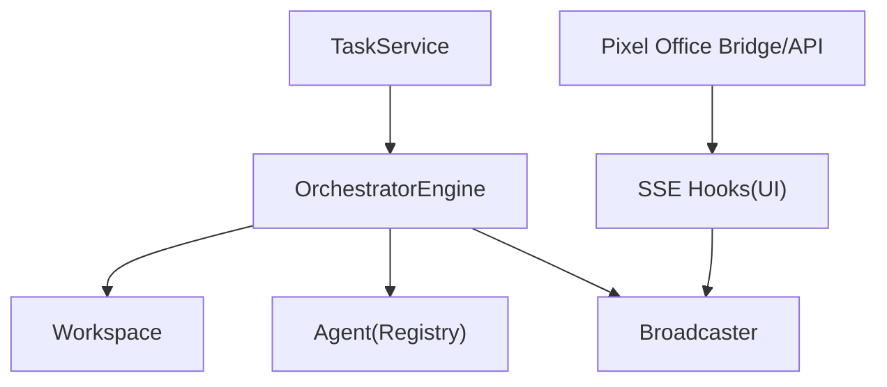

# Workspace上下文管理

<cite>
**本文引用的文件**
- [workspace.py](file://backend/app/orchestrator/workspace.py)
- [engine.py](file://backend/app/orchestrator/engine.py)
- [task_service.py](file://backend/app/services/task_service.py)
- [base.py](file://backend/app/agents/base.py)
- [test_workspace.py](file://backend/tests/test_workspace.py)
- [ARCHITECTURE.md](file://ARCHITECTURE.md)
- [useTaskSSE.ts](file://frontend/hooks/useTaskSSE.ts)
- [useSpriteSSE.ts](file://frontend/hooks/useSpriteSSE.ts)
- [route.ts](file://OpenClaw-bot-review-main/app/api/agent-activity/route.ts)
- [officeState.ts](file://OpenClaw-bot-review-main/lib/pixel-office/engine/officeState.ts)
- [agentBridge.ts](file://OpenClaw-bot-review-main/lib/pixel-office/agentBridge.ts)
</cite>

## 目录
1. [简介](#简介)
2. [项目结构](#项目结构)
3. [核心组件](#核心组件)
4. [架构总览](#架构总览)
5. [组件详细分析](#组件详细分析)
6. [依赖关系分析](#依赖关系分析)
7. [性能考量](#性能考量)
8. [故障排查指南](#故障排查指南)
9. [结论](#结论)
10. [附录](#附录)

## 简介
本文件系统性阐述Workspace上下文管理系统的设计理念、数据存储机制、上下文传递模式、生命周期管理以及并发与线程安全实现细节。Workspace是任务级的隔离上下文容器，负责在工作流节点之间共享数据，支持状态快照、数据提取与值设置，并通过输入映射与输出聚合策略实现父子节点间的数据流转。

## 项目结构
Workspace位于后端编排模块，与任务服务、编排引擎、Agent基类及前端SSE事件流协同工作，形成完整的任务执行与可视化反馈闭环。

图表来源
- [workspace.py:12-52](file://backend/app/orchestrator/workspace.py#L12-L52)
- [engine.py:89-234](file://backend/app/orchestrator/engine.py#L89-L234)
- [task_service.py:20-64](file://backend/app/services/task_service.py#L20-L64)
- [base.py:49-99](file://backend/app/agents/base.py#L49-L99)
- [useTaskSSE.ts:28-35](file://frontend/hooks/useTaskSSE.ts#L28-L35)
- [useSpriteSSE.ts:76-126](file://frontend/hooks/useSpriteSSE.ts#L76-L126)

章节来源
- [workspace.py:12-52](file://backend/app/orchestrator/workspace.py#L12-L52)
- [engine.py:89-234](file://backend/app/orchestrator/engine.py#L89-L234)
- [task_service.py:20-64](file://backend/app/services/task_service.py#L20-L64)
- [base.py:49-99](file://backend/app/agents/base.py#L49-L99)
- [useTaskSSE.ts:28-35](file://frontend/hooks/useTaskSSE.ts#L28-L35)
- [useSpriteSSE.ts:76-126](file://frontend/hooks/useSpriteSSE.ts#L76-L126)

## 核心组件
- Workspace：任务级上下文容器，提供键值对读写、原始输入访问、快照导出与面向Agent的输入提取。
- OrchestratorEngine：顺序调度Agent，基于节点定义进行输入映射、输出写回与节点状态广播。
- TaskService：任务生命周期入口，负责任务创建、后台运行与异常处理。
- BaseAgent：Agent抽象基类，定义统一的执行与降级接口。
- 前端SSE Hook：实时接收节点状态变更，驱动UI更新。

章节来源
- [workspace.py:12-52](file://backend/app/orchestrator/workspace.py#L12-L52)
- [engine.py:89-234](file://backend/app/orchestrator/engine.py#L89-L234)
- [task_service.py:20-64](file://backend/app/services/task_service.py#L20-L64)
- [base.py:49-99](file://backend/app/agents/base.py#L49-L99)

## 架构总览
下图展示了从任务创建到节点执行、上下文传递与结果回传的全链路流程。

图表来源
- [engine.py:92-234](file://backend/app/orchestrator/engine.py#L92-L234)
- [workspace.py:15-52](file://backend/app/orchestrator/workspace.py#L15-L52)
- [task_service.py:39-64](file://backend/app/services/task_service.py#L39-L64)

## 组件详细分析

### Workspace设计与数据存储
- 设计理念
  - 任务级隔离：每个任务创建一个Workspace，确保不同任务间上下文互不干扰。
  - 单向写入：Agent通过set写入，其他组件通过get读取，避免竞态。
  - 明确边界：保留input字段承载原始输入，便于跨节点引用。
- 数据结构
  - 内部以字典存储键值对，键为字符串，值为任意类型。
  - 快照采用浅拷贝，便于持久化与调试。
- 关键方法
  - get(key)：按键读取，不存在返回None。
  - set(key, value)：写入并记录日志。
  - get_input()：返回原始输入。
  - snapshot()：导出全部上下文。
  - extract_for_agent(input_mapping)：根据映射提取Agent输入，支持input.前缀引用原始输入。

图表来源
- [workspace.py:12-52](file://backend/app/orchestrator/workspace.py#L12-L52)

章节来源
- [workspace.py:12-52](file://backend/app/orchestrator/workspace.py#L12-L52)
- [test_workspace.py:7-40](file://backend/tests/test_workspace.py#L7-L40)

### 上下文传递模式与输入映射
- 父子节点共享
  - 前序节点通过set写入的键值在后续节点中可通过extract_for_agent读取。
  - 支持input.前缀直接引用原始输入，便于跨阶段复用。
- 输入映射机制
  - mapping形如{"agent字段": "workspace键"}，支持扁平键映射。
  - 对于需要引用原始输入的场景，使用"input.字段名"。
- 输出聚合策略
  - 每个节点将自身输出写入Workspace指定键，供下游节点使用。
  - 编排器在节点完成后汇总令牌用量并记录节点运行信息。

图表来源
- [engine.py:134-196](file://backend/app/orchestrator/engine.py#L134-L196)
- [workspace.py:36-52](file://backend/app/orchestrator/workspace.py#L36-L52)

章节来源
- [engine.py:134-196](file://backend/app/orchestrator/engine.py#L134-L196)
- [workspace.py:36-52](file://backend/app/orchestrator/workspace.py#L36-L52)

### 生命周期管理
- 初始化
  - TaskService创建任务并生成task_id，随后调用OrchestratorEngine.run。
  - Engine在run开始时创建Workspace，传入task.input_data。
- 运行期
  - 每个节点执行前广播node_start，结束后广播node_complete或node_error。
  - 节点运行记录持久化，包含耗时、令牌用量、错误信息等。
- 完成与清理
  - 全流程结束后，Engine对Workspace进行snapshot，写入TaskModel.result_data。
  - 广播task_complete，关闭SSE连接。
  - 异常时记录task_failed并广播task_error。

图表来源
- [engine.py:92-234](file://backend/app/orchestrator/engine.py#L92-L234)
- [task_service.py:39-64](file://backend/app/services/task_service.py#L39-L64)

章节来源
- [engine.py:92-234](file://backend/app/orchestrator/engine.py#L92-L234)
- [task_service.py:39-64](file://backend/app/services/task_service.py#L39-L64)

### 数据访问最佳实践
- 键值对操作
  - 使用get/set进行读写，避免直接修改内部结构。
  - 对不存在的键读取返回None，需在调用方进行判空处理。
- 嵌套数据处理
  - 支持任意类型值，建议在Agent层进行Schema校验与转换。
  - 对深层嵌套建议通过扁平键或约定的命名空间组织，提升可维护性。
- 类型安全保证
  - 建议在Agent基类层面引入输入/输出Schema（Pydantic），在Engine中进行验证后再写回Workspace。
  - 对外部输入（input_data）进行严格校验，防止污染后续节点。

章节来源
- [base.py:49-99](file://backend/app/agents/base.py#L49-L99)
- [engine.py:144-152](file://backend/app/orchestrator/engine.py#L144-L152)

### 并发访问控制与线程安全
- 并发模型
  - 编排器以异步协程顺序执行节点，避免多Agent并发写同一键。
  - Workspace内部为单线程上下文，无需锁保护。
- 线程安全实现细节
  - Workspace未使用共享可变状态，读写均在同一事件循环内完成。
  - 日志记录与SSE广播由独立组件负责，不影响Workspace一致性。
- 建议
  - 如未来扩展为多进程或多线程，应在Engine层引入队列与锁，或改为只在Engine内写入，其他组件只读。

章节来源
- [engine.py:134-196](file://backend/app/orchestrator/engine.py#L134-L196)
- [workspace.py:19-26](file://backend/app/orchestrator/workspace.py#L19-L26)

## 依赖关系分析
- 组件耦合
  - Engine强依赖Workspace与Agent Registry；弱依赖TaskService与Broadcaster。
  - Workspace低耦合，仅依赖日志组件。
  - TaskService仅负责任务生命周期，不直接参与上下文写入。
- 外部集成
  - 前端通过SSE订阅节点事件，实时更新UI。
  - 像素办公室子Agent展示通过API与Bridge同步，与Workspace解耦。

图表来源
- [engine.py:18-26](file://backend/app/orchestrator/engine.py#L18-L26)
- [task_service.py:14-15](file://backend/app/services/task_service.py#L14-L15)
- [useTaskSSE.ts:28-35](file://frontend/hooks/useTaskSSE.ts#L28-L35)
- [agentBridge.ts:28-80](file://OpenClaw-bot-review-main/lib/pixel-office/agentBridge.ts#L28-L80)

章节来源
- [engine.py:18-26](file://backend/app/orchestrator/engine.py#L18-L26)
- [task_service.py:14-15](file://backend/app/services/task_service.py#L14-L15)
- [useTaskSSE.ts:28-35](file://frontend/hooks/useTaskSSE.ts#L28-L35)
- [agentBridge.ts:28-80](file://OpenClaw-bot-review-main/lib/pixel-office/agentBridge.ts#L28-L80)

## 性能考量
- 时间复杂度
  - get/set/extract_for_agent均为O(1)字典操作。
  - snapshot为浅拷贝，复杂度O(n)，n为上下文键数量。
- 空间复杂度
  - 上下文存储随节点数与中间产物增长，建议在Agent层及时清理不再使用的键。
- 优化建议
  - 对大对象采用延迟加载或分段存储。
  - 在Engine层限制中间产物大小，必要时进行裁剪或归档。

## 故障排查指南
- 常见问题
  - 读取不存在的键：get返回None，需在调用方进行判空。
  - 输入映射缺失：extract_for_agent对不存在的键返回None，检查mapping与键名。
  - 节点失败：查看node_error事件与TaskModel.error_message，定位Agent异常。
- 调试手段
  - 启用日志：Workspace在set时记录日志，便于追踪写入轨迹。
  - 使用snapshot：在关键节点导出上下文，辅助问题复现。
  - 前端SSE：通过node_start/node_complete/node_error确认执行进度。

章节来源
- [workspace.py:19-26](file://backend/app/orchestrator/workspace.py#L19-L26)
- [engine.py:164-196](file://backend/app/orchestrator/engine.py#L164-L196)
- [useSpriteSSE.ts:102-126](file://frontend/hooks/useSpriteSSE.ts#L102-L126)

## 结论
Workspace作为任务级上下文容器，提供了简洁而强大的数据共享能力。通过明确的输入映射与输出聚合策略，结合编排引擎的顺序执行与事件广播，实现了从任务创建到结果回传的完整生命周期管理。在保证线程安全的前提下，建议在Agent层引入Schema校验与中间产物治理，进一步提升系统的稳定性与可维护性。

## 附录
- 子Agent在像素办公室中的展示与生命周期
  - 通过API返回活跃子Agent集合，并在父Agent离线时清空。
  - Bridge负责创建/移除子Agent角色，命名统一为“外包”，并保持working状态。
  - 与Workspace解耦，仅消费活动数据。

章节来源
- [route.ts:345-379](file://OpenClaw-bot-review-main/app/api/agent-activity/route.ts#L345-L379)
- [officeState.ts:1290-1405](file://OpenClaw-bot-review-main/lib/pixel-office/engine/officeState.ts#L1290-L1405)
- [agentBridge.ts:28-80](file://OpenClaw-bot-review-main/lib/pixel-office/agentBridge.ts#L28-L80)