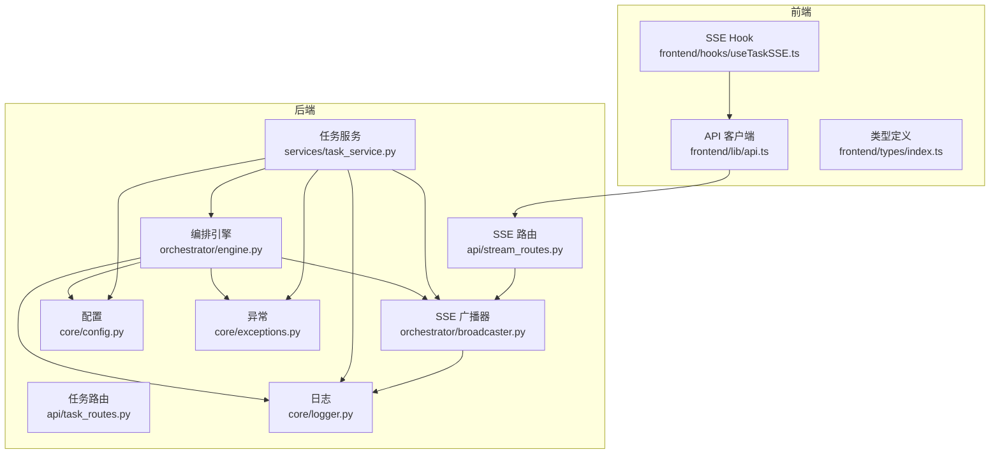
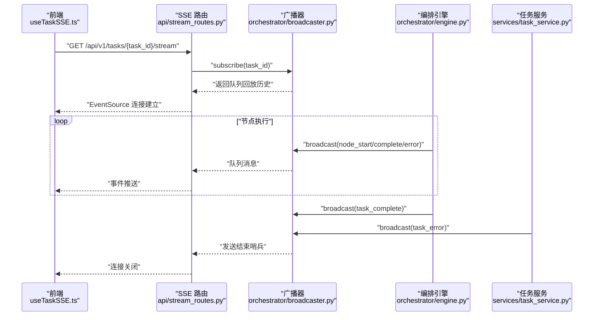
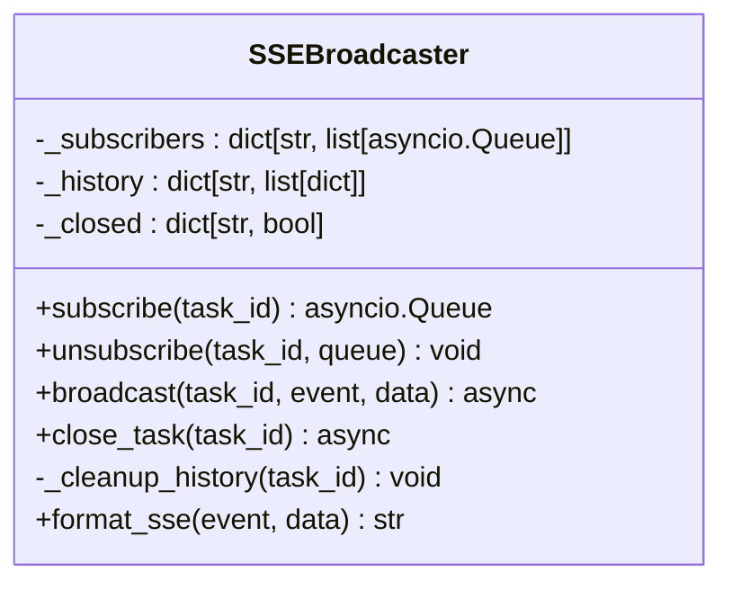
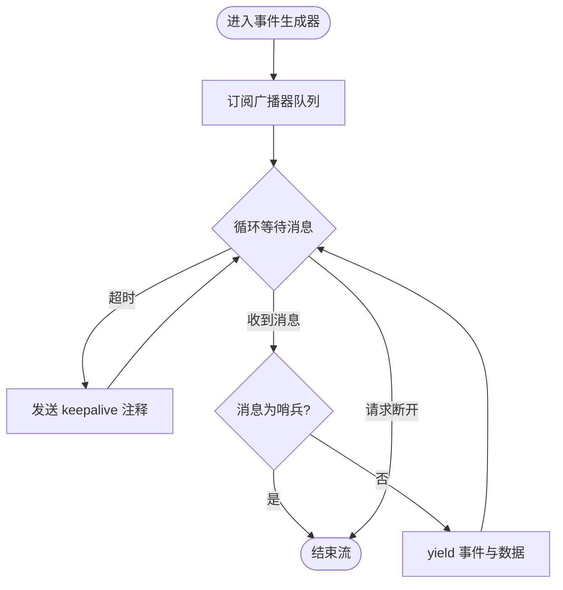
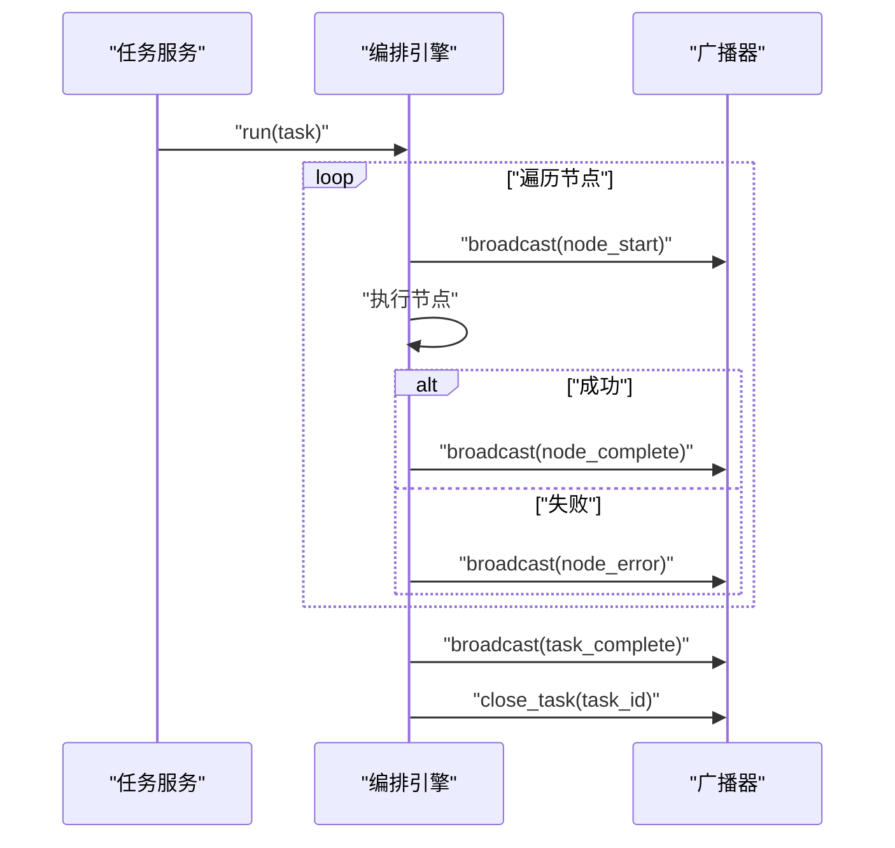
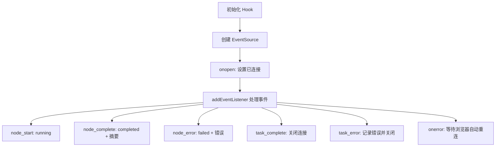
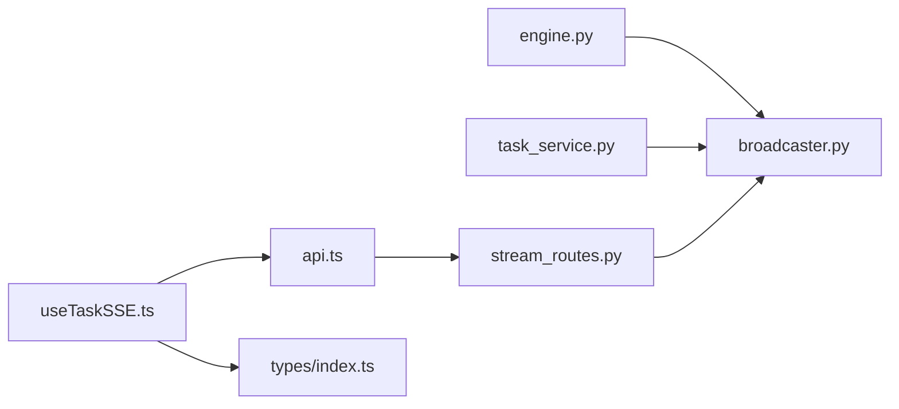

# 事件广播系统

<cite>
**本文档引用的文件**
- [backend/app/orchestrator/broadcaster.py](file://backend/app/orchestrator/broadcaster.py)
- [backend/app/api/stream_routes.py](file://backend/app/api/stream_routes.py)
- [backend/app/orchestrator/engine.py](file://backend/app/orchestrator/engine.py)
- [backend/app/services/task_service.py](file://backend/app/services/task_service.py)
- [frontend/hooks/useTaskSSE.ts](file://frontend/hooks/useTaskSSE.ts)
- [frontend/lib/api.ts](file://frontend/lib/api.ts)
- [frontend/types/index.ts](file://frontend/types/index.ts)
- [backend/app/schemas/task.py](file://backend/app/schemas/task.py)
- [backend/app/models/tables.py](file://backend/app/models/tables.py)
- [backend/app/api/task_routes.py](file://backend/app/api/task_routes.py)
- [backend/app/core/logger.py](file://backend/app/core/logger.py)
- [backend/app/core/config.py](file://backend/app/core/config.py)
- [backend/app/core/exceptions.py](file://backend/app/core/exceptions.py)
</cite>

## 目录
1. [简介](#简介)
2. [项目结构](#项目结构)
3. [核心组件](#核心组件)
4. [架构总览](#架构总览)
5. [详细组件分析](#详细组件分析)
6. [依赖关系分析](#依赖关系分析)
7. [性能考虑](#性能考虑)
8. [故障排查指南](#故障排查指南)
9. [结论](#结论)
10. [附录](#附录)

## 简介
本文件面向事件广播系统（基于 Server-Sent Events，简称 SSE）的技术文档，围绕以下目标展开：
- 解释 SSE 事件流的实现原理：连接管理、消息序列化与客户端推送机制
- 定义事件类型与消息格式规范：node_start、node_complete、node_error、task_complete 及 task_error
- 阐述客户端连接生命周期：连接建立、心跳保活与断线重连策略
- 事件队列与消息缓冲：内存优化与性能调优
- 错误处理与异常恢复：广播器、服务层与前端的协同
- 监控与调试：日志、指标与排障建议

## 项目结构
事件广播系统由后端广播器、SSE 路由、编排引擎、任务服务与前端 Hook 组成，形成“事件产生 → 广播 → 推送 → 前端消费”的闭环。

图表来源
- [backend/app/orchestrator/engine.py:89-234](file://backend/app/orchestrator/engine.py#L89-L234)
- [backend/app/services/task_service.py:39-63](file://backend/app/services/task_service.py#L39-L63)
- [backend/app/orchestrator/broadcaster.py:11-98](file://backend/app/orchestrator/broadcaster.py#L11-L98)
- [backend/app/api/stream_routes.py:14-42](file://backend/app/api/stream_routes.py#L14-L42)
- [frontend/hooks/useTaskSSE.ts:28-143](file://frontend/hooks/useTaskSSE.ts#L28-L143)
- [frontend/lib/api.ts:48-55](file://frontend/lib/api.ts#L48-L55)
- [backend/app/core/logger.py:8-35](file://backend/app/core/logger.py#L8-L35)
- [backend/app/core/config.py:52-98](file://backend/app/core/config.py#L52-L98)
- [backend/app/core/exceptions.py:4-124](file://backend/app/core/exceptions.py#L4-L124)

章节来源
- [backend/app/orchestrator/broadcaster.py:11-98](file://backend/app/orchestrator/broadcaster.py#L11-L98)
- [backend/app/api/stream_routes.py:14-42](file://backend/app/api/stream_routes.py#L14-L42)
- [frontend/hooks/useTaskSSE.ts:28-143](file://frontend/hooks/useTaskSSE.ts#L28-L143)

## 核心组件
- SSE 广播器：维护每个任务的订阅者队列、历史事件缓冲与关闭标记；负责事件入队、广播与清理
- SSE 路由：FastAPI 路由，使用 EventSourceResponse 提供 /api/v1/tasks/{task_id}/stream
- 编排引擎：在节点执行前后广播 node_start/node_complete/node_error，在任务完成后广播 task_complete 并关闭流
- 任务服务：封装任务生命周期，异常时广播 task_error 并关闭流
- 前端 Hook：React Hook，通过 EventSource 订阅事件，更新节点状态与任务完成标志

章节来源
- [backend/app/orchestrator/broadcaster.py:11-98](file://backend/app/orchestrator/broadcaster.py#L11-L98)
- [backend/app/api/stream_routes.py:14-42](file://backend/app/api/stream_routes.py#L14-L42)
- [backend/app/orchestrator/engine.py:92-234](file://backend/app/orchestrator/engine.py#L92-L234)
- [backend/app/services/task_service.py:39-63](file://backend/app/services/task_service.py#L39-L63)
- [frontend/hooks/useTaskSSE.ts:28-143](file://frontend/hooks/useTaskSSE.ts#L28-L143)

## 架构总览
SSE 事件流从编排引擎与任务服务产生，经广播器缓冲与分发，最终由前端 EventSource 消费。

图表来源
- [backend/app/api/stream_routes.py:18-41](file://backend/app/api/stream_routes.py#L18-L41)
- [backend/app/orchestrator/broadcaster.py:30-84](file://backend/app/orchestrator/broadcaster.py#L30-L84)
- [backend/app/orchestrator/engine.py:124-232](file://backend/app/orchestrator/engine.py#L124-L232)
- [backend/app/services/task_service.py:58-63](file://backend/app/services/task_service.py#L58-L63)

## 详细组件分析

### SSE 广播器（SSEBroadcaster）
- 角色：按 task_id 维护订阅者队列、历史事件缓冲与关闭标记
- 关键能力
  - 订阅与回放：新订阅者加入时回放历史事件，确保晚到客户端不丢失
  - 广播：将事件写入所有订阅者的异步队列
  - 结束与清理：发送结束哨兵，标记任务关闭，并延时清理历史以避免内存泄漏
  - 格式化：将事件与数据序列化为 SSE 文本帧
- 数据结构
  - 订阅者映射：task_id → 队列列表
  - 历史缓冲：task_id → 事件列表
  - 关闭标记：task_id → 布尔值

图表来源
- [backend/app/orchestrator/broadcaster.py:11-98](file://backend/app/orchestrator/broadcaster.py#L11-L98)

章节来源
- [backend/app/orchestrator/broadcaster.py:30-94](file://backend/app/orchestrator/broadcaster.py#L30-L94)

### SSE 路由（/api/v1/tasks/{task_id}/stream）
- 功能：为每个 task_id 提供实时事件流
- 连接管理
  - 订阅：路由在协程中调用广播器订阅，获得队列
  - 心跳：30 秒超时未取到消息则发送注释型 keepalive
  - 断开：请求断开或收到结束哨兵时退出循环并取消订阅
- 消息格式：yield 字典，包含 event 与 data（JSON 序列化）

图表来源
- [backend/app/api/stream_routes.py:18-41](file://backend/app/api/stream_routes.py#L18-L41)

章节来源
- [backend/app/api/stream_routes.py:14-42](file://backend/app/api/stream_routes.py#L14-L42)

### 编排引擎（OrchestratorEngine）
- 触发点：任务后台运行时，逐节点执行
- 事件广播
  - 节点开始：广播 node_start，包含节点索引、总数与启动时间
  - 节点完成：广播 node_complete，包含耗时、降级标记与输出摘要
  - 节点失败：广播 node_error，包含错误信息
  - 任务完成：广播 task_complete，包含任务耗时
  - 任务失败：异常路径中广播 task_error
- 资源收尾：任务完成后调用 close_task 清理历史

图表来源
- [backend/app/orchestrator/engine.py:92-234](file://backend/app/orchestrator/engine.py#L92-L234)
- [backend/app/orchestrator/broadcaster.py:57-84](file://backend/app/orchestrator/broadcaster.py#L57-L84)

章节来源
- [backend/app/orchestrator/engine.py:124-232](file://backend/app/orchestrator/engine.py#L124-L232)

### 任务服务（TaskService）
- 触发点：后台任务运行任务工作流
- 异常处理：捕获异常后设置任务失败状态，记录耗时，广播 task_error 并关闭流

章节来源
- [backend/app/services/task_service.py:39-63](file://backend/app/services/task_service.py#L39-L63)

### 前端事件消费（useTaskSSE.ts）
- 连接建立：根据 taskId 生成 SSE URL，创建 EventSource
- 事件监听
  - node_start：节点状态置为 running
  - node_complete：节点状态置为 completed，填充耗时、摘要与降级标记
  - node_error：节点状态置为 failed，记录错误
  - task_complete：任务完成，关闭连接
  - task_error：任务失败，记录错误并关闭连接
- 心跳与重连：onerror 不主动关闭，交由浏览器自动重连（指数退避）

图表来源
- [frontend/hooks/useTaskSSE.ts:60-140](file://frontend/hooks/useTaskSSE.ts#L60-L140)

章节来源
- [frontend/hooks/useTaskSSE.ts:28-143](file://frontend/hooks/useTaskSSE.ts#L28-L143)
- [frontend/lib/api.ts:48-55](file://frontend/lib/api.ts#L48-L55)
- [frontend/types/index.ts:66-94](file://frontend/types/index.ts#L66-L94)

## 依赖关系分析
- 后端耦合
  - 编排引擎依赖广播器进行事件广播
  - 任务服务在异常路径同样依赖广播器广播任务级错误
  - SSE 路由依赖广播器进行订阅与取消订阅
- 前端耦合
  - useTaskSSE.ts 依赖前端 API 客户端生成 SSE URL
  - 类型定义统一了事件结构，便于前后端契约一致

图表来源
- [backend/app/orchestrator/engine.py:26-26](file://backend/app/orchestrator/engine.py#L26-L26)
- [backend/app/services/task_service.py:15-15](file://backend/app/services/task_service.py#L15-L15)
- [backend/app/api/stream_routes.py:9-9](file://backend/app/api/stream_routes.py#L9-L9)
- [frontend/hooks/useTaskSSE.ts:4-4](file://frontend/hooks/useTaskSSE.ts#L4-L4)
- [frontend/lib/api.ts:48-55](file://frontend/lib/api.ts#L48-L55)
- [frontend/types/index.ts:66-94](file://frontend/types/index.ts#L66-L94)

章节来源
- [backend/app/orchestrator/engine.py:26-26](file://backend/app/orchestrator/engine.py#L26-L26)
- [backend/app/services/task_service.py:15-15](file://backend/app/services/task_service.py#L15-L15)
- [backend/app/api/stream_routes.py:9-9](file://backend/app/api/stream_routes.py#L9-L9)
- [frontend/hooks/useTaskSSE.ts:4-4](file://frontend/hooks/useTaskSSE.ts#L4-L4)
- [frontend/lib/api.ts:48-55](file://frontend/lib/api.ts#L48-L55)
- [frontend/types/index.ts:66-94](file://frontend/types/index.ts#L66-L94)

## 性能考虑
- 内存优化
  - 历史缓冲：广播器为每个任务维护历史事件列表，用于回放；任务结束后通过定时器清理，避免长期占用
  - 订阅者队列：使用 asyncio.Queue，具备背压与异步特性，适合高并发场景
- 超时与保活
  - SSE 路由设置 30 秒超时，超时发送注释型 keepalive，降低连接空闲时的资源占用
- 广播效率
  - 广播器对同一任务的所有订阅者统一入队，减少重复序列化
- 前端渲染
  - React Hook 使用不可变更新策略，避免不必要的重渲染

章节来源
- [backend/app/orchestrator/broadcaster.py:78-89](file://backend/app/orchestrator/broadcaster.py#L78-L89)
- [backend/app/api/stream_routes.py:24-38](file://backend/app/api/stream_routes.py#L24-L38)
- [frontend/hooks/useTaskSSE.ts:74-119](file://frontend/hooks/useTaskSSE.ts#L74-L119)

## 故障排查指南
- 常见问题
  - 连接频繁断开：检查前端 onerror 回调是否被意外关闭；确认浏览器 EventSource 的自动重连行为
  - 事件丢失：确认客户端在连接建立后立即订阅；广播器会回放历史，但仅限于该任务的缓冲期内
  - 任务完成后仍无结束事件：检查编排引擎与任务服务是否正确调用 close_task
- 日志与追踪
  - 后端采用结构化日志，关键事件包含 task_id、事件类型与订阅者数量等上下文
  - 建议在开发环境开启更详细的日志级别，结合 trace_id 进行端到端追踪
- 异常路径
  - 任务服务捕获异常后广播 task_error 并关闭流；编排引擎在节点失败时广播 node_error
  - 前端在收到 task_error 或 task_complete 后关闭连接，避免资源泄露

章节来源
- [backend/app/core/logger.py:8-35](file://backend/app/core/logger.py#L8-L35)
- [backend/app/orchestrator/engine.py:167-196](file://backend/app/orchestrator/engine.py#L167-L196)
- [backend/app/services/task_service.py:58-63](file://backend/app/services/task_service.py#L58-L63)
- [frontend/hooks/useTaskSSE.ts:114-127](file://frontend/hooks/useTaskSSE.ts#L114-L127)

## 结论
事件广播系统通过“编排引擎/服务层 → 广播器 → SSE 路由 → 前端 Hook”的链路，实现了低延迟、可回放的任务执行事件流。系统在连接保活、历史回放、异常广播与资源清理方面具备完整设计，配合结构化日志与前端自动重连机制，能够满足生产环境的稳定性与可观测性需求。

## 附录

### 事件类型与消息格式规范
- node_start
  - 用途：节点开始执行
  - 字段：node_id、agent_id、name、index、total、started_at
- node_complete
  - 用途：节点成功完成
  - 字段：node_id、agent_id、name、elapsed_seconds、degraded、output_summary
- node_error
  - 用途：节点执行失败
  - 字段：node_id、error
- task_complete
  - 用途：任务整体完成
  - 字段：task_id、elapsed_seconds
- task_error
  - 用途：任务执行过程中发生异常
  - 字段：task_id、error

章节来源
- [frontend/types/index.ts:66-94](file://frontend/types/index.ts#L66-L94)
- [backend/app/orchestrator/engine.py:124-232](file://backend/app/orchestrator/engine.py#L124-L232)
- [backend/app/services/task_service.py:58-63](file://backend/app/services/task_service.py#L58-L63)

### 客户端连接生命周期
- 建立：前端根据 taskId 生成 SSE URL，创建 EventSource 并监听事件
- 保活：后端每 30 秒发送注释型 keepalive；前端不主动关闭连接，交由浏览器自动重连
- 结束：收到 task_complete 或 task_error 后，前端关闭连接；后端发送结束哨兵并清理历史

章节来源
- [frontend/hooks/useTaskSSE.ts:60-140](file://frontend/hooks/useTaskSSE.ts#L60-L140)
- [backend/app/api/stream_routes.py:24-38](file://backend/app/api/stream_routes.py#L24-L38)
- [backend/app/orchestrator/broadcaster.py:70-84](file://backend/app/orchestrator/broadcaster.py#L70-L84)

### 事件队列与消息缓冲
- 订阅与回放：新订阅者加入时，广播器将历史事件一次性入队，确保晚到客户端不丢失
- 广播：同一任务的所有订阅者共享一个事件队列，避免重复序列化
- 清理：任务结束后 60 秒清理历史与关闭标记，防止内存泄漏

章节来源
- [backend/app/orchestrator/broadcaster.py:30-45](file://backend/app/orchestrator/broadcaster.py#L30-L45)
- [backend/app/orchestrator/broadcaster.py:78-89](file://backend/app/orchestrator/broadcaster.py#L78-L89)

### 错误处理与异常恢复
- 节点级错误：编排引擎在节点失败时广播 node_error，并根据 required 字段决定是否中断任务
- 任务级错误：任务服务捕获异常后广播 task_error，并关闭流
- 前端恢复：前端在收到错误或完成事件后关闭连接，避免资源泄露；浏览器自动重连以恢复订阅

章节来源
- [backend/app/orchestrator/engine.py:167-196](file://backend/app/orchestrator/engine.py#L167-L196)
- [backend/app/services/task_service.py:58-63](file://backend/app/services/task_service.py#L58-L63)
- [frontend/hooks/useTaskSSE.ts:114-127](file://frontend/hooks/useTaskSSE.ts#L114-L127)

### 监控与调试工具
- 日志：后端使用结构化日志，包含时间戳、级别、模块与 JSON 内容，便于检索与聚合
- 配置：通过配置项控制超时、日志级别等，便于在不同环境调整
- 异常：统一异常体系，便于前端与后端一致处理错误码与消息

章节来源
- [backend/app/core/logger.py:8-35](file://backend/app/core/logger.py#L8-L35)
- [backend/app/core/config.py:52-98](file://backend/app/core/config.py#L52-L98)
- [backend/app/core/exceptions.py:4-124](file://backend/app/core/exceptions.py#L4-L124)