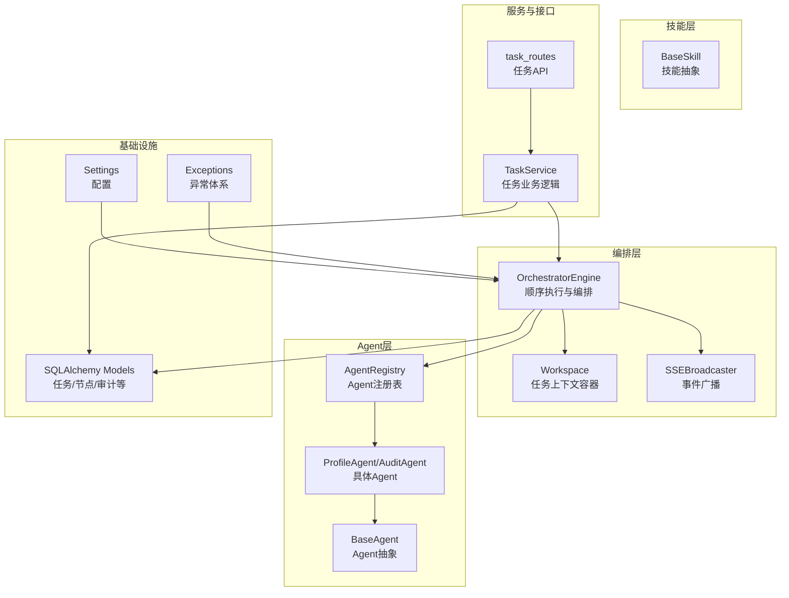
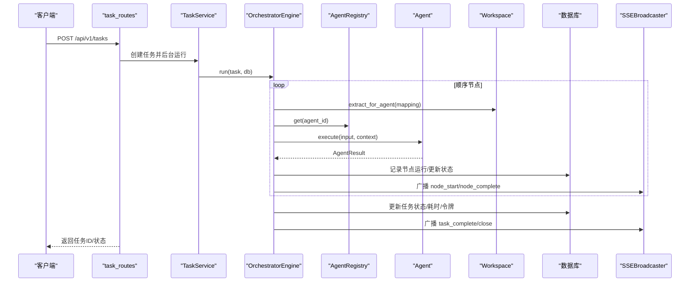
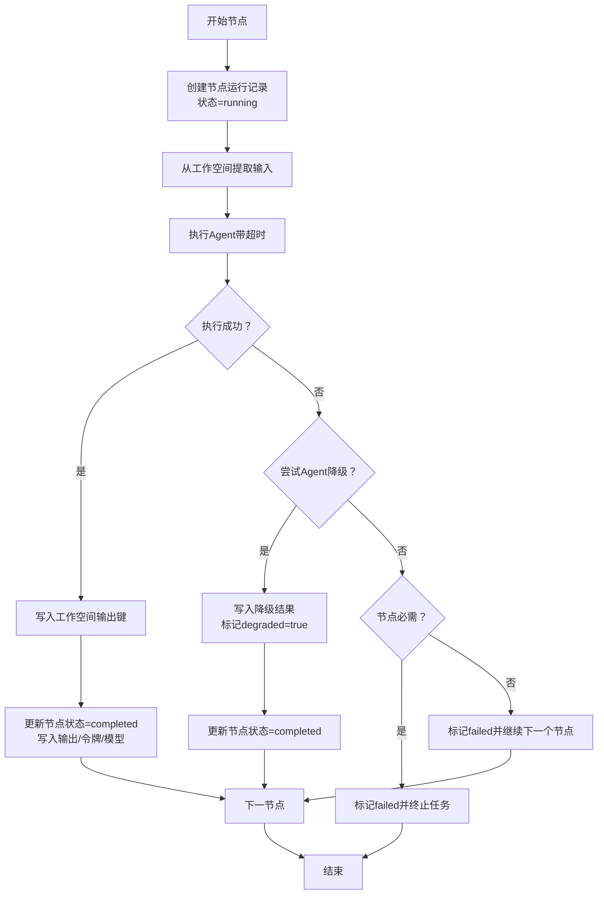
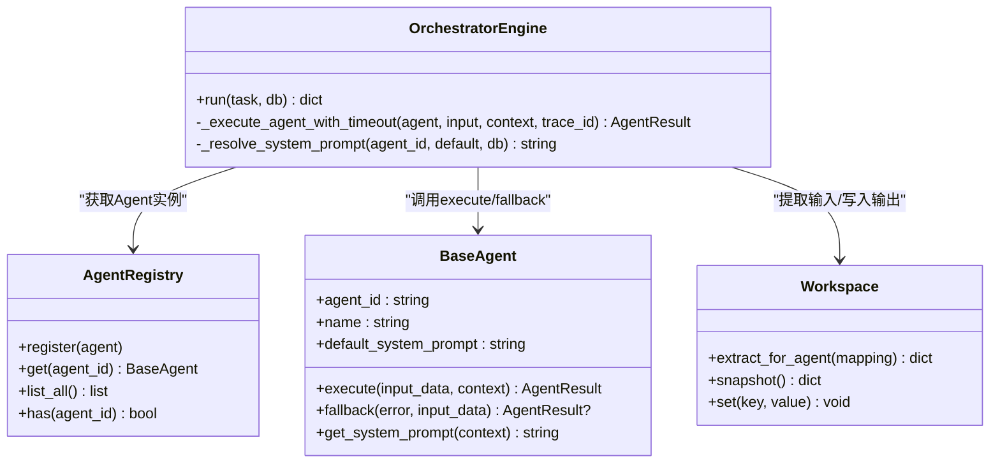
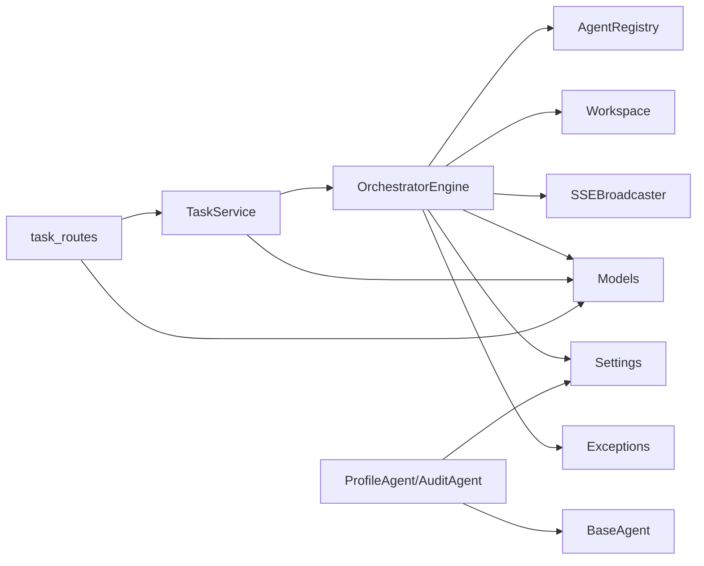

# 工作流执行引擎

<cite>
**本文引用的文件**
- [engine.py](file://backend/app/orchestrator/engine.py)
- [workspace.py](file://backend/app/orchestrator/workspace.py)
- [broadcaster.py](file://backend/app/orchestrator/broadcaster.py)
- [base.py（Agent基类）](file://backend/app/agents/base.py)
- [base.py（Skill基类）](file://backend/app/skills/base.py)
- [registry.py（Agent注册表）](file://backend/app/agents/registry.py)
- [tables.py（模型定义）](file://backend/app/models/tables.py)
- [config.py（配置）](file://backend/app/core/config.py)
- [exceptions.py（异常）](file://backend/app/core/exceptions.py)
- [task_routes.py（任务API）](file://backend/app/api/task_routes.py)
- [task_service.py（任务服务）](file://backend/app/services/task_service.py)
- [profile_agent.py（示例Agent）](file://backend/app/agents/profile_agent.py)
- [audit_agent.py（示例Agent）](file://backend/app/agents/audit_agent.py)
- [main.py（应用入口）](file://backend/app/main.py)
</cite>

## 目录
1. [简介](#简介)
2. [项目结构](#项目结构)
3. [核心组件](#核心组件)
4. [架构总览](#架构总览)
5. [详细组件分析](#详细组件分析)
6. [依赖分析](#依赖分析)
7. [性能考虑](#性能考虑)
8. [故障排查指南](#故障排查指南)
9. [结论](#结论)
10. [附录](#附录)

## 简介
本文件面向“工作流执行引擎”的技术实现，聚焦Sequential Workflow（顺序工作流）模式，系统性阐述节点定义结构、执行顺序控制、流程编排机制；详述节点生命周期管理（初始化、执行状态跟踪、结果收集、清理）；解释Agent调度算法（实例获取、输入映射、上下文传递）；给出错误处理策略（超时、异常捕获、降级）；并提供性能监控指标（令牌统计、执行时间）的实现要点。

## 项目结构
后端采用FastAPI + SQLAlchemy异步架构，核心模块如下：
- orchestrator：编排器、工作空间、事件广播
- agents：Agent抽象、具体Agent实现、注册表
- skills：技能抽象
- models：数据库模型
- services：业务服务（任务服务）
- api：HTTP接口路由
- core：配置、异常、日志、追踪

图表来源
- [engine.py:89-285](file://backend/app/orchestrator/engine.py#L89-L285)
- [workspace.py:12-53](file://backend/app/orchestrator/workspace.py#L12-L53)
- [broadcaster.py:11-99](file://backend/app/orchestrator/broadcaster.py#L11-L99)
- [registry.py:10-40](file://backend/app/agents/registry.py#L10-L40)
- [base.py（Agent基类）:49-99](file://backend/app/agents/base.py#L49-L99)
- [base.py（Skill基类）:16-37](file://backend/app/skills/base.py#L16-L37)
- [task_service.py:20-126](file://backend/app/services/task_service.py#L20-L126)
- [task_routes.py:16-179](file://backend/app/api/task_routes.py#L16-L179)
- [tables.py:23-319](file://backend/app/models/tables.py#L23-L319)
- [config.py:52-99](file://backend/app/core/config.py#L52-L99)
- [exceptions.py:4-125](file://backend/app/core/exceptions.py#L4-L125)

章节来源
- [engine.py:1-285](file://backend/app/orchestrator/engine.py#L1-L285)
- [workspace.py:1-53](file://backend/app/orchestrator/workspace.py#L1-L53)
- [broadcaster.py:1-99](file://backend/app/orchestrator/broadcaster.py#L1-L99)
- [registry.py:1-40](file://backend/app/agents/registry.py#L1-L40)
- [base.py（Agent基类）:1-99](file://backend/app/agents/base.py#L1-L99)
- [base.py（Skill基类）:1-37](file://backend/app/skills/base.py#L1-L37)
- [task_service.py:1-126](file://backend/app/services/task_service.py#L1-L126)
- [task_routes.py:1-179](file://backend/app/api/task_routes.py#L1-L179)
- [tables.py:1-319](file://backend/app/models/tables.py#L1-L319)
- [config.py:1-99](file://backend/app/core/config.py#L1-L99)
- [exceptions.py:1-125](file://backend/app/core/exceptions.py#L1-L125)

## 核心组件
- 编排器（OrchestratorEngine）：顺序执行节点，管理任务与节点运行记录，汇总令牌与耗时，驱动事件广播。
- 工作空间（Workspace）：任务级上下文容器，提供键值存取、快照、Agent输入提取。
- 事件广播（SSEBroadcaster）：按任务维护订阅队列与历史缓冲，支持延迟订阅重放。
- Agent注册表（AgentRegistry）：集中注册与检索Agent实例。
- Agent抽象（BaseAgent）：统一执行接口、结果封装、降级回调。
- 技能抽象（BaseSkill）：工具能力接口，供Agent调用。
- 任务服务（TaskService）：任务生命周期业务逻辑，后台触发编排器。
- 模型（SQLAlchemy）：持久化任务、节点运行、审计结果等。
- 配置（Settings）：超时、LLM参数等全局配置。
- 异常（Exceptions）：统一错误码与分类。

章节来源
- [engine.py:89-285](file://backend/app/orchestrator/engine.py#L89-L285)
- [workspace.py:12-53](file://backend/app/orchestrator/workspace.py#L12-L53)
- [broadcaster.py:11-99](file://backend/app/orchestrator/broadcaster.py#L11-L99)
- [registry.py:10-40](file://backend/app/agents/registry.py#L10-L40)
- [base.py（Agent基类）:49-99](file://backend/app/agents/base.py#L49-L99)
- [base.py（Skill基类）:16-37](file://backend/app/skills/base.py#L16-L37)
- [task_service.py:20-126](file://backend/app/services/task_service.py#L20-L126)
- [tables.py:23-319](file://backend/app/models/tables.py#L23-L319)
- [config.py:52-99](file://backend/app/core/config.py#L52-L99)
- [exceptions.py:4-125](file://backend/app/core/exceptions.py#L4-L125)

## 架构总览
顺序工作流执行链路：
- API接收任务请求，创建任务并启动后台执行
- 任务服务调用编排器
- 编排器按节点定义顺序执行Agent
- 每个节点：提取输入、注入系统提示、执行Agent、回写节点运行记录、事件广播
- 任务完成后汇总结果、令牌与耗时

图表来源
- [task_routes.py:39-67](file://backend/app/api/task_routes.py#L39-L67)
- [task_service.py:39-64](file://backend/app/services/task_service.py#L39-L64)
- [engine.py:92-234](file://backend/app/orchestrator/engine.py#L92-L234)
- [workspace.py:36-52](file://backend/app/orchestrator/workspace.py#L36-L52)
- [registry.py:23-28](file://backend/app/agents/registry.py#L23-L28)
- [broadcaster.py:57-84](file://backend/app/orchestrator/broadcaster.py#L57-L84)
- [tables.py:23-73](file://backend/app/models/tables.py#L23-L73)

## 详细组件分析

### 节点定义结构与顺序控制
- 默认顺序工作流节点集合以线性链路定义，包含节点ID、Agent ID、名称、输入映射、输出键、是否必需。
- 执行顺序由固定列表顺序严格控制，确保节点不可跳过或增删。
- 节点必需标志影响失败时的终止策略。

章节来源
- [engine.py:31-86](file://backend/app/orchestrator/engine.py#L31-L86)
- [engine.py:107-109](file://backend/app/orchestrator/engine.py#L107-L109)

### 执行顺序控制与流程编排
- 编排器在循环中依次创建节点运行记录、提取输入、解析系统提示、执行Agent、回写结果与状态。
- 使用超时包装执行，确保单节点超时可被识别与处理。
- 成功则写入工作空间输出键；失败时尝试Agent降级，若降级成功则标记降级并继续；否则按必需性决定是否终止。

章节来源
- [engine.py:107-198](file://backend/app/orchestrator/engine.py#L107-L198)
- [engine.py:236-243](file://backend/app/orchestrator/engine.py#L236-L243)

### 工作流节点生命周期管理
- 初始化：创建节点运行记录，设置状态为运行，记录开始时间。
- 执行状态跟踪：节点运行记录持久化，包含开始/结束时间、耗时、令牌统计、错误信息、降级标记。
- 结果收集：将Agent输出写入工作空间对应输出键。
- 清理：计算耗时并落库；节点完成时广播事件；任务完成后广播完成事件并关闭流。

图表来源
- [engine.py:113-198](file://backend/app/orchestrator/engine.py#L113-L198)
- [engine.py:265-271](file://backend/app/orchestrator/engine.py#L265-L271)

章节来源
- [engine.py:113-198](file://backend/app/orchestrator/engine.py#L113-L198)
- [engine.py:265-271](file://backend/app/orchestrator/engine.py#L265-L271)

### Agent调度算法
- 实例获取：通过Agent注册表按agent_id检索已注册实例。
- 输入数据映射：根据节点定义的input_mapping，将工作空间中的键映射到Agent输入字段；支持直接引用原始输入（input.*）与上层输出键。
- 上下文传递：将工作空间快照作为上下文传入Agent，其中注入有效系统提示（优先使用数据库自定义模板，否则使用Agent默认模板）。
- 超时控制：统一使用配置的agent_timeout进行超时保护。

图表来源
- [registry.py:10-40](file://backend/app/agents/registry.py#L10-L40)
- [base.py（Agent基类）:49-99](file://backend/app/agents/base.py#L49-L99)
- [engine.py:137-147](file://backend/app/orchestrator/engine.py#L137-L147)
- [workspace.py:36-52](file://backend/app/orchestrator/workspace.py#L36-L52)

章节来源
- [registry.py:23-28](file://backend/app/agents/registry.py#L23-L28)
- [base.py（Agent基类）:60-75](file://backend/app/agents/base.py#L60-L75)
- [engine.py:137-147](file://backend/app/orchestrator/engine.py#L137-L147)
- [workspace.py:36-52](file://backend/app/orchestrator/workspace.py#L36-L52)

### 错误处理策略
- 超时处理：捕获异步超时，标记节点失败，必要时终止任务。
- 异常捕获：捕获Agent执行异常与通用异常，记录错误并按必需性决定是否终止。
- 降级机制：当Agent执行失败时，调用其fallback方法；若降级成功则继续流程并标记degraded。
- 事件广播：节点与任务级别的错误均通过SSE广播通知前端。

章节来源
- [engine.py:176-196](file://backend/app/orchestrator/engine.py#L176-L196)
- [engine.py:154-163](file://backend/app/orchestrator/engine.py#L154-L163)
- [broadcaster.py:57-68](file://backend/app/orchestrator/broadcaster.py#L57-L68)
- [exceptions.py:79-91](file://backend/app/core/exceptions.py#L79-L91)

### 性能监控与指标
- 令牌统计：节点运行记录包含prompt_tokens与completion_tokens，编排器在任务完成后累加到任务总令牌数。
- 执行时间：节点与任务均记录开始/结束时间，计算耗时并持久化。
- SSE摘要：节点完成时输出简要摘要用于前端展示。

章节来源
- [engine.py:211-216](file://backend/app/orchestrator/engine.py#L211-L216)
- [engine.py:222-225](file://backend/app/orchestrator/engine.py#L222-L225)
- [engine.py:265-269](file://backend/app/orchestrator/engine.py#L265-L269)
- [engine.py:273-280](file://backend/app/orchestrator/engine.py#L273-L280)
- [tables.py:48-73](file://backend/app/models/tables.py#L48-L73)

### 示例Agent与技能
- ProfileAgent：解析账号定位为结构化画像，具备降级返回兜底数据。
- AuditAgent：对文章进行合规审核与质量评估，具备降级兜底。
- BaseSkill：技能抽象接口，供Agent调用工具能力。

章节来源
- [profile_agent.py:12-102](file://backend/app/agents/profile_agent.py#L12-L102)
- [audit_agent.py:12-141](file://backend/app/agents/audit_agent.py#L12-L141)
- [base.py（Skill基类）:16-37](file://backend/app/skills/base.py#L16-L37)

## 依赖分析
- 编排器依赖：Agent注册表、工作空间、SSE广播、数据库模型、配置、异常、追踪。
- 任务服务依赖：编排器、数据库、SSE广播。
- API路由依赖：任务服务、数据库会话。
- Agent依赖：配置、LLM调用库、抽象基类。
- 模型依赖：SQLAlchemy ORM、JSON/DateTime/Float/Boolean等字段类型。

图表来源
- [task_routes.py:16-179](file://backend/app/api/task_routes.py#L16-L179)
- [task_service.py:20-126](file://backend/app/services/task_service.py#L20-L126)
- [engine.py:18-26](file://backend/app/orchestrator/engine.py#L18-L26)
- [registry.py:10-40](file://backend/app/agents/registry.py#L10-L40)
- [workspace.py:6-9](file://backend/app/orchestrator/workspace.py#L6-L9)
- [broadcaster.py:3-8](file://backend/app/orchestrator/broadcaster.py#L3-L8)
- [tables.py:15-20](file://backend/app/models/tables.py#L15-L20)
- [config.py:52-99](file://backend/app/core/config.py#L52-L99)
- [exceptions.py:4-125](file://backend/app/core/exceptions.py#L4-L125)
- [profile_agent.py:8-9](file://backend/app/agents/profile_agent.py#L8-L9)
- [audit_agent.py:8-9](file://backend/app/agents/audit_agent.py#L8-L9)
- [base.py（Agent基类）:11-13](file://backend/app/agents/base.py#L11-L13)

章节来源
- [task_routes.py:1-179](file://backend/app/api/task_routes.py#L1-L179)
- [task_service.py:1-126](file://backend/app/services/task_service.py#L1-L126)
- [engine.py:1-285](file://backend/app/orchestrator/engine.py#L1-L285)
- [registry.py:1-40](file://backend/app/agents/registry.py#L1-L40)
- [workspace.py:1-53](file://backend/app/orchestrator/workspace.py#L1-L53)
- [broadcaster.py:1-99](file://backend/app/orchestrator/broadcaster.py#L1-L99)
- [tables.py:1-319](file://backend/app/models/tables.py#L1-L319)
- [config.py:1-99](file://backend/app/core/config.py#L1-L99)
- [exceptions.py:1-125](file://backend/app/core/exceptions.py#L1-L125)
- [profile_agent.py:1-102](file://backend/app/agents/profile_agent.py#L1-L102)
- [audit_agent.py:1-141](file://backend/app/agents/audit_agent.py#L1-L141)
- [base.py（Agent基类）:1-99](file://backend/app/agents/base.py#L1-L99)
- [base.py（Skill基类）:1-37](file://backend/app/skills/base.py#L1-L37)

## 性能考虑
- 超时控制：统一的agent_timeout与LLM超时，避免阻塞；节点级别超时即终止当前节点并按必需性决定任务走向。
- 事件广播内存：SSE历史缓冲在任务结束后定时清理，防止内存泄漏。
- 令牌统计：节点级prompt/completion令牌累加到任务总令牌，便于成本与用量统计。
- 执行时间：节点与任务均记录耗时，可用于性能分析与瓶颈定位。

章节来源
- [config.py:79-82](file://backend/app/core/config.py#L79-L82)
- [broadcaster.py:78-89](file://backend/app/orchestrator/broadcaster.py#L78-L89)
- [engine.py:211-225](file://backend/app/orchestrator/engine.py#L211-L225)
- [engine.py:265-269](file://backend/app/orchestrator/engine.py#L265-L269)

## 故障排查指南
- 任务状态查询：通过任务API查询当前节点、进度、耗时与总令牌。
- 节点详情：获取所有节点运行记录，查看输入/输出、错误信息、降级标记与模型使用。
- 异常分类：参考异常体系，区分输入校验、外部调用、Agent执行、配置与系统错误。
- 日志与追踪：应用中间件生成trace_id，异常处理器统一返回结构化错误响应。

章节来源
- [task_routes.py:70-179](file://backend/app/api/task_routes.py#L70-L179)
- [tables.py:48-73](file://backend/app/models/tables.py#L48-L73)
- [exceptions.py:4-125](file://backend/app/core/exceptions.py#L4-L125)
- [main.py:86-138](file://backend/app/main.py#L86-L138)

## 结论
该工作流执行引擎以Sequential Workflow为核心，通过编排器、工作空间与事件广播实现稳定的顺序执行与可观测性；Agent注册表与抽象基类保证了可扩展的Agent生态；完善的错误处理与降级策略提升了鲁棒性；令牌统计与执行时间指标为性能优化提供了基础。整体设计清晰、职责分离明确，适合在多Agent协作场景中稳定落地。

## 附录
- 入口与生命周期：应用启动时注册Agent、创建数据库表、初始化系统配置；请求进入后通过任务服务后台运行编排器。
- API与服务：任务API负责创建与查询；任务服务负责业务逻辑与后台执行；编排器负责顺序执行与事件广播。

章节来源
- [main.py:44-67](file://backend/app/main.py#L44-L67)
- [task_routes.py:39-67](file://backend/app/api/task_routes.py#L39-L67)
- [task_service.py:39-64](file://backend/app/services/task_service.py#L39-L64)
- [engine.py:92-234](file://backend/app/orchestrator/engine.py#L92-L234)