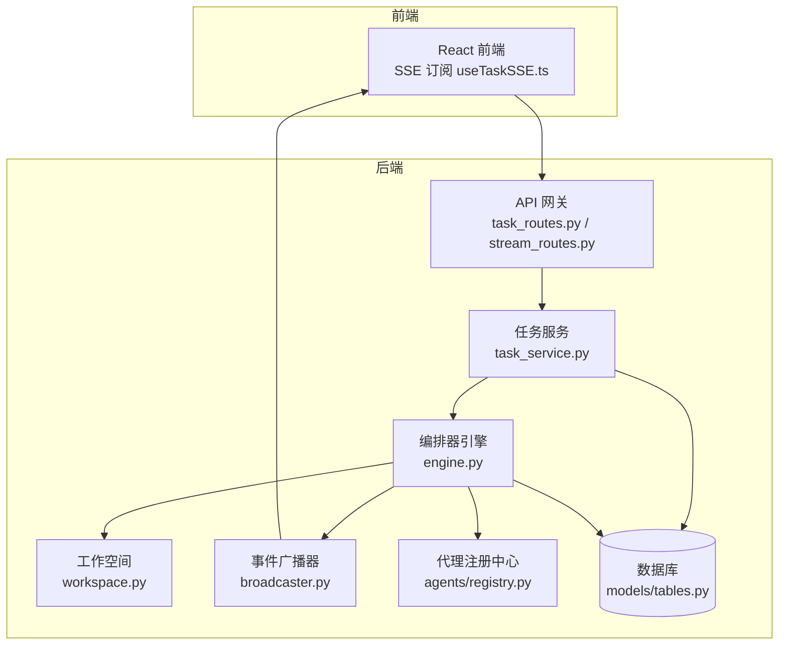
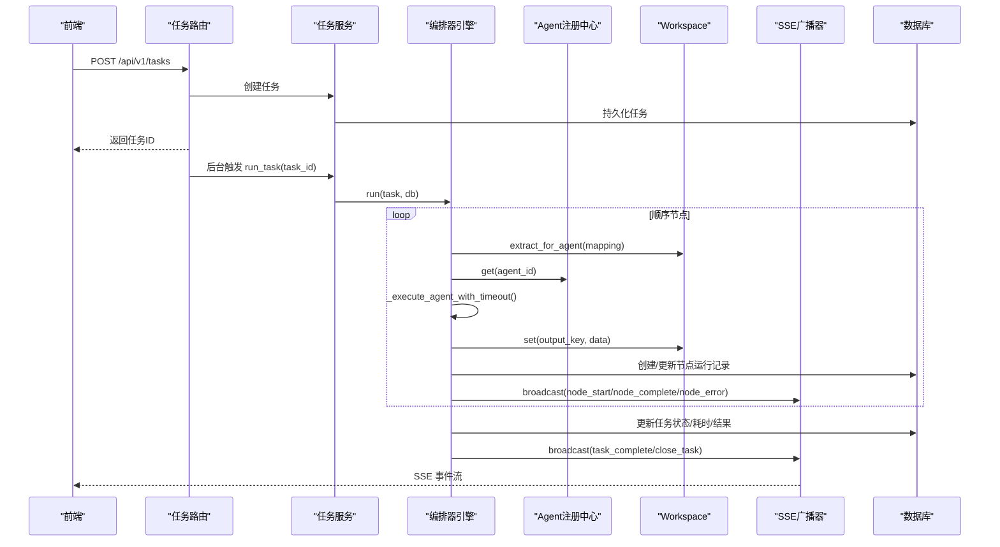
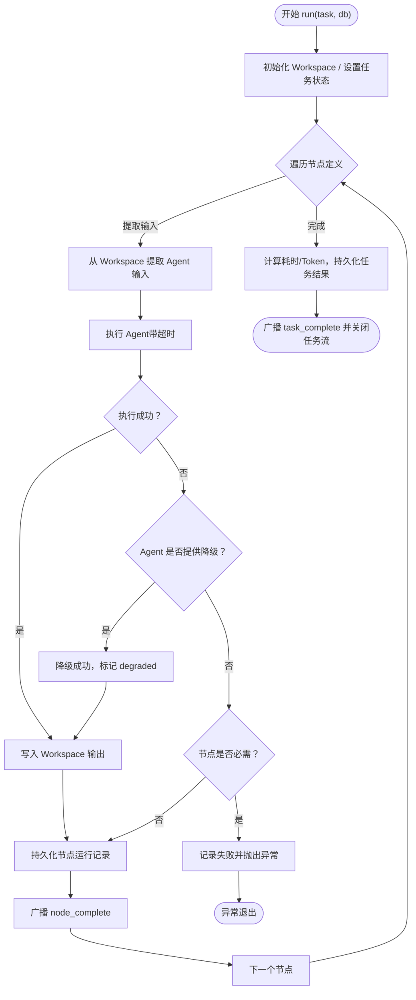
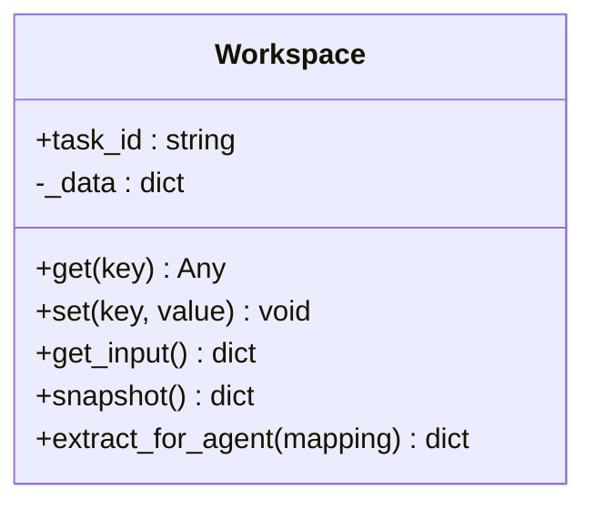
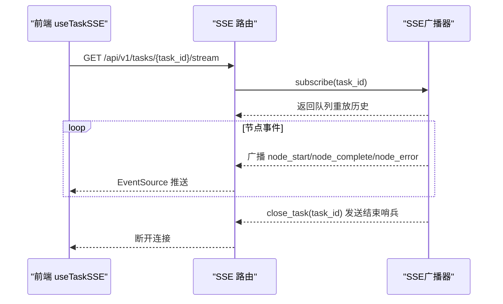
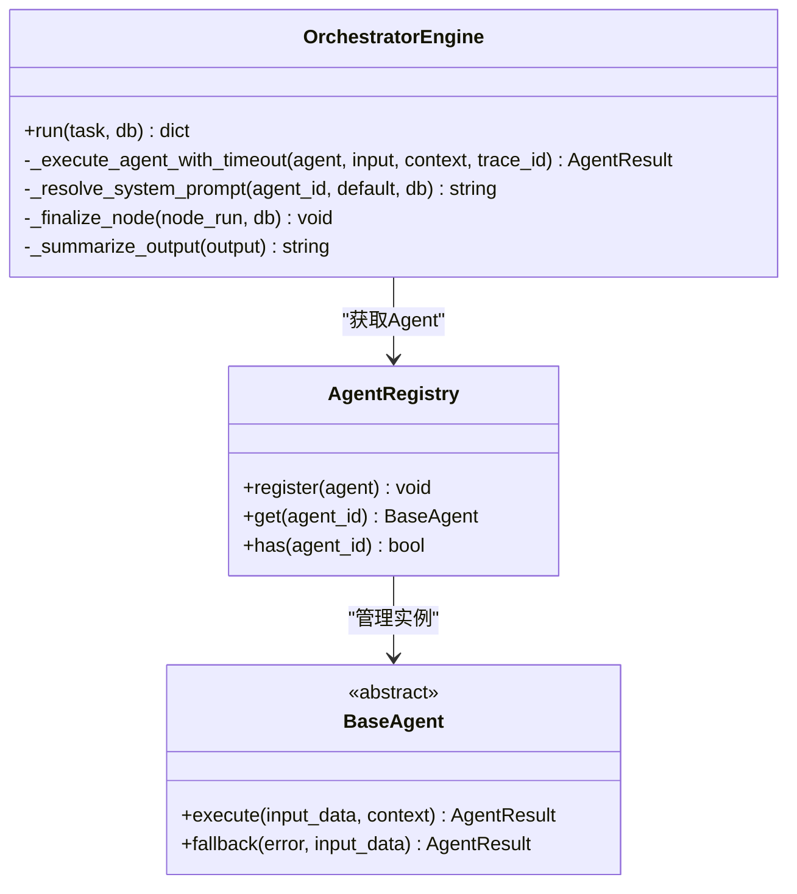
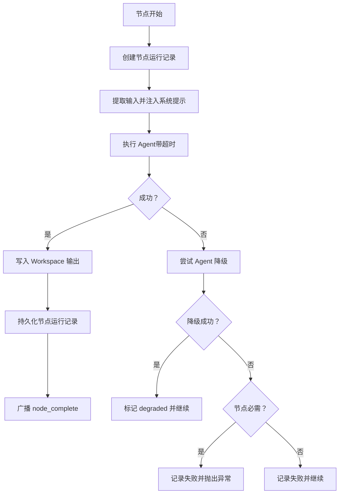
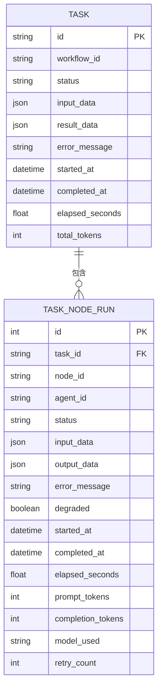
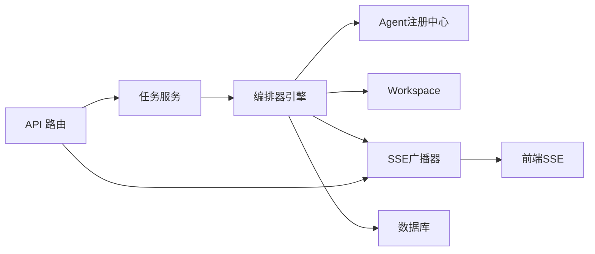

# 编排器引擎

<cite>
**本文引用的文件**   
- [backend/app/orchestrator/engine.py](file://backend/app/orchestrator/engine.py)
- [backend/app/orchestrator/workspace.py](file://backend/app/orchestrator/workspace.py)
- [backend/app/orchestrator/broadcaster.py](file://backend/app/orchestrator/broadcaster.py)
- [backend/app/api/stream_routes.py](file://backend/app/api/stream_routes.py)
- [backend/app/api/task_routes.py](file://backend/app/api/task_routes.py)
- [backend/app/services/task_service.py](file://backend/app/services/task_service.py)
- [backend/app/models/tables.py](file://backend/app/models/tables.py)
- [backend/app/agents/base.py](file://backend/app/agents/base.py)
- [backend/app/agents/registry.py](file://backend/app/agents/registry.py)
- [backend/app/main.py](file://backend/app/main.py)
- [backend/app/core/config.py](file://backend/app/core/config.py)
- [backend/app/core/exceptions.py](file://backend/app/core/exceptions.py)
- [frontend/hooks/useTaskSSE.ts](file://frontend/hooks/useTaskSSE.ts)
- [backend/tests/test_workspace.py](file://backend/tests/test_workspace.py)
- [backend/pyproject.toml](file://backend/pyproject.toml)
- [backend/ARCHITECTURE.md](file://backend/ARCHITECTURE.md)
</cite>

## 目录
1. [简介](#简介)
2. [项目结构](#项目结构)
3. [核心组件](#核心组件)
4. [架构总览](#架构总览)
5. [详细组件分析](#详细组件分析)
6. [依赖分析](#依赖分析)
7. [性能考量](#性能考量)
8. [故障排查指南](#故障排查指南)
9. [结论](#结论)
10. [附录](#附录)

## 简介
本文件面向“编排器引擎”的技术文档，聚焦工作流执行引擎的Sequential Workflow模式实现、Agent调度与执行顺序控制、Workspace上下文管理、事件广播系统（SSE）、工作流编排细节（节点执行、错误处理与回滚策略）、以及性能优化与并发控制最佳实践。文档基于实际代码与架构说明，帮助开发者快速理解并扩展系统。

## 项目结构
后端采用分层架构：API网关（FastAPI路由）、业务服务层（TaskService）、编排器引擎（OrchestratorEngine）、Agent与Skill执行层、数据库模型与SSE广播器。前端通过SSE订阅任务事件流，实时展示节点状态与结果。

图表来源
- [backend/app/api/task_routes.py:19-51](file://backend/app/api/task_routes.py#L19-L51)
- [backend/app/api/stream_routes.py:14-42](file://backend/app/api/stream_routes.py#L14-L42)
- [backend/app/services/task_service.py:39-63](file://backend/app/services/task_service.py#L39-L63)
- [backend/app/orchestrator/engine.py:92-234](file://backend/app/orchestrator/engine.py#L92-L234)
- [backend/app/orchestrator/workspace.py:12-53](file://backend/app/orchestrator/workspace.py#L12-L53)
- [backend/app/orchestrator/broadcaster.py:11-94](file://backend/app/orchestrator/broadcaster.py#L11-L94)
- [backend/app/models/tables.py:23-74](file://backend/app/models/tables.py#L23-L74)

章节来源
- [backend/app/main.py:14-28](file://backend/app/main.py#L14-L28)
- [backend/ARCHITECTURE.md:414-448](file://backend/ARCHITECTURE.md#L414-L448)

## 核心组件
- 编排器引擎（Sequential Workflow）：顺序执行节点，管理节点运行记录与任务生命周期，广播节点与任务事件。
- Workspace：任务级上下文容器，提供数据读写、快照与按映射提取输入的能力。
- SSE事件广播器：按任务维护订阅队列与历史缓冲，支持晚到订阅与结束信号。
- 任务服务：创建任务、后台触发编排器执行、持久化任务状态与错误。
- Agent注册中心：集中注册与检索Agent实例，支持降级回退。
- 数据模型：任务、节点运行、草稿、审核等实体的ORM定义。
- 配置与异常：统一配置加载、超时设置、异常分类与HTTP映射。

章节来源
- [backend/app/orchestrator/engine.py:89-285](file://backend/app/orchestrator/engine.py#L89-L285)
- [backend/app/orchestrator/workspace.py:12-53](file://backend/app/orchestrator/workspace.py#L12-L53)
- [backend/app/orchestrator/broadcaster.py:11-94](file://backend/app/orchestrator/broadcaster.py#L11-L94)
- [backend/app/services/task_service.py:20-126](file://backend/app/services/task_service.py#L20-L126)
- [backend/app/agents/registry.py:10-40](file://backend/app/agents/registry.py#L10-L40)
- [backend/app/models/tables.py:23-233](file://backend/app/models/tables.py#L23-L233)
- [backend/app/core/config.py:7-51](file://backend/app/core/config.py#L7-L51)
- [backend/app/core/exceptions.py:4-125](file://backend/app/core/exceptions.py#L4-L125)

## 架构总览
编排器引擎遵循“控制平面（编排器）与执行平面（Agent）分离”的原则，通过Workspace在节点间传递数据，通过SSE向前端推送节点与任务状态，通过数据库持久化任务与节点运行记录。

图表来源
- [backend/app/api/task_routes.py:19-51](file://backend/app/api/task_routes.py#L19-L51)
- [backend/app/services/task_service.py:39-63](file://backend/app/services/task_service.py#L39-L63)
- [backend/app/orchestrator/engine.py:92-234](file://backend/app/orchestrator/engine.py#L92-L234)
- [backend/app/orchestrator/broadcaster.py:57-80](file://backend/app/orchestrator/broadcaster.py#L57-L80)
- [backend/app/models/tables.py:23-74](file://backend/app/models/tables.py#L23-L74)

## 详细组件分析

### 编排器引擎（Sequential Workflow）
- 执行模式：线性顺序执行，节点按定义顺序依次运行，确保单一失败节点的错误可定位与可广播。
- 节点执行：为每个节点创建运行记录，提取Agent输入，注入系统提示（优先DB自定义，否则Agent默认），执行带超时的Agent，成功则写入Workspace，失败则尝试Agent降级回退。
- 错误处理：捕获Agent执行异常、超时与未知异常，根据节点是否必需决定终止或继续，记录错误信息并广播节点错误事件。
- 任务收尾：统计总耗时与Token用量，持久化任务结果，广播任务完成事件并关闭任务流。

图表来源
- [backend/app/orchestrator/engine.py:92-234](file://backend/app/orchestrator/engine.py#L92-L234)

章节来源
- [backend/app/orchestrator/engine.py:89-285](file://backend/app/orchestrator/engine.py#L89-L285)

### Workspace上下文管理
- 作用域：每个任务创建一个Workspace，包含原始输入与各Agent输出。
- 数据读写：提供get/set/snapshot，写入时记录日志，便于审计与回放。
- 输入提取：按映射从Workspace抽取Agent所需字段，支持引用原始输入与上层输出。
- 隔离与协作：同一任务内Agent共享上下文，不同任务隔离，避免交叉污染。

图表来源
- [backend/app/orchestrator/workspace.py:12-53](file://backend/app/orchestrator/workspace.py#L12-L53)

章节来源
- [backend/app/orchestrator/workspace.py:12-53](file://backend/app/orchestrator/workspace.py#L12-L53)
- [backend/tests/test_workspace.py:7-41](file://backend/tests/test_workspace.py#L7-L41)

### 事件广播系统（SSE）
- 订阅管理：按任务ID维护订阅队列，新订阅立即重放历史事件，任务结束后发送结束哨兵。
- 消息缓冲：为每个任务维护事件历史，解决前端连接建立时机不确定的问题。
- 事件格式：统一事件名与数据结构，前端通过EventSource消费，支持心跳注释。
- 生命周期：任务完成后清理历史，避免内存泄漏。

图表来源
- [backend/app/api/stream_routes.py:14-42](file://backend/app/api/stream_routes.py#L14-L42)
- [backend/app/orchestrator/broadcaster.py:30-84](file://backend/app/orchestrator/broadcaster.py#L30-L84)
- [frontend/hooks/useTaskSSE.ts:58-120](file://frontend/hooks/useTaskSSE.ts#L58-L120)

章节来源
- [backend/app/orchestrator/broadcaster.py:11-94](file://backend/app/orchestrator/broadcaster.py#L11-L94)
- [backend/app/api/stream_routes.py:14-42](file://backend/app/api/stream_routes.py#L14-L42)
- [frontend/hooks/useTaskSSE.ts:28-124](file://frontend/hooks/useTaskSSE.ts#L28-L124)

### Agent调度与执行顺序控制
- 调度来源：编排器从默认节点定义顺序取出节点，解析Agent ID并从注册中心获取实例。
- 执行控制：每个节点执行前创建节点运行记录，执行后根据结果更新状态与输出。
- 超时控制：统一超时配置，超时即视为失败并进入错误分支。
- 顺序约束：当前实现为线性顺序，后续可扩展为DAG，但数据结构已预留。

图表来源
- [backend/app/orchestrator/engine.py:89-285](file://backend/app/orchestrator/engine.py#L89-L285)
- [backend/app/agents/registry.py:10-40](file://backend/app/agents/registry.py#L10-L40)
- [backend/app/agents/base.py:49-99](file://backend/app/agents/base.py#L49-L99)

章节来源
- [backend/app/orchestrator/engine.py:89-285](file://backend/app/orchestrator/engine.py#L89-L285)
- [backend/app/agents/registry.py:10-40](file://backend/app/agents/registry.py#L10-L40)
- [backend/app/agents/base.py:49-99](file://backend/app/agents/base.py#L49-L99)

### 工作流编排细节（节点执行、错误处理与回滚策略）
- 节点执行：创建节点运行记录，广播节点开始，执行Agent，成功写入Workspace并持久化，失败尝试降级。
- 错误处理：区分Agent执行异常、超时与未知异常，记录错误消息，必要时终止任务并广播任务级错误。
- 回滚策略：当前实现为“失败降级/继续”或“失败终止”，未实现跨节点事务回滚；可通过在Agent层实现幂等与可逆操作增强。

图表来源
- [backend/app/orchestrator/engine.py:137-196](file://backend/app/orchestrator/engine.py#L137-L196)

章节来源
- [backend/app/orchestrator/engine.py:92-234](file://backend/app/orchestrator/engine.py#L92-L234)

### 数据模型与持久化
- 任务模型：记录任务状态、输入/输出、耗时、Token用量与创建/更新时间。
- 节点运行模型：记录节点执行状态、输入/输出、错误、耗时、Token、模型与重试次数。
- 审计与回放：节点运行记录包含结构化输入输出与上下文，支持任务级回放与审计。

图表来源
- [backend/app/models/tables.py:23-74](file://backend/app/models/tables.py#L23-L74)

章节来源
- [backend/app/models/tables.py:23-233](file://backend/app/models/tables.py#L23-L233)

## 依赖分析
- 模块耦合：编排器引擎依赖Agent注册中心、Workspace、SSE广播器与数据库；任务服务依赖编排器引擎与数据库；API路由依赖任务服务与SSE广播器。
- 外部依赖：FastAPI、SQLAlchemy异步、sse-starlette、litellm、aiosqlite/asyncpg等。
- 配置与异常：统一配置加载与异常分类，便于统一处理与HTTP映射。

图表来源
- [backend/app/api/task_routes.py:19-51](file://backend/app/api/task_routes.py#L19-L51)
- [backend/app/services/task_service.py:39-63](file://backend/app/services/task_service.py#L39-L63)
- [backend/app/orchestrator/engine.py:89-285](file://backend/app/orchestrator/engine.py#L89-L285)
- [backend/app/orchestrator/broadcaster.py:11-94](file://backend/app/orchestrator/broadcaster.py#L11-L94)

章节来源
- [backend/pyproject.toml:6-22](file://backend/pyproject.toml#L6-L22)
- [backend/app/core/config.py:7-51](file://backend/app/core/config.py#L7-L51)
- [backend/app/core/exceptions.py:4-125](file://backend/app/core/exceptions.py#L4-L125)

## 性能考量
- 超时控制：统一Agent与Skill超时配置，避免长时间阻塞；编排器对单节点执行设置超时，防止整体卡顿。
- 并发与资源：当前为单进程顺序执行，适合MVP；若扩展为并发，建议引入任务池与信号量限制并发数，避免LLM/外部API限流。
- I/O优化：SSE广播使用异步队列，避免阻塞；历史缓冲按任务清理，防止内存膨胀。
- 数据持久化：节点运行记录按节点粒度持久化，减少一次性大事务；任务完成后再统一提交，降低锁竞争。
- 日志与追踪：统一Trace ID贯穿请求与执行，便于定位性能瓶颈与错误根因。

## 故障排查指南
- 任务状态查询：通过任务路由查询任务与节点运行状态，确认当前节点与耗时。
- 事件流检查：前端SSE连接是否正常，是否存在断连或超时；后端广播器是否正确推送事件。
- Agent执行异常：查看节点运行记录中的错误信息，确认是否触发降级；检查Agent注册中心是否存在该Agent。
- 超时问题：检查配置中的agent_timeout与skill_timeout，适当调整；观察LLM/外部API响应时间。
- 数据一致性：任务失败时检查任务状态与节点运行记录，确认是否已持久化错误信息与耗时。

章节来源
- [backend/app/api/task_routes.py:54-107](file://backend/app/api/task_routes.py#L54-L107)
- [backend/app/services/task_service.py:39-63](file://backend/app/services/task_service.py#L39-L63)
- [backend/app/orchestrator/broadcaster.py:57-84](file://backend/app/orchestrator/broadcaster.py#L57-L84)
- [backend/app/core/config.py:42-46](file://backend/app/core/config.py#L42-L46)

## 结论
编排器引擎以Sequential Workflow为核心，结合Workspace上下文与SSE事件广播，实现了从任务创建到节点执行、错误处理与结果回传的完整闭环。通过统一配置、异常分类与结构化日志，系统具备良好的可观测性与可维护性。后续可在保持顺序执行可靠性的前提下，逐步引入DAG与并发执行能力，同时完善Agent层的幂等与可逆操作以增强回滚能力。

## 附录
- 前端SSE订阅：前端通过useTaskSSE监听节点事件，实时更新UI状态。
- 架构设计：参考ARCHITECTURE.md，明确模块职责与调用链路。

章节来源
- [frontend/hooks/useTaskSSE.ts:28-124](file://frontend/hooks/useTaskSSE.ts#L28-L124)
- [backend/ARCHITECTURE.md:496-538](file://backend/ARCHITECTURE.md#L496-L538)