# 草稿管理系统

<cite>
**本文档引用的文件**
- [ARCHITECTURE.md](file://ARCHITECTURE.md)
- [PROJECT_STRUCTURE.md](file://PROJECT_STRUCTURE.md)
- [backend/app/main.py](file://backend/app/main.py)
- [backend/app/api/task_routes.py](file://backend/app/api/task_routes.py)
- [backend/app/orchestrator/engine.py](file://backend/app/orchestrator/engine.py)
- [backend/app/services/draft_service.py](file://backend/app/services/draft_service.py)
- [backend/app/services/publish_record_service.py](file://backend/app/services/publish_record_service.py)
- [backend/app/services/publish_decision_service.py](file://backend/app/services/publish_decision_service.py)
- [backend/app/models/tables.py](file://backend/app/models/tables.py)
- [backend/app/schemas/draft.py](file://backend/app/schemas/draft.py)
- [backend/app/api/draft_routes.py](file://backend/app/api/draft_routes.py)
- [backend/app/api/wechat_routes.py](file://backend/app/api/wechat_routes.py)
- [backend/app/models/wechat_config.py](file://backend/app/models/wechat_config.py)
- [backend/app/services/wechat_publish_service.py](file://backend/app/services/wechat_publish_service.py)
- [backend/app/services/wechat_token_service.py](file://backend/app/services/wechat_token_service.py)
- [backend/app/services/wechat_media_service.py](file://backend/app/services/wechat_media_service.py)
- [backend/app/services/wechat_draft_service.py](file://backend/app/services/wechat_draft_service.py)
- [frontend/components/command-center/CommandCenter.tsx](file://frontend/components/command-center/CommandCenter.tsx)
- [frontend/hooks/useTaskSSE.ts](file://frontend/hooks/useTaskSSE.ts)
- [frontend/lib/api.ts](file://frontend/lib/api.ts)
- [frontend/app/layout.tsx](file://frontend/app/layout.tsx)
- [frontend/app/drafts/page.tsx](file://frontend/app/drafts/page.tsx)
- [frontend/app/settings/wechat/[id]/page.tsx](file://frontend/app/settings/wechat/[id]/page.tsx)
- [frontend/components/WeChatArticle.tsx](file://frontend/components/WeChatArticle.tsx)
</cite>

## 更新摘要
**所做更改**
- 新增完整的发布记录服务系统章节
- 更新草稿服务中的微信发布功能，集成发布记录管理
- 新增发布记录数据模型和状态管理
- 更新API接口，添加发布记录查询和重试功能
- 新增失败补偿机制和重试逻辑
- 更新前端界面，支持发布记录状态查看
- **更新** 草稿服务的发布功能增强，包括retry_publish_to_wechat方法的改进、publish_to_wechat方法新增existing_record_id参数、_status同步机制的增强，以及与发布记录服务的更紧密集成

## 目录
1. [项目概述](#项目概述)
2. [系统架构](#系统架构)
3. [核心组件](#核心组件)
4. [工作流引擎](#工作流引擎)
5. [草稿服务](#草稿服务)
6. [发布记录服务系统](#发布记录服务系统)
7. [发布决策服务](#发布决策服务)
8. [微信发布功能](#微信发布功能)
9. [前端界面](#前端界面)
10. [数据模型](#数据模型)
11. [API 接口](#api-接口)
12. [性能与可靠性](#性能与可靠性)
13. [故障排除指南](#故障排除指南)
14. [总结](#总结)

## 项目概述

HotClaw 是一个基于多智能体协作的公众号内容生产平台。系统的核心目标是让用户仅需输入"账号定位"，即可自动完成从热点抓取、选题策划、标题生成、正文撰写到审核风控的全链路内容生产，并输出可编辑的文章草稿。

### 系统特性

- **全链路自动化**：6个智能体串联流水线，自动完成从账号画像分析到文章审核的全流程
- **实时可视化**：通过SSE实时推送任务状态，提供直观的可视化界面
- **灵活配置**：支持智能体和技能的动态配置管理
- **草稿管理**：完善的草稿生命周期管理，支持发布、废弃、重跑等功能
- **多账号支持**：支持多个微信公众号的管理和内容生产
- **真实微信发布**：集成完整的微信公众号发布流程，支持图片上传、草稿创建、正式发布
- **发布记录追踪**：完整的发布记录系统，支持状态回查、重试和审计跟踪
- **发布保护层**：通过发布决策服务实现严格的发布验证和控制
- **状态同步机制**：实时同步微信发布状态到本地记录和草稿状态

## 系统架构

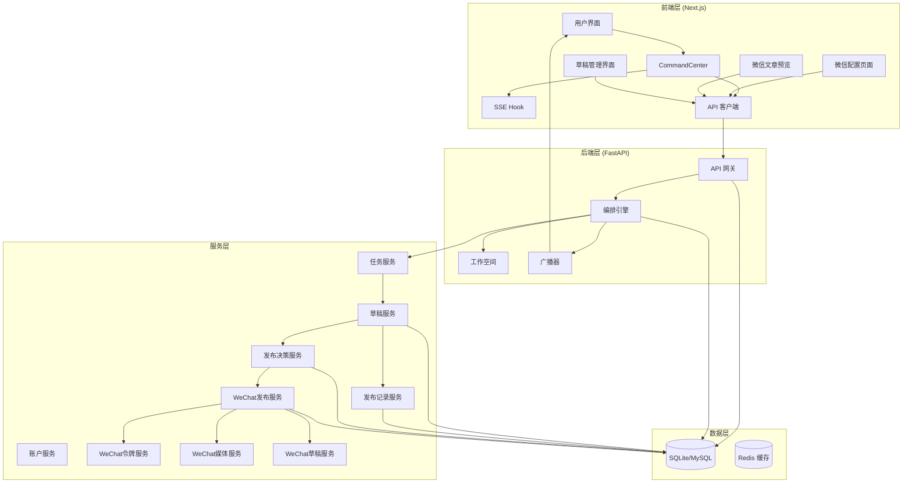

**架构图来源**
- [ARCHITECTURE.md:39-78](file://ARCHITECTURE.md#L39-L78)
- [backend/app/main.py:109-214](file://backend/app/main.py#L109-L214)

### 技术栈

**后端技术栈**
- **Web框架**：FastAPI + Uvicorn（异步REST API）
- **数据库**：SQLAlchemy 2.0 (Async) + SQLite/MySQL
- **实时通信**：Server-Sent Events (SSE)
- **LLM集成**：LiteLLM + 多Provider支持
- **配置管理**：Pydantic v2 + 环境变量
- **微信集成**：HTTPX异步HTTP客户端 + WeChat官方API

**前端技术栈**
- **框架**：Next.js 16 + React 19
- **状态管理**：Zustand
- **UI组件**：Ant Design 5
- **实时通信**：EventSource API
- **样式方案**：Tailwind CSS 4 + CSS Variables

## 核心组件

### 1. 应用入口与生命周期管理

应用入口负责初始化整个系统，包括配置加载、智能体注册、数据库表创建等关键操作。

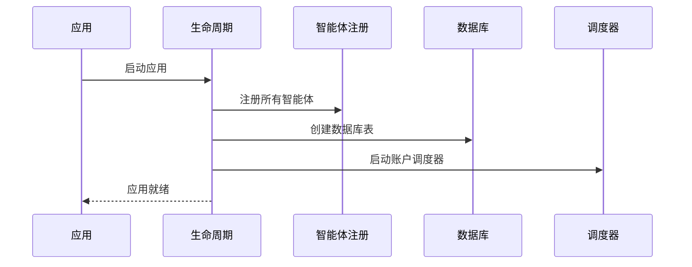

**生命周期管理要点**：
- 使用FastAPI lifespan替代传统startup/shutdown事件
- 自动创建数据库表，无需手动迁移
- 初始化系统配置和默认设置
- 启动后台任务调度器

**章节来源**
- [backend/app/main.py:69-107](file://backend/app/main.py#L69-L107)
- [backend/app/main.py:53-67](file://backend/app/main.py#L53-L67)

### 2. API路由层

API路由层采用模块化设计，每个功能模块都有独立的路由定义和业务逻辑分离。

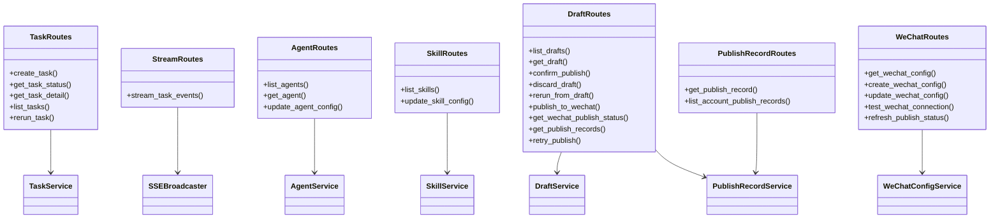

**API设计原则**：
- api/层只处理请求/响应，不包含核心业务逻辑
- 核心逻辑委托给services/层
- 使用统一的响应格式和错误处理
- 支持分页查询和条件过滤

**章节来源**
- [backend/app/api/task_routes.py:28-298](file://backend/app/api/task_routes.py#L28-L298)
- [backend/app/api/draft_routes.py:250-441](file://backend/app/api/draft_routes.py#L250-L441)
- [backend/app/api/wechat_routes.py:21-199](file://backend/app/api/wechat_routes.py#L21-L199)

## 工作流引擎

### 编排引擎架构

编排引擎是整个系统的核心大脑，负责定义工作流节点顺序、管理Workspace数据共享、通过SSE广播实时状态、处理超时和降级策略。

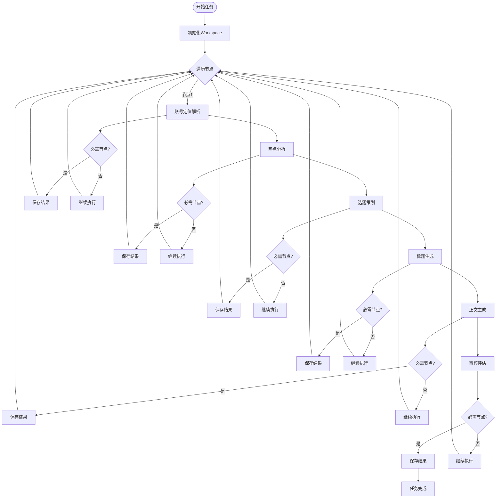

**编排引擎核心功能**：

1. **工作流定义**：定义6个智能体的执行顺序和依赖关系
2. **数据传递**：通过Workspace实现智能体间的数据共享
3. **状态管理**：实时广播节点状态变化
4. **错误处理**：支持降级策略和超时控制
5. **性能监控**：记录Token消耗和执行时间

**章节来源**
- [backend/app/orchestrator/engine.py:132-424](file://backend/app/orchestrator/engine.py#L132-L424)

### Workspace数据管理

Workspace作为任务级数据容器，为所有智能体提供共享的上下文环境。

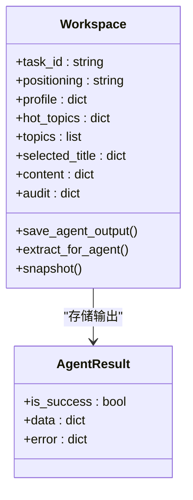

**Workspace设计特点**：
- 每个任务创建独立的Workspace实例
- 支持动态属性设置和数据提取
- 提供完整的数据快照功能
- 实现智能体间的数据隔离和共享

**章节来源**
- [backend/app/orchestrator/engine.py:46-130](file://backend/app/orchestrator/engine.py#L46-L130)

## 草稿服务

### 草稿生命周期管理

草稿服务负责管理文章草稿的完整生命周期，从创建到发布，支持多种状态转换和操作。

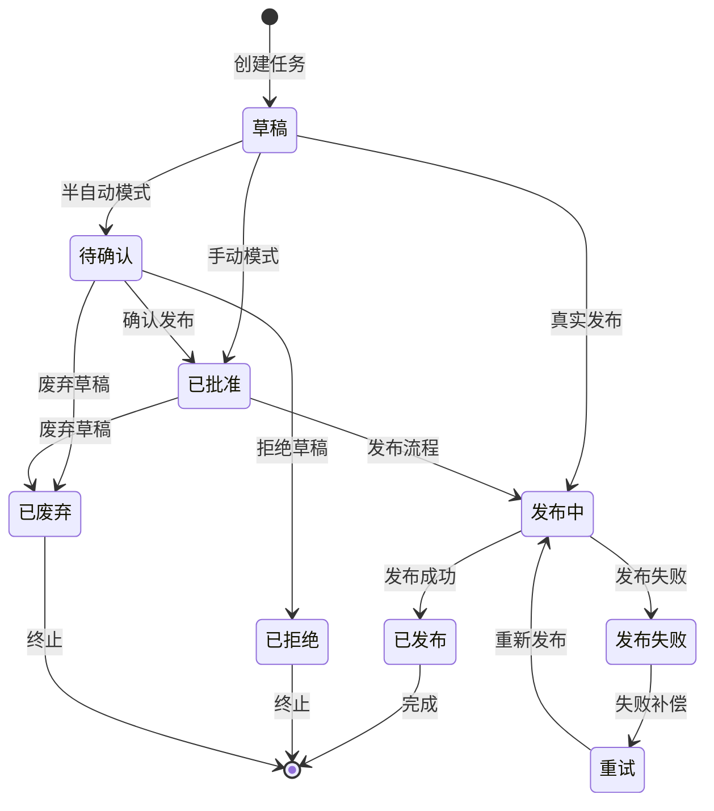

**草稿状态转换规则**：

| 当前状态 | 可执行操作 | 下一状态 |
|---------|-----------|----------|
| 草稿 | 确认发布、废弃、重跑 | 待确认、已废弃、草稿 |
| 待确认 | 确认发布、拒绝、废弃 | 已批准、已拒绝、已废弃 |
| 已批准 | 发布、废弃 | 发布中、已废弃 |
| 发布中 | - | 发布中（等待微信API响应） |
| 已发布 | - | 终止状态 |
| 已拒绝 | - | 终止状态 |
| 已废弃 | - | 终止状态 |
| 发布失败 | 重试、废弃 | 重试、已废弃 |

**更新** 发布保护层集成

草稿服务现在与发布记录服务和发布决策服务深度集成，提供完整的发布生命周期管理：

1. **发布决策验证**：通过发布决策服务验证发布条件
2. **发布记录创建**：创建详细的发布记录，跟踪每次发布尝试
3. **失败补偿机制**：自动处理令牌刷新和网络重试
4. **状态同步**：实时同步微信发布状态到草稿状态
5. **重试逻辑**：支持最多3次重试，包括令牌刷新和网络重试
6. **现有记录重用**：重试时使用现有的发布记录，避免重复创建
7. **幂等性保护**：防止重复发布和并发冲突

**章节来源**
- [backend/app/services/draft_service.py:288-487](file://backend/app/services/draft_service.py#L288-L487)
- [backend/app/services/draft_service.py:545-637](file://backend/app/services/draft_service.py#L545-L637)

### 草稿数据模型

```mermaid
erDiagram
ARTICLE_DRAFTS {
int id PK
string task_id FK
string account_id FK
string title
text content_markdown
text content_html
int word_count
json structure
json tags
string draft_status
string publish_status
boolean publish_review_required
string source_type
string selected_topic
json title_candidates
text summary
datetime confirmed_at
string confirmed_by
datetime published_at
text publish_error_message
datetime created_at
datetime updated_at
}
TASKS {
string id PK
string account_id FK
string workflow_id
string status
json input_data
json result_data
text error_message
datetime started_at
datetime completed_at
float elapsed_seconds
int total_tokens
datetime created_at
datetime updated_at
}
ACCOUNTS {
string id PK
string name
string category
text positioning
text audience
string tone_style
string posting_frequency
string posting_time
text content_strategy
text reference_accounts
string operation_mode
boolean auto_run_enabled
boolean auto_publish_enabled
boolean is_active
datetime last_run_at
datetime next_run_at
string last_run_status
text last_error_message
datetime created_at
datetime updated_at
}
WECHAT_PUBLISH_RECORDS {
int id PK
int draft_id FK
string account_id FK
string task_id FK
string wechat_draft_id
string media_id
string publish_id
string article_id
text url
string publish_status
string source_mode
string trigger_type
int publish_attempt
int retry_count
int parent_record_id
string error_code
text error_message
text request_snapshot
text response_snapshot
datetime started_at
datetime finished_at
datetime published_at
datetime last_checked_at
datetime created_at
datetime updated_at
}
TASKS ||--o{ ARTICLE_DRAFTS : "包含"
ACCOUNTS ||--o{ TASKS : "拥有"
ARTICLE_DRAFTS ||--o{ WECHAT_PUBLISH_RECORDS : "关联"
```

**章节来源**
- [backend/app/models/tables.py:165-206](file://backend/app/models/tables.py#L165-L206)
- [backend/app/schemas/draft.py:60-85](file://backend/app/schemas/draft.py#L60-L85)
- [backend/app/models/wechat_config.py:34-99](file://backend/app/models/wechat_config.py#L34-L99)

## 发布记录服务系统

### 发布记录服务架构

发布记录服务是系统新增的核心组件，负责管理所有微信发布尝试的完整生命周期。

```mermaid
flowchart TD
subgraph "发布记录生命周期"
Created[创建记录] --> Pending[待发布]
Pending --> Publishing[发布中]
Publishing --> Published[发布成功]
Publishing --> Failed[发布失败]
Failed --> Retry[重试尝试]
Retry --> Pending
Published --> [*]
Failed --> [*]
end
subgraph "状态管理"
Statuses[状态常量] --> Pending
Statuses --> Publishing
Statuses --> Published
Statuses --> Failed
Statuses --> Unknown
end
subgraph "触发类型"
Triggers[触发类型] --> Manual[手动确认]
Triggers --> SemiAuto[半自动确认]
Triggers --> FullAuto[全自动]
Triggers --> AutoRetry[自动重试]
Triggers --> ManualRetry[手动重试]
end
```

**发布记录服务核心功能**：

1. **状态管理**：统一管理发布状态（pending/publishing/published/failed/unknown）
2. **触发类型**：区分手动、半自动、全自动、重试等发布来源
3. **重试机制**：支持最多3次重试，自动处理令牌刷新
4. **审计跟踪**：记录每次发布尝试的详细信息
5. **状态同步**：自动同步微信发布状态到草稿状态
6. **现有记录管理**：支持重试时使用现有记录，避免重复创建

**章节来源**
- [backend/app/services/publish_record_service.py:30-433](file://backend/app/services/publish_record_service.py#L30-L433)

### 发布记录数据模型

发布记录表记录每次真实发布尝试的完整信息：

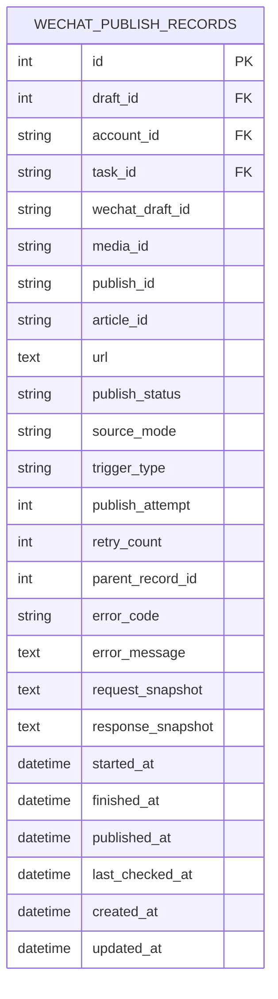

**发布记录字段说明**：

- **基本信息**：draft_id、account_id、task_id关联草稿、账号和任务
- **微信返回ID**：wechat_draft_id、media_id、publish_id、article_id、url
- **状态字段**：publish_status、source_mode、trigger_type
- **重试字段**：publish_attempt、retry_count、parent_record_id
- **错误信息**：error_code、error_message
- **快照信息**：request_snapshot、response_snapshot
- **时间戳**：started_at、finished_at、published_at、last_checked_at

**章节来源**
- [backend/app/models/wechat_config.py:34-99](file://backend/app/models/wechat_config.py#L34-L99)

### 失败补偿机制

系统实现了完整的失败补偿机制，自动处理常见的发布错误：

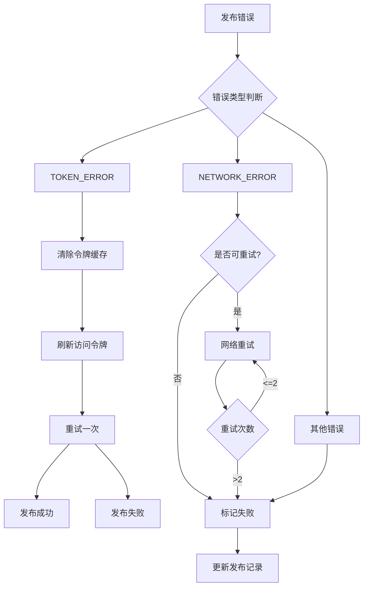

**失败补偿策略**：

1. **令牌错误**：自动清除缓存并刷新访问令牌，最多重试1次
2. **网络错误**：识别超时、连接中断等可重试错误，最多重试2次
3. **其他错误**：直接标记发布失败，不进行重试
4. **重试限制**：单次发布最多3次重试机会

**章节来源**
- [backend/app/services/draft_service.py:378-509](file://backend/app/services/draft_service.py#L378-L509)

### **更新** 状态同步机制

**新增** 发布记录服务现在提供完整的状态同步机制，确保草稿状态与微信发布状态保持一致：

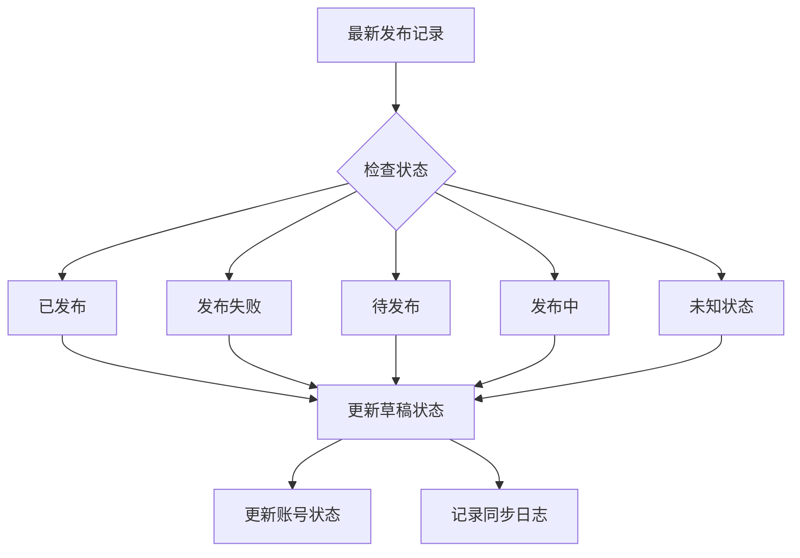

**状态同步规则**：

1. **已发布**：草稿状态设为"published"，清除错误消息
2. **发布失败**：草稿状态设为"failed"，记录错误消息
3. **待发布/发布中**：草稿状态设为"publishing"
4. **未知状态**：草稿状态设为"unknown"，记录未知错误

**章节来源**
- [backend/app/services/publish_record_service.py:370-470](file://backend/app/services/publish_record_service.py#L370-L470)

## 发布决策服务

### 发布决策服务架构

发布决策服务是系统新增的保护层，负责在真正调用微信发布之前进行全面的验证和决策。

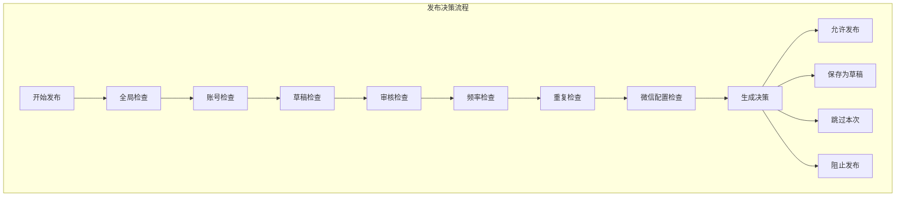

**发布决策服务核心功能**：

1. **全局检查**：系统级开关和紧急停止检查
2. **账号检查**：账号状态、模式匹配、发布暂停检查
3. **草稿检查**：草稿状态、重复发布、幂等性检查
4. **审核检查**：内容风险等级评估
5. **频率检查**：每日限制和最小间隔检查
6. **重复检查**：标题重复和相似度检查
7. **配置检查**：微信公众号配置完整性检查

**发布决策类型**：

- **ALLOW_PUBLISH**：允许发布到微信
- **SAVE_AS_DRAFT**：降级为待确认草稿
- **SKIP**：跳过本次发布
- **BLOCK**：直接阻止发布

**章节来源**
- [backend/app/services/publish_decision_service.py:128-470](file://backend/app/services/publish_decision_service.py#L128-L470)

### 发布决策验证规则

系统实现了多层次的发布验证规则，确保发布的安全性和合规性：

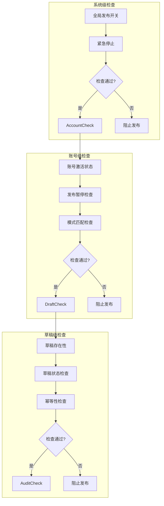

**决策生成逻辑**：

1. **系统级**：全局开关和紧急停止
2. **账号级**：账号状态、模式匹配、发布暂停
3. **草稿级**：草稿存在性、状态、幂等性
4. **内容级**：审核风险、重复内容
5. **配置级**：微信配置完整性

**章节来源**
- [backend/app/services/publish_decision_service.py:159-470](file://backend/app/services/publish_decision_service.py#L159-L470)

## 微信发布功能

### WeChat发布服务架构

系统集成了完整的微信公众号发布功能，支持从草稿创建到正式发布的全流程。

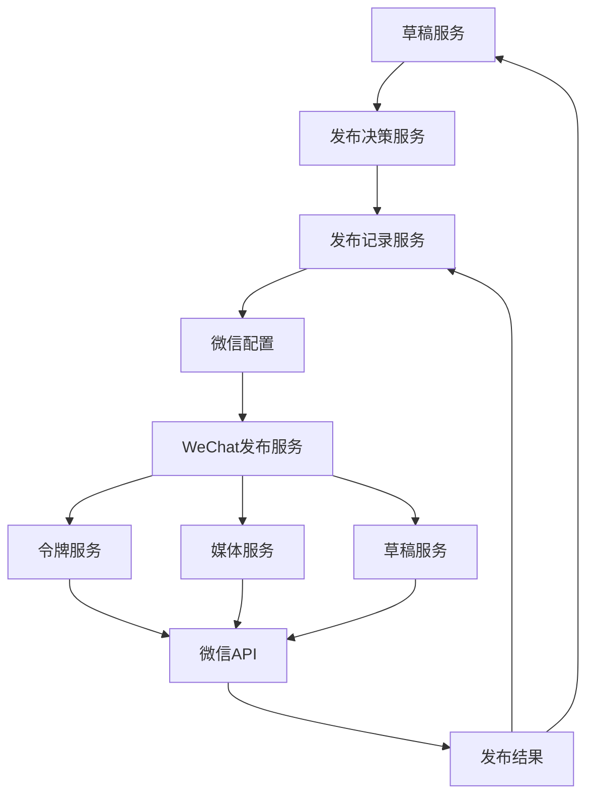

**WeChat发布流程**：

1. **发布决策验证**：验证发布条件和权限
2. **发布记录创建**：创建详细的发布记录，跟踪发布状态
3. **微信配置获取**：读取公众号配置信息
4. **WeChat API调用**：执行真实的发布操作
5. **状态更新**：更新草稿和发布记录状态
6. **失败补偿**：自动处理令牌刷新和网络重试
7. **状态同步**：实时同步微信发布状态到本地

**章节来源**
- [backend/app/services/draft_service.py:288-487](file://backend/app/services/draft_service.py#L288-L487)
- [backend/app/services/wechat_publish_service.py:36-143](file://backend/app/services/wechat_publish_service.py#L36-L143)

### WeChat服务组件

系统包含多个专门的WeChat服务组件，每个组件负责特定的功能领域：

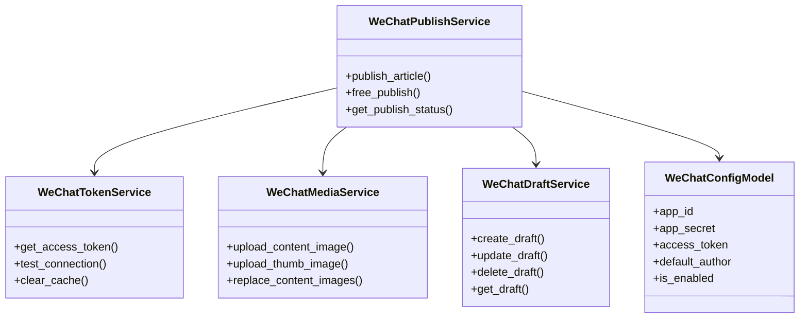

**服务组件功能**：

- **WeChatTokenService**：管理微信访问令牌，支持缓存和自动刷新
- **WeChatMediaService**：处理图片上传和替换，支持外部图片转存
- **WeChatDraftService**：管理微信草稿，支持创建、更新、删除操作
- **WeChatPublishService**：协调完整的发布流程，调用各子服务

**章节来源**
- [backend/app/services/wechat_token_service.py:26-163](file://backend/app/services/wechat_token_service.py#L26-L163)
- [backend/app/services/wechat_media_service.py:25-257](file://backend/app/services/wechat_media_service.py#L25-L257)
- [backend/app/services/wechat_draft_service.py:23-335](file://backend/app/services/wechat_draft_service.py#L23-L335)
- [backend/app/services/wechat_publish_service.py:23-345](file://backend/app/services/wechat_publish_service.py#L23-L345)

### 微信配置管理

系统提供完整的微信公众号配置管理功能，支持凭证管理和连接测试。

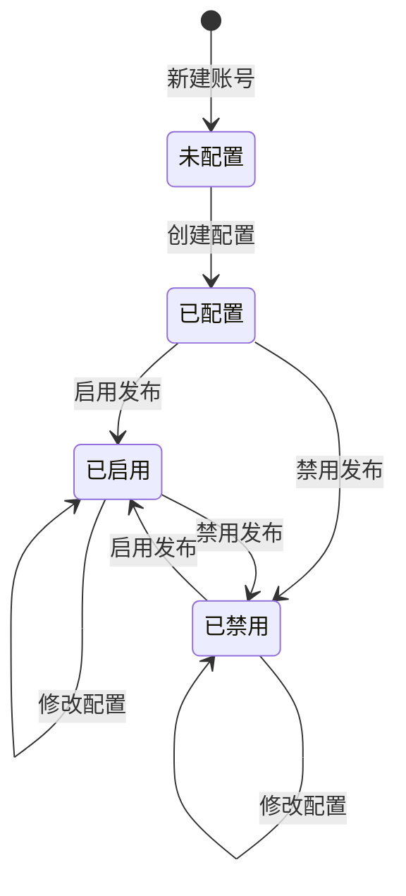

**配置管理功能**：

- **凭证管理**：AppID、AppSecret、默认作者、评论设置
- **状态控制**：启用/禁用微信发布功能
- **连接测试**：验证微信API连接可用性
- **安全保护**：敏感信息掩码显示

**章节来源**
- [backend/app/api/wechat_routes.py:32-199](file://backend/app/api/wechat_routes.py#L32-L199)
- [backend/app/models/wechat_config.py:10-54](file://backend/app/models/wechat_config.py#L10-L54)
- [frontend/app/settings/wechat/[id]/page.tsx:11-311](file://frontend/app/settings/wechat/[id]/page.tsx#L11-L311)

## 前端界面

### 深空指挥舱界面

深空指挥舱是系统的主要用户界面，采用"深空+全息"视觉风格，提供直观的任务执行可视化。

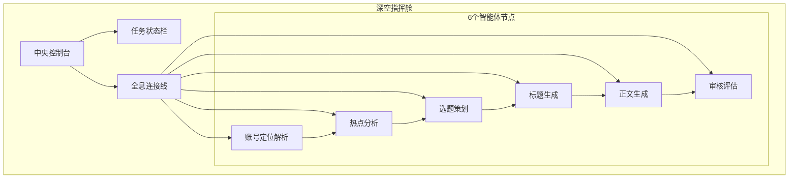

**界面设计特点**：

1. **环形布局**：6个智能体节点围绕中央控制台呈圆形分布
2. **全息连接**：SVG贝塞尔曲线连接相邻节点，模拟全息效果
3. **状态指示**：每个节点根据执行状态显示不同的视觉效果
4. **实时反馈**：通过SSE实时更新节点状态和进度

**章节来源**
- [frontend/components/command-center/CommandCenter.tsx:99-318](file://frontend/components/command-center/CommandCenter.tsx#L99-L318)

### SSE实时通信

前端使用EventSource API实现与后端的实时通信，提供流畅的任务状态更新体验。

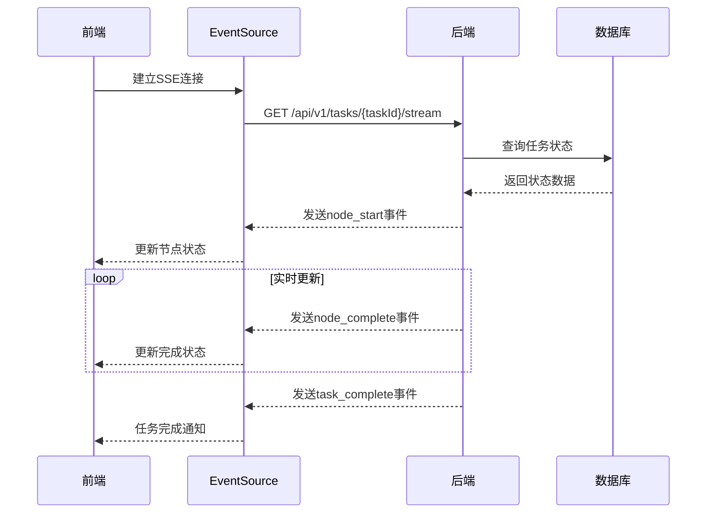

**SSE设计优势**：
- 单向推送，简化了通信协议
- 支持自动重连机制
- 适合实时状态更新场景
- 减少了WebSocket的心跳保活开销

**章节来源**
- [frontend/hooks/useTaskSSE.ts:82-233](file://frontend/hooks/useTaskSSE.ts#L82-L233)

### 草稿管理界面

草稿管理界面提供了完整的草稿生命周期管理功能，支持查看、操作和重跑草稿。

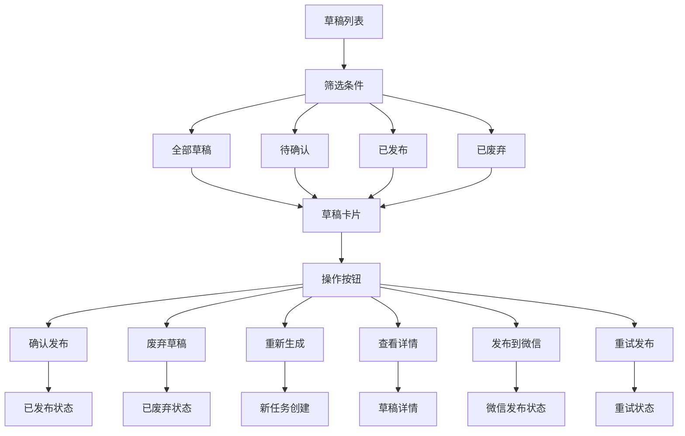

**草稿管理功能**：
- 多状态筛选和分页显示
- 实时状态更新和操作反馈
- 支持批量操作和单个操作
- 完整的操作历史记录
- **新增** 微信发布功能集成
- **新增** 发布记录查看和重试功能
- **新增** 发布状态刷新功能

**章节来源**
- [frontend/app/drafts/page.tsx:11-347](file://frontend/app/drafts/page.tsx#L11-L347)

### 微信配置界面

微信配置界面允许用户管理微信公众号的发布配置，支持凭证输入、状态切换和连接测试。

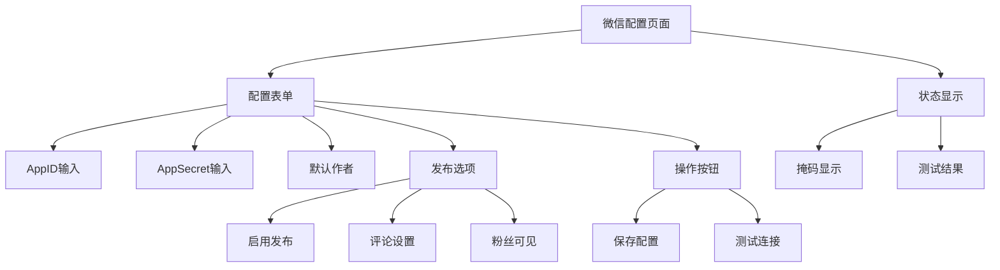

**微信配置功能**：
- 凭证安全输入和显示
- 发布选项灵活配置
- 连接状态实时检测
- 操作反馈和错误提示

**章节来源**
- [frontend/app/settings/wechat/[id]/page.tsx:11-311](file://frontend/app/settings/wechat/[id]/page.tsx#L11-L311)

### 微信文章预览

微信文章预览组件提供草稿内容的微信公众号格式预览，支持Markdown和HTML格式的实时转换。

```mermaid
flowchart TD
Preview[文章预览] --> Content[内容解析]
Content --> Markdown[Markdown解析]
Content --> HTML[HTML渲染]
Markdown --> Parsed[解析结果]
HTML --> Parsed
Parsed --> Export[导出功能]
Export --> CopyMD[复制Markdown]
Export --> CopyHTML[复制HTML]
Preview --> Header[文章头部]
Header --> Title[标题显示]
Header --> Stats[统计信息]
Preview --> Tags[标签展示]
Preview --> Progress[实时进度]
```

**微信文章功能**：
- 实时内容解析和渲染
- 多格式导出支持
- 统计信息展示
- 实时进度监控

**章节来源**
- [frontend/components/WeChatArticle.tsx:115-351](file://frontend/components/WeChatArticle.tsx#L115-L351)

## 数据模型

### 核心数据表结构

系统采用关系型数据库设计，通过SQLAlchemy ORM实现数据持久化。

```mermaid
erDiagram
TASKS {
string id PK
string account_id FK
string workflow_id
string status
json input_data
json result_data
text error_message
datetime started_at
datetime completed_at
float elapsed_seconds
int total_tokens
datetime created_at
datetime updated_at
}
TASK_NODE_RUNS {
int id PK
string task_id FK
string node_id
string agent_id
string status
json input_data
json output_data
text error_message
boolean degraded
datetime started_at
datetime completed_at
float elapsed_seconds
int prompt_tokens
int completion_tokens
string model_used
int retry_count
datetime created_at
datetime updated_at
}
ACCOUNT_PROFILES {
int id PK
string task_id FK
text positioning
string domain
string subdomain
json target_audience
string tone
string content_style
json keywords
datetime created_at
datetime updated_at
}
ARTICLE_DRAFTS {
int id PK
string task_id FK
string account_id FK
string title
text content_markdown
text content_html
int word_count
json structure
json tags
string draft_status
string publish_status
boolean publish_review_required
string source_type
text selected_topic
json title_candidates
text summary
datetime confirmed_at
string confirmed_by
datetime published_at
text publish_error_message
datetime created_at
datetime updated_at
}
AUDIT_RESULTS {
int id PK
string task_id FK
int draft_id FK
boolean passed
string risk_level
json issues
text overall_comment
datetime created_at
datetime updated_at
}
WECHAT_CONFIGS {
int id PK
string account_id FK
string app_id
string app_secret
string access_token
datetime access_token_expires_at
string default_author
string default_thumb_media_id
boolean need_open_comment
boolean only_fans_can_comment
boolean is_enabled
string test_status
text test_message
datetime last_sync_at
datetime created_at
datetime updated_at
}
WECHAT_PUBLISH_RECORDS {
int id PK
int draft_id FK
string account_id FK
string task_id FK
string wechat_draft_id
string media_id
string publish_id
string article_id
text url
string publish_status
string source_mode
string trigger_type
int publish_attempt
int retry_count
int parent_record_id
string error_code
text error_message
text request_snapshot
text response_snapshot
datetime started_at
datetime finished_at
datetime published_at
datetime last_checked_at
datetime created_at
datetime updated_at
}
TASKS ||--o{ TASK_NODE_RUNS : "包含"
TASKS ||--o{ ACCOUNT_PROFILES : "包含"
TASKS ||--o{ ARTICLE_DRAFTS : "包含"
ARTICLE_DRAFTS ||--|| AUDIT_RESULTS : "关联"
ARTICLE_DRAFTS ||--o{ WECHAT_PUBLISH_RECORDS : "关联"
ACCOUNTS ||--o{ TASKS : "拥有"
WECHAT_CONFIGS ||--o{ WECHAT_PUBLISH_RECORDS : "关联"
```

**数据模型设计原则**：
- 使用JSON字段存储结构化数据，提高灵活性
- 通过外键关系维护数据一致性
- 支持复杂的查询和关联操作
- 考虑了性能优化和索引设计
- **新增** WeChat配置和发布记录表

**章节来源**
- [backend/app/models/tables.py:63-224](file://backend/app/models/tables.py#L63-L224)
- [backend/app/models/wechat_config.py:10-99](file://backend/app/models/wechat_config.py#L10-L99)

## API 接口

### 任务管理API

任务管理API提供了完整的任务生命周期管理功能，包括创建、查询、重跑等操作。

```mermaid
classDiagram
class TaskAPI {
+POST /api/v1/tasks 创建任务
+GET /api/v1/tasks 列出任务
+GET /api/v1/tasks/{id} 获取任务详情
+GET /api/v1/tasks/{id}/status 获取任务状态
+GET /api/v1/tasks/{id}/nodes 获取节点记录
+POST /api/v1/tasks/{id}/rerun 重跑任务
}
class StreamAPI {
+GET /api/v1/tasks/{id}/stream SSE事件流
}
class DraftAPI {
+GET /api/v1/drafts 草稿列表
+GET /api/v1/drafts/{id} 草稿详情
+POST /api/v1/drafts/{id}/confirm-publish 确认发布
+POST /api/v1/drafts/{id}/discard 废弃草稿
+POST /api/v1/drafts/{id}/rerun 从草稿重跑
+POST /api/v1/drafts/{id}/publish-to-wechat 发布到微信
+GET /api/v1/drafts/{id}/wechat-status 微信发布状态
+GET /api/v1/drafts/{id}/publish-records 发布记录列表
+POST /api/v1/drafts/{id}/retry-publish 重试发布
}
class WeChatAPI {
+GET /api/v1/wechat/config/{account_id} 获取微信配置
+POST /api/v1/wechat/config 创建微信配置
+PUT /api/v1/wechat/config/{account_id} 更新微信配置
+POST /api/v1/wechat/test-connection 测试连接
+POST /api/v1/wechat/publish-records/{record_id}/refresh-status 刷新发布状态
}
class PublishRecordAPI {
+GET /api/v1/wechat/publish-records/{record_id} 获取发布记录
+GET /api/v1/wechat/publish-records/account/{account_id} 账号发布记录
}
TaskAPI --> TaskService
StreamAPI --> SSEBroadcaster
DraftAPI --> DraftService
DraftAPI --> PublishRecordService
WeChatAPI --> WeChatConfigService
PublishRecordAPI --> PublishRecordService
```

**API设计规范**：
- 统一的响应格式和错误处理
- 支持分页查询和条件过滤
- 实时状态推送通过SSE实现
- 完整的权限控制和数据验证
- **新增** WeChat发布相关API
- **新增** 发布记录查询API
- **新增** 发布状态刷新API

**章节来源**
- [backend/app/api/task_routes.py:67-298](file://backend/app/api/task_routes.py#L67-L298)
- [backend/app/api/draft_routes.py:250-441](file://backend/app/api/draft_routes.py#L250-L441)
- [backend/app/api/wechat_routes.py:21-199](file://backend/app/api/wechat_routes.py#L21-L199)

### 前端API客户端

前端API客户端封装了所有后端API调用，提供了统一的接口和错误处理机制。

```mermaid
flowchart TD
APIClient[API客户端] --> Request[请求处理]
Request --> Validation[数据验证]
Validation --> Fetch[HTTP请求]
Fetch --> Response[响应处理]
Response --> Error[错误处理]
Response --> Success[成功回调]
Error --> Alert[用户提示]
Success --> Data[数据返回]
APIClient --> SSE[实时事件]
SSE --> Event[事件处理]
Event --> Update[状态更新]
```

**API客户端功能**：
- 统一的请求和响应处理
- 自动的数据验证和错误处理
- SSE事件的统一管理
- 类型安全的API调用
- **新增** WeChat发布API支持
- **新增** 发布记录查询API支持
- **新增** 发布状态刷新API支持

**章节来源**
- [frontend/lib/api.ts:53-574](file://frontend/lib/api.ts#L53-L574)

## 性能与可靠性

### 性能优化策略

系统采用了多项性能优化策略，确保在高并发场景下的稳定运行。

**数据库优化**：
- 使用异步数据库连接池
- 合理的索引设计和查询优化
- 事务管理和连接复用
- 缓存策略减少数据库压力

**网络优化**：
- SSE单向推送减少双向通信开销
- 事件流的批量处理和去重
- 连接池和超时控制
- CDN和静态资源优化

**内存管理**：
- 及时清理事件监听器和定时器
- 避免内存泄漏和循环引用
- 合理的组件销毁和状态清理
- 大数据的分批处理

**微信API优化**：
- **新增** 访问令牌缓存和自动刷新
- **新增** 图片上传的异步处理
- **新增** 发布状态轮询优化
- **新增** 错误重试机制
- **新增** 发布记录的批量查询优化
- **新增** 现有记录重用优化

### 可靠性保障

**错误处理机制**：
- 分层的异常处理和错误恢复
- 降级策略确保系统稳定性
- 重试机制和超时控制
- 完整的日志记录和追踪

**监控和告警**：
- 实时的任务状态监控
- 性能指标的收集和分析
- 异常情况的自动告警
- 健康检查和自愈机制

**微信发布可靠性**：
- **新增** WeChatTokenError异常处理
- **新增** WeChatMediaError媒体上传错误
- **新增** WeChatDraftError草稿操作错误
- **新增** 发布状态跟踪和回滚机制
- **新增** 发布记录的完整性校验
- **新增** 现有记录重用的幂等性保护

**发布记录可靠性**：
- **新增** 状态常量验证
- **新增** 触发类型枚举
- **新增** 重试次数限制
- **新增** 父记录关联确保
- **新增** 时间戳完整性
- **新增** 状态同步的原子性保证

**发布决策可靠性**：
- **新增** 多层次验证确保发布安全
- **新增** 决策结果的结构化返回
- **新增** 详细的检查项和原因码
- **新增** 阻断、跳过、保存、允许四种决策类型

## 故障排除指南

### 常见问题诊断

**SSE连接问题**：
- 检查浏览器控制台的网络请求
- 确认后端SSE端点正常响应
- 验证CORS配置和跨域设置
- 检查防火墙和代理设置

**任务执行失败**：
- 查看任务节点的错误信息
- 检查LLM Provider的配置和连接
- 验证智能体的Prompt模板
- 检查数据库连接和权限

**微信发布失败**：
- **新增** 检查微信AppID/AppSecret配置
- **新增** 验证微信API访问令牌
- **新增** 确认公众号具备发布权限
- **新增** 检查图片上传和草稿创建状态
- **新增** 查看发布记录的详细错误信息
- **新增** 验证现有记录重用机制

**发布记录问题**：
- **新增** 检查发布记录状态是否正确
- **新增** 验证重试次数限制
- **新增** 确认父记录关联是否完整
- **新增** 查看请求/响应快照信息
- **新增** 验证状态同步机制

**发布决策问题**：
- **新增** 检查全局发布开关状态
- **新增** 验证账号配置和模式匹配
- **新增** 确认审核结果和风险等级
- **新增** 验证频率限制和重复检查
- **新增** 查看详细的检查项和原因码

**性能问题**：
- 监控数据库查询性能
- 检查内存使用情况
- 分析CPU和I/O瓶颈
- 优化索引和查询计划

### 调试工具和技巧

**后端调试**：
- 使用结构化日志跟踪请求流程
- 利用trace_id进行跨服务追踪
- 启用调试模式获取详细信息
- 使用数据库客户端查看数据状态

**前端调试**：
- 利用浏览器开发者工具监控网络请求
- 检查SSE连接状态和事件流
- 使用React DevTools分析组件状态
- 监控内存使用和性能指标

**微信调试**：
- **新增** 使用微信开发者工具测试API
- **新增** 检查微信服务器日志
- **新增** 验证回调URL配置
- **新增** 测试不同网络环境下的连接
- **新增** 验证发布记录状态同步

**发布记录调试**：
- **新增** 使用发布记录API查看详细状态
- **新增** 检查重试历史和错误原因
- **新增** 验证状态同步机制
- **新增** 调试失败补偿流程
- **新增** 验证现有记录重用逻辑

**发布决策调试**：
- **新增** 使用发布决策API查看详细检查结果
- **新增** 检查各个检查项的详细信息
- **新增** 验证决策生成的逻辑流程
- **新增** 调试不同场景下的决策结果

**章节来源**
- [backend/app/main.py:142-197](file://backend/app/main.py#L142-L197)
- [frontend/hooks/useTaskSSE.ts:128-233](file://frontend/hooks/useTaskSSE.ts#L128-L233)

## 总结

HotClaw草稿管理系统是一个设计精良的多智能体内容生产平台，具有以下突出特点：

**技术创新**：
- 基于多智能体协作的内容生产架构
- 实时可视化和交互式用户体验
- 灵活的配置管理和动态调整能力
- **新增** 完整的微信公众号发布集成
- **新增** 发布记录服务系统，提供完整的生命周期管理
- **更新** 增强的发布功能，包括重试机制和状态同步
- **新增** 发布决策服务，提供严格的发布验证和控制

**架构优势**：
- 清晰的分层设计和职责分离
- 模块化的组件结构和可扩展性
- 完善的错误处理和降级策略
- **新增** 微信API服务化架构
- **新增** 发布记录的统一管理
- **更新** 更紧密的服务间集成
- **新增** 发布保护层的多层验证

**用户体验**：
- 直观的深空指挥舱界面设计
- 流畅的实时状态更新体验
- 完整的草稿生命周期管理
- **新增** 微信发布配置和预览功能
- **新增** 发布记录状态跟踪和重试功能
- **更新** 改进的发布状态刷新机制
- **新增** 发布决策的透明化控制

**技术实现**：
- 基于FastAPI和Next.js的现代化技术栈
- 异步编程和高性能数据库设计
- 完善的API设计和文档规范
- **新增** 微信官方API的完整集成
- **新增** 失败补偿机制和重试逻辑
- **更新** 发布记录服务的增强功能
- **新增** 发布决策服务的全面验证

**可靠性保障**：
- **新增** 发布记录服务系统，提供完整的发布生命周期管理
- **新增** 失败补偿机制，自动处理令牌刷新和网络重试
- **新增** 状态同步机制，确保微信发布状态与草稿状态一致
- **新增** 审计跟踪功能，记录每次发布尝试的详细信息
- **新增** 重试限制和幂等性保护，防止重复发布
- **更新** 现有记录重用机制，提高发布效率
- **更新** 增强的状态同步和回滚机制
- **新增** 发布决策服务，提供多层安全保障

**发布记录系统价值**：
- **新增** 完整的发布状态追踪，支持pending/publishing/published/failed/unknown五种状态
- **新增** 触发类型区分，支持手动、半自动、全自动、重试等不同发布来源
- **新增** 重试机制，最多支持3次重试，包括令牌刷新和网络重试
- **新增** 审计跟踪，记录请求/响应快照和错误详情
- **新增** 状态同步，自动将微信发布状态同步到草稿状态
- **更新** 现有记录重用，避免重复创建发布记录
- **更新** 增强的幂等性保护，确保发布操作的安全性

**发布决策系统价值**：
- **新增** 多层次验证，确保发布的安全性和合规性
- **新增** 四种决策类型，提供灵活的发布控制策略
- **新增** 详细的检查项和原因码，便于问题诊断和处理
- **新增** 结构化的决策结果，便于前端展示和用户理解
- **新增** 阻断、跳过、保存、允许四种发布策略
- **新增** 频率限制和重复检查，防止内容滥用

**更新** 草稿服务增强价值：
- **更新** retry_publish_to_wechat方法改进，支持更精确的重试控制
- **更新** publish_to_wechat方法新增existing_record_id参数，实现现有记录重用
- **更新** _status同步机制增强，通过sync_draft_status实现完整的状态同步
- **更新** 与发布记录服务的更紧密集成，提供统一的发布管理体验
- **新增** 发布决策服务集成，提供严格的发布验证和控制

**新增** 发布保护层价值：
- **新增** 全局检查，防止系统级发布功能被意外关闭
- **新增** 账号检查，确保账号状态和模式匹配
- **新增** 草稿检查，防止重复发布和并发冲突
- **新增** 审核检查，确保内容质量和风险控制
- **新增** 频率检查，防止过度发布和违反平台规则
- **新增** 重复检查，避免内容重复和版权问题
- **新增** 配置检查，确保微信公众号配置完整有效

该系统为公众号内容生产提供了一套完整的解决方案，既满足了技术先进性的要求，又保证了良好的用户体验和系统的可维护性。通过模块化的设计和灵活的配置机制，系统能够适应不同的业务需求和应用场景。新增的微信发布功能、发布记录服务系统和发布决策服务进一步增强了系统的实用性和可靠性，为用户提供从内容创作到实际发布的完整解决方案。更新后的发布功能通过重试机制和状态同步，显著提高了发布的成功率和系统的稳定性。发布保护层的引入则确保了发布过程的安全性和合规性，为内容生产的质量控制提供了强有力的保障。