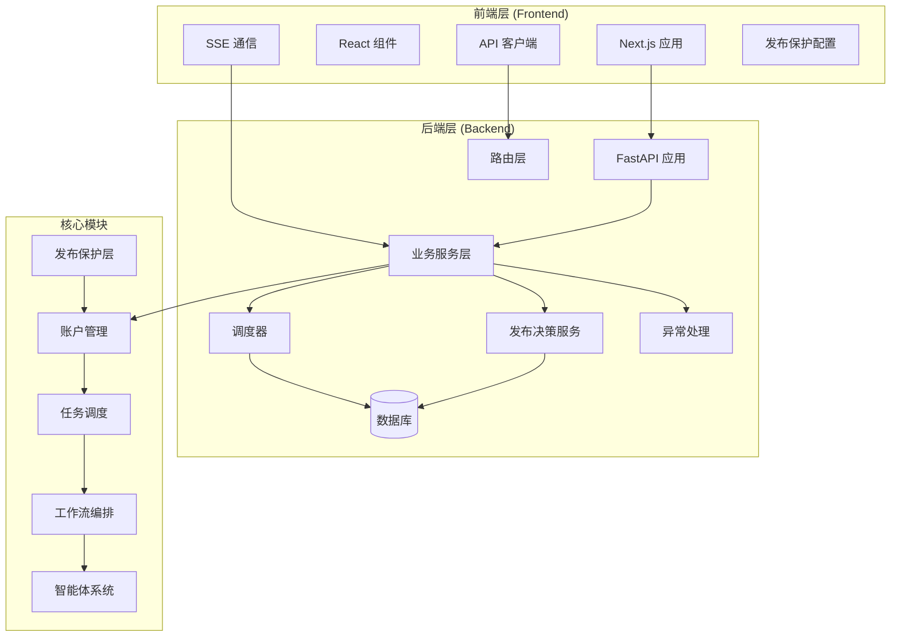
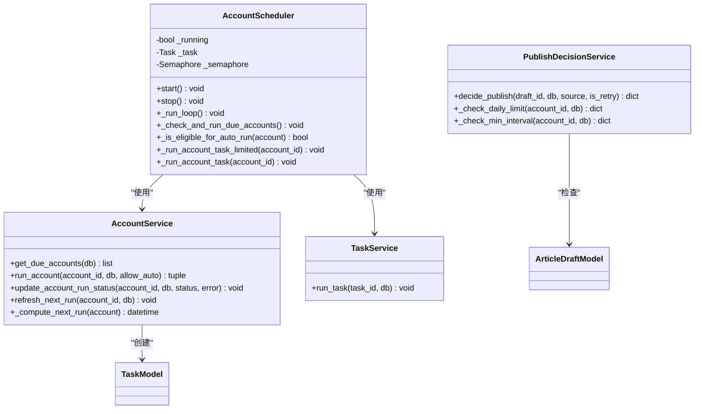
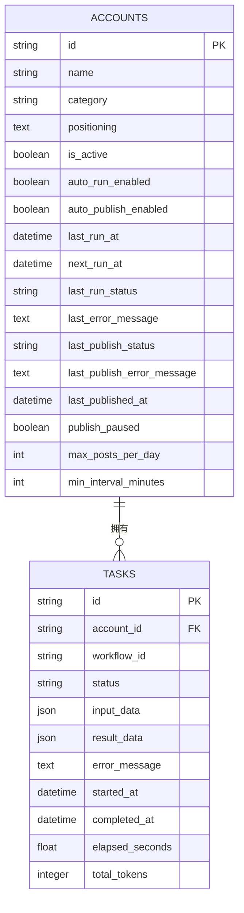
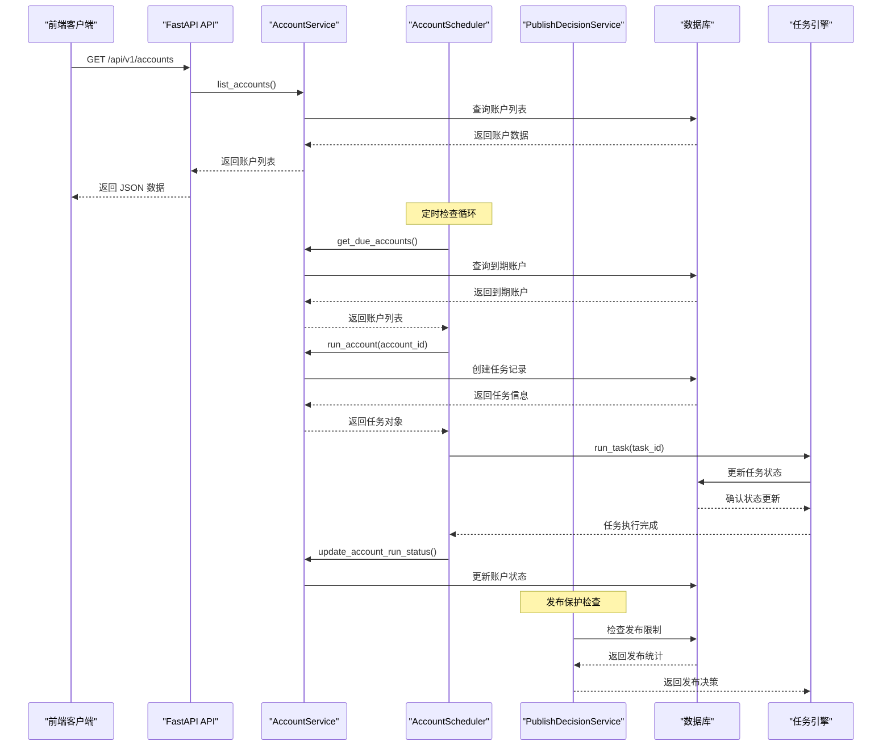
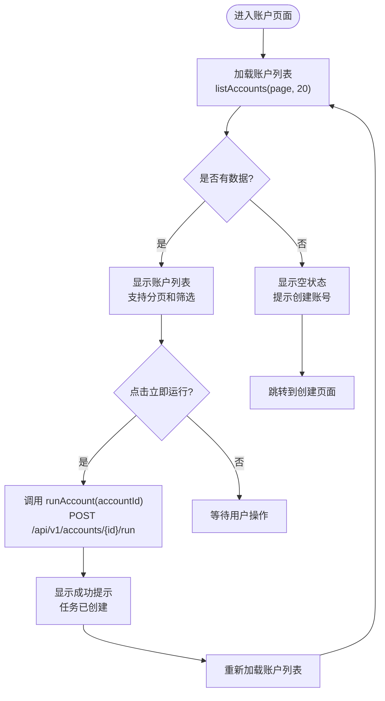
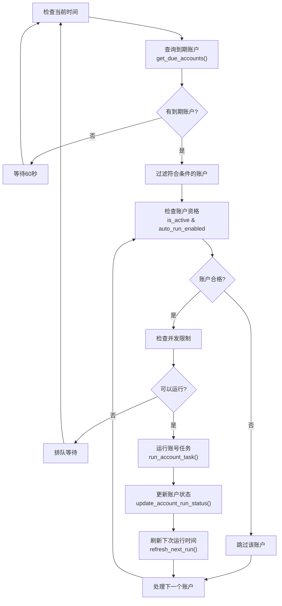
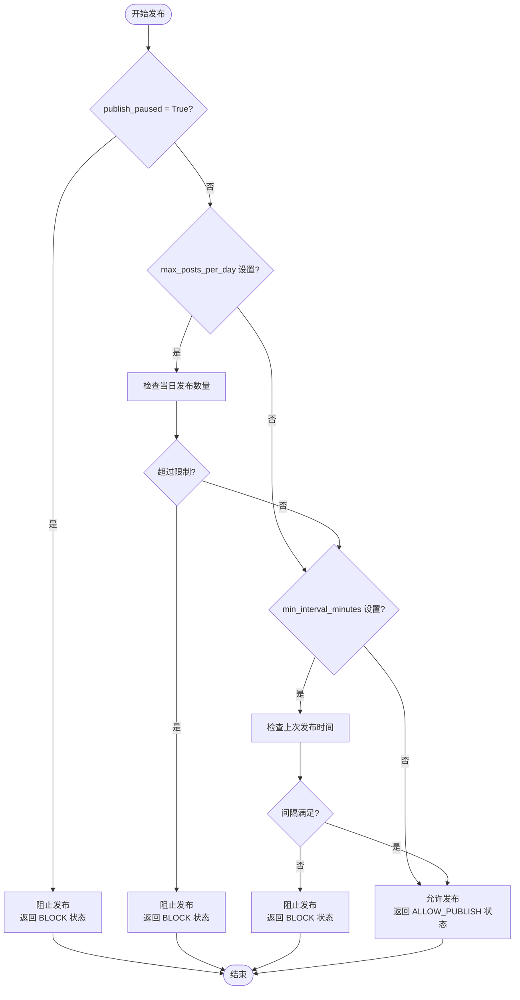
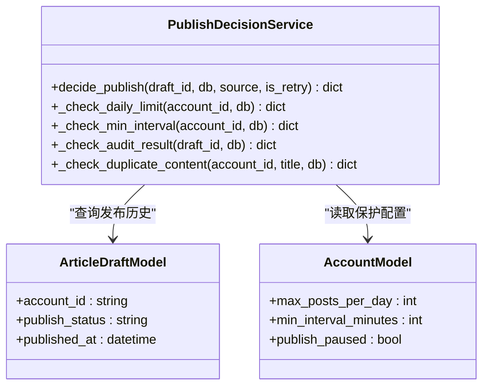
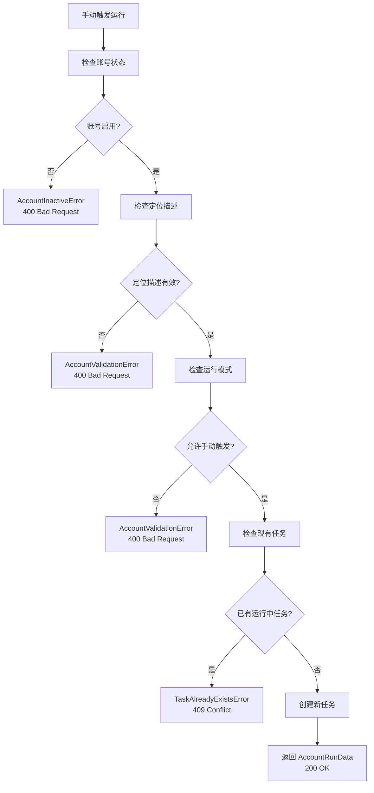
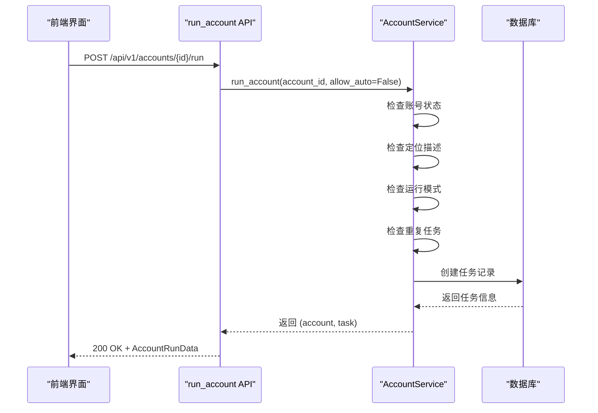

# 账户调度系统

<cite>
**本文档引用的文件**
- [main.py](file://backend/app/main.py)
- [account_scheduler.py](file://backend/app/scheduler/account_scheduler.py)
- [account_service.py](file://backend/app/services/account_service.py)
- [tables.py](file://backend/app/models/tables.py)
- [account_routes.py](file://backend/app/api/account_routes.py)
- [publish_decision_service.py](file://backend/app/services/publish_decision_service.py)
- [account.py](file://backend/app/schemas/account.py)
- [exceptions.py](file://backend/app/core/exceptions.py)
- [api.ts](file://frontend/lib/api.ts)
- [page.tsx](file://frontend/app/accounts/page.tsx)
- [page.tsx](file://frontend/app/accounts/[id]/page.tsx)
- [page.tsx](file://frontend/app/accounts/new/page.tsx)
- [index.ts](file://frontend/types/index.ts)
- [ARCHITECTURE.md](file://ARCHITECTURE.md)
- [PROJECT_STRUCTURE.md](file://PROJECT_STRUCTURE.md)
</cite>

## 更新摘要
**变更内容**
- 新增发布保护层机制，包含三个核心保护字段
- 更新账户模型以支持发布频率控制
- 增强发布决策服务的保护逻辑
- 完善前端界面以支持发布策略配置
- **新增** 改进的错误处理和冲突解决机制（409响应）
- **新增** 手动账户触发端点的完整实现
- **新增** 扩展的状态报告能力，包含发布保护状态

## 目录
1. [简介](#简介)
2. [项目结构](#项目结构)
3. [核心组件](#核心组件)
4. [架构概览](#架构概览)
5. [详细组件分析](#详细组件分析)
6. [发布保护层](#发布保护层)
7. [错误处理与冲突解决](#错误处理与冲突解决)
8. [手动触发端点](#手动触发端点)
9. [依赖关系分析](#依赖关系分析)
10. [性能考虑](#性能考虑)
11. [故障排除指南](#故障排除指南)
12. [结论](#结论)

## 简介

账户调度系统是 HotClaw 多智能体内容生产平台的核心组成部分，负责管理和调度微信公众号账号的自动化运行。该系统实现了智能的定时调度、并发控制和错误处理机制，确保账号能够按照预设的时间表自动执行内容生产任务。

**更新** 系统现已集成发布保护层机制，通过 `publish_paused`、`max_posts_per_day`、`min_interval_minutes` 三个字段为账户提供全面的发布保护，防止过度发布和违规操作。**新增** 改进的错误处理机制，包括409冲突响应和更精确的状态报告能力。

系统采用前后端分离架构，后端基于 FastAPI 构建，前端使用 Next.js 16，通过 SSE（Server-Sent Events）实现实时状态推送。账户调度功能支持手动触发和自动调度两种模式，为用户提供灵活的内容生产管理方式。

## 项目结构

HotClaw 项目采用模块化的三层架构设计：



**图表来源**
- [main.py:109-114](file://backend/app/main.py#L109-L114)
- [PROJECT_STRUCTURE.md:32-64](file://PROJECT_STRUCTURE.md#L32-L64)

**章节来源**
- [PROJECT_STRUCTURE.md:29-64](file://PROJECT_STRUCTURE.md#L29-L64)
- [ARCHITECTURE.md:39-78](file://ARCHITECTURE.md#L39-L78)

## 核心组件

### 账户调度器 (AccountScheduler)

账户调度器是系统的核心组件，负责定期检查和执行到期的账号任务。其主要功能包括：

- **定时检查**：每分钟检查一次到期的账号
- **并发控制**：限制同时运行的账号数量（默认3个）
- **状态管理**：跟踪账号的运行状态和错误信息
- **异常处理**：优雅处理各种运行时异常



**图表来源**
- [account_scheduler.py:25-295](file://backend/app/scheduler/account_scheduler.py#L25-L295)
- [account_service.py:35-429](file://backend/app/services/account_service.py#L35-L429)
- [publish_decision_service.py:532-597](file://backend/app/services/publish_decision_service.py#L532-L597)

**章节来源**
- [account_service.py:35-429](file://backend/app/services/account_service.py#L35-L429)

### 账户服务 (AccountService)

账户服务提供完整的账户生命周期管理功能：

- **账户 CRUD**：创建、查询、更新、删除账户
- **运行管理**：手动触发和自动调度执行
- **状态跟踪**：记录每次运行的结果和错误信息
- **调度支持**：提供到期账户查询功能

**章节来源**
- [account_service.py:35-429](file://backend/app/services/account_service.py#L35-L429)

### 数据模型 (Models)

系统使用 SQLAlchemy ORM 定义了完整的数据模型，**新增发布保护相关字段**：



**图表来源**
- [tables.py:28-62](file://backend/app/models/tables.py#L28-L62)

**章节来源**
- [tables.py:28-62](file://backend/app/models/tables.py#L28-L62)

## 架构概览

账户调度系统采用分层架构设计，确保各层职责清晰、耦合度低：



**图表来源**
- [main.py:98-106](file://backend/app/main.py#L98-L106)
- [account_scheduler.py:115-137](file://backend/app/scheduler/account_scheduler.py#L115-L137)
- [account_routes.py:54-88](file://backend/app/api/account_routes.py#L54-88)
- [publish_decision_service.py:532-597](file://backend/app/services/publish_decision_service.py#L532-L597)

**章节来源**
- [main.py:69-106](file://backend/app/main.py#L69-L106)
- [ARCHITECTURE.md:449-494](file://ARCHITECTURE.md#L449-L494)

## 详细组件分析

### 前端账户管理界面

前端使用 Next.js 构建了直观的账户管理界面，支持账户列表展示、手动触发运行等功能：



**图表来源**
- [page.tsx:20-44](file://frontend/app/accounts/page.tsx#L20-L44)
- [api.ts:485-512](file://frontend/lib/api.ts#L485-L512)

**章节来源**
- [page.tsx:8-200](file://frontend/app/accounts/page.tsx#L8-L200)
- [api.ts:400-556](file://frontend/lib/api.ts#L400-L556)

### 后端 API 接口设计

后端提供了完整的账户管理 API 接口：

| 接口 | 方法 | 路径 | 功能 | 错误处理 |
|------|------|------|------|----------|
| 创建账户 | POST | `/api/v1/accounts` | 创建新的公众号账号 | 400 验证错误 |
| 账户列表 | GET | `/api/v1/accounts` | 分页获取账户列表 | 500 服务器错误 |
| 账户详情 | GET | `/api/v1/accounts/{id}` | 获取账户详细信息 | 404 未找到 |
| 更新账户 | PATCH | `/api/v1/accounts/{id}` | 更新账户配置 | 400 验证错误, 404 未找到 |
| **手动运行** | **POST** | **`/api/v1/accounts/{id}/run`** | **手动触发账号运行** | **409 冲突, 400 验证错误, 500 服务器错误** |
| 启用账号 | POST | `/api/v1/accounts/{id}/enable` | 启用账号 | 404 未找到 |
| 禁用账号 | POST | `/api/v1/accounts/{id}/disable` | 禁用账号 | 404 未找到 |

**章节来源**
- [account_routes.py:30-380](file://backend/app/api/account_routes.py#L30-L380)

### 调度算法实现

账户调度器采用了智能的调度算法，确保系统的稳定性和效率：



**图表来源**
- [account_scheduler.py:115-173](file://backend/app/scheduler/account_scheduler.py#L115-L173)
- [account_service.py:373-401](file://backend/app/services/account_service.py#L373-L401)

**章节来源**
- [account_scheduler.py:115-295](file://backend/app/scheduler/account_scheduler.py#L115-L295)

## 发布保护层

**新增** 系统现在集成了完整的发布保护层机制，通过三个核心字段为账户提供多维度的发布保护：

### 发布保护字段详解

| 字段名 | 类型 | 默认值 | 作用域 | 描述 |
|--------|------|--------|--------|------|
| `publish_paused` | Boolean | False | 账户级别 | 是否暂停发布，用于临时停止所有发布活动 |
| `max_posts_per_day` | Integer | None | 账户级别 | 每日最大发布数量限制，None表示不限制 |
| `min_interval_minutes` | Integer | None | 账户级别 | 最小发布间隔（分钟），None表示不限制 |

### 发布保护机制工作流程



**图表来源**
- [publish_decision_service.py:532-597](file://backend/app/services/publish_decision_service.py#L532-L597)

### 发布保护服务实现

发布决策服务现在包含完整的保护逻辑：



**图表来源**
- [publish_decision_service.py:532-597](file://backend/app/services/publish_decision_service.py#L532-L597)

**章节来源**
- [publish_decision_service.py:532-597](file://backend/app/services/publish_decision_service.py#L532-L597)

## 错误处理与冲突解决

**新增** 系统现在具备完善的错误处理和冲突解决机制，特别针对手动触发运行场景：

### 错误处理层次

系统采用多层错误处理策略：

1. **业务层验证**：在 `AccountService.run_account()` 中进行基本验证
2. **API 层转换**：在 `account_routes.py` 中将业务异常转换为HTTP状态码
3. **冲突检测**：使用 `TaskAlreadyExistsError` 检测重复任务

### 冲突解决机制



**图表来源**
- [account_routes.py:235-293](file://backend/app/api/account_routes.py#L235-L293)
- [account_service.py:207-286](file://backend/app/services/account_service.py#L207-L286)

### 异常映射表

| 业务异常 | HTTP状态码 | 错误消息 | 用途 |
|----------|------------|----------|------|
| `AccountNotFoundError` | 404 | 账号不存在 | 账号查询/操作 |
| `AccountInactiveError` | 400 | 账号已禁用 | 手动触发运行 |
| `AccountValidationError` | 400 | 验证失败 | 配置/模式错误 |
| `TaskAlreadyExistsError` | **409** | **已有运行中任务** | **手动触发冲突** |
| `TaskCreateError` | 500 | 任务创建失败 | 任务创建异常 |

**章节来源**
- [account_routes.py:235-293](file://backend/app/api/account_routes.py#L235-L293)
- [exceptions.py:290-309](file://backend/app/core/exceptions.py#L290-L309)

## 手动触发端点

**新增** 完整的手动触发端点实现，支持前端"立即运行"按钮功能：

### 端点特性

- **强制执行**：`allow_auto=False`，绕过自动调度的重复检查
- **状态隔离**：手动触发创建独立任务，不影响自动调度
- **冲突检测**：防止同一账号同时运行多个任务
- **详细响应**：返回任务ID和运行状态

### 手动触发流程



**图表来源**
- [account_routes.py:235-274](file://backend/app/api/account_routes.py#L235-L274)
- [account_service.py:207-286](file://backend/app/services/account_service.py#L207-L286)

### 前端集成

前端通过 `runAccount()` 函数调用手动触发端点：

```typescript
/**
 * runAccount - 手动触发账号运行
 *
 * 调用后端 API: POST /api/v1/accounts/{accountId}/run
 *
 * 参数:
 * - accountId: 账号 ID
 *
 * 返回:
 * - AccountRunData (包含 account_id, task_id, status, operation_mode)
 *
 * 异常:
 * - 409 Conflict: 已有运行中的任务
 * - 400 Bad Request: 账号已禁用或 positioning 为空
 */
export async function runAccount(accountId: string): Promise<AccountRunData> {
  return request<AccountRunData>(`/accounts/${accountId}/run`, {
    method: "POST",
  });
}
```

**章节来源**
- [account_routes.py:235-293](file://backend/app/api/account_routes.py#L235-L293)
- [api.ts:485-512](file://frontend/lib/api.ts#L485-L512)

## 依赖关系分析

系统各组件之间的依赖关系清晰明确：

```mermaid
graph TB
subgraph "前端依赖"
FE_API[api.ts] --> FE_TYPES[index.ts]
FE_PAGE[accounts/page.tsx] --> FE_API
FE_PAGE --> FE_TYPES
FE_EDIT[accounts/[id]/edit/page.tsx] --> FE_TYPES
end
subgraph "后端依赖"
BE_MAIN[main.py] --> BE_SCHEDULER[account_scheduler.py]
BE_MAIN --> BE_SERVICE[account_service.py]
BE_MAIN --> BE_PUBLISH_SERVICE[publish_decision_service.py]
BE_SCHEDULER --> BE_SERVICE
BE_SCHEDULER --> BE_TASK_SERVICE[task_service.py]
BE_SERVICE --> BE_MODELS[tables.py]
BE_SERVICE --> BE_ACCOUNT_SCHEMA[account.py]
BE_PUBLISH_SERVICE --> BE_MODELS
BE_PUBLISH_SERVICE --> BE_ACCOUNT_SCHEMA
BE_ACCOUNT_ROUTES[account_routes.py] --> BE_SERVICE
BE_ACCOUNT_ROUTES --> BE_EXCEPTIONS[exceptions.py]
end
subgraph "外部依赖"
EXT_FASTAPI[FastAPI] --> BE_MAIN
EXT_SQLITE[SQLite] --> BE_MODELS
EXT_ASYNCIO[asyncio] --> BE_SCHEDULER
end
FE_API --> BE_ACCOUNT_ROUTES
BE_ACCOUNT_ROUTES --> BE_SERVICE
BE_SERVICE --> BE_MODELS
```

**图表来源**
- [main.py:30-48](file://backend/app/main.py#L30-L48)
- [account_routes.py:3-24](file://backend/app/api/account_routes.py#L3-L24)

**章节来源**
- [main.py:30-48](file://backend/app/main.py#L30-L48)
- [account_routes.py:3-24](file://backend/app/api/account_routes.py#L3-L24)

## 性能考虑

### 并发控制策略

系统通过信号量机制实现智能的并发控制：

- **最大并发数**：默认限制为3个账号同时运行
- **独立任务**：每个账号的执行都是独立的 asyncio 任务
- **资源隔离**：每个任务使用独立的数据库连接
- **异常隔离**：单个账号的异常不会影响其他账号

### 数据库优化

- **异步连接池**：使用 SQLAlchemy AsyncSession 提供连接池
- **批量查询**：支持批量获取到期账户，减少数据库往返
- **索引优化**：关键字段（next_run_at, is_active, auto_run_enabled）建立索引
- **事务管理**：每个操作都在独立的事务中执行

### 内存管理

- **队列长度限制**：SSE 广播器使用 deque(maxlen=100) 限制历史事件数量
- **定时清理**：60秒延迟清理防止内存泄漏
- **状态重放**：新订阅者自动重放最近100个事件

### 发布保护性能优化

- **缓存策略**：发布统计数据可进行短期缓存
- **批量检查**：支持批量检查多个账户的发布状态
- **索引优化**：为发布相关字段建立合适的数据库索引

## 故障排除指南

### 常见问题及解决方案

| 问题类型 | 症状 | 可能原因 | 解决方案 |
|----------|------|----------|----------|
| 调度不生效 | 账号未按时运行 | next_run_at 为空或未来时间 | 检查账号配置和时间设置 |
| 并发限制 | 任务排队等待 | MAX_CONCURRENT_RUNS=3 | 调整并发限制或增加系统资源 |
| 数据库连接失败 | SQL 错误或连接超时 | 数据库服务不可用 | 检查数据库连接配置和服务状态 |
| SSE 连接中断 | 实时状态不更新 | 网络问题或代理缓冲 | 确保直连后端端口8002 |
| 账号状态异常 | last_run_status 显示错误 | 任务执行异常 | 查看系统日志和错误详情 |
| 发布被阻止 | 文章无法发布 | 达到发布限制 | 检查 max_posts_per_day 或 min_interval_minutes 配置 |
| **手动触发冲突** | **409 Conflict 错误** | **已有运行中任务** | **等待任务完成或取消** |
| **权限错误** | **400 Bad Request** | **账号禁用或配置无效** | **启用账号或修正配置** |

### 调试技巧

1. **启用调试模式**：设置 `app_debug=true` 获取详细错误信息
2. **检查日志**：关注 `account_scheduler_*` 和 `account_run_*` 日志
3. **验证配置**：确认账号的 operation_mode 和 auto_run_enabled 设置
4. **监控资源**：观察 CPU 和内存使用情况，避免过度并发
5. **发布保护调试**：检查 publish_paused、max_posts_per_day、min_interval_minutes 配置
6. **手动触发调试**：使用浏览器开发者工具查看409冲突的具体原因

**章节来源**
- [main.py:184-196](file://backend/app/main.py#L184-L196)
- [account_scheduler.py:241-291](file://backend/app/scheduler/account_scheduler.py#L241-L291)

## 结论

账户调度系统通过精心设计的架构和实现，为 HotClaw 平台提供了稳定可靠的账号管理能力。**新增的发布保护层机制进一步增强了系统的安全性和可控性**，**改进的错误处理和冲突解决机制提升了系统的健壮性**，**完整的手动触发端点为用户提供了更好的交互体验**。

系统的主要优势包括：

1. **高可靠性**：完善的异常处理和错误恢复机制
2. **高性能**：智能的并发控制和资源管理
3. **易维护**：清晰的分层架构和模块化设计
4. **用户体验**：直观的前端界面和实时状态反馈
5. **安全性**：完整的发布保护机制，防止过度发布
6. **健壮性**：精确的错误分类和冲突解决机制

**新增功能**：
- **发布暂停**：通过 `publish_paused` 字段实现临时停机
- **数量限制**：通过 `max_posts_per_day` 防止内容泛滥
- **时间间隔**：通过 `min_interval_minutes` 确保合理的发布节奏
- **冲突检测**：通过 `TaskAlreadyExistsError` 防止重复任务
- **手动触发**：通过 `/run` 端点支持即时运行

该系统为后续的功能扩展奠定了良好的基础，包括支持更多运行模式、增强调度策略、优化性能表现、完善发布保护机制等方面都有明确的发展方向。通过持续的迭代改进，账户调度系统将继续为用户提供高效、稳定、安全的自动化内容生产服务。