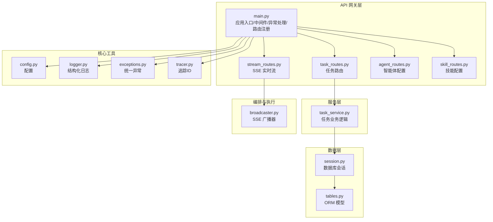
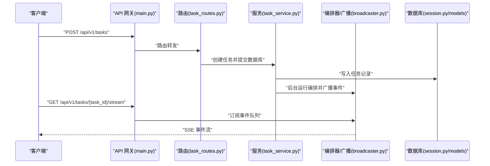
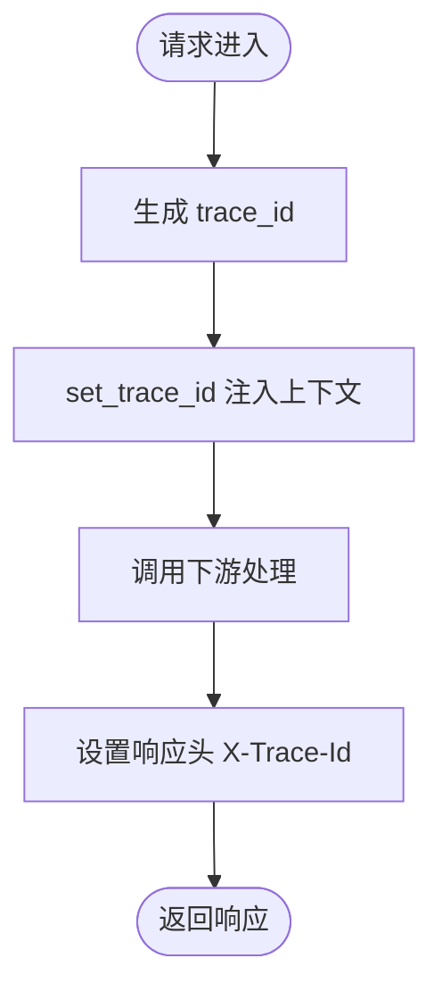
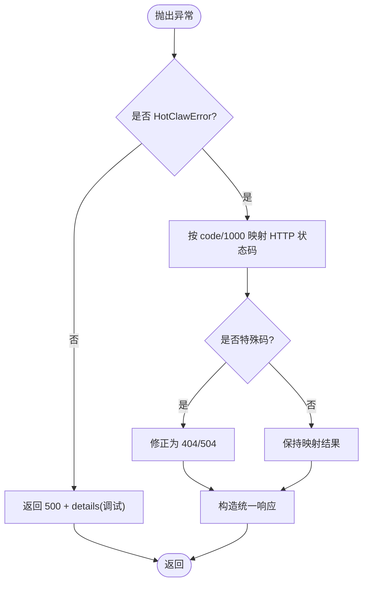
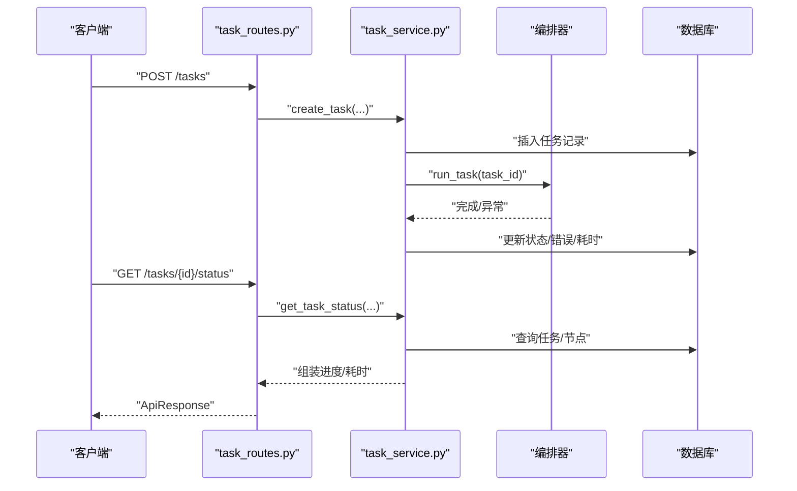
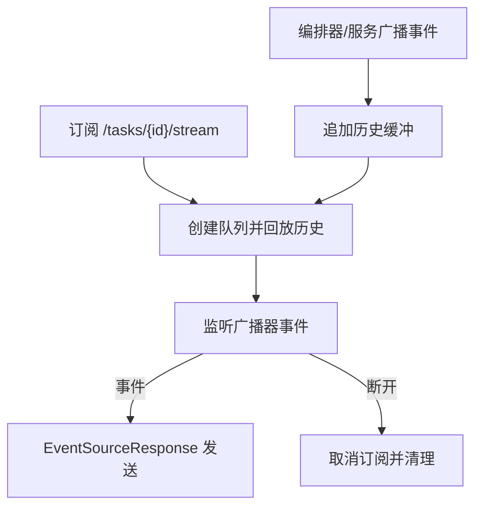
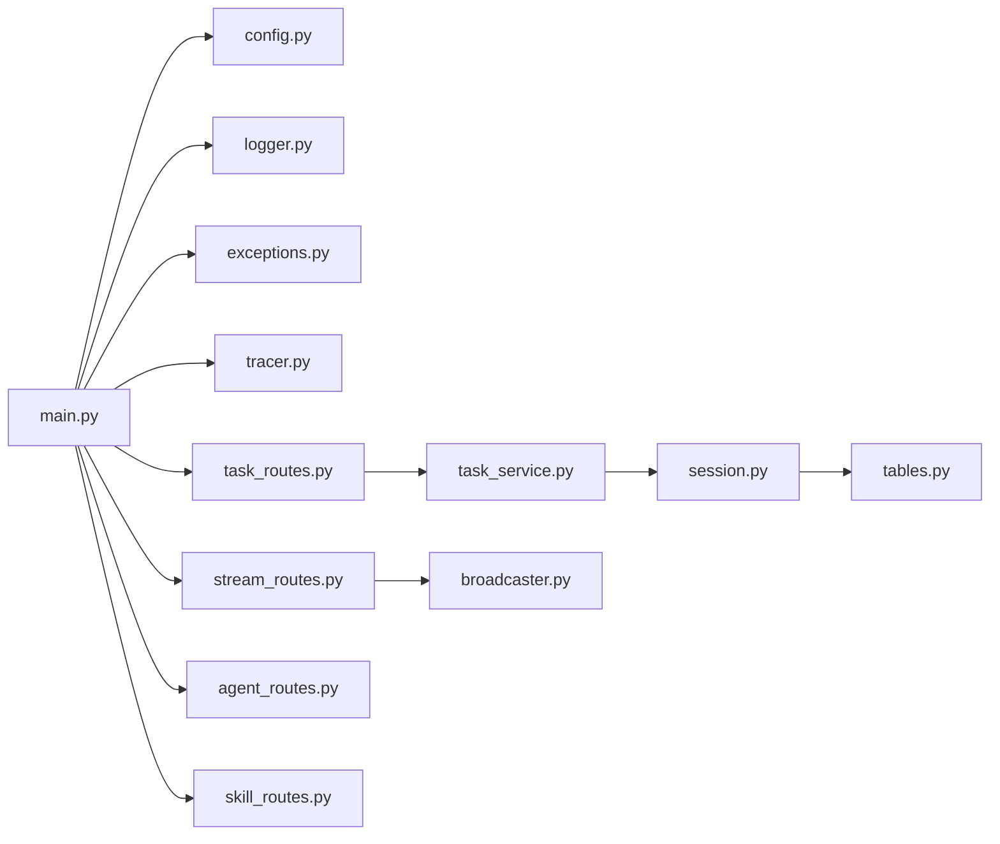

# API网关设计

<cite>
**本文引用的文件**
- [main.py](file://backend/app/main.py)
- [config.py](file://backend/app/core/config.py)
- [exceptions.py](file://backend/app/core/exceptions.py)
- [tracer.py](file://backend/app/core/tracer.py)
- [task_routes.py](file://backend/app/api/task_routes.py)
- [stream_routes.py](file://backend/app/api/stream_routes.py)
- [agent_routes.py](file://backend/app/api/agent_routes.py)
- [skill_routes.py](file://backend/app/api/skill_routes.py)
- [task_service.py](file://backend/app/services/task_service.py)
- [logger.py](file://backend/app/core/logger.py)
- [broadcaster.py](file://backend/app/orchestrator/broadcaster.py)
- [tables.py](file://backend/app/models/tables.py)
- [session.py](file://backend/app/db/session.py)
- [pyproject.toml](file://backend/pyproject.toml)
- [ARCHITECTURE.md](file://ARCHITECTURE.md)
</cite>

## 目录
1. [简介](#简介)
2. [项目结构](#项目结构)
3. [核心组件](#核心组件)
4. [架构总览](#架构总览)
5. [详细组件分析](#详细组件分析)
6. [依赖分析](#依赖分析)
7. [性能考量](#性能考量)
8. [故障排查指南](#故障排查指南)
9. [结论](#结论)
10. [附录](#附录)

## 简介
本文件系统化阐述 HotClaw API 网关的设计与实现，覆盖 FastAPI 应用入口点配置（生命周期管理、CORS 中间件、全局异常处理）、路由注册流程（任务管理、实时流、智能体配置、技能管理）、追踪 ID 中间件的实现原理（请求追踪、响应头设置、分布式追踪支持）、错误处理策略（HotClawError 分类映射与未捕获异常统一处理）、健康检查端点实现以及生产环境安全配置建议。同时提供面向开发者的路由设计模式与最佳实践。

## 项目结构
后端采用分层架构，API 网关位于顶层，负责路由、参数校验、统一错误响应与 SSE 实时事件推送；业务逻辑集中在服务层；数据模型与数据库会话管理位于 models 与 db 层；核心工具（日志、异常、追踪）位于 core 层；编排器与智能体/技能层位于 orchestrator 与 agents/skills 层。

**图表来源**
- [main.py:60-142](file://backend/app/main.py#L60-L142)
- [task_routes.py:16-163](file://backend/app/api/task_routes.py#L16-L163)
- [stream_routes.py:11-43](file://backend/app/api/stream_routes.py#L11-L43)
- [agent_routes.py:14-115](file://backend/app/api/agent_routes.py#L14-L115)
- [skill_routes.py:14-61](file://backend/app/api/skill_routes.py#L14-L61)
- [task_service.py:20-126](file://backend/app/services/task_service.py#L20-L126)
- [broadcaster.py:11-94](file://backend/app/orchestrator/broadcaster.py#L11-L94)
- [session.py:1-33](file://backend/app/db/session.py#L1-L33)
- [tables.py:18-233](file://backend/app/models/tables.py#L18-L233)
- [config.py:7-51](file://backend/app/core/config.py#L7-L51)
- [logger.py:8-36](file://backend/app/core/logger.py#L8-L36)
- [exceptions.py:4-125](file://backend/app/core/exceptions.py#L4-L125)
- [tracer.py:10-34](file://backend/app/core/tracer.py#L10-L34)

**章节来源**
- [main.py:60-142](file://backend/app/main.py#L60-L142)
- [ARCHITECTURE.md:414-448](file://ARCHITECTURE.md#L414-L448)

## 核心组件
- 应用入口与生命周期：通过 lifespan 钩子完成日志初始化、智能体注册、开发模式自动建表、启动与关闭日志记录。
- CORS 中间件：允许跨域请求，开发环境默认放开，生产环境应收紧。
- 追踪 ID 中间件：为每个请求生成 trace_id，注入上下文并在响应头中返回。
- 全局异常处理：HotClawError 分类映射到 HTTP 状态码；未捕获异常统一返回 500。
- 路由注册：任务管理、实时流、智能体配置、技能管理四大路由模块。
- 健康检查端点：/api/v1/health 返回服务状态与版本。

**章节来源**
- [main.py:42-58](file://backend/app/main.py#L42-L58)
- [main.py:67-74](file://backend/app/main.py#L67-L74)
- [main.py:77-84](file://backend/app/main.py#L77-L84)
- [main.py:87-129](file://backend/app/main.py#L87-L129)
- [main.py:132-142](file://backend/app/main.py#L132-L142)

## 架构总览
API 网关作为统一入口，接收请求后进入路由层，参数校验与业务调用解耦；任务执行通过服务层触发编排器异步运行，SSE 广播器向订阅者推送节点状态事件；数据库会话与模型定义支撑任务与节点运行记录的持久化。

**图表来源**
- [main.py:132-142](file://backend/app/main.py#L132-L142)
- [task_routes.py:19-51](file://backend/app/api/task_routes.py#L19-L51)
- [task_service.py:22-58](file://backend/app/services/task_service.py#L22-L58)
- [broadcaster.py:30-84](file://backend/app/orchestrator/broadcaster.py#L30-L84)
- [session.py:22-33](file://backend/app/db/session.py#L22-L33)

## 详细组件分析

### 应用入口与生命周期管理
- 使用 lifespan 钩子在启动时：
  - 初始化结构化日志
  - 注册智能体到注册中心
  - 开发模式下自动创建数据库表
  - 记录启动与关闭日志
- 应用实例配置了标题、描述、版本与生命周期钩子。

**章节来源**
- [main.py:42-58](file://backend/app/main.py#L42-L58)
- [main.py:60-65](file://backend/app/main.py#L60-L65)

### CORS 中间件设置
- 允许任意源、凭证、方法与头部，便于前端联调；生产环境建议限定允许源并按需收紧。

**章节来源**
- [main.py:67-74](file://backend/app/main.py#L67-L74)

### 追踪 ID 中间件
- 请求进入时生成 trace_id 并注入上下文，响应时将 X-Trace-Id 写入响应头，便于端到端追踪与日志关联。
- 追踪 ID 与任务 ID 通过 contextvar 传播，贯穿服务层与日志系统。

**图表来源**
- [main.py:77-84](file://backend/app/main.py#L77-L84)
- [tracer.py:10-26](file://backend/app/core/tracer.py#L10-L26)

**章节来源**
- [main.py:77-84](file://backend/app/main.py#L77-L84)
- [tracer.py:10-34](file://backend/app/core/tracer.py#L10-L34)

### 全局异常处理机制
- HotClawError 分类映射：
  - 1xxx → 400
  - 2xxx → 409
  - 3xxx → 502
  - 4xxx → 400
  - 5xxx → 500
  - 特殊码：1002/1003/1004 → 404；3003 → 504
- 未捕获异常统一返回 500，开发模式下可返回错误详情。

**图表来源**
- [main.py:87-129](file://backend/app/main.py#L87-L129)
- [exceptions.py:4-125](file://backend/app/core/exceptions.py#L4-L125)

**章节来源**
- [main.py:87-129](file://backend/app/main.py#L87-L129)
- [exceptions.py:4-125](file://backend/app/core/exceptions.py#L4-L125)

### 路由注册流程
- 任务管理路由：创建任务、查询状态、详情、节点明细、分页列表。
- 实时流路由：SSE 事件流，支持断连重连与心跳保活。
- 智能体配置路由：列出/获取/更新智能体配置。
- 技能管理路由：列出/更新技能配置。
- 路由均通过 APIRouter 定义前缀与标签，遵循统一的 ApiResponse 包裹。

**章节来源**
- [task_routes.py:16-163](file://backend/app/api/task_routes.py#L16-L163)
- [stream_routes.py:11-43](file://backend/app/api/stream_routes.py#L11-L43)
- [agent_routes.py:14-115](file://backend/app/api/agent_routes.py#L14-L115)
- [skill_routes.py:14-61](file://backend/app/api/skill_routes.py#L14-L61)

### 任务管理路由与服务层
- 创建任务：写入任务记录后，使用后台任务异步运行编排器，避免阻塞请求。
- 查询状态/详情/节点：聚合任务与节点运行记录，计算进度与耗时。
- 服务层负责幂等与一致性：运行前检查状态，失败时记录错误与耗时，广播错误事件并关闭流。

**图表来源**
- [task_routes.py:19-51](file://backend/app/api/task_routes.py#L19-L51)
- [task_routes.py:54-107](file://backend/app/api/task_routes.py#L54-L107)
- [task_routes.py:110-163](file://backend/app/api/task_routes.py#L110-L163)
- [task_service.py:22-122](file://backend/app/services/task_service.py#L22-L122)
- [session.py:22-33](file://backend/app/db/session.py#L22-L33)

**章节来源**
- [task_routes.py:19-163](file://backend/app/api/task_routes.py#L19-L163)
- [task_service.py:20-126](file://backend/app/services/task_service.py#L20-L126)

### 实时流与事件广播
- SSE 广播器为每个任务维护订阅队列与历史缓冲，支持晚到订阅者回放事件。
- 事件类型涵盖节点开始/进度/完成/错误与任务完成/错误；连接断开自动清理。
- 流端点实现超时保活与断连检测。

**图表来源**
- [stream_routes.py:14-42](file://backend/app/api/stream_routes.py#L14-L42)
- [broadcaster.py:30-84](file://backend/app/orchestrator/broadcaster.py#L30-L84)

**章节来源**
- [stream_routes.py:14-43](file://backend/app/api/stream_routes.py#L14-L43)
- [broadcaster.py:11-94](file://backend/app/orchestrator/broadcaster.py#L11-L94)

### 智能体与技能配置路由
- 智能体路由：列出已注册智能体，按需查询数据库中的自定义提示/模型/重试配置；获取单个智能体详情并合并有效提示源。
- 技能路由：列出已注册技能，更新技能配置并持久化。
- 两者均通过数据库模型保存用户可调整的配置，支持热更新。

**章节来源**
- [agent_routes.py:17-115](file://backend/app/api/agent_routes.py#L17-L115)
- [skill_routes.py:17-61](file://backend/app/api/skill_routes.py#L17-L61)
- [tables.py:160-200](file://backend/app/models/tables.py#L160-L200)

### 健康检查端点
- 提供 /api/v1/health 返回服务状态与版本，便于探活与部署验证。

**章节来源**
- [main.py:139-142](file://backend/app/main.py#L139-L142)

## 依赖分析
- 应用依赖 FastAPI、SQLAlchemy 异步、structlog、sse-starlette、nanoid 等；生产数据库推荐 PostgreSQL，开发默认 SQLite。
- 数据库会话工厂与依赖注入在 session.py 中集中管理，确保事务正确提交/回滚/关闭。
- 日志系统通过 structlog 配置处理器链，结合上下文变量实现结构化输出。

**图表来源**
- [pyproject.toml:6-22](file://backend/pyproject.toml#L6-L22)
- [session.py:1-33](file://backend/app/db/session.py#L1-L33)
- [logger.py:8-36](file://backend/app/core/logger.py#L8-L36)

**章节来源**
- [pyproject.toml:1-41](file://backend/pyproject.toml#L1-L41)
- [session.py:1-33](file://backend/app/db/session.py#L1-L33)
- [logger.py:8-36](file://backend/app/core/logger.py#L8-L36)

## 性能考量
- 异步数据库与会话：使用 SQLAlchemy 2.0 异步引擎与依赖注入，减少阻塞。
- 任务后台执行：创建任务后立即返回，后台运行编排器，提升吞吐。
- SSE 保活与断连：流端点设置超时与心跳注释，降低空闲连接占用。
- 日志结构化：JSON 渲染与时间戳、堆栈信息等处理器链，便于日志检索与分析。
- 开发模式自动建表：减少手动迁移成本，但生产环境应禁用自动建表。

[本节为通用性能建议，无需特定文件引用]

## 故障排查指南
- 统一错误响应：HotClawError 会根据分类映射到合适的 HTTP 状态码；特殊码有例外处理。
- 未捕获异常：统一返回 500，开发模式下包含错误详情，生产环境隐藏细节。
- 日志定位：利用 X-Trace-Id 响应头与结构化日志，快速关联请求与任务上下文。
- 数据一致性：数据库会话在依赖中自动提交/回滚，确保异常时回滚。
- SSE 订阅：若断流，检查订阅队列与广播器状态，确认任务是否已关闭。

**章节来源**
- [main.py:87-129](file://backend/app/main.py#L87-L129)
- [logger.py:8-36](file://backend/app/core/logger.py#L8-L36)
- [session.py:22-33](file://backend/app/db/session.py#L22-L33)
- [broadcaster.py:30-84](file://backend/app/orchestrator/broadcaster.py#L30-L84)

## 结论
HotClaw API 网关以 FastAPI 为核心，通过清晰的中间件与异常处理、规范化的路由与服务层解耦、完善的 SSE 实时流与结构化日志，构建了可扩展、可观测、易维护的多智能体内容生产平台入口。生产环境建议收紧 CORS、启用 HTTPS、限制自动建表与错误详情泄露，并结合追踪 ID 与日志实现端到端问题定位。

[本节为总结性内容，无需特定文件引用]

## 附录

### 路由设计模式与最佳实践
- 路由前缀与标签：统一前缀与标签，便于 API 文档与治理。
- 参数校验：使用 Pydantic 模型进行输入校验，减少脏数据进入业务层。
- 依赖注入：数据库会话通过依赖注入管理生命周期，确保事务正确性。
- 事件驱动：SSE 广播器与订阅队列解耦事件产生与消费，支持晚到订阅。
- 错误分类：HotClawError 分类映射到 HTTP 状态码，保证客户端可预期行为。
- 追踪与日志：trace_id 与结构化日志配合，实现端到端可观测性。

**章节来源**
- [task_routes.py:16-163](file://backend/app/api/task_routes.py#L16-L163)
- [stream_routes.py:11-43](file://backend/app/api/stream_routes.py#L11-L43)
- [agent_routes.py:14-115](file://backend/app/api/agent_routes.py#L14-L115)
- [skill_routes.py:14-61](file://backend/app/api/skill_routes.py#L14-L61)
- [exceptions.py:4-125](file://backend/app/core/exceptions.py#L4-L125)
- [logger.py:8-36](file://backend/app/core/logger.py#L8-L36)
- [broadcaster.py:11-94](file://backend/app/orchestrator/broadcaster.py#L11-L94)

### 生产环境安全配置建议
- CORS：限定 allow_origins，避免使用通配符。
- 传输安全：启用 HTTPS，强制 TLS。
- 认证与授权：在网关层增加鉴权中间件与速率限制。
- 配置管理：敏感信息通过环境变量或密钥管理服务注入。
- 日志脱敏：避免在日志中输出敏感字段。
- 健康检查：仅暴露必要端点，限制访问来源。

[本节为通用安全建议，无需特定文件引用]