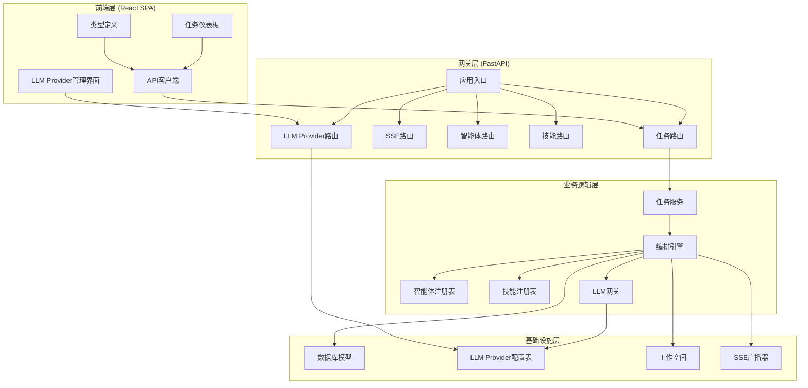
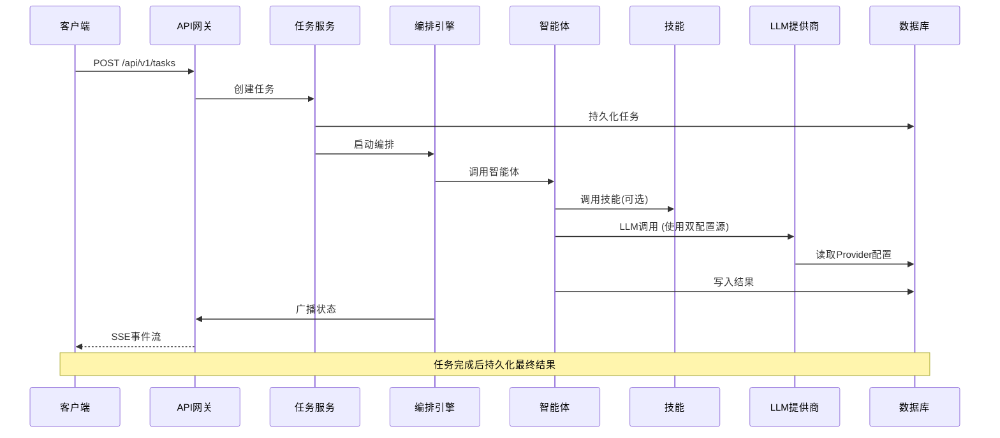
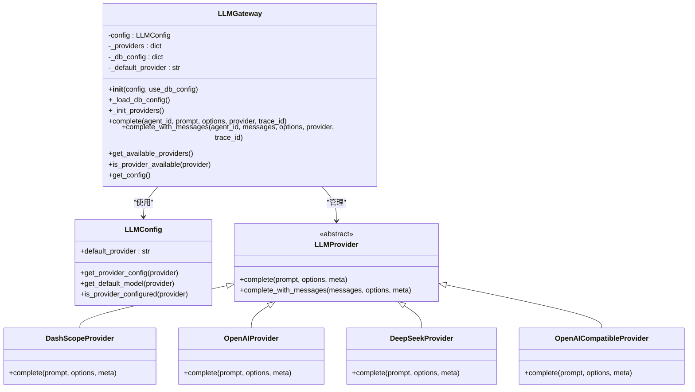
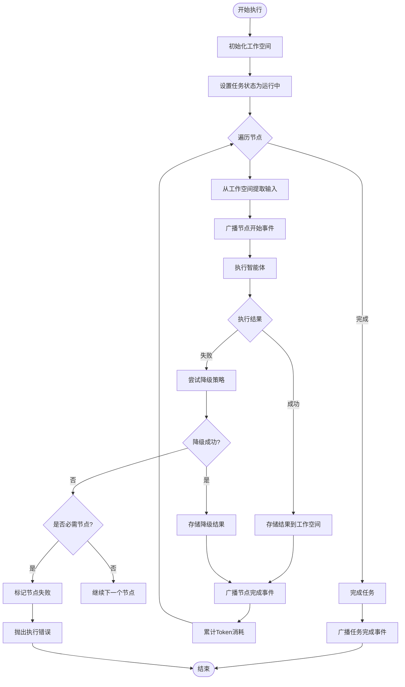
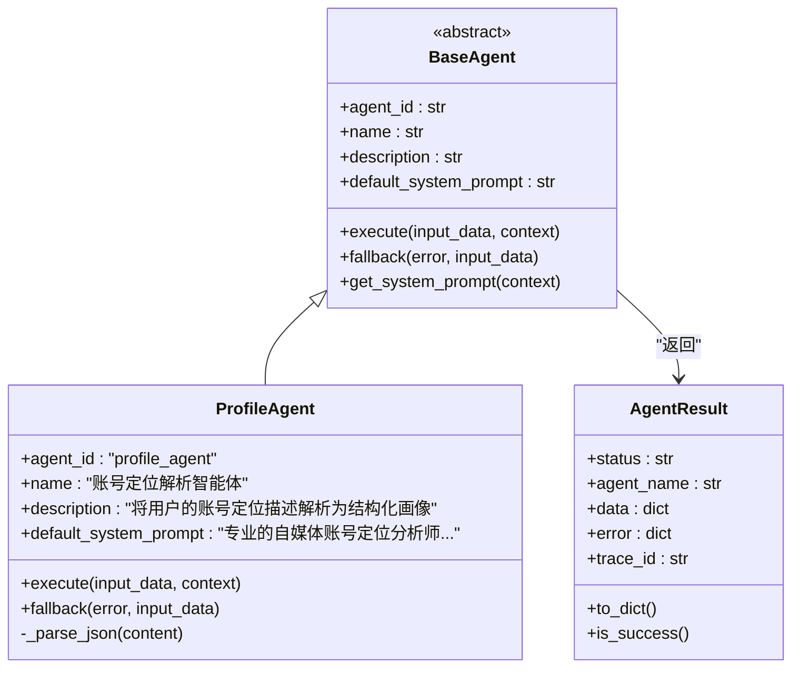
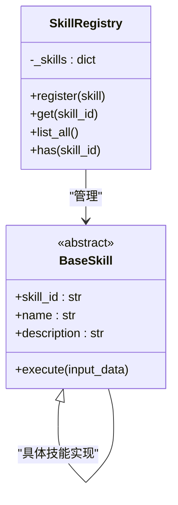
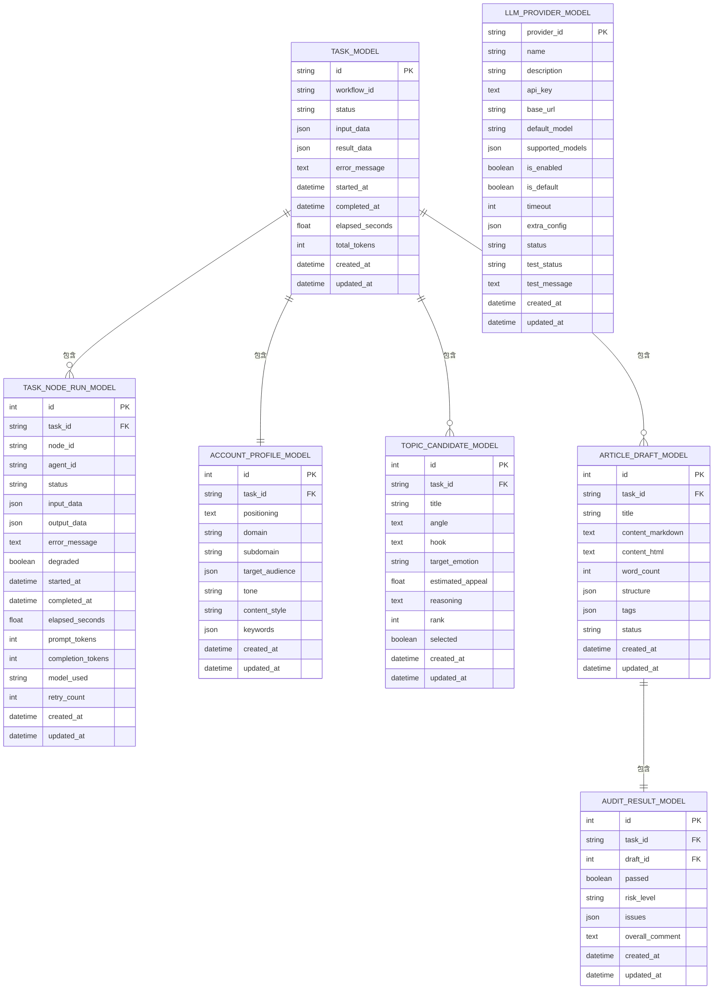
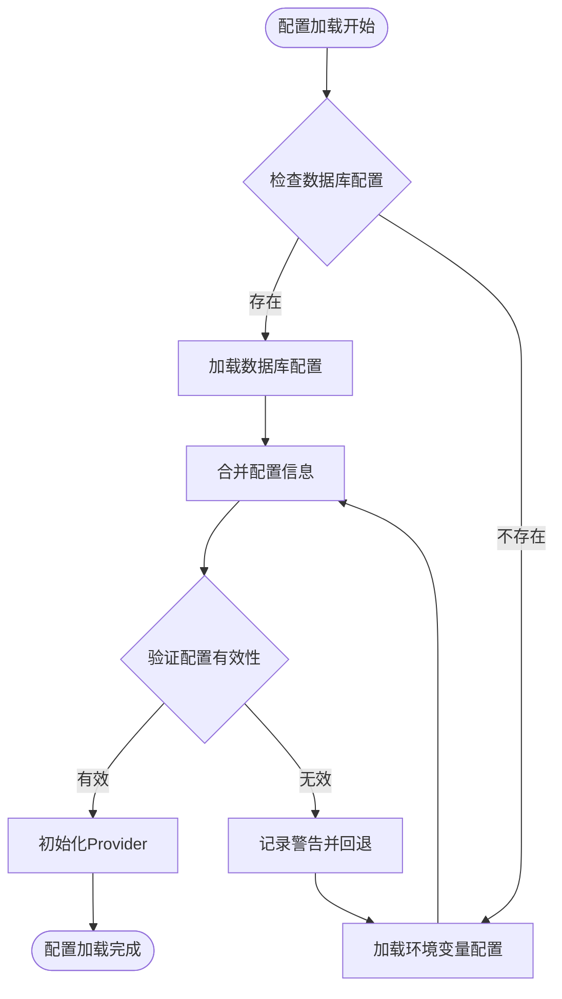
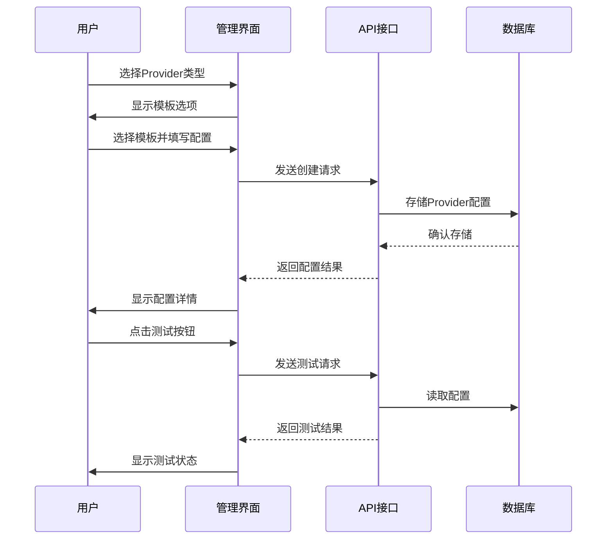
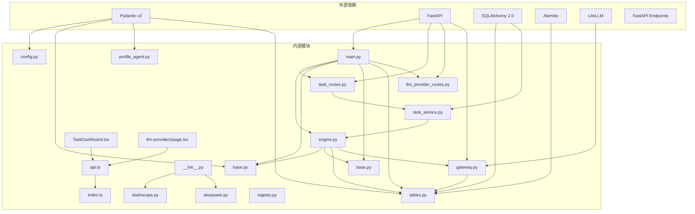

# LLM网关系统

<cite>
**本文档引用的文件**
- [ARCHITECTURE.md](file://ARCHITECTURE.md)
- [backend/app/main.py](file://backend/app/main.py)
- [backend/app/llm/gateway.py](file://backend/app/llm/gateway.py)
- [backend/app/llm/config.py](file://backend/app/llm/config.py)
- [backend/app/llm/providers/__init__.py](file://backend/app/llm/providers/__init__.py)
- [backend/app/llm/providers/dashscope.py](file://backend/app/llm/providers/dashscope.py)
- [backend/app/llm/providers/deepseek.py](file://backend/app/llm/providers/deepseek.py)
- [backend/app/api/llm_provider_routes.py](file://backend/app/api/llm_provider_routes.py)
- [backend/app/models/tables.py](file://backend/app/models/tables.py)
- [backend/app/orchestrator/engine.py](file://backend/app/orchestrator/engine.py)
- [backend/app/agents/base.py](file://backend/app/agents/base.py)
- [backend/app/agents/profile_agent.py](file://backend/app/agents/profile_agent.py)
- [backend/app/skills/base.py](file://backend/app/skills/base.py)
- [backend/app/skills/registry.py](file://backend/app/skills/registry.py)
- [backend/app/api/task_routes.py](file://backend/app/api/task_routes.py)
- [backend/app/services/task_service.py](file://backend/app/services/task_service.py)
- [frontend/lib/api.ts](file://frontend/lib/api.ts)
- [frontend/types/index.ts](file://frontend/types/index.ts)
- [frontend/components/dashboard/TaskDashboard.tsx](file://frontend/components/dashboard/TaskDashboard.tsx)
- [frontend/app/settings/llm-providers/page.tsx](file://frontend/app/settings/llm-providers/page.tsx)
</cite>

## 更新摘要
**所做更改**
- 新增LLM Provider双配置源系统章节，详细介绍数据库和环境变量双重配置机制
- 更新LLM网关组件分析，增加双配置源优先级和回退机制说明
- 新增LLM Provider管理界面章节，涵盖前端配置界面和CRUD操作
- 更新配置管理章节，详细说明双配置源的工作原理和使用场景
- 新增数据库模型章节，介绍LLMProviderModel的数据结构和字段说明

## 目录
1. [简介](#简介)
2. [项目结构](#项目结构)
3. [核心组件](#核心组件)
4. [架构总览](#架构总览)
5. [详细组件分析](#详细组件分析)
6. [双配置源系统](#双配置源系统)
7. [LLM Provider管理界面](#llm-provider管理界面)
8. [配置管理](#配置管理)
9. [依赖关系分析](#依赖关系分析)
10. [性能考虑](#性能考虑)
11. [故障排除指南](#故障排除指南)
12. [结论](#结论)

## 简介
本项目是一个基于多智能体协作的公众号内容生产平台，用户仅需输入"账号定位"，系统即可自动完成从热点抓取、选题策划、标题生成、正文撰写到审核风控的全链路内容生产，并输出可编辑的文章草稿。系统采用前后端分离架构，后端使用FastAPI提供统一网关，前端使用React + TypeScript实现实时状态可视化与交互。

**更新** 新增LLM Provider双配置源系统，支持数据库和环境变量双重配置，增强多提供商支持和用户自定义能力

## 项目结构
系统采用分层架构设计，主要分为以下层次：

**图表来源**
- [backend/app/main.py:60-142](file://backend/app/main.py#L60-L142)
- [backend/app/api/task_routes.py:16-163](file://backend/app/api/task_routes.py#L16-L163)
- [backend/app/api/llm_provider_routes.py:19-326](file://backend/app/api/llm_provider_routes.py#L19-L326)
- [backend/app/services/task_service.py:20-126](file://backend/app/services/task_service.py#L20-L126)
- [backend/app/orchestrator/engine.py:89-285](file://backend/app/orchestrator/engine.py#L89-L285)

**章节来源**
- [ARCHITECTURE.md:37-78](file://ARCHITECTURE.md#L37-L78)
- [backend/app/main.py:1-142](file://backend/app/main.py#L1-L142)

## 核心组件
系统的核心组件包括：

### 1. LLM网关 (LLM Gateway)
统一的LLM调用入口，支持多提供商路由和选择，自动处理请求日志和追踪，错误处理和异常转换。**新增** 支持双配置源系统，优先使用数据库配置，回退到环境变量配置。

### 2. 编排引擎 (Orchestrator Engine)
加载工作流定义，按顺序调度智能体，管理工作空间上下文，推进节点执行，状态广播，异常处理，结果收集。

### 3. 智能体体系 (Agent System)
- **基础智能体**: 定义统一的智能体接口和结果格式
- **具体智能体**: 包括账号解析、热点分析、选题策划、标题生成、正文生成、审核等
- **智能体注册表**: 管理所有已注册的智能体实例

### 4. 技能体系 (Skill System)
- **基础技能**: 定义无状态的原子能力单元
- **具体技能**: 新闻抓取、摘要、风险检测、标题评分等
- **技能注册表**: 管理所有已注册的技能实例

### 5. 数据模型 (Data Models)
基于SQLAlchemy的ORM模型，包括任务、节点运行记录、账号画像、话题候选、文章草稿、审核结果等。**新增** LLMProviderModel支持用户自定义LLM Provider配置。

**章节来源**
- [backend/app/llm/gateway.py:23-303](file://backend/app/llm/gateway.py#L23-L303)
- [backend/app/llm/config.py:11-185](file://backend/app/llm/config.py#L11-L185)
- [backend/app/models/tables.py:235-285](file://backend/app/models/tables.py#L235-L285)
- [backend/app/orchestrator/engine.py:89-285](file://backend/app/orchestrator/engine.py#L89-L285)
- [backend/app/agents/base.py:49-99](file://backend/app/agents/base.py#L49-L99)
- [backend/app/skills/base.py:16-37](file://backend/app/skills/base.py#L16-L37)
- [backend/app/models/tables.py:23-233](file://backend/app/models/tables.py#L23-L233)

## 架构总览
系统采用"网关-编排-智能体-技能"的分层架构，实现了控制平面与执行平面的分离：

**图表来源**
- [backend/app/api/task_routes.py:19-51](file://backend/app/api/task_routes.py#L19-L51)
- [backend/app/services/task_service.py:39-64](file://backend/app/services/task_service.py#L39-L64)
- [backend/app/orchestrator/engine.py:92-234](file://backend/app/orchestrator/engine.py#L92-L234)
- [backend/app/llm/gateway.py:129-134](file://backend/app/llm/gateway.py#L129-L134)

## 详细组件分析

### LLM网关组件分析
LLM网关提供了统一的LLM调用接口，支持多种提供商的自动路由和选择，**新增** 支持双配置源系统：

**图表来源**
- [backend/app/llm/gateway.py:23-303](file://backend/app/llm/gateway.py#L23-L303)
- [backend/app/llm/config.py:11-185](file://backend/app/llm/config.py#L11-L185)
- [backend/app/llm/providers/__init__.py:1-14](file://backend/app/llm/providers/__init__.py#L1-L14)

**章节来源**
- [backend/app/llm/gateway.py:1-303](file://backend/app/llm/gateway.py#L1-L303)
- [backend/app/llm/config.py:1-185](file://backend/app/llm/config.py#L1-L185)

### 编排引擎组件分析
编排引擎负责工作流的执行和状态管理：

**图表来源**
- [backend/app/orchestrator/engine.py:92-234](file://backend/app/orchestrator/engine.py#L92-L234)

**章节来源**
- [backend/app/orchestrator/engine.py:1-285](file://backend/app/orchestrator/engine.py#L1-L285)

### 智能体组件分析
智能体是具有角色、上下文和决策能力的执行单元：

**图表来源**
- [backend/app/agents/base.py:49-99](file://backend/app/agents/base.py#L49-L99)
- [backend/app/agents/profile_agent.py:21-187](file://backend/app/agents/profile_agent.py#L21-L187)

**章节来源**
- [backend/app/agents/base.py:1-99](file://backend/app/agents/base.py#L1-L99)
- [backend/app/agents/profile_agent.py:1-187](file://backend/app/agents/profile_agent.py#L1-L187)

### 技能组件分析
技能是无状态的原子能力单元：

**图表来源**
- [backend/app/skills/base.py:16-37](file://backend/app/skills/base.py#L16-L37)
- [backend/app/skills/registry.py:10-37](file://backend/app/skills/registry.py#L10-L37)

**章节来源**
- [backend/app/skills/base.py:1-37](file://backend/app/skills/base.py#L1-L37)
- [backend/app/skills/registry.py:1-37](file://backend/app/skills/registry.py#L1-L37)

### 数据模型组件分析
系统使用SQLAlchemy定义了完整的数据模型，**新增** LLMProviderModel支持用户自定义LLM Provider配置：

**图表来源**
- [backend/app/models/tables.py:23-233](file://backend/app/models/tables.py#L23-L233)
- [backend/app/models/tables.py:235-285](file://backend/app/models/tables.py#L235-L285)

**章节来源**
- [backend/app/models/tables.py:1-285](file://backend/app/models/tables.py#L1-L285)

## 双配置源系统
**新增** 系统实现了LLM Provider双配置源系统，支持数据库和环境变量双重配置，提供灵活的用户自定义能力：

### 配置优先级机制
双配置源系统采用"数据库配置优先，环境变量回退"的策略：

**图表来源**
- [backend/app/llm/gateway.py:60-124](file://backend/app/llm/gateway.py#L60-L124)
- [backend/app/llm/gateway.py:129-134](file://backend/app/llm/gateway.py#L129-L134)

### 数据库配置特性
- **用户自定义**: 支持用户创建、编辑、删除自定义Provider配置
- **动态管理**: 通过API接口实现Provider的实时配置管理
- **状态监控**: 内置连接测试功能，支持测试状态跟踪
- **默认设置**: 支持设置默认Provider，影响系统整体行为

### 环境变量配置特性
- **系统级配置**: 作为数据库配置的回退方案
- **标准化管理**: 通过.env文件集中管理LLM Provider配置
- **快速部署**: 支持容器化部署时的环境变量注入

**章节来源**
- [backend/app/llm/gateway.py:42-124](file://backend/app/llm/gateway.py#L42-L124)
- [backend/app/llm/config.py:11-185](file://backend/app/llm/config.py#L11-L185)
- [backend/app/models/tables.py:235-285](file://backend/app/models/tables.py#L235-L285)

## LLM Provider管理界面
**新增** 提供完整的LLM Provider管理界面，支持用户自定义配置：

### 界面功能特性
- **Provider列表**: 展示所有已配置的LLM Provider，支持启用/禁用状态显示
- **模板选择**: 提供预定义的Provider模板，简化配置流程
- **实时测试**: 支持连接测试，验证Provider配置的有效性
- **默认设置**: 支持设置默认Provider，影响系统整体行为

### 主要操作流程

**图表来源**
- [frontend/app/settings/llm-providers/page.tsx:16-529](file://frontend/app/settings/llm-providers/page.tsx#L16-L529)
- [frontend/lib/api.ts:174-231](file://frontend/lib/api.ts#L174-L231)

### 支持的Provider类型
- **OpenAI**: 支持GPT系列模型，包括GPT-4o、GPT-4o-mini等
- **阿里云百炼**: 支持Qwen系列模型，包括qwen-turbo、qwen-plus等
- **DeepSeek**: 支持DeepSeek V3、DeepSeek R1系列模型
- **智谱AI**: 支持GLM系列大模型
- **本地部署**: 支持Ollama等本地部署的模型服务

**章节来源**
- [frontend/app/settings/llm-providers/page.tsx:1-529](file://frontend/app/settings/llm-providers/page.tsx#L1-L529)
- [frontend/lib/api.ts:233-271](file://frontend/lib/api.ts#L233-L271)

## 配置管理
**新增** 详细的配置管理机制，确保双配置源系统的有效运作：

### 配置加载流程
1. **初始化阶段**: LLMGateway启动时检查use_db_config参数
2. **数据库加载**: 如果启用数据库配置，异步加载所有已启用的Provider
3. **环境变量回退**: 加载失败时自动回退到.env文件配置
4. **默认Provider处理**: 数据库配置中的默认Provider优先于环境变量

### 配置验证机制
- **API Key验证**: 确保API Key不为空且格式正确
- **Base URL验证**: 验证Base URL的可达性和格式
- **模型支持验证**: 检查指定模型是否在支持列表中
- **超时配置验证**: 确保超时时间在合理范围内

### 动态配置更新
- **热重载支持**: 支持运行时更新Provider配置
- **配置缓存**: 使用LRU缓存提高配置访问效率
- **错误隔离**: 单个Provider配置错误不影响其他Provider

**章节来源**
- [backend/app/llm/gateway.py:60-124](file://backend/app/llm/gateway.py#L60-L124)
- [backend/app/llm/gateway.py:125-232](file://backend/app/llm/gateway.py#L125-L232)
- [backend/app/llm/config.py:171-185](file://backend/app/llm/config.py#L171-L185)

## 依赖关系分析
系统的关键依赖关系如下：

**图表来源**
- [backend/app/main.py:1-142](file://backend/app/main.py#L1-L142)
- [backend/app/core/config.py:1-56](file://backend/app/core/config.py#L1-L56)
- [backend/app/llm/gateway.py:1-303](file://backend/app/llm/gateway.py#L1-L303)
- [backend/app/llm/providers/__init__.py:1-14](file://backend/app/llm/providers/__init__.py#L1-L14)
- [backend/app/api/llm_provider_routes.py:1-326](file://backend/app/api/llm_provider_routes.py#L1-L326)
- [backend/app/orchestrator/engine.py:1-285](file://backend/app/orchestrator/engine.py#L1-L285)
- [backend/app/agents/base.py:1-99](file://backend/app/agents/base.py#L1-L99)
- [backend/app/agents/profile_agent.py:1-187](file://backend/app/agents/profile_agent.py#L1-L187)
- [backend/app/skills/base.py:1-37](file://backend/app/skills/base.py#L1-L37)
- [backend/app/skills/registry.py:1-37](file://backend/app/skills/registry.py#L1-L37)
- [backend/app/models/tables.py:1-285](file://backend/app/models/tables.py#L1-L285)
- [backend/app/api/task_routes.py:1-163](file://backend/app/api/task_routes.py#L1-L163)
- [backend/app/services/task_service.py:1-126](file://backend/app/services/task_service.py#L1-L126)
- [frontend/lib/api.ts:1-284](file://frontend/lib/api.ts#L1-L284)
- [frontend/types/index.ts:1-119](file://frontend/types/index.ts#L1-L119)
- [frontend/components/dashboard/TaskDashboard.tsx:1-176](file://frontend/components/dashboard/TaskDashboard.tsx#L1-L176)
- [frontend/app/settings/llm-providers/page.tsx:1-529](file://frontend/app/settings/llm-providers/page.tsx#L1-L529)

**章节来源**
- [backend/app/main.py:1-142](file://backend/app/main.py#L1-L142)
- [frontend/lib/api.ts:1-284](file://frontend/lib/api.ts#L1-L284)

## 性能考虑
系统在设计时充分考虑了性能优化：

### 1. 异步处理
- 使用asyncio进行异步任务调度
- FastAPI原生支持异步，减少I/O等待时间
- 数据库操作使用异步SQLAlchemy

### 2. 缓存策略
- LLM提供商初始化时进行缓存
- 技能调用结果可进行缓存（通过技能配置）
- 工作空间上下文在内存中维护
- **新增** 配置缓存机制，使用LRU缓存提高配置访问效率

### 3. 超时控制
- 智能体执行超时控制：默认120秒
- 技能执行超时控制：默认60秒
- LLM调用超时控制：默认60秒
- **新增** Provider配置超时控制，支持自定义超时时间

### 4. 资源管理
- 使用连接池管理数据库连接
- SSE连接按任务粒度管理
- 智能体和技能实例的生命周期管理
- **新增** Provider实例的生命周期管理

## 故障排除指南
系统提供了完善的错误处理和监控机制：

### 常见问题及解决方案

#### 1. LLM提供商配置问题
**症状**: "No LLM providers configured"
**原因**: 环境变量未正确配置或数据库配置为空
**解决**: 
- 检查.env文件中的LLM相关配置项
- 通过管理界面添加数据库配置
- 确认Provider配置的API Key和Base URL

#### 2. 任务执行超时
**症状**: AgentTimeoutError
**原因**: 智能体执行时间超过配置的超时限制
**解决**: 
- 检查智能体实现逻辑
- 调整settings.agent_timeout配置
- 优化LLM调用参数

#### 3. 数据库连接问题
**症状**: 数据库操作失败
**原因**: 数据库URL配置错误或连接池耗尽
**解决**:
- 检查DATABASE_URL配置
- 确认数据库服务正常运行
- 调整连接池大小

#### 4. SSE连接断开
**症状**: 前端无法接收实时状态更新
**原因**: 任务已完成或服务器重启
**解决**:
- 检查任务状态
- 重新订阅SSE事件流
- 确认服务器运行状态

#### 5. **新增** Provider配置冲突
**症状**: "Provider 'xxx' already exists"
**原因**: 数据库中已存在相同ID的Provider配置
**解决**:
- 修改Provider ID或删除现有配置
- 检查Provider ID的唯一性
- 确认没有重复的配置

#### 6. **新增** Provider测试失败
**症状**: 测试连接失败，显示错误信息
**原因**: API Key无效、网络连接问题或模型不支持
**解决**:
- 验证API Key的正确性和有效性
- 检查网络连接和Base URL可达性
- 确认指定模型在支持列表中

**章节来源**
- [backend/app/llm/gateway.py:105-115](file://backend/app/llm/gateway.py#L105-L115)
- [backend/app/orchestrator/engine.py:176-196](file://backend/app/orchestrator/engine.py#L176-L196)
- [backend/app/core/config.py:42-46](file://backend/app/core/config.py#L42-L46)
- [backend/app/api/llm_provider_routes.py:116-120](file://backend/app/api/llm_provider_routes.py#L116-L120)
- [backend/app/api/llm_provider_routes.py:268-284](file://backend/app/api/llm_provider_routes.py#L268-L284)

## 结论
LLM网关系统采用现代化的分层架构设计，通过网关-编排-智能体-技能的清晰分层，实现了高度模块化的多智能体内容生产平台。**更新** 新增的LLM Provider双配置源系统进一步增强了系统的灵活性和可扩展性。

系统具备以下优势：

1. **架构清晰**: 控制平面与执行平面分离，职责明确
2. **扩展性强**: 基于注册表的插件化设计，易于添加新智能体和技能
3. **可观测性**: 完整的任务执行跟踪和状态广播机制
4. **稳定性**: 多层降级策略和错误处理机制
5. **可视化**: 实时状态展示和历史回放功能
6. ****新增** 配置灵活性**: 双配置源系统支持用户自定义配置，满足不同使用场景需求
7. ****新增** 管理便捷性**: 完整的管理界面支持Provider的创建、编辑、测试和删除操作

系统目前处于MVP阶段，已经实现了从账号定位到文章草稿的完整生产链路，为后续的功能扩展奠定了坚实的基础。通过合理的架构设计和模块化实现，系统具备良好的可维护性和可扩展性。新增的双配置源系统为用户提供了更加灵活和强大的LLM Provider管理能力，支持复杂的部署场景和多租户环境。