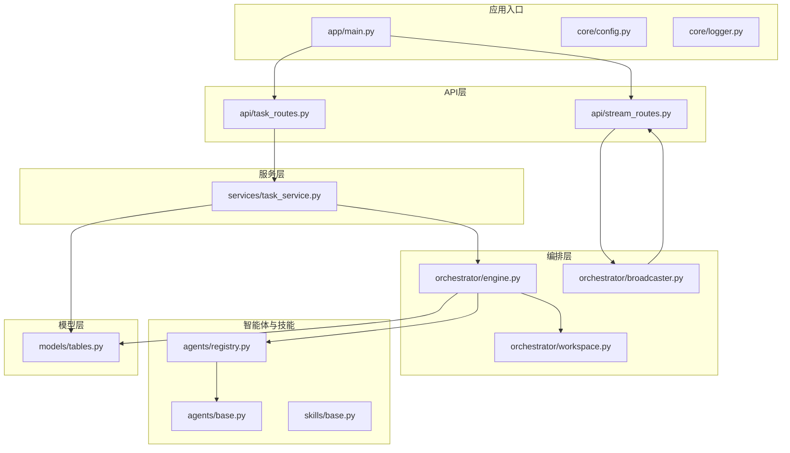
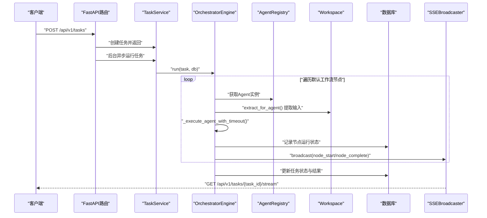
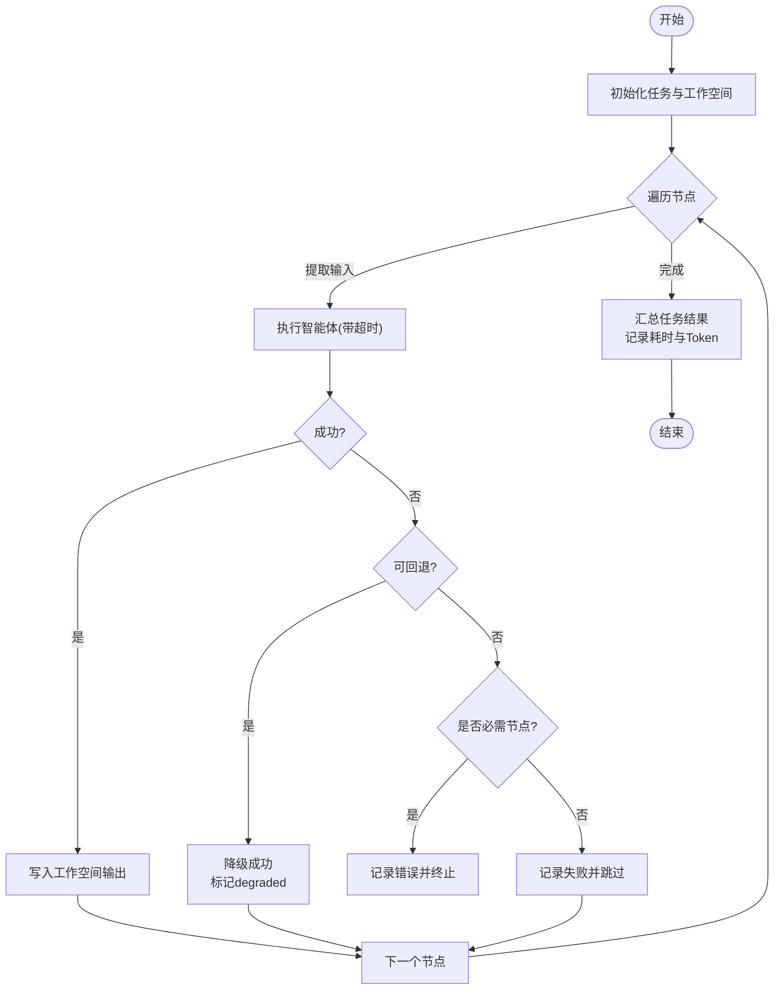
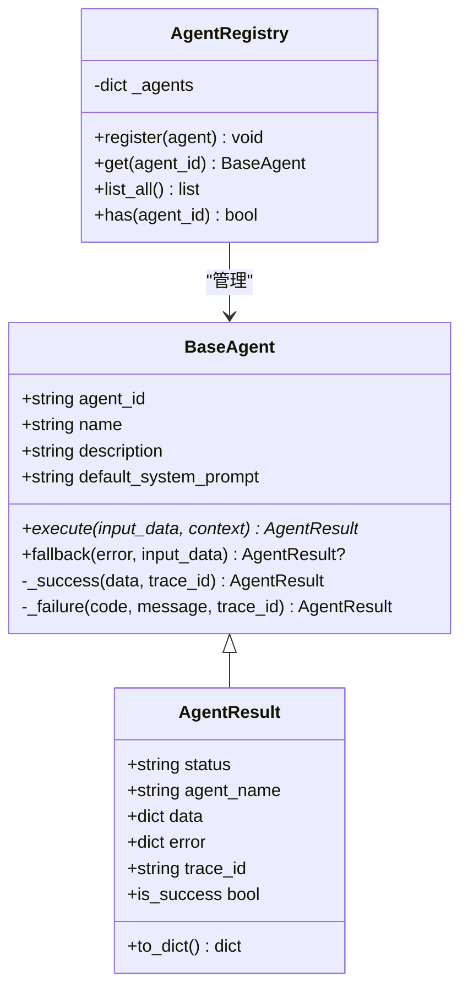
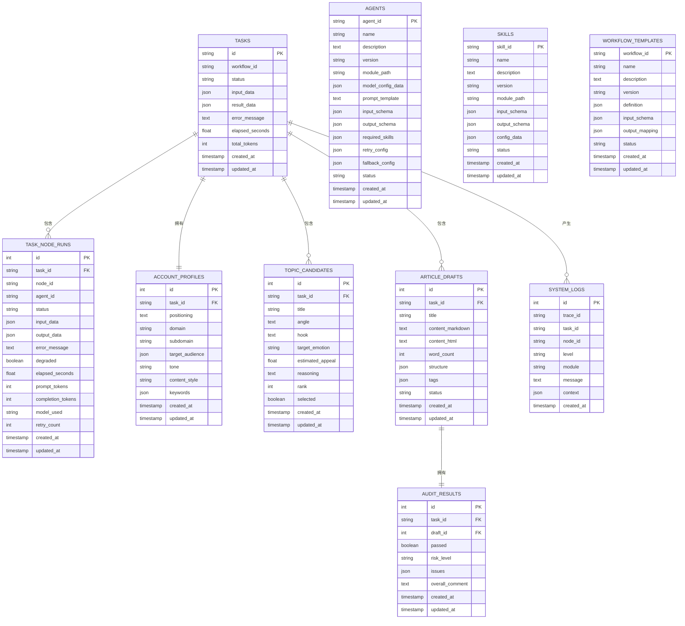
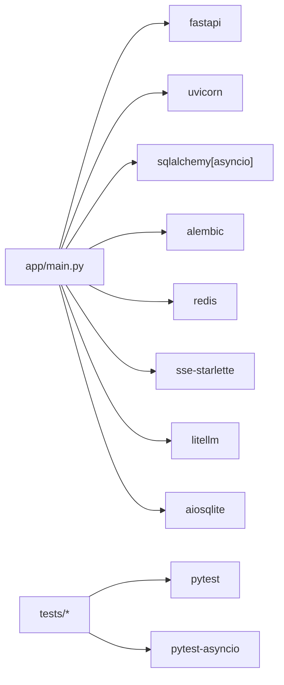

# 后端开发指南

<cite>
**本文引用的文件**
- [backend/app/main.py](file://backend/app/main.py)
- [backend/pyproject.toml](file://backend/pyproject.toml)
- [backend/app/core/config.py](file://backend/app/core/config.py)
- [backend/app/core/logger.py](file://backend/app/core/logger.py)
- [backend/app/orchestrator/engine.py](file://backend/app/orchestrator/engine.py)
- [backend/app/orchestrator/workspace.py](file://backend/app/orchestrator/workspace.py)
- [backend/app/orchestrator/broadcaster.py](file://backend/app/orchestrator/broadcaster.py)
- [backend/app/agents/base.py](file://backend/app/agents/base.py)
- [backend/app/skills/base.py](file://backend/app/skills/base.py)
- [backend/app/models/tables.py](file://backend/app/models/tables.py)
- [backend/app/api/task_routes.py](file://backend/app/api/task_routes.py)
- [backend/app/api/stream_routes.py](file://backend/app/api/stream_routes.py)
- [backend/app/services/task_service.py](file://backend/app/services/task_service.py)
- [backend/app/agents/registry.py](file://backend/app/agents/registry.py)
</cite>

## 目录
1. [简介](#简介)
2. [项目结构](#项目结构)
3. [核心组件](#核心组件)
4. [架构总览](#架构总览)
5. [详细组件分析](#详细组件分析)
6. [依赖分析](#依赖分析)
7. [性能考虑](#性能考虑)
8. [故障排查指南](#故障排查指南)
9. [结论](#结论)
10. [附录](#附录)

## 简介
本指南面向HotClaw后端开发，围绕FastAPI应用、Python异步编程、多智能体系统与工作流编排引擎展开，覆盖从入门到进阶的开发路径。内容包括：
- FastAPI应用入口、中间件与全局异常处理
- 工作流编排引擎的任务调度、状态管理与异常处理
- 智能体基类设计、具体智能体实现与注册机制
- 技能层设计（技能基类、调用协议）
- 数据库模型设计与API路由定义
- 开发最佳实践、性能优化与贡献规范

## 项目结构
后端采用分层组织：入口模块负责应用生命周期与中间件；API层处理请求响应；服务层承载业务逻辑；编排层负责任务执行与事件广播；模型层定义数据结构；核心层提供配置、日志与追踪能力。

图表来源
- [backend/app/main.py:1-142](file://backend/app/main.py#L1-L142)
- [backend/app/api/task_routes.py:1-163](file://backend/app/api/task_routes.py#L1-L163)
- [backend/app/api/stream_routes.py:1-43](file://backend/app/api/stream_routes.py#L1-L43)
- [backend/app/services/task_service.py:1-126](file://backend/app/services/task_service.py#L1-L126)
- [backend/app/orchestrator/engine.py:1-285](file://backend/app/orchestrator/engine.py#L1-L285)
- [backend/app/orchestrator/workspace.py:1-53](file://backend/app/orchestrator/workspace.py#L1-L53)
- [backend/app/orchestrator/broadcaster.py:1-94](file://backend/app/orchestrator/broadcaster.py#L1-L94)
- [backend/app/agents/base.py:1-99](file://backend/app/agents/base.py#L1-L99)
- [backend/app/agents/registry.py:1-40](file://backend/app/agents/registry.py#L1-L40)
- [backend/app/skills/base.py:1-37](file://backend/app/skills/base.py#L1-L37)
- [backend/app/models/tables.py:1-233](file://backend/app/models/tables.py#L1-L233)

章节来源
- [backend/app/main.py:1-142](file://backend/app/main.py#L1-L142)
- [backend/pyproject.toml:1-41](file://backend/pyproject.toml#L1-L41)

## 核心组件
- 应用入口与中间件
  - 使用FastAPI应用生命周期管理、CORS中间件、Trace ID中间件与全局异常处理器
  - 在启动时注册智能体实例并自动创建数据库表
- 配置与日志
  - 基于Pydantic Settings的环境变量配置，支持数据库、Redis、LLM、超时等参数
  - 结构化日志使用structlog，统一输出格式
- 编排引擎
  - 线性工作流节点顺序执行，支持超时控制、降级回退、事件广播与节点统计
- 工作空间
  - 任务级上下文容器，提供键值读写与按映射提取输入的能力
- SSE广播器
  - 为每个任务维护订阅队列与历史缓冲，支持断线重连与保活
- 智能体与技能
  - 统一的智能体基类与结果封装；技能基类提供工具型能力抽象
- 数据模型
  - 定义任务、节点运行、账号画像、话题候选、文章草稿、审核结果、代理与技能配置、工作流模板与系统日志等表

章节来源
- [backend/app/main.py:1-142](file://backend/app/main.py#L1-L142)
- [backend/app/core/config.py:1-51](file://backend/app/core/config.py#L1-L51)
- [backend/app/core/logger.py:1-36](file://backend/app/core/logger.py#L1-L36)
- [backend/app/orchestrator/engine.py:1-285](file://backend/app/orchestrator/engine.py#L1-L285)
- [backend/app/orchestrator/workspace.py:1-53](file://backend/app/orchestrator/workspace.py#L1-L53)
- [backend/app/orchestrator/broadcaster.py:1-94](file://backend/app/orchestrator/broadcaster.py#L1-L94)
- [backend/app/agents/base.py:1-99](file://backend/app/agents/base.py#L1-L99)
- [backend/app/skills/base.py:1-37](file://backend/app/skills/base.py#L1-L37)
- [backend/app/models/tables.py:1-233](file://backend/app/models/tables.py#L1-L233)

## 架构总览
下图展示从HTTP请求到编排执行再到前端SSE实时反馈的完整链路。

图表来源
- [backend/app/api/task_routes.py:19-51](file://backend/app/api/task_routes.py#L19-L51)
- [backend/app/services/task_service.py:39-64](file://backend/app/services/task_service.py#L39-L64)
- [backend/app/orchestrator/engine.py:92-234](file://backend/app/orchestrator/engine.py#L92-L234)
- [backend/app/orchestrator/broadcaster.py:57-78](file://backend/app/orchestrator/broadcaster.py#L57-L78)
- [backend/app/agents/registry.py:23-28](file://backend/app/agents/registry.py#L23-L28)
- [backend/app/orchestrator/workspace.py:36-52](file://backend/app/orchestrator/workspace.py#L36-L52)

## 详细组件分析

### 应用入口与中间件
- 生命周期管理：在启动时初始化日志、注册智能体、自动建表；关闭时记录日志
- 中间件：CORS允许跨域；Trace ID中间件注入与响应头透传
- 全局异常处理：对自定义错误按类别映射HTTP状态码；未捕获异常统一返回内部错误

章节来源
- [backend/app/main.py:42-142](file://backend/app/main.py#L42-L142)

### 配置与日志
- 配置项：数据库URL、Redis、LLM基础地址/模型名、应用主机端口、调试级别、超时时间等
- 日志：结构化JSON输出，包含时间戳、堆栈信息、上下文变量

章节来源
- [backend/app/core/config.py:7-51](file://backend/app/core/config.py#L7-L51)
- [backend/app/core/logger.py:8-36](file://backend/app/core/logger.py#L8-L36)

### 工作流编排引擎
- 默认工作流节点：线性链式，包含账号解析、热点分析、选题策划、标题生成、正文生成、审核评估
- 执行流程：
  - 初始化工作空间与任务状态
  - 逐节点提取输入、解析有效系统提示、带超时执行智能体
  - 成功则写入工作空间，失败则尝试回退；必要节点失败直接中断
  - 记录节点耗时、Token用量，最终汇总任务完成状态与耗时
- 广播事件：节点开始/完成、任务完成、任务错误、流结束

图表来源
- [backend/app/orchestrator/engine.py:92-234](file://backend/app/orchestrator/engine.py#L92-L234)

章节来源
- [backend/app/orchestrator/engine.py:31-86](file://backend/app/orchestrator/engine.py#L31-L86)
- [backend/app/orchestrator/engine.py:137-196](file://backend/app/orchestrator/engine.py#L137-L196)
- [backend/app/orchestrator/engine.py:236-263](file://backend/app/orchestrator/engine.py#L236-L263)

### 工作空间
- 职责：隔离任务上下文，提供读写接口与按映射提取输入
- 输入映射：支持“input.xxx”引用原始输入与顶层键映射

章节来源
- [backend/app/orchestrator/workspace.py:12-53](file://backend/app/orchestrator/workspace.py#L12-L53)

### SSE广播器
- 订阅/取消订阅：为任务维护订阅队列
- 历史缓冲：支持晚到订阅者重放事件
- 流结束：发送哨兵消息并清理历史

章节来源
- [backend/app/orchestrator/broadcaster.py:11-94](file://backend/app/orchestrator/broadcaster.py#L11-L94)

### 智能体基类与注册机制
- 基类职责：标准化输入输出、系统提示解析、成功/失败结果封装、可选回退策略
- 注册机制：集中注册所有智能体实例，按agent_id检索

图表来源
- [backend/app/agents/base.py:49-99](file://backend/app/agents/base.py#L49-L99)
- [backend/app/agents/registry.py:10-40](file://backend/app/agents/registry.py#L10-L40)

章节来源
- [backend/app/agents/base.py:18-99](file://backend/app/agents/base.py#L18-L99)
- [backend/app/agents/registry.py:16-28](file://backend/app/agents/registry.py#L16-L28)

### 技能层设计
- 技能基类：统一的异步执行接口，输入/输出均为结构化字典
- 设计原则：工具型能力、稳定可复用、不参与编排

章节来源
- [backend/app/skills/base.py:16-37](file://backend/app/skills/base.py#L16-L37)

### 数据库模型设计
- 任务表：任务全生命周期、状态、输入/输出、耗时与Token统计
- 节点运行表：节点级执行记录、输入/输出、错误、耗时、Token、模型与重试次数
- 业务实体：账号画像、话题候选、文章草稿、审核结果
- 配置表：代理与技能配置、工作流模板、系统日志

图表来源
- [backend/app/models/tables.py:23-233](file://backend/app/models/tables.py#L23-L233)

章节来源
- [backend/app/models/tables.py:23-233](file://backend/app/models/tables.py#L23-L233)

### API路由定义
- 任务相关：创建任务、查询状态、查询详情、查询节点执行记录、分页列表
- 实时流：SSE事件流，支持保活与断线重连

章节来源
- [backend/app/api/task_routes.py:19-163](file://backend/app/api/task_routes.py#L19-L163)
- [backend/app/api/stream_routes.py:14-43](file://backend/app/api/stream_routes.py#L14-L43)

### 服务层与业务逻辑
- 任务服务：创建任务、后台运行编排、查询任务与节点、分页查询、错误处理与事件广播

章节来源
- [backend/app/services/task_service.py:20-126](file://backend/app/services/task_service.py#L20-L126)

## 依赖分析
- 运行时依赖：FastAPI、Uvicorn、SQLAlchemy异步、AsyncPG、Alembic、Pydantic/Settings、Redis、HTTPX、structlog、YAML、SSE-Starlette、NanoID、LiteLLM、Aiosqlite
- 开发依赖：pytest、pytest-asyncio、httpx

图表来源
- [backend/pyproject.toml:6-22](file://backend/pyproject.toml#L6-L22)
- [backend/pyproject.toml:25-29](file://backend/pyproject.toml#L25-L29)

章节来源
- [backend/pyproject.toml:1-41](file://backend/pyproject.toml#L1-L41)

## 性能考虑
- 异步I/O优先：数据库、外部LLM调用均采用异步驱动，避免阻塞
- 超时控制：智能体与技能分别设置独立超时，防止长时间阻塞
- 事件驱动：SSE广播器使用队列与历史缓冲，降低前端连接抖动带来的压力
- Token统计：节点级Prompt/Completion Token累加，便于成本与性能分析
- 数据库索引：系统日志表对trace_id、task_id、node_id建立索引，提升查询效率

## 故障排查指南
- 自定义异常映射：根据错误码前缀映射到不同HTTP状态码，便于前端识别
- 未捕获异常：统一记录并返回内部错误，开发模式下返回错误详情
- 节点失败：必要节点失败会中止任务并记录错误；非必要节点失败仅标记失败并继续
- 回退策略：智能体可实现回退逻辑，在失败时提供降级输出
- 日志与追踪：Trace ID贯穿请求与编排过程，结合结构化日志定位问题

章节来源
- [backend/app/main.py:87-129](file://backend/app/main.py#L87-L129)
- [backend/app/orchestrator/engine.py:154-196](file://backend/app/orchestrator/engine.py#L154-L196)
- [backend/app/agents/base.py:77-82](file://backend/app/agents/base.py#L77-L82)
- [backend/app/core/logger.py:8-36](file://backend/app/core/logger.py#L8-L36)

## 结论
HotClaw后端以FastAPI为核心，结合异步数据库与外部LLM能力，构建了可扩展的多智能体内容生产平台。通过明确的编排引擎、工作空间与SSE广播机制，实现了任务级可观测与可追踪。遵循本文档的组件设计与最佳实践，可快速扩展新的智能体与技能，并安全地接入生产环境。

## 附录
- 开发最佳实践
  - 使用异步编程范式，避免阻塞调用
  - 明确智能体职责边界，单一职责
  - 为关键节点配置回退策略，提升鲁棒性
  - 利用Trace ID与结构化日志进行问题定位
- 贡献规范
  - 新增智能体需继承基类并注册到注册表
  - 新增技能需实现基类execute方法
  - 新增API需保持仅处理请求/响应，业务逻辑放入服务层
  - 变更数据库需配套迁移脚本
- 性能优化建议
  - 合理设置超时阈值，避免长尾请求
  - 对高频查询建立索引，减少慢查询
  - 使用SSE广播器的历史缓冲，减少重复计算
  - 控制节点输出规模，避免过大JSON传输