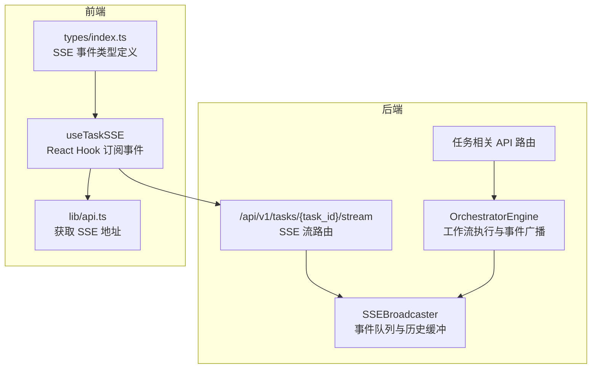
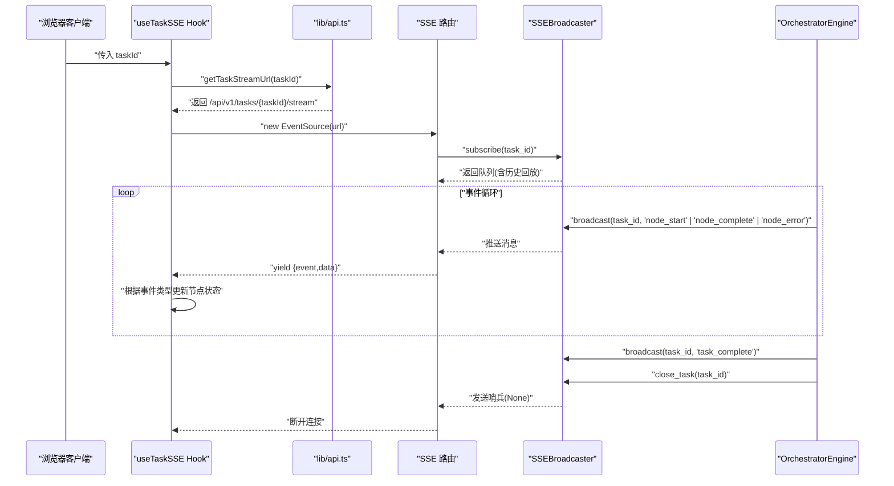
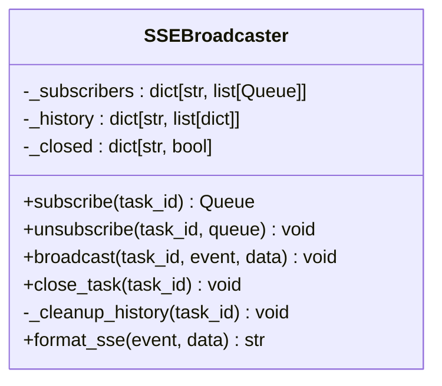
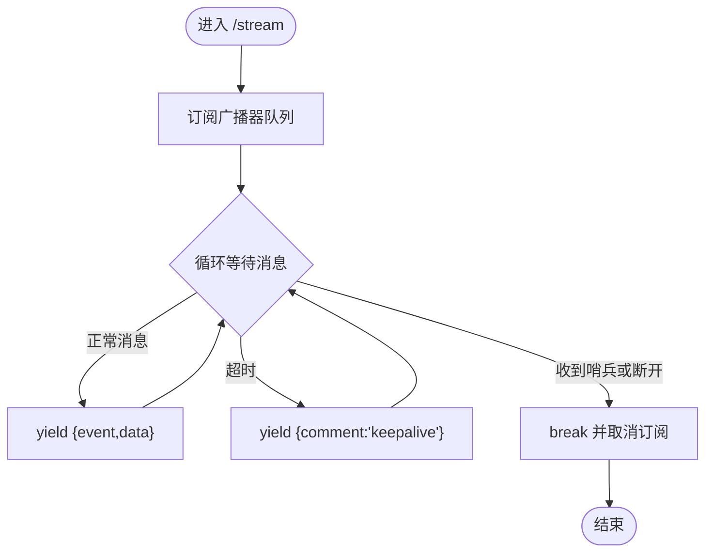
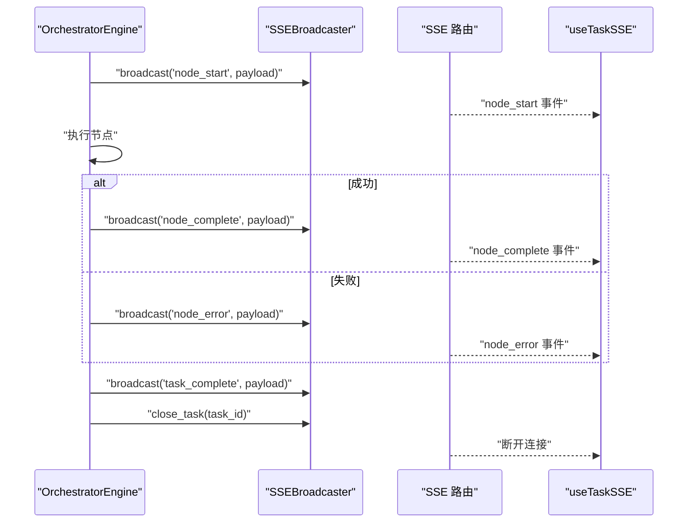
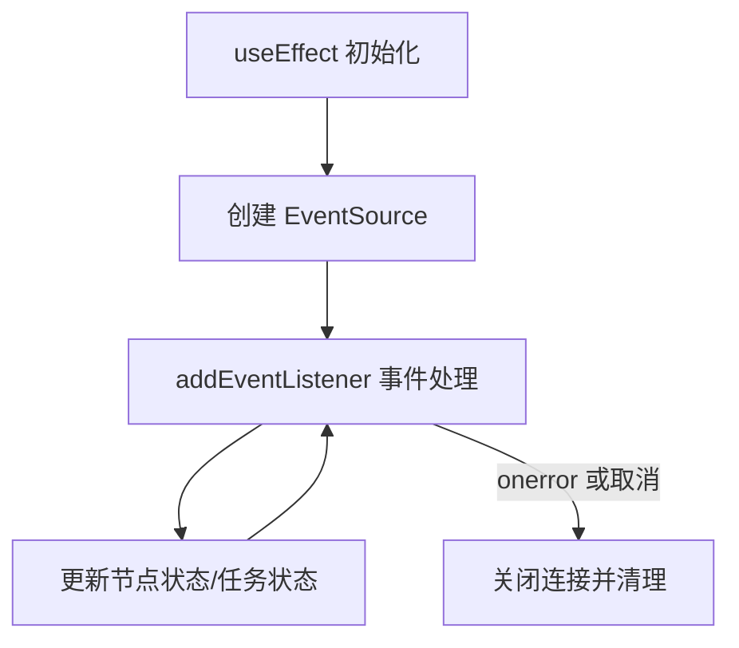
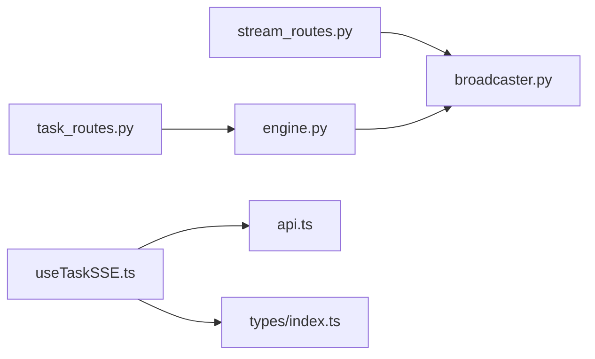

# 事件广播系统

<cite>
**本文引用的文件**
- [broadcaster.py](file://backend/app/orchestrator/broadcaster.py)
- [stream_routes.py](file://backend/app/api/stream_routes.py)
- [engine.py](file://backend/app/orchestrator/engine.py)
- [task_routes.py](file://backend/app/api/task_routes.py)
- [useTaskSSE.ts](file://frontend/hooks/useTaskSSE.ts)
- [api.ts](file://frontend/lib/api.ts)
- [index.ts](file://frontend/types/index.ts)
- [config.py](file://backend/app/core/config.py)
</cite>

## 目录
1. [简介](#简介)
2. [项目结构](#项目结构)
3. [核心组件](#核心组件)
4. [架构总览](#架构总览)
5. [详细组件分析](#详细组件分析)
6. [依赖关系分析](#依赖关系分析)
7. [性能考量](#性能考量)
8. [故障排查指南](#故障排查指南)
9. [结论](#结论)
10. [附录：事件类型与扩展指南](#附录事件类型与扩展指南)

## 简介
本文件为事件广播系统的深度技术文档，聚焦于后端 SSE 广播器与前端事件订阅的完整链路。内容涵盖：
- Broadcaster 类的事件传播机制（SSE 连接管理、消息队列、历史回放）
- 事件类型定义与数据格式（node_start、node_complete、node_error、task_complete 等）
- 广播器的连接生命周期管理（订阅、取消订阅、关闭流、历史清理）
- 心跳与断线处理（服务端 keepalive、客户端自动重连）
- 实时通信的性能优化、消息去重与可靠性保障
- 自定义事件类型的扩展方案与集成指引

## 项目结构
事件广播系统横跨后端 FastAPI 路由、SSE 广播器、工作流引擎与前端 React Hook，形成“事件产生 → 广播 → 订阅 → 渲染”的闭环。

**图表来源**
- [engine.py:92-234](file://backend/app/orchestrator/engine.py#L92-L234)
- [broadcaster.py:11-93](file://backend/app/orchestrator/broadcaster.py#L11-L93)
- [stream_routes.py:14-42](file://backend/app/api/stream_routes.py#L14-L42)
- [task_routes.py:19-51](file://backend/app/api/task_routes.py#L19-L51)
- [useTaskSSE.ts:28-123](file://frontend/hooks/useTaskSSE.ts#L28-L123)
- [api.ts:48-50](file://frontend/lib/api.ts#L48-L50)
- [index.ts:66-94](file://frontend/types/index.ts#L66-L94)

**章节来源**
- [engine.py:92-234](file://backend/app/orchestrator/engine.py#L92-L234)
- [broadcaster.py:11-93](file://backend/app/orchestrator/broadcaster.py#L11-L93)
- [stream_routes.py:14-42](file://backend/app/api/stream_routes.py#L14-L42)
- [task_routes.py:19-51](file://backend/app/api/task_routes.py#L19-L51)
- [useTaskSSE.ts:28-123](file://frontend/hooks/useTaskSSE.ts#L28-L123)
- [api.ts:48-50](file://frontend/lib/api.ts#L48-L50)
- [index.ts:66-94](file://frontend/types/index.ts#L66-L94)

## 核心组件
- SSE 广播器（SSEBroadcaster）：按 task_id 维护订阅者队列与历史消息，支持历史回放与流结束哨兵。
- SSE 流路由（/api/v1/tasks/{task_id}/stream）：基于 sse-starlette 的事件源响应，负责 keepalive 与断开检测。
- 工作流引擎（OrchestratorEngine）：在节点执行前后广播事件，并在任务完成后发送完成事件与关闭流。
- 前端 Hook（useTaskSSE）：建立 EventSource 连接，监听 node_start/node_complete/node_error/task_complete 等事件并更新 UI。
- 类型与工具：前端 types 定义事件数据结构；api.ts 提供 SSE 地址拼装。

**章节来源**
- [broadcaster.py:11-93](file://backend/app/orchestrator/broadcaster.py#L11-L93)
- [stream_routes.py:14-42](file://backend/app/api/stream_routes.py#L14-L42)
- [engine.py:92-234](file://backend/app/orchestrator/engine.py#L92-L234)
- [useTaskSSE.ts:28-123](file://frontend/hooks/useTaskSSE.ts#L28-L123)
- [index.ts:66-94](file://frontend/types/index.ts#L66-L94)
- [api.ts:48-50](file://frontend/lib/api.ts#L48-L50)

## 架构总览
事件从工作流引擎产生，经广播器分发到所有订阅者队列，SSE 路由将消息推送给已连接的客户端，前端 Hook 解析事件并更新状态。

**图表来源**
- [engine.py:124-232](file://backend/app/orchestrator/engine.py#L124-L232)
- [broadcaster.py:30-84](file://backend/app/orchestrator/broadcaster.py#L30-L84)
- [stream_routes.py:18-41](file://backend/app/api/stream_routes.py#L18-L41)
- [useTaskSSE.ts:62-120](file://frontend/hooks/useTaskSSE.ts#L62-L120)
- [api.ts:48-50](file://frontend/lib/api.ts#L48-L50)

## 详细组件分析

### SSE 广播器（SSEBroadcaster）
- 数据结构
  - 订阅者映射：按 task_id 维护多个 asyncio.Queue，每个队列代表一个客户端连接。
  - 历史缓冲：按 task_id 缓存历史事件，用于新订阅者的回放。
  - 关闭标记：task_id → 是否已关闭，用于立即发送结束哨兵。
- 关键方法
  - subscribe：创建队列，回放历史，加入订阅列表；若已关闭则立即放入哨兵。
  - unsubscribe：移除指定队列，空集合则删除 task_id 键。
  - broadcast：写入历史缓冲，向所有订阅者队列投递消息。
  - close_task：标记关闭，向所有订阅者发送哨兵，结束后延时清理历史。
  - format_sse：将事件与数据格式化为 SSE 文本行。
- 复杂度与内存
  - 订阅/取消订阅：O(k)，k 为该 task_id 下订阅队列数量。
  - 广播：O(k)，对每个订阅队列进行一次异步写入。
  - 历史缓冲：按 task_id 存储，关闭后延时清理，避免长期占用内存。

**图表来源**
- [broadcaster.py:22-89](file://backend/app/orchestrator/broadcaster.py#L22-L89)

**章节来源**
- [broadcaster.py:11-93](file://backend/app/orchestrator/broadcaster.py#L11-L93)

### SSE 流路由（/api/v1/tasks/{task_id}/stream）
- 功能要点
  - 使用 sse-starlette 的 EventSourceResponse 返回事件流。
  - 订阅广播器队列，超时发送 keepalive 注释，收到哨兵或断开即终止。
  - 在 finally 中主动取消订阅，确保资源回收。
- 心跳与断线
  - 服务端：30 秒超时未取到消息则发送注释行，维持连接活跃。
  - 客户端：EventSource 默认具备断线重连能力，配合后端 keepalive 可靠性更高。

**图表来源**
- [stream_routes.py:18-41](file://backend/app/api/stream_routes.py#L18-L41)

**章节来源**
- [stream_routes.py:14-42](file://backend/app/api/stream_routes.py#L14-L42)

### 工作流引擎（OrchestratorEngine）
- 事件广播时机
  - 节点开始：广播 node_start，包含节点索引、总数、开始时间等。
  - 节点完成：广播 node_complete，包含耗时、降级标志、摘要等。
  - 节点错误：广播 node_error，包含错误信息；必要节点失败时中断流程。
  - 任务完成：广播 task_complete，包含任务耗时；随后关闭任务流。
- 节点执行与持久化
  - 记录节点开始时间、计算耗时、累计 token 数量。
  - 支持降级：当 agent 执行失败且提供 fallback，广播完成但标记 degraded。

**图表来源**
- [engine.py:124-232](file://backend/app/orchestrator/engine.py#L124-L232)
- [broadcaster.py:57-84](file://backend/app/orchestrator/broadcaster.py#L57-L84)
- [stream_routes.py:18-41](file://backend/app/api/stream_routes.py#L18-L41)
- [useTaskSSE.ts:65-111](file://frontend/hooks/useTaskSSE.ts#L65-L111)

**章节来源**
- [engine.py:92-234](file://backend/app/orchestrator/engine.py#L92-L234)

### 前端订阅与渲染（useTaskSSE）
- 订阅流程
  - 根据 taskId 获取 SSE 地址，创建 EventSource。
  - 监听 node_start/node_complete/node_error/task_complete 等事件，更新节点状态与任务完成标志。
- 断线与清理
  - onerror 回调中关闭连接，避免悬挂。
  - useEffect 返回值中清理资源，防止内存泄漏。
- 事件数据
  - types/index.ts 定义了 SSENodeStart/SSENodeComplete/SSENodeError/SSETaskComplete 接口，确保类型安全。

**图表来源**
- [useTaskSSE.ts:58-120](file://frontend/hooks/useTaskSSE.ts#L58-L120)
- [index.ts:66-94](file://frontend/types/index.ts#L66-L94)
- [api.ts:48-50](file://frontend/lib/api.ts#L48-L50)

**章节来源**
- [useTaskSSE.ts:28-123](file://frontend/hooks/useTaskSSE.ts#L28-L123)
- [index.ts:66-94](file://frontend/types/index.ts#L66-L94)
- [api.ts:48-50](file://frontend/lib/api.ts#L48-L50)

## 依赖关系分析
- 后端耦合
  - SSE 路由依赖广播器实例；工作流引擎依赖广播器进行事件广播；任务路由触发后台执行。
- 前端耦合
  - useTaskSSE 依赖 api.ts 提供的 SSE 地址；依赖 types/index.ts 的事件类型定义。
- 外部依赖
  - sse-starlette 提供 EventSourceResponse；FastAPI 路由装饰器；Python asyncio 队列。

**图表来源**
- [stream_routes.py:9](file://backend/app/api/stream_routes.py#L9-L9)
- [broadcaster.py:92](file://backend/app/orchestrator/broadcaster.py#L92-L92)
- [engine.py:26](file://backend/app/orchestrator/engine.py#L26-L26)
- [task_routes.py:13](file://backend/app/api/task_routes.py#L13-L13)
- [useTaskSSE.ts:4](file://frontend/hooks/useTaskSSE.ts#L4-L4)
- [api.ts:12](file://frontend/lib/api.ts#L12-L12)
- [index.ts:1](file://frontend/types/index.ts#L1-L1)

**章节来源**
- [stream_routes.py:9-9](file://backend/app/api/stream_routes.py#L9-L9)
- [broadcaster.py:92-92](file://backend/app/orchestrator/broadcaster.py#L92-L92)
- [engine.py:26-26](file://backend/app/orchestrator/engine.py#L26-L26)
- [task_routes.py:13-13](file://backend/app/api/task_routes.py#L13-L13)
- [useTaskSSE.ts:4-4](file://frontend/hooks/useTaskSSE.ts#L4-L4)
- [api.ts:12-12](file://frontend/lib/api.ts#L12-L12)
- [index.ts:1-1](file://frontend/types/index.ts#L1-L1)

## 性能考量
- 队列与并发
  - 每个订阅者使用 asyncio.Queue，广播为 O(k) 写入，k 为当前订阅数；建议控制单任务并发订阅者上限。
- 历史缓冲与内存
  - 历史缓冲按 task_id 存储，关闭任务后延时清理，避免内存泄漏；可根据业务调整清理周期。
- 心跳与保活
  - 服务端 30 秒超时发送 keepalive 注释，降低网络层误判断开的概率；客户端 EventSource 具备断线重连语义。
- 序列化与传输
  - 事件数据通过 JSON 序列化，注意字段大小与敏感信息过滤；可考虑压缩或分片策略（需权衡 CPU 开销）。
- 超时与降级
  - 代理执行带超时保护，超时或异常时广播错误事件；必要节点失败直接中断，非必要节点降级继续。

[本节为通用性能建议，不直接分析具体文件]

## 故障排查指南
- 常见问题
  - 客户端未收到事件：检查 SSE 路由是否正确订阅广播器；确认前端 EventSource 是否成功创建。
  - 事件重复或乱序：广播器按队列顺序投递，通常不会出现重复；如遇异常需检查队列容量与消费速度。
  - 任务完成后仍无断开：确认工作流引擎是否调用 close_task；检查广播器是否向订阅者发送哨兵。
  - 心跳无效导致频繁断开：适当提高 keepalive 频率或在网络层优化 TCP 参数。
- 日志与追踪
  - 后端日志包含订阅/广播统计信息，可用于定位问题；前端可在 onerror 中记录错误详情。
- 资源清理
  - 确保 finally/清理函数中调用取消订阅与关闭连接，避免悬挂队列与内存泄漏。

**章节来源**
- [stream_routes.py:18-41](file://backend/app/api/stream_routes.py#L18-L41)
- [broadcaster.py:47-84](file://backend/app/orchestrator/broadcaster.py#L47-L84)
- [useTaskSSE.ts:113-119](file://frontend/hooks/useTaskSSE.ts#L113-L119)

## 结论
事件广播系统以 SSE 为核心，结合广播器的历史回放与队列分发，实现了任务执行过程的实时可视化。后端通过工作流引擎在关键节点广播事件，前端 Hook 将事件映射为 UI 状态，整体具备良好的可靠性与扩展性。后续可在事件粒度、去重策略与传输优化方面进一步增强。

[本节为总结性内容，不直接分析具体文件]

## 附录：事件类型与扩展指南

### 事件类型与数据格式
- node_start
  - 事件名：node_start
  - 数据字段：node_id、agent_id、name、index、total、started_at
  - 用途：节点开始执行时广播，前端据此将对应节点置为运行态
- node_complete
  - 事件名：node_complete
  - 数据字段：node_id、agent_id、name、elapsed_seconds、degraded、output_summary
  - 用途：节点成功完成时广播，前端更新耗时、摘要与降级标记
- node_error
  - 事件名：node_error
  - 数据字段：node_id、error
  - 用途：节点执行失败时广播，前端将对应节点置为失败态
- task_complete
  - 事件名：task_complete
  - 数据字段：task_id、elapsed_seconds
  - 用途：任务全部节点完成后广播，前端标记任务完成并关闭连接
- task_error（服务端也会广播）
  - 事件名：task_error
  - 数据字段：task_id、error
  - 用途：任务执行过程中发生致命错误时广播，前端显示错误并关闭连接

**章节来源**
- [engine.py:124-232](file://backend/app/orchestrator/engine.py#L124-L232)
- [useTaskSSE.ts:65-111](file://frontend/hooks/useTaskSSE.ts#L65-L111)
- [index.ts:66-94](file://frontend/types/index.ts#L66-L94)

### 订阅与取消订阅实现细节
- 客户端标识
  - 通过 task_id 作为订阅键；每个 EventSource 对应一个 task_id。
- 消息路由
  - 广播器按 task_id 路由到对应队列；SSE 路由从队列取出消息并推送到客户端。
- 历史回放
  - 新订阅者会收到历史缓冲中的所有事件，解决“先启动任务再建立连接”的竞态问题。
- 断线与重连
  - 服务端 keepalive 与客户端 EventSource 的自动重连共同保障连接稳定性。

**章节来源**
- [broadcaster.py:30-45](file://backend/app/orchestrator/broadcaster.py#L30-L45)
- [stream_routes.py:18-41](file://backend/app/api/stream_routes.py#L18-L41)
- [useTaskSSE.ts:62-120](file://frontend/hooks/useTaskSSE.ts#L62-L120)

### 实时通信的可靠性与优化
- 可靠性
  - 历史缓冲：新订阅者可接收过去事件，避免漏看。
  - 哨兵机制：任务结束时发送 None，客户端明确断开。
  - keepalive：30 秒超时发送注释，维持连接活跃。
- 性能优化
  - 控制订阅者数量，避免过多队列写入。
  - 合理设置清理周期，平衡内存与历史可用性。
  - 对输出摘要进行裁剪，减少传输体积。
- 去重策略
  - 当前实现未内置去重；如需去重可在客户端按事件名+数据哈希去重，或在广播器侧维护最近 N 条消息的去重表。

**章节来源**
- [broadcaster.py:57-84](file://backend/app/orchestrator/broadcaster.py#L57-L84)
- [stream_routes.py:24-28](file://backend/app/api/stream_routes.py#L24-L28)
- [engine.py:273-280](file://backend/app/orchestrator/engine.py#L273-L280)

### 自定义事件类型的扩展方案
- 后端扩展
  - 在工作流引擎合适的位置调用广播器的 broadcast 方法，传入新的事件名与数据字典。
  - 注意保持数据结构简洁、可序列化，避免大对象传输。
- 前端扩展
  - 在 types/index.ts 中新增对应的接口定义，确保类型安全。
  - 在 useTaskSSE.ts 中添加事件监听回调，更新状态与 UI。
- 集成指导
  - 事件命名规范：采用小驼峰，语义清晰，避免与现有事件冲突。
  - 数据最小化：仅传递渲染所需字段，必要时提供摘要。
  - 错误处理：为新事件提供默认值与容错逻辑，避免渲染崩溃。
  - 文档同步：更新前端与后端的事件契约文档，确保双方一致。

**章节来源**
- [engine.py:124-232](file://backend/app/orchestrator/engine.py#L124-L232)
- [index.ts:66-94](file://frontend/types/index.ts#L66-L94)
- [useTaskSSE.ts:65-111](file://frontend/hooks/useTaskSSE.ts#L65-L111)