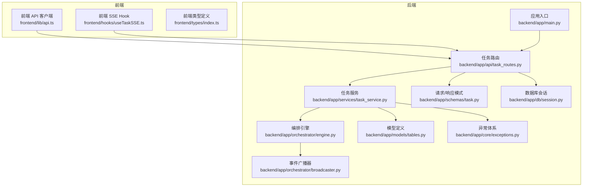
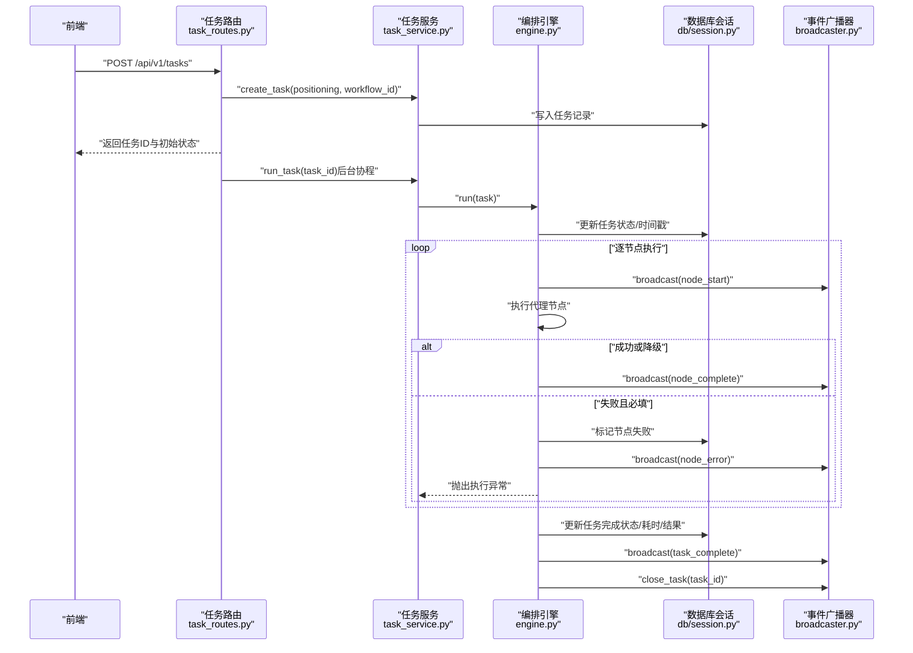
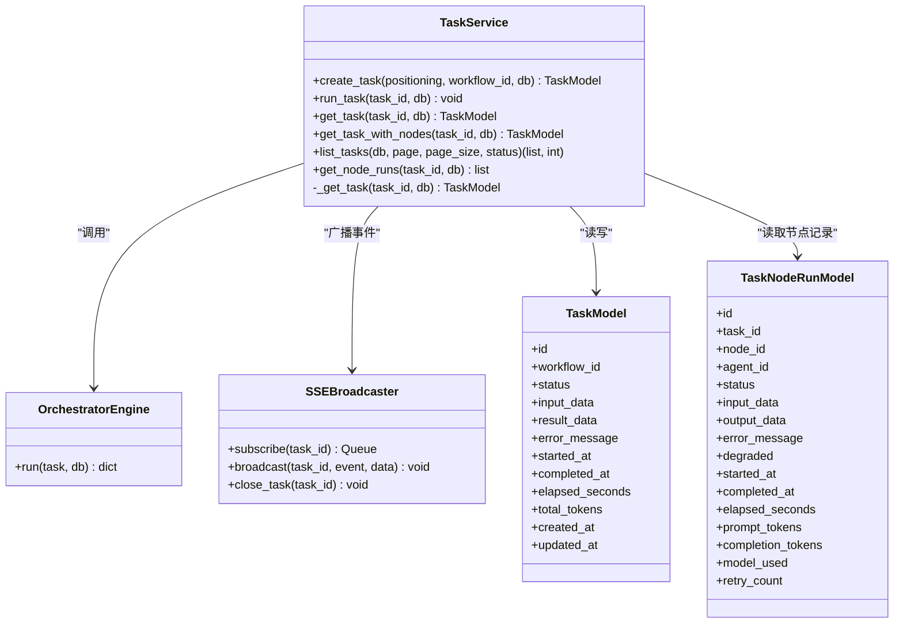
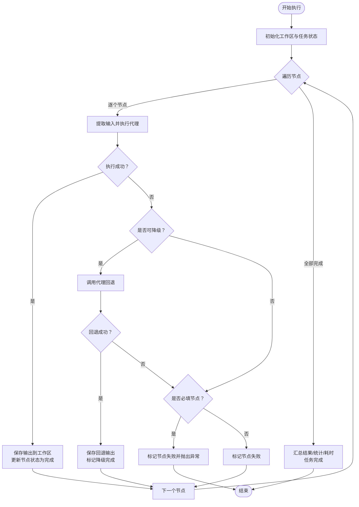
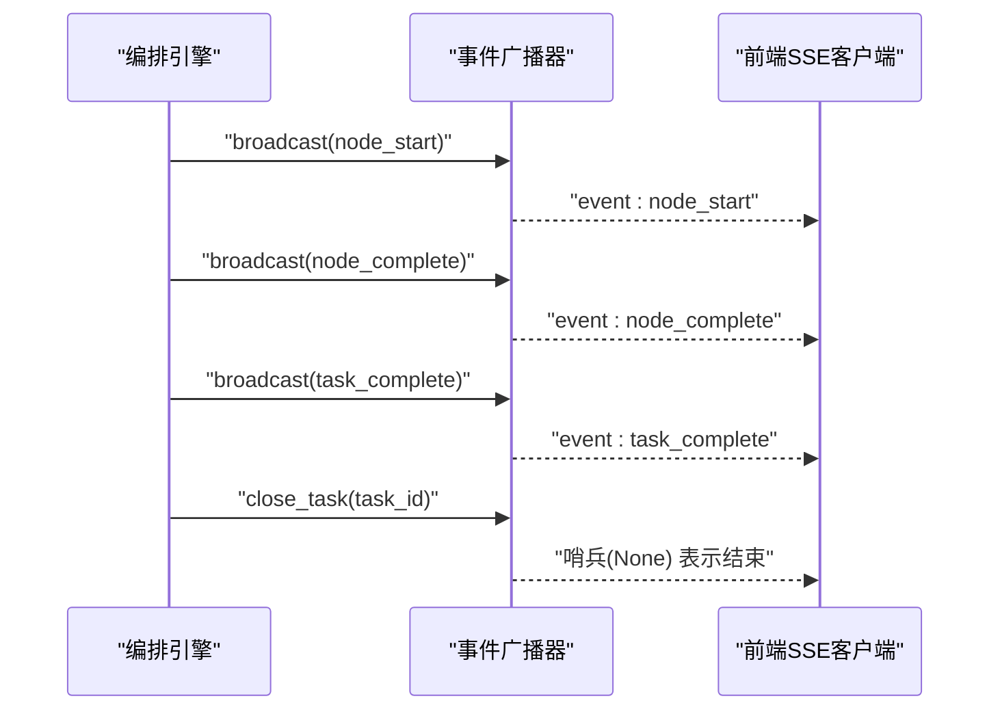
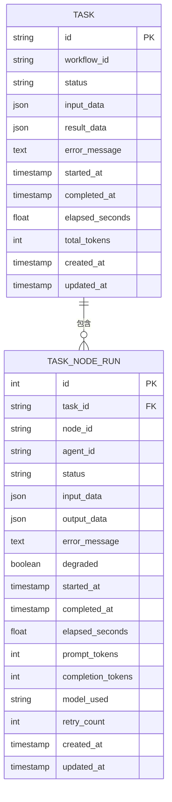
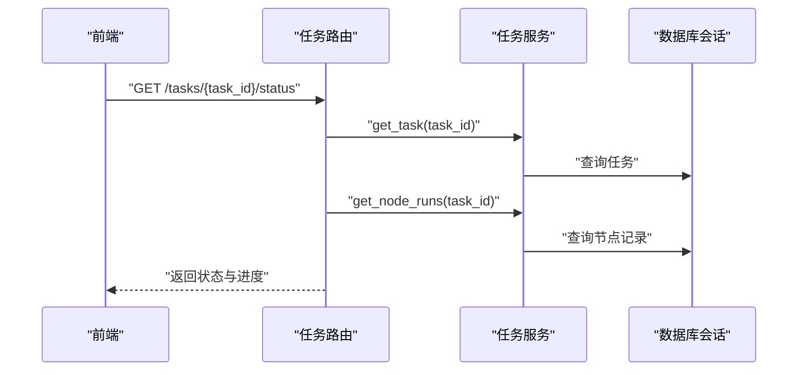
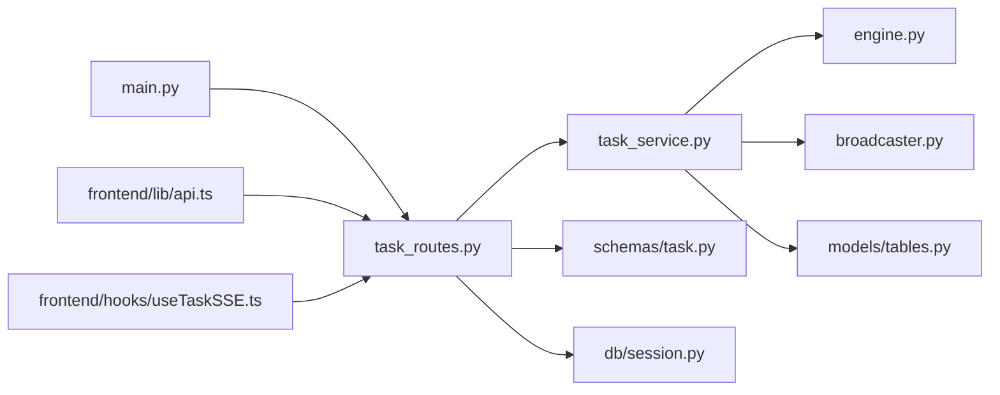

# 任务服务层

<cite>
**本文引用的文件**
- [backend/app/services/task_service.py](file://backend/app/services/task_service.py)
- [backend/app/api/task_routes.py](file://backend/app/api/task_routes.py)
- [backend/app/models/tables.py](file://backend/app/models/tables.py)
- [backend/app/schemas/task.py](file://backend/app/schemas/task.py)
- [backend/app/orchestrator/engine.py](file://backend/app/orchestrator/engine.py)
- [backend/app/orchestrator/broadcaster.py](file://backend/app/orchestrator/broadcaster.py)
- [backend/app/core/exceptions.py](file://backend/app/core/exceptions.py)
- [backend/app/db/session.py](file://backend/app/db/session.py)
- [backend/app/main.py](file://backend/app/main.py)
- [frontend/lib/api.ts](file://frontend/lib/api.ts)
- [frontend/hooks/useTaskSSE.ts](file://frontend/hooks/useTaskSSE.ts)
- [frontend/types/index.ts](file://frontend/types/index.ts)
- [backend/tests/test_task_api.py](file://backend/tests/test_task_api.py)
</cite>

## 目录
1. [简介](#简介)
2. [项目结构](#项目结构)
3. [核心组件](#核心组件)
4. [架构总览](#架构总览)
5. [详细组件分析](#详细组件分析)
6. [依赖分析](#依赖分析)
7. [性能考虑](#性能考虑)
8. [故障排查指南](#故障排查指南)
9. [结论](#结论)
10. [附录](#附录)

## 简介
本文件为任务服务层的综合技术文档，聚焦于任务生命周期管理、状态流转、结果收集、与工作流编排的集成、查询与检索、事务与并发控制以及可扩展性设计。文档以代码为依据，结合架构图与流程图，帮助开发者快速理解并扩展任务服务能力。

## 项目结构
后端采用 FastAPI + SQLAlchemy Async 的异步架构，任务服务位于 backend/app/services，API 路由在 backend/app/api，模型定义在 backend/app/models，编排引擎与事件广播在 backend/app/orchestrator，数据库会话管理在 backend/app/db，异常体系在 backend/app/core。

图表来源
- [backend/app/main.py:1-142](file://backend/app/main.py#L1-L142)
- [backend/app/api/task_routes.py:1-163](file://backend/app/api/task_routes.py#L1-L163)
- [backend/app/services/task_service.py:1-126](file://backend/app/services/task_service.py#L1-L126)
- [backend/app/orchestrator/engine.py:1-285](file://backend/app/orchestrator/engine.py#L1-L285)
- [backend/app/orchestrator/broadcaster.py:1-94](file://backend/app/orchestrator/broadcaster.py#L1-L94)
- [backend/app/models/tables.py:1-233](file://backend/app/models/tables.py#L1-L233)
- [backend/app/schemas/task.py:1-83](file://backend/app/schemas/task.py#L1-L83)
- [backend/app/core/exceptions.py:1-125](file://backend/app/core/exceptions.py#L1-L125)
- [backend/app/db/session.py:1-33](file://backend/app/db/session.py#L1-L33)
- [frontend/lib/api.ts:1-110](file://frontend/lib/api.ts#L1-L110)
- [frontend/hooks/useTaskSSE.ts:1-124](file://frontend/hooks/useTaskSSE.ts#L1-L124)
- [frontend/types/index.ts:1-119](file://frontend/types/index.ts#L1-L119)

章节来源
- [backend/app/main.py:1-142](file://backend/app/main.py#L1-L142)
- [backend/app/api/task_routes.py:1-163](file://backend/app/api/task_routes.py#L1-L163)
- [backend/app/services/task_service.py:1-126](file://backend/app/services/task_service.py#L1-L126)
- [backend/app/models/tables.py:1-233](file://backend/app/models/tables.py#L1-L233)

## 核心组件
- 任务服务：封装任务创建、运行、查询、列表、节点执行记录查询等业务逻辑，负责状态转换与时间戳维护。
- 编排引擎：按固定顺序调度多个代理节点，管理工作区、令牌统计、错误处理与降级。
- 事件广播器：基于 SSE 的事件推送，支持历史事件重放与任务结束信号。
- 数据模型：定义任务、节点执行记录、账户画像、话题候选、文章草稿、审计结果等表结构。
- API 路由：对外暴露任务创建、状态查询、详情查询、节点明细、任务列表等接口。
- 异常体系：统一错误码分类，便于前端与网关层映射到标准 HTTP 状态。
- 数据库会话：异步会话工厂与依赖注入，自动提交/回滚与连接池配置。

章节来源
- [backend/app/services/task_service.py:20-126](file://backend/app/services/task_service.py#L20-L126)
- [backend/app/orchestrator/engine.py:89-285](file://backend/app/orchestrator/engine.py#L89-L285)
- [backend/app/orchestrator/broadcaster.py:11-94](file://backend/app/orchestrator/broadcaster.py#L11-L94)
- [backend/app/models/tables.py:23-233](file://backend/app/models/tables.py#L23-L233)
- [backend/app/api/task_routes.py:19-163](file://backend/app/api/task_routes.py#L19-L163)
- [backend/app/core/exceptions.py:4-125](file://backend/app/core/exceptions.py#L4-L125)
- [backend/app/db/session.py:22-33](file://backend/app/db/session.py#L22-L33)

## 架构总览
任务服务通过 API 路由接收请求，调用任务服务进行业务处理；任务服务启动编排引擎执行工作流，并通过事件广播器向前端推送实时状态；数据库会话贯穿整个过程，确保事务一致性。

图表来源
- [backend/app/api/task_routes.py:19-51](file://backend/app/api/task_routes.py#L19-L51)
- [backend/app/services/task_service.py:22-64](file://backend/app/services/task_service.py#L22-L64)
- [backend/app/orchestrator/engine.py:92-234](file://backend/app/orchestrator/engine.py#L92-L234)
- [backend/app/orchestrator/broadcaster.py:57-84](file://backend/app/orchestrator/broadcaster.py#L57-L84)
- [backend/app/db/session.py:22-33](file://backend/app/db/session.py#L22-L33)

## 详细组件分析

### 任务服务（TaskService）
职责与能力
- 创建任务：生成任务ID、初始化状态为“待处理”，持久化输入参数。
- 运行任务：串行执行编排引擎，捕获异常并回写失败状态、错误信息与耗时。
- 查询任务：按ID查询任务基础信息。
- 查询任务与节点：加载任务并预加载节点执行记录。
- 列表查询：支持分页、按状态过滤、总数统计。
- 节点执行记录：按任务ID查询所有节点执行记录。
- 内部工具：通用任务查询方法，避免重复逻辑。

图表来源
- [backend/app/services/task_service.py:20-126](file://backend/app/services/task_service.py#L20-L126)
- [backend/app/orchestrator/engine.py:89-285](file://backend/app/orchestrator/engine.py#L89-L285)
- [backend/app/orchestrator/broadcaster.py:11-94](file://backend/app/orchestrator/broadcaster.py#L11-L94)
- [backend/app/models/tables.py:23-74](file://backend/app/models/tables.py#L23-L74)

章节来源
- [backend/app/services/task_service.py:20-126](file://backend/app/services/task_service.py#L20-L126)

### 编排引擎（OrchestratorEngine）
职责与能力
- 工作流执行：按固定节点顺序串行执行，构建工作区，提取输入，调用代理执行。
- 错误处理：超时、执行失败、异常分类处理；必要节点失败时中断并上报。
- 降级策略：非必填节点失败时尝试代理回退，标记降级。
- 统计与日志：累计提示与补全令牌，记录节点耗时，输出简要摘要。
- 事件广播：节点开始/完成/失败、任务完成/失败事件推送。

图表来源
- [backend/app/orchestrator/engine.py:92-234](file://backend/app/orchestrator/engine.py#L92-L234)

章节来源
- [backend/app/orchestrator/engine.py:89-285](file://backend/app/orchestrator/engine.py#L89-L285)

### 事件广播器（SSEBroadcaster）
职责与能力
- 订阅管理：为每个任务维护订阅队列，支持历史事件重放。
- 广播：向所有订阅者推送事件消息，缓冲历史以便晚到订阅者。
- 结束信号：任务完成后发送结束哨兵，清理历史缓存。

图表来源
- [backend/app/orchestrator/broadcaster.py:57-84](file://backend/app/orchestrator/broadcaster.py#L57-L84)
- [backend/app/orchestrator/engine.py:124-232](file://backend/app/orchestrator/engine.py#L124-L232)

章节来源
- [backend/app/orchestrator/broadcaster.py:11-94](file://backend/app/orchestrator/broadcaster.py#L11-L94)

### 数据模型（TaskModel / TaskNodeRunModel）
字段与约束
- 任务表：主键ID、工作流ID、状态、输入/结果JSON、错误信息、起止时间、耗时、总令牌、创建/更新时间。
- 节点执行表：外键关联任务、节点ID/代理ID、状态、输入/输出JSON、错误信息、降级标志、起止时间、耗时、令牌统计、模型名、重试次数、创建/更新时间。

图表来源
- [backend/app/models/tables.py:23-74](file://backend/app/models/tables.py#L23-L74)

章节来源
- [backend/app/models/tables.py:23-233](file://backend/app/models/tables.py#L23-L233)

### API 路由与查询检索
- 任务创建：接收定位描述与工作流ID，立即返回任务ID与初始状态，后台协程运行编排。
- 状态查询：返回任务状态、当前节点、进度统计、起止时间与耗时。
- 详情查询：返回输入、结果、错误、时间戳与令牌统计。
- 节点明细：返回每个节点的输入/输出、耗时、令牌、模型、降级与错误。
- 任务列表：支持分页与状态过滤，返回摘要与总数。

图表来源
- [backend/app/api/task_routes.py:54-87](file://backend/app/api/task_routes.py#L54-L87)
- [backend/app/services/task_service.py:65-114](file://backend/app/services/task_service.py#L65-L114)

章节来源
- [backend/app/api/task_routes.py:19-163](file://backend/app/api/task_routes.py#L19-L163)
- [backend/app/services/task_service.py:80-102](file://backend/app/services/task_service.py#L80-L102)

### 前端集成与实时事件
- API 客户端：封装请求、统一错误处理，提供创建任务、查询详情/节点、分页列表与事件流地址。
- SSE Hook：基于 EventSource 订阅任务事件，维护节点状态机，支持重置与错误处理。
- 类型定义：前后端共享的状态枚举、响应结构体，确保契约一致。

章节来源
- [frontend/lib/api.ts:1-110](file://frontend/lib/api.ts#L1-L110)
- [frontend/hooks/useTaskSSE.ts:1-124](file://frontend/hooks/useTaskSSE.ts#L1-L124)
- [frontend/types/index.ts:1-119](file://frontend/types/index.ts#L1-L119)

## 依赖分析
- 低耦合：API 路由仅负责请求/响应，业务逻辑集中在任务服务；编排引擎与广播器独立于路由。
- 明确边界：任务服务依赖模型与异常，编排引擎依赖代理注册表与工作区；广播器仅负责事件分发。
- 外部依赖：SQLAlchemy Async、FastAPI、EventSource（前端）。

图表来源
- [backend/app/api/task_routes.py:1-163](file://backend/app/api/task_routes.py#L1-L163)
- [backend/app/services/task_service.py:1-126](file://backend/app/services/task_service.py#L1-L126)
- [backend/app/orchestrator/engine.py:1-285](file://backend/app/orchestrator/engine.py#L1-L285)
- [backend/app/orchestrator/broadcaster.py:1-94](file://backend/app/orchestrator/broadcaster.py#L1-L94)
- [backend/app/models/tables.py:1-233](file://backend/app/models/tables.py#L1-L233)
- [backend/app/schemas/task.py:1-83](file://backend/app/schemas/task.py#L1-L83)
- [backend/app/db/session.py:1-33](file://backend/app/db/session.py#L1-L33)
- [backend/app/main.py:1-142](file://backend/app/main.py#L1-L142)
- [frontend/lib/api.ts:1-110](file://frontend/lib/api.ts#L1-L110)
- [frontend/hooks/useTaskSSE.ts:1-124](file://frontend/hooks/useTaskSSE.ts#L1-L124)

## 性能考虑
- 异步执行：API 创建任务后立即返回，后台协程运行编排，降低请求延迟。
- 分页查询：列表接口支持分页与过滤，避免一次性加载大量数据。
- 事件重放：SSE 广播器缓存历史事件，减少前端竞态与丢失事件风险。
- 令牌统计：节点级令牌累加，便于成本与性能监控。
- 会话管理：异步会话工厂与自动提交/回滚，减少长事务持有时间。

## 故障排查指南
常见问题与定位
- 任务不存在：查询任务或节点时抛出“任务未找到”异常，检查任务ID与数据库状态。
- 任务已在运行：重复触发运行会抛出“任务已在运行”异常，需在业务侧避免并发运行。
- 代理超时/执行失败：编排引擎捕获并广播节点错误，必要节点失败会导致任务失败。
- 数据库异常：全局异常处理器将 HotClawError 映射为标准 HTTP 状态码，便于前端统一处理。

章节来源
- [backend/app/core/exceptions.py:24-53](file://backend/app/core/exceptions.py#L24-L53)
- [backend/app/api/task_routes.py:54-87](file://backend/app/api/task_routes.py#L54-L87)
- [backend/app/services/task_service.py:39-64](file://backend/app/services/task_service.py#L39-L64)
- [backend/app/orchestrator/engine.py:176-197](file://backend/app/orchestrator/engine.py#L176-L197)
- [backend/app/main.py:87-129](file://backend/app/main.py#L87-L129)

## 结论
任务服务层通过清晰的分层与职责划分，实现了从任务创建、编排执行、状态广播到查询检索的完整闭环。其异步设计与事件驱动机制提升了用户体验，而完善的异常与事务管理保障了系统稳定性。后续可在工作流模板化、节点并行化、指标埋点等方面进一步增强。

## 附录

### 事务管理与并发控制
- 事务边界：每个 API 请求使用独立异步会话，成功提交，异常回滚。
- 并发控制：任务运行前检查状态，避免重复运行；后台协程独立会话执行，避免阻塞主线程。
- 一致性保证：编排引擎在节点执行前后刷新/提交，确保状态与时间戳一致。

章节来源
- [backend/app/db/session.py:22-33](file://backend/app/db/session.py#L22-L33)
- [backend/app/services/task_service.py:39-64](file://backend/app/services/task_service.py#L39-L64)
- [backend/app/orchestrator/engine.py:102-226](file://backend/app/orchestrator/engine.py#L102-L226)

### 扩展接口与自定义业务逻辑
- 新增任务状态：在模型与服务中扩展状态枚举，补充状态转换规则与校验。
- 自定义编排：在编排引擎中新增节点定义或替换默认工作流，注意事件广播与统计逻辑。
- 自定义代理：注册新代理至代理注册表，确保输入/输出模式与工作区映射正确。
- 自定义异常：遵循异常体系分类，便于统一映射与前端处理。
- 前端集成：根据类型定义扩展前端状态机与事件处理逻辑。

章节来源
- [backend/app/models/tables.py:23-74](file://backend/app/models/tables.py#L23-L74)
- [backend/app/orchestrator/engine.py:32-86](file://backend/app/orchestrator/engine.py#L32-L86)
- [backend/app/core/exceptions.py:4-125](file://backend/app/core/exceptions.py#L4-L125)
- [frontend/types/index.ts:1-119](file://frontend/types/index.ts#L1-L119)

### 测试参考
- 任务创建：验证成功创建与参数校验。
- 任务查询：验证未找到与空列表场景。
- 健康检查：验证服务可用性。

章节来源
- [backend/tests/test_task_api.py:1-57](file://backend/tests/test_task_api.py#L1-L57)