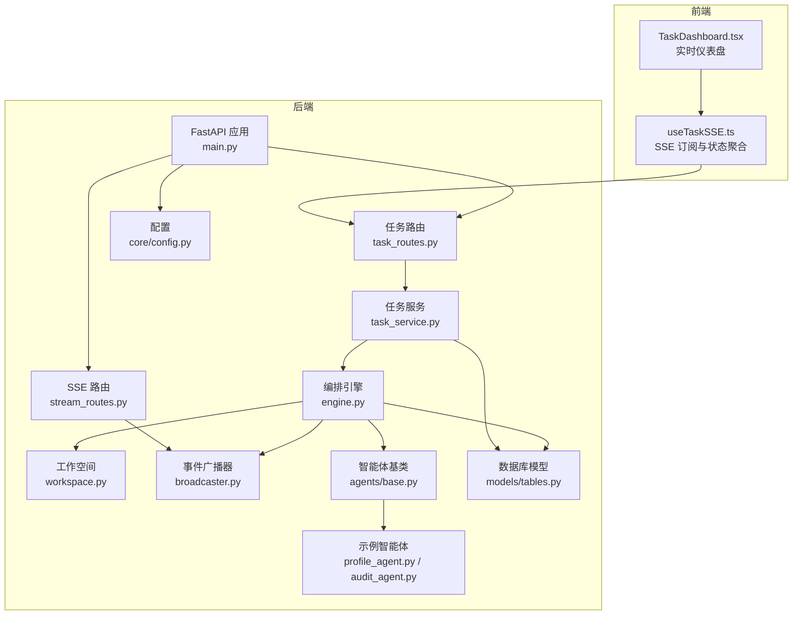
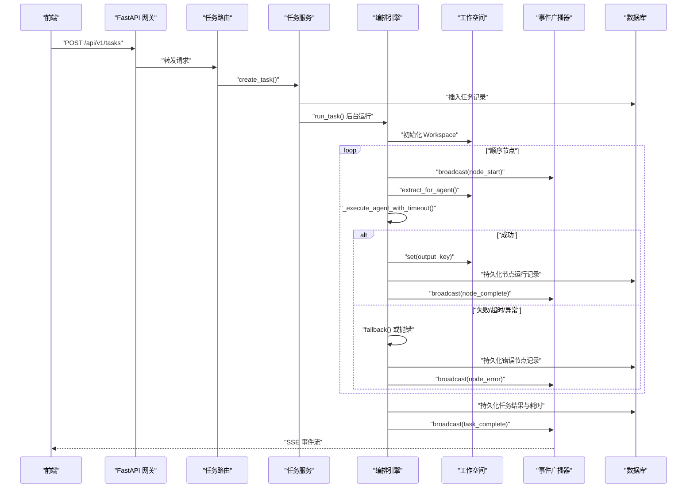
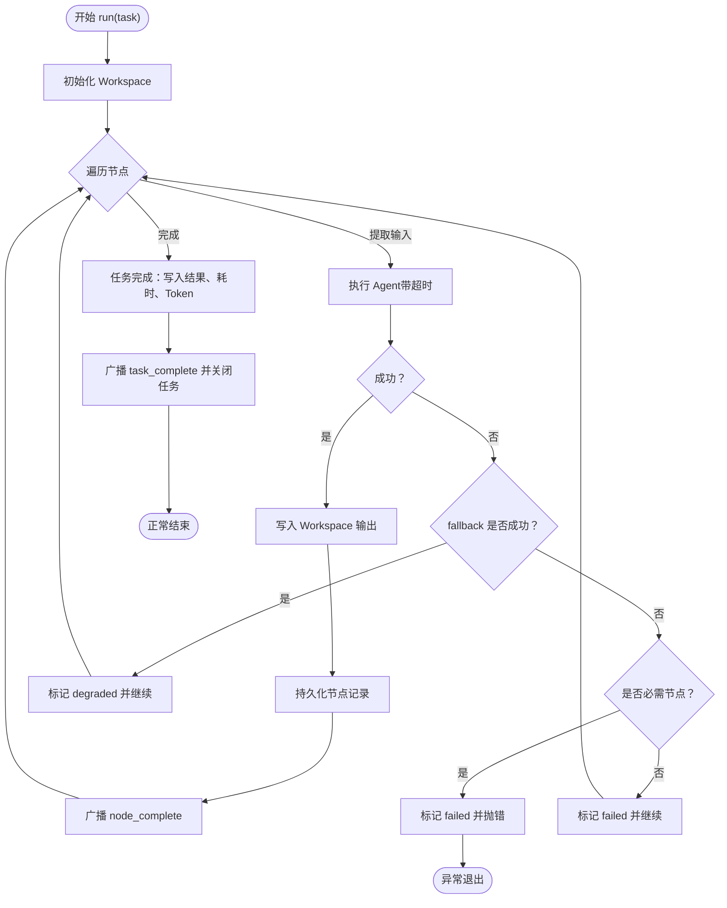
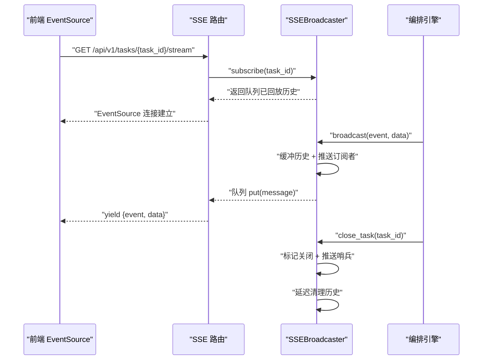
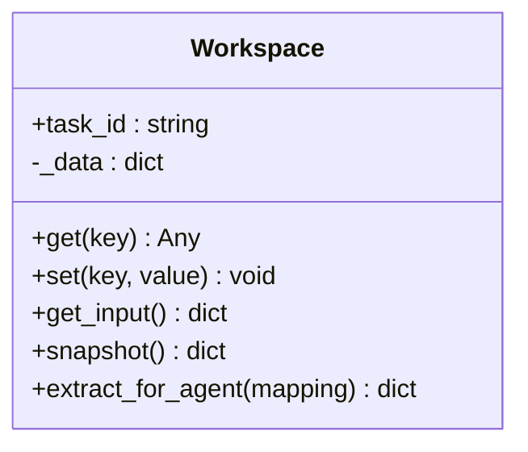
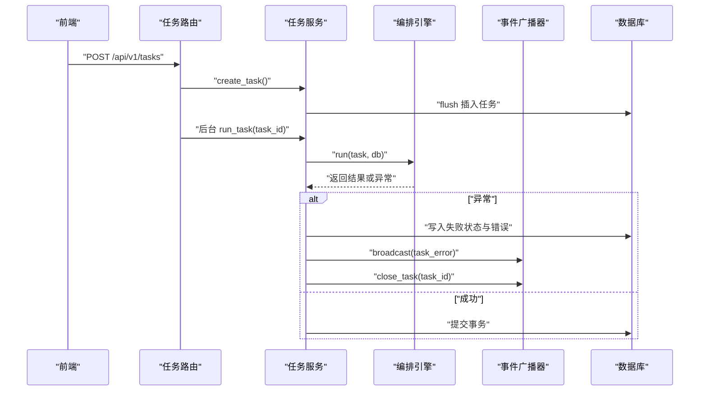
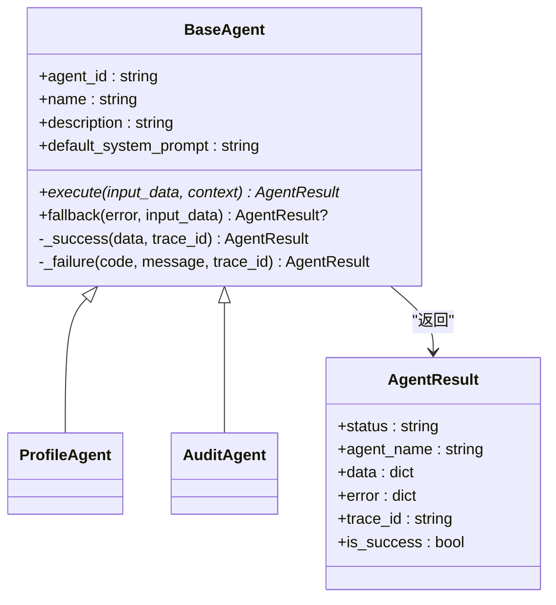
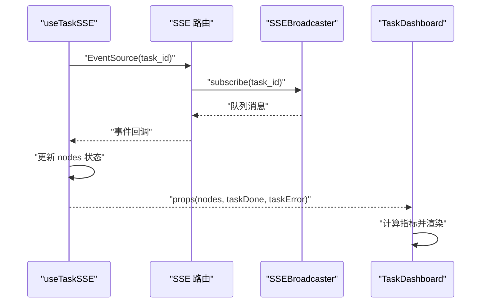
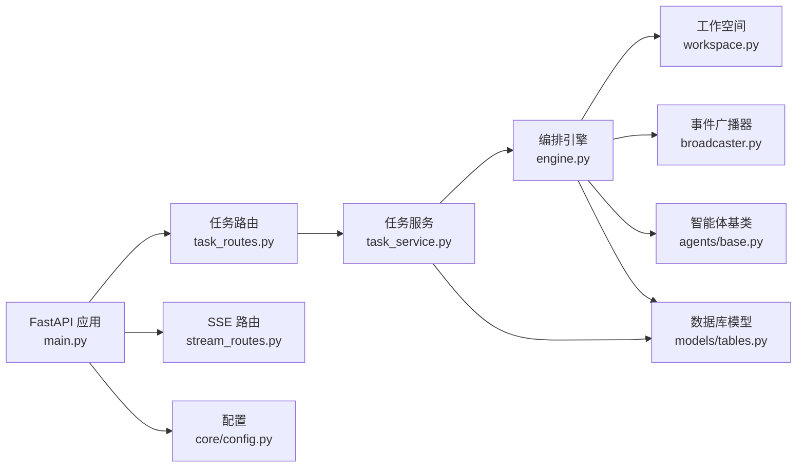

# 工作流编排引擎

<cite>
**本文引用的文件**
- [backend/app/orchestrator/engine.py](file://backend/app/orchestrator/engine.py)
- [backend/app/orchestrator/broadcaster.py](file://backend/app/orchestrator/broadcaster.py)
- [backend/app/orchestrator/workspace.py](file://backend/app/orchestrator/workspace.py)
- [backend/app/services/task_service.py](file://backend/app/services/task_service.py)
- [backend/app/api/task_routes.py](file://backend/app/api/task_routes.py)
- [backend/app/api/stream_routes.py](file://backend/app/api/stream_routes.py)
- [backend/app/models/tables.py](file://backend/app/models/tables.py)
- [backend/app/agents/base.py](file://backend/app/agents/base.py)
- [backend/app/agents/profile_agent.py](file://backend/app/agents/profile_agent.py)
- [backend/app/agents/audit_agent.py](file://backend/app/agents/audit_agent.py)
- [backend/app/core/config.py](file://backend/app/core/config.py)
- [backend/app/main.py](file://backend/app/main.py)
- [backend/pyproject.toml](file://backend/pyproject.toml)
- [frontend/hooks/useTaskSSE.ts](file://frontend/hooks/useTaskSSE.ts)
- [frontend/components/dashboard/TaskDashboard.tsx](file://frontend/components/dashboard/TaskDashboard.tsx)
- [ARCHITECTURE.md](file://ARCHITECTURE.md)
</cite>

## 目录
1. [简介](#简介)
2. [项目结构](#项目结构)
3. [核心组件](#核心组件)
4. [架构总览](#架构总览)
5. [详细组件分析](#详细组件分析)
6. [依赖分析](#依赖分析)
7. [性能考量](#性能考量)
8. [故障排查指南](#故障排查指南)
9. [结论](#结论)
10. [附录](#附录)

## 简介
本文件为“工作流编排引擎”的综合技术文档，聚焦于 Orchestration（编排）、事件广播（SSE）、工作空间（Workspace）上下文隔离与状态传播、任务服务层（TaskService）以及异步编程与错误恢复策略。文档同时提供面向架构师的设计思路与面向开发者的实现指导，帮助快速理解与扩展系统。

## 项目结构
后端采用 FastAPI + SQLAlchemy 2.0 异步架构，模块化清晰：
- orchestrator：编排引擎、事件广播器、工作空间
- services：任务服务层（业务编排）
- api：HTTP 路由层（任务 API、SSE 流）
- agents：智能体基类与具体实现
- models：数据库 ORM 表结构
- core：配置、日志、追踪、异常
- frontend：React 前端，使用 SSE 实时订阅

**图表来源**
- [backend/app/main.py:1-142](file://backend/app/main.py#L1-L142)
- [backend/app/api/task_routes.py:1-163](file://backend/app/api/task_routes.py#L1-L163)
- [backend/app/api/stream_routes.py:1-43](file://backend/app/api/stream_routes.py#L1-L43)
- [backend/app/services/task_service.py:1-126](file://backend/app/services/task_service.py#L1-L126)
- [backend/app/orchestrator/engine.py:1-285](file://backend/app/orchestrator/engine.py#L1-L285)
- [backend/app/orchestrator/workspace.py:1-53](file://backend/app/orchestrator/workspace.py#L1-L53)
- [backend/app/orchestrator/broadcaster.py:1-94](file://backend/app/orchestrator/broadcaster.py#L1-L94)
- [backend/app/agents/base.py:1-99](file://backend/app/agents/base.py#L1-L99)
- [backend/app/agents/profile_agent.py:1-73](file://backend/app/agents/profile_agent.py#L1-L73)
- [backend/app/agents/audit_agent.py:1-66](file://backend/app/agents/audit_agent.py#L1-L66)
- [backend/app/models/tables.py:1-233](file://backend/app/models/tables.py#L1-L233)
- [backend/app/core/config.py:1-51](file://backend/app/core/config.py#L1-L51)

**章节来源**
- [backend/app/main.py:1-142](file://backend/app/main.py#L1-L142)
- [ARCHITECTURE.md:1-800](file://ARCHITECTURE.md#L1-L800)

## 核心组件
- 编排引擎（OrchestratorEngine）：顺序调度 Agent、管理 Workspace、持久化节点运行记录、广播事件、超时与错误处理、汇总 Token 消耗。
- 事件广播器（SSEBroadcaster）：按任务维护订阅队列、事件缓冲与回放、关闭任务清理、SSE 格式化。
- 工作空间（Workspace）：任务级上下文容器，提供键值读写、输入提取映射、快照持久化。
- 任务服务（TaskService）：任务生命周期管理（创建、运行、查询、分页、节点明细）、异常捕获与任务级广播。
- 智能体（BaseAgent 及其实现）：统一执行协议、降级策略、结构化结果封装。
- 数据模型（TaskModel/TaskNodeRunModel 等）：任务与节点运行记录的结构化持久化。

**章节来源**
- [backend/app/orchestrator/engine.py:89-285](file://backend/app/orchestrator/engine.py#L89-L285)
- [backend/app/orchestrator/broadcaster.py:11-94](file://backend/app/orchestrator/broadcaster.py#L11-L94)
- [backend/app/orchestrator/workspace.py:12-53](file://backend/app/orchestrator/workspace.py#L12-L53)
- [backend/app/services/task_service.py:20-126](file://backend/app/services/task_service.py#L20-L126)
- [backend/app/agents/base.py:18-99](file://backend/app/agents/base.py#L18-L99)
- [backend/app/models/tables.py:23-233](file://backend/app/models/tables.py#L23-L233)

## 架构总览
系统采用“网关层（FastAPI）—服务层（TaskService）—编排层（OrchestratorEngine）—智能体层（Agent）—事件广播（SSE）—数据库（SQLAlchemy）”的分层设计。前端通过 SSE 实时接收节点状态与任务完成事件，实现可视化监控。

**图表来源**
- [backend/app/api/task_routes.py:19-51](file://backend/app/api/task_routes.py#L19-L51)
- [backend/app/services/task_service.py:39-63](file://backend/app/services/task_service.py#L39-L63)
- [backend/app/orchestrator/engine.py:92-234](file://backend/app/orchestrator/engine.py#L92-L234)
- [backend/app/orchestrator/broadcaster.py:57-68](file://backend/app/orchestrator/broadcaster.py#L57-L68)
- [backend/app/models/tables.py:23-74](file://backend/app/models/tables.py#L23-L74)

## 详细组件分析

### 编排引擎（OrchestratorEngine）
- 顺序调度：固定线性节点链（MVP），逐节点提取输入、执行 Agent、写入 Workspace、持久化节点记录、广播事件。
- 超时与错误处理：统一超时包装，捕获 Agent 执行异常与未知异常，必要时终止并广播错误；非必需节点失败可降级继续。
- Prompt 解析：优先使用数据库自定义模板，否则回退至 Agent 默认模板。
- 性能统计：累计 prompt/completion tokens，计算节点与任务耗时。

**图表来源**
- [backend/app/orchestrator/engine.py:92-234](file://backend/app/orchestrator/engine.py#L92-L234)

**章节来源**
- [backend/app/orchestrator/engine.py:89-285](file://backend/app/orchestrator/engine.py#L89-L285)

### 事件广播系统（SSEBroadcaster）
- 订阅管理：每个任务维护订阅队列列表，首次订阅回放历史事件，任务关闭后发送结束哨兵。
- 事件缓冲：为晚到订阅者保存历史消息，避免错过初始状态。
- 清理策略：任务关闭后延迟清理历史，防止内存泄漏。
- SSE 格式：事件名与数据体拼装为标准 SSE 文本帧。

**图表来源**
- [backend/app/api/stream_routes.py:14-42](file://backend/app/api/stream_routes.py#L14-L42)
- [backend/app/orchestrator/broadcaster.py:30-84](file://backend/app/orchestrator/broadcaster.py#L30-L84)

**章节来源**
- [backend/app/orchestrator/broadcaster.py:11-94](file://backend/app/orchestrator/broadcaster.py#L11-L94)
- [backend/app/api/stream_routes.py:1-43](file://backend/app/api/stream_routes.py#L1-L43)

### 工作空间（Workspace）上下文隔离
- 任务级隔离：每个任务拥有独立 Workspace，Agent 间通过键值共享数据。
- 输入提取：支持“input.字段”与“顶层键”两种映射，简化 MVP 阶段的数据装配。
- 快照持久化：任务结束时将 Workspace 快照写入任务结果字段。

**图表来源**
- [backend/app/orchestrator/workspace.py:12-53](file://backend/app/orchestrator/workspace.py#L12-L53)

**章节来源**
- [backend/app/orchestrator/workspace.py:12-53](file://backend/app/orchestrator/workspace.py#L12-L53)

### 任务服务层（TaskService）
- 任务创建：生成任务 ID、设置初始状态、持久化输入数据。
- 任务运行：串行触发编排引擎，后台协程执行，异常捕获并回写任务状态与错误信息，广播任务级错误事件。
- 查询与分页：支持按状态过滤、分页查询任务列表与节点明细。
- 节点明细：按节点顺序返回输入/输出、耗时、Token、错误等。

**图表来源**
- [backend/app/api/task_routes.py:19-51](file://backend/app/api/task_routes.py#L19-L51)
- [backend/app/services/task_service.py:22-63](file://backend/app/services/task_service.py#L22-L63)
- [backend/app/orchestrator/engine.py:92-234](file://backend/app/orchestrator/engine.py#L92-L234)

**章节来源**
- [backend/app/services/task_service.py:20-126](file://backend/app/services/task_service.py#L20-L126)
- [backend/app/api/task_routes.py:19-163](file://backend/app/api/task_routes.py#L19-L163)

### 智能体（Agent）与示例实现
- 统一协议：继承 BaseAgent，实现 execute 与可选 fallback，返回标准化 AgentResult。
- 示例 Agent：ProfileAgent 与 AuditAgent 提供固定输出与降级策略，便于 MVP 验证链路。

**图表来源**
- [backend/app/agents/base.py:18-99](file://backend/app/agents/base.py#L18-L99)
- [backend/app/agents/profile_agent.py:10-73](file://backend/app/agents/profile_agent.py#L10-L73)
- [backend/app/agents/audit_agent.py:7-66](file://backend/app/agents/audit_agent.py#L7-L66)

**章节来源**
- [backend/app/agents/base.py:18-99](file://backend/app/agents/base.py#L18-L99)
- [backend/app/agents/profile_agent.py:10-73](file://backend/app/agents/profile_agent.py#L10-L73)
- [backend/app/agents/audit_agent.py:7-66](file://backend/app/agents/audit_agent.py#L7-L66)

### 前端集成（SSE 与可视化）
- useTaskSSE：订阅 SSE，监听 node_start/node_complete/node_error/task_complete 事件，维护节点状态数组与任务完成/错误标志。
- TaskDashboard：计算完成率、平均耗时、渲染节点状态卡片与错误提示。

**图表来源**
- [frontend/hooks/useTaskSSE.ts:28-124](file://frontend/hooks/useTaskSSE.ts#L28-L124)
- [frontend/components/dashboard/TaskDashboard.tsx:21-176](file://frontend/components/dashboard/TaskDashboard.tsx#L21-L176)
- [backend/app/api/stream_routes.py:14-42](file://backend/app/api/stream_routes.py#L14-L42)
- [backend/app/orchestrator/broadcaster.py:30-68](file://backend/app/orchestrator/broadcaster.py#L30-L68)

**章节来源**
- [frontend/hooks/useTaskSSE.ts:1-124](file://frontend/hooks/useTaskSSE.ts#L1-L124)
- [frontend/components/dashboard/TaskDashboard.tsx:1-176](file://frontend/components/dashboard/TaskDashboard.tsx#L1-L176)

## 依赖分析
- 后端依赖：FastAPI、SQLAlchemy 2.0（异步）、Alembic、Pydantic/Settings、sse-starlette、litellm、aiosqlite/asyncpg 等。
- 模块耦合：API 路由仅负责请求/响应与后台任务触发；编排引擎与服务层解耦；事件广播器与编排引擎弱耦合（仅广播）。
- 外部集成：SSE Starlette、结构化日志、LLM 调用（通过 Agent/技能层抽象）。

**图表来源**
- [backend/app/main.py:14-27](file://backend/app/main.py#L14-L27)
- [backend/app/api/task_routes.py:16-16](file://backend/app/api/task_routes.py#L16-L16)
- [backend/app/api/stream_routes.py:11-11](file://backend/app/api/stream_routes.py#L11-L11)
- [backend/app/services/task_service.py:13-15](file://backend/app/services/task_service.py#L13-L15)
- [backend/app/orchestrator/engine.py:24-26](file://backend/app/orchestrator/engine.py#L24-L26)
- [backend/app/orchestrator/workspace.py:6-7](file://backend/app/orchestrator/workspace.py#L6-L7)
- [backend/app/orchestrator/broadcaster.py:3-6](file://backend/app/orchestrator/broadcaster.py#L3-L6)
- [backend/app/agents/base.py:12-13](file://backend/app/agents/base.py#L12-L13)
- [backend/app/models/tables.py:15](file://backend/app/models/tables.py#L15)
- [backend/app/core/config.py:7-51](file://backend/app/core/config.py#L7-L51)

**章节来源**
- [backend/pyproject.toml:1-41](file://backend/pyproject.toml#L1-L41)
- [backend/app/main.py:1-142](file://backend/app/main.py#L1-L142)

## 性能考量
- 异步执行：编排与服务层均采用 asyncio，减少阻塞，提高吞吐。
- 超时控制：统一的 Agent 执行超时，避免长尾阻塞；任务与技能也有独立超时配置。
- 事件缓冲：SSE 广播器对晚到订阅者回放历史，降低前端重连成本。
- Token 统计：节点级 prompt/completion tokens 累加，便于成本与性能分析。
- 数据库：使用异步 SQLAlchemy，配合 flush/commit 控制事务粒度，减少锁竞争。

**章节来源**
- [backend/app/orchestrator/engine.py:236-243](file://backend/app/orchestrator/engine.py#L236-L243)
- [backend/app/core/config.py:42-46](file://backend/app/core/config.py#L42-L46)
- [backend/app/orchestrator/broadcaster.py:60-68](file://backend/app/orchestrator/broadcaster.py#L60-L68)

## 故障排查指南
- 任务失败：检查任务服务中的异常捕获与回写逻辑，确认错误消息与完成时间是否正确写入。
- 节点失败：查看节点运行记录表，定位失败节点、错误信息与 degraded 标记。
- SSE 不通：确认订阅队列是否创建、任务是否关闭、是否发送了哨兵；前端 EventSource 是否断开。
- Agent 超时：调整配置中的 agent_timeout；检查 Agent 执行是否阻塞在外部调用。
- 日志与追踪：启用结构化日志，结合 trace_id 定位跨模块调用链。

**章节来源**
- [backend/app/services/task_service.py:49-63](file://backend/app/services/task_service.py#L49-L63)
- [backend/app/orchestrator/engine.py:176-196](file://backend/app/orchestrator/engine.py#L176-L196)
- [backend/app/api/stream_routes.py:22-41](file://backend/app/api/stream_routes.py#L22-L41)
- [backend/app/core/config.py:42-46](file://backend/app/core/config.py#L42-L46)

## 结论
本编排引擎以“任务级 Workspace 隔离 + 顺序节点编排 + SSE 实时广播”为核心，结合统一的 Agent 协议与降级策略，在 MVP 阶段实现了可观察、可回放、可扩展的工作流闭环。通过清晰的模块划分与异步化设计，既满足了前端可视化监控的需求，也为后续 DAG 化与分布式演进预留了接口与数据结构。

## 附录
- 配置项参考：数据库、Redis、LLM、应用、日志、超时等。
- 数据模型参考：任务、节点运行、账号画像、话题候选、文章草稿、审核结果、Agent/Skill/工作流模板、系统日志。
- 架构设计参考：模块职责、调用链、SSE 事件类型、前端可视化方案。

**章节来源**
- [backend/app/core/config.py:7-51](file://backend/app/core/config.py#L7-L51)
- [backend/app/models/tables.py:23-233](file://backend/app/models/tables.py#L23-L233)
- [ARCHITECTURE.md:401-538](file://ARCHITECTURE.md#L401-L538)