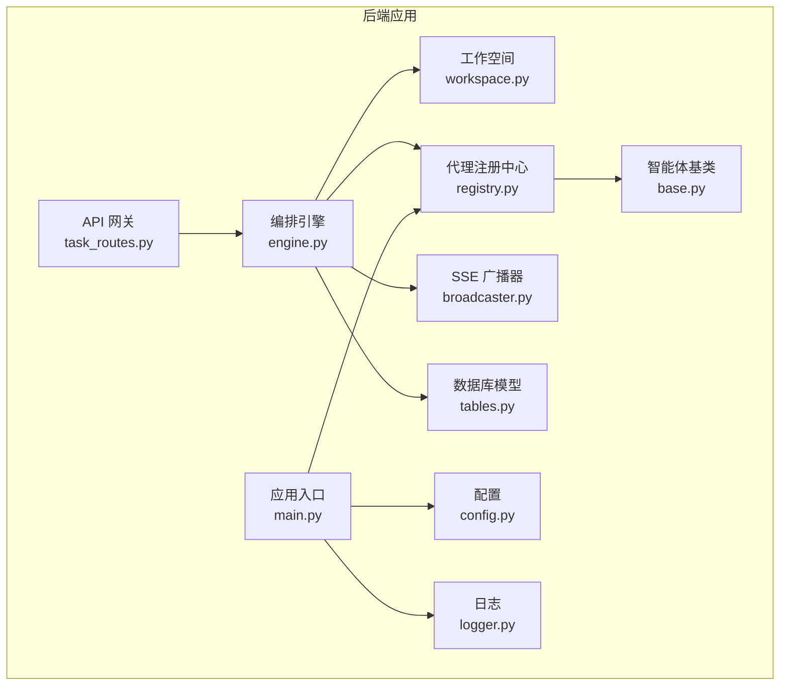
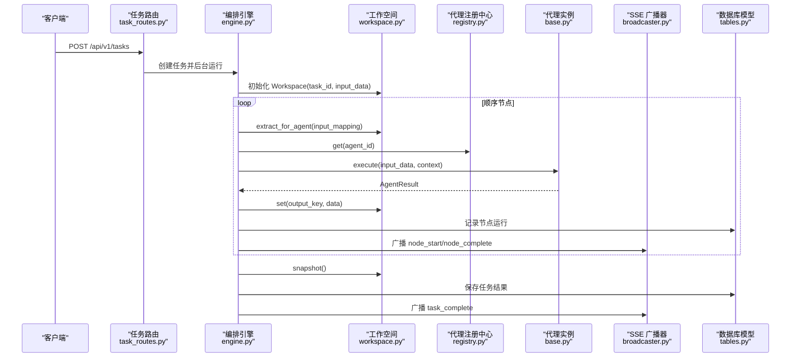
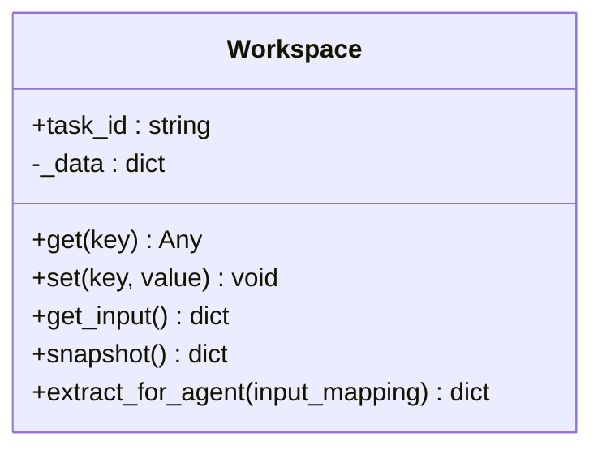
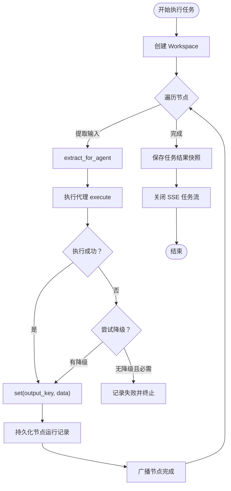
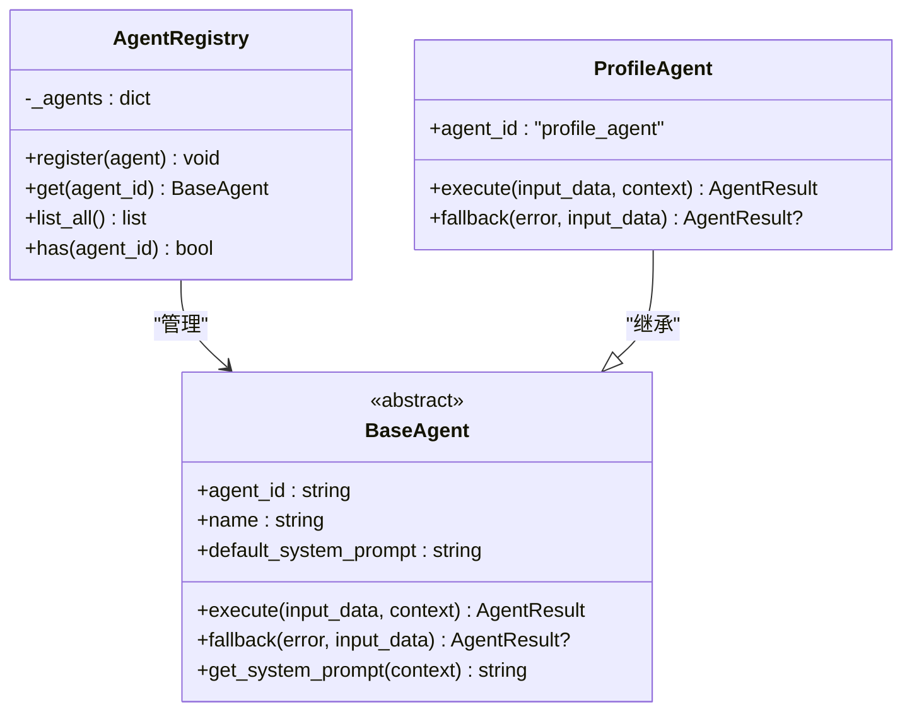
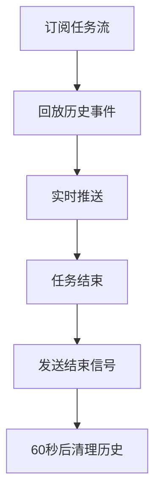
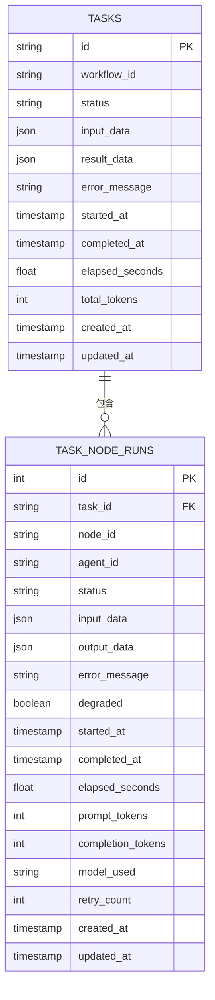
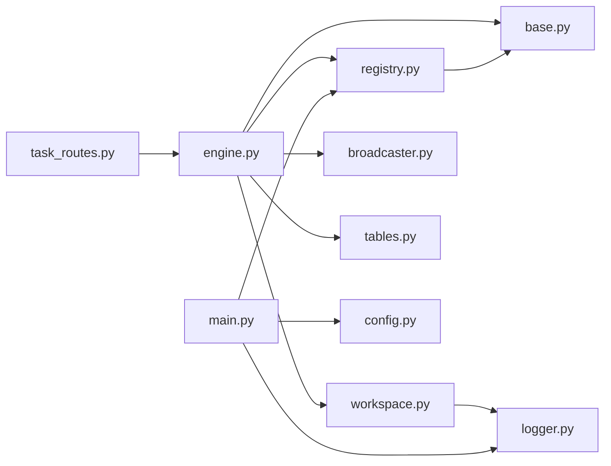

# 工作空间管理系统

<cite>
**本文引用的文件**
- [workspace.py](file://backend/app/orchestrator/workspace.py)
- [engine.py](file://backend/app/orchestrator/engine.py)
- [broadcaster.py](file://backend/app/orchestrator/broadcaster.py)
- [base.py](file://backend/app/agents/base.py)
- [registry.py](file://backend/app/agents/registry.py)
- [tables.py](file://backend/app/models/tables.py)
- [config.py](file://backend/app/core/config.py)
- [main.py](file://backend/app/main.py)
- [task_routes.py](file://backend/app/api/task_routes.py)
- [logger.py](file://backend/app/core/logger.py)
- [test_workspace.py](file://backend/tests/test_workspace.py)
- [profile_agent.py](file://backend/app/agents/profile_agent.py)
- [ARCHITECTURE.md](file://ARCHITECTURE.md)
</cite>

## 目录
1. [简介](#简介)
2. [项目结构](#项目结构)
3. [核心组件](#核心组件)
4. [架构总览](#架构总览)
5. [详细组件分析](#详细组件分析)
6. [依赖关系分析](#依赖关系分析)
7. [性能考量](#性能考量)
8. [故障排查指南](#故障排查指南)
9. [结论](#结论)
10. [附录](#附录)

## 简介
本文件为工作空间管理系统的技术文档，围绕 Workspace 类的设计原理与实现细节展开，涵盖数据封装、上下文隔离、状态持久化、数据提取与注入（input_mapping 映射规则与 output_key 输出机制）、快照（snapshot）功能、节点间传递机制、内存管理与性能优化，以及面向开发者的扩展与自定义方案。文档同时结合系统整体架构与关键流程，帮助读者全面理解工作空间在多智能体编排中的作用与价值。

## 项目结构
后端采用模块化分层设计：
- orchestrator：工作流编排与工作空间管理
- agents：智能体基类与注册中心
- models：数据库模型（任务、节点运行、草稿、审计等）
- api：HTTP 路由与 SSE 广播
- core：配置、日志、异常与追踪
- tests：工作空间与编排器测试

**图表来源**
- [engine.py:1-285](file://backend/app/orchestrator/engine.py#L1-L285)
- [workspace.py:1-53](file://backend/app/orchestrator/workspace.py#L1-L53)
- [registry.py:1-40](file://backend/app/agents/registry.py#L1-L40)
- [base.py:1-99](file://backend/app/agents/base.py#L1-L99)
- [broadcaster.py:1-94](file://backend/app/orchestrator/broadcaster.py#L1-L94)
- [tables.py:1-233](file://backend/app/models/tables.py#L1-L233)
- [config.py:1-51](file://backend/app/core/config.py#L1-L51)
- [logger.py:1-36](file://backend/app/core/logger.py#L1-L36)
- [main.py:1-142](file://backend/app/main.py#L1-L142)

**章节来源**
- [ARCHITECTURE.md:414-448](file://ARCHITECTURE.md#L414-L448)

## 核心组件
- Workspace：任务级上下文容器，提供键值存取、原始输入访问、快照导出与智能体输入提取。
- OrchestratorEngine：顺序调度代理，管理工作空间生命周期，广播节点状态，处理降级与异常。
- AgentRegistry：代理实例注册中心，按 agent_id 获取代理实例。
- BaseAgent：代理抽象基类，定义标准输入输出与降级策略。
- SSEBroadcaster：SSE 事件广播器，维护订阅队列与历史缓冲，支持延迟加入与关闭清理。
- 数据模型：TaskModel、TaskNodeRunModel 等，持久化任务与节点运行状态、令牌消耗与错误信息。

**章节来源**
- [workspace.py:12-53](file://backend/app/orchestrator/workspace.py#L12-L53)
- [engine.py:89-285](file://backend/app/orchestrator/engine.py#L89-L285)
- [registry.py:10-40](file://backend/app/agents/registry.py#L10-L40)
- [base.py:49-99](file://backend/app/agents/base.py#L49-L99)
- [broadcaster.py:11-94](file://backend/app/orchestrator/broadcaster.py#L11-L94)
- [tables.py:23-233](file://backend/app/models/tables.py#L23-L233)

## 架构总览
工作空间贯穿任务执行全链路：任务创建后，编排引擎为任务创建 Workspace，按节点定义顺序提取输入、执行代理、写入输出、广播状态、持久化节点运行记录，最终生成任务结果快照。

**图表来源**
- [engine.py:92-234](file://backend/app/orchestrator/engine.py#L92-L234)
- [workspace.py:32-52](file://backend/app/orchestrator/workspace.py#L32-L52)
- [registry.py:23-28](file://backend/app/agents/registry.py#L23-L28)
- [broadcaster.py:57-80](file://backend/app/orchestrator/broadcaster.py#L57-L80)
- [tables.py:23-73](file://backend/app/models/tables.py#L23-L73)

## 详细组件分析

### Workspace 类设计与实现
- 数据封装：内部以字典存储键值数据，初始包含“input”键承载原始输入；提供 get/set 方法进行读写，并记录写入日志。
- 上下文隔离：每个任务创建独立 Workspace，代理间通过共享的上下文字典进行数据交换，避免全局污染。
- 状态持久化：通过 snapshot 返回当前上下文副本，供编排引擎持久化到任务结果字段。
- 数据提取与注入：
  - extract_for_agent 使用 input_mapping 将节点输入映射到工作空间键，支持两种引用：
    - “input.xxx”：引用原始输入字段；
    - 直接键名：引用工作空间已存在的键。
  - output_key：节点执行成功后，将代理输出写入工作空间指定键，供后续节点使用。
- 快照（snapshot）：返回当前上下文的浅拷贝字典，便于持久化与传输。

**图表来源**
- [workspace.py:12-53](file://backend/app/orchestrator/workspace.py#L12-L53)

**章节来源**
- [workspace.py:15-52](file://backend/app/orchestrator/workspace.py#L15-L52)
- [test_workspace.py:7-41](file://backend/tests/test_workspace.py#L7-L41)

### 编排引擎与工作空间生命周期
- 初始化：根据任务模型创建 Workspace，设置任务状态为“running”，记录开始时间。
- 节点执行：
  - 从 Workspace 提取当前节点所需输入；
  - 解析有效系统提示（优先数据库自定义模板）；
  - 执行代理，若失败尝试降级；
  - 成功则写入 output_key，失败则根据 required 字段决定是否终止。
- 广播与持久化：节点开始/完成事件通过 SSE 广播；节点运行记录持久化；任务完成后写入结果快照与统计信息。
- 结束：广播任务完成事件，关闭任务流并清理历史缓冲。

**图表来源**
- [engine.py:92-234](file://backend/app/orchestrator/engine.py#L92-L234)
- [broadcaster.py:70-84](file://backend/app/orchestrator/broadcaster.py#L70-L84)

**章节来源**
- [engine.py:92-234](file://backend/app/orchestrator/engine.py#L92-L234)

### 代理注册与调用
- AgentRegistry：集中管理代理实例，按 agent_id 获取代理，未找到抛出异常。
- BaseAgent：定义代理标准接口（execute、fallback），提供系统提示解析与结果封装工具方法。
- ProfileAgent 示例：演示如何返回结构化输出与降级策略。

**图表来源**
- [registry.py:10-40](file://backend/app/agents/registry.py#L10-L40)
- [base.py:49-99](file://backend/app/agents/base.py#L49-L99)
- [profile_agent.py:10-73](file://backend/app/agents/profile_agent.py#L10-L73)

**章节来源**
- [registry.py:23-28](file://backend/app/agents/registry.py#L23-L28)
- [base.py:64-99](file://backend/app/agents/base.py#L64-L99)
- [profile_agent.py:42-73](file://backend/app/agents/profile_agent.py#L42-L73)

### SSE 广播与内存管理
- 订阅与历史缓冲：为每个任务维护订阅队列与历史消息列表，新订阅自动回放历史事件，解决前端连接滞后问题。
- 关闭与清理：任务结束后发送结束信号并标记关闭，60 秒后清理历史缓冲，防止内存泄漏。
- 格式化输出：SSE 消息格式包含事件类型与数据，便于前端解析。

**图表来源**
- [broadcaster.py:30-84](file://backend/app/orchestrator/broadcaster.py#L30-L84)

**章节来源**
- [broadcaster.py:11-94](file://backend/app/orchestrator/broadcaster.py#L11-L94)

### 数据模型与持久化
- TaskModel：任务生命周期、输入/输出、统计信息与创建/更新时间。
- TaskNodeRunModel：节点运行记录，包含输入输出、耗时、令牌消耗、错误信息与降级标记。
- JSON 字段：input_data、result_data、output_data 等均以 JSON 存储，便于结构化数据持久化与检索。

**图表来源**
- [tables.py:23-73](file://backend/app/models/tables.py#L23-L73)

**章节来源**
- [tables.py:23-233](file://backend/app/models/tables.py#L23-L233)

## 依赖关系分析
- Workspace 依赖日志模块进行写入记录。
- OrchestratorEngine 依赖：
  - Workspace：上下文管理与快照；
  - AgentRegistry：代理实例获取；
  - BaseAgent：代理执行与降级；
  - SSEBroadcaster：状态广播；
  - 数据模型：节点与任务持久化；
  - 配置：超时等运行参数。
- AgentRegistry 依赖 BaseAgent 与异常模块。
- API 路由依赖服务层与编排引擎。
- 应用入口负责注册代理与创建数据库表。

**图表来源**
- [workspace.py:6-9](file://backend/app/orchestrator/workspace.py#L6-L9)
- [engine.py:18-26](file://backend/app/orchestrator/engine.py#L18-L26)
- [registry.py:3-5](file://backend/app/agents/registry.py#L3-L5)
- [main.py:20-27](file://backend/app/main.py#L20-L27)
- [task_routes.py:13-13](file://backend/app/api/task_routes.py#L13-L13)

**章节来源**
- [engine.py:18-26](file://backend/app/orchestrator/engine.py#L18-L26)
- [main.py:20-27](file://backend/app/main.py#L20-L27)

## 性能考量
- 超时控制：编排引擎对代理执行设置超时，避免长时间阻塞；SSE 广播器在任务结束后定时清理历史，防止内存增长。
- 日志与追踪：结构化日志记录工作空间写入与节点执行，便于性能分析与问题定位。
- 数据序列化：JSON 字段用于输入/输出与结果持久化，减少跨层转换开销。
- 事件驱动：SSE 广播替代轮询，降低前端压力，提高实时性。

**章节来源**
- [engine.py:236-243](file://backend/app/orchestrator/engine.py#L236-L243)
- [broadcaster.py:78-84](file://backend/app/orchestrator/broadcaster.py#L78-L84)
- [logger.py:8-31](file://backend/app/core/logger.py#L8-L31)

## 故障排查指南
- 代理执行失败：
  - 检查代理 fallback 是否实现并返回结构化数据；
  - 若 required 节点失败，编排引擎会终止任务并记录错误；
  - 查看节点运行记录的 error_message 与 degraded 标记。
- 输入映射错误：
  - 确认 input_mapping 中键引用是否存在；
  - “input.xxx”引用需确保原始输入包含对应字段。
- 快照为空或缺失：
  - 确认节点执行成功并写入 output_key；
  - 检查 snapshot 调用时机与持久化流程。
- SSE 事件丢失：
  - 确保前端在任务创建后及时订阅；
  - 检查广播器历史缓冲与任务关闭状态。

**章节来源**
- [engine.py:176-196](file://backend/app/orchestrator/engine.py#L176-L196)
- [engine.py:265-271](file://backend/app/orchestrator/engine.py#L265-L271)
- [broadcaster.py:30-45](file://backend/app/orchestrator/broadcaster.py#L30-L45)

## 结论
工作空间作为任务级上下文容器，实现了数据封装、上下文隔离与状态持久化，配合编排引擎的顺序调度与事件广播，构建了稳定可靠的工作流执行框架。通过 input_mapping 与 output_key 的明确契约，节点间数据传递清晰可控；快照机制确保结果可回放、可审计。SSE 广播与内存清理策略保障了实时性与资源占用的平衡。开发者可在现有基础上扩展代理、定制输入输出 schema 与降级策略，实现更丰富的业务场景。

## 附录

### 快照（Snapshot）功能详解
- 作用：导出当前工作空间上下文，供任务结果持久化与跨层传输。
- 实现：返回内部字典的浅拷贝，避免外部修改影响内部状态。
- 使用：编排引擎在任务完成后调用 snapshot，写入任务结果字段。

**章节来源**
- [workspace.py:32-34](file://backend/app/orchestrator/workspace.py#L32-L34)
- [engine.py:218-222](file://backend/app/orchestrator/engine.py#L218-L222)

### 节点间传递机制与策略
- 数据继承：后继节点通过 input_mapping 从工作空间读取前序节点写入的 output_key。
- 覆盖策略：后写覆盖先写，确保最新结果生效；必要时可在代理内进行数据合并或清洗。
- 降级覆盖：当节点失败且存在降级结果时，写入 output_key 并标记 degraded。

**章节来源**
- [engine.py:149-163](file://backend/app/orchestrator/engine.py#L149-L163)
- [engine.py:134-135](file://backend/app/orchestrator/engine.py#L134-L135)

### 内存管理与性能优化建议
- 及时清理：SSE 广播器在任务结束后定时清理历史缓冲，避免长期持有大对象。
- 日志粒度：合理设置日志级别，避免高频写入影响性能。
- 超时配置：根据代理复杂度调整 agent_timeout，平衡吞吐与稳定性。
- 数据结构：尽量保持工作空间键扁平化，减少深层嵌套带来的序列化与查找成本。

**章节来源**
- [broadcaster.py:78-84](file://backend/app/orchestrator/broadcaster.py#L78-L84)
- [logger.py:8-31](file://backend/app/core/logger.py#L8-L31)
- [config.py:42-46](file://backend/app/core/config.py#L42-L46)

### 开发者扩展与自定义方案
- 新增代理：
  - 继承 BaseAgent，实现 execute 与可选 fallback；
  - 在应用入口注册代理实例；
  - 在工作流节点定义中引用该代理的 agent_id。
- 自定义输入映射：
  - 在节点定义中使用 input_mapping，支持“input.xxx”与直接键名两种引用；
  - 确保代理输入 schema 与映射一致。
- 自定义输出键：
  - 在节点定义中设置 output_key，确保后续节点可读取；
  - 保证输出数据符合预期 schema。
- 系统提示定制：
  - 通过数据库自定义模板覆盖代理默认提示，编排引擎会优先使用数据库模板。

**章节来源**
- [main.py:32-40](file://backend/app/main.py#L32-L40)
- [engine.py:245-263](file://backend/app/orchestrator/engine.py#L245-L263)
- [engine.py:31-86](file://backend/app/orchestrator/engine.py#L31-L86)