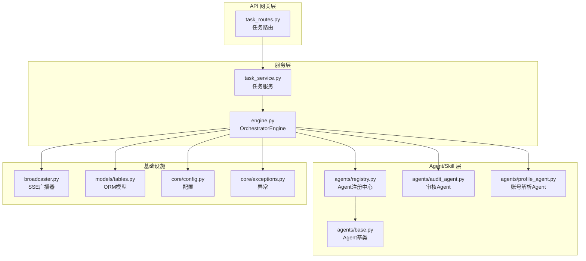
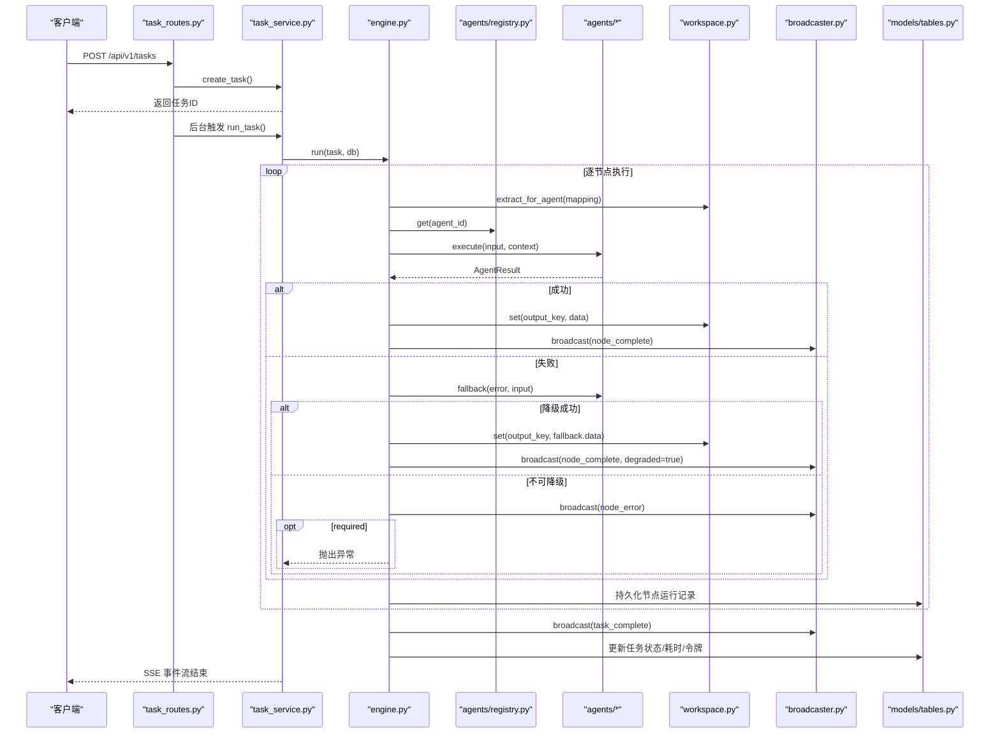
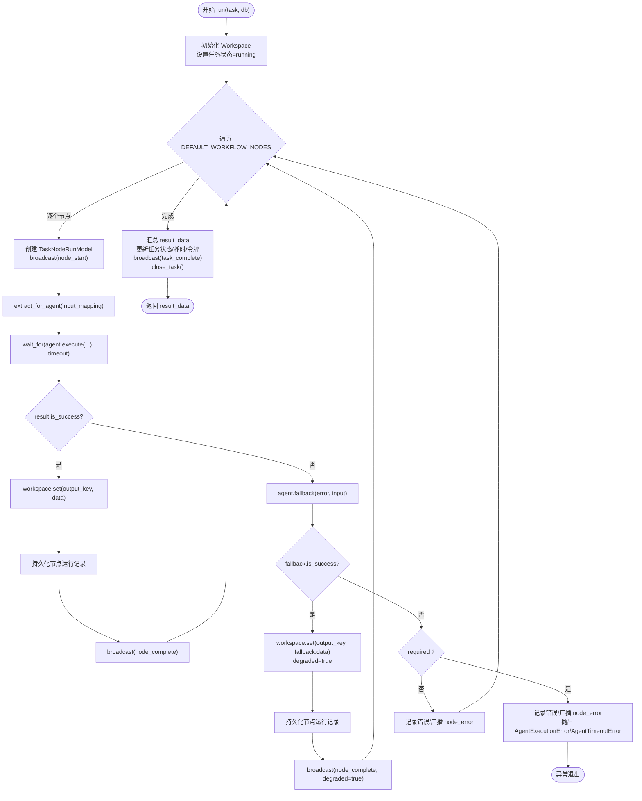
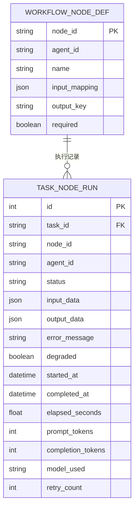
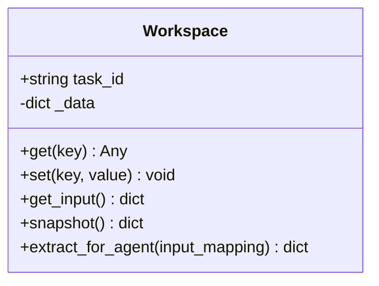
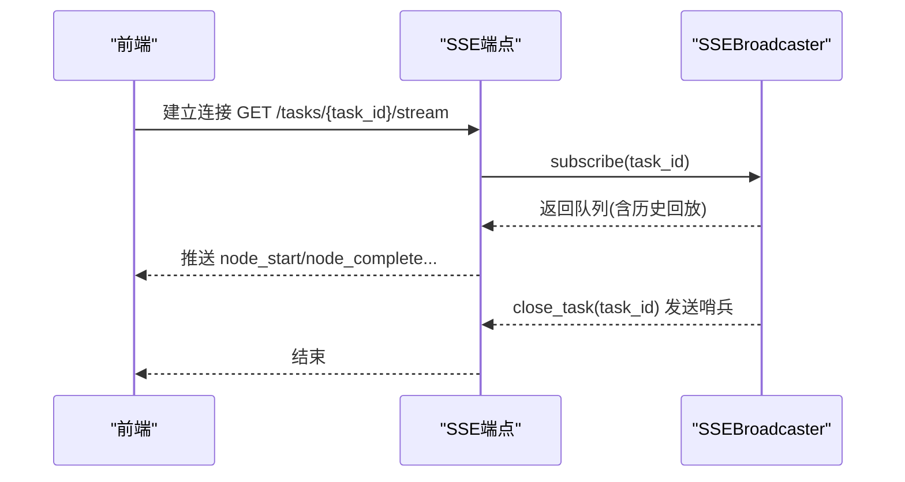
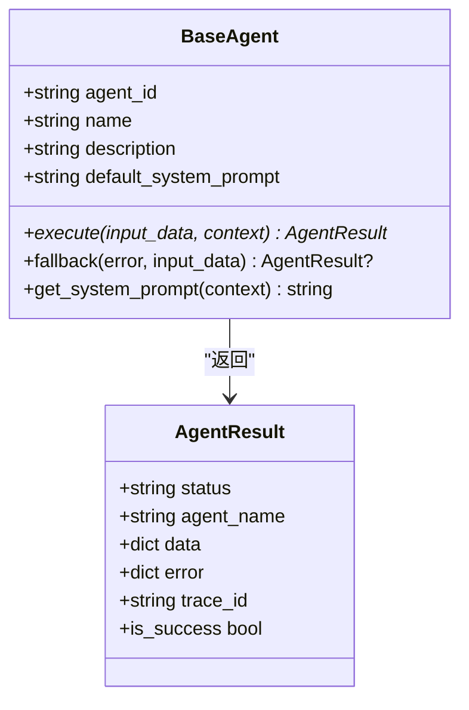
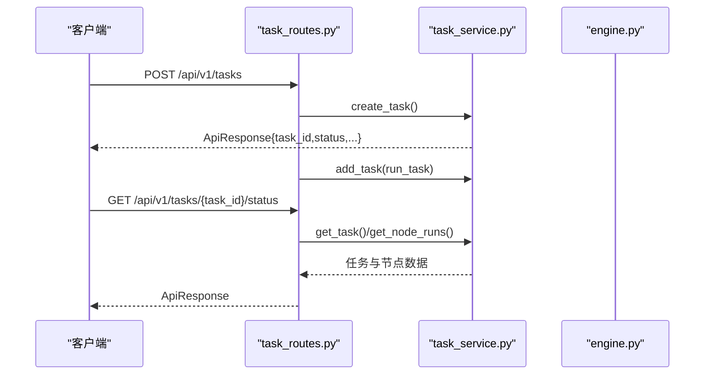
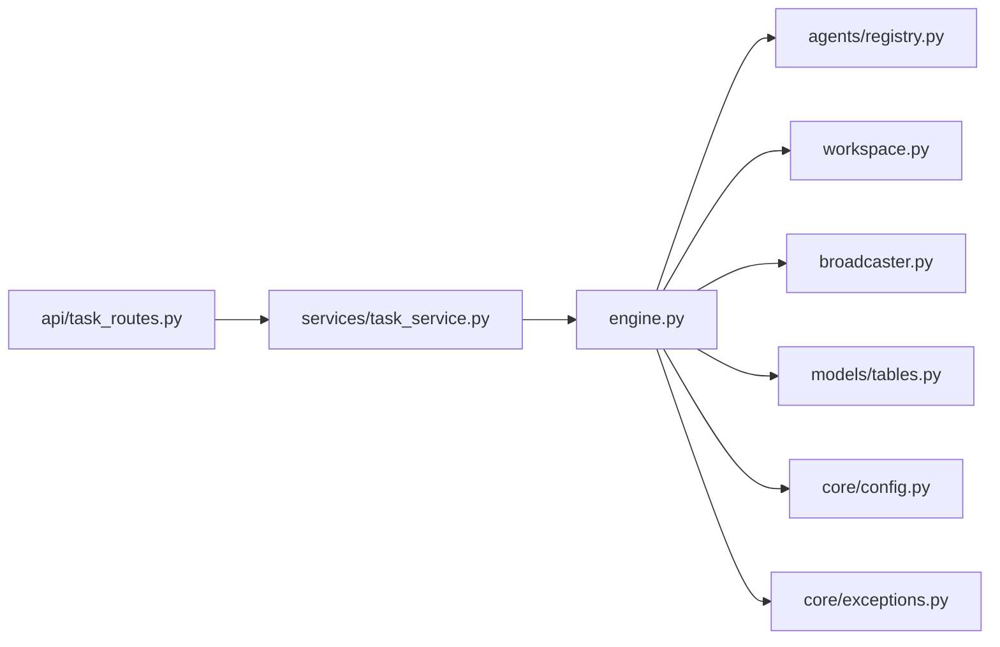

# 编排器核心逻辑

<cite>
**本文引用的文件**
- [backend/app/orchestrator/engine.py](file://backend/app/orchestrator/engine.py)
- [backend/app/orchestrator/workspace.py](file://backend/app/orchestrator/workspace.py)
- [backend/app/orchestrator/broadcaster.py](file://backend/app/orchestrator/broadcaster.py)
- [backend/app/models/tables.py](file://backend/app/models/tables.py)
- [backend/app/schemas/task.py](file://backend/app/schemas/task.py)
- [backend/app/core/config.py](file://backend/app/core/config.py)
- [backend/app/core/exceptions.py](file://backend/app/core/exceptions.py)
- [backend/app/agents/base.py](file://backend/app/agents/base.py)
- [backend/app/agents/registry.py](file://backend/app/agents/registry.py)
- [backend/app/services/task_service.py](file://backend/app/services/task_service.py)
- [backend/app/api/task_routes.py](file://backend/app/api/task_routes.py)
- [backend/app/agents/audit_agent.py](file://backend/app/agents/audit_agent.py)
- [backend/app/agents/profile_agent.py](file://backend/app/agents/profile_agent.py)
- [ARCHITECTURE.md](file://ARCHITECTURE.md)
- [Notice.md](file://Notice.md)
</cite>

## 目录
1. [引言](#引言)
2. [项目结构](#项目结构)
3. [核心组件](#核心组件)
4. [架构总览](#架构总览)
5. [详细组件分析](#详细组件分析)
6. [依赖分析](#依赖分析)
7. [性能考量](#性能考量)
8. [故障排查指南](#故障排查指南)
9. [结论](#结论)
10. [附录](#附录)

## 引言
本文聚焦编排器核心逻辑，围绕 OrchestratorEngine 的执行流程、任务调度算法、节点执行顺序控制与异常处理机制展开，结合默认工作流节点定义结构（节点ID映射、代理ID关联、输入输出键值对设计），系统阐述异步执行模式下的超时处理、错误恢复策略与降级机制，并提供可扩展的设计指导与最佳实践。

## 项目结构
后端采用分层架构：API 网关层负责请求接入与参数校验；服务层承载业务流程与编排；模型层定义数据结构；Schema 层约束输入输出；Agent/Skill 层实现具体任务；核心模块提供配置、异常与日志；编排器位于服务层之上，负责工作流调度与上下文管理。

图表来源
- [backend/app/api/task_routes.py:1-163](file://backend/app/api/task_routes.py#L1-L163)
- [backend/app/services/task_service.py:1-126](file://backend/app/services/task_service.py#L1-L126)
- [backend/app/orchestrator/engine.py:1-285](file://backend/app/orchestrator/engine.py#L1-L285)
- [backend/app/orchestrator/broadcaster.py:1-94](file://backend/app/orchestrator/broadcaster.py#L1-L94)
- [backend/app/models/tables.py:1-233](file://backend/app/models/tables.py#L1-L233)
- [backend/app/core/config.py:1-51](file://backend/app/core/config.py#L1-L51)
- [backend/app/core/exceptions.py:1-125](file://backend/app/core/exceptions.py#L1-L125)
- [backend/app/agents/base.py:1-99](file://backend/app/agents/base.py#L1-L99)
- [backend/app/agents/registry.py:1-40](file://backend/app/agents/registry.py#L1-L40)
- [backend/app/agents/audit_agent.py:1-66](file://backend/app/agents/audit_agent.py#L1-L66)
- [backend/app/agents/profile_agent.py:1-73](file://backend/app/agents/profile_agent.py#L1-L73)

章节来源
- [ARCHITECTURE.md:401-494](file://ARCHITECTURE.md#L401-L494)
- [Notice.md:100-122](file://Notice.md#L100-L122)

## 核心组件
- OrchestratorEngine：顺序调度、上下文管理、节点状态广播、超时与异常处理、令牌统计与任务收尾。
- Workspace：任务级上下文容器，提供键值存取、快照与按映射提取输入的能力。
- SSEBroadcaster：按任务维度维护订阅队列与历史事件缓冲，支持延迟加入与关闭清理。
- Agent 体系：统一的 AgentResult 返回协议、可选降级策略 fallback。
- 任务服务与路由：创建任务、后台触发编排、状态查询与节点明细查询。
- 数据模型：任务、节点运行、账号画像、话题候选、文章草稿、审核结果、Agent/Skill/工作流模板、系统日志。

章节来源
- [backend/app/orchestrator/engine.py:89-285](file://backend/app/orchestrator/engine.py#L89-L285)
- [backend/app/orchestrator/workspace.py:12-53](file://backend/app/orchestrator/workspace.py#L12-L53)
- [backend/app/orchestrator/broadcaster.py:11-94](file://backend/app/orchestrator/broadcaster.py#L11-L94)
- [backend/app/agents/base.py:18-99](file://backend/app/agents/base.py#L18-L99)
- [backend/app/services/task_service.py:20-126](file://backend/app/services/task_service.py#L20-L126)
- [backend/app/api/task_routes.py:19-163](file://backend/app/api/task_routes.py#L19-L163)
- [backend/app/models/tables.py:23-233](file://backend/app/models/tables.py#L23-L233)

## 架构总览
编排器遵循“控制平面与执行平面分离”的设计原则：编排器负责调度与上下文推进，Agent 负责具体执行；通过统一的 AgentResult 协议与可选降级策略，确保单节点失败不影响整体流程；通过 SSE 广播节点状态，前端实时消费。

图表来源
- [backend/app/api/task_routes.py:19-51](file://backend/app/api/task_routes.py#L19-L51)
- [backend/app/services/task_service.py:39-64](file://backend/app/services/task_service.py#L39-L64)
- [backend/app/orchestrator/engine.py:92-234](file://backend/app/orchestrator/engine.py#L92-L234)
- [backend/app/orchestrator/broadcaster.py:57-80](file://backend/app/orchestrator/broadcaster.py#L57-L80)
- [backend/app/models/tables.py:23-73](file://backend/app/models/tables.py#L23-L73)
- [backend/app/agents/registry.py:23-28](file://backend/app/agents/registry.py#L23-L28)

## 详细组件分析

### OrchestratorEngine 执行流程与调度算法
- 任务状态初始化：创建 Workspace，设置任务状态为 running，记录开始时间。
- 节点顺序控制：遍历 DEFAULT_WORKFLOW_NODES，按顺序执行，不支持并行或动态拓扑。
- 输入映射提取：使用 Workspace.extract_for_agent 将工作空间中的键映射到 Agent 输入。
- 上下文注入：将有效系统提示注入上下文，供 Agent 执行。
- 超时控制：使用 asyncio.wait_for 对 Agent.execute 设置全局超时。
- 结果写回：成功则写入 Workspace.output_key；失败尝试 fallback；不可降级且 required 时中断并抛出异常。
- 节点收尾：计算耗时、持久化节点运行记录、广播 node_complete。
- 任务收尾：汇总 Workspace 快照为 result_data，更新任务状态、耗时、令牌，广播 task_complete 并关闭流。

图表来源
- [backend/app/orchestrator/engine.py:92-234](file://backend/app/orchestrator/engine.py#L92-L234)
- [backend/app/orchestrator/workspace.py:36-52](file://backend/app/orchestrator/workspace.py#L36-L52)
- [backend/app/core/config.py:42-46](file://backend/app/core/config.py#L42-L46)

章节来源
- [backend/app/orchestrator/engine.py:92-234](file://backend/app/orchestrator/engine.py#L92-L234)

### 默认工作流节点定义结构
- 节点ID映射：每个节点拥有唯一 node_id，用于标识与持久化。
- 代理ID关联：agent_id 指向 Agent 注册中心中的具体 Agent 实例。
- 输入映射：input_mapping 将 Agent 输入字段映射到 Workspace 键或 input.* 路径。
- 输出键值对：output_key 将 AgentResult.data 写入 Workspace 的指定键。
- 必填标志：required 控制失败时是否中断流程。
- 示例节点（线性链）：账号定位解析 → 热点分析 → 选题策划 → 标题生成 → 正文生成 → 审核评估。

图表来源
- [backend/app/orchestrator/engine.py:31-86](file://backend/app/orchestrator/engine.py#L31-L86)
- [backend/app/models/tables.py:48-73](file://backend/app/models/tables.py#L48-L73)

章节来源
- [backend/app/orchestrator/engine.py:31-86](file://backend/app/orchestrator/engine.py#L31-L86)

### Workspace 上下文容器
- 初始化：以 task_id 与 input_data 为根，内部以字典形式保存键值。
- 读写：get/set 提供上下文读写；set 会记录日志。
- 快照：snapshot 返回当前上下文副本，供持久化与广播。
- 输入提取：支持两种映射：
  - input.*：从原始输入中提取；
  - 普通键：从工作空间中提取。

图表来源
- [backend/app/orchestrator/workspace.py:12-53](file://backend/app/orchestrator/workspace.py#L12-L53)

章节来源
- [backend/app/orchestrator/workspace.py:12-53](file://backend/app/orchestrator/workspace.py#L12-L53)

### SSE 广播与事件流
- 订阅管理：按 task_id 维护订阅队列，首次订阅时回放历史事件。
- 事件缓冲：为延迟加入的订阅者保留历史消息，避免丢失。
- 关闭清理：任务完成后发送结束哨兵并清理历史，防止内存泄漏。
- 事件类型：node_start、node_complete、node_error、task_complete、task_error。

图表来源
- [backend/app/orchestrator/broadcaster.py:30-80](file://backend/app/orchestrator/broadcaster.py#L30-L80)

章节来源
- [backend/app/orchestrator/broadcaster.py:11-94](file://backend/app/orchestrator/broadcaster.py#L11-L94)

### Agent 执行与降级策略
- 统一返回协议：AgentResult 包含 status、agent_name、data/error、trace_id。
- 执行协议：Agent.execute 接收结构化 input 与只读上下文，返回结构化结果。
- 降级策略：Agent.fallback 可在失败时返回默认值，使流程继续。
- 典型实现：ProfileAgent/AuditAgent 展示了降级返回的结构化数据。

图表来源
- [backend/app/agents/base.py:18-99](file://backend/app/agents/base.py#L18-L99)
- [backend/app/agents/audit_agent.py:48-66](file://backend/app/agents/audit_agent.py#L48-L66)
- [backend/app/agents/profile_agent.py:42-73](file://backend/app/agents/profile_agent.py#L42-L73)

章节来源
- [backend/app/agents/base.py:18-99](file://backend/app/agents/base.py#L18-L99)
- [backend/app/agents/audit_agent.py:48-66](file://backend/app/agents/audit_agent.py#L48-L66)
- [backend/app/agents/profile_agent.py:42-73](file://backend/app/agents/profile_agent.py#L42-L73)

### 任务服务与 API 路由
- 任务创建：生成 task_id，初始化任务状态与输入，提交数据库。
- 后台执行：通过 BackgroundTasks 异步触发 run_task，避免阻塞 HTTP 响应。
- 状态查询：聚合节点运行记录，计算进度与耗时。
- 详情与节点查询：返回任务与节点运行详情，便于前端可视化。

图表来源
- [backend/app/api/task_routes.py:19-87](file://backend/app/api/task_routes.py#L19-L87)
- [backend/app/services/task_service.py:20-102](file://backend/app/services/task_service.py#L20-L102)

章节来源
- [backend/app/api/task_routes.py:19-163](file://backend/app/api/task_routes.py#L19-L163)
- [backend/app/services/task_service.py:20-126](file://backend/app/services/task_service.py#L20-L126)

## 依赖分析
- 编排器依赖：
  - Agent 注册中心：按 agent_id 获取具体 Agent 实例。
  - Workspace：上下文读写与输入提取。
  - SSEBroadcaster：节点与任务级事件广播。
  - 数据模型：任务与节点运行记录的持久化。
  - 配置：全局超时设置。
  - 异常：统一错误类型与传播。
- 服务层依赖：编排器引擎、广播器、数据库会话。
- API 层依赖：服务层、数据库会话工厂。

图表来源
- [backend/app/orchestrator/engine.py:18-26](file://backend/app/orchestrator/engine.py#L18-L26)
- [backend/app/agents/registry.py:10-36](file://backend/app/agents/registry.py#L10-L36)
- [backend/app/services/task_service.py:13-15](file://backend/app/services/task_service.py#L13-L15)
- [backend/app/api/task_routes.py:10-13](file://backend/app/api/task_routes.py#L10-L13)

章节来源
- [backend/app/orchestrator/engine.py:18-26](file://backend/app/orchestrator/engine.py#L18-L26)
- [backend/app/agents/registry.py:10-36](file://backend/app/agents/registry.py#L10-L36)
- [backend/app/services/task_service.py:13-15](file://backend/app/services/task_service.py#L13-L15)
- [backend/app/api/task_routes.py:10-13](file://backend/app/api/task_routes.py#L10-L13)

## 性能考量
- 超时控制：全局 agent_timeout 限制单节点执行时间，避免阻塞后续节点。
- 令牌统计：累计 prompt_tokens 与 completion_tokens，便于成本与性能分析。
- 广播去抖：SSE 历史缓冲减少延迟订阅者的等待；任务完成后定时清理，避免内存膨胀。
- 顺序执行：线性链简化调度与一致性，降低锁竞争与上下文切换开销。
- 建议优化（扩展设计）：
  - 引入可配置的并行度与依赖图（DAG）调度，按节点依赖并行执行。
  - 为高延迟 Agent 增加独立超时与熔断阈值。
  - 引入缓存与预热，减少冷启动开销。
  - 对高频节点输出进行压缩与摘要，降低广播体积。

章节来源
- [backend/app/core/config.py:42-46](file://backend/app/core/config.py#L42-L46)
- [backend/app/orchestrator/broadcaster.py:78-84](file://backend/app/orchestrator/broadcaster.py#L78-L84)
- [backend/app/orchestrator/engine.py:211-216](file://backend/app/orchestrator/engine.py#L211-L216)

## 故障排查指南
- 节点失败：
  - 若 fallback 成功：节点标记 degraded=true，继续流程。
  - 若 fallback 失败且 required=true：记录错误并中断，抛出 AgentExecutionError 或 AgentTimeoutError。
  - 若 fallback 失败且 required=false：记录错误并继续下一个节点。
- 任务失败：
  - 服务层捕获异常，设置任务状态为 failed，记录错误与耗时，广播 task_error 并关闭流。
- 常见问题定位：
  - 检查 DEFAULT_WORKFLOW_NODES 的 input_mapping 是否与上一节点 output_key 一致。
  - 确认 Agent 是否实现 fallback 并返回结构化数据。
  - 核对配置项 agent_timeout 是否过短导致频繁超时。
  - 通过节点运行记录与 SSE 事件流定位失败节点与错误信息。

章节来源
- [backend/app/orchestrator/engine.py:137-197](file://backend/app/orchestrator/engine.py#L137-L197)
- [backend/app/services/task_service.py:39-64](file://backend/app/services/task_service.py#L39-L64)
- [backend/app/core/exceptions.py:79-98](file://backend/app/core/exceptions.py#L79-L98)

## 结论
OrchestratorEngine 以线性链为核心，通过严格的输入输出协议、统一的 AgentResult 与可选降级策略，实现了可控、可观测、可恢复的任务编排。SSE 广播与任务级追踪提供了良好的前端可视化基础。面向扩展，可在保持控制平面与执行平面分离的前提下，引入 DAG 调度、独立超时与熔断、缓存与预热等机制，进一步提升性能与稳定性。

## 附录
- 设计原则与约束参考：控制平面与执行平面分离、结构化输入输出、可审计可回放、失败不阻塞、配置优先于代码、可视化是一等公民。
- 架构与模块职责：后端采用 FastAPI + SQLAlchemy + asyncio，模块职责清晰，便于演进。

章节来源
- [Notice.md:94-125](file://Notice.md#L94-L125)
- [ARCHITECTURE.md:401-448](file://ARCHITECTURE.md#L401-L448)