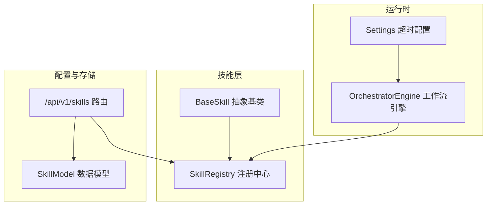
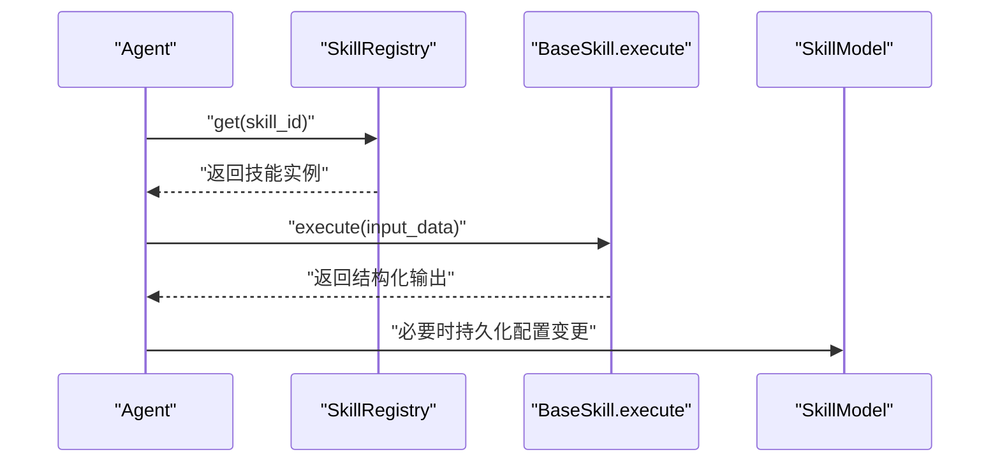
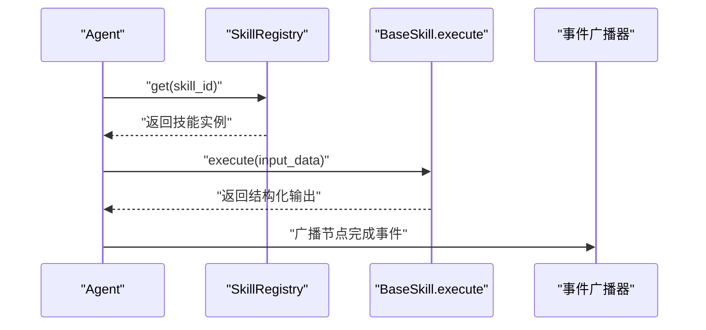
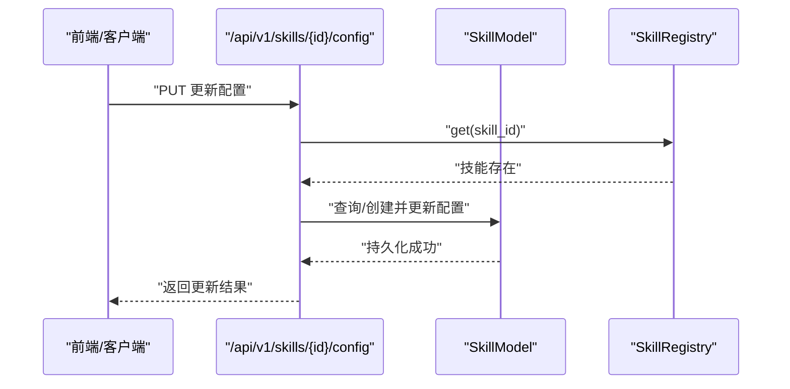
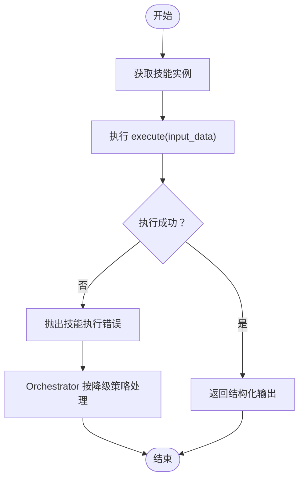
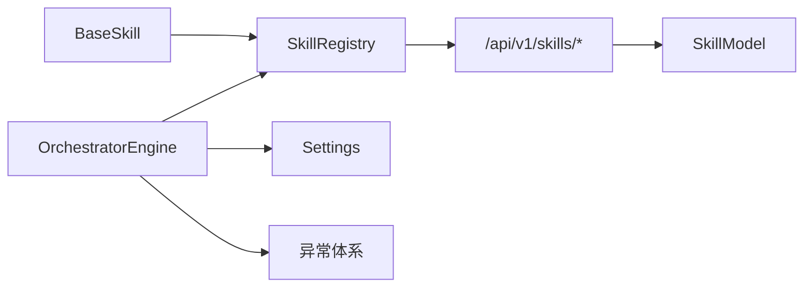

# 内置技能实现

<cite>
**本文引用的文件**
- [backend/app/skills/base.py](file://backend/app/skills/base.py)
- [backend/app/skills/registry.py](file://backend/app/skills/registry.py)
- [backend/app/api/skill_routes.py](file://backend/app/api/skill_routes.py)
- [backend/app/models/tables.py](file://backend/app/models/tables.py)
- [backend/app/orchestrator/engine.py](file://backend/app/orchestrator/engine.py)
- [backend/app/core/config.py](file://backend/app/core/config.py)
- [backend/app/core/exceptions.py](file://backend/app/core/exceptions.py)
- [backend/app/schemas/skill.py](file://backend/app/schemas/skill.py)
- [ARCHITECTURE.md](file://ARCHITECTURE.md)
</cite>

## 目录
1. [简介](#简介)
2. [项目结构](#项目结构)
3. [核心组件](#核心组件)
4. [架构总览](#架构总览)
5. [详细组件分析](#详细组件分析)
6. [依赖分析](#依赖分析)
7. [性能考虑](#性能考虑)
8. [故障排除指南](#故障排除指南)
9. [结论](#结论)
10. [附录](#附录)

## 简介
本文件面向开发者与使用者，系统性梳理 HotClaw 内置技能的实现与使用方法。重点覆盖四类内置技能：新闻抓取（NewsFetcher）、摘要（SummarySkill）、风险检测（RiskDetectorSkill）、标题评分（TitleScorerSkill）。文档从架构定位、输入输出规范、处理逻辑、调用约束、协作模式、性能特征、配置参数、调优建议到故障排除进行完整说明，并提供可操作的最佳实践。

## 项目结构
- 后端技能基座与注册中心位于 backend/app/skills，提供统一的异步执行接口与集中注册管理。
- 技能配置持久化与清单模型位于 backend/app/models/tables.py，支持按技能 ID 存储模块路径、输入输出 Schema 与配置数据。
- 技能配置 API 位于 backend/app/api/skill_routes.py，提供列出与更新技能配置的能力。
- 运行时配置与超时参数位于 backend/app/core/config.py。
- 异常体系位于 backend/app/core/exceptions.py，包含技能执行错误等专用异常类型。
- 架构设计文档 ARCHITECTURE.md 提供了技能的职责边界、调用协议与内置技能清单。

图表来源
- [backend/app/skills/base.py:16-36](file://backend/app/skills/base.py#L16-L36)
- [backend/app/skills/registry.py:10-36](file://backend/app/skills/registry.py#L10-L36)
- [backend/app/api/skill_routes.py:14-60](file://backend/app/api/skill_routes.py#L14-L60)
- [backend/app/models/tables.py:183-199](file://backend/app/models/tables.py#L183-L199)
- [backend/app/core/config.py:42-45](file://backend/app/core/config.py#L42-L45)
- [backend/app/orchestrator/engine.py:89-284](file://backend/app/orchestrator/engine.py#L89-L284)

章节来源
- [backend/app/skills/base.py:1-37](file://backend/app/skills/base.py#L1-L37)
- [backend/app/skills/registry.py:1-37](file://backend/app/skills/registry.py#L1-L37)
- [backend/app/api/skill_routes.py:1-61](file://backend/app/api/skill_routes.py#L1-L61)
- [backend/app/models/tables.py:183-199](file://backend/app/models/tables.py#L183-L199)
- [backend/app/core/config.py:1-51](file://backend/app/core/config.py#L1-L51)
- [backend/app/orchestrator/engine.py:1-285](file://backend/app/orchestrator/engine.py#L1-L285)
- [ARCHITECTURE.md:720-760](file://ARCHITECTURE.md#L720-L760)

## 核心组件
- 抽象基类 BaseSkill：定义技能的统一接口 execute(input_data: dict) -> dict，约定输入输出均为结构化字典；提供 skill_id、name、description 等元信息。
- 注册中心 SkillRegistry：集中管理技能实例，提供注册、查询、枚举与存在性判断；当重复注册同一 skill_id 时记录告警日志。
- 技能配置 API：提供列出已注册技能与更新技能配置的接口；更新时会持久化到数据库 SkillModel。
- 数据模型 SkillModel：持久化技能的模块路径、输入输出 Schema、配置数据等。
- 运行时配置 Settings：包含 skill_timeout 等超时参数，用于控制技能执行的超时行为。
- 异常体系：包含 SkillNotFoundError、SkillExecutionError 等，便于在调用与执行阶段进行错误捕获与降级处理。

章节来源
- [backend/app/skills/base.py:16-36](file://backend/app/skills/base.py#L16-L36)
- [backend/app/skills/registry.py:10-36](file://backend/app/skills/registry.py#L10-L36)
- [backend/app/api/skill_routes.py:17-60](file://backend/app/api/skill_routes.py#L17-L60)
- [backend/app/models/tables.py:183-199](file://backend/app/models/tables.py#L183-L199)
- [backend/app/core/config.py:42-45](file://backend/app/core/config.py#L42-L45)
- [backend/app/core/exceptions.py:38-98](file://backend/app/core/exceptions.py#L38-L98)

## 架构总览
内置技能作为“工具型能力”，由 Agent 在工作流中按需调用，不参与编排与节点调度。工作流引擎负责顺序调度 Agent，Agent 再调用技能完成具体任务。技能执行遵循统一的输入输出 Schema 校验与超时约束，异常将影响节点状态与整体任务结果。

图表来源
- [backend/app/orchestrator/engine.py:137-171](file://backend/app/orchestrator/engine.py#L137-L171)
- [backend/app/skills/registry.py:22-26](file://backend/app/skills/registry.py#L22-L26)
- [backend/app/api/skill_routes.py:34-60](file://backend/app/api/skill_routes.py#L34-L60)

## 详细组件分析

### 新闻抓取技能（NewsFetcherSkill）
- 职责与定位
  - 从多个新闻源抓取热点内容，返回结构化文章列表，供上层 Agent 结合领域与关键词进行二次分析。
- 输入输出
  - 输入：关键词数组、领域、最大条目数等。
  - 输出：文章数组，包含标题、来源、链接、发布时间、摘要等字段。
- 处理逻辑
  - 支持多源配置、缓存与并发限制；MVP 阶段可采用 RSS 或热搜 API。
- 调用约束
  - 需满足输入/输出 Schema 校验；执行受 skill_timeout 控制。
- 协作模式
  - 通常由热点分析或主题策划类 Agent 调用，作为上游数据源。
- 性能与并发
  - 支持并发请求与缓存 TTL；建议合理设置并发数与超时，避免外部源限流。
- 配置参数
  - 新闻源列表（启用/禁用、类型、标识）、缓存 TTL、请求超时、最大并发数等。
- 最佳实践
  - 为不同领域配置专用源；开启缓存降低重复抓取成本；对不稳定源启用降级策略。
- 故障排除
  - 检查源可用性与网络连通；确认缓存配置与超时设置；关注外部 API 限流与返回格式变化。

章节来源
- [ARCHITECTURE.md:723-730](file://ARCHITECTURE.md#L723-L730)
- [backend/app/core/config.py:44](file://backend/app/core/config.py#L44)
- [backend/app/models/tables.py:183-199](file://backend/app/models/tables.py#L183-L199)

### 摘要技能（SummarySkill）
- 职责与定位
  - 对长文本进行摘要生成，输出简洁准确的摘要内容，供后续标题评分或内容优化使用。
- 输入输出
  - 输入：待摘要文本、最大长度等。
  - 输出：摘要字符串。
- 处理逻辑
  - 基于 LLM 的文本摘要；可配置模型与温度等参数。
- 调用约束
  - 需满足输入/输出 Schema 校验；执行受 skill_timeout 控制。
- 协作模式
  - 通常在内容生成后由审核或优化类 Agent 调用，提升内容可读性。
- 性能与并发
  - LLM 调用成本较高，建议批量处理与缓存命中；合理设置最大长度以控制 Token 消耗。
- 配置参数
  - 使用的 LLM 模型、温度、最大长度等。
- 最佳实践
  - 对重复内容启用缓存；在 Agent 层合并多次摘要请求；控制输出长度以适配下游场景。
- 故障排除
  - 检查 LLM API 密钥与可用性；关注 Token 上限与超时；验证输入文本长度与编码。

章节来源
- [ARCHITECTURE.md:732-739](file://ARCHITECTURE.md#L732-L739)
- [backend/app/core/config.py:44](file://backend/app/core/config.py#L44)
- [backend/app/models/tables.py:183-199](file://backend/app/models/tables.py#L183-L199)

### 风险检测技能（RiskDetectorSkill）
- 职责与定位
  - 对文本进行敏感词与规则检测，输出风险清单与总体风险标记，辅助内容审核。
- 输入输出
  - 输入：待检测文本。
  - 输出：风险列表（类型、关键词、位置、严重程度）与是否存在风险的布尔值。
- 处理逻辑
  - 关键词匹配与规则引擎；MVP 阶段无需调用 LLM。
- 调用约束
  - 需满足输入/输出 Schema 校验；执行受 skill_timeout 控制。
- 协作模式
  - 通常在内容生成后由审核类 Agent 调用，作为第一道防线。
- 性能与并发
  - 字符串匹配与规则扫描，计算开销低；可并行处理多段文本。
- 配置参数
  - 敏感词表路径、检测规则集等。
- 最佳实践
  - 定期维护敏感词表；区分高/中/低风险等级；结合人工复核。
- 故障排除
  - 检查词表加载与路径配置；验证规则表达式；关注误报与漏报情况。

章节来源
- [ARCHITECTURE.md:741-748](file://ARCHITECTURE.md#L741-L748)
- [backend/app/core/config.py:44](file://backend/app/core/config.py#L44)
- [backend/app/models/tables.py:183-199](file://backend/app/models/tables.py#L183-L199)

### 标题评分技能（TitleScorerSkill）
- 职责与定位
  - 对标题进行多维度评分（点击意图、相关性、情绪、清晰度），并给出改进建议，辅助选题优化。
- 输入输出
  - 输入：标题、领域、目标受众等。
  - 输出：综合分数、各维度得分与改进建议列表。
- 处理逻辑
  - 基于 LLM 的多维度评分；可配置评分模型与权重。
- 调用约束
  - 需满足输入/输出 Schema 校验；执行受 skill_timeout 控制。
- 协作模式
  - 通常在标题生成后由策划类 Agent 调用，驱动标题迭代。
- 性能与并发
  - LLM 调用成本较高；建议批量化与缓存；控制并发与超时。
- 配置参数
  - 评分模型、维度权重、提示模板等。
- 最佳实践
  - 为不同领域与受众定制评分模板；结合历史数据训练权重；对相似标题去重评分。
- 故障排除
  - 检查 LLM 可用性与密钥；验证输入字段完整性；关注评分漂移与偏差。

章节来源
- [ARCHITECTURE.md:750-757](file://ARCHITECTURE.md#L750-L757)
- [backend/app/core/config.py:44](file://backend/app/core/config.py#L44)
- [backend/app/models/tables.py:183-199](file://backend/app/models/tables.py#L183-L199)

### 技能调用流程（序列图）

图表来源
- [backend/app/orchestrator/engine.py:137-210](file://backend/app/orchestrator/engine.py#L137-L210)
- [backend/app/skills/registry.py:22-26](file://backend/app/skills/registry.py#L22-L26)

### 技能配置更新流程（序列图）

图表来源
- [backend/app/api/skill_routes.py:34-60](file://backend/app/api/skill_routes.py#L34-L60)
- [backend/app/models/tables.py:183-199](file://backend/app/models/tables.py#L183-L199)

### 技能执行与错误处理（流程图）

图表来源
- [backend/app/skills/registry.py:22-26](file://backend/app/skills/registry.py#L22-L26)
- [backend/app/core/exceptions.py:93-98](file://backend/app/core/exceptions.py#L93-L98)
- [backend/app/orchestrator/engine.py:137-196](file://backend/app/orchestrator/engine.py#L137-L196)

## 依赖分析
- 抽象基类与注册中心
  - BaseSkill 与 SkillRegistry 解耦，前者定义接口，后者集中管理实例，降低耦合度。
- 配置与存储
  - 技能配置通过 SkillModel 持久化，API 路由负责读写；与注册中心配合实现运行时动态配置。
- 运行时与异常
  - Settings 提供超时参数；异常体系提供统一错误语义，便于上层工作流引擎进行降级与广播。

图表来源
- [backend/app/skills/base.py:16-36](file://backend/app/skills/base.py#L16-L36)
- [backend/app/skills/registry.py:10-36](file://backend/app/skills/registry.py#L10-L36)
- [backend/app/api/skill_routes.py:14-60](file://backend/app/api/skill_routes.py#L14-L60)
- [backend/app/models/tables.py:183-199](file://backend/app/models/tables.py#L183-L199)
- [backend/app/orchestrator/engine.py:89-284](file://backend/app/orchestrator/engine.py#L89-L284)
- [backend/app/core/config.py:42-45](file://backend/app/core/config.py#L42-L45)
- [backend/app/core/exceptions.py:38-98](file://backend/app/core/exceptions.py#L38-L98)

章节来源
- [backend/app/skills/base.py:16-36](file://backend/app/skills/base.py#L16-L36)
- [backend/app/skills/registry.py:10-36](file://backend/app/skills/registry.py#L10-L36)
- [backend/app/api/skill_routes.py:14-60](file://backend/app/api/skill_routes.py#L14-L60)
- [backend/app/models/tables.py:183-199](file://backend/app/models/tables.py#L183-L199)
- [backend/app/orchestrator/engine.py:89-284](file://backend/app/orchestrator/engine.py#L89-L284)
- [backend/app/core/config.py:42-45](file://backend/app/core/config.py#L42-L45)
- [backend/app/core/exceptions.py:38-98](file://backend/app/core/exceptions.py#L38-L98)

## 性能考虑
- 超时控制
  - skill_timeout 用于限制技能执行时间，防止阻塞工作流；建议根据技能类型（抓取/LLM）分别配置。
- 并发与缓存
  - 抓取类技能建议启用缓存与并发限制；LLM 类技能建议批量化与 Token 控制。
- 资源消耗
  - LLM 调用成本主要体现在 Prompt/Completion Token；应结合业务量与预算进行容量规划。
- 监控与追踪
  - 工作流引擎记录节点执行时间与 Token 消耗，可用于性能分析与优化。

章节来源
- [backend/app/core/config.py:42-45](file://backend/app/core/config.py#L42-L45)
- [backend/app/orchestrator/engine.py:211-215](file://backend/app/orchestrator/engine.py#L211-L215)

## 故障排除指南
- 常见问题
  - 技能未找到：检查 skill_id 是否正确，是否已注册。
  - 执行超时：调整 skill_timeout，优化外部依赖或缓存策略。
  - 外部 API 错误：检查网络连通性、鉴权与配额。
  - LLM 调用失败：检查密钥、模型可用性与限额。
- 定位手段
  - 查看工作流节点日志与事件广播；核对 SkillModel 配置是否生效。
- 降级策略
  - 对可选节点（如审核）允许失败不影响主流程；对必选节点失败需中断并上报。

章节来源
- [backend/app/core/exceptions.py:38-98](file://backend/app/core/exceptions.py#L38-L98)
- [backend/app/orchestrator/engine.py:164-196](file://backend/app/orchestrator/engine.py#L164-L196)
- [backend/app/api/skill_routes.py:43-58](file://backend/app/api/skill_routes.py#L43-L58)

## 结论
内置技能通过统一的抽象基类与注册机制，为 Agent 提供稳定、可配置、可扩展的工具能力。结合明确的输入输出 Schema、超时控制与异常处理，能够在保证质量的同时提升整体吞吐与稳定性。建议在生产环境中持续优化配置参数、监控关键指标，并建立完善的故障预案与回滚策略。

## 附录
- 使用示例（步骤说明）
  - 列出技能：访问 /api/v1/skills 获取已注册技能列表。
  - 更新配置：向 /api/v1/skills/{skill_id}/config 发起 PUT 请求，传入 config_data。
  - 在 Agent 中调用：通过 SkillRegistry.get(skill_id) 获取实例，构造输入并执行 execute。
- 扩展开发指导
  - 新增技能：实现 BaseSkill.execute，定义输入输出 Schema，编写 manifest 并注册。
  - 配置持久化：通过 API 更新 SkillModel.config_data，确保重启后配置生效。
  - 监控与日志：利用工作流引擎的事件广播与日志记录，完善可观测性。

章节来源
- [backend/app/api/skill_routes.py:17-60](file://backend/app/api/skill_routes.py#L17-L60)
- [backend/app/skills/registry.py:16-26](file://backend/app/skills/registry.py#L16-L26)
- [backend/app/models/tables.py:183-199](file://backend/app/models/tables.py#L183-L199)
- [ARCHITECTURE.md:670-691](file://ARCHITECTURE.md#L670-L691)