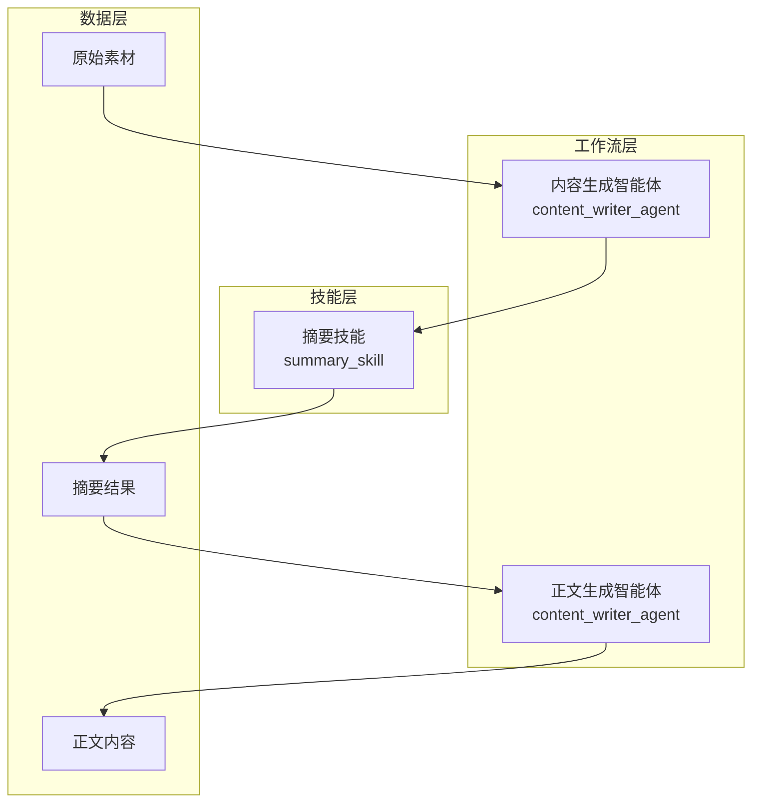
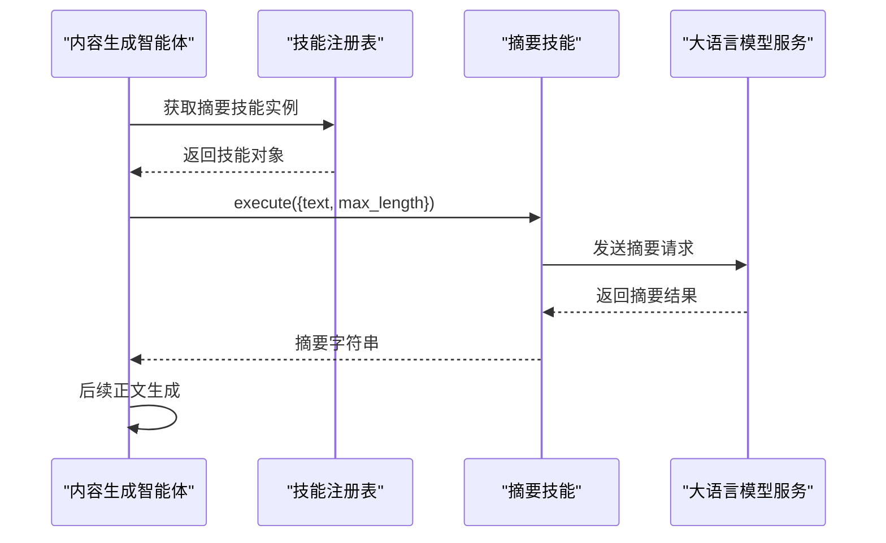
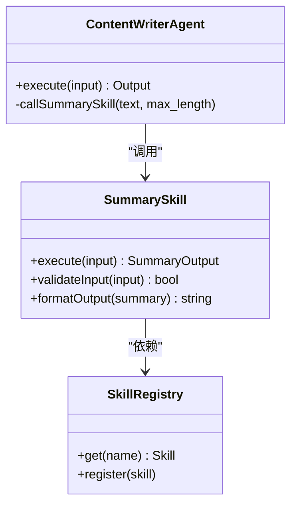
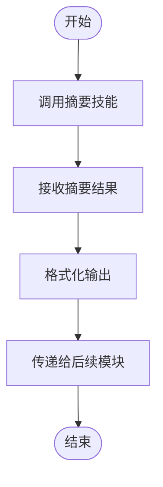
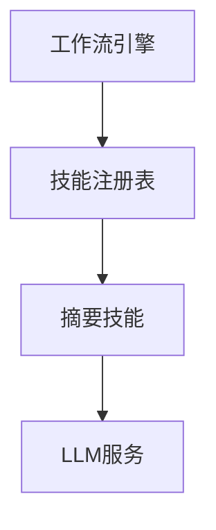

# 摘要技能

<cite>
**本文档引用的文件**
- [ARCHITECTURE.md](file://ARCHITECTURE.md)
- [engine.py](file://backend/app/orchestrator/engine.py)
</cite>

## 目录
1. [简介](#简介)
2. [项目结构](#项目结构)
3. [核心组件](#核心组件)
4. [架构概览](#架构概览)
5. [详细组件分析](#详细组件分析)
6. [依赖分析](#依赖分析)
7. [性能考虑](#性能考虑)
8. [故障排除指南](#故障排除指南)
9. [结论](#结论)
10. [附录](#附录)

## 简介
本文件针对摘要技能（summary_skill）进行深入技术实现文档编制，围绕文本摘要算法、提取策略与质量评估机制展开，覆盖输入文本预处理、关键词提取、句子重要性评分与摘要生成流程。同时对抽取式与生成式两种摘要模式的实现差异与适用场景进行对比说明，并提供技能参数配置、长度控制与质量控制选项，以及实际应用示例、性能基准测试与调优建议。最后阐述该技能在计算复杂度、内存使用与并发处理方面的特性，面向开发者提供完整的技能集成指南与二次开发指导。

## 项目结构
摘要技能作为系统内可复用的原子能力单元，位于技能机制设计之下，由技能注册表统一管理与调度。其在工作流中的典型位置如下：
- 在内容生成智能体（content_writer_agent）中，摘要技能被用于对素材进行压缩，以提升后续正文生成的质量与效率。
- 摘要技能的输入输出定义清晰：输入为文本与最大长度限制，输出为摘要字符串；配置项包括所使用的LLM模型与温度参数等。

**图表来源**
- [ARCHITECTURE.md:611-631](file://ARCHITECTURE.md#L611-L631)

**章节来源**
- [ARCHITECTURE.md:611-631](file://ARCHITECTURE.md#L611-L631)

## 核心组件
- 摘要技能（summary_skill）
  - 输入：text（待摘要文本）、max_length（目标长度上限）
  - 输出：summary（摘要结果）
  - 配置：使用的LLM模型、温度等
  - 实现：调用LLM完成文本摘要任务
- 工作流编排引擎（engine.py）
  - 负责将摘要技能嵌入到内容生成工作流中，确保在正文生成前完成素材压缩
  - 提供摘要输出格式化与错误兜底逻辑

**章节来源**
- [ARCHITECTURE.md:611-631](file://ARCHITECTURE.md#L611-L631)
- [engine.py:272-272](file://backend/app/orchestrator/engine.py#L272-L272)

## 架构概览
摘要技能在系统中的调用关系与职责边界如下：

**图表来源**
- [ARCHITECTURE.md:611-631](file://ARCHITECTURE.md#L611-L631)

## 详细组件分析

### 组件A：摘要技能（summary_skill）
- 角色定位
  - 无状态的原子能力单元，封装具体的摘要处理逻辑
  - 对外提供标准化输入输出接口，不参与业务决策
- 输入输出与配置
  - 输入：text（字符串）、max_length（整数）
  - 输出：summary（字符串）
  - 配置：LLM模型选择、温度参数等
- 实现要点
  - 通过技能注册表动态加载与调用
  - 在工作流中作为前置步骤，对素材进行压缩，降低后续正文生成的负担
- 典型应用场景
  - 新闻/资讯类内容的素材压缩
  - 长文档的快速摘要，便于后续结构化处理

**图表来源**
- [ARCHITECTURE.md:611-631](file://ARCHITECTURE.md#L611-L631)

**章节来源**
- [ARCHITECTURE.md:611-631](file://ARCHITECTURE.md#L611-L631)

### 组件B：工作流编排与摘要输出格式化
- 引擎职责
  - 在内容生成工作流中插入摘要技能调用点
  - 对摘要输出进行格式化与错误兜底处理
- 关键流程
  - 调用摘要技能获取摘要字符串
  - 根据工作流需要对摘要进行进一步处理或直接传递给正文生成模块

**图表来源**
- [engine.py:272-272](file://backend/app/orchestrator/engine.py#L272-L272)

**章节来源**
- [engine.py:272-272](file://backend/app/orchestrator/engine.py#L272-L272)

### 抽取式 vs 生成式摘要模式
- 抽取式摘要
  - 思路：从原文中挑选最具代表性的句子或片段，组合成摘要
  - 特点：事实保持度高、可解释性强、计算开销相对较低
  - 适用：对事实准确性要求高、原文结构清晰的场景
- 生成式摘要
  - 思路：基于语言模型理解原文后重新生成摘要
  - 特点：表达更自然流畅、可扩展性强、但可能存在事实偏差风险
  - 适用：对可读性与表达效果要求高、允许一定事实偏差的场景
- 本系统采用的实现路径
  - 当前摘要技能通过调用LLM实现摘要功能，属于生成式摘要范畴
  - 若需引入抽取式摘要，可在技能内部增加策略切换与参数配置

[本节为概念性说明，不直接分析具体文件]

## 依赖分析
- 组件耦合与协作
  - 摘要技能与技能注册表之间存在运行时依赖，通过名称标识进行解耦
  - 内容生成智能体通过技能注册表间接依赖摘要技能
- 外部依赖
  - LLM服务：摘要技能的核心执行载体
  - 工作流引擎：负责编排与错误处理

**图表来源**
- [ARCHITECTURE.md:611-631](file://ARCHITECTURE.md#L611-L631)

**章节来源**
- [ARCHITECTURE.md:611-631](file://ARCHITECTURE.md#L611-L631)

## 性能考虑
- 计算复杂度
  - 生成式摘要受输入长度与模型参数影响较大，通常为线性或近似线性增长
  - 抽取式摘要复杂度主要取决于句子评分与选择策略，一般为O(n log n)至O(n^2)，视具体算法而定
- 内存使用
  - 生成式摘要在长文本场景下可能产生较大的上下文占用
  - 抽取式摘要内存开销主要来自候选句集合与评分矩阵
- 并发处理
  - 技能调用具备无状态特性，适合多实例并发执行
  - 建议结合工作流引擎的并发配置与资源隔离策略，合理分配CPU与GPU资源

[本节提供通用性能指导，不直接分析具体文件]

## 故障排除指南
- 常见问题
  - 摘要结果为空或异常：检查LLM服务可用性与模型参数设置
  - 摘要过短或过长：调整max_length与模型温度参数
  - 性能瓶颈：优化输入文本长度、启用缓存或分段处理
- 排查步骤
  - 确认技能注册表是否正确加载摘要技能
  - 检查工作流引擎对摘要输出的格式化与传递逻辑
  - 查看日志与监控指标，定位具体环节的耗时与错误

**章节来源**
- [engine.py:272-272](file://backend/app/orchestrator/engine.py#L272-L272)

## 结论
摘要技能作为系统中的关键能力单元，通过调用LLM实现高质量的生成式摘要，有效支撑了内容生成工作流。其无状态设计与标准化接口便于在多智能体场景中复用与扩展。未来可根据业务需求引入抽取式摘要策略，并通过参数化与缓存机制进一步提升性能与稳定性。

[本节为总结性内容，不直接分析具体文件]

## 附录

### 技能参数配置清单
- 输入参数
  - text：待摘要文本（字符串）
  - max_length：目标摘要长度上限（整数）
- 输出参数
  - summary：摘要结果（字符串）
- 配置项
  - LLM模型：选择合适的模型以平衡速度与质量
  - 温度：控制生成多样性与确定性

**章节来源**
- [ARCHITECTURE.md:611-631](file://ARCHITECTURE.md#L611-L631)

### 实际应用示例
- 场景一：新闻素材压缩
  - 输入：长篇新闻正文
  - 参数：max_length根据发布平台限制设定
  - 输出：简洁准确的摘要，供正文生成模块使用
- 场景二：长文档速览
  - 输入：技术白皮书或会议纪要
  - 参数：适度提高max_length以保留关键信息
  - 输出：便于快速浏览的摘要版本

[本节为示例说明，不直接分析具体文件]

### 性能基准测试与调优建议
- 基准测试
  - 测试不同长度文本在相同max_length下的响应时间与吞吐量
  - 对比生成式与抽取式摘要在准确性与速度上的差异
- 调优建议
  - 合理设置max_length，避免过度截断关键信息
  - 在长文本场景下采用分段摘要再合并的策略
  - 结合缓存与并发配置，提升整体吞吐能力

[本节提供通用方法论，不直接分析具体文件]