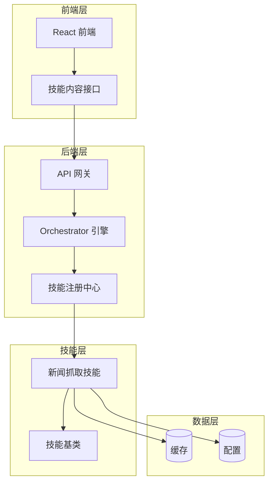
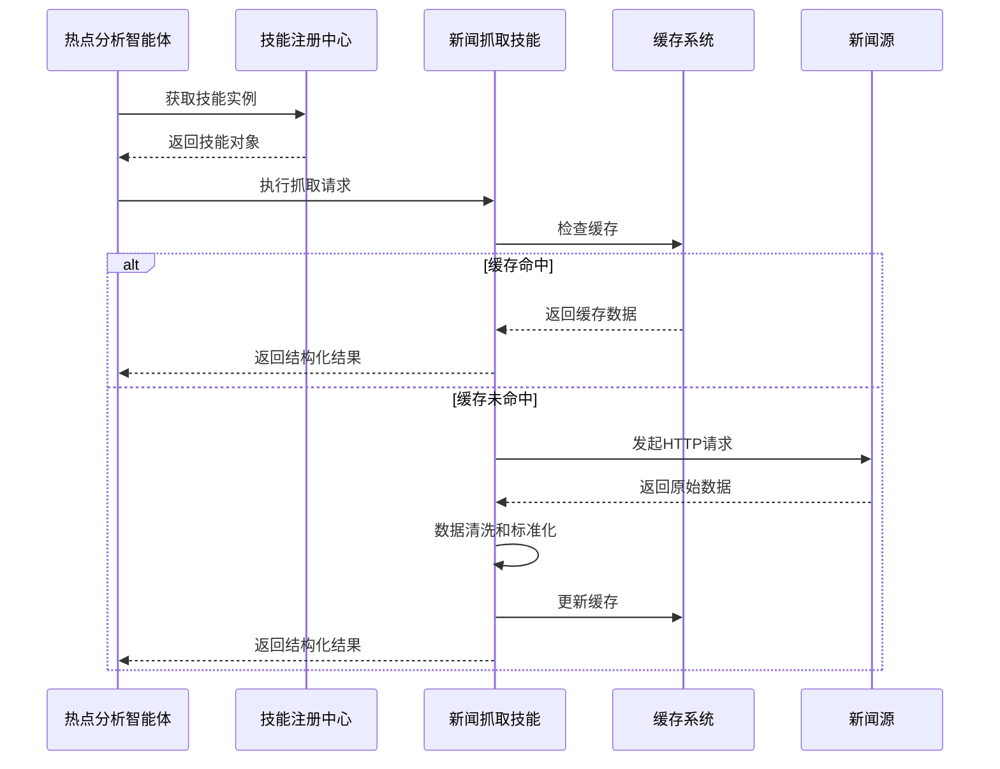
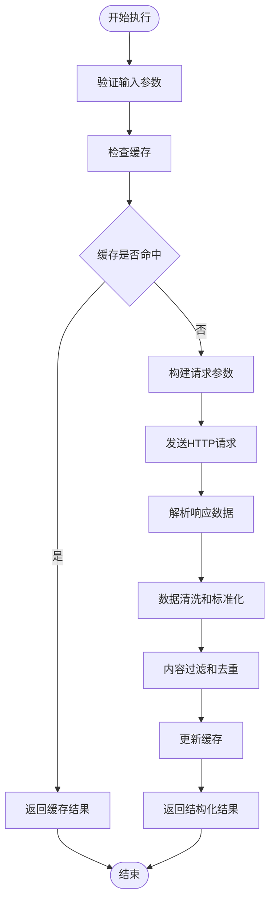
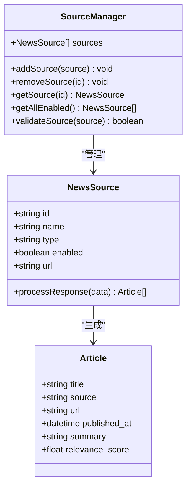
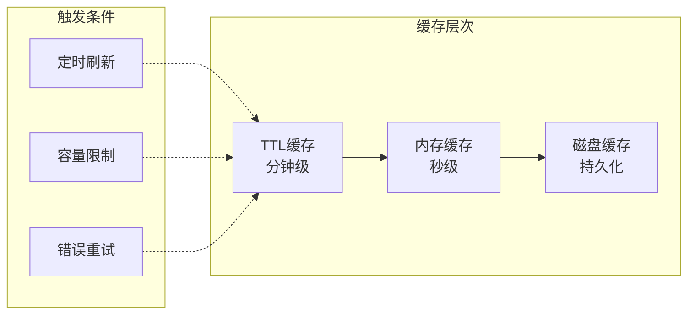
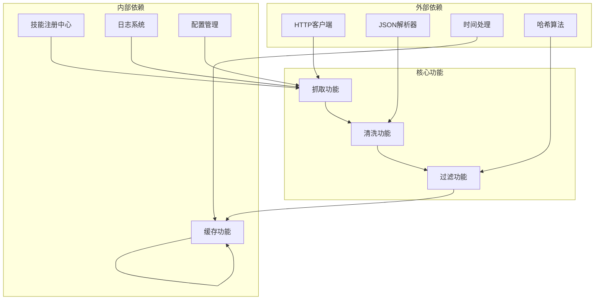

# 新闻抓取技能

<cite>
**本文引用的文件**
- [架构设计文档](file://ARCHITECTURE.md)
- [技能基类](file://backend/app/skills/base.py)
- [技能注册中心](file://backend/app/skills/registry.py)
- [技能配置模型](file://backend/app/schemas/skill.py)
- [热点分析智能体](file://backend/app/agents/hot_topic_agent.py)
- [Orchestrator 引擎](file://backend/app/orchestrator/engine.py)
- [前端技能页面](file://OpenClaw-bot-review-main/app/skills/page.tsx)
- [前端技能内容接口](file://OpenClaw-bot-review-main/app/api/skills/content/route.ts)
</cite>

## 目录
1. [简介](#简介)
2. [项目结构](#项目结构)
3. [核心组件](#核心组件)
4. [架构概览](#架构概览)
5. [详细组件分析](#详细组件分析)
6. [依赖分析](#依赖分析)
7. [性能考虑](#性能考虑)
8. [故障排除指南](#故障排除指南)
9. [结论](#结论)
10. [附录](#附录)

## 简介
新闻抓取技能（news_fetcher_skill）是 HotClaw 多智能体内容生产平台中的原子能力组件，负责从多个新闻源抓取热点新闻并进行结构化输出。该技能遵循无状态、可复用的设计原则，通过声明式配置实现灵活的新闻源管理和缓存策略。

## 项目结构
基于架构文档和现有代码分析，新闻抓取技能在系统中的位置如下：



**图表来源**
- [架构设计文档](file://ARCHITECTURE.md)
- [技能注册中心](file://backend/app/skills/registry.py)
- [技能基类](file://backend/app/skills/base.py)

**章节来源**
- [架构设计文档](file://ARCHITECTURE.md)
- [技能注册中心](file://backend/app/skills/registry.py)

## 核心组件
新闻抓取技能的核心组件包括：

### 技能基类
技能基类定义了所有技能的抽象接口和通用属性：
- `skill_id`: 技能唯一标识符
- `name`: 技能名称
- `description`: 技能描述
- `execute()`: 异步执行方法
- `config`: 配置参数字典

### 技能注册中心
负责技能实例的注册、查找和管理：
- `register()`: 注册技能实例
- `get()`: 获取指定技能
- `list_all()`: 列出所有技能
- `has()`: 检查技能是否存在

### 技能配置模型
提供技能配置的标准化表示：
- `SkillInfo`: 技能基本信息
- `SkillListResponse`: 技能列表响应
- `SkillConfigUpdateRequest`: 技能配置更新请求

**章节来源**
- [技能基类](file://backend/app/skills/base.py)
- [技能注册中心](file://backend/app/skills/registry.py)
- [技能配置模型](file://backend/app/schemas/skill.py)

## 架构概览
新闻抓取技能在整个系统架构中的作用和交互关系：



**图表来源**
- [热点分析智能体](file://backend/app/agents/hot_topic_agent.py)
- [技能注册中心](file://backend/app/skills/registry.py)

**章节来源**
- [架构设计文档](file://ARCHITECTURE.md)
- [热点分析智能体](file://backend/app/agents/hot_topic_agent.py)

## 详细组件分析

### 技能输入输出规范
根据架构文档定义，新闻抓取技能的输入输出规范如下：

#### 输入参数格式
- `keywords`: string[] - 关键词数组，用于过滤相关新闻
- `domain`: string - 账号领域，用于确定新闻相关性
- `max_items`: integer - 最大返回数量，默认10

#### 输出数据结构
- `articles`: array - 新闻文章数组
  - `title`: string - 文章标题
  - `source`: string - 新闻来源
  - `url`: string - 文章链接
  - `published_at`: string - 发布时间
  - `summary`: string - 文章摘要

#### 配置参数
- `sources`: array - 新闻源配置
  - `id`: string - 源标识符
  - `name`: string - 源名称
  - `type`: string - 源类型（api）
  - `enabled`: boolean - 是否启用
- `cache_ttl_seconds`: integer - 缓存过期时间（秒）
- `request_timeout_seconds`: integer - 请求超时时间（秒）
- `max_concurrent_requests`: integer - 最大并发请求数

### 技能执行流程
新闻抓取技能的执行流程包括以下步骤：



**图表来源**
- [架构设计文档](file://ARCHITECTURE.md)

### 新闻源识别机制
技能通过配置化的新闻源列表实现多源抓取：



**图表来源**
- [架构设计文档](file://ARCHITECTURE.md)

### 内容提取算法
技能采用多阶段的内容提取和处理算法：

1. **关键词匹配**: 基于输入关键词对新闻标题进行相关性评分
2. **去重算法**: 使用标题相似度计算和URL哈希进行重复内容过滤
3. **质量评估**: 通过发布时间、来源可信度等因素评估内容质量
4. **标准化处理**: 统一数据格式和字段结构

### 缓存策略
实现多层次的缓存机制以提高性能：



**图表来源**
- [架构设计文档](file://ARCHITECTURE.md)

**章节来源**
- [架构设计文档](file://ARCHITECTURE.md)

## 依赖分析
新闻抓取技能的依赖关系和耦合度分析：



**图表来源**
- [技能注册中心](file://backend/app/skills/registry.py)
- [技能基类](file://backend/app/skills/base.py)

**章节来源**
- [技能注册中心](file://backend/app/skills/registry.py)
- [技能基类](file://backend/app/skills/base.py)

## 性能考虑
基于架构设计文档的性能优化参数：

### 并发处理能力
- `max_concurrent_requests`: 3 - 控制同时发起的HTTP请求数量
- `request_timeout_seconds`: 10 - 单个请求的最大等待时间
- `cache_ttl_seconds`: 300 - 缓存数据的有效期（5分钟）

### 资源消耗优化
- **内存使用**: 采用流式处理避免大文件内存占用
- **网络带宽**: 通过缓存减少重复网络请求
- **CPU开销**: 并行处理多个新闻源，但受并发数限制

### 扩展性设计
- **水平扩展**: 支持动态添加新的新闻源
- **垂直扩展**: 可调整并发数和缓存策略
- **配置驱动**: 通过YAML配置实现功能开关和参数调节

## 故障排除指南
针对新闻抓取技能可能出现的问题提供解决方案：

### 常见问题及解决方法

#### 技能未找到
**症状**: 调用技能时报技能不存在错误
**原因**: 技能未正确注册到注册中心
**解决**: 检查技能manifest文件和注册流程

#### 抓取超时
**症状**: 请求超过设定超时时间
**原因**: 网络延迟或目标服务器响应慢
**解决**: 调整`request_timeout_seconds`参数

#### 缓存失效
**症状**: 缓存数据过期或不准确
**原因**: 缓存策略配置不当
**解决**: 调整`cache_ttl_seconds`参数

#### 内容重复
**症状**: 返回结果中存在重复新闻
**原因**: 去重算法不够严格
**解决**: 优化去重逻辑和相似度阈值

**章节来源**
- [技能注册中心](file://backend/app/skills/registry.py)
- [架构设计文档](file://ARCHITECTURE.md)

## 结论
新闻抓取技能作为HotClaw平台的核心原子能力，通过模块化设计实现了高度的可复用性和可维护性。其基于配置的声明式架构使得技能能够灵活适应不同的业务场景，而完善的缓存和并发控制机制确保了系统的高性能运行。

技能的设计充分体现了HotClaw的架构理念：无状态、可复用、可配置、可观测。通过与其他技能的协同配合，为整个内容生产流水线提供了可靠的数据基础。

## 附录

### 实际使用示例
基于架构文档中的示例，展示技能的实际调用方式：

```typescript
// 前端调用示例
const response = await fetch('/api/skills/content?source=news_fetcher&id=1');
const content = await response.json();

// 后端调用示例
const newsSkill = skillRegistry.get('news_fetcher_skill');
const skillInput = new NewsFetcherInput({
    keywords: ['AI', '人工智能'],
    domain: '科技',
    max_items: 20
});
const result = await newsSkill.execute(skillInput);
```

### 集成模式
技能支持多种集成模式：

1. **直接调用**: Agent直接通过注册中心获取技能实例
2. **配置驱动**: 通过YAML配置文件声明式注册
3. **动态扩展**: 运行时动态添加新的新闻源

### 开发建议
对于开发者自定义开发的建议：

1. **遵循基类接口**: 确保实现`execute`方法和必要的配置参数
2. **错误处理**: 实现完善的异常捕获和降级策略
3. **性能优化**: 合理设置并发数和缓存策略
4. **监控告警**: 添加必要的日志记录和性能指标

**章节来源**
- [前端技能页面](file://OpenClaw-bot-review-main/app/skills/page.tsx)
- [前端技能内容接口](file://OpenClaw-bot-review-main/app/api/skills/content/route.ts)
- [架构设计文档](file://ARCHITECTURE.md)