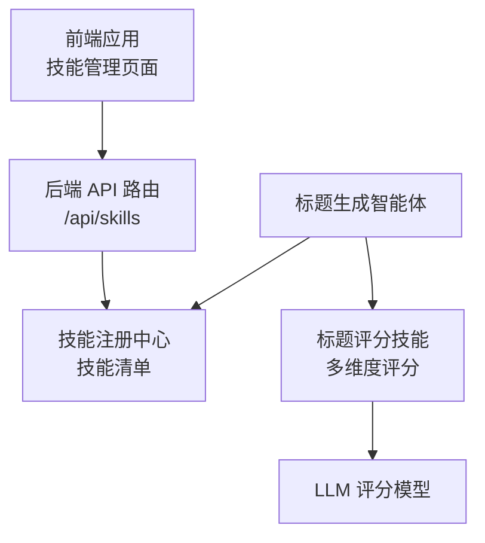
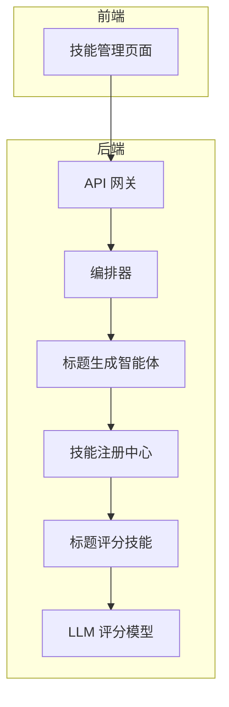
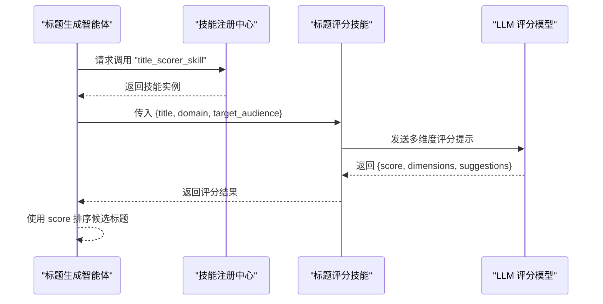
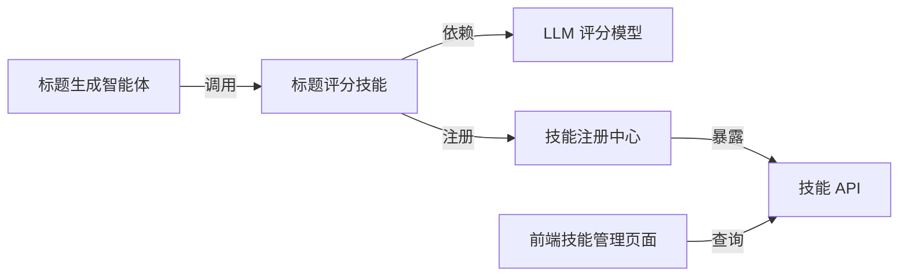

# 标题评分技能

<cite>
**本文引用的文件**   
- [架构设计文档](file://ARCHITECTURE.md)
- [技能管理页面](file://frontend/app/settings/skills/page.tsx)
- [技能 API 路由](file://OpenClaw-bot-review-main/app/api/skills/route.ts)
- [Notice.md](file://Notice.md)
</cite>

## 目录
1. [引言](#引言)
2. [项目结构](#项目结构)
3. [核心组件](#核心组件)
4. [架构总览](#架构总览)
5. [详细组件分析](#详细组件分析)
6. [依赖分析](#依赖分析)
7. [性能考量](#性能考量)
8. [故障排查指南](#故障排查指南)
9. [结论](#结论)
10. [附录](#附录)

## 引言
本文件围绕“标题评分技能”（title_scorer_skill）提供面向开发者的完整实现文档。根据架构设计文档，标题评分技能位于“技能层”，为“标题生成智能体”提供多维度评分与建议，输入包含标题文本、领域标签与目标受众描述，输出包含综合分数、四个维度（吸引力、相关性、情感强度、清晰度）以及改进建议列表。本文将从系统架构、组件关系、数据流、处理逻辑、集成点、错误处理与性能特征等方面进行深入解析，并给出评分维度的计算思路、权重配置建议、A/B 测试与持续优化机制，以及面向开发者的算法调优指导。

## 项目结构
- 后端采用“网关-编排器-智能体-技能”的分层架构，技能层提供无状态的原子能力，供智能体组合调用。
- 标题评分技能在工作流中由“标题生成智能体”调用，用于对候选标题进行质量评估与排序。
- 前端提供技能管理页面与 API 路由，用于列出与配置已注册技能。

图表来源
- [架构设计文档](file://ARCHITECTURE.md)
- [技能管理页面](file://frontend/app/settings/skills/page.tsx)
- [技能 API 路由](file://OpenClaw-bot-review-main/app/api/skills/route.ts)

章节来源
- [架构设计文档](file://ARCHITECTURE.md)
- [技能管理页面](file://frontend/app/settings/skills/page.tsx)
- [技能 API 路由](file://OpenClaw-bot-review-main/app/api/skills/route.ts)

## 核心组件
- 标题评分技能（title_scorer_skill）
  - 输入：标题文本、领域标签、目标受众描述
  - 输出：综合分数、四个维度评分、改进建议列表
  - 实现：调用 LLM 进行多维度评分（架构文档中明确指出）
- 标题生成智能体（title_generator_agent）
  - 依赖：标题评分技能
  - 作用：生成候选标题并调用评分技能进行排序与筛选
- 技能注册中心与 API
  - 提供技能清单查询与配置更新接口，便于在运行期调整评分模型与权重

章节来源
- [架构设计文档](file://ARCHITECTURE.md)

## 架构总览
标题评分技能在整体内容生产流水线中的位置如下：

图表来源
- [架构设计文档](file://ARCHITECTURE.md)
- [技能管理页面](file://frontend/app/settings/skills/page.tsx)

## 详细组件分析

### 标题评分技能（title_scorer_skill）
- 角色与职责
  - 作为无状态技能，接收标题文本、领域标签与目标受众描述，输出综合分数与四个维度评分及改进建议。
  - 为标题生成智能体提供排序依据，提升候选标题质量。
- 输入输出规范
  - 输入：标题文本、领域标签、目标受众描述
  - 输出：综合分数、四个维度评分、改进建议列表
- 实现要点
  - 调用 LLM 进行多维度评分（架构文档明确）
  - 评分维度包含吸引力、相关性、情感强度、清晰度
  - 输出包含具体的改进建议，便于后续标题优化
- 与编排器/智能体的交互
  - 由标题生成智能体在生成候选标题后调用，作为排序与筛选的关键步骤
  - 若评分失败，智能体具备降级策略（例如跳过评分仅输出标题文本）

图表来源
- [架构设计文档](file://ARCHITECTURE.md)

章节来源
- [架构设计文档](file://ARCHITECTURE.md)

### 标题生成智能体（title_generator_agent）
- 依赖：标题评分技能
- 作用：生成候选标题并调用评分技能进行排序与筛选
- 降级策略：当评分技能失败时，跳过评分，仅输出标题文本

章节来源
- [架构设计文档](file://ARCHITECTURE.md)

### 技能注册中心与 API
- 技能清单查询：前端通过 API 获取已注册技能列表，便于查看与管理
- 配置更新：支持在运行期更新技能配置（如评分模型、维度权重等）

章节来源
- [技能管理页面](file://frontend/app/settings/skills/page.tsx)
- [技能 API 路由](file://OpenClaw-bot-review-main/app/api/skills/route.ts)
- [架构设计文档](file://ARCHITECTURE.md)

## 依赖分析
- 组件耦合与内聚
  - 标题评分技能为无状态原子能力，内聚于评分任务，耦合度低，便于独立演进与替换
  - 标题生成智能体通过技能注册中心调用评分技能，解耦于具体实现细节
- 直接与间接依赖
  - 直接依赖：LLM 评分模型
  - 间接依赖：编排器、技能注册中心、API 网关
- 外部依赖与集成点
  - LLM 评分模型作为外部服务，通过统一的技能接口进行调用
- 接口契约
  - 输入输出均为结构化 JSON Schema，确保强约束与可审计性

图表来源
- [架构设计文档](file://ARCHITECTURE.md)
- [技能管理页面](file://frontend/app/settings/skills/page.tsx)
- [技能 API 路由](file://OpenClaw-bot-review-main/app/api/skills/route.ts)

章节来源
- [架构设计文档](file://ARCHITECTURE.md)
- [技能管理页面](file://frontend/app/settings/skills/page.tsx)
- [技能 API 路由](file://OpenClaw-bot-review-main/app/api/skills/route.ts)

## 性能考量
- 评分延迟与并发
  - 标题评分技能为无状态调用，可在编排器中并行触发，以降低整体等待时间
- LLM 调用成本
  - 评分维度越多，提示词越复杂，调用成本越高；可通过维度裁剪与缓存策略平衡质量与成本
- 缓存与降级
  - 对常见标题或相似标题可引入缓存，减少重复评分
  - 评分失败时采用降级策略（跳过评分），保证流水线不中断
- 可观测性
  - 记录评分耗时、维度得分、建议命中率等指标，支撑持续优化

## 故障排查指南
- 常见问题
  - LLM 调用失败：检查模型密钥、网络连通性与限流配置
  - 技能未注册：确认技能清单接口返回状态与版本
  - 评分结果为空：检查输入字段完整性与 JSON Schema 校验
- 诊断步骤
  - 通过前端技能管理页面查看技能状态
  - 使用技能 API 获取技能清单与配置
  - 在编排器日志中定位节点错误与降级分支
- 降级策略
  - 标题生成智能体在评分失败时跳过评分，继续输出标题文本，避免阻断

章节来源
- [架构设计文档](file://ARCHITECTURE.md)
- [技能管理页面](file://frontend/app/settings/skills/page.tsx)
- [技能 API 路由](file://OpenClaw-bot-review-main/app/api/skills/route.ts)

## 结论
标题评分技能作为内容生产流水线中的关键质量控制环节，通过多维度评分与改进建议，显著提升了候选标题的吸引力与相关性。其无状态、可配置的设计使其易于在不同场景与账号画像下复用与优化。结合 A/B 测试与持续优化机制，可逐步提升评分准确性与业务指标表现。

## 附录

### 评分维度与权重配置建议
- 维度说明（基于架构文档的四个维度）
  - 吸引力：标题是否具有点击冲动与话题性
  - 相关性：标题与领域标签、目标受众的契合度
  - 情感强度：标题传达的情绪与感染力
  - 清晰度：标题表达是否简洁明确、无歧义
- 权重配置
  - 建议采用“领域 + 受众 + 业务指标”驱动的动态权重法：以历史点击率、转化率等指标反哺权重调整
  - 支持按账号画像与热点主题进行分组加权
- 评分范围与阈值
  - 综合分数建议归一化至 0~1 区间，设定阈值用于筛选与排序

### 标题生成建议与 A/B 测试
- 标题生成建议
  - 基于评分建议列表进行迭代：突出关键词、增强情绪词、简化表达
  - 引入“新鲜度”与“独特性”提示词，鼓励时效性与差异化表达
- A/B 测试
  - 对比不同评分模型、维度权重与提示词模板的效果
  - 以点击率、阅读时长、转发率等指标评估标题质量
- 持续优化机制
  - 建立评分指标看板，跟踪维度得分分布与建议命中率
  - 定期回放任务，人工抽检高分/低分样本，修正评分策略

### 算法调优指导
- 提示词工程
  - 明确评分维度的定义与示例，避免歧义
  - 引入“评分打分卡”与“反向推理”提示，提升稳定性
- 模型选择与参数
  - 根据成本与精度选择合适模型；必要时采用多模型融合
  - 调整温度与最大令牌数，平衡多样性与确定性
- 数据与反馈
  - 建立正负样本库，定期更新评分模板
  - 通过用户行为与业务指标反馈，迭代维度权重与阈值

### 学习能力、适应性与个性化
- 学习能力
  - 通过历史任务回放与指标回溯，识别评分偏差与改进方向
- 适应性
  - 支持按账号领域、受众画像与热点主题的动态适配
- 个性化推荐
  - 基于账号画像与历史偏好，定制评分维度权重与建议风格